```r
library(tidyverse)     # for graphing and data cleaning
```

```
## ── Attaching packages ────────────────────────────────────────────────────────────────────────────── tidyverse 1.3.0 ──
```

```
## ✓ ggplot2 3.3.2     ✓ purrr   0.3.4
## ✓ tibble  3.0.3     ✓ dplyr   1.0.2
## ✓ tidyr   1.1.2     ✓ stringr 1.4.0
## ✓ readr   1.3.1     ✓ forcats 0.5.0
```

```
## ── Conflicts ───────────────────────────────────────────────────────────────────────────────── tidyverse_conflicts() ──
## x dplyr::filter() masks stats::filter()
## x dplyr::lag()    masks stats::lag()
```

```r
library(googlesheets4) # for reading googlesheet data
library(lubridate)     # for date manipulation
```

```
## 
## Attaching package: 'lubridate'
```

```
## The following objects are masked from 'package:base':
## 
##     date, intersect, setdiff, union
```

```r
library(ggthemes)      # for even more plotting themes
library(geofacet)      # for special faceting with US map layout
gs4_deauth()           # To not have to authorize each time you knit.
theme_set(theme_minimal())       # My favorite ggplot() theme :)
```


```r
#Lisa's garden data
garden_harvest <- read_sheet("https://docs.google.com/spreadsheets/d/1DekSazCzKqPS2jnGhKue7tLxRU3GVL1oxi-4bEM5IWw/edit?usp=sharing") %>% 
  mutate(date = ymd(date))
```

```
## Reading from "2020_harvest"
```

```
## Range "Sheet1"
```

```r
# Seeds/plants (and other garden supply) costs
supply_costs <- read_sheet("https://docs.google.com/spreadsheets/d/1dPVHwZgR9BxpigbHLnA0U99TtVHHQtUzNB9UR0wvb7o/edit?usp=sharing",
  col_types = "ccccnn")
```

```
## Reading from "2020_seeds"
## Range "Sheet1"
```

```r
# Planting dates and locations
plant_date_loc <- read_sheet("https://docs.google.com/spreadsheets/d/11YH0NtXQTncQbUse5wOsTtLSKAiNogjUA21jnX5Pnl4/edit?usp=sharing",
  col_types = "cccnDlc")%>% 
  mutate(date = ymd(date))
```

```
## Reading from "seeds_planted"
## Range "Sheet1"
```

```
## Warning in .Primitive("as.double")(x, ...): NAs introduced by coercion
```

```r
# Tidy Tuesday data
kids <- readr::read_csv('https://raw.githubusercontent.com/rfordatascience/tidytuesday/master/data/2020/2020-09-15/kids.csv')
```

```
## Parsed with column specification:
## cols(
##   state = col_character(),
##   variable = col_character(),
##   year = col_double(),
##   raw = col_double(),
##   inf_adj = col_double(),
##   inf_adj_perchild = col_double()
## )
```

## Setting up on GitHub!

Before starting your assignment, you need to get yourself set up on GitHub and make sure GitHub is connected to R Studio. To do that, you should read the instruction (through the "Cloning a repo" section) and watch the video [here](https://github.com/llendway/github_for_collaboration/blob/master/github_for_collaboration.md). Then, do the following (if you get stuck on a step, don't worry, I will help! You can always get started on the homework and we can figure out the GitHub piece later):

* Create a repository on GitHub, giving it a nice name so you know it is for the 3rd weekly exercise assignment (follow the instructions in the document/video).  
* Copy the repo name so you can clone it to your computer. In R Studio, go to file --> New project --> Version control --> Git and follow the instructions from the document/video.  
* Download the code from this document and save it in the repository folder/project on your computer.  
* In R Studio, you should then see the .Rmd file in the upper right corner in the Git tab (along with the .Rproj file and probably .gitignore).  
* Check all the boxes of the files in the Git tab and choose commit.  
* In the commit window, write a commit message, something like "Initial upload" would be appropriate, and commit the files.  
* Either click the green up arrow in the commit window or close the commit window and click the green up arrow in the Git tab to push your changes to GitHub.  
* Refresh your GitHub page (online) and make sure the new documents have been pushed out.  
* Back in R Studio, knit the .Rmd file. When you do that, you should have two (as long as you didn't make any changes to the .Rmd file, in which case you might have three) files show up in the Git tab - an .html file and an .md file. The .md file is something we haven't seen before and is here because I included `keep_md: TRUE` in the YAML heading. The .md file is a markdown (NOT R Markdown) file that is an interim step to creating the html file. They are displayed fairly nicely in GitHub, so we want to keep it and look at it there. Click the boxes next to these two files, commit changes (remember to include a commit message), and push them (green up arrow).  
* As you work through your homework, save and commit often, push changes occasionally (maybe after you feel finished with an exercise?), and go check to see what the .md file looks like on GitHub.  
* If you have issues, let me know! This is new to many of you and may not be intuitive at first. But, I promise, you'll get the hang of it! 


## Instructions

* Put your name at the top of the document. 

* **For ALL graphs, you should include appropriate labels.** 

* Feel free to change the default theme, which I currently have set to `theme_minimal()`. 

* Use good coding practice. Read the short sections on good code with [pipes](https://style.tidyverse.org/pipes.html) and [ggplot2](https://style.tidyverse.org/ggplot2.html). **This is part of your grade!**

* When you are finished with ALL the exercises, uncomment the options at the top so your document looks nicer. Don't do it before then, or else you might miss some important warnings and messages.


## Warm-up exercises with garden data

These exercises will reiterate what you learned in the "Expanding the data wrangling toolkit" tutorial. If you haven't gone through the tutorial yet, you should do that first.

  1. Summarize the `garden_harvest` data to find the total harvest weight in pounds for each vegetable and day of week. Display the results so that the vegetables are rows but the days of the week are columns.


```r
garden_harvest %>%
  mutate(weight_lbs = weight*0.00220462, day_week = wday(date, label=TRUE)) %>%
  group_by(day_week, vegetable) %>%
  summarize(total_harvest = sum(weight_lbs)) %>%
  pivot_wider(id_cols=vegetable,
              names_from=day_week,
              values_from=total_harvest,
              values_fill = 0)
```

```
## `summarise()` regrouping output by 'day_week' (override with `.groups` argument)
```

<div data-pagedtable="false">
  <script data-pagedtable-source type="application/json">
{"columns":[{"label":["vegetable"],"name":[1],"type":["chr"],"align":["left"]},{"label":["Sun"],"name":[2],"type":["dbl"],"align":["right"]},{"label":["Mon"],"name":[3],"type":["dbl"],"align":["right"]},{"label":["Tue"],"name":[4],"type":["dbl"],"align":["right"]},{"label":["Wed"],"name":[5],"type":["dbl"],"align":["right"]},{"label":["Thu"],"name":[6],"type":["dbl"],"align":["right"]},{"label":["Fri"],"name":[7],"type":["dbl"],"align":["right"]},{"label":["Sat"],"name":[8],"type":["dbl"],"align":["right"]}],"data":[{"1":"beans","2":"1.52780166","3":"6.5080382","4":"4.38719380","5":"4.08295624","6":"3.39291018","7":"1.52559704","8":"4.70906832"},{"1":"beets","2":"0.32187452","3":"0.6724091","4":"0.15873264","5":"0.18298346","6":"11.89172028","7":"0.02425082","8":"0.37919464"},{"1":"corn","2":"1.45725382","3":"0.7583893","4":"0.72752460","5":"5.30211110","6":"0.00000000","7":"3.44802568","8":"1.31615814"},{"1":"cucumbers","2":"3.10410496","3":"4.7752069","4":"10.04645334","5":"5.30652034","6":"3.30693000","7":"7.42956940","8":"9.64080326"},{"1":"kale","2":"0.38139926","3":"1.7659006","4":"0.28219136","5":"0.61729360","6":"0.00000000","7":"0.00000000","8":"1.49032312"},{"1":"lettuce","2":"1.15963012","3":"2.4581513","4":"0.91712192","5":"1.14860702","6":"2.45153744","7":"1.80117454","8":"1.10671924"},{"1":"onions","2":"0.26014516","3":"0.5092672","4":"0.70768302","5":"0.00000000","6":"0.60186126","7":"0.07275246","8":"1.34040896"},{"1":"peas","2":"2.05691046","3":"4.6341112","4":"2.06793356","5":"1.08026380","6":"3.39731942","7":"0.93696350","8":"2.85277828"},{"1":"radish","2":"0.08157094","3":"0.1962112","4":"0.09479866","5":"0.00000000","6":"0.14770954","7":"0.19400656","8":"0.23148510"},{"1":"spinach","2":"0.48722102","3":"0.1477095","4":"0.49603950","5":"0.21384814","6":"0.23368972","7":"0.19621118","8":"0.26014516"},{"1":"strawberries","2":"0.08157094","3":"0.4784025","4":"0.00000000","5":"0.00000000","6":"0.08818480","7":"0.48722102","8":"0.16975574"},{"1":"Swiss chard","2":"0.73634308","3":"1.0736499","4":"0.07054784","5":"0.71429688","6":"2.23107544","7":"0.56438272","8":"0.00000000"},{"1":"tomatoes","2":"63.68485794","3":"9.7091465","4":"48.75076206","5":"31.55913530","6":"34.51773534","7":"58.67596130","8":"25.94396816"},{"1":"zucchini","2":"12.23564100","3":"12.1959578","4":"16.46851140","5":"2.04147812","6":"5.74964896","7":"18.72163304","8":"3.41495638"},{"1":"basil","2":"0.00000000","3":"0.0661386","4":"0.11023100","5":"0.00000000","6":"0.02645544","7":"0.46737944","8":"0.41005932"},{"1":"broccoli","2":"0.00000000","3":"0.8201186","4":"0.00000000","5":"0.70768302","6":"0.00000000","7":"0.00000000","8":"0.00000000"},{"1":"carrots","2":"0.00000000","3":"0.8708249","4":"0.35273920","5":"0.00000000","6":"2.67420406","7":"2.13848140","8":"2.33028334"},{"1":"hot peppers","2":"0.00000000","3":"1.2588380","4":"0.14109568","5":"0.06834322","6":"0.00000000","7":"0.00000000","8":"0.00000000"},{"1":"jalapeño","2":"0.00000000","3":"0.4343101","4":"0.54895038","5":"0.09479866","6":"0.22487124","7":"1.29411194","8":"0.93916812"},{"1":"peppers","2":"0.00000000","3":"0.2535313","4":"1.44402610","5":"0.94798660","6":"0.70988764","7":"0.14991416","8":"1.38229674"},{"1":"potatoes","2":"0.00000000","3":"0.9700328","4":"0.00000000","5":"4.57017726","6":"1.66669272","7":"0.00000000","8":"2.15611836"},{"1":"raspberries","2":"0.00000000","3":"0.1300726","4":"0.33510224","5":"0.00000000","6":"0.28880522","7":"0.57099658","8":"0.53351804"},{"1":"cilantro","2":"0.00000000","3":"0.0000000","4":"0.00440924","5":"0.00000000","6":"0.00000000","7":"0.07275246","8":"0.03747854"},{"1":"edamame","2":"0.00000000","3":"0.0000000","4":"1.40213832","5":"0.00000000","6":"0.00000000","7":"0.00000000","8":"4.68922674"},{"1":"pumpkins","2":"0.00000000","3":"0.0000000","4":"31.85675900","5":"0.00000000","6":"0.00000000","7":"0.00000000","8":"92.68883866"},{"1":"squash","2":"0.00000000","3":"0.0000000","4":"18.46810174","5":"0.00000000","6":"0.00000000","7":"0.00000000","8":"56.22221924"},{"1":"chives","2":"0.00000000","3":"0.0000000","4":"0.00000000","5":"0.01763696","6":"0.00000000","7":"0.00000000","8":"0.00000000"},{"1":"kohlrabi","2":"0.00000000","3":"0.0000000","4":"0.00000000","5":"0.00000000","6":"0.42108242","7":"0.00000000","8":"0.00000000"},{"1":"asparagus","2":"0.00000000","3":"0.0000000","4":"0.00000000","5":"0.00000000","6":"0.00000000","7":"0.00000000","8":"0.04409240"}],"options":{"columns":{"min":{},"max":[10]},"rows":{"min":[10],"max":[10]},"pages":{}}}
  </script>
</div>

  2. Summarize the `garden_harvest` data to find the total harvest in pound for each vegetable variety and then try adding the `plot` variable from the `plant_date_loc` table. This will not turn out perfectly. What is the problem? How might you fix it?


```r
garden_plant <- garden_harvest %>%
  group_by(vegetable, variety, date) %>%
  mutate(weight_lbs = weight*0.00220462) %>%
  summarize(total_harvest = sum(weight_lbs))
```

```
## `summarise()` regrouping output by 'vegetable', 'variety' (override with `.groups` argument)
```

```r
garden_plant %>%
  left_join(plant_date_loc,
             by = "vegetable", "variety")
```

<div data-pagedtable="false">
  <script data-pagedtable-source type="application/json">
{"columns":[{"label":["vegetable"],"name":[1],"type":["chr"],"align":["left"]},{"label":["variety.x"],"name":[2],"type":["chr"],"align":["left"]},{"label":["date.x"],"name":[3],"type":["date"],"align":["right"]},{"label":["total_harvest"],"name":[4],"type":["dbl"],"align":["right"]},{"label":["plot"],"name":[5],"type":["chr"],"align":["left"]},{"label":["variety.y"],"name":[6],"type":["chr"],"align":["left"]},{"label":["number_seeds_planted"],"name":[7],"type":["dbl"],"align":["right"]},{"label":["date.y"],"name":[8],"type":["date"],"align":["right"]},{"label":["number_seeds_exact"],"name":[9],"type":["lgl"],"align":["right"]},{"label":["notes"],"name":[10],"type":["chr"],"align":["left"]}],"data":[{"1":"asparagus","2":"asparagus","3":"2020-06-20","4":"0.04409240","5":"NA","6":"NA","7":"NA","8":"<NA>","9":"NA","10":"NA"},{"1":"basil","2":"Isle of Naxos","3":"2020-06-23","4":"0.01102310","5":"potB","6":"Isle of Naxos","7":"40","8":"2020-05-16","9":"FALSE","10":"NA"},{"1":"basil","2":"Isle of Naxos","3":"2020-07-03","4":"0.01984158","5":"potB","6":"Isle of Naxos","7":"40","8":"2020-05-16","9":"FALSE","10":"NA"},{"1":"basil","2":"Isle of Naxos","3":"2020-07-06","4":"0.03747854","5":"potB","6":"Isle of Naxos","7":"40","8":"2020-05-16","9":"FALSE","10":"NA"},{"1":"basil","2":"Isle of Naxos","3":"2020-07-07","4":"0.02425082","5":"potB","6":"Isle of Naxos","7":"40","8":"2020-05-16","9":"FALSE","10":"NA"},{"1":"basil","2":"Isle of Naxos","3":"2020-07-10","4":"0.33069300","5":"potB","6":"Isle of Naxos","7":"40","8":"2020-05-16","9":"FALSE","10":"NA"},{"1":"basil","2":"Isle of Naxos","3":"2020-07-17","4":"0.03527392","5":"potB","6":"Isle of Naxos","7":"40","8":"2020-05-16","9":"FALSE","10":"NA"},{"1":"basil","2":"Isle of Naxos","3":"2020-07-21","4":"0.01543234","5":"potB","6":"Isle of Naxos","7":"40","8":"2020-05-16","9":"FALSE","10":"NA"},{"1":"basil","2":"Isle of Naxos","3":"2020-07-24","4":"0.00661386","5":"potB","6":"Isle of Naxos","7":"40","8":"2020-05-16","9":"FALSE","10":"NA"},{"1":"basil","2":"Isle of Naxos","3":"2020-08-01","4":"0.30203294","5":"potB","6":"Isle of Naxos","7":"40","8":"2020-05-16","9":"FALSE","10":"NA"},{"1":"basil","2":"Isle of Naxos","3":"2020-08-10","4":"0.02866006","5":"potB","6":"Isle of Naxos","7":"40","8":"2020-05-16","9":"FALSE","10":"NA"},{"1":"basil","2":"Isle of Naxos","3":"2020-08-13","4":"0.02645544","5":"potB","6":"Isle of Naxos","7":"40","8":"2020-05-16","9":"FALSE","10":"NA"},{"1":"basil","2":"Isle of Naxos","3":"2020-08-15","4":"0.05511550","5":"potB","6":"Isle of Naxos","7":"40","8":"2020-05-16","9":"FALSE","10":"NA"},{"1":"basil","2":"Isle of Naxos","3":"2020-08-18","4":"0.05952474","5":"potB","6":"Isle of Naxos","7":"40","8":"2020-05-16","9":"FALSE","10":"NA"},{"1":"basil","2":"Isle of Naxos","3":"2020-08-21","4":"0.07495708","5":"potB","6":"Isle of Naxos","7":"40","8":"2020-05-16","9":"FALSE","10":"NA"},{"1":"basil","2":"Isle of Naxos","3":"2020-08-29","4":"0.05291088","5":"potB","6":"Isle of Naxos","7":"40","8":"2020-05-16","9":"FALSE","10":"NA"},{"1":"beans","2":"Bush Bush Slender","3":"2020-07-06","4":"0.51808570","5":"M","6":"Bush Bush Slender","7":"30","8":"2020-05-16","9":"FALSE","10":"NA"},{"1":"beans","2":"Bush Bush Slender","3":"2020-07-06","4":"0.51808570","5":"D","6":"Bush Bush Slender","7":"10","8":"2020-05-21","9":"TRUE","10":"NA"},{"1":"beans","2":"Bush Bush Slender","3":"2020-07-06","4":"0.51808570","5":"K","6":"Chinese Red Noodle","7":"5","8":"2020-05-25","9":"TRUE","10":"NA"},{"1":"beans","2":"Bush Bush Slender","3":"2020-07-06","4":"0.51808570","5":"L","6":"Chinese Red Noodle","7":"5","8":"2020-05-25","9":"TRUE","10":"NA"},{"1":"beans","2":"Bush Bush Slender","3":"2020-07-06","4":"0.51808570","5":"E","6":"Classic Slenderette","7":"29","8":"2020-06-20","9":"TRUE","10":"NA"},{"1":"beans","2":"Bush Bush Slender","3":"2020-07-08","4":"0.39242236","5":"M","6":"Bush Bush Slender","7":"30","8":"2020-05-16","9":"FALSE","10":"NA"},{"1":"beans","2":"Bush Bush Slender","3":"2020-07-08","4":"0.39242236","5":"D","6":"Bush Bush Slender","7":"10","8":"2020-05-21","9":"TRUE","10":"NA"},{"1":"beans","2":"Bush Bush Slender","3":"2020-07-08","4":"0.39242236","5":"K","6":"Chinese Red Noodle","7":"5","8":"2020-05-25","9":"TRUE","10":"NA"},{"1":"beans","2":"Bush Bush Slender","3":"2020-07-08","4":"0.39242236","5":"L","6":"Chinese Red Noodle","7":"5","8":"2020-05-25","9":"TRUE","10":"NA"},{"1":"beans","2":"Bush Bush Slender","3":"2020-07-08","4":"0.39242236","5":"E","6":"Classic Slenderette","7":"29","8":"2020-06-20","9":"TRUE","10":"NA"},{"1":"beans","2":"Bush Bush Slender","3":"2020-07-09","4":"0.30864680","5":"M","6":"Bush Bush Slender","7":"30","8":"2020-05-16","9":"FALSE","10":"NA"},{"1":"beans","2":"Bush Bush Slender","3":"2020-07-09","4":"0.30864680","5":"D","6":"Bush Bush Slender","7":"10","8":"2020-05-21","9":"TRUE","10":"NA"},{"1":"beans","2":"Bush Bush Slender","3":"2020-07-09","4":"0.30864680","5":"K","6":"Chinese Red Noodle","7":"5","8":"2020-05-25","9":"TRUE","10":"NA"},{"1":"beans","2":"Bush Bush Slender","3":"2020-07-09","4":"0.30864680","5":"L","6":"Chinese Red Noodle","7":"5","8":"2020-05-25","9":"TRUE","10":"NA"},{"1":"beans","2":"Bush Bush Slender","3":"2020-07-09","4":"0.30864680","5":"E","6":"Classic Slenderette","7":"29","8":"2020-06-20","9":"TRUE","10":"NA"},{"1":"beans","2":"Bush Bush Slender","3":"2020-07-11","4":"1.54543862","5":"M","6":"Bush Bush Slender","7":"30","8":"2020-05-16","9":"FALSE","10":"NA"},{"1":"beans","2":"Bush Bush Slender","3":"2020-07-11","4":"1.54543862","5":"D","6":"Bush Bush Slender","7":"10","8":"2020-05-21","9":"TRUE","10":"NA"},{"1":"beans","2":"Bush Bush Slender","3":"2020-07-11","4":"1.54543862","5":"K","6":"Chinese Red Noodle","7":"5","8":"2020-05-25","9":"TRUE","10":"NA"},{"1":"beans","2":"Bush Bush Slender","3":"2020-07-11","4":"1.54543862","5":"L","6":"Chinese Red Noodle","7":"5","8":"2020-05-25","9":"TRUE","10":"NA"},{"1":"beans","2":"Bush Bush Slender","3":"2020-07-11","4":"1.54543862","5":"E","6":"Classic Slenderette","7":"29","8":"2020-06-20","9":"TRUE","10":"NA"},{"1":"beans","2":"Bush Bush Slender","3":"2020-07-13","4":"0.97664666","5":"M","6":"Bush Bush Slender","7":"30","8":"2020-05-16","9":"FALSE","10":"NA"},{"1":"beans","2":"Bush Bush Slender","3":"2020-07-13","4":"0.97664666","5":"D","6":"Bush Bush Slender","7":"10","8":"2020-05-21","9":"TRUE","10":"NA"},{"1":"beans","2":"Bush Bush Slender","3":"2020-07-13","4":"0.97664666","5":"K","6":"Chinese Red Noodle","7":"5","8":"2020-05-25","9":"TRUE","10":"NA"},{"1":"beans","2":"Bush Bush Slender","3":"2020-07-13","4":"0.97664666","5":"L","6":"Chinese Red Noodle","7":"5","8":"2020-05-25","9":"TRUE","10":"NA"},{"1":"beans","2":"Bush Bush Slender","3":"2020-07-13","4":"0.97664666","5":"E","6":"Classic Slenderette","7":"29","8":"2020-06-20","9":"TRUE","10":"NA"},{"1":"beans","2":"Bush Bush Slender","3":"2020-07-15","4":"1.63803266","5":"M","6":"Bush Bush Slender","7":"30","8":"2020-05-16","9":"FALSE","10":"NA"},{"1":"beans","2":"Bush Bush Slender","3":"2020-07-15","4":"1.63803266","5":"D","6":"Bush Bush Slender","7":"10","8":"2020-05-21","9":"TRUE","10":"NA"},{"1":"beans","2":"Bush Bush Slender","3":"2020-07-15","4":"1.63803266","5":"K","6":"Chinese Red Noodle","7":"5","8":"2020-05-25","9":"TRUE","10":"NA"},{"1":"beans","2":"Bush Bush Slender","3":"2020-07-15","4":"1.63803266","5":"L","6":"Chinese Red Noodle","7":"5","8":"2020-05-25","9":"TRUE","10":"NA"},{"1":"beans","2":"Bush Bush Slender","3":"2020-07-15","4":"1.63803266","5":"E","6":"Classic Slenderette","7":"29","8":"2020-06-20","9":"TRUE","10":"NA"},{"1":"beans","2":"Bush Bush Slender","3":"2020-07-18","4":"1.45504920","5":"M","6":"Bush Bush Slender","7":"30","8":"2020-05-16","9":"FALSE","10":"NA"},{"1":"beans","2":"Bush Bush Slender","3":"2020-07-18","4":"1.45504920","5":"D","6":"Bush Bush Slender","7":"10","8":"2020-05-21","9":"TRUE","10":"NA"},{"1":"beans","2":"Bush Bush Slender","3":"2020-07-18","4":"1.45504920","5":"K","6":"Chinese Red Noodle","7":"5","8":"2020-05-25","9":"TRUE","10":"NA"},{"1":"beans","2":"Bush Bush Slender","3":"2020-07-18","4":"1.45504920","5":"L","6":"Chinese Red Noodle","7":"5","8":"2020-05-25","9":"TRUE","10":"NA"},{"1":"beans","2":"Bush Bush Slender","3":"2020-07-18","4":"1.45504920","5":"E","6":"Classic Slenderette","7":"29","8":"2020-06-20","9":"TRUE","10":"NA"},{"1":"beans","2":"Bush Bush Slender","3":"2020-07-20","4":"1.14419778","5":"M","6":"Bush Bush Slender","7":"30","8":"2020-05-16","9":"FALSE","10":"NA"},{"1":"beans","2":"Bush Bush Slender","3":"2020-07-20","4":"1.14419778","5":"D","6":"Bush Bush Slender","7":"10","8":"2020-05-21","9":"TRUE","10":"NA"},{"1":"beans","2":"Bush Bush Slender","3":"2020-07-20","4":"1.14419778","5":"K","6":"Chinese Red Noodle","7":"5","8":"2020-05-25","9":"TRUE","10":"NA"},{"1":"beans","2":"Bush Bush Slender","3":"2020-07-20","4":"1.14419778","5":"L","6":"Chinese Red Noodle","7":"5","8":"2020-05-25","9":"TRUE","10":"NA"},{"1":"beans","2":"Bush Bush Slender","3":"2020-07-20","4":"1.14419778","5":"E","6":"Classic Slenderette","7":"29","8":"2020-06-20","9":"TRUE","10":"NA"},{"1":"beans","2":"Bush Bush Slender","3":"2020-07-21","4":"0.04629702","5":"M","6":"Bush Bush Slender","7":"30","8":"2020-05-16","9":"FALSE","10":"NA"},{"1":"beans","2":"Bush Bush Slender","3":"2020-07-21","4":"0.04629702","5":"D","6":"Bush Bush Slender","7":"10","8":"2020-05-21","9":"TRUE","10":"NA"},{"1":"beans","2":"Bush Bush Slender","3":"2020-07-21","4":"0.04629702","5":"K","6":"Chinese Red Noodle","7":"5","8":"2020-05-25","9":"TRUE","10":"NA"},{"1":"beans","2":"Bush Bush Slender","3":"2020-07-21","4":"0.04629702","5":"L","6":"Chinese Red Noodle","7":"5","8":"2020-05-25","9":"TRUE","10":"NA"},{"1":"beans","2":"Bush Bush Slender","3":"2020-07-21","4":"0.04629702","5":"E","6":"Classic Slenderette","7":"29","8":"2020-06-20","9":"TRUE","10":"NA"},{"1":"beans","2":"Bush Bush Slender","3":"2020-07-22","4":"0.77382162","5":"M","6":"Bush Bush Slender","7":"30","8":"2020-05-16","9":"FALSE","10":"NA"},{"1":"beans","2":"Bush Bush Slender","3":"2020-07-22","4":"0.77382162","5":"D","6":"Bush Bush Slender","7":"10","8":"2020-05-21","9":"TRUE","10":"NA"},{"1":"beans","2":"Bush Bush Slender","3":"2020-07-22","4":"0.77382162","5":"K","6":"Chinese Red Noodle","7":"5","8":"2020-05-25","9":"TRUE","10":"NA"},{"1":"beans","2":"Bush Bush Slender","3":"2020-07-22","4":"0.77382162","5":"L","6":"Chinese Red Noodle","7":"5","8":"2020-05-25","9":"TRUE","10":"NA"},{"1":"beans","2":"Bush Bush Slender","3":"2020-07-22","4":"0.77382162","5":"E","6":"Classic Slenderette","7":"29","8":"2020-06-20","9":"TRUE","10":"NA"},{"1":"beans","2":"Bush Bush Slender","3":"2020-07-23","4":"0.28439598","5":"M","6":"Bush Bush Slender","7":"30","8":"2020-05-16","9":"FALSE","10":"NA"},{"1":"beans","2":"Bush Bush Slender","3":"2020-07-23","4":"0.28439598","5":"D","6":"Bush Bush Slender","7":"10","8":"2020-05-21","9":"TRUE","10":"NA"},{"1":"beans","2":"Bush Bush Slender","3":"2020-07-23","4":"0.28439598","5":"K","6":"Chinese Red Noodle","7":"5","8":"2020-05-25","9":"TRUE","10":"NA"},{"1":"beans","2":"Bush Bush Slender","3":"2020-07-23","4":"0.28439598","5":"L","6":"Chinese Red Noodle","7":"5","8":"2020-05-25","9":"TRUE","10":"NA"},{"1":"beans","2":"Bush Bush Slender","3":"2020-07-23","4":"0.28439598","5":"E","6":"Classic Slenderette","7":"29","8":"2020-06-20","9":"TRUE","10":"NA"},{"1":"beans","2":"Bush Bush Slender","3":"2020-07-24","4":"0.22046200","5":"M","6":"Bush Bush Slender","7":"30","8":"2020-05-16","9":"FALSE","10":"NA"},{"1":"beans","2":"Bush Bush Slender","3":"2020-07-24","4":"0.22046200","5":"D","6":"Bush Bush Slender","7":"10","8":"2020-05-21","9":"TRUE","10":"NA"},{"1":"beans","2":"Bush Bush Slender","3":"2020-07-24","4":"0.22046200","5":"K","6":"Chinese Red Noodle","7":"5","8":"2020-05-25","9":"TRUE","10":"NA"},{"1":"beans","2":"Bush Bush Slender","3":"2020-07-24","4":"0.22046200","5":"L","6":"Chinese Red Noodle","7":"5","8":"2020-05-25","9":"TRUE","10":"NA"},{"1":"beans","2":"Bush Bush Slender","3":"2020-07-24","4":"0.22046200","5":"E","6":"Classic Slenderette","7":"29","8":"2020-06-20","9":"TRUE","10":"NA"},{"1":"beans","2":"Bush Bush Slender","3":"2020-07-27","4":"1.60496336","5":"M","6":"Bush Bush Slender","7":"30","8":"2020-05-16","9":"FALSE","10":"NA"},{"1":"beans","2":"Bush Bush Slender","3":"2020-07-27","4":"1.60496336","5":"D","6":"Bush Bush Slender","7":"10","8":"2020-05-21","9":"TRUE","10":"NA"},{"1":"beans","2":"Bush Bush Slender","3":"2020-07-27","4":"1.60496336","5":"K","6":"Chinese Red Noodle","7":"5","8":"2020-05-25","9":"TRUE","10":"NA"},{"1":"beans","2":"Bush Bush Slender","3":"2020-07-27","4":"1.60496336","5":"L","6":"Chinese Red Noodle","7":"5","8":"2020-05-25","9":"TRUE","10":"NA"},{"1":"beans","2":"Bush Bush Slender","3":"2020-07-27","4":"1.60496336","5":"E","6":"Classic Slenderette","7":"29","8":"2020-06-20","9":"TRUE","10":"NA"},{"1":"beans","2":"Bush Bush Slender","3":"2020-07-29","4":"0.67240910","5":"M","6":"Bush Bush Slender","7":"30","8":"2020-05-16","9":"FALSE","10":"NA"},{"1":"beans","2":"Bush Bush Slender","3":"2020-07-29","4":"0.67240910","5":"D","6":"Bush Bush Slender","7":"10","8":"2020-05-21","9":"TRUE","10":"NA"},{"1":"beans","2":"Bush Bush Slender","3":"2020-07-29","4":"0.67240910","5":"K","6":"Chinese Red Noodle","7":"5","8":"2020-05-25","9":"TRUE","10":"NA"},{"1":"beans","2":"Bush Bush Slender","3":"2020-07-29","4":"0.67240910","5":"L","6":"Chinese Red Noodle","7":"5","8":"2020-05-25","9":"TRUE","10":"NA"},{"1":"beans","2":"Bush Bush Slender","3":"2020-07-29","4":"0.67240910","5":"E","6":"Classic Slenderette","7":"29","8":"2020-06-20","9":"TRUE","10":"NA"},{"1":"beans","2":"Bush Bush Slender","3":"2020-07-31","4":"1.30513504","5":"M","6":"Bush Bush Slender","7":"30","8":"2020-05-16","9":"FALSE","10":"NA"},{"1":"beans","2":"Bush Bush Slender","3":"2020-07-31","4":"1.30513504","5":"D","6":"Bush Bush Slender","7":"10","8":"2020-05-21","9":"TRUE","10":"NA"},{"1":"beans","2":"Bush Bush Slender","3":"2020-07-31","4":"1.30513504","5":"K","6":"Chinese Red Noodle","7":"5","8":"2020-05-25","9":"TRUE","10":"NA"},{"1":"beans","2":"Bush Bush Slender","3":"2020-07-31","4":"1.30513504","5":"L","6":"Chinese Red Noodle","7":"5","8":"2020-05-25","9":"TRUE","10":"NA"},{"1":"beans","2":"Bush Bush Slender","3":"2020-07-31","4":"1.30513504","5":"E","6":"Classic Slenderette","7":"29","8":"2020-06-20","9":"TRUE","10":"NA"},{"1":"beans","2":"Bush Bush Slender","3":"2020-08-03","4":"1.26104264","5":"M","6":"Bush Bush Slender","7":"30","8":"2020-05-16","9":"FALSE","10":"NA"},{"1":"beans","2":"Bush Bush Slender","3":"2020-08-03","4":"1.26104264","5":"D","6":"Bush Bush Slender","7":"10","8":"2020-05-21","9":"TRUE","10":"NA"},{"1":"beans","2":"Bush Bush Slender","3":"2020-08-03","4":"1.26104264","5":"K","6":"Chinese Red Noodle","7":"5","8":"2020-05-25","9":"TRUE","10":"NA"},{"1":"beans","2":"Bush Bush Slender","3":"2020-08-03","4":"1.26104264","5":"L","6":"Chinese Red Noodle","7":"5","8":"2020-05-25","9":"TRUE","10":"NA"},{"1":"beans","2":"Bush Bush Slender","3":"2020-08-03","4":"1.26104264","5":"E","6":"Classic Slenderette","7":"29","8":"2020-06-20","9":"TRUE","10":"NA"},{"1":"beans","2":"Bush Bush Slender","3":"2020-08-05","4":"0.51588108","5":"M","6":"Bush Bush Slender","7":"30","8":"2020-05-16","9":"FALSE","10":"NA"},{"1":"beans","2":"Bush Bush Slender","3":"2020-08-05","4":"0.51588108","5":"D","6":"Bush Bush Slender","7":"10","8":"2020-05-21","9":"TRUE","10":"NA"},{"1":"beans","2":"Bush Bush Slender","3":"2020-08-05","4":"0.51588108","5":"K","6":"Chinese Red Noodle","7":"5","8":"2020-05-25","9":"TRUE","10":"NA"},{"1":"beans","2":"Bush Bush Slender","3":"2020-08-05","4":"0.51588108","5":"L","6":"Chinese Red Noodle","7":"5","8":"2020-05-25","9":"TRUE","10":"NA"},{"1":"beans","2":"Bush Bush Slender","3":"2020-08-05","4":"0.51588108","5":"E","6":"Classic Slenderette","7":"29","8":"2020-06-20","9":"TRUE","10":"NA"},{"1":"beans","2":"Bush Bush Slender","3":"2020-08-08","4":"1.20151790","5":"M","6":"Bush Bush Slender","7":"30","8":"2020-05-16","9":"FALSE","10":"NA"},{"1":"beans","2":"Bush Bush Slender","3":"2020-08-08","4":"1.20151790","5":"D","6":"Bush Bush Slender","7":"10","8":"2020-05-21","9":"TRUE","10":"NA"},{"1":"beans","2":"Bush Bush Slender","3":"2020-08-08","4":"1.20151790","5":"K","6":"Chinese Red Noodle","7":"5","8":"2020-05-25","9":"TRUE","10":"NA"},{"1":"beans","2":"Bush Bush Slender","3":"2020-08-08","4":"1.20151790","5":"L","6":"Chinese Red Noodle","7":"5","8":"2020-05-25","9":"TRUE","10":"NA"},{"1":"beans","2":"Bush Bush Slender","3":"2020-08-08","4":"1.20151790","5":"E","6":"Classic Slenderette","7":"29","8":"2020-06-20","9":"TRUE","10":"NA"},{"1":"beans","2":"Bush Bush Slender","3":"2020-08-11","4":"1.66448810","5":"M","6":"Bush Bush Slender","7":"30","8":"2020-05-16","9":"FALSE","10":"NA"},{"1":"beans","2":"Bush Bush Slender","3":"2020-08-11","4":"1.66448810","5":"D","6":"Bush Bush Slender","7":"10","8":"2020-05-21","9":"TRUE","10":"NA"},{"1":"beans","2":"Bush Bush Slender","3":"2020-08-11","4":"1.66448810","5":"K","6":"Chinese Red Noodle","7":"5","8":"2020-05-25","9":"TRUE","10":"NA"},{"1":"beans","2":"Bush Bush Slender","3":"2020-08-11","4":"1.66448810","5":"L","6":"Chinese Red Noodle","7":"5","8":"2020-05-25","9":"TRUE","10":"NA"},{"1":"beans","2":"Bush Bush Slender","3":"2020-08-11","4":"1.66448810","5":"E","6":"Classic Slenderette","7":"29","8":"2020-06-20","9":"TRUE","10":"NA"},{"1":"beans","2":"Bush Bush Slender","3":"2020-08-13","4":"1.03176216","5":"M","6":"Bush Bush Slender","7":"30","8":"2020-05-16","9":"FALSE","10":"NA"},{"1":"beans","2":"Bush Bush Slender","3":"2020-08-13","4":"1.03176216","5":"D","6":"Bush Bush Slender","7":"10","8":"2020-05-21","9":"TRUE","10":"NA"},{"1":"beans","2":"Bush Bush Slender","3":"2020-08-13","4":"1.03176216","5":"K","6":"Chinese Red Noodle","7":"5","8":"2020-05-25","9":"TRUE","10":"NA"},{"1":"beans","2":"Bush Bush Slender","3":"2020-08-13","4":"1.03176216","5":"L","6":"Chinese Red Noodle","7":"5","8":"2020-05-25","9":"TRUE","10":"NA"},{"1":"beans","2":"Bush Bush Slender","3":"2020-08-13","4":"1.03176216","5":"E","6":"Classic Slenderette","7":"29","8":"2020-06-20","9":"TRUE","10":"NA"},{"1":"beans","2":"Bush Bush Slender","3":"2020-08-16","4":"1.52780166","5":"M","6":"Bush Bush Slender","7":"30","8":"2020-05-16","9":"FALSE","10":"NA"},{"1":"beans","2":"Bush Bush Slender","3":"2020-08-16","4":"1.52780166","5":"D","6":"Bush Bush Slender","7":"10","8":"2020-05-21","9":"TRUE","10":"NA"},{"1":"beans","2":"Bush Bush Slender","3":"2020-08-16","4":"1.52780166","5":"K","6":"Chinese Red Noodle","7":"5","8":"2020-05-25","9":"TRUE","10":"NA"},{"1":"beans","2":"Bush Bush Slender","3":"2020-08-16","4":"1.52780166","5":"L","6":"Chinese Red Noodle","7":"5","8":"2020-05-25","9":"TRUE","10":"NA"},{"1":"beans","2":"Bush Bush Slender","3":"2020-08-16","4":"1.52780166","5":"E","6":"Classic Slenderette","7":"29","8":"2020-06-20","9":"TRUE","10":"NA"},{"1":"beans","2":"Bush Bush Slender","3":"2020-08-18","4":"0.49603950","5":"M","6":"Bush Bush Slender","7":"30","8":"2020-05-16","9":"FALSE","10":"NA"},{"1":"beans","2":"Bush Bush Slender","3":"2020-08-18","4":"0.49603950","5":"D","6":"Bush Bush Slender","7":"10","8":"2020-05-21","9":"TRUE","10":"NA"},{"1":"beans","2":"Bush Bush Slender","3":"2020-08-18","4":"0.49603950","5":"K","6":"Chinese Red Noodle","7":"5","8":"2020-05-25","9":"TRUE","10":"NA"},{"1":"beans","2":"Bush Bush Slender","3":"2020-08-18","4":"0.49603950","5":"L","6":"Chinese Red Noodle","7":"5","8":"2020-05-25","9":"TRUE","10":"NA"},{"1":"beans","2":"Bush Bush Slender","3":"2020-08-18","4":"0.49603950","5":"E","6":"Classic Slenderette","7":"29","8":"2020-06-20","9":"TRUE","10":"NA"},{"1":"beans","2":"Bush Bush Slender","3":"2020-08-20","4":"0.63272594","5":"M","6":"Bush Bush Slender","7":"30","8":"2020-05-16","9":"FALSE","10":"NA"},{"1":"beans","2":"Bush Bush Slender","3":"2020-08-20","4":"0.63272594","5":"D","6":"Bush Bush Slender","7":"10","8":"2020-05-21","9":"TRUE","10":"NA"},{"1":"beans","2":"Bush Bush Slender","3":"2020-08-20","4":"0.63272594","5":"K","6":"Chinese Red Noodle","7":"5","8":"2020-05-25","9":"TRUE","10":"NA"},{"1":"beans","2":"Bush Bush Slender","3":"2020-08-20","4":"0.63272594","5":"L","6":"Chinese Red Noodle","7":"5","8":"2020-05-25","9":"TRUE","10":"NA"},{"1":"beans","2":"Bush Bush Slender","3":"2020-08-20","4":"0.63272594","5":"E","6":"Classic Slenderette","7":"29","8":"2020-06-20","9":"TRUE","10":"NA"},{"1":"beans","2":"Bush Bush Slender","3":"2020-08-25","4":"0.70547840","5":"M","6":"Bush Bush Slender","7":"30","8":"2020-05-16","9":"FALSE","10":"NA"},{"1":"beans","2":"Bush Bush Slender","3":"2020-08-25","4":"0.70547840","5":"D","6":"Bush Bush Slender","7":"10","8":"2020-05-21","9":"TRUE","10":"NA"},{"1":"beans","2":"Bush Bush Slender","3":"2020-08-25","4":"0.70547840","5":"K","6":"Chinese Red Noodle","7":"5","8":"2020-05-25","9":"TRUE","10":"NA"},{"1":"beans","2":"Bush Bush Slender","3":"2020-08-25","4":"0.70547840","5":"L","6":"Chinese Red Noodle","7":"5","8":"2020-05-25","9":"TRUE","10":"NA"},{"1":"beans","2":"Bush Bush Slender","3":"2020-08-25","4":"0.70547840","5":"E","6":"Classic Slenderette","7":"29","8":"2020-06-20","9":"TRUE","10":"NA"},{"1":"beans","2":"Chinese Red Noodle","3":"2020-08-08","4":"0.23809896","5":"M","6":"Bush Bush Slender","7":"30","8":"2020-05-16","9":"FALSE","10":"NA"},{"1":"beans","2":"Chinese Red Noodle","3":"2020-08-08","4":"0.23809896","5":"D","6":"Bush Bush Slender","7":"10","8":"2020-05-21","9":"TRUE","10":"NA"},{"1":"beans","2":"Chinese Red Noodle","3":"2020-08-08","4":"0.23809896","5":"K","6":"Chinese Red Noodle","7":"5","8":"2020-05-25","9":"TRUE","10":"NA"},{"1":"beans","2":"Chinese Red Noodle","3":"2020-08-08","4":"0.23809896","5":"L","6":"Chinese Red Noodle","7":"5","8":"2020-05-25","9":"TRUE","10":"NA"},{"1":"beans","2":"Chinese Red Noodle","3":"2020-08-08","4":"0.23809896","5":"E","6":"Classic Slenderette","7":"29","8":"2020-06-20","9":"TRUE","10":"NA"},{"1":"beans","2":"Chinese Red Noodle","3":"2020-08-11","4":"0.17196036","5":"M","6":"Bush Bush Slender","7":"30","8":"2020-05-16","9":"FALSE","10":"NA"},{"1":"beans","2":"Chinese Red Noodle","3":"2020-08-11","4":"0.17196036","5":"D","6":"Bush Bush Slender","7":"10","8":"2020-05-21","9":"TRUE","10":"NA"},{"1":"beans","2":"Chinese Red Noodle","3":"2020-08-11","4":"0.17196036","5":"K","6":"Chinese Red Noodle","7":"5","8":"2020-05-25","9":"TRUE","10":"NA"},{"1":"beans","2":"Chinese Red Noodle","3":"2020-08-11","4":"0.17196036","5":"L","6":"Chinese Red Noodle","7":"5","8":"2020-05-25","9":"TRUE","10":"NA"},{"1":"beans","2":"Chinese Red Noodle","3":"2020-08-11","4":"0.17196036","5":"E","6":"Classic Slenderette","7":"29","8":"2020-06-20","9":"TRUE","10":"NA"},{"1":"beans","2":"Chinese Red Noodle","3":"2020-08-13","4":"0.14330030","5":"M","6":"Bush Bush Slender","7":"30","8":"2020-05-16","9":"FALSE","10":"NA"},{"1":"beans","2":"Chinese Red Noodle","3":"2020-08-13","4":"0.14330030","5":"D","6":"Bush Bush Slender","7":"10","8":"2020-05-21","9":"TRUE","10":"NA"},{"1":"beans","2":"Chinese Red Noodle","3":"2020-08-13","4":"0.14330030","5":"K","6":"Chinese Red Noodle","7":"5","8":"2020-05-25","9":"TRUE","10":"NA"},{"1":"beans","2":"Chinese Red Noodle","3":"2020-08-13","4":"0.14330030","5":"L","6":"Chinese Red Noodle","7":"5","8":"2020-05-25","9":"TRUE","10":"NA"},{"1":"beans","2":"Chinese Red Noodle","3":"2020-08-13","4":"0.14330030","5":"E","6":"Classic Slenderette","7":"29","8":"2020-06-20","9":"TRUE","10":"NA"},{"1":"beans","2":"Chinese Red Noodle","3":"2020-08-17","4":"0.23148510","5":"M","6":"Bush Bush Slender","7":"30","8":"2020-05-16","9":"FALSE","10":"NA"},{"1":"beans","2":"Chinese Red Noodle","3":"2020-08-17","4":"0.23148510","5":"D","6":"Bush Bush Slender","7":"10","8":"2020-05-21","9":"TRUE","10":"NA"},{"1":"beans","2":"Chinese Red Noodle","3":"2020-08-17","4":"0.23148510","5":"K","6":"Chinese Red Noodle","7":"5","8":"2020-05-25","9":"TRUE","10":"NA"},{"1":"beans","2":"Chinese Red Noodle","3":"2020-08-17","4":"0.23148510","5":"L","6":"Chinese Red Noodle","7":"5","8":"2020-05-25","9":"TRUE","10":"NA"},{"1":"beans","2":"Chinese Red Noodle","3":"2020-08-17","4":"0.23148510","5":"E","6":"Classic Slenderette","7":"29","8":"2020-06-20","9":"TRUE","10":"NA"},{"1":"beans","2":"Classic Slenderette","3":"2020-08-05","4":"0.09038942","5":"M","6":"Bush Bush Slender","7":"30","8":"2020-05-16","9":"FALSE","10":"NA"},{"1":"beans","2":"Classic Slenderette","3":"2020-08-05","4":"0.09038942","5":"D","6":"Bush Bush Slender","7":"10","8":"2020-05-21","9":"TRUE","10":"NA"},{"1":"beans","2":"Classic Slenderette","3":"2020-08-05","4":"0.09038942","5":"K","6":"Chinese Red Noodle","7":"5","8":"2020-05-25","9":"TRUE","10":"NA"},{"1":"beans","2":"Classic Slenderette","3":"2020-08-05","4":"0.09038942","5":"L","6":"Chinese Red Noodle","7":"5","8":"2020-05-25","9":"TRUE","10":"NA"},{"1":"beans","2":"Classic Slenderette","3":"2020-08-05","4":"0.09038942","5":"E","6":"Classic Slenderette","7":"29","8":"2020-06-20","9":"TRUE","10":"NA"},{"1":"beans","2":"Classic Slenderette","3":"2020-08-08","4":"0.26896364","5":"M","6":"Bush Bush Slender","7":"30","8":"2020-05-16","9":"FALSE","10":"NA"},{"1":"beans","2":"Classic Slenderette","3":"2020-08-08","4":"0.26896364","5":"D","6":"Bush Bush Slender","7":"10","8":"2020-05-21","9":"TRUE","10":"NA"},{"1":"beans","2":"Classic Slenderette","3":"2020-08-08","4":"0.26896364","5":"K","6":"Chinese Red Noodle","7":"5","8":"2020-05-25","9":"TRUE","10":"NA"},{"1":"beans","2":"Classic Slenderette","3":"2020-08-08","4":"0.26896364","5":"L","6":"Chinese Red Noodle","7":"5","8":"2020-05-25","9":"TRUE","10":"NA"},{"1":"beans","2":"Classic Slenderette","3":"2020-08-08","4":"0.26896364","5":"E","6":"Classic Slenderette","7":"29","8":"2020-06-20","9":"TRUE","10":"NA"},{"1":"beans","2":"Classic Slenderette","3":"2020-08-11","4":"0.54013190","5":"M","6":"Bush Bush Slender","7":"30","8":"2020-05-16","9":"FALSE","10":"NA"},{"1":"beans","2":"Classic Slenderette","3":"2020-08-11","4":"0.54013190","5":"D","6":"Bush Bush Slender","7":"10","8":"2020-05-21","9":"TRUE","10":"NA"},{"1":"beans","2":"Classic Slenderette","3":"2020-08-11","4":"0.54013190","5":"K","6":"Chinese Red Noodle","7":"5","8":"2020-05-25","9":"TRUE","10":"NA"},{"1":"beans","2":"Classic Slenderette","3":"2020-08-11","4":"0.54013190","5":"L","6":"Chinese Red Noodle","7":"5","8":"2020-05-25","9":"TRUE","10":"NA"},{"1":"beans","2":"Classic Slenderette","3":"2020-08-11","4":"0.54013190","5":"E","6":"Classic Slenderette","7":"29","8":"2020-06-20","9":"TRUE","10":"NA"},{"1":"beans","2":"Classic Slenderette","3":"2020-08-13","4":"0.26896364","5":"M","6":"Bush Bush Slender","7":"30","8":"2020-05-16","9":"FALSE","10":"NA"},{"1":"beans","2":"Classic Slenderette","3":"2020-08-13","4":"0.26896364","5":"D","6":"Bush Bush Slender","7":"10","8":"2020-05-21","9":"TRUE","10":"NA"},{"1":"beans","2":"Classic Slenderette","3":"2020-08-13","4":"0.26896364","5":"K","6":"Chinese Red Noodle","7":"5","8":"2020-05-25","9":"TRUE","10":"NA"},{"1":"beans","2":"Classic Slenderette","3":"2020-08-13","4":"0.26896364","5":"L","6":"Chinese Red Noodle","7":"5","8":"2020-05-25","9":"TRUE","10":"NA"},{"1":"beans","2":"Classic Slenderette","3":"2020-08-13","4":"0.26896364","5":"E","6":"Classic Slenderette","7":"29","8":"2020-06-20","9":"TRUE","10":"NA"},{"1":"beans","2":"Classic Slenderette","3":"2020-08-17","4":"0.77161700","5":"M","6":"Bush Bush Slender","7":"30","8":"2020-05-16","9":"FALSE","10":"NA"},{"1":"beans","2":"Classic Slenderette","3":"2020-08-17","4":"0.77161700","5":"D","6":"Bush Bush Slender","7":"10","8":"2020-05-21","9":"TRUE","10":"NA"},{"1":"beans","2":"Classic Slenderette","3":"2020-08-17","4":"0.77161700","5":"K","6":"Chinese Red Noodle","7":"5","8":"2020-05-25","9":"TRUE","10":"NA"},{"1":"beans","2":"Classic Slenderette","3":"2020-08-17","4":"0.77161700","5":"L","6":"Chinese Red Noodle","7":"5","8":"2020-05-25","9":"TRUE","10":"NA"},{"1":"beans","2":"Classic Slenderette","3":"2020-08-17","4":"0.77161700","5":"E","6":"Classic Slenderette","7":"29","8":"2020-06-20","9":"TRUE","10":"NA"},{"1":"beans","2":"Classic Slenderette","3":"2020-08-20","4":"0.72311536","5":"M","6":"Bush Bush Slender","7":"30","8":"2020-05-16","9":"FALSE","10":"NA"},{"1":"beans","2":"Classic Slenderette","3":"2020-08-20","4":"0.72311536","5":"D","6":"Bush Bush Slender","7":"10","8":"2020-05-21","9":"TRUE","10":"NA"},{"1":"beans","2":"Classic Slenderette","3":"2020-08-20","4":"0.72311536","5":"K","6":"Chinese Red Noodle","7":"5","8":"2020-05-25","9":"TRUE","10":"NA"},{"1":"beans","2":"Classic Slenderette","3":"2020-08-20","4":"0.72311536","5":"L","6":"Chinese Red Noodle","7":"5","8":"2020-05-25","9":"TRUE","10":"NA"},{"1":"beans","2":"Classic Slenderette","3":"2020-08-20","4":"0.72311536","5":"E","6":"Classic Slenderette","7":"29","8":"2020-06-20","9":"TRUE","10":"NA"},{"1":"beans","2":"Classic Slenderette","3":"2020-08-25","4":"0.41005932","5":"M","6":"Bush Bush Slender","7":"30","8":"2020-05-16","9":"FALSE","10":"NA"},{"1":"beans","2":"Classic Slenderette","3":"2020-08-25","4":"0.41005932","5":"D","6":"Bush Bush Slender","7":"10","8":"2020-05-21","9":"TRUE","10":"NA"},{"1":"beans","2":"Classic Slenderette","3":"2020-08-25","4":"0.41005932","5":"K","6":"Chinese Red Noodle","7":"5","8":"2020-05-25","9":"TRUE","10":"NA"},{"1":"beans","2":"Classic Slenderette","3":"2020-08-25","4":"0.41005932","5":"L","6":"Chinese Red Noodle","7":"5","8":"2020-05-25","9":"TRUE","10":"NA"},{"1":"beans","2":"Classic Slenderette","3":"2020-08-25","4":"0.41005932","5":"E","6":"Classic Slenderette","7":"29","8":"2020-06-20","9":"TRUE","10":"NA"},{"1":"beans","2":"Classic Slenderette","3":"2020-09-01","4":"0.35273920","5":"M","6":"Bush Bush Slender","7":"30","8":"2020-05-16","9":"FALSE","10":"NA"},{"1":"beans","2":"Classic Slenderette","3":"2020-09-01","4":"0.35273920","5":"D","6":"Bush Bush Slender","7":"10","8":"2020-05-21","9":"TRUE","10":"NA"},{"1":"beans","2":"Classic Slenderette","3":"2020-09-01","4":"0.35273920","5":"K","6":"Chinese Red Noodle","7":"5","8":"2020-05-25","9":"TRUE","10":"NA"},{"1":"beans","2":"Classic Slenderette","3":"2020-09-01","4":"0.35273920","5":"L","6":"Chinese Red Noodle","7":"5","8":"2020-05-25","9":"TRUE","10":"NA"},{"1":"beans","2":"Classic Slenderette","3":"2020-09-01","4":"0.35273920","5":"E","6":"Classic Slenderette","7":"29","8":"2020-06-20","9":"TRUE","10":"NA"},{"1":"beets","2":"Gourmet Golden","3":"2020-07-07","4":"0.13668644","5":"H","6":"Gourmet Golden","7":"40","8":"2020-05-02","9":"FALSE","10":"NA"},{"1":"beets","2":"Gourmet Golden","3":"2020-07-07","4":"0.13668644","5":"H","6":"Sweet Merlin","7":"40","8":"2020-05-02","9":"FALSE","10":"NA"},{"1":"beets","2":"Gourmet Golden","3":"2020-07-08","4":"0.18298346","5":"H","6":"Gourmet Golden","7":"40","8":"2020-05-02","9":"FALSE","10":"NA"},{"1":"beets","2":"Gourmet Golden","3":"2020-07-08","4":"0.18298346","5":"H","6":"Sweet Merlin","7":"40","8":"2020-05-02","9":"FALSE","10":"NA"},{"1":"beets","2":"Gourmet Golden","3":"2020-07-20","4":"0.23589434","5":"H","6":"Gourmet Golden","7":"40","8":"2020-05-02","9":"FALSE","10":"NA"},{"1":"beets","2":"Gourmet Golden","3":"2020-07-20","4":"0.23589434","5":"H","6":"Sweet Merlin","7":"40","8":"2020-05-02","9":"FALSE","10":"NA"},{"1":"beets","2":"Gourmet Golden","3":"2020-07-27","4":"0.32848838","5":"H","6":"Gourmet Golden","7":"40","8":"2020-05-02","9":"FALSE","10":"NA"},{"1":"beets","2":"Gourmet Golden","3":"2020-07-27","4":"0.32848838","5":"H","6":"Sweet Merlin","7":"40","8":"2020-05-02","9":"FALSE","10":"NA"},{"1":"beets","2":"Gourmet Golden","3":"2020-08-13","4":"6.13766208","5":"H","6":"Gourmet Golden","7":"40","8":"2020-05-02","9":"FALSE","10":"NA"},{"1":"beets","2":"Gourmet Golden","3":"2020-08-13","4":"6.13766208","5":"H","6":"Sweet Merlin","7":"40","8":"2020-05-02","9":"FALSE","10":"NA"},{"1":"beets","2":"leaves","3":"2020-06-11","4":"0.01763696","5":"H","6":"Gourmet Golden","7":"40","8":"2020-05-02","9":"FALSE","10":"NA"},{"1":"beets","2":"leaves","3":"2020-06-11","4":"0.01763696","5":"H","6":"Sweet Merlin","7":"40","8":"2020-05-02","9":"FALSE","10":"NA"},{"1":"beets","2":"leaves","3":"2020-06-18","4":"0.05511550","5":"H","6":"Gourmet Golden","7":"40","8":"2020-05-02","9":"FALSE","10":"NA"},{"1":"beets","2":"leaves","3":"2020-06-18","4":"0.05511550","5":"H","6":"Sweet Merlin","7":"40","8":"2020-05-02","9":"FALSE","10":"NA"},{"1":"beets","2":"leaves","3":"2020-06-19","4":"0.02425082","5":"H","6":"Gourmet Golden","7":"40","8":"2020-05-02","9":"FALSE","10":"NA"},{"1":"beets","2":"leaves","3":"2020-06-19","4":"0.02425082","5":"H","6":"Sweet Merlin","7":"40","8":"2020-05-02","9":"FALSE","10":"NA"},{"1":"beets","2":"leaves","3":"2020-06-21","4":"0.12566334","5":"H","6":"Gourmet Golden","7":"40","8":"2020-05-02","9":"FALSE","10":"NA"},{"1":"beets","2":"leaves","3":"2020-06-21","4":"0.12566334","5":"H","6":"Sweet Merlin","7":"40","8":"2020-05-02","9":"FALSE","10":"NA"},{"1":"beets","2":"Sweet Merlin","3":"2020-07-07","4":"0.02204620","5":"H","6":"Gourmet Golden","7":"40","8":"2020-05-02","9":"FALSE","10":"NA"},{"1":"beets","2":"Sweet Merlin","3":"2020-07-07","4":"0.02204620","5":"H","6":"Sweet Merlin","7":"40","8":"2020-05-02","9":"FALSE","10":"NA"},{"1":"beets","2":"Sweet Merlin","3":"2020-07-09","4":"0.15211878","5":"H","6":"Gourmet Golden","7":"40","8":"2020-05-02","9":"FALSE","10":"NA"},{"1":"beets","2":"Sweet Merlin","3":"2020-07-09","4":"0.15211878","5":"H","6":"Sweet Merlin","7":"40","8":"2020-05-02","9":"FALSE","10":"NA"},{"1":"beets","2":"Sweet Merlin","3":"2020-07-12","4":"0.19621118","5":"H","6":"Gourmet Golden","7":"40","8":"2020-05-02","9":"FALSE","10":"NA"},{"1":"beets","2":"Sweet Merlin","3":"2020-07-12","4":"0.19621118","5":"H","6":"Sweet Merlin","7":"40","8":"2020-05-02","9":"FALSE","10":"NA"},{"1":"beets","2":"Sweet Merlin","3":"2020-07-18","4":"0.37919464","5":"H","6":"Gourmet Golden","7":"40","8":"2020-05-02","9":"FALSE","10":"NA"},{"1":"beets","2":"Sweet Merlin","3":"2020-07-18","4":"0.37919464","5":"H","6":"Sweet Merlin","7":"40","8":"2020-05-02","9":"FALSE","10":"NA"},{"1":"beets","2":"Sweet Merlin","3":"2020-07-27","4":"0.10802638","5":"H","6":"Gourmet Golden","7":"40","8":"2020-05-02","9":"FALSE","10":"NA"},{"1":"beets","2":"Sweet Merlin","3":"2020-07-27","4":"0.10802638","5":"H","6":"Sweet Merlin","7":"40","8":"2020-05-02","9":"FALSE","10":"NA"},{"1":"beets","2":"Sweet Merlin","3":"2020-07-30","4":"0.22266662","5":"H","6":"Gourmet Golden","7":"40","8":"2020-05-02","9":"FALSE","10":"NA"},{"1":"beets","2":"Sweet Merlin","3":"2020-07-30","4":"0.22266662","5":"H","6":"Sweet Merlin","7":"40","8":"2020-05-02","9":"FALSE","10":"NA"},{"1":"beets","2":"Sweet Merlin","3":"2020-08-13","4":"5.30652034","5":"H","6":"Gourmet Golden","7":"40","8":"2020-05-02","9":"FALSE","10":"NA"},{"1":"beets","2":"Sweet Merlin","3":"2020-08-13","4":"5.30652034","5":"H","6":"Sweet Merlin","7":"40","8":"2020-05-02","9":"FALSE","10":"NA"},{"1":"broccoli","2":"Main Crop Bravado","3":"2020-09-09","4":"0.22487124","5":"P","6":"Yod Fah","7":"25","8":"2020-05-16","9":"FALSE","10":"NA"},{"1":"broccoli","2":"Main Crop Bravado","3":"2020-09-09","4":"0.22487124","5":"D","6":"Main Crop Bravado","7":"7","8":"2020-05-22","9":"TRUE","10":"NA"},{"1":"broccoli","2":"Main Crop Bravado","3":"2020-09-09","4":"0.22487124","5":"I","6":"Main Crop Bravado","7":"7","8":"2020-05-22","9":"TRUE","10":"NA"},{"1":"broccoli","2":"Main Crop Bravado","3":"2020-09-16","4":"0.48281178","5":"P","6":"Yod Fah","7":"25","8":"2020-05-16","9":"FALSE","10":"NA"},{"1":"broccoli","2":"Main Crop Bravado","3":"2020-09-16","4":"0.48281178","5":"D","6":"Main Crop Bravado","7":"7","8":"2020-05-22","9":"TRUE","10":"NA"},{"1":"broccoli","2":"Main Crop Bravado","3":"2020-09-16","4":"0.48281178","5":"I","6":"Main Crop Bravado","7":"7","8":"2020-05-22","9":"TRUE","10":"NA"},{"1":"broccoli","2":"Yod Fah","3":"2020-07-27","4":"0.82011864","5":"P","6":"Yod Fah","7":"25","8":"2020-05-16","9":"FALSE","10":"NA"},{"1":"broccoli","2":"Yod Fah","3":"2020-07-27","4":"0.82011864","5":"D","6":"Main Crop Bravado","7":"7","8":"2020-05-22","9":"TRUE","10":"NA"},{"1":"broccoli","2":"Yod Fah","3":"2020-07-27","4":"0.82011864","5":"I","6":"Main Crop Bravado","7":"7","8":"2020-05-22","9":"TRUE","10":"NA"},{"1":"carrots","2":"Bolero","3":"2020-07-30","4":"0.25573592","5":"H","6":"Bolero","7":"50","8":"2020-05-02","9":"FALSE","10":"NA"},{"1":"carrots","2":"Bolero","3":"2020-07-30","4":"0.25573592","5":"H","6":"King Midas","7":"50","8":"2020-05-02","9":"FALSE","10":"NA"},{"1":"carrots","2":"Bolero","3":"2020-07-30","4":"0.25573592","5":"H","6":"Dragon","7":"40","8":"2020-05-02","9":"FALSE","10":"NA"},{"1":"carrots","2":"Bolero","3":"2020-07-30","4":"0.25573592","5":"L","6":"Bolero","7":"50","8":"2020-05-25","9":"FALSE","10":"NA"},{"1":"carrots","2":"Bolero","3":"2020-07-30","4":"0.25573592","5":"L","6":"King Midas","7":"50","8":"2020-05-25","9":"FALSE","10":"NA"},{"1":"carrots","2":"Bolero","3":"2020-07-30","4":"0.25573592","5":"L","6":"Dragon","7":"50","8":"2020-05-25","9":"FALSE","10":"NA"},{"1":"carrots","2":"Bolero","3":"2020-08-06","4":"0.36155768","5":"H","6":"Bolero","7":"50","8":"2020-05-02","9":"FALSE","10":"NA"},{"1":"carrots","2":"Bolero","3":"2020-08-06","4":"0.36155768","5":"H","6":"King Midas","7":"50","8":"2020-05-02","9":"FALSE","10":"NA"},{"1":"carrots","2":"Bolero","3":"2020-08-06","4":"0.36155768","5":"H","6":"Dragon","7":"40","8":"2020-05-02","9":"FALSE","10":"NA"},{"1":"carrots","2":"Bolero","3":"2020-08-06","4":"0.36155768","5":"L","6":"Bolero","7":"50","8":"2020-05-25","9":"FALSE","10":"NA"},{"1":"carrots","2":"Bolero","3":"2020-08-06","4":"0.36155768","5":"L","6":"King Midas","7":"50","8":"2020-05-25","9":"FALSE","10":"NA"},{"1":"carrots","2":"Bolero","3":"2020-08-06","4":"0.36155768","5":"L","6":"Dragon","7":"50","8":"2020-05-25","9":"FALSE","10":"NA"},{"1":"carrots","2":"Bolero","3":"2020-08-07","4":"0.56217810","5":"H","6":"Bolero","7":"50","8":"2020-05-02","9":"FALSE","10":"NA"},{"1":"carrots","2":"Bolero","3":"2020-08-07","4":"0.56217810","5":"H","6":"King Midas","7":"50","8":"2020-05-02","9":"FALSE","10":"NA"},{"1":"carrots","2":"Bolero","3":"2020-08-07","4":"0.56217810","5":"H","6":"Dragon","7":"40","8":"2020-05-02","9":"FALSE","10":"NA"},{"1":"carrots","2":"Bolero","3":"2020-08-07","4":"0.56217810","5":"L","6":"Bolero","7":"50","8":"2020-05-25","9":"FALSE","10":"NA"},{"1":"carrots","2":"Bolero","3":"2020-08-07","4":"0.56217810","5":"L","6":"King Midas","7":"50","8":"2020-05-25","9":"FALSE","10":"NA"},{"1":"carrots","2":"Bolero","3":"2020-08-07","4":"0.56217810","5":"L","6":"Dragon","7":"50","8":"2020-05-25","9":"FALSE","10":"NA"},{"1":"carrots","2":"Bolero","3":"2020-08-10","4":"0.48722102","5":"H","6":"Bolero","7":"50","8":"2020-05-02","9":"FALSE","10":"NA"},{"1":"carrots","2":"Bolero","3":"2020-08-10","4":"0.48722102","5":"H","6":"King Midas","7":"50","8":"2020-05-02","9":"FALSE","10":"NA"},{"1":"carrots","2":"Bolero","3":"2020-08-10","4":"0.48722102","5":"H","6":"Dragon","7":"40","8":"2020-05-02","9":"FALSE","10":"NA"},{"1":"carrots","2":"Bolero","3":"2020-08-10","4":"0.48722102","5":"L","6":"Bolero","7":"50","8":"2020-05-25","9":"FALSE","10":"NA"},{"1":"carrots","2":"Bolero","3":"2020-08-10","4":"0.48722102","5":"L","6":"King Midas","7":"50","8":"2020-05-25","9":"FALSE","10":"NA"},{"1":"carrots","2":"Bolero","3":"2020-08-10","4":"0.48722102","5":"L","6":"Dragon","7":"50","8":"2020-05-25","9":"FALSE","10":"NA"},{"1":"carrots","2":"Bolero","3":"2020-08-29","4":"1.95770256","5":"H","6":"Bolero","7":"50","8":"2020-05-02","9":"FALSE","10":"NA"},{"1":"carrots","2":"Bolero","3":"2020-08-29","4":"1.95770256","5":"H","6":"King Midas","7":"50","8":"2020-05-02","9":"FALSE","10":"NA"},{"1":"carrots","2":"Bolero","3":"2020-08-29","4":"1.95770256","5":"H","6":"Dragon","7":"40","8":"2020-05-02","9":"FALSE","10":"NA"},{"1":"carrots","2":"Bolero","3":"2020-08-29","4":"1.95770256","5":"L","6":"Bolero","7":"50","8":"2020-05-25","9":"FALSE","10":"NA"},{"1":"carrots","2":"Bolero","3":"2020-08-29","4":"1.95770256","5":"L","6":"King Midas","7":"50","8":"2020-05-25","9":"FALSE","10":"NA"},{"1":"carrots","2":"Bolero","3":"2020-08-29","4":"1.95770256","5":"L","6":"Dragon","7":"50","8":"2020-05-25","9":"FALSE","10":"NA"},{"1":"carrots","2":"Bolero","3":"2020-09-17","4":"0.37037616","5":"H","6":"Bolero","7":"50","8":"2020-05-02","9":"FALSE","10":"NA"},{"1":"carrots","2":"Bolero","3":"2020-09-17","4":"0.37037616","5":"H","6":"King Midas","7":"50","8":"2020-05-02","9":"FALSE","10":"NA"},{"1":"carrots","2":"Bolero","3":"2020-09-17","4":"0.37037616","5":"H","6":"Dragon","7":"40","8":"2020-05-02","9":"FALSE","10":"NA"},{"1":"carrots","2":"Bolero","3":"2020-09-17","4":"0.37037616","5":"L","6":"Bolero","7":"50","8":"2020-05-25","9":"FALSE","10":"NA"},{"1":"carrots","2":"Bolero","3":"2020-09-17","4":"0.37037616","5":"L","6":"King Midas","7":"50","8":"2020-05-25","9":"FALSE","10":"NA"},{"1":"carrots","2":"Bolero","3":"2020-09-17","4":"0.37037616","5":"L","6":"Dragon","7":"50","8":"2020-05-25","9":"FALSE","10":"NA"},{"1":"carrots","2":"Dragon","3":"2020-07-24","4":"0.17636960","5":"H","6":"Bolero","7":"50","8":"2020-05-02","9":"FALSE","10":"NA"},{"1":"carrots","2":"Dragon","3":"2020-07-24","4":"0.17636960","5":"H","6":"King Midas","7":"50","8":"2020-05-02","9":"FALSE","10":"NA"},{"1":"carrots","2":"Dragon","3":"2020-07-24","4":"0.17636960","5":"H","6":"Dragon","7":"40","8":"2020-05-02","9":"FALSE","10":"NA"},{"1":"carrots","2":"Dragon","3":"2020-07-24","4":"0.17636960","5":"L","6":"Bolero","7":"50","8":"2020-05-25","9":"FALSE","10":"NA"},{"1":"carrots","2":"Dragon","3":"2020-07-24","4":"0.17636960","5":"L","6":"King Midas","7":"50","8":"2020-05-25","9":"FALSE","10":"NA"},{"1":"carrots","2":"Dragon","3":"2020-07-24","4":"0.17636960","5":"L","6":"Dragon","7":"50","8":"2020-05-25","9":"FALSE","10":"NA"},{"1":"carrots","2":"Dragon","3":"2020-08-06","4":"0.97444204","5":"H","6":"Bolero","7":"50","8":"2020-05-02","9":"FALSE","10":"NA"},{"1":"carrots","2":"Dragon","3":"2020-08-06","4":"0.97444204","5":"H","6":"King Midas","7":"50","8":"2020-05-02","9":"FALSE","10":"NA"},{"1":"carrots","2":"Dragon","3":"2020-08-06","4":"0.97444204","5":"H","6":"Dragon","7":"40","8":"2020-05-02","9":"FALSE","10":"NA"},{"1":"carrots","2":"Dragon","3":"2020-08-06","4":"0.97444204","5":"L","6":"Bolero","7":"50","8":"2020-05-25","9":"FALSE","10":"NA"},{"1":"carrots","2":"Dragon","3":"2020-08-06","4":"0.97444204","5":"L","6":"King Midas","7":"50","8":"2020-05-25","9":"FALSE","10":"NA"},{"1":"carrots","2":"Dragon","3":"2020-08-06","4":"0.97444204","5":"L","6":"Dragon","7":"50","8":"2020-05-25","9":"FALSE","10":"NA"},{"1":"carrots","2":"Dragon","3":"2020-08-21","4":"1.00751134","5":"H","6":"Bolero","7":"50","8":"2020-05-02","9":"FALSE","10":"NA"},{"1":"carrots","2":"Dragon","3":"2020-08-21","4":"1.00751134","5":"H","6":"King Midas","7":"50","8":"2020-05-02","9":"FALSE","10":"NA"},{"1":"carrots","2":"Dragon","3":"2020-08-21","4":"1.00751134","5":"H","6":"Dragon","7":"40","8":"2020-05-02","9":"FALSE","10":"NA"},{"1":"carrots","2":"Dragon","3":"2020-08-21","4":"1.00751134","5":"L","6":"Bolero","7":"50","8":"2020-05-25","9":"FALSE","10":"NA"},{"1":"carrots","2":"Dragon","3":"2020-08-21","4":"1.00751134","5":"L","6":"King Midas","7":"50","8":"2020-05-25","9":"FALSE","10":"NA"},{"1":"carrots","2":"Dragon","3":"2020-08-21","4":"1.00751134","5":"L","6":"Dragon","7":"50","8":"2020-05-25","9":"FALSE","10":"NA"},{"1":"carrots","2":"greens","3":"2020-08-29","4":"0.37258078","5":"H","6":"Bolero","7":"50","8":"2020-05-02","9":"FALSE","10":"NA"},{"1":"carrots","2":"greens","3":"2020-08-29","4":"0.37258078","5":"H","6":"King Midas","7":"50","8":"2020-05-02","9":"FALSE","10":"NA"},{"1":"carrots","2":"greens","3":"2020-08-29","4":"0.37258078","5":"H","6":"Dragon","7":"40","8":"2020-05-02","9":"FALSE","10":"NA"},{"1":"carrots","2":"greens","3":"2020-08-29","4":"0.37258078","5":"L","6":"Bolero","7":"50","8":"2020-05-25","9":"FALSE","10":"NA"},{"1":"carrots","2":"greens","3":"2020-08-29","4":"0.37258078","5":"L","6":"King Midas","7":"50","8":"2020-05-25","9":"FALSE","10":"NA"},{"1":"carrots","2":"greens","3":"2020-08-29","4":"0.37258078","5":"L","6":"Dragon","7":"50","8":"2020-05-25","9":"FALSE","10":"NA"},{"1":"carrots","2":"King Midas","3":"2020-07-23","4":"0.12345872","5":"H","6":"Bolero","7":"50","8":"2020-05-02","9":"FALSE","10":"NA"},{"1":"carrots","2":"King Midas","3":"2020-07-23","4":"0.12345872","5":"H","6":"King Midas","7":"50","8":"2020-05-02","9":"FALSE","10":"NA"},{"1":"carrots","2":"King Midas","3":"2020-07-23","4":"0.12345872","5":"H","6":"Dragon","7":"40","8":"2020-05-02","9":"FALSE","10":"NA"},{"1":"carrots","2":"King Midas","3":"2020-07-23","4":"0.12345872","5":"L","6":"Bolero","7":"50","8":"2020-05-25","9":"FALSE","10":"NA"},{"1":"carrots","2":"King Midas","3":"2020-07-23","4":"0.12345872","5":"L","6":"King Midas","7":"50","8":"2020-05-25","9":"FALSE","10":"NA"},{"1":"carrots","2":"King Midas","3":"2020-07-23","4":"0.12345872","5":"L","6":"Dragon","7":"50","8":"2020-05-25","9":"FALSE","10":"NA"},{"1":"carrots","2":"King Midas","3":"2020-07-24","4":"0.39242236","5":"H","6":"Bolero","7":"50","8":"2020-05-02","9":"FALSE","10":"NA"},{"1":"carrots","2":"King Midas","3":"2020-07-24","4":"0.39242236","5":"H","6":"King Midas","7":"50","8":"2020-05-02","9":"FALSE","10":"NA"},{"1":"carrots","2":"King Midas","3":"2020-07-24","4":"0.39242236","5":"H","6":"Dragon","7":"40","8":"2020-05-02","9":"FALSE","10":"NA"},{"1":"carrots","2":"King Midas","3":"2020-07-24","4":"0.39242236","5":"L","6":"Bolero","7":"50","8":"2020-05-25","9":"FALSE","10":"NA"},{"1":"carrots","2":"King Midas","3":"2020-07-24","4":"0.39242236","5":"L","6":"King Midas","7":"50","8":"2020-05-25","9":"FALSE","10":"NA"},{"1":"carrots","2":"King Midas","3":"2020-07-24","4":"0.39242236","5":"L","6":"Dragon","7":"50","8":"2020-05-25","9":"FALSE","10":"NA"},{"1":"carrots","2":"King Midas","3":"2020-07-27","4":"0.38360388","5":"H","6":"Bolero","7":"50","8":"2020-05-02","9":"FALSE","10":"NA"},{"1":"carrots","2":"King Midas","3":"2020-07-27","4":"0.38360388","5":"H","6":"King Midas","7":"50","8":"2020-05-02","9":"FALSE","10":"NA"},{"1":"carrots","2":"King Midas","3":"2020-07-27","4":"0.38360388","5":"H","6":"Dragon","7":"40","8":"2020-05-02","9":"FALSE","10":"NA"},{"1":"carrots","2":"King Midas","3":"2020-07-27","4":"0.38360388","5":"L","6":"Bolero","7":"50","8":"2020-05-25","9":"FALSE","10":"NA"},{"1":"carrots","2":"King Midas","3":"2020-07-27","4":"0.38360388","5":"L","6":"King Midas","7":"50","8":"2020-05-25","9":"FALSE","10":"NA"},{"1":"carrots","2":"King Midas","3":"2020-07-27","4":"0.38360388","5":"L","6":"Dragon","7":"50","8":"2020-05-25","9":"FALSE","10":"NA"},{"1":"carrots","2":"King Midas","3":"2020-07-28","4":"0.35273920","5":"H","6":"Bolero","7":"50","8":"2020-05-02","9":"FALSE","10":"NA"},{"1":"carrots","2":"King Midas","3":"2020-07-28","4":"0.35273920","5":"H","6":"King Midas","7":"50","8":"2020-05-02","9":"FALSE","10":"NA"},{"1":"carrots","2":"King Midas","3":"2020-07-28","4":"0.35273920","5":"H","6":"Dragon","7":"40","8":"2020-05-02","9":"FALSE","10":"NA"},{"1":"carrots","2":"King Midas","3":"2020-07-28","4":"0.35273920","5":"L","6":"Bolero","7":"50","8":"2020-05-25","9":"FALSE","10":"NA"},{"1":"carrots","2":"King Midas","3":"2020-07-28","4":"0.35273920","5":"L","6":"King Midas","7":"50","8":"2020-05-25","9":"FALSE","10":"NA"},{"1":"carrots","2":"King Midas","3":"2020-07-28","4":"0.35273920","5":"L","6":"Dragon","7":"50","8":"2020-05-25","9":"FALSE","10":"NA"},{"1":"carrots","2":"King Midas","3":"2020-07-30","4":"0.23589434","5":"H","6":"Bolero","7":"50","8":"2020-05-02","9":"FALSE","10":"NA"},{"1":"carrots","2":"King Midas","3":"2020-07-30","4":"0.23589434","5":"H","6":"King Midas","7":"50","8":"2020-05-02","9":"FALSE","10":"NA"},{"1":"carrots","2":"King Midas","3":"2020-07-30","4":"0.23589434","5":"H","6":"Dragon","7":"40","8":"2020-05-02","9":"FALSE","10":"NA"},{"1":"carrots","2":"King Midas","3":"2020-07-30","4":"0.23589434","5":"L","6":"Bolero","7":"50","8":"2020-05-25","9":"FALSE","10":"NA"},{"1":"carrots","2":"King Midas","3":"2020-07-30","4":"0.23589434","5":"L","6":"King Midas","7":"50","8":"2020-05-25","9":"FALSE","10":"NA"},{"1":"carrots","2":"King Midas","3":"2020-07-30","4":"0.23589434","5":"L","6":"Dragon","7":"50","8":"2020-05-25","9":"FALSE","10":"NA"},{"1":"carrots","2":"King Midas","3":"2020-09-17","4":"0.35273920","5":"H","6":"Bolero","7":"50","8":"2020-05-02","9":"FALSE","10":"NA"},{"1":"carrots","2":"King Midas","3":"2020-09-17","4":"0.35273920","5":"H","6":"King Midas","7":"50","8":"2020-05-02","9":"FALSE","10":"NA"},{"1":"carrots","2":"King Midas","3":"2020-09-17","4":"0.35273920","5":"H","6":"Dragon","7":"40","8":"2020-05-02","9":"FALSE","10":"NA"},{"1":"carrots","2":"King Midas","3":"2020-09-17","4":"0.35273920","5":"L","6":"Bolero","7":"50","8":"2020-05-25","9":"FALSE","10":"NA"},{"1":"carrots","2":"King Midas","3":"2020-09-17","4":"0.35273920","5":"L","6":"King Midas","7":"50","8":"2020-05-25","9":"FALSE","10":"NA"},{"1":"carrots","2":"King Midas","3":"2020-09-17","4":"0.35273920","5":"L","6":"Dragon","7":"50","8":"2020-05-25","9":"FALSE","10":"NA"},{"1":"chives","2":"perrenial","3":"2020-06-17","4":"0.01763696","5":"NA","6":"NA","7":"NA","8":"<NA>","9":"NA","10":"NA"},{"1":"cilantro","2":"cilantro","3":"2020-06-23","4":"0.00440924","5":"potD","6":"cilantro","7":"15","8":"2020-05-16","9":"FALSE","10":"NA"},{"1":"cilantro","2":"cilantro","3":"2020-06-23","4":"0.00440924","5":"E","6":"cilantro","7":"20","8":"2020-06-20","9":"FALSE","10":"NA"},{"1":"cilantro","2":"cilantro","3":"2020-07-17","4":"0.07275246","5":"potD","6":"cilantro","7":"15","8":"2020-05-16","9":"FALSE","10":"NA"},{"1":"cilantro","2":"cilantro","3":"2020-07-17","4":"0.07275246","5":"E","6":"cilantro","7":"20","8":"2020-06-20","9":"FALSE","10":"NA"},{"1":"cilantro","2":"cilantro","3":"2020-08-01","4":"0.03747854","5":"potD","6":"cilantro","7":"15","8":"2020-05-16","9":"FALSE","10":"NA"},{"1":"cilantro","2":"cilantro","3":"2020-08-01","4":"0.03747854","5":"E","6":"cilantro","7":"20","8":"2020-06-20","9":"FALSE","10":"NA"},{"1":"corn","2":"Dorinny Sweet","3":"2020-08-11","4":"0.72752460","5":"A","6":"Dorinny Sweet","7":"20","8":"2020-05-25","9":"FALSE","10":"NA"},{"1":"corn","2":"Dorinny Sweet","3":"2020-08-11","4":"0.72752460","5":"B","6":"Golden Bantam","7":"20","8":"2020-05-25","9":"FALSE","10":"NA"},{"1":"corn","2":"Dorinny Sweet","3":"2020-08-14","4":"3.44802568","5":"A","6":"Dorinny Sweet","7":"20","8":"2020-05-25","9":"FALSE","10":"NA"},{"1":"corn","2":"Dorinny Sweet","3":"2020-08-14","4":"3.44802568","5":"B","6":"Golden Bantam","7":"20","8":"2020-05-25","9":"FALSE","10":"NA"},{"1":"corn","2":"Dorinny Sweet","3":"2020-08-23","4":"1.45725382","5":"A","6":"Dorinny Sweet","7":"20","8":"2020-05-25","9":"FALSE","10":"NA"},{"1":"corn","2":"Dorinny Sweet","3":"2020-08-23","4":"1.45725382","5":"B","6":"Golden Bantam","7":"20","8":"2020-05-25","9":"FALSE","10":"NA"},{"1":"corn","2":"Dorinny Sweet","3":"2020-08-26","4":"3.54282434","5":"A","6":"Dorinny Sweet","7":"20","8":"2020-05-25","9":"FALSE","10":"NA"},{"1":"corn","2":"Dorinny Sweet","3":"2020-08-26","4":"3.54282434","5":"B","6":"Golden Bantam","7":"20","8":"2020-05-25","9":"FALSE","10":"NA"},{"1":"corn","2":"Dorinny Sweet","3":"2020-09-02","4":"1.75928676","5":"A","6":"Dorinny Sweet","7":"20","8":"2020-05-25","9":"FALSE","10":"NA"},{"1":"corn","2":"Dorinny Sweet","3":"2020-09-02","4":"1.75928676","5":"B","6":"Golden Bantam","7":"20","8":"2020-05-25","9":"FALSE","10":"NA"},{"1":"corn","2":"Dorinny Sweet","3":"2020-09-05","4":"0.47178868","5":"A","6":"Dorinny Sweet","7":"20","8":"2020-05-25","9":"FALSE","10":"NA"},{"1":"corn","2":"Dorinny Sweet","3":"2020-09-05","4":"0.47178868","5":"B","6":"Golden Bantam","7":"20","8":"2020-05-25","9":"FALSE","10":"NA"},{"1":"corn","2":"Golden Bantam","3":"2020-08-15","4":"0.84436946","5":"A","6":"Dorinny Sweet","7":"20","8":"2020-05-25","9":"FALSE","10":"NA"},{"1":"corn","2":"Golden Bantam","3":"2020-08-15","4":"0.84436946","5":"B","6":"Golden Bantam","7":"20","8":"2020-05-25","9":"FALSE","10":"NA"},{"1":"corn","2":"Golden Bantam","3":"2020-08-17","4":"0.75838928","5":"A","6":"Dorinny Sweet","7":"20","8":"2020-05-25","9":"FALSE","10":"NA"},{"1":"corn","2":"Golden Bantam","3":"2020-08-17","4":"0.75838928","5":"B","6":"Golden Bantam","7":"20","8":"2020-05-25","9":"FALSE","10":"NA"},{"1":"cucumbers","2":"pickling","3":"2020-07-08","4":"0.39903622","5":"L","6":"pickling","7":"20","8":"2020-05-25","9":"FALSE","10":"NA"},{"1":"cucumbers","2":"pickling","3":"2020-07-09","4":"0.17196036","5":"L","6":"pickling","7":"20","8":"2020-05-25","9":"FALSE","10":"NA"},{"1":"cucumbers","2":"pickling","3":"2020-07-12","4":"0.28660060","5":"L","6":"pickling","7":"20","8":"2020-05-25","9":"FALSE","10":"NA"},{"1":"cucumbers","2":"pickling","3":"2020-07-13","4":"0.10361714","5":"L","6":"pickling","7":"20","8":"2020-05-25","9":"FALSE","10":"NA"},{"1":"cucumbers","2":"pickling","3":"2020-07-14","4":"0.33510224","5":"L","6":"pickling","7":"20","8":"2020-05-25","9":"FALSE","10":"NA"},{"1":"cucumbers","2":"pickling","3":"2020-07-15","4":"2.33028334","5":"L","6":"pickling","7":"20","8":"2020-05-25","9":"FALSE","10":"NA"},{"1":"cucumbers","2":"pickling","3":"2020-07-17","4":"0.76500314","5":"L","6":"pickling","7":"20","8":"2020-05-25","9":"FALSE","10":"NA"},{"1":"cucumbers","2":"pickling","3":"2020-07-18","4":"0.64815828","5":"L","6":"pickling","7":"20","8":"2020-05-25","9":"FALSE","10":"NA"},{"1":"cucumbers","2":"pickling","3":"2020-07-19","4":"1.17065322","5":"L","6":"pickling","7":"20","8":"2020-05-25","9":"FALSE","10":"NA"},{"1":"cucumbers","2":"pickling","3":"2020-07-20","4":"0.39462698","5":"L","6":"pickling","7":"20","8":"2020-05-25","9":"FALSE","10":"NA"},{"1":"cucumbers","2":"pickling","3":"2020-07-22","4":"1.44402610","5":"L","6":"pickling","7":"20","8":"2020-05-25","9":"FALSE","10":"NA"},{"1":"cucumbers","2":"pickling","3":"2020-07-24","4":"1.15742550","5":"L","6":"pickling","7":"20","8":"2020-05-25","9":"FALSE","10":"NA"},{"1":"cucumbers","2":"pickling","3":"2020-07-25","4":"1.98636262","5":"L","6":"pickling","7":"20","8":"2020-05-25","9":"FALSE","10":"NA"},{"1":"cucumbers","2":"pickling","3":"2020-07-27","4":"1.73062670","5":"L","6":"pickling","7":"20","8":"2020-05-25","9":"FALSE","10":"NA"},{"1":"cucumbers","2":"pickling","3":"2020-07-28","4":"0.16755112","5":"L","6":"pickling","7":"20","8":"2020-05-25","9":"FALSE","10":"NA"},{"1":"cucumbers","2":"pickling","3":"2020-07-29","4":"1.13317468","5":"L","6":"pickling","7":"20","8":"2020-05-25","9":"FALSE","10":"NA"},{"1":"cucumbers","2":"pickling","3":"2020-07-30","4":"1.38009212","5":"L","6":"pickling","7":"20","8":"2020-05-25","9":"FALSE","10":"NA"},{"1":"cucumbers","2":"pickling","3":"2020-07-31","4":"0.38360388","5":"L","6":"pickling","7":"20","8":"2020-05-25","9":"FALSE","10":"NA"},{"1":"cucumbers","2":"pickling","3":"2020-08-01","4":"2.49122060","5":"L","6":"pickling","7":"20","8":"2020-05-25","9":"FALSE","10":"NA"},{"1":"cucumbers","2":"pickling","3":"2020-08-03","4":"2.54633610","5":"L","6":"pickling","7":"20","8":"2020-05-25","9":"FALSE","10":"NA"},{"1":"cucumbers","2":"pickling","3":"2020-08-06","4":"0.27998674","5":"L","6":"pickling","7":"20","8":"2020-05-25","9":"FALSE","10":"NA"},{"1":"cucumbers","2":"pickling","3":"2020-08-07","4":"2.92553074","5":"L","6":"pickling","7":"20","8":"2020-05-25","9":"FALSE","10":"NA"},{"1":"cucumbers","2":"pickling","3":"2020-08-08","4":"3.74124014","5":"L","6":"pickling","7":"20","8":"2020-05-25","9":"FALSE","10":"NA"},{"1":"cucumbers","2":"pickling","3":"2020-08-11","4":"2.26855398","5":"L","6":"pickling","7":"20","8":"2020-05-25","9":"FALSE","10":"NA"},{"1":"cucumbers","2":"pickling","3":"2020-08-13","4":"1.32056738","5":"L","6":"pickling","7":"20","8":"2020-05-25","9":"FALSE","10":"NA"},{"1":"cucumbers","2":"pickling","3":"2020-08-15","4":"0.77382162","5":"L","6":"pickling","7":"20","8":"2020-05-25","9":"FALSE","10":"NA"},{"1":"cucumbers","2":"pickling","3":"2020-08-18","4":"6.88061902","5":"L","6":"pickling","7":"20","8":"2020-05-25","9":"FALSE","10":"NA"},{"1":"cucumbers","2":"pickling","3":"2020-08-20","4":"0.15432340","5":"L","6":"pickling","7":"20","8":"2020-05-25","9":"FALSE","10":"NA"},{"1":"cucumbers","2":"pickling","3":"2020-08-21","4":"2.19800614","5":"L","6":"pickling","7":"20","8":"2020-05-25","9":"FALSE","10":"NA"},{"1":"cucumbers","2":"pickling","3":"2020-08-23","4":"1.64685114","5":"L","6":"pickling","7":"20","8":"2020-05-25","9":"FALSE","10":"NA"},{"1":"cucumbers","2":"pickling","3":"2020-08-25","4":"0.39462698","5":"L","6":"pickling","7":"20","8":"2020-05-25","9":"FALSE","10":"NA"},{"1":"edamame","2":"edamame","3":"2020-08-11","4":"0.24030358","5":"O","6":"edamame","7":"25","8":"2020-05-16","9":"FALSE","10":"NA"},{"1":"edamame","2":"edamame","3":"2020-08-18","4":"1.16183474","5":"O","6":"edamame","7":"25","8":"2020-05-16","9":"FALSE","10":"NA"},{"1":"edamame","2":"edamame","3":"2020-08-29","4":"1.06483146","5":"O","6":"edamame","7":"25","8":"2020-05-16","9":"FALSE","10":"NA"},{"1":"edamame","2":"edamame","3":"2020-09-05","4":"3.62439528","5":"O","6":"edamame","7":"25","8":"2020-05-16","9":"FALSE","10":"NA"},{"1":"hot peppers","2":"thai","3":"2020-07-20","4":"0.02645544","5":"potB","6":"thai","7":"1","8":"2020-05-21","9":"TRUE","10":"NA"},{"1":"hot peppers","2":"thai","3":"2020-07-20","4":"0.02645544","5":"potC","6":"variety","7":"6","8":"2020-05-21","9":"TRUE","10":"NA"},{"1":"hot peppers","2":"thai","3":"2020-08-04","4":"0.05291088","5":"potB","6":"thai","7":"1","8":"2020-05-21","9":"TRUE","10":"NA"},{"1":"hot peppers","2":"thai","3":"2020-08-04","4":"0.05291088","5":"potC","6":"variety","7":"6","8":"2020-05-21","9":"TRUE","10":"NA"},{"1":"hot peppers","2":"thai","3":"2020-08-19","4":"0.06834322","5":"potB","6":"thai","7":"1","8":"2020-05-21","9":"TRUE","10":"NA"},{"1":"hot peppers","2":"thai","3":"2020-08-19","4":"0.06834322","5":"potC","6":"variety","7":"6","8":"2020-05-21","9":"TRUE","10":"NA"},{"1":"hot peppers","2":"variety","3":"2020-07-20","4":"1.23238258","5":"potB","6":"thai","7":"1","8":"2020-05-21","9":"TRUE","10":"NA"},{"1":"hot peppers","2":"variety","3":"2020-07-20","4":"1.23238258","5":"potC","6":"variety","7":"6","8":"2020-05-21","9":"TRUE","10":"NA"},{"1":"hot peppers","2":"variety","3":"2020-08-04","4":"0.08818480","5":"potB","6":"thai","7":"1","8":"2020-05-21","9":"TRUE","10":"NA"},{"1":"hot peppers","2":"variety","3":"2020-08-04","4":"0.08818480","5":"potC","6":"variety","7":"6","8":"2020-05-21","9":"TRUE","10":"NA"},{"1":"jalapeño","2":"giant","3":"2020-07-17","4":"0.04409240","5":"L","6":"giant","7":"4","8":"2020-05-21","9":"TRUE","10":"NA"},{"1":"jalapeño","2":"giant","3":"2020-07-20","4":"0.43431014","5":"L","6":"giant","7":"4","8":"2020-05-21","9":"TRUE","10":"NA"},{"1":"jalapeño","2":"giant","3":"2020-08-01","4":"0.16314188","5":"L","6":"giant","7":"4","8":"2020-05-21","9":"TRUE","10":"NA"},{"1":"jalapeño","2":"giant","3":"2020-08-04","4":"0.54895038","5":"L","6":"giant","7":"4","8":"2020-05-21","9":"TRUE","10":"NA"},{"1":"jalapeño","2":"giant","3":"2020-08-21","4":"1.12215158","5":"L","6":"giant","7":"4","8":"2020-05-21","9":"TRUE","10":"NA"},{"1":"jalapeño","2":"giant","3":"2020-08-29","4":"0.77602624","5":"L","6":"giant","7":"4","8":"2020-05-21","9":"TRUE","10":"NA"},{"1":"jalapeño","2":"giant","3":"2020-09-02","4":"0.09479866","5":"L","6":"giant","7":"4","8":"2020-05-21","9":"TRUE","10":"NA"},{"1":"jalapeño","2":"giant","3":"2020-09-03","4":"0.22487124","5":"L","6":"giant","7":"4","8":"2020-05-21","9":"TRUE","10":"NA"},{"1":"jalapeño","2":"giant","3":"2020-09-04","4":"0.12786796","5":"L","6":"giant","7":"4","8":"2020-05-21","9":"TRUE","10":"NA"},{"1":"kale","2":"Heirloom Lacinto","3":"2020-06-13","4":"0.02204620","5":"P","6":"Heirloom Lacinto","7":"30","8":"2020-05-02","9":"FALSE","10":"NA"},{"1":"kale","2":"Heirloom Lacinto","3":"2020-06-13","4":"0.02204620","5":"front","6":"Heirloom Lacinto","7":"30","8":"2020-06-20","9":"FALSE","10":"NA"},{"1":"kale","2":"Heirloom Lacinto","3":"2020-06-21","4":"0.13227720","5":"P","6":"Heirloom Lacinto","7":"30","8":"2020-05-02","9":"FALSE","10":"NA"},{"1":"kale","2":"Heirloom Lacinto","3":"2020-06-21","4":"0.13227720","5":"front","6":"Heirloom Lacinto","7":"30","8":"2020-06-20","9":"FALSE","10":"NA"},{"1":"kale","2":"Heirloom Lacinto","3":"2020-07-14","4":"0.28219136","5":"P","6":"Heirloom Lacinto","7":"30","8":"2020-05-02","9":"FALSE","10":"NA"},{"1":"kale","2":"Heirloom Lacinto","3":"2020-07-14","4":"0.28219136","5":"front","6":"Heirloom Lacinto","7":"30","8":"2020-06-20","9":"FALSE","10":"NA"},{"1":"kale","2":"Heirloom Lacinto","3":"2020-07-18","4":"0.13448182","5":"P","6":"Heirloom Lacinto","7":"30","8":"2020-05-02","9":"FALSE","10":"NA"},{"1":"kale","2":"Heirloom Lacinto","3":"2020-07-18","4":"0.13448182","5":"front","6":"Heirloom Lacinto","7":"30","8":"2020-06-20","9":"FALSE","10":"NA"},{"1":"kale","2":"Heirloom Lacinto","3":"2020-07-19","4":"0.24912206","5":"P","6":"Heirloom Lacinto","7":"30","8":"2020-05-02","9":"FALSE","10":"NA"},{"1":"kale","2":"Heirloom Lacinto","3":"2020-07-19","4":"0.24912206","5":"front","6":"Heirloom Lacinto","7":"30","8":"2020-06-20","9":"FALSE","10":"NA"},{"1":"kale","2":"Heirloom Lacinto","3":"2020-07-20","4":"0.28219136","5":"P","6":"Heirloom Lacinto","7":"30","8":"2020-05-02","9":"FALSE","10":"NA"},{"1":"kale","2":"Heirloom Lacinto","3":"2020-07-20","4":"0.28219136","5":"front","6":"Heirloom Lacinto","7":"30","8":"2020-06-20","9":"FALSE","10":"NA"},{"1":"kale","2":"Heirloom Lacinto","3":"2020-07-25","4":"0.26675902","5":"P","6":"Heirloom Lacinto","7":"30","8":"2020-05-02","9":"FALSE","10":"NA"},{"1":"kale","2":"Heirloom Lacinto","3":"2020-07-25","4":"0.26675902","5":"front","6":"Heirloom Lacinto","7":"30","8":"2020-06-20","9":"FALSE","10":"NA"},{"1":"kale","2":"Heirloom Lacinto","3":"2020-07-29","4":"0.61729360","5":"P","6":"Heirloom Lacinto","7":"30","8":"2020-05-02","9":"FALSE","10":"NA"},{"1":"kale","2":"Heirloom Lacinto","3":"2020-07-29","4":"0.61729360","5":"front","6":"Heirloom Lacinto","7":"30","8":"2020-06-20","9":"FALSE","10":"NA"},{"1":"kale","2":"Heirloom Lacinto","3":"2020-08-03","4":"0.84436946","5":"P","6":"Heirloom Lacinto","7":"30","8":"2020-05-02","9":"FALSE","10":"NA"},{"1":"kale","2":"Heirloom Lacinto","3":"2020-08-03","4":"0.84436946","5":"front","6":"Heirloom Lacinto","7":"30","8":"2020-06-20","9":"FALSE","10":"NA"},{"1":"kale","2":"Heirloom Lacinto","3":"2020-08-08","4":"0.67240910","5":"P","6":"Heirloom Lacinto","7":"30","8":"2020-05-02","9":"FALSE","10":"NA"},{"1":"kale","2":"Heirloom Lacinto","3":"2020-08-08","4":"0.67240910","5":"front","6":"Heirloom Lacinto","7":"30","8":"2020-06-20","9":"FALSE","10":"NA"},{"1":"kale","2":"Heirloom Lacinto","3":"2020-08-15","4":"0.15652802","5":"P","6":"Heirloom Lacinto","7":"30","8":"2020-05-02","9":"FALSE","10":"NA"},{"1":"kale","2":"Heirloom Lacinto","3":"2020-08-15","4":"0.15652802","5":"front","6":"Heirloom Lacinto","7":"30","8":"2020-06-20","9":"FALSE","10":"NA"},{"1":"kale","2":"Heirloom Lacinto","3":"2020-08-17","4":"0.38139926","5":"P","6":"Heirloom Lacinto","7":"30","8":"2020-05-02","9":"FALSE","10":"NA"},{"1":"kale","2":"Heirloom Lacinto","3":"2020-08-17","4":"0.38139926","5":"front","6":"Heirloom Lacinto","7":"30","8":"2020-06-20","9":"FALSE","10":"NA"},{"1":"kale","2":"Heirloom Lacinto","3":"2020-08-24","4":"0.25794054","5":"P","6":"Heirloom Lacinto","7":"30","8":"2020-05-02","9":"FALSE","10":"NA"},{"1":"kale","2":"Heirloom Lacinto","3":"2020-08-24","4":"0.25794054","5":"front","6":"Heirloom Lacinto","7":"30","8":"2020-06-20","9":"FALSE","10":"NA"},{"1":"kale","2":"Heirloom Lacinto","3":"2020-09-12","4":"0.23809896","5":"P","6":"Heirloom Lacinto","7":"30","8":"2020-05-02","9":"FALSE","10":"NA"},{"1":"kale","2":"Heirloom Lacinto","3":"2020-09-12","4":"0.23809896","5":"front","6":"Heirloom Lacinto","7":"30","8":"2020-06-20","9":"FALSE","10":"NA"},{"1":"kohlrabi","2":"Crispy Colors Duo","3":"2020-09-17","4":"0.42108242","5":"front","6":"Crispy Colors Duo","7":"10","8":"2020-05-20","9":"FALSE","10":"NA"},{"1":"lettuce","2":"Farmer's Market Blend","3":"2020-06-11","4":"0.02645544","5":"C","6":"Farmer's Market Blend","7":"60","8":"2020-05-02","9":"FALSE","10":"NA"},{"1":"lettuce","2":"Farmer's Market Blend","3":"2020-06-11","4":"0.02645544","5":"P","6":"Tatsoi","7":"25","8":"2020-05-02","9":"FALSE","10":"NA"},{"1":"lettuce","2":"Farmer's Market Blend","3":"2020-06-11","4":"0.02645544","5":"L","6":"Farmer's Market Blend","7":"60","8":"2020-05-16","9":"FALSE","10":"NA"},{"1":"lettuce","2":"Farmer's Market Blend","3":"2020-06-11","4":"0.02645544","5":"G","6":"Lettuce Mixture","7":"200","8":"2020-06-20","9":"FALSE","10":"NA"},{"1":"lettuce","2":"Farmer's Market Blend","3":"2020-06-13","4":"0.04188778","5":"C","6":"Farmer's Market Blend","7":"60","8":"2020-05-02","9":"FALSE","10":"NA"},{"1":"lettuce","2":"Farmer's Market Blend","3":"2020-06-13","4":"0.04188778","5":"P","6":"Tatsoi","7":"25","8":"2020-05-02","9":"FALSE","10":"NA"},{"1":"lettuce","2":"Farmer's Market Blend","3":"2020-06-13","4":"0.04188778","5":"L","6":"Farmer's Market Blend","7":"60","8":"2020-05-16","9":"FALSE","10":"NA"},{"1":"lettuce","2":"Farmer's Market Blend","3":"2020-06-13","4":"0.04188778","5":"G","6":"Lettuce Mixture","7":"200","8":"2020-06-20","9":"FALSE","10":"NA"},{"1":"lettuce","2":"Farmer's Market Blend","3":"2020-06-17","4":"0.10582176","5":"C","6":"Farmer's Market Blend","7":"60","8":"2020-05-02","9":"FALSE","10":"NA"},{"1":"lettuce","2":"Farmer's Market Blend","3":"2020-06-17","4":"0.10582176","5":"P","6":"Tatsoi","7":"25","8":"2020-05-02","9":"FALSE","10":"NA"},{"1":"lettuce","2":"Farmer's Market Blend","3":"2020-06-17","4":"0.10582176","5":"L","6":"Farmer's Market Blend","7":"60","8":"2020-05-16","9":"FALSE","10":"NA"},{"1":"lettuce","2":"Farmer's Market Blend","3":"2020-06-17","4":"0.10582176","5":"G","6":"Lettuce Mixture","7":"200","8":"2020-06-20","9":"FALSE","10":"NA"},{"1":"lettuce","2":"Farmer's Market Blend","3":"2020-06-18","4":"0.10361714","5":"C","6":"Farmer's Market Blend","7":"60","8":"2020-05-02","9":"FALSE","10":"NA"},{"1":"lettuce","2":"Farmer's Market Blend","3":"2020-06-18","4":"0.10361714","5":"P","6":"Tatsoi","7":"25","8":"2020-05-02","9":"FALSE","10":"NA"},{"1":"lettuce","2":"Farmer's Market Blend","3":"2020-06-18","4":"0.10361714","5":"L","6":"Farmer's Market Blend","7":"60","8":"2020-05-16","9":"FALSE","10":"NA"},{"1":"lettuce","2":"Farmer's Market Blend","3":"2020-06-18","4":"0.10361714","5":"G","6":"Lettuce Mixture","7":"200","8":"2020-06-20","9":"FALSE","10":"NA"},{"1":"lettuce","2":"Farmer's Market Blend","3":"2020-06-19","4":"0.16975574","5":"C","6":"Farmer's Market Blend","7":"60","8":"2020-05-02","9":"FALSE","10":"NA"},{"1":"lettuce","2":"Farmer's Market Blend","3":"2020-06-19","4":"0.16975574","5":"P","6":"Tatsoi","7":"25","8":"2020-05-02","9":"FALSE","10":"NA"},{"1":"lettuce","2":"Farmer's Market Blend","3":"2020-06-19","4":"0.16975574","5":"L","6":"Farmer's Market Blend","7":"60","8":"2020-05-16","9":"FALSE","10":"NA"},{"1":"lettuce","2":"Farmer's Market Blend","3":"2020-06-19","4":"0.16975574","5":"G","6":"Lettuce Mixture","7":"200","8":"2020-06-20","9":"FALSE","10":"NA"},{"1":"lettuce","2":"Farmer's Market Blend","3":"2020-06-20","4":"0.04850164","5":"C","6":"Farmer's Market Blend","7":"60","8":"2020-05-02","9":"FALSE","10":"NA"},{"1":"lettuce","2":"Farmer's Market Blend","3":"2020-06-20","4":"0.04850164","5":"P","6":"Tatsoi","7":"25","8":"2020-05-02","9":"FALSE","10":"NA"},{"1":"lettuce","2":"Farmer's Market Blend","3":"2020-06-20","4":"0.04850164","5":"L","6":"Farmer's Market Blend","7":"60","8":"2020-05-16","9":"FALSE","10":"NA"},{"1":"lettuce","2":"Farmer's Market Blend","3":"2020-06-20","4":"0.04850164","5":"G","6":"Lettuce Mixture","7":"200","8":"2020-06-20","9":"FALSE","10":"NA"},{"1":"lettuce","2":"Farmer's Market Blend","3":"2020-06-21","4":"0.20943890","5":"C","6":"Farmer's Market Blend","7":"60","8":"2020-05-02","9":"FALSE","10":"NA"},{"1":"lettuce","2":"Farmer's Market Blend","3":"2020-06-21","4":"0.20943890","5":"P","6":"Tatsoi","7":"25","8":"2020-05-02","9":"FALSE","10":"NA"},{"1":"lettuce","2":"Farmer's Market Blend","3":"2020-06-21","4":"0.20943890","5":"L","6":"Farmer's Market Blend","7":"60","8":"2020-05-16","9":"FALSE","10":"NA"},{"1":"lettuce","2":"Farmer's Market Blend","3":"2020-06-21","4":"0.20943890","5":"G","6":"Lettuce Mixture","7":"200","8":"2020-06-20","9":"FALSE","10":"NA"},{"1":"lettuce","2":"Farmer's Market Blend","3":"2020-06-22","4":"0.15432340","5":"C","6":"Farmer's Market Blend","7":"60","8":"2020-05-02","9":"FALSE","10":"NA"},{"1":"lettuce","2":"Farmer's Market Blend","3":"2020-06-22","4":"0.15432340","5":"P","6":"Tatsoi","7":"25","8":"2020-05-02","9":"FALSE","10":"NA"},{"1":"lettuce","2":"Farmer's Market Blend","3":"2020-06-22","4":"0.15432340","5":"L","6":"Farmer's Market Blend","7":"60","8":"2020-05-16","9":"FALSE","10":"NA"},{"1":"lettuce","2":"Farmer's Market Blend","3":"2020-06-22","4":"0.15432340","5":"G","6":"Lettuce Mixture","7":"200","8":"2020-06-20","9":"FALSE","10":"NA"},{"1":"lettuce","2":"Farmer's Market Blend","3":"2020-06-24","4":"0.26896364","5":"C","6":"Farmer's Market Blend","7":"60","8":"2020-05-02","9":"FALSE","10":"NA"},{"1":"lettuce","2":"Farmer's Market Blend","3":"2020-06-24","4":"0.26896364","5":"P","6":"Tatsoi","7":"25","8":"2020-05-02","9":"FALSE","10":"NA"},{"1":"lettuce","2":"Farmer's Market Blend","3":"2020-06-24","4":"0.26896364","5":"L","6":"Farmer's Market Blend","7":"60","8":"2020-05-16","9":"FALSE","10":"NA"},{"1":"lettuce","2":"Farmer's Market Blend","3":"2020-06-24","4":"0.26896364","5":"G","6":"Lettuce Mixture","7":"200","8":"2020-06-20","9":"FALSE","10":"NA"},{"1":"lettuce","2":"Farmer's Market Blend","3":"2020-06-25","4":"0.06613860","5":"C","6":"Farmer's Market Blend","7":"60","8":"2020-05-02","9":"FALSE","10":"NA"},{"1":"lettuce","2":"Farmer's Market Blend","3":"2020-06-25","4":"0.06613860","5":"P","6":"Tatsoi","7":"25","8":"2020-05-02","9":"FALSE","10":"NA"},{"1":"lettuce","2":"Farmer's Market Blend","3":"2020-06-25","4":"0.06613860","5":"L","6":"Farmer's Market Blend","7":"60","8":"2020-05-16","9":"FALSE","10":"NA"},{"1":"lettuce","2":"Farmer's Market Blend","3":"2020-06-25","4":"0.06613860","5":"G","6":"Lettuce Mixture","7":"200","8":"2020-06-20","9":"FALSE","10":"NA"},{"1":"lettuce","2":"Farmer's Market Blend","3":"2020-06-27","4":"0.11464024","5":"C","6":"Farmer's Market Blend","7":"60","8":"2020-05-02","9":"FALSE","10":"NA"},{"1":"lettuce","2":"Farmer's Market Blend","3":"2020-06-27","4":"0.11464024","5":"P","6":"Tatsoi","7":"25","8":"2020-05-02","9":"FALSE","10":"NA"},{"1":"lettuce","2":"Farmer's Market Blend","3":"2020-06-27","4":"0.11464024","5":"L","6":"Farmer's Market Blend","7":"60","8":"2020-05-16","9":"FALSE","10":"NA"},{"1":"lettuce","2":"Farmer's Market Blend","3":"2020-06-27","4":"0.11464024","5":"G","6":"Lettuce Mixture","7":"200","8":"2020-06-20","9":"FALSE","10":"NA"},{"1":"lettuce","2":"Farmer's Market Blend","3":"2020-06-28","4":"0.24471282","5":"C","6":"Farmer's Market Blend","7":"60","8":"2020-05-02","9":"FALSE","10":"NA"},{"1":"lettuce","2":"Farmer's Market Blend","3":"2020-06-28","4":"0.24471282","5":"P","6":"Tatsoi","7":"25","8":"2020-05-02","9":"FALSE","10":"NA"},{"1":"lettuce","2":"Farmer's Market Blend","3":"2020-06-28","4":"0.24471282","5":"L","6":"Farmer's Market Blend","7":"60","8":"2020-05-16","9":"FALSE","10":"NA"},{"1":"lettuce","2":"Farmer's Market Blend","3":"2020-06-28","4":"0.24471282","5":"G","6":"Lettuce Mixture","7":"200","8":"2020-06-20","9":"FALSE","10":"NA"},{"1":"lettuce","2":"Farmer's Market Blend","3":"2020-06-29","4":"0.30864680","5":"C","6":"Farmer's Market Blend","7":"60","8":"2020-05-02","9":"FALSE","10":"NA"},{"1":"lettuce","2":"Farmer's Market Blend","3":"2020-06-29","4":"0.30864680","5":"P","6":"Tatsoi","7":"25","8":"2020-05-02","9":"FALSE","10":"NA"},{"1":"lettuce","2":"Farmer's Market Blend","3":"2020-06-29","4":"0.30864680","5":"L","6":"Farmer's Market Blend","7":"60","8":"2020-05-16","9":"FALSE","10":"NA"},{"1":"lettuce","2":"Farmer's Market Blend","3":"2020-06-29","4":"0.30864680","5":"G","6":"Lettuce Mixture","7":"200","8":"2020-06-20","9":"FALSE","10":"NA"},{"1":"lettuce","2":"Farmer's Market Blend","3":"2020-07-01","4":"0.13227720","5":"C","6":"Farmer's Market Blend","7":"60","8":"2020-05-02","9":"FALSE","10":"NA"},{"1":"lettuce","2":"Farmer's Market Blend","3":"2020-07-01","4":"0.13227720","5":"P","6":"Tatsoi","7":"25","8":"2020-05-02","9":"FALSE","10":"NA"},{"1":"lettuce","2":"Farmer's Market Blend","3":"2020-07-01","4":"0.13227720","5":"L","6":"Farmer's Market Blend","7":"60","8":"2020-05-16","9":"FALSE","10":"NA"},{"1":"lettuce","2":"Farmer's Market Blend","3":"2020-07-01","4":"0.13227720","5":"G","6":"Lettuce Mixture","7":"200","8":"2020-06-20","9":"FALSE","10":"NA"},{"1":"lettuce","2":"Farmer's Market Blend","3":"2020-07-03","4":"0.47840254","5":"C","6":"Farmer's Market Blend","7":"60","8":"2020-05-02","9":"FALSE","10":"NA"},{"1":"lettuce","2":"Farmer's Market Blend","3":"2020-07-03","4":"0.47840254","5":"P","6":"Tatsoi","7":"25","8":"2020-05-02","9":"FALSE","10":"NA"},{"1":"lettuce","2":"Farmer's Market Blend","3":"2020-07-03","4":"0.47840254","5":"L","6":"Farmer's Market Blend","7":"60","8":"2020-05-16","9":"FALSE","10":"NA"},{"1":"lettuce","2":"Farmer's Market Blend","3":"2020-07-03","4":"0.47840254","5":"G","6":"Lettuce Mixture","7":"200","8":"2020-06-20","9":"FALSE","10":"NA"},{"1":"lettuce","2":"Farmer's Market Blend","3":"2020-07-04","4":"0.32407914","5":"C","6":"Farmer's Market Blend","7":"60","8":"2020-05-02","9":"FALSE","10":"NA"},{"1":"lettuce","2":"Farmer's Market Blend","3":"2020-07-04","4":"0.32407914","5":"P","6":"Tatsoi","7":"25","8":"2020-05-02","9":"FALSE","10":"NA"},{"1":"lettuce","2":"Farmer's Market Blend","3":"2020-07-04","4":"0.32407914","5":"L","6":"Farmer's Market Blend","7":"60","8":"2020-05-16","9":"FALSE","10":"NA"},{"1":"lettuce","2":"Farmer's Market Blend","3":"2020-07-04","4":"0.32407914","5":"G","6":"Lettuce Mixture","7":"200","8":"2020-06-20","9":"FALSE","10":"NA"},{"1":"lettuce","2":"Farmer's Market Blend","3":"2020-07-07","4":"0.17636960","5":"C","6":"Farmer's Market Blend","7":"60","8":"2020-05-02","9":"FALSE","10":"NA"},{"1":"lettuce","2":"Farmer's Market Blend","3":"2020-07-07","4":"0.17636960","5":"P","6":"Tatsoi","7":"25","8":"2020-05-02","9":"FALSE","10":"NA"},{"1":"lettuce","2":"Farmer's Market Blend","3":"2020-07-07","4":"0.17636960","5":"L","6":"Farmer's Market Blend","7":"60","8":"2020-05-16","9":"FALSE","10":"NA"},{"1":"lettuce","2":"Farmer's Market Blend","3":"2020-07-07","4":"0.17636960","5":"G","6":"Lettuce Mixture","7":"200","8":"2020-06-20","9":"FALSE","10":"NA"},{"1":"lettuce","2":"Farmer's Market Blend","3":"2020-07-08","4":"0.08598018","5":"C","6":"Farmer's Market Blend","7":"60","8":"2020-05-02","9":"FALSE","10":"NA"},{"1":"lettuce","2":"Farmer's Market Blend","3":"2020-07-08","4":"0.08598018","5":"P","6":"Tatsoi","7":"25","8":"2020-05-02","9":"FALSE","10":"NA"},{"1":"lettuce","2":"Farmer's Market Blend","3":"2020-07-08","4":"0.08598018","5":"L","6":"Farmer's Market Blend","7":"60","8":"2020-05-16","9":"FALSE","10":"NA"},{"1":"lettuce","2":"Farmer's Market Blend","3":"2020-07-08","4":"0.08598018","5":"G","6":"Lettuce Mixture","7":"200","8":"2020-06-20","9":"FALSE","10":"NA"},{"1":"lettuce","2":"Farmer's Market Blend","3":"2020-07-09","4":"0.13448182","5":"C","6":"Farmer's Market Blend","7":"60","8":"2020-05-02","9":"FALSE","10":"NA"},{"1":"lettuce","2":"Farmer's Market Blend","3":"2020-07-09","4":"0.13448182","5":"P","6":"Tatsoi","7":"25","8":"2020-05-02","9":"FALSE","10":"NA"},{"1":"lettuce","2":"Farmer's Market Blend","3":"2020-07-09","4":"0.13448182","5":"L","6":"Farmer's Market Blend","7":"60","8":"2020-05-16","9":"FALSE","10":"NA"},{"1":"lettuce","2":"Farmer's Market Blend","3":"2020-07-09","4":"0.13448182","5":"G","6":"Lettuce Mixture","7":"200","8":"2020-06-20","9":"FALSE","10":"NA"},{"1":"lettuce","2":"Farmer's Market Blend","3":"2020-07-11","4":"0.17416498","5":"C","6":"Farmer's Market Blend","7":"60","8":"2020-05-02","9":"FALSE","10":"NA"},{"1":"lettuce","2":"Farmer's Market Blend","3":"2020-07-11","4":"0.17416498","5":"P","6":"Tatsoi","7":"25","8":"2020-05-02","9":"FALSE","10":"NA"},{"1":"lettuce","2":"Farmer's Market Blend","3":"2020-07-11","4":"0.17416498","5":"L","6":"Farmer's Market Blend","7":"60","8":"2020-05-16","9":"FALSE","10":"NA"},{"1":"lettuce","2":"Farmer's Market Blend","3":"2020-07-11","4":"0.17416498","5":"G","6":"Lettuce Mixture","7":"200","8":"2020-06-20","9":"FALSE","10":"NA"},{"1":"lettuce","2":"Farmer's Market Blend","3":"2020-07-12","4":"0.18298346","5":"C","6":"Farmer's Market Blend","7":"60","8":"2020-05-02","9":"FALSE","10":"NA"},{"1":"lettuce","2":"Farmer's Market Blend","3":"2020-07-12","4":"0.18298346","5":"P","6":"Tatsoi","7":"25","8":"2020-05-02","9":"FALSE","10":"NA"},{"1":"lettuce","2":"Farmer's Market Blend","3":"2020-07-12","4":"0.18298346","5":"L","6":"Farmer's Market Blend","7":"60","8":"2020-05-16","9":"FALSE","10":"NA"},{"1":"lettuce","2":"Farmer's Market Blend","3":"2020-07-12","4":"0.18298346","5":"G","6":"Lettuce Mixture","7":"200","8":"2020-06-20","9":"FALSE","10":"NA"},{"1":"lettuce","2":"Farmer's Market Blend","3":"2020-07-13","4":"0.11684486","5":"C","6":"Farmer's Market Blend","7":"60","8":"2020-05-02","9":"FALSE","10":"NA"},{"1":"lettuce","2":"Farmer's Market Blend","3":"2020-07-13","4":"0.11684486","5":"P","6":"Tatsoi","7":"25","8":"2020-05-02","9":"FALSE","10":"NA"},{"1":"lettuce","2":"Farmer's Market Blend","3":"2020-07-13","4":"0.11684486","5":"L","6":"Farmer's Market Blend","7":"60","8":"2020-05-16","9":"FALSE","10":"NA"},{"1":"lettuce","2":"Farmer's Market Blend","3":"2020-07-13","4":"0.11684486","5":"G","6":"Lettuce Mixture","7":"200","8":"2020-06-20","9":"FALSE","10":"NA"},{"1":"lettuce","2":"Farmer's Market Blend","3":"2020-07-16","4":"0.13448182","5":"C","6":"Farmer's Market Blend","7":"60","8":"2020-05-02","9":"FALSE","10":"NA"},{"1":"lettuce","2":"Farmer's Market Blend","3":"2020-07-16","4":"0.13448182","5":"P","6":"Tatsoi","7":"25","8":"2020-05-02","9":"FALSE","10":"NA"},{"1":"lettuce","2":"Farmer's Market Blend","3":"2020-07-16","4":"0.13448182","5":"L","6":"Farmer's Market Blend","7":"60","8":"2020-05-16","9":"FALSE","10":"NA"},{"1":"lettuce","2":"Farmer's Market Blend","3":"2020-07-16","4":"0.13448182","5":"G","6":"Lettuce Mixture","7":"200","8":"2020-06-20","9":"FALSE","10":"NA"},{"1":"lettuce","2":"Lettuce Mixture","3":"2020-07-22","4":"0.05070626","5":"C","6":"Farmer's Market Blend","7":"60","8":"2020-05-02","9":"FALSE","10":"NA"},{"1":"lettuce","2":"Lettuce Mixture","3":"2020-07-22","4":"0.05070626","5":"P","6":"Tatsoi","7":"25","8":"2020-05-02","9":"FALSE","10":"NA"},{"1":"lettuce","2":"Lettuce Mixture","3":"2020-07-22","4":"0.05070626","5":"L","6":"Farmer's Market Blend","7":"60","8":"2020-05-16","9":"FALSE","10":"NA"},{"1":"lettuce","2":"Lettuce Mixture","3":"2020-07-22","4":"0.05070626","5":"G","6":"Lettuce Mixture","7":"200","8":"2020-06-20","9":"FALSE","10":"NA"},{"1":"lettuce","2":"Lettuce Mixture","3":"2020-07-23","4":"0.28660060","5":"C","6":"Farmer's Market Blend","7":"60","8":"2020-05-02","9":"FALSE","10":"NA"},{"1":"lettuce","2":"Lettuce Mixture","3":"2020-07-23","4":"0.28660060","5":"P","6":"Tatsoi","7":"25","8":"2020-05-02","9":"FALSE","10":"NA"},{"1":"lettuce","2":"Lettuce Mixture","3":"2020-07-23","4":"0.28660060","5":"L","6":"Farmer's Market Blend","7":"60","8":"2020-05-16","9":"FALSE","10":"NA"},{"1":"lettuce","2":"Lettuce Mixture","3":"2020-07-23","4":"0.28660060","5":"G","6":"Lettuce Mixture","7":"200","8":"2020-06-20","9":"FALSE","10":"NA"},{"1":"lettuce","2":"Lettuce Mixture","3":"2020-07-24","4":"0.03527392","5":"C","6":"Farmer's Market Blend","7":"60","8":"2020-05-02","9":"FALSE","10":"NA"},{"1":"lettuce","2":"Lettuce Mixture","3":"2020-07-24","4":"0.03527392","5":"P","6":"Tatsoi","7":"25","8":"2020-05-02","9":"FALSE","10":"NA"},{"1":"lettuce","2":"Lettuce Mixture","3":"2020-07-24","4":"0.03527392","5":"L","6":"Farmer's Market Blend","7":"60","8":"2020-05-16","9":"FALSE","10":"NA"},{"1":"lettuce","2":"Lettuce Mixture","3":"2020-07-24","4":"0.03527392","5":"G","6":"Lettuce Mixture","7":"200","8":"2020-06-20","9":"FALSE","10":"NA"},{"1":"lettuce","2":"Lettuce Mixture","3":"2020-07-26","4":"0.17857422","5":"C","6":"Farmer's Market Blend","7":"60","8":"2020-05-02","9":"FALSE","10":"NA"},{"1":"lettuce","2":"Lettuce Mixture","3":"2020-07-26","4":"0.17857422","5":"P","6":"Tatsoi","7":"25","8":"2020-05-02","9":"FALSE","10":"NA"},{"1":"lettuce","2":"Lettuce Mixture","3":"2020-07-26","4":"0.17857422","5":"L","6":"Farmer's Market Blend","7":"60","8":"2020-05-16","9":"FALSE","10":"NA"},{"1":"lettuce","2":"Lettuce Mixture","3":"2020-07-26","4":"0.17857422","5":"G","6":"Lettuce Mixture","7":"200","8":"2020-06-20","9":"FALSE","10":"NA"},{"1":"lettuce","2":"Lettuce Mixture","3":"2020-07-27","4":"0.21825738","5":"C","6":"Farmer's Market Blend","7":"60","8":"2020-05-02","9":"FALSE","10":"NA"},{"1":"lettuce","2":"Lettuce Mixture","3":"2020-07-27","4":"0.21825738","5":"P","6":"Tatsoi","7":"25","8":"2020-05-02","9":"FALSE","10":"NA"},{"1":"lettuce","2":"Lettuce Mixture","3":"2020-07-27","4":"0.21825738","5":"L","6":"Farmer's Market Blend","7":"60","8":"2020-05-16","9":"FALSE","10":"NA"},{"1":"lettuce","2":"Lettuce Mixture","3":"2020-07-27","4":"0.21825738","5":"G","6":"Lettuce Mixture","7":"200","8":"2020-06-20","9":"FALSE","10":"NA"},{"1":"lettuce","2":"Lettuce Mixture","3":"2020-07-28","4":"0.20062042","5":"C","6":"Farmer's Market Blend","7":"60","8":"2020-05-02","9":"FALSE","10":"NA"},{"1":"lettuce","2":"Lettuce Mixture","3":"2020-07-28","4":"0.20062042","5":"P","6":"Tatsoi","7":"25","8":"2020-05-02","9":"FALSE","10":"NA"},{"1":"lettuce","2":"Lettuce Mixture","3":"2020-07-28","4":"0.20062042","5":"L","6":"Farmer's Market Blend","7":"60","8":"2020-05-16","9":"FALSE","10":"NA"},{"1":"lettuce","2":"Lettuce Mixture","3":"2020-07-28","4":"0.20062042","5":"G","6":"Lettuce Mixture","7":"200","8":"2020-06-20","9":"FALSE","10":"NA"},{"1":"lettuce","2":"Lettuce Mixture","3":"2020-07-29","4":"0.16093726","5":"C","6":"Farmer's Market Blend","7":"60","8":"2020-05-02","9":"FALSE","10":"NA"},{"1":"lettuce","2":"Lettuce Mixture","3":"2020-07-29","4":"0.16093726","5":"P","6":"Tatsoi","7":"25","8":"2020-05-02","9":"FALSE","10":"NA"},{"1":"lettuce","2":"Lettuce Mixture","3":"2020-07-29","4":"0.16093726","5":"L","6":"Farmer's Market Blend","7":"60","8":"2020-05-16","9":"FALSE","10":"NA"},{"1":"lettuce","2":"Lettuce Mixture","3":"2020-07-29","4":"0.16093726","5":"G","6":"Lettuce Mixture","7":"200","8":"2020-06-20","9":"FALSE","10":"NA"},{"1":"lettuce","2":"Lettuce Mixture","3":"2020-07-30","4":"0.20723428","5":"C","6":"Farmer's Market Blend","7":"60","8":"2020-05-02","9":"FALSE","10":"NA"},{"1":"lettuce","2":"Lettuce Mixture","3":"2020-07-30","4":"0.20723428","5":"P","6":"Tatsoi","7":"25","8":"2020-05-02","9":"FALSE","10":"NA"},{"1":"lettuce","2":"Lettuce Mixture","3":"2020-07-30","4":"0.20723428","5":"L","6":"Farmer's Market Blend","7":"60","8":"2020-05-16","9":"FALSE","10":"NA"},{"1":"lettuce","2":"Lettuce Mixture","3":"2020-07-30","4":"0.20723428","5":"G","6":"Lettuce Mixture","7":"200","8":"2020-06-20","9":"FALSE","10":"NA"},{"1":"lettuce","2":"Lettuce Mixture","3":"2020-07-31","4":"0.23589434","5":"C","6":"Farmer's Market Blend","7":"60","8":"2020-05-02","9":"FALSE","10":"NA"},{"1":"lettuce","2":"Lettuce Mixture","3":"2020-07-31","4":"0.23589434","5":"P","6":"Tatsoi","7":"25","8":"2020-05-02","9":"FALSE","10":"NA"},{"1":"lettuce","2":"Lettuce Mixture","3":"2020-07-31","4":"0.23589434","5":"L","6":"Farmer's Market Blend","7":"60","8":"2020-05-16","9":"FALSE","10":"NA"},{"1":"lettuce","2":"Lettuce Mixture","3":"2020-07-31","4":"0.23589434","5":"G","6":"Lettuce Mixture","7":"200","8":"2020-06-20","9":"FALSE","10":"NA"},{"1":"lettuce","2":"Lettuce Mixture","3":"2020-08-03","4":"0.14330030","5":"C","6":"Farmer's Market Blend","7":"60","8":"2020-05-02","9":"FALSE","10":"NA"},{"1":"lettuce","2":"Lettuce Mixture","3":"2020-08-03","4":"0.14330030","5":"P","6":"Tatsoi","7":"25","8":"2020-05-02","9":"FALSE","10":"NA"},{"1":"lettuce","2":"Lettuce Mixture","3":"2020-08-03","4":"0.14330030","5":"L","6":"Farmer's Market Blend","7":"60","8":"2020-05-16","9":"FALSE","10":"NA"},{"1":"lettuce","2":"Lettuce Mixture","3":"2020-08-03","4":"0.14330030","5":"G","6":"Lettuce Mixture","7":"200","8":"2020-06-20","9":"FALSE","10":"NA"},{"1":"lettuce","2":"Lettuce Mixture","3":"2020-08-04","4":"0.12345872","5":"C","6":"Farmer's Market Blend","7":"60","8":"2020-05-02","9":"FALSE","10":"NA"},{"1":"lettuce","2":"Lettuce Mixture","3":"2020-08-04","4":"0.12345872","5":"P","6":"Tatsoi","7":"25","8":"2020-05-02","9":"FALSE","10":"NA"},{"1":"lettuce","2":"Lettuce Mixture","3":"2020-08-04","4":"0.12345872","5":"L","6":"Farmer's Market Blend","7":"60","8":"2020-05-16","9":"FALSE","10":"NA"},{"1":"lettuce","2":"Lettuce Mixture","3":"2020-08-04","4":"0.12345872","5":"G","6":"Lettuce Mixture","7":"200","8":"2020-06-20","9":"FALSE","10":"NA"},{"1":"lettuce","2":"Lettuce Mixture","3":"2020-08-06","4":"0.21605276","5":"C","6":"Farmer's Market Blend","7":"60","8":"2020-05-02","9":"FALSE","10":"NA"},{"1":"lettuce","2":"Lettuce Mixture","3":"2020-08-06","4":"0.21605276","5":"P","6":"Tatsoi","7":"25","8":"2020-05-02","9":"FALSE","10":"NA"},{"1":"lettuce","2":"Lettuce Mixture","3":"2020-08-06","4":"0.21605276","5":"L","6":"Farmer's Market Blend","7":"60","8":"2020-05-16","9":"FALSE","10":"NA"},{"1":"lettuce","2":"Lettuce Mixture","3":"2020-08-06","4":"0.21605276","5":"G","6":"Lettuce Mixture","7":"200","8":"2020-06-20","9":"FALSE","10":"NA"},{"1":"lettuce","2":"Lettuce Mixture","3":"2020-08-07","4":"0.04188778","5":"C","6":"Farmer's Market Blend","7":"60","8":"2020-05-02","9":"FALSE","10":"NA"},{"1":"lettuce","2":"Lettuce Mixture","3":"2020-08-07","4":"0.04188778","5":"P","6":"Tatsoi","7":"25","8":"2020-05-02","9":"FALSE","10":"NA"},{"1":"lettuce","2":"Lettuce Mixture","3":"2020-08-07","4":"0.04188778","5":"L","6":"Farmer's Market Blend","7":"60","8":"2020-05-16","9":"FALSE","10":"NA"},{"1":"lettuce","2":"Lettuce Mixture","3":"2020-08-07","4":"0.04188778","5":"G","6":"Lettuce Mixture","7":"200","8":"2020-06-20","9":"FALSE","10":"NA"},{"1":"lettuce","2":"Lettuce Mixture","3":"2020-08-11","4":"0.20282504","5":"C","6":"Farmer's Market Blend","7":"60","8":"2020-05-02","9":"FALSE","10":"NA"},{"1":"lettuce","2":"Lettuce Mixture","3":"2020-08-11","4":"0.20282504","5":"P","6":"Tatsoi","7":"25","8":"2020-05-02","9":"FALSE","10":"NA"},{"1":"lettuce","2":"Lettuce Mixture","3":"2020-08-11","4":"0.20282504","5":"L","6":"Farmer's Market Blend","7":"60","8":"2020-05-16","9":"FALSE","10":"NA"},{"1":"lettuce","2":"Lettuce Mixture","3":"2020-08-11","4":"0.20282504","5":"G","6":"Lettuce Mixture","7":"200","8":"2020-06-20","9":"FALSE","10":"NA"},{"1":"lettuce","2":"Lettuce Mixture","3":"2020-08-12","4":"0.16093726","5":"C","6":"Farmer's Market Blend","7":"60","8":"2020-05-02","9":"FALSE","10":"NA"},{"1":"lettuce","2":"Lettuce Mixture","3":"2020-08-12","4":"0.16093726","5":"P","6":"Tatsoi","7":"25","8":"2020-05-02","9":"FALSE","10":"NA"},{"1":"lettuce","2":"Lettuce Mixture","3":"2020-08-12","4":"0.16093726","5":"L","6":"Farmer's Market Blend","7":"60","8":"2020-05-16","9":"FALSE","10":"NA"},{"1":"lettuce","2":"Lettuce Mixture","3":"2020-08-12","4":"0.16093726","5":"G","6":"Lettuce Mixture","7":"200","8":"2020-06-20","9":"FALSE","10":"NA"},{"1":"lettuce","2":"Lettuce Mixture","3":"2020-08-14","4":"0.17636960","5":"C","6":"Farmer's Market Blend","7":"60","8":"2020-05-02","9":"FALSE","10":"NA"},{"1":"lettuce","2":"Lettuce Mixture","3":"2020-08-14","4":"0.17636960","5":"P","6":"Tatsoi","7":"25","8":"2020-05-02","9":"FALSE","10":"NA"},{"1":"lettuce","2":"Lettuce Mixture","3":"2020-08-14","4":"0.17636960","5":"L","6":"Farmer's Market Blend","7":"60","8":"2020-05-16","9":"FALSE","10":"NA"},{"1":"lettuce","2":"Lettuce Mixture","3":"2020-08-14","4":"0.17636960","5":"G","6":"Lettuce Mixture","7":"200","8":"2020-06-20","9":"FALSE","10":"NA"},{"1":"lettuce","2":"Lettuce Mixture","3":"2020-08-15","4":"0.12345872","5":"C","6":"Farmer's Market Blend","7":"60","8":"2020-05-02","9":"FALSE","10":"NA"},{"1":"lettuce","2":"Lettuce Mixture","3":"2020-08-15","4":"0.12345872","5":"P","6":"Tatsoi","7":"25","8":"2020-05-02","9":"FALSE","10":"NA"},{"1":"lettuce","2":"Lettuce Mixture","3":"2020-08-15","4":"0.12345872","5":"L","6":"Farmer's Market Blend","7":"60","8":"2020-05-16","9":"FALSE","10":"NA"},{"1":"lettuce","2":"Lettuce Mixture","3":"2020-08-15","4":"0.12345872","5":"G","6":"Lettuce Mixture","7":"200","8":"2020-06-20","9":"FALSE","10":"NA"},{"1":"lettuce","2":"Lettuce Mixture","3":"2020-08-16","4":"0.09920790","5":"C","6":"Farmer's Market Blend","7":"60","8":"2020-05-02","9":"FALSE","10":"NA"},{"1":"lettuce","2":"Lettuce Mixture","3":"2020-08-16","4":"0.09920790","5":"P","6":"Tatsoi","7":"25","8":"2020-05-02","9":"FALSE","10":"NA"},{"1":"lettuce","2":"Lettuce Mixture","3":"2020-08-16","4":"0.09920790","5":"L","6":"Farmer's Market Blend","7":"60","8":"2020-05-16","9":"FALSE","10":"NA"},{"1":"lettuce","2":"Lettuce Mixture","3":"2020-08-16","4":"0.09920790","5":"G","6":"Lettuce Mixture","7":"200","8":"2020-06-20","9":"FALSE","10":"NA"},{"1":"lettuce","2":"Lettuce Mixture","3":"2020-08-17","4":"0.14770954","5":"C","6":"Farmer's Market Blend","7":"60","8":"2020-05-02","9":"FALSE","10":"NA"},{"1":"lettuce","2":"Lettuce Mixture","3":"2020-08-17","4":"0.14770954","5":"P","6":"Tatsoi","7":"25","8":"2020-05-02","9":"FALSE","10":"NA"},{"1":"lettuce","2":"Lettuce Mixture","3":"2020-08-17","4":"0.14770954","5":"L","6":"Farmer's Market Blend","7":"60","8":"2020-05-16","9":"FALSE","10":"NA"},{"1":"lettuce","2":"Lettuce Mixture","3":"2020-08-17","4":"0.14770954","5":"G","6":"Lettuce Mixture","7":"200","8":"2020-06-20","9":"FALSE","10":"NA"},{"1":"lettuce","2":"Lettuce Mixture","3":"2020-08-18","4":"0.19180194","5":"C","6":"Farmer's Market Blend","7":"60","8":"2020-05-02","9":"FALSE","10":"NA"},{"1":"lettuce","2":"Lettuce Mixture","3":"2020-08-18","4":"0.19180194","5":"P","6":"Tatsoi","7":"25","8":"2020-05-02","9":"FALSE","10":"NA"},{"1":"lettuce","2":"Lettuce Mixture","3":"2020-08-18","4":"0.19180194","5":"L","6":"Farmer's Market Blend","7":"60","8":"2020-05-16","9":"FALSE","10":"NA"},{"1":"lettuce","2":"Lettuce Mixture","3":"2020-08-18","4":"0.19180194","5":"G","6":"Lettuce Mixture","7":"200","8":"2020-06-20","9":"FALSE","10":"NA"},{"1":"lettuce","2":"Lettuce Mixture","3":"2020-08-20","4":"0.21825738","5":"C","6":"Farmer's Market Blend","7":"60","8":"2020-05-02","9":"FALSE","10":"NA"},{"1":"lettuce","2":"Lettuce Mixture","3":"2020-08-20","4":"0.21825738","5":"P","6":"Tatsoi","7":"25","8":"2020-05-02","9":"FALSE","10":"NA"},{"1":"lettuce","2":"Lettuce Mixture","3":"2020-08-20","4":"0.21825738","5":"L","6":"Farmer's Market Blend","7":"60","8":"2020-05-16","9":"FALSE","10":"NA"},{"1":"lettuce","2":"Lettuce Mixture","3":"2020-08-20","4":"0.21825738","5":"G","6":"Lettuce Mixture","7":"200","8":"2020-06-20","9":"FALSE","10":"NA"},{"1":"lettuce","2":"Lettuce Mixture","3":"2020-08-23","4":"0.24471282","5":"C","6":"Farmer's Market Blend","7":"60","8":"2020-05-02","9":"FALSE","10":"NA"},{"1":"lettuce","2":"Lettuce Mixture","3":"2020-08-23","4":"0.24471282","5":"P","6":"Tatsoi","7":"25","8":"2020-05-02","9":"FALSE","10":"NA"},{"1":"lettuce","2":"Lettuce Mixture","3":"2020-08-23","4":"0.24471282","5":"L","6":"Farmer's Market Blend","7":"60","8":"2020-05-16","9":"FALSE","10":"NA"},{"1":"lettuce","2":"Lettuce Mixture","3":"2020-08-23","4":"0.24471282","5":"G","6":"Lettuce Mixture","7":"200","8":"2020-06-20","9":"FALSE","10":"NA"},{"1":"lettuce","2":"Lettuce Mixture","3":"2020-08-24","4":"0.29541908","5":"C","6":"Farmer's Market Blend","7":"60","8":"2020-05-02","9":"FALSE","10":"NA"},{"1":"lettuce","2":"Lettuce Mixture","3":"2020-08-24","4":"0.29541908","5":"P","6":"Tatsoi","7":"25","8":"2020-05-02","9":"FALSE","10":"NA"},{"1":"lettuce","2":"Lettuce Mixture","3":"2020-08-24","4":"0.29541908","5":"L","6":"Farmer's Market Blend","7":"60","8":"2020-05-16","9":"FALSE","10":"NA"},{"1":"lettuce","2":"Lettuce Mixture","3":"2020-08-24","4":"0.29541908","5":"G","6":"Lettuce Mixture","7":"200","8":"2020-06-20","9":"FALSE","10":"NA"},{"1":"lettuce","2":"Lettuce Mixture","3":"2020-08-27","4":"0.03086468","5":"C","6":"Farmer's Market Blend","7":"60","8":"2020-05-02","9":"FALSE","10":"NA"},{"1":"lettuce","2":"Lettuce Mixture","3":"2020-08-27","4":"0.03086468","5":"P","6":"Tatsoi","7":"25","8":"2020-05-02","9":"FALSE","10":"NA"},{"1":"lettuce","2":"Lettuce Mixture","3":"2020-08-27","4":"0.03086468","5":"L","6":"Farmer's Market Blend","7":"60","8":"2020-05-16","9":"FALSE","10":"NA"},{"1":"lettuce","2":"Lettuce Mixture","3":"2020-08-27","4":"0.03086468","5":"G","6":"Lettuce Mixture","7":"200","8":"2020-06-20","9":"FALSE","10":"NA"},{"1":"lettuce","2":"Lettuce Mixture","3":"2020-08-28","4":"0.18739270","5":"C","6":"Farmer's Market Blend","7":"60","8":"2020-05-02","9":"FALSE","10":"NA"},{"1":"lettuce","2":"Lettuce Mixture","3":"2020-08-28","4":"0.18739270","5":"P","6":"Tatsoi","7":"25","8":"2020-05-02","9":"FALSE","10":"NA"},{"1":"lettuce","2":"Lettuce Mixture","3":"2020-08-28","4":"0.18739270","5":"L","6":"Farmer's Market Blend","7":"60","8":"2020-05-16","9":"FALSE","10":"NA"},{"1":"lettuce","2":"Lettuce Mixture","3":"2020-08-28","4":"0.18739270","5":"G","6":"Lettuce Mixture","7":"200","8":"2020-06-20","9":"FALSE","10":"NA"},{"1":"lettuce","2":"Lettuce Mixture","3":"2020-09-16","4":"0.01763696","5":"C","6":"Farmer's Market Blend","7":"60","8":"2020-05-02","9":"FALSE","10":"NA"},{"1":"lettuce","2":"Lettuce Mixture","3":"2020-09-16","4":"0.01763696","5":"P","6":"Tatsoi","7":"25","8":"2020-05-02","9":"FALSE","10":"NA"},{"1":"lettuce","2":"Lettuce Mixture","3":"2020-09-16","4":"0.01763696","5":"L","6":"Farmer's Market Blend","7":"60","8":"2020-05-16","9":"FALSE","10":"NA"},{"1":"lettuce","2":"Lettuce Mixture","3":"2020-09-16","4":"0.01763696","5":"G","6":"Lettuce Mixture","7":"200","8":"2020-06-20","9":"FALSE","10":"NA"},{"1":"lettuce","2":"mustard greens","3":"2020-06-29","4":"0.05070626","5":"C","6":"Farmer's Market Blend","7":"60","8":"2020-05-02","9":"FALSE","10":"NA"},{"1":"lettuce","2":"mustard greens","3":"2020-06-29","4":"0.05070626","5":"P","6":"Tatsoi","7":"25","8":"2020-05-02","9":"FALSE","10":"NA"},{"1":"lettuce","2":"mustard greens","3":"2020-06-29","4":"0.05070626","5":"L","6":"Farmer's Market Blend","7":"60","8":"2020-05-16","9":"FALSE","10":"NA"},{"1":"lettuce","2":"mustard greens","3":"2020-06-29","4":"0.05070626","5":"G","6":"Lettuce Mixture","7":"200","8":"2020-06-20","9":"FALSE","10":"NA"},{"1":"lettuce","2":"reseed","3":"2020-06-06","4":"0.04409240","5":"C","6":"Farmer's Market Blend","7":"60","8":"2020-05-02","9":"FALSE","10":"NA"},{"1":"lettuce","2":"reseed","3":"2020-06-06","4":"0.04409240","5":"P","6":"Tatsoi","7":"25","8":"2020-05-02","9":"FALSE","10":"NA"},{"1":"lettuce","2":"reseed","3":"2020-06-06","4":"0.04409240","5":"L","6":"Farmer's Market Blend","7":"60","8":"2020-05-16","9":"FALSE","10":"NA"},{"1":"lettuce","2":"reseed","3":"2020-06-06","4":"0.04409240","5":"G","6":"Lettuce Mixture","7":"200","8":"2020-06-20","9":"FALSE","10":"NA"},{"1":"lettuce","2":"reseed","3":"2020-06-08","4":"0.03306930","5":"C","6":"Farmer's Market Blend","7":"60","8":"2020-05-02","9":"FALSE","10":"NA"},{"1":"lettuce","2":"reseed","3":"2020-06-08","4":"0.03306930","5":"P","6":"Tatsoi","7":"25","8":"2020-05-02","9":"FALSE","10":"NA"},{"1":"lettuce","2":"reseed","3":"2020-06-08","4":"0.03306930","5":"L","6":"Farmer's Market Blend","7":"60","8":"2020-05-16","9":"FALSE","10":"NA"},{"1":"lettuce","2":"reseed","3":"2020-06-08","4":"0.03306930","5":"G","6":"Lettuce Mixture","7":"200","8":"2020-06-20","9":"FALSE","10":"NA"},{"1":"lettuce","2":"reseed","3":"2020-06-09","4":"0.02204620","5":"C","6":"Farmer's Market Blend","7":"60","8":"2020-05-02","9":"FALSE","10":"NA"},{"1":"lettuce","2":"reseed","3":"2020-06-09","4":"0.02204620","5":"P","6":"Tatsoi","7":"25","8":"2020-05-02","9":"FALSE","10":"NA"},{"1":"lettuce","2":"reseed","3":"2020-06-09","4":"0.02204620","5":"L","6":"Farmer's Market Blend","7":"60","8":"2020-05-16","9":"FALSE","10":"NA"},{"1":"lettuce","2":"reseed","3":"2020-06-09","4":"0.02204620","5":"G","6":"Lettuce Mixture","7":"200","8":"2020-06-20","9":"FALSE","10":"NA"},{"1":"lettuce","2":"Tatsoi","3":"2020-06-20","4":"0.03968316","5":"C","6":"Farmer's Market Blend","7":"60","8":"2020-05-02","9":"FALSE","10":"NA"},{"1":"lettuce","2":"Tatsoi","3":"2020-06-20","4":"0.03968316","5":"P","6":"Tatsoi","7":"25","8":"2020-05-02","9":"FALSE","10":"NA"},{"1":"lettuce","2":"Tatsoi","3":"2020-06-20","4":"0.03968316","5":"L","6":"Farmer's Market Blend","7":"60","8":"2020-05-16","9":"FALSE","10":"NA"},{"1":"lettuce","2":"Tatsoi","3":"2020-06-20","4":"0.03968316","5":"G","6":"Lettuce Mixture","7":"200","8":"2020-06-20","9":"FALSE","10":"NA"},{"1":"lettuce","2":"Tatsoi","3":"2020-06-27","4":"0.19621118","5":"C","6":"Farmer's Market Blend","7":"60","8":"2020-05-02","9":"FALSE","10":"NA"},{"1":"lettuce","2":"Tatsoi","3":"2020-06-27","4":"0.19621118","5":"P","6":"Tatsoi","7":"25","8":"2020-05-02","9":"FALSE","10":"NA"},{"1":"lettuce","2":"Tatsoi","3":"2020-06-27","4":"0.19621118","5":"L","6":"Farmer's Market Blend","7":"60","8":"2020-05-16","9":"FALSE","10":"NA"},{"1":"lettuce","2":"Tatsoi","3":"2020-06-27","4":"0.19621118","5":"G","6":"Lettuce Mixture","7":"200","8":"2020-06-20","9":"FALSE","10":"NA"},{"1":"lettuce","2":"Tatsoi","3":"2020-07-02","4":"0.31746528","5":"C","6":"Farmer's Market Blend","7":"60","8":"2020-05-02","9":"FALSE","10":"NA"},{"1":"lettuce","2":"Tatsoi","3":"2020-07-02","4":"0.31746528","5":"P","6":"Tatsoi","7":"25","8":"2020-05-02","9":"FALSE","10":"NA"},{"1":"lettuce","2":"Tatsoi","3":"2020-07-02","4":"0.31746528","5":"L","6":"Farmer's Market Blend","7":"60","8":"2020-05-16","9":"FALSE","10":"NA"},{"1":"lettuce","2":"Tatsoi","3":"2020-07-02","4":"0.31746528","5":"G","6":"Lettuce Mixture","7":"200","8":"2020-06-20","9":"FALSE","10":"NA"},{"1":"lettuce","2":"Tatsoi","3":"2020-07-03","4":"0.47619792","5":"C","6":"Farmer's Market Blend","7":"60","8":"2020-05-02","9":"FALSE","10":"NA"},{"1":"lettuce","2":"Tatsoi","3":"2020-07-03","4":"0.47619792","5":"P","6":"Tatsoi","7":"25","8":"2020-05-02","9":"FALSE","10":"NA"},{"1":"lettuce","2":"Tatsoi","3":"2020-07-03","4":"0.47619792","5":"L","6":"Farmer's Market Blend","7":"60","8":"2020-05-16","9":"FALSE","10":"NA"},{"1":"lettuce","2":"Tatsoi","3":"2020-07-03","4":"0.47619792","5":"G","6":"Lettuce Mixture","7":"200","8":"2020-06-20","9":"FALSE","10":"NA"},{"1":"lettuce","2":"Tatsoi","3":"2020-07-06","4":"0.41667318","5":"C","6":"Farmer's Market Blend","7":"60","8":"2020-05-02","9":"FALSE","10":"NA"},{"1":"lettuce","2":"Tatsoi","3":"2020-07-06","4":"0.41667318","5":"P","6":"Tatsoi","7":"25","8":"2020-05-02","9":"FALSE","10":"NA"},{"1":"lettuce","2":"Tatsoi","3":"2020-07-06","4":"0.41667318","5":"L","6":"Farmer's Market Blend","7":"60","8":"2020-05-16","9":"FALSE","10":"NA"},{"1":"lettuce","2":"Tatsoi","3":"2020-07-06","4":"0.41667318","5":"G","6":"Lettuce Mixture","7":"200","8":"2020-06-20","9":"FALSE","10":"NA"},{"1":"lettuce","2":"Tatsoi","3":"2020-07-08","4":"0.16534650","5":"C","6":"Farmer's Market Blend","7":"60","8":"2020-05-02","9":"FALSE","10":"NA"},{"1":"lettuce","2":"Tatsoi","3":"2020-07-08","4":"0.16534650","5":"P","6":"Tatsoi","7":"25","8":"2020-05-02","9":"FALSE","10":"NA"},{"1":"lettuce","2":"Tatsoi","3":"2020-07-08","4":"0.16534650","5":"L","6":"Farmer's Market Blend","7":"60","8":"2020-05-16","9":"FALSE","10":"NA"},{"1":"lettuce","2":"Tatsoi","3":"2020-07-08","4":"0.16534650","5":"G","6":"Lettuce Mixture","7":"200","8":"2020-06-20","9":"FALSE","10":"NA"},{"1":"lettuce","2":"Tatsoi","3":"2020-07-13","4":"0.30203294","5":"C","6":"Farmer's Market Blend","7":"60","8":"2020-05-02","9":"FALSE","10":"NA"},{"1":"lettuce","2":"Tatsoi","3":"2020-07-13","4":"0.30203294","5":"P","6":"Tatsoi","7":"25","8":"2020-05-02","9":"FALSE","10":"NA"},{"1":"lettuce","2":"Tatsoi","3":"2020-07-13","4":"0.30203294","5":"L","6":"Farmer's Market Blend","7":"60","8":"2020-05-16","9":"FALSE","10":"NA"},{"1":"lettuce","2":"Tatsoi","3":"2020-07-13","4":"0.30203294","5":"G","6":"Lettuce Mixture","7":"200","8":"2020-06-20","9":"FALSE","10":"NA"},{"1":"lettuce","2":"Tatsoi","3":"2020-07-20","4":"0.27116826","5":"C","6":"Farmer's Market Blend","7":"60","8":"2020-05-02","9":"FALSE","10":"NA"},{"1":"lettuce","2":"Tatsoi","3":"2020-07-20","4":"0.27116826","5":"P","6":"Tatsoi","7":"25","8":"2020-05-02","9":"FALSE","10":"NA"},{"1":"lettuce","2":"Tatsoi","3":"2020-07-20","4":"0.27116826","5":"L","6":"Farmer's Market Blend","7":"60","8":"2020-05-16","9":"FALSE","10":"NA"},{"1":"lettuce","2":"Tatsoi","3":"2020-07-20","4":"0.27116826","5":"G","6":"Lettuce Mixture","7":"200","8":"2020-06-20","9":"FALSE","10":"NA"},{"1":"lettuce","2":"Tatsoi","3":"2020-08-20","4":"0.70988764","5":"C","6":"Farmer's Market Blend","7":"60","8":"2020-05-02","9":"FALSE","10":"NA"},{"1":"lettuce","2":"Tatsoi","3":"2020-08-20","4":"0.70988764","5":"P","6":"Tatsoi","7":"25","8":"2020-05-02","9":"FALSE","10":"NA"},{"1":"lettuce","2":"Tatsoi","3":"2020-08-20","4":"0.70988764","5":"L","6":"Farmer's Market Blend","7":"60","8":"2020-05-16","9":"FALSE","10":"NA"},{"1":"lettuce","2":"Tatsoi","3":"2020-08-20","4":"0.70988764","5":"G","6":"Lettuce Mixture","7":"200","8":"2020-06-20","9":"FALSE","10":"NA"},{"1":"onions","2":"Delicious Duo","3":"2020-07-16","4":"0.11023100","5":"H","6":"Long Keeping Rainbow","7":"40","8":"2020-04-26","9":"FALSE","10":"NA"},{"1":"onions","2":"Delicious Duo","3":"2020-07-16","4":"0.11023100","5":"P","6":"Delicious Duo","7":"25","8":"2020-04-26","9":"FALSE","10":"NA"},{"1":"onions","2":"Delicious Duo","3":"2020-08-01","4":"0.40124084","5":"H","6":"Long Keeping Rainbow","7":"40","8":"2020-04-26","9":"FALSE","10":"NA"},{"1":"onions","2":"Delicious Duo","3":"2020-08-01","4":"0.40124084","5":"P","6":"Delicious Duo","7":"25","8":"2020-04-26","9":"FALSE","10":"NA"},{"1":"onions","2":"Delicious Duo","3":"2020-09-04","4":"0.07275246","5":"H","6":"Long Keeping Rainbow","7":"40","8":"2020-04-26","9":"FALSE","10":"NA"},{"1":"onions","2":"Delicious Duo","3":"2020-09-04","4":"0.07275246","5":"P","6":"Delicious Duo","7":"25","8":"2020-04-26","9":"FALSE","10":"NA"},{"1":"onions","2":"Long Keeping Rainbow","3":"2020-07-20","4":"0.22487124","5":"H","6":"Long Keeping Rainbow","7":"40","8":"2020-04-26","9":"FALSE","10":"NA"},{"1":"onions","2":"Long Keeping Rainbow","3":"2020-07-20","4":"0.22487124","5":"P","6":"Delicious Duo","7":"25","8":"2020-04-26","9":"FALSE","10":"NA"},{"1":"onions","2":"Long Keeping Rainbow","3":"2020-07-23","4":"0.20062042","5":"H","6":"Long Keeping Rainbow","7":"40","8":"2020-04-26","9":"FALSE","10":"NA"},{"1":"onions","2":"Long Keeping Rainbow","3":"2020-07-23","4":"0.20062042","5":"P","6":"Delicious Duo","7":"25","8":"2020-04-26","9":"FALSE","10":"NA"},{"1":"onions","2":"Long Keeping Rainbow","3":"2020-07-27","4":"0.28439598","5":"H","6":"Long Keeping Rainbow","7":"40","8":"2020-04-26","9":"FALSE","10":"NA"},{"1":"onions","2":"Long Keeping Rainbow","3":"2020-07-27","4":"0.28439598","5":"P","6":"Delicious Duo","7":"25","8":"2020-04-26","9":"FALSE","10":"NA"},{"1":"onions","2":"Long Keeping Rainbow","3":"2020-07-30","4":"0.04188778","5":"H","6":"Long Keeping Rainbow","7":"40","8":"2020-04-26","9":"FALSE","10":"NA"},{"1":"onions","2":"Long Keeping Rainbow","3":"2020-07-30","4":"0.04188778","5":"P","6":"Delicious Duo","7":"25","8":"2020-04-26","9":"FALSE","10":"NA"},{"1":"onions","2":"Long Keeping Rainbow","3":"2020-08-04","4":"0.42990090","5":"H","6":"Long Keeping Rainbow","7":"40","8":"2020-04-26","9":"FALSE","10":"NA"},{"1":"onions","2":"Long Keeping Rainbow","3":"2020-08-04","4":"0.42990090","5":"P","6":"Delicious Duo","7":"25","8":"2020-04-26","9":"FALSE","10":"NA"},{"1":"onions","2":"Long Keeping Rainbow","3":"2020-08-09","4":"0.26014516","5":"H","6":"Long Keeping Rainbow","7":"40","8":"2020-04-26","9":"FALSE","10":"NA"},{"1":"onions","2":"Long Keeping Rainbow","3":"2020-08-09","4":"0.26014516","5":"P","6":"Delicious Duo","7":"25","8":"2020-04-26","9":"FALSE","10":"NA"},{"1":"onions","2":"Long Keeping Rainbow","3":"2020-08-15","4":"0.30203294","5":"H","6":"Long Keeping Rainbow","7":"40","8":"2020-04-26","9":"FALSE","10":"NA"},{"1":"onions","2":"Long Keeping Rainbow","3":"2020-08-15","4":"0.30203294","5":"P","6":"Delicious Duo","7":"25","8":"2020-04-26","9":"FALSE","10":"NA"},{"1":"onions","2":"Long Keeping Rainbow","3":"2020-08-18","4":"0.27778212","5":"H","6":"Long Keeping Rainbow","7":"40","8":"2020-04-26","9":"FALSE","10":"NA"},{"1":"onions","2":"Long Keeping Rainbow","3":"2020-08-18","4":"0.27778212","5":"P","6":"Delicious Duo","7":"25","8":"2020-04-26","9":"FALSE","10":"NA"},{"1":"onions","2":"Long Keeping Rainbow","3":"2020-08-20","4":"0.24912206","5":"H","6":"Long Keeping Rainbow","7":"40","8":"2020-04-26","9":"FALSE","10":"NA"},{"1":"onions","2":"Long Keeping Rainbow","3":"2020-08-20","4":"0.24912206","5":"P","6":"Delicious Duo","7":"25","8":"2020-04-26","9":"FALSE","10":"NA"},{"1":"onions","2":"Long Keeping Rainbow","3":"2020-08-29","4":"0.63713518","5":"H","6":"Long Keeping Rainbow","7":"40","8":"2020-04-26","9":"FALSE","10":"NA"},{"1":"onions","2":"Long Keeping Rainbow","3":"2020-08-29","4":"0.63713518","5":"P","6":"Delicious Duo","7":"25","8":"2020-04-26","9":"FALSE","10":"NA"},{"1":"peas","2":"Magnolia Blossom","3":"2020-06-17","4":"0.01763696","5":"A","6":"Super Sugar Snap","7":"22","8":"2020-04-19","9":"TRUE","10":"NA"},{"1":"peas","2":"Magnolia Blossom","3":"2020-06-17","4":"0.01763696","5":"B","6":"Magnolia Blossom","7":"24","8":"2020-04-19","9":"TRUE","10":"NA"},{"1":"peas","2":"Magnolia Blossom","3":"2020-06-20","4":"0.15652802","5":"A","6":"Super Sugar Snap","7":"22","8":"2020-04-19","9":"TRUE","10":"NA"},{"1":"peas","2":"Magnolia Blossom","3":"2020-06-20","4":"0.15652802","5":"B","6":"Magnolia Blossom","7":"24","8":"2020-04-19","9":"TRUE","10":"NA"},{"1":"peas","2":"Magnolia Blossom","3":"2020-06-22","4":"0.04188778","5":"A","6":"Super Sugar Snap","7":"22","8":"2020-04-19","9":"TRUE","10":"NA"},{"1":"peas","2":"Magnolia Blossom","3":"2020-06-22","4":"0.04188778","5":"B","6":"Magnolia Blossom","7":"24","8":"2020-04-19","9":"TRUE","10":"NA"},{"1":"peas","2":"Magnolia Blossom","3":"2020-06-23","4":"0.08818480","5":"A","6":"Super Sugar Snap","7":"22","8":"2020-04-19","9":"TRUE","10":"NA"},{"1":"peas","2":"Magnolia Blossom","3":"2020-06-23","4":"0.08818480","5":"B","6":"Magnolia Blossom","7":"24","8":"2020-04-19","9":"TRUE","10":"NA"},{"1":"peas","2":"Magnolia Blossom","3":"2020-06-27","4":"0.73413846","5":"A","6":"Super Sugar Snap","7":"22","8":"2020-04-19","9":"TRUE","10":"NA"},{"1":"peas","2":"Magnolia Blossom","3":"2020-06-27","4":"0.73413846","5":"B","6":"Magnolia Blossom","7":"24","8":"2020-04-19","9":"TRUE","10":"NA"},{"1":"peas","2":"Magnolia Blossom","3":"2020-06-29","4":"1.37788750","5":"A","6":"Super Sugar Snap","7":"22","8":"2020-04-19","9":"TRUE","10":"NA"},{"1":"peas","2":"Magnolia Blossom","3":"2020-06-29","4":"1.37788750","5":"B","6":"Magnolia Blossom","7":"24","8":"2020-04-19","9":"TRUE","10":"NA"},{"1":"peas","2":"Magnolia Blossom","3":"2020-07-02","4":"1.75928676","5":"A","6":"Super Sugar Snap","7":"22","8":"2020-04-19","9":"TRUE","10":"NA"},{"1":"peas","2":"Magnolia Blossom","3":"2020-07-02","4":"1.75928676","5":"B","6":"Magnolia Blossom","7":"24","8":"2020-04-19","9":"TRUE","10":"NA"},{"1":"peas","2":"Magnolia Blossom","3":"2020-07-04","4":"1.00751134","5":"A","6":"Super Sugar Snap","7":"22","8":"2020-04-19","9":"TRUE","10":"NA"},{"1":"peas","2":"Magnolia Blossom","3":"2020-07-04","4":"1.00751134","5":"B","6":"Magnolia Blossom","7":"24","8":"2020-04-19","9":"TRUE","10":"NA"},{"1":"peas","2":"Magnolia Blossom","3":"2020-07-06","4":"0.95460046","5":"A","6":"Super Sugar Snap","7":"22","8":"2020-04-19","9":"TRUE","10":"NA"},{"1":"peas","2":"Magnolia Blossom","3":"2020-07-06","4":"0.95460046","5":"B","6":"Magnolia Blossom","7":"24","8":"2020-04-19","9":"TRUE","10":"NA"},{"1":"peas","2":"Magnolia Blossom","3":"2020-07-08","4":"0.55556424","5":"A","6":"Super Sugar Snap","7":"22","8":"2020-04-19","9":"TRUE","10":"NA"},{"1":"peas","2":"Magnolia Blossom","3":"2020-07-08","4":"0.55556424","5":"B","6":"Magnolia Blossom","7":"24","8":"2020-04-19","9":"TRUE","10":"NA"},{"1":"peas","2":"Magnolia Blossom","3":"2020-07-14","4":"0.45635634","5":"A","6":"Super Sugar Snap","7":"22","8":"2020-04-19","9":"TRUE","10":"NA"},{"1":"peas","2":"Magnolia Blossom","3":"2020-07-14","4":"0.45635634","5":"B","6":"Magnolia Blossom","7":"24","8":"2020-04-19","9":"TRUE","10":"NA"},{"1":"peas","2":"Magnolia Blossom","3":"2020-07-19","4":"0.30864680","5":"A","6":"Super Sugar Snap","7":"22","8":"2020-04-19","9":"TRUE","10":"NA"},{"1":"peas","2":"Magnolia Blossom","3":"2020-07-19","4":"0.30864680","5":"B","6":"Magnolia Blossom","7":"24","8":"2020-04-19","9":"TRUE","10":"NA"},{"1":"peas","2":"Super Sugar Snap","3":"2020-06-17","4":"0.26675902","5":"A","6":"Super Sugar Snap","7":"22","8":"2020-04-19","9":"TRUE","10":"NA"},{"1":"peas","2":"Super Sugar Snap","3":"2020-06-17","4":"0.26675902","5":"B","6":"Magnolia Blossom","7":"24","8":"2020-04-19","9":"TRUE","10":"NA"},{"1":"peas","2":"Super Sugar Snap","3":"2020-06-20","4":"0.32628376","5":"A","6":"Super Sugar Snap","7":"22","8":"2020-04-19","9":"TRUE","10":"NA"},{"1":"peas","2":"Super Sugar Snap","3":"2020-06-20","4":"0.32628376","5":"B","6":"Magnolia Blossom","7":"24","8":"2020-04-19","9":"TRUE","10":"NA"},{"1":"peas","2":"Super Sugar Snap","3":"2020-06-22","4":"0.08818480","5":"A","6":"Super Sugar Snap","7":"22","8":"2020-04-19","9":"TRUE","10":"NA"},{"1":"peas","2":"Super Sugar Snap","3":"2020-06-22","4":"0.08818480","5":"B","6":"Magnolia Blossom","7":"24","8":"2020-04-19","9":"TRUE","10":"NA"},{"1":"peas","2":"Super Sugar Snap","3":"2020-06-23","4":"0.36376230","5":"A","6":"Super Sugar Snap","7":"22","8":"2020-04-19","9":"TRUE","10":"NA"},{"1":"peas","2":"Super Sugar Snap","3":"2020-06-23","4":"0.36376230","5":"B","6":"Magnolia Blossom","7":"24","8":"2020-04-19","9":"TRUE","10":"NA"},{"1":"peas","2":"Super Sugar Snap","3":"2020-06-24","4":"0.07495708","5":"A","6":"Super Sugar Snap","7":"22","8":"2020-04-19","9":"TRUE","10":"NA"},{"1":"peas","2":"Super Sugar Snap","3":"2020-06-24","4":"0.07495708","5":"B","6":"Magnolia Blossom","7":"24","8":"2020-04-19","9":"TRUE","10":"NA"},{"1":"peas","2":"Super Sugar Snap","3":"2020-06-26","4":"0.93696350","5":"A","6":"Super Sugar Snap","7":"22","8":"2020-04-19","9":"TRUE","10":"NA"},{"1":"peas","2":"Super Sugar Snap","3":"2020-06-26","4":"0.93696350","5":"B","6":"Magnolia Blossom","7":"24","8":"2020-04-19","9":"TRUE","10":"NA"},{"1":"peas","2":"Super Sugar Snap","3":"2020-06-28","4":"1.74826366","5":"A","6":"Super Sugar Snap","7":"22","8":"2020-04-19","9":"TRUE","10":"NA"},{"1":"peas","2":"Super Sugar Snap","3":"2020-06-28","4":"1.74826366","5":"B","6":"Magnolia Blossom","7":"24","8":"2020-04-19","9":"TRUE","10":"NA"},{"1":"peas","2":"Super Sugar Snap","3":"2020-06-29","4":"1.23679182","5":"A","6":"Super Sugar Snap","7":"22","8":"2020-04-19","9":"TRUE","10":"NA"},{"1":"peas","2":"Super Sugar Snap","3":"2020-06-29","4":"1.23679182","5":"B","6":"Magnolia Blossom","7":"24","8":"2020-04-19","9":"TRUE","10":"NA"},{"1":"peas","2":"Super Sugar Snap","3":"2020-07-02","4":"1.63803266","5":"A","6":"Super Sugar Snap","7":"22","8":"2020-04-19","9":"TRUE","10":"NA"},{"1":"peas","2":"Super Sugar Snap","3":"2020-07-02","4":"1.63803266","5":"B","6":"Magnolia Blossom","7":"24","8":"2020-04-19","9":"TRUE","10":"NA"},{"1":"peas","2":"Super Sugar Snap","3":"2020-07-04","4":"0.62831670","5":"A","6":"Super Sugar Snap","7":"22","8":"2020-04-19","9":"TRUE","10":"NA"},{"1":"peas","2":"Super Sugar Snap","3":"2020-07-04","4":"0.62831670","5":"B","6":"Magnolia Blossom","7":"24","8":"2020-04-19","9":"TRUE","10":"NA"},{"1":"peas","2":"Super Sugar Snap","3":"2020-07-06","4":"0.10582176","5":"A","6":"Super Sugar Snap","7":"22","8":"2020-04-19","9":"TRUE","10":"NA"},{"1":"peas","2":"Super Sugar Snap","3":"2020-07-06","4":"0.10582176","5":"B","6":"Magnolia Blossom","7":"24","8":"2020-04-19","9":"TRUE","10":"NA"},{"1":"peas","2":"Super Sugar Snap","3":"2020-07-08","4":"0.16534650","5":"A","6":"Super Sugar Snap","7":"22","8":"2020-04-19","9":"TRUE","10":"NA"},{"1":"peas","2":"Super Sugar Snap","3":"2020-07-08","4":"0.16534650","5":"B","6":"Magnolia Blossom","7":"24","8":"2020-04-19","9":"TRUE","10":"NA"},{"1":"peas","2":"Super Sugar Snap","3":"2020-07-13","4":"0.08818480","5":"A","6":"Super Sugar Snap","7":"22","8":"2020-04-19","9":"TRUE","10":"NA"},{"1":"peas","2":"Super Sugar Snap","3":"2020-07-13","4":"0.08818480","5":"B","6":"Magnolia Blossom","7":"24","8":"2020-04-19","9":"TRUE","10":"NA"},{"1":"peas","2":"Super Sugar Snap","3":"2020-07-14","4":"1.15963012","5":"A","6":"Super Sugar Snap","7":"22","8":"2020-04-19","9":"TRUE","10":"NA"},{"1":"peas","2":"Super Sugar Snap","3":"2020-07-14","4":"1.15963012","5":"B","6":"Magnolia Blossom","7":"24","8":"2020-04-19","9":"TRUE","10":"NA"},{"1":"peas","2":"Super Sugar Snap","3":"2020-07-20","4":"0.74075232","5":"A","6":"Super Sugar Snap","7":"22","8":"2020-04-19","9":"TRUE","10":"NA"},{"1":"peas","2":"Super Sugar Snap","3":"2020-07-20","4":"0.74075232","5":"B","6":"Magnolia Blossom","7":"24","8":"2020-04-19","9":"TRUE","10":"NA"},{"1":"peppers","2":"green","3":"2020-08-04","4":"0.17857422","5":"K","6":"green","7":"12","8":"2020-05-21","9":"TRUE","10":"NA"},{"1":"peppers","2":"green","3":"2020-08-04","4":"0.17857422","5":"O","6":"green","7":"5","8":"2020-05-21","9":"TRUE","10":"NA"},{"1":"peppers","2":"green","3":"2020-08-04","4":"0.17857422","5":"potA","6":"variety","7":"3","8":"2020-05-21","9":"TRUE","10":"NA"},{"1":"peppers","2":"green","3":"2020-08-04","4":"0.17857422","5":"potA","6":"variety","7":"3","8":"2020-05-21","9":"TRUE","10":"NA"},{"1":"peppers","2":"green","3":"2020-08-04","4":"0.17857422","5":"potD","6":"variety","7":"1","8":"2020-05-21","9":"TRUE","10":"NA"},{"1":"peppers","2":"green","3":"2020-08-20","4":"0.55556424","5":"K","6":"green","7":"12","8":"2020-05-21","9":"TRUE","10":"NA"},{"1":"peppers","2":"green","3":"2020-08-20","4":"0.55556424","5":"O","6":"green","7":"5","8":"2020-05-21","9":"TRUE","10":"NA"},{"1":"peppers","2":"green","3":"2020-08-20","4":"0.55556424","5":"potA","6":"variety","7":"3","8":"2020-05-21","9":"TRUE","10":"NA"},{"1":"peppers","2":"green","3":"2020-08-20","4":"0.55556424","5":"potA","6":"variety","7":"3","8":"2020-05-21","9":"TRUE","10":"NA"},{"1":"peppers","2":"green","3":"2020-08-20","4":"0.55556424","5":"potD","6":"variety","7":"1","8":"2020-05-21","9":"TRUE","10":"NA"},{"1":"peppers","2":"green","3":"2020-08-24","4":"0.25353130","5":"K","6":"green","7":"12","8":"2020-05-21","9":"TRUE","10":"NA"},{"1":"peppers","2":"green","3":"2020-08-24","4":"0.25353130","5":"O","6":"green","7":"5","8":"2020-05-21","9":"TRUE","10":"NA"},{"1":"peppers","2":"green","3":"2020-08-24","4":"0.25353130","5":"potA","6":"variety","7":"3","8":"2020-05-21","9":"TRUE","10":"NA"},{"1":"peppers","2":"green","3":"2020-08-24","4":"0.25353130","5":"potA","6":"variety","7":"3","8":"2020-05-21","9":"TRUE","10":"NA"},{"1":"peppers","2":"green","3":"2020-08-24","4":"0.25353130","5":"potD","6":"variety","7":"1","8":"2020-05-21","9":"TRUE","10":"NA"},{"1":"peppers","2":"green","3":"2020-09-02","4":"0.81570940","5":"K","6":"green","7":"12","8":"2020-05-21","9":"TRUE","10":"NA"},{"1":"peppers","2":"green","3":"2020-09-02","4":"0.81570940","5":"O","6":"green","7":"5","8":"2020-05-21","9":"TRUE","10":"NA"},{"1":"peppers","2":"green","3":"2020-09-02","4":"0.81570940","5":"potA","6":"variety","7":"3","8":"2020-05-21","9":"TRUE","10":"NA"},{"1":"peppers","2":"green","3":"2020-09-02","4":"0.81570940","5":"potA","6":"variety","7":"3","8":"2020-05-21","9":"TRUE","10":"NA"},{"1":"peppers","2":"green","3":"2020-09-02","4":"0.81570940","5":"potD","6":"variety","7":"1","8":"2020-05-21","9":"TRUE","10":"NA"},{"1":"peppers","2":"variety","3":"2020-07-24","4":"0.14991416","5":"K","6":"green","7":"12","8":"2020-05-21","9":"TRUE","10":"NA"},{"1":"peppers","2":"variety","3":"2020-07-24","4":"0.14991416","5":"O","6":"green","7":"5","8":"2020-05-21","9":"TRUE","10":"NA"},{"1":"peppers","2":"variety","3":"2020-07-24","4":"0.14991416","5":"potA","6":"variety","7":"3","8":"2020-05-21","9":"TRUE","10":"NA"},{"1":"peppers","2":"variety","3":"2020-07-24","4":"0.14991416","5":"potA","6":"variety","7":"3","8":"2020-05-21","9":"TRUE","10":"NA"},{"1":"peppers","2":"variety","3":"2020-07-24","4":"0.14991416","5":"potD","6":"variety","7":"1","8":"2020-05-21","9":"TRUE","10":"NA"},{"1":"peppers","2":"variety","3":"2020-08-04","4":"1.01853444","5":"K","6":"green","7":"12","8":"2020-05-21","9":"TRUE","10":"NA"},{"1":"peppers","2":"variety","3":"2020-08-04","4":"1.01853444","5":"O","6":"green","7":"5","8":"2020-05-21","9":"TRUE","10":"NA"},{"1":"peppers","2":"variety","3":"2020-08-04","4":"1.01853444","5":"potA","6":"variety","7":"3","8":"2020-05-21","9":"TRUE","10":"NA"},{"1":"peppers","2":"variety","3":"2020-08-04","4":"1.01853444","5":"potA","6":"variety","7":"3","8":"2020-05-21","9":"TRUE","10":"NA"},{"1":"peppers","2":"variety","3":"2020-08-04","4":"1.01853444","5":"potD","6":"variety","7":"1","8":"2020-05-21","9":"TRUE","10":"NA"},{"1":"peppers","2":"variety","3":"2020-08-18","4":"0.24691744","5":"K","6":"green","7":"12","8":"2020-05-21","9":"TRUE","10":"NA"},{"1":"peppers","2":"variety","3":"2020-08-18","4":"0.24691744","5":"O","6":"green","7":"5","8":"2020-05-21","9":"TRUE","10":"NA"},{"1":"peppers","2":"variety","3":"2020-08-18","4":"0.24691744","5":"potA","6":"variety","7":"3","8":"2020-05-21","9":"TRUE","10":"NA"},{"1":"peppers","2":"variety","3":"2020-08-18","4":"0.24691744","5":"potA","6":"variety","7":"3","8":"2020-05-21","9":"TRUE","10":"NA"},{"1":"peppers","2":"variety","3":"2020-08-18","4":"0.24691744","5":"potD","6":"variety","7":"1","8":"2020-05-21","9":"TRUE","10":"NA"},{"1":"peppers","2":"variety","3":"2020-08-20","4":"0.15432340","5":"K","6":"green","7":"12","8":"2020-05-21","9":"TRUE","10":"NA"},{"1":"peppers","2":"variety","3":"2020-08-20","4":"0.15432340","5":"O","6":"green","7":"5","8":"2020-05-21","9":"TRUE","10":"NA"},{"1":"peppers","2":"variety","3":"2020-08-20","4":"0.15432340","5":"potA","6":"variety","7":"3","8":"2020-05-21","9":"TRUE","10":"NA"},{"1":"peppers","2":"variety","3":"2020-08-20","4":"0.15432340","5":"potA","6":"variety","7":"3","8":"2020-05-21","9":"TRUE","10":"NA"},{"1":"peppers","2":"variety","3":"2020-08-20","4":"0.15432340","5":"potD","6":"variety","7":"1","8":"2020-05-21","9":"TRUE","10":"NA"},{"1":"peppers","2":"variety","3":"2020-08-29","4":"1.38229674","5":"K","6":"green","7":"12","8":"2020-05-21","9":"TRUE","10":"NA"},{"1":"peppers","2":"variety","3":"2020-08-29","4":"1.38229674","5":"O","6":"green","7":"5","8":"2020-05-21","9":"TRUE","10":"NA"},{"1":"peppers","2":"variety","3":"2020-08-29","4":"1.38229674","5":"potA","6":"variety","7":"3","8":"2020-05-21","9":"TRUE","10":"NA"},{"1":"peppers","2":"variety","3":"2020-08-29","4":"1.38229674","5":"potA","6":"variety","7":"3","8":"2020-05-21","9":"TRUE","10":"NA"},{"1":"peppers","2":"variety","3":"2020-08-29","4":"1.38229674","5":"potD","6":"variety","7":"1","8":"2020-05-21","9":"TRUE","10":"NA"},{"1":"peppers","2":"variety","3":"2020-09-02","4":"0.13227720","5":"K","6":"green","7":"12","8":"2020-05-21","9":"TRUE","10":"NA"},{"1":"peppers","2":"variety","3":"2020-09-02","4":"0.13227720","5":"O","6":"green","7":"5","8":"2020-05-21","9":"TRUE","10":"NA"},{"1":"peppers","2":"variety","3":"2020-09-02","4":"0.13227720","5":"potA","6":"variety","7":"3","8":"2020-05-21","9":"TRUE","10":"NA"},{"1":"peppers","2":"variety","3":"2020-09-02","4":"0.13227720","5":"potA","6":"variety","7":"3","8":"2020-05-21","9":"TRUE","10":"NA"},{"1":"peppers","2":"variety","3":"2020-09-02","4":"0.13227720","5":"potD","6":"variety","7":"1","8":"2020-05-21","9":"TRUE","10":"NA"},{"1":"potatoes","2":"purple","3":"2020-08-06","4":"0.69886454","5":"D","6":"purple","7":"5","8":"2020-05-02","9":"FALSE","10":"NA"},{"1":"potatoes","2":"purple","3":"2020-08-06","4":"0.69886454","5":"D","6":"Russet","7":"8","8":"2020-05-02","9":"FALSE","10":"NA"},{"1":"potatoes","2":"purple","3":"2020-08-06","4":"0.69886454","5":"I","6":"yellow","7":"10","8":"2020-05-02","9":"FALSE","10":"NA"},{"1":"potatoes","2":"purple","3":"2020-08-06","4":"0.69886454","5":"I","6":"yellow","7":"8","8":"2020-05-22","9":"TRUE","10":"NA"},{"1":"potatoes","2":"purple","3":"2020-08-10","4":"0.37037616","5":"D","6":"purple","7":"5","8":"2020-05-02","9":"FALSE","10":"NA"},{"1":"potatoes","2":"purple","3":"2020-08-10","4":"0.37037616","5":"D","6":"Russet","7":"8","8":"2020-05-02","9":"FALSE","10":"NA"},{"1":"potatoes","2":"purple","3":"2020-08-10","4":"0.37037616","5":"I","6":"yellow","7":"10","8":"2020-05-02","9":"FALSE","10":"NA"},{"1":"potatoes","2":"purple","3":"2020-08-10","4":"0.37037616","5":"I","6":"yellow","7":"8","8":"2020-05-22","9":"TRUE","10":"NA"},{"1":"potatoes","2":"purple","3":"2020-08-19","4":"0.71209226","5":"D","6":"purple","7":"5","8":"2020-05-02","9":"FALSE","10":"NA"},{"1":"potatoes","2":"purple","3":"2020-08-19","4":"0.71209226","5":"D","6":"Russet","7":"8","8":"2020-05-02","9":"FALSE","10":"NA"},{"1":"potatoes","2":"purple","3":"2020-08-19","4":"0.71209226","5":"I","6":"yellow","7":"10","8":"2020-05-02","9":"FALSE","10":"NA"},{"1":"potatoes","2":"purple","3":"2020-08-19","4":"0.71209226","5":"I","6":"yellow","7":"8","8":"2020-05-22","9":"TRUE","10":"NA"},{"1":"potatoes","2":"purple","3":"2020-08-29","4":"0.57761044","5":"D","6":"purple","7":"5","8":"2020-05-02","9":"FALSE","10":"NA"},{"1":"potatoes","2":"purple","3":"2020-08-29","4":"0.57761044","5":"D","6":"Russet","7":"8","8":"2020-05-02","9":"FALSE","10":"NA"},{"1":"potatoes","2":"purple","3":"2020-08-29","4":"0.57761044","5":"I","6":"yellow","7":"10","8":"2020-05-02","9":"FALSE","10":"NA"},{"1":"potatoes","2":"purple","3":"2020-08-29","4":"0.57761044","5":"I","6":"yellow","7":"8","8":"2020-05-22","9":"TRUE","10":"NA"},{"1":"potatoes","2":"Russet","3":"2020-09-16","4":"1.38670598","5":"D","6":"purple","7":"5","8":"2020-05-02","9":"FALSE","10":"NA"},{"1":"potatoes","2":"Russet","3":"2020-09-16","4":"1.38670598","5":"D","6":"Russet","7":"8","8":"2020-05-02","9":"FALSE","10":"NA"},{"1":"potatoes","2":"Russet","3":"2020-09-16","4":"1.38670598","5":"I","6":"yellow","7":"10","8":"2020-05-02","9":"FALSE","10":"NA"},{"1":"potatoes","2":"Russet","3":"2020-09-16","4":"1.38670598","5":"I","6":"yellow","7":"8","8":"2020-05-22","9":"TRUE","10":"NA"},{"1":"potatoes","2":"yellow","3":"2020-08-06","4":"0.96782818","5":"D","6":"purple","7":"5","8":"2020-05-02","9":"FALSE","10":"NA"},{"1":"potatoes","2":"yellow","3":"2020-08-06","4":"0.96782818","5":"D","6":"Russet","7":"8","8":"2020-05-02","9":"FALSE","10":"NA"},{"1":"potatoes","2":"yellow","3":"2020-08-06","4":"0.96782818","5":"I","6":"yellow","7":"10","8":"2020-05-02","9":"FALSE","10":"NA"},{"1":"potatoes","2":"yellow","3":"2020-08-06","4":"0.96782818","5":"I","6":"yellow","7":"8","8":"2020-05-22","9":"TRUE","10":"NA"},{"1":"potatoes","2":"yellow","3":"2020-08-10","4":"0.59965664","5":"D","6":"purple","7":"5","8":"2020-05-02","9":"FALSE","10":"NA"},{"1":"potatoes","2":"yellow","3":"2020-08-10","4":"0.59965664","5":"D","6":"Russet","7":"8","8":"2020-05-02","9":"FALSE","10":"NA"},{"1":"potatoes","2":"yellow","3":"2020-08-10","4":"0.59965664","5":"I","6":"yellow","7":"10","8":"2020-05-02","9":"FALSE","10":"NA"},{"1":"potatoes","2":"yellow","3":"2020-08-10","4":"0.59965664","5":"I","6":"yellow","7":"8","8":"2020-05-22","9":"TRUE","10":"NA"},{"1":"potatoes","2":"yellow","3":"2020-08-19","4":"0.61288436","5":"D","6":"purple","7":"5","8":"2020-05-02","9":"FALSE","10":"NA"},{"1":"potatoes","2":"yellow","3":"2020-08-19","4":"0.61288436","5":"D","6":"Russet","7":"8","8":"2020-05-02","9":"FALSE","10":"NA"},{"1":"potatoes","2":"yellow","3":"2020-08-19","4":"0.61288436","5":"I","6":"yellow","7":"10","8":"2020-05-02","9":"FALSE","10":"NA"},{"1":"potatoes","2":"yellow","3":"2020-08-19","4":"0.61288436","5":"I","6":"yellow","7":"8","8":"2020-05-22","9":"TRUE","10":"NA"},{"1":"potatoes","2":"yellow","3":"2020-08-29","4":"1.57850792","5":"D","6":"purple","7":"5","8":"2020-05-02","9":"FALSE","10":"NA"},{"1":"potatoes","2":"yellow","3":"2020-08-29","4":"1.57850792","5":"D","6":"Russet","7":"8","8":"2020-05-02","9":"FALSE","10":"NA"},{"1":"potatoes","2":"yellow","3":"2020-08-29","4":"1.57850792","5":"I","6":"yellow","7":"10","8":"2020-05-02","9":"FALSE","10":"NA"},{"1":"potatoes","2":"yellow","3":"2020-08-29","4":"1.57850792","5":"I","6":"yellow","7":"8","8":"2020-05-22","9":"TRUE","10":"NA"},{"1":"potatoes","2":"yellow","3":"2020-09-09","4":"1.85849466","5":"D","6":"purple","7":"5","8":"2020-05-02","9":"FALSE","10":"NA"},{"1":"potatoes","2":"yellow","3":"2020-09-09","4":"1.85849466","5":"D","6":"Russet","7":"8","8":"2020-05-02","9":"FALSE","10":"NA"},{"1":"potatoes","2":"yellow","3":"2020-09-09","4":"1.85849466","5":"I","6":"yellow","7":"10","8":"2020-05-02","9":"FALSE","10":"NA"},{"1":"potatoes","2":"yellow","3":"2020-09-09","4":"1.85849466","5":"I","6":"yellow","7":"8","8":"2020-05-22","9":"TRUE","10":"NA"},{"1":"pumpkins","2":"Cinderella's Carraige","3":"2020-09-01","4":"16.20395700","5":"A","6":"Cinderalla's Carraige","7":"3","8":"2020-05-20","9":"TRUE","10":"NA"},{"1":"pumpkins","2":"Cinderella's Carraige","3":"2020-09-01","4":"16.20395700","5":"B","6":"Cinderella's Carraige","7":"3","8":"2020-05-20","9":"TRUE","10":"NA"},{"1":"pumpkins","2":"Cinderella's Carraige","3":"2020-09-01","4":"16.20395700","5":"B","6":"saved","7":"8","8":"2020-05-20","9":"TRUE","10":"NA"},{"1":"pumpkins","2":"Cinderella's Carraige","3":"2020-09-01","4":"16.20395700","5":"side","6":"Big Max","7":"6","8":"2020-05-24","9":"TRUE","10":"NA"},{"1":"pumpkins","2":"Cinderella's Carraige","3":"2020-09-01","4":"16.20395700","5":"side","6":"Cinderalla's Carraige","7":"6","8":"2020-05-24","9":"TRUE","10":"NA"},{"1":"pumpkins","2":"Cinderella's Carraige","3":"2020-09-01","4":"16.20395700","5":"K","6":"New England Sugar","7":"4","8":"2020-05-25","9":"TRUE","10":"NA"},{"1":"pumpkins","2":"Cinderella's Carraige","3":"2020-09-19","4":"16.66913182","5":"A","6":"Cinderalla's Carraige","7":"3","8":"2020-05-20","9":"TRUE","10":"NA"},{"1":"pumpkins","2":"Cinderella's Carraige","3":"2020-09-19","4":"16.66913182","5":"B","6":"Cinderella's Carraige","7":"3","8":"2020-05-20","9":"TRUE","10":"NA"},{"1":"pumpkins","2":"Cinderella's Carraige","3":"2020-09-19","4":"16.66913182","5":"B","6":"saved","7":"8","8":"2020-05-20","9":"TRUE","10":"NA"},{"1":"pumpkins","2":"Cinderella's Carraige","3":"2020-09-19","4":"16.66913182","5":"side","6":"Big Max","7":"6","8":"2020-05-24","9":"TRUE","10":"NA"},{"1":"pumpkins","2":"Cinderella's Carraige","3":"2020-09-19","4":"16.66913182","5":"side","6":"Cinderalla's Carraige","7":"6","8":"2020-05-24","9":"TRUE","10":"NA"},{"1":"pumpkins","2":"Cinderella's Carraige","3":"2020-09-19","4":"16.66913182","5":"K","6":"New England Sugar","7":"4","8":"2020-05-25","9":"TRUE","10":"NA"},{"1":"pumpkins","2":"New England Sugar","3":"2020-09-19","4":"35.40178796","5":"A","6":"Cinderalla's Carraige","7":"3","8":"2020-05-20","9":"TRUE","10":"NA"},{"1":"pumpkins","2":"New England Sugar","3":"2020-09-19","4":"35.40178796","5":"B","6":"Cinderella's Carraige","7":"3","8":"2020-05-20","9":"TRUE","10":"NA"},{"1":"pumpkins","2":"New England Sugar","3":"2020-09-19","4":"35.40178796","5":"B","6":"saved","7":"8","8":"2020-05-20","9":"TRUE","10":"NA"},{"1":"pumpkins","2":"New England Sugar","3":"2020-09-19","4":"35.40178796","5":"side","6":"Big Max","7":"6","8":"2020-05-24","9":"TRUE","10":"NA"},{"1":"pumpkins","2":"New England Sugar","3":"2020-09-19","4":"35.40178796","5":"side","6":"Cinderalla's Carraige","7":"6","8":"2020-05-24","9":"TRUE","10":"NA"},{"1":"pumpkins","2":"New England Sugar","3":"2020-09-19","4":"35.40178796","5":"K","6":"New England Sugar","7":"4","8":"2020-05-25","9":"TRUE","10":"NA"},{"1":"pumpkins","2":"saved","3":"2020-09-01","4":"15.65280200","5":"A","6":"Cinderalla's Carraige","7":"3","8":"2020-05-20","9":"TRUE","10":"NA"},{"1":"pumpkins","2":"saved","3":"2020-09-01","4":"15.65280200","5":"B","6":"Cinderella's Carraige","7":"3","8":"2020-05-20","9":"TRUE","10":"NA"},{"1":"pumpkins","2":"saved","3":"2020-09-01","4":"15.65280200","5":"B","6":"saved","7":"8","8":"2020-05-20","9":"TRUE","10":"NA"},{"1":"pumpkins","2":"saved","3":"2020-09-01","4":"15.65280200","5":"side","6":"Big Max","7":"6","8":"2020-05-24","9":"TRUE","10":"NA"},{"1":"pumpkins","2":"saved","3":"2020-09-01","4":"15.65280200","5":"side","6":"Cinderalla's Carraige","7":"6","8":"2020-05-24","9":"TRUE","10":"NA"},{"1":"pumpkins","2":"saved","3":"2020-09-01","4":"15.65280200","5":"K","6":"New England Sugar","7":"4","8":"2020-05-25","9":"TRUE","10":"NA"},{"1":"pumpkins","2":"saved","3":"2020-09-19","4":"40.61791888","5":"A","6":"Cinderalla's Carraige","7":"3","8":"2020-05-20","9":"TRUE","10":"NA"},{"1":"pumpkins","2":"saved","3":"2020-09-19","4":"40.61791888","5":"B","6":"Cinderella's Carraige","7":"3","8":"2020-05-20","9":"TRUE","10":"NA"},{"1":"pumpkins","2":"saved","3":"2020-09-19","4":"40.61791888","5":"B","6":"saved","7":"8","8":"2020-05-20","9":"TRUE","10":"NA"},{"1":"pumpkins","2":"saved","3":"2020-09-19","4":"40.61791888","5":"side","6":"Big Max","7":"6","8":"2020-05-24","9":"TRUE","10":"NA"},{"1":"pumpkins","2":"saved","3":"2020-09-19","4":"40.61791888","5":"side","6":"Cinderalla's Carraige","7":"6","8":"2020-05-24","9":"TRUE","10":"NA"},{"1":"pumpkins","2":"saved","3":"2020-09-19","4":"40.61791888","5":"K","6":"New England Sugar","7":"4","8":"2020-05-25","9":"TRUE","10":"NA"},{"1":"radish","2":"Garden Party Mix","3":"2020-06-06","4":"0.07936632","5":"C","6":"Garden Party Mix","7":"20","8":"2020-05-02","9":"FALSE","10":"NA"},{"1":"radish","2":"Garden Party Mix","3":"2020-06-06","4":"0.07936632","5":"G","6":"Garden Party Mix","7":"30","8":"2020-05-02","9":"FALSE","10":"NA"},{"1":"radish","2":"Garden Party Mix","3":"2020-06-06","4":"0.07936632","5":"H","6":"Garden Party Mix","7":"15","8":"2020-05-02","9":"FALSE","10":"NA"},{"1":"radish","2":"Garden Party Mix","3":"2020-06-11","4":"0.14770954","5":"C","6":"Garden Party Mix","7":"20","8":"2020-05-02","9":"FALSE","10":"NA"},{"1":"radish","2":"Garden Party Mix","3":"2020-06-11","4":"0.14770954","5":"G","6":"Garden Party Mix","7":"30","8":"2020-05-02","9":"FALSE","10":"NA"},{"1":"radish","2":"Garden Party Mix","3":"2020-06-11","4":"0.14770954","5":"H","6":"Garden Party Mix","7":"15","8":"2020-05-02","9":"FALSE","10":"NA"},{"1":"radish","2":"Garden Party Mix","3":"2020-06-13","4":"0.11684486","5":"C","6":"Garden Party Mix","7":"20","8":"2020-05-02","9":"FALSE","10":"NA"},{"1":"radish","2":"Garden Party Mix","3":"2020-06-13","4":"0.11684486","5":"G","6":"Garden Party Mix","7":"30","8":"2020-05-02","9":"FALSE","10":"NA"},{"1":"radish","2":"Garden Party Mix","3":"2020-06-13","4":"0.11684486","5":"H","6":"Garden Party Mix","7":"15","8":"2020-05-02","9":"FALSE","10":"NA"},{"1":"radish","2":"Garden Party Mix","3":"2020-06-20","4":"0.03527392","5":"C","6":"Garden Party Mix","7":"20","8":"2020-05-02","9":"FALSE","10":"NA"},{"1":"radish","2":"Garden Party Mix","3":"2020-06-20","4":"0.03527392","5":"G","6":"Garden Party Mix","7":"30","8":"2020-05-02","9":"FALSE","10":"NA"},{"1":"radish","2":"Garden Party Mix","3":"2020-06-20","4":"0.03527392","5":"H","6":"Garden Party Mix","7":"15","8":"2020-05-02","9":"FALSE","10":"NA"},{"1":"radish","2":"Garden Party Mix","3":"2020-06-21","4":"0.08157094","5":"C","6":"Garden Party Mix","7":"20","8":"2020-05-02","9":"FALSE","10":"NA"},{"1":"radish","2":"Garden Party Mix","3":"2020-06-21","4":"0.08157094","5":"G","6":"Garden Party Mix","7":"30","8":"2020-05-02","9":"FALSE","10":"NA"},{"1":"radish","2":"Garden Party Mix","3":"2020-06-21","4":"0.08157094","5":"H","6":"Garden Party Mix","7":"15","8":"2020-05-02","9":"FALSE","10":"NA"},{"1":"radish","2":"Garden Party Mix","3":"2020-07-03","4":"0.19400656","5":"C","6":"Garden Party Mix","7":"20","8":"2020-05-02","9":"FALSE","10":"NA"},{"1":"radish","2":"Garden Party Mix","3":"2020-07-03","4":"0.19400656","5":"G","6":"Garden Party Mix","7":"30","8":"2020-05-02","9":"FALSE","10":"NA"},{"1":"radish","2":"Garden Party Mix","3":"2020-07-03","4":"0.19400656","5":"H","6":"Garden Party Mix","7":"15","8":"2020-05-02","9":"FALSE","10":"NA"},{"1":"radish","2":"Garden Party Mix","3":"2020-07-07","4":"0.09479866","5":"C","6":"Garden Party Mix","7":"20","8":"2020-05-02","9":"FALSE","10":"NA"},{"1":"radish","2":"Garden Party Mix","3":"2020-07-07","4":"0.09479866","5":"G","6":"Garden Party Mix","7":"30","8":"2020-05-02","9":"FALSE","10":"NA"},{"1":"radish","2":"Garden Party Mix","3":"2020-07-07","4":"0.09479866","5":"H","6":"Garden Party Mix","7":"15","8":"2020-05-02","9":"FALSE","10":"NA"},{"1":"radish","2":"Garden Party Mix","3":"2020-07-13","4":"0.11023100","5":"C","6":"Garden Party Mix","7":"20","8":"2020-05-02","9":"FALSE","10":"NA"},{"1":"radish","2":"Garden Party Mix","3":"2020-07-13","4":"0.11023100","5":"G","6":"Garden Party Mix","7":"30","8":"2020-05-02","9":"FALSE","10":"NA"},{"1":"radish","2":"Garden Party Mix","3":"2020-07-13","4":"0.11023100","5":"H","6":"Garden Party Mix","7":"15","8":"2020-05-02","9":"FALSE","10":"NA"},{"1":"radish","2":"Garden Party Mix","3":"2020-07-27","4":"0.08598018","5":"C","6":"Garden Party Mix","7":"20","8":"2020-05-02","9":"FALSE","10":"NA"},{"1":"radish","2":"Garden Party Mix","3":"2020-07-27","4":"0.08598018","5":"G","6":"Garden Party Mix","7":"30","8":"2020-05-02","9":"FALSE","10":"NA"},{"1":"radish","2":"Garden Party Mix","3":"2020-07-27","4":"0.08598018","5":"H","6":"Garden Party Mix","7":"15","8":"2020-05-02","9":"FALSE","10":"NA"},{"1":"raspberries","2":"perrenial","3":"2020-06-29","4":"0.06613860","5":"NA","6":"NA","7":"NA","8":"<NA>","9":"NA","10":"NA"},{"1":"raspberries","2":"perrenial","3":"2020-07-09","4":"0.28880522","5":"NA","6":"NA","7":"NA","8":"<NA>","9":"NA","10":"NA"},{"1":"raspberries","2":"perrenial","3":"2020-07-10","4":"0.13448182","5":"NA","6":"NA","7":"NA","8":"<NA>","9":"NA","10":"NA"},{"1":"raspberries","2":"perrenial","3":"2020-07-11","4":"0.36376230","5":"NA","6":"NA","7":"NA","8":"<NA>","9":"NA","10":"NA"},{"1":"raspberries","2":"perrenial","3":"2020-07-14","4":"0.33510224","5":"NA","6":"NA","7":"NA","8":"<NA>","9":"NA","10":"NA"},{"1":"raspberries","2":"perrenial","3":"2020-07-18","4":"0.16975574","5":"NA","6":"NA","7":"NA","8":"<NA>","9":"NA","10":"NA"},{"1":"raspberries","2":"perrenial","3":"2020-07-24","4":"0.07054784","5":"NA","6":"NA","7":"NA","8":"<NA>","9":"NA","10":"NA"},{"1":"raspberries","2":"perrenial","3":"2020-07-27","4":"0.06393398","5":"NA","6":"NA","7":"NA","8":"<NA>","9":"NA","10":"NA"},{"1":"raspberries","2":"perrenial","3":"2020-08-28","4":"0.06393398","5":"NA","6":"NA","7":"NA","8":"<NA>","9":"NA","10":"NA"},{"1":"raspberries","2":"perrenial","3":"2020-09-18","4":"0.30203294","5":"NA","6":"NA","7":"NA","8":"<NA>","9":"NA","10":"NA"},{"1":"spinach","2":"Catalina","3":"2020-06-11","4":"0.01984158","5":"H","6":"Catalina","7":"50","8":"2020-05-16","9":"FALSE","10":"NA"},{"1":"spinach","2":"Catalina","3":"2020-06-11","4":"0.01984158","5":"E","6":"Catalina","7":"100","8":"2020-06-20","9":"FALSE","10":"NA"},{"1":"spinach","2":"Catalina","3":"2020-06-13","4":"0.03086468","5":"H","6":"Catalina","7":"50","8":"2020-05-16","9":"FALSE","10":"NA"},{"1":"spinach","2":"Catalina","3":"2020-06-13","4":"0.03086468","5":"E","6":"Catalina","7":"100","8":"2020-06-20","9":"FALSE","10":"NA"},{"1":"spinach","2":"Catalina","3":"2020-06-17","4":"0.12786796","5":"H","6":"Catalina","7":"50","8":"2020-05-16","9":"FALSE","10":"NA"},{"1":"spinach","2":"Catalina","3":"2020-06-17","4":"0.12786796","5":"E","6":"Catalina","7":"100","8":"2020-06-20","9":"FALSE","10":"NA"},{"1":"spinach","2":"Catalina","3":"2020-06-18","4":"0.13007258","5":"H","6":"Catalina","7":"50","8":"2020-05-16","9":"FALSE","10":"NA"},{"1":"spinach","2":"Catalina","3":"2020-06-18","4":"0.13007258","5":"E","6":"Catalina","7":"100","8":"2020-06-20","9":"FALSE","10":"NA"},{"1":"spinach","2":"Catalina","3":"2020-06-19","4":"0.12786796","5":"H","6":"Catalina","7":"50","8":"2020-05-16","9":"FALSE","10":"NA"},{"1":"spinach","2":"Catalina","3":"2020-06-19","4":"0.12786796","5":"E","6":"Catalina","7":"100","8":"2020-06-20","9":"FALSE","10":"NA"},{"1":"spinach","2":"Catalina","3":"2020-06-20","4":"0.05511550","5":"H","6":"Catalina","7":"50","8":"2020-05-16","9":"FALSE","10":"NA"},{"1":"spinach","2":"Catalina","3":"2020-06-20","4":"0.05511550","5":"E","6":"Catalina","7":"100","8":"2020-06-20","9":"FALSE","10":"NA"},{"1":"spinach","2":"Catalina","3":"2020-06-21","4":"0.26896364","5":"H","6":"Catalina","7":"50","8":"2020-05-16","9":"FALSE","10":"NA"},{"1":"spinach","2":"Catalina","3":"2020-06-21","4":"0.26896364","5":"E","6":"Catalina","7":"100","8":"2020-06-20","9":"FALSE","10":"NA"},{"1":"spinach","2":"Catalina","3":"2020-06-22","4":"0.08157094","5":"H","6":"Catalina","7":"50","8":"2020-05-16","9":"FALSE","10":"NA"},{"1":"spinach","2":"Catalina","3":"2020-06-22","4":"0.08157094","5":"E","6":"Catalina","7":"100","8":"2020-06-20","9":"FALSE","10":"NA"},{"1":"spinach","2":"Catalina","3":"2020-06-23","4":"0.09038942","5":"H","6":"Catalina","7":"50","8":"2020-05-16","9":"FALSE","10":"NA"},{"1":"spinach","2":"Catalina","3":"2020-06-23","4":"0.09038942","5":"E","6":"Catalina","7":"100","8":"2020-06-20","9":"FALSE","10":"NA"},{"1":"spinach","2":"Catalina","3":"2020-06-25","4":"0.04850164","5":"H","6":"Catalina","7":"50","8":"2020-05-16","9":"FALSE","10":"NA"},{"1":"spinach","2":"Catalina","3":"2020-06-25","4":"0.04850164","5":"E","6":"Catalina","7":"100","8":"2020-06-20","9":"FALSE","10":"NA"},{"1":"spinach","2":"Catalina","3":"2020-06-27","4":"0.13227720","5":"H","6":"Catalina","7":"50","8":"2020-05-16","9":"FALSE","10":"NA"},{"1":"spinach","2":"Catalina","3":"2020-06-27","4":"0.13227720","5":"E","6":"Catalina","7":"100","8":"2020-06-20","9":"FALSE","10":"NA"},{"1":"spinach","2":"Catalina","3":"2020-06-28","4":"0.21825738","5":"H","6":"Catalina","7":"50","8":"2020-05-16","9":"FALSE","10":"NA"},{"1":"spinach","2":"Catalina","3":"2020-06-28","4":"0.21825738","5":"E","6":"Catalina","7":"100","8":"2020-06-20","9":"FALSE","10":"NA"},{"1":"spinach","2":"Catalina","3":"2020-06-30","4":"0.17636960","5":"H","6":"Catalina","7":"50","8":"2020-05-16","9":"FALSE","10":"NA"},{"1":"spinach","2":"Catalina","3":"2020-06-30","4":"0.17636960","5":"E","6":"Catalina","7":"100","8":"2020-06-20","9":"FALSE","10":"NA"},{"1":"spinach","2":"Catalina","3":"2020-07-02","4":"0.03527392","5":"H","6":"Catalina","7":"50","8":"2020-05-16","9":"FALSE","10":"NA"},{"1":"spinach","2":"Catalina","3":"2020-07-02","4":"0.03527392","5":"E","6":"Catalina","7":"100","8":"2020-06-20","9":"FALSE","10":"NA"},{"1":"spinach","2":"Catalina","3":"2020-07-11","4":"0.04188778","5":"H","6":"Catalina","7":"50","8":"2020-05-16","9":"FALSE","10":"NA"},{"1":"spinach","2":"Catalina","3":"2020-07-11","4":"0.04188778","5":"E","6":"Catalina","7":"100","8":"2020-06-20","9":"FALSE","10":"NA"},{"1":"spinach","2":"Catalina","3":"2020-07-15","4":"0.08598018","5":"H","6":"Catalina","7":"50","8":"2020-05-16","9":"FALSE","10":"NA"},{"1":"spinach","2":"Catalina","3":"2020-07-15","4":"0.08598018","5":"E","6":"Catalina","7":"100","8":"2020-06-20","9":"FALSE","10":"NA"},{"1":"spinach","2":"Catalina","3":"2020-07-21","4":"0.04629702","5":"H","6":"Catalina","7":"50","8":"2020-05-16","9":"FALSE","10":"NA"},{"1":"spinach","2":"Catalina","3":"2020-07-21","4":"0.04629702","5":"E","6":"Catalina","7":"100","8":"2020-06-20","9":"FALSE","10":"NA"},{"1":"spinach","2":"Catalina","3":"2020-07-31","4":"0.06834322","5":"H","6":"Catalina","7":"50","8":"2020-05-16","9":"FALSE","10":"NA"},{"1":"spinach","2":"Catalina","3":"2020-07-31","4":"0.06834322","5":"E","6":"Catalina","7":"100","8":"2020-06-20","9":"FALSE","10":"NA"},{"1":"spinach","2":"Catalina","3":"2020-08-04","4":"0.09700328","5":"H","6":"Catalina","7":"50","8":"2020-05-16","9":"FALSE","10":"NA"},{"1":"spinach","2":"Catalina","3":"2020-08-04","4":"0.09700328","5":"E","6":"Catalina","7":"100","8":"2020-06-20","9":"FALSE","10":"NA"},{"1":"spinach","2":"Catalina","3":"2020-08-17","4":"0.06613860","5":"H","6":"Catalina","7":"50","8":"2020-05-16","9":"FALSE","10":"NA"},{"1":"spinach","2":"Catalina","3":"2020-08-17","4":"0.06613860","5":"E","6":"Catalina","7":"100","8":"2020-06-20","9":"FALSE","10":"NA"},{"1":"spinach","2":"Catalina","3":"2020-08-18","4":"0.08598018","5":"H","6":"Catalina","7":"50","8":"2020-05-16","9":"FALSE","10":"NA"},{"1":"spinach","2":"Catalina","3":"2020-08-18","4":"0.08598018","5":"E","6":"Catalina","7":"100","8":"2020-06-20","9":"FALSE","10":"NA"},{"1":"squash","2":"Blue (saved)","3":"2020-09-01","4":"18.46810174","5":"A","6":"Butternut (saved)","7":"8","8":"2020-05-20","9":"TRUE","10":"NA"},{"1":"squash","2":"Blue (saved)","3":"2020-09-01","4":"18.46810174","5":"A","6":"Red Kuri","7":"4","8":"2020-05-20","9":"TRUE","10":"NA"},{"1":"squash","2":"Blue (saved)","3":"2020-09-01","4":"18.46810174","5":"A","6":"Blue (saved)","7":"4","8":"2020-05-20","9":"TRUE","10":"NA"},{"1":"squash","2":"Blue (saved)","3":"2020-09-01","4":"18.46810174","5":"A","6":"Waltham Butternut","7":"4","8":"2020-05-20","9":"TRUE","10":"NA"},{"1":"squash","2":"Blue (saved)","3":"2020-09-01","4":"18.46810174","5":"B","6":"Red Kuri","7":"4","8":"2020-05-20","9":"TRUE","10":"NA"},{"1":"squash","2":"Blue (saved)","3":"2020-09-01","4":"18.46810174","5":"B","6":"Blue (saved)","7":"8","8":"2020-05-20","9":"TRUE","10":"NA"},{"1":"squash","2":"Blue (saved)","3":"2020-09-01","4":"18.46810174","5":"K","6":"Waltham Butternut","7":"6","8":"2020-05-25","9":"TRUE","10":"NA"},{"1":"squash","2":"Blue (saved)","3":"2020-09-01","4":"18.46810174","5":"K","6":"delicata","7":"8","8":"2020-05-25","9":"TRUE","10":"NA"},{"1":"squash","2":"Blue (saved)","3":"2020-09-01","4":"18.46810174","5":"side","6":"Red Kuri","7":"1","8":"2020-05-20","9":"TRUE","10":"NA"},{"1":"squash","2":"Blue (saved)","3":"2020-09-19","4":"16.62283480","5":"A","6":"Butternut (saved)","7":"8","8":"2020-05-20","9":"TRUE","10":"NA"},{"1":"squash","2":"Blue (saved)","3":"2020-09-19","4":"16.62283480","5":"A","6":"Red Kuri","7":"4","8":"2020-05-20","9":"TRUE","10":"NA"},{"1":"squash","2":"Blue (saved)","3":"2020-09-19","4":"16.62283480","5":"A","6":"Blue (saved)","7":"4","8":"2020-05-20","9":"TRUE","10":"NA"},{"1":"squash","2":"Blue (saved)","3":"2020-09-19","4":"16.62283480","5":"A","6":"Waltham Butternut","7":"4","8":"2020-05-20","9":"TRUE","10":"NA"},{"1":"squash","2":"Blue (saved)","3":"2020-09-19","4":"16.62283480","5":"B","6":"Red Kuri","7":"4","8":"2020-05-20","9":"TRUE","10":"NA"},{"1":"squash","2":"Blue (saved)","3":"2020-09-19","4":"16.62283480","5":"B","6":"Blue (saved)","7":"8","8":"2020-05-20","9":"TRUE","10":"NA"},{"1":"squash","2":"Blue (saved)","3":"2020-09-19","4":"16.62283480","5":"K","6":"Waltham Butternut","7":"6","8":"2020-05-25","9":"TRUE","10":"NA"},{"1":"squash","2":"Blue (saved)","3":"2020-09-19","4":"16.62283480","5":"K","6":"delicata","7":"8","8":"2020-05-25","9":"TRUE","10":"NA"},{"1":"squash","2":"Blue (saved)","3":"2020-09-19","4":"16.62283480","5":"side","6":"Red Kuri","7":"1","8":"2020-05-20","9":"TRUE","10":"NA"},{"1":"squash","2":"delicata","3":"2020-09-19","4":"9.81055900","5":"A","6":"Butternut (saved)","7":"8","8":"2020-05-20","9":"TRUE","10":"NA"},{"1":"squash","2":"delicata","3":"2020-09-19","4":"9.81055900","5":"A","6":"Red Kuri","7":"4","8":"2020-05-20","9":"TRUE","10":"NA"},{"1":"squash","2":"delicata","3":"2020-09-19","4":"9.81055900","5":"A","6":"Blue (saved)","7":"4","8":"2020-05-20","9":"TRUE","10":"NA"},{"1":"squash","2":"delicata","3":"2020-09-19","4":"9.81055900","5":"A","6":"Waltham Butternut","7":"4","8":"2020-05-20","9":"TRUE","10":"NA"},{"1":"squash","2":"delicata","3":"2020-09-19","4":"9.81055900","5":"B","6":"Red Kuri","7":"4","8":"2020-05-20","9":"TRUE","10":"NA"},{"1":"squash","2":"delicata","3":"2020-09-19","4":"9.81055900","5":"B","6":"Blue (saved)","7":"8","8":"2020-05-20","9":"TRUE","10":"NA"},{"1":"squash","2":"delicata","3":"2020-09-19","4":"9.81055900","5":"K","6":"Waltham Butternut","7":"6","8":"2020-05-25","9":"TRUE","10":"NA"},{"1":"squash","2":"delicata","3":"2020-09-19","4":"9.81055900","5":"K","6":"delicata","7":"8","8":"2020-05-25","9":"TRUE","10":"NA"},{"1":"squash","2":"delicata","3":"2020-09-19","4":"9.81055900","5":"side","6":"Red Kuri","7":"1","8":"2020-05-20","9":"TRUE","10":"NA"},{"1":"squash","2":"Red Kuri","3":"2020-09-19","4":"11.80574010","5":"A","6":"Butternut (saved)","7":"8","8":"2020-05-20","9":"TRUE","10":"NA"},{"1":"squash","2":"Red Kuri","3":"2020-09-19","4":"11.80574010","5":"A","6":"Red Kuri","7":"4","8":"2020-05-20","9":"TRUE","10":"NA"},{"1":"squash","2":"Red Kuri","3":"2020-09-19","4":"11.80574010","5":"A","6":"Blue (saved)","7":"4","8":"2020-05-20","9":"TRUE","10":"NA"},{"1":"squash","2":"Red Kuri","3":"2020-09-19","4":"11.80574010","5":"A","6":"Waltham Butternut","7":"4","8":"2020-05-20","9":"TRUE","10":"NA"},{"1":"squash","2":"Red Kuri","3":"2020-09-19","4":"11.80574010","5":"B","6":"Red Kuri","7":"4","8":"2020-05-20","9":"TRUE","10":"NA"},{"1":"squash","2":"Red Kuri","3":"2020-09-19","4":"11.80574010","5":"B","6":"Blue (saved)","7":"8","8":"2020-05-20","9":"TRUE","10":"NA"},{"1":"squash","2":"Red Kuri","3":"2020-09-19","4":"11.80574010","5":"K","6":"Waltham Butternut","7":"6","8":"2020-05-25","9":"TRUE","10":"NA"},{"1":"squash","2":"Red Kuri","3":"2020-09-19","4":"11.80574010","5":"K","6":"delicata","7":"8","8":"2020-05-25","9":"TRUE","10":"NA"},{"1":"squash","2":"Red Kuri","3":"2020-09-19","4":"11.80574010","5":"side","6":"Red Kuri","7":"1","8":"2020-05-20","9":"TRUE","10":"NA"},{"1":"squash","2":"Waltham Butternut","3":"2020-09-19","4":"17.98308534","5":"A","6":"Butternut (saved)","7":"8","8":"2020-05-20","9":"TRUE","10":"NA"},{"1":"squash","2":"Waltham Butternut","3":"2020-09-19","4":"17.98308534","5":"A","6":"Red Kuri","7":"4","8":"2020-05-20","9":"TRUE","10":"NA"},{"1":"squash","2":"Waltham Butternut","3":"2020-09-19","4":"17.98308534","5":"A","6":"Blue (saved)","7":"4","8":"2020-05-20","9":"TRUE","10":"NA"},{"1":"squash","2":"Waltham Butternut","3":"2020-09-19","4":"17.98308534","5":"A","6":"Waltham Butternut","7":"4","8":"2020-05-20","9":"TRUE","10":"NA"},{"1":"squash","2":"Waltham Butternut","3":"2020-09-19","4":"17.98308534","5":"B","6":"Red Kuri","7":"4","8":"2020-05-20","9":"TRUE","10":"NA"},{"1":"squash","2":"Waltham Butternut","3":"2020-09-19","4":"17.98308534","5":"B","6":"Blue (saved)","7":"8","8":"2020-05-20","9":"TRUE","10":"NA"},{"1":"squash","2":"Waltham Butternut","3":"2020-09-19","4":"17.98308534","5":"K","6":"Waltham Butternut","7":"6","8":"2020-05-25","9":"TRUE","10":"NA"},{"1":"squash","2":"Waltham Butternut","3":"2020-09-19","4":"17.98308534","5":"K","6":"delicata","7":"8","8":"2020-05-25","9":"TRUE","10":"NA"},{"1":"squash","2":"Waltham Butternut","3":"2020-09-19","4":"17.98308534","5":"side","6":"Red Kuri","7":"1","8":"2020-05-20","9":"TRUE","10":"NA"},{"1":"strawberries","2":"perrenial","3":"2020-06-18","4":"0.08818480","5":"F","6":"perennial","7":"NA","8":"<NA>","9":"NA","10":"NA"},{"1":"strawberries","2":"perrenial","3":"2020-06-22","4":"0.04188778","5":"F","6":"perennial","7":"NA","8":"<NA>","9":"NA","10":"NA"},{"1":"strawberries","2":"perrenial","3":"2020-06-26","4":"0.03747854","5":"F","6":"perennial","7":"NA","8":"<NA>","9":"NA","10":"NA"},{"1":"strawberries","2":"perrenial","3":"2020-07-11","4":"0.16975574","5":"F","6":"perennial","7":"NA","8":"<NA>","9":"NA","10":"NA"},{"1":"strawberries","2":"perrenial","3":"2020-07-13","4":"0.18739270","5":"F","6":"perennial","7":"NA","8":"<NA>","9":"NA","10":"NA"},{"1":"strawberries","2":"perrenial","3":"2020-07-17","4":"0.19400656","5":"F","6":"perennial","7":"NA","8":"<NA>","9":"NA","10":"NA"},{"1":"strawberries","2":"perrenial","3":"2020-07-19","4":"0.08157094","5":"F","6":"perennial","7":"NA","8":"<NA>","9":"NA","10":"NA"},{"1":"strawberries","2":"perrenial","3":"2020-07-24","4":"0.20502966","5":"F","6":"perennial","7":"NA","8":"<NA>","9":"NA","10":"NA"},{"1":"strawberries","2":"perrenial","3":"2020-07-27","4":"0.24912206","5":"F","6":"perennial","7":"NA","8":"<NA>","9":"NA","10":"NA"},{"1":"strawberries","2":"perrenial","3":"2020-07-31","4":"0.05070626","5":"F","6":"perennial","7":"NA","8":"<NA>","9":"NA","10":"NA"},{"1":"Swiss chard","2":"Neon Glow","3":"2020-06-21","4":"0.07054784","5":"M","6":"Neon Glow","7":"25","8":"2020-05-02","9":"FALSE","10":"NA"},{"1":"Swiss chard","2":"Neon Glow","3":"2020-06-30","4":"0.07054784","5":"M","6":"Neon Glow","7":"25","8":"2020-05-02","9":"FALSE","10":"NA"},{"1":"Swiss chard","2":"Neon Glow","3":"2020-07-08","4":"0.21164352","5":"M","6":"Neon Glow","7":"25","8":"2020-05-02","9":"FALSE","10":"NA"},{"1":"Swiss chard","2":"Neon Glow","3":"2020-07-16","4":"0.06393398","5":"M","6":"Neon Glow","7":"25","8":"2020-05-02","9":"FALSE","10":"NA"},{"1":"Swiss chard","2":"Neon Glow","3":"2020-07-20","4":"0.39242236","5":"M","6":"Neon Glow","7":"25","8":"2020-05-02","9":"FALSE","10":"NA"},{"1":"Swiss chard","2":"Neon Glow","3":"2020-07-23","4":"1.02735292","5":"M","6":"Neon Glow","7":"25","8":"2020-05-02","9":"FALSE","10":"NA"},{"1":"Swiss chard","2":"Neon Glow","3":"2020-08-09","4":"0.66579524","5":"M","6":"Neon Glow","7":"25","8":"2020-05-02","9":"FALSE","10":"NA"},{"1":"Swiss chard","2":"Neon Glow","3":"2020-08-10","4":"0.68122758","5":"M","6":"Neon Glow","7":"25","8":"2020-05-02","9":"FALSE","10":"NA"},{"1":"Swiss chard","2":"Neon Glow","3":"2020-08-13","4":"1.13978854","5":"M","6":"Neon Glow","7":"25","8":"2020-05-02","9":"FALSE","10":"NA"},{"1":"Swiss chard","2":"Neon Glow","3":"2020-09-04","4":"0.56438272","5":"M","6":"Neon Glow","7":"25","8":"2020-05-02","9":"FALSE","10":"NA"},{"1":"Swiss chard","2":"Neon Glow","3":"2020-09-09","4":"0.50265336","5":"M","6":"Neon Glow","7":"25","8":"2020-05-02","9":"FALSE","10":"NA"},{"1":"tomatoes","2":"Amish Paste","3":"2020-07-25","4":"1.02073906","5":"J","6":"Mortgage Lifter","7":"1","8":"2020-05-20","9":"TRUE","10":"died"},{"1":"tomatoes","2":"Amish Paste","3":"2020-07-25","4":"1.02073906","5":"J","6":"Old German","7":"1","8":"2020-05-20","9":"TRUE","10":"NA"},{"1":"tomatoes","2":"Amish Paste","3":"2020-07-25","4":"1.02073906","5":"J","6":"Better Boy","7":"1","8":"2020-05-20","9":"TRUE","10":"NA"},{"1":"tomatoes","2":"Amish Paste","3":"2020-07-25","4":"1.02073906","5":"J","6":"Amish Paste","7":"1","8":"2020-05-20","9":"TRUE","10":"NA"},{"1":"tomatoes","2":"Amish Paste","3":"2020-07-25","4":"1.02073906","5":"J","6":"Cherokee Purple","7":"1","8":"2020-05-20","9":"TRUE","10":"NA"},{"1":"tomatoes","2":"Amish Paste","3":"2020-07-25","4":"1.02073906","5":"J","6":"Brandywine","7":"1","8":"2020-05-20","9":"TRUE","10":"NA"},{"1":"tomatoes","2":"Amish Paste","3":"2020-07-25","4":"1.02073906","5":"J","6":"Bonny Best","7":"1","8":"2020-05-20","9":"TRUE","10":"NA"},{"1":"tomatoes","2":"Amish Paste","3":"2020-07-25","4":"1.02073906","5":"N","6":"Amish Paste","7":"2","8":"2020-05-20","9":"TRUE","10":"NA"},{"1":"tomatoes","2":"Amish Paste","3":"2020-07-25","4":"1.02073906","5":"N","6":"Big Beef","7":"1","8":"2020-05-20","9":"TRUE","10":"NA"},{"1":"tomatoes","2":"Amish Paste","3":"2020-07-25","4":"1.02073906","5":"N","6":"Mortgage Lifter","7":"1","8":"2020-05-20","9":"TRUE","10":"NA"},{"1":"tomatoes","2":"Amish Paste","3":"2020-07-25","4":"1.02073906","5":"N","6":"Black Krim","7":"1","8":"2020-05-20","9":"TRUE","10":"NA"},{"1":"tomatoes","2":"Amish Paste","3":"2020-07-25","4":"1.02073906","5":"N","6":"Jet Star","7":"1","8":"2020-05-20","9":"TRUE","10":"NA"},{"1":"tomatoes","2":"Amish Paste","3":"2020-07-25","4":"1.02073906","5":"N","6":"Better Boy","7":"1","8":"2020-05-20","9":"TRUE","10":"NA"},{"1":"tomatoes","2":"Amish Paste","3":"2020-07-25","4":"1.02073906","5":"O","6":"grape","7":"1","8":"2020-05-20","9":"TRUE","10":"NA"},{"1":"tomatoes","2":"Amish Paste","3":"2020-07-25","4":"1.02073906","5":"N","6":"volunteers","7":"1","8":"2020-06-03","9":"TRUE","10":"NA"},{"1":"tomatoes","2":"Amish Paste","3":"2020-07-25","4":"1.02073906","5":"J","6":"volunteers","7":"1","8":"2020-06-03","9":"TRUE","10":"NA"},{"1":"tomatoes","2":"Amish Paste","3":"2020-07-25","4":"1.02073906","5":"front","6":"volunteers","7":"5","8":"2020-06-03","9":"TRUE","10":"NA"},{"1":"tomatoes","2":"Amish Paste","3":"2020-07-25","4":"1.02073906","5":"O","6":"volunteers","7":"2","8":"2020-06-03","9":"TRUE","10":"NA"},{"1":"tomatoes","2":"Amish Paste","3":"2020-07-29","4":"0.46076558","5":"J","6":"Mortgage Lifter","7":"1","8":"2020-05-20","9":"TRUE","10":"died"},{"1":"tomatoes","2":"Amish Paste","3":"2020-07-29","4":"0.46076558","5":"J","6":"Old German","7":"1","8":"2020-05-20","9":"TRUE","10":"NA"},{"1":"tomatoes","2":"Amish Paste","3":"2020-07-29","4":"0.46076558","5":"J","6":"Better Boy","7":"1","8":"2020-05-20","9":"TRUE","10":"NA"},{"1":"tomatoes","2":"Amish Paste","3":"2020-07-29","4":"0.46076558","5":"J","6":"Amish Paste","7":"1","8":"2020-05-20","9":"TRUE","10":"NA"},{"1":"tomatoes","2":"Amish Paste","3":"2020-07-29","4":"0.46076558","5":"J","6":"Cherokee Purple","7":"1","8":"2020-05-20","9":"TRUE","10":"NA"},{"1":"tomatoes","2":"Amish Paste","3":"2020-07-29","4":"0.46076558","5":"J","6":"Brandywine","7":"1","8":"2020-05-20","9":"TRUE","10":"NA"},{"1":"tomatoes","2":"Amish Paste","3":"2020-07-29","4":"0.46076558","5":"J","6":"Bonny Best","7":"1","8":"2020-05-20","9":"TRUE","10":"NA"},{"1":"tomatoes","2":"Amish Paste","3":"2020-07-29","4":"0.46076558","5":"N","6":"Amish Paste","7":"2","8":"2020-05-20","9":"TRUE","10":"NA"},{"1":"tomatoes","2":"Amish Paste","3":"2020-07-29","4":"0.46076558","5":"N","6":"Big Beef","7":"1","8":"2020-05-20","9":"TRUE","10":"NA"},{"1":"tomatoes","2":"Amish Paste","3":"2020-07-29","4":"0.46076558","5":"N","6":"Mortgage Lifter","7":"1","8":"2020-05-20","9":"TRUE","10":"NA"},{"1":"tomatoes","2":"Amish Paste","3":"2020-07-29","4":"0.46076558","5":"N","6":"Black Krim","7":"1","8":"2020-05-20","9":"TRUE","10":"NA"},{"1":"tomatoes","2":"Amish Paste","3":"2020-07-29","4":"0.46076558","5":"N","6":"Jet Star","7":"1","8":"2020-05-20","9":"TRUE","10":"NA"},{"1":"tomatoes","2":"Amish Paste","3":"2020-07-29","4":"0.46076558","5":"N","6":"Better Boy","7":"1","8":"2020-05-20","9":"TRUE","10":"NA"},{"1":"tomatoes","2":"Amish Paste","3":"2020-07-29","4":"0.46076558","5":"O","6":"grape","7":"1","8":"2020-05-20","9":"TRUE","10":"NA"},{"1":"tomatoes","2":"Amish Paste","3":"2020-07-29","4":"0.46076558","5":"N","6":"volunteers","7":"1","8":"2020-06-03","9":"TRUE","10":"NA"},{"1":"tomatoes","2":"Amish Paste","3":"2020-07-29","4":"0.46076558","5":"J","6":"volunteers","7":"1","8":"2020-06-03","9":"TRUE","10":"NA"},{"1":"tomatoes","2":"Amish Paste","3":"2020-07-29","4":"0.46076558","5":"front","6":"volunteers","7":"5","8":"2020-06-03","9":"TRUE","10":"NA"},{"1":"tomatoes","2":"Amish Paste","3":"2020-07-29","4":"0.46076558","5":"O","6":"volunteers","7":"2","8":"2020-06-03","9":"TRUE","10":"NA"},{"1":"tomatoes","2":"Amish Paste","3":"2020-07-31","4":"0.43431014","5":"J","6":"Mortgage Lifter","7":"1","8":"2020-05-20","9":"TRUE","10":"died"},{"1":"tomatoes","2":"Amish Paste","3":"2020-07-31","4":"0.43431014","5":"J","6":"Old German","7":"1","8":"2020-05-20","9":"TRUE","10":"NA"},{"1":"tomatoes","2":"Amish Paste","3":"2020-07-31","4":"0.43431014","5":"J","6":"Better Boy","7":"1","8":"2020-05-20","9":"TRUE","10":"NA"},{"1":"tomatoes","2":"Amish Paste","3":"2020-07-31","4":"0.43431014","5":"J","6":"Amish Paste","7":"1","8":"2020-05-20","9":"TRUE","10":"NA"},{"1":"tomatoes","2":"Amish Paste","3":"2020-07-31","4":"0.43431014","5":"J","6":"Cherokee Purple","7":"1","8":"2020-05-20","9":"TRUE","10":"NA"},{"1":"tomatoes","2":"Amish Paste","3":"2020-07-31","4":"0.43431014","5":"J","6":"Brandywine","7":"1","8":"2020-05-20","9":"TRUE","10":"NA"},{"1":"tomatoes","2":"Amish Paste","3":"2020-07-31","4":"0.43431014","5":"J","6":"Bonny Best","7":"1","8":"2020-05-20","9":"TRUE","10":"NA"},{"1":"tomatoes","2":"Amish Paste","3":"2020-07-31","4":"0.43431014","5":"N","6":"Amish Paste","7":"2","8":"2020-05-20","9":"TRUE","10":"NA"},{"1":"tomatoes","2":"Amish Paste","3":"2020-07-31","4":"0.43431014","5":"N","6":"Big Beef","7":"1","8":"2020-05-20","9":"TRUE","10":"NA"},{"1":"tomatoes","2":"Amish Paste","3":"2020-07-31","4":"0.43431014","5":"N","6":"Mortgage Lifter","7":"1","8":"2020-05-20","9":"TRUE","10":"NA"},{"1":"tomatoes","2":"Amish Paste","3":"2020-07-31","4":"0.43431014","5":"N","6":"Black Krim","7":"1","8":"2020-05-20","9":"TRUE","10":"NA"},{"1":"tomatoes","2":"Amish Paste","3":"2020-07-31","4":"0.43431014","5":"N","6":"Jet Star","7":"1","8":"2020-05-20","9":"TRUE","10":"NA"},{"1":"tomatoes","2":"Amish Paste","3":"2020-07-31","4":"0.43431014","5":"N","6":"Better Boy","7":"1","8":"2020-05-20","9":"TRUE","10":"NA"},{"1":"tomatoes","2":"Amish Paste","3":"2020-07-31","4":"0.43431014","5":"O","6":"grape","7":"1","8":"2020-05-20","9":"TRUE","10":"NA"},{"1":"tomatoes","2":"Amish Paste","3":"2020-07-31","4":"0.43431014","5":"N","6":"volunteers","7":"1","8":"2020-06-03","9":"TRUE","10":"NA"},{"1":"tomatoes","2":"Amish Paste","3":"2020-07-31","4":"0.43431014","5":"J","6":"volunteers","7":"1","8":"2020-06-03","9":"TRUE","10":"NA"},{"1":"tomatoes","2":"Amish Paste","3":"2020-07-31","4":"0.43431014","5":"front","6":"volunteers","7":"5","8":"2020-06-03","9":"TRUE","10":"NA"},{"1":"tomatoes","2":"Amish Paste","3":"2020-07-31","4":"0.43431014","5":"O","6":"volunteers","7":"2","8":"2020-06-03","9":"TRUE","10":"NA"},{"1":"tomatoes","2":"Amish Paste","3":"2020-08-01","4":"0.21384814","5":"J","6":"Mortgage Lifter","7":"1","8":"2020-05-20","9":"TRUE","10":"died"},{"1":"tomatoes","2":"Amish Paste","3":"2020-08-01","4":"0.21384814","5":"J","6":"Old German","7":"1","8":"2020-05-20","9":"TRUE","10":"NA"},{"1":"tomatoes","2":"Amish Paste","3":"2020-08-01","4":"0.21384814","5":"J","6":"Better Boy","7":"1","8":"2020-05-20","9":"TRUE","10":"NA"},{"1":"tomatoes","2":"Amish Paste","3":"2020-08-01","4":"0.21384814","5":"J","6":"Amish Paste","7":"1","8":"2020-05-20","9":"TRUE","10":"NA"},{"1":"tomatoes","2":"Amish Paste","3":"2020-08-01","4":"0.21384814","5":"J","6":"Cherokee Purple","7":"1","8":"2020-05-20","9":"TRUE","10":"NA"},{"1":"tomatoes","2":"Amish Paste","3":"2020-08-01","4":"0.21384814","5":"J","6":"Brandywine","7":"1","8":"2020-05-20","9":"TRUE","10":"NA"},{"1":"tomatoes","2":"Amish Paste","3":"2020-08-01","4":"0.21384814","5":"J","6":"Bonny Best","7":"1","8":"2020-05-20","9":"TRUE","10":"NA"},{"1":"tomatoes","2":"Amish Paste","3":"2020-08-01","4":"0.21384814","5":"N","6":"Amish Paste","7":"2","8":"2020-05-20","9":"TRUE","10":"NA"},{"1":"tomatoes","2":"Amish Paste","3":"2020-08-01","4":"0.21384814","5":"N","6":"Big Beef","7":"1","8":"2020-05-20","9":"TRUE","10":"NA"},{"1":"tomatoes","2":"Amish Paste","3":"2020-08-01","4":"0.21384814","5":"N","6":"Mortgage Lifter","7":"1","8":"2020-05-20","9":"TRUE","10":"NA"},{"1":"tomatoes","2":"Amish Paste","3":"2020-08-01","4":"0.21384814","5":"N","6":"Black Krim","7":"1","8":"2020-05-20","9":"TRUE","10":"NA"},{"1":"tomatoes","2":"Amish Paste","3":"2020-08-01","4":"0.21384814","5":"N","6":"Jet Star","7":"1","8":"2020-05-20","9":"TRUE","10":"NA"},{"1":"tomatoes","2":"Amish Paste","3":"2020-08-01","4":"0.21384814","5":"N","6":"Better Boy","7":"1","8":"2020-05-20","9":"TRUE","10":"NA"},{"1":"tomatoes","2":"Amish Paste","3":"2020-08-01","4":"0.21384814","5":"O","6":"grape","7":"1","8":"2020-05-20","9":"TRUE","10":"NA"},{"1":"tomatoes","2":"Amish Paste","3":"2020-08-01","4":"0.21384814","5":"N","6":"volunteers","7":"1","8":"2020-06-03","9":"TRUE","10":"NA"},{"1":"tomatoes","2":"Amish Paste","3":"2020-08-01","4":"0.21384814","5":"J","6":"volunteers","7":"1","8":"2020-06-03","9":"TRUE","10":"NA"},{"1":"tomatoes","2":"Amish Paste","3":"2020-08-01","4":"0.21384814","5":"front","6":"volunteers","7":"5","8":"2020-06-03","9":"TRUE","10":"NA"},{"1":"tomatoes","2":"Amish Paste","3":"2020-08-01","4":"0.21384814","5":"O","6":"volunteers","7":"2","8":"2020-06-03","9":"TRUE","10":"NA"},{"1":"tomatoes","2":"Amish Paste","3":"2020-08-02","4":"1.12215158","5":"J","6":"Mortgage Lifter","7":"1","8":"2020-05-20","9":"TRUE","10":"died"},{"1":"tomatoes","2":"Amish Paste","3":"2020-08-02","4":"1.12215158","5":"J","6":"Old German","7":"1","8":"2020-05-20","9":"TRUE","10":"NA"},{"1":"tomatoes","2":"Amish Paste","3":"2020-08-02","4":"1.12215158","5":"J","6":"Better Boy","7":"1","8":"2020-05-20","9":"TRUE","10":"NA"},{"1":"tomatoes","2":"Amish Paste","3":"2020-08-02","4":"1.12215158","5":"J","6":"Amish Paste","7":"1","8":"2020-05-20","9":"TRUE","10":"NA"},{"1":"tomatoes","2":"Amish Paste","3":"2020-08-02","4":"1.12215158","5":"J","6":"Cherokee Purple","7":"1","8":"2020-05-20","9":"TRUE","10":"NA"},{"1":"tomatoes","2":"Amish Paste","3":"2020-08-02","4":"1.12215158","5":"J","6":"Brandywine","7":"1","8":"2020-05-20","9":"TRUE","10":"NA"},{"1":"tomatoes","2":"Amish Paste","3":"2020-08-02","4":"1.12215158","5":"J","6":"Bonny Best","7":"1","8":"2020-05-20","9":"TRUE","10":"NA"},{"1":"tomatoes","2":"Amish Paste","3":"2020-08-02","4":"1.12215158","5":"N","6":"Amish Paste","7":"2","8":"2020-05-20","9":"TRUE","10":"NA"},{"1":"tomatoes","2":"Amish Paste","3":"2020-08-02","4":"1.12215158","5":"N","6":"Big Beef","7":"1","8":"2020-05-20","9":"TRUE","10":"NA"},{"1":"tomatoes","2":"Amish Paste","3":"2020-08-02","4":"1.12215158","5":"N","6":"Mortgage Lifter","7":"1","8":"2020-05-20","9":"TRUE","10":"NA"},{"1":"tomatoes","2":"Amish Paste","3":"2020-08-02","4":"1.12215158","5":"N","6":"Black Krim","7":"1","8":"2020-05-20","9":"TRUE","10":"NA"},{"1":"tomatoes","2":"Amish Paste","3":"2020-08-02","4":"1.12215158","5":"N","6":"Jet Star","7":"1","8":"2020-05-20","9":"TRUE","10":"NA"},{"1":"tomatoes","2":"Amish Paste","3":"2020-08-02","4":"1.12215158","5":"N","6":"Better Boy","7":"1","8":"2020-05-20","9":"TRUE","10":"NA"},{"1":"tomatoes","2":"Amish Paste","3":"2020-08-02","4":"1.12215158","5":"O","6":"grape","7":"1","8":"2020-05-20","9":"TRUE","10":"NA"},{"1":"tomatoes","2":"Amish Paste","3":"2020-08-02","4":"1.12215158","5":"N","6":"volunteers","7":"1","8":"2020-06-03","9":"TRUE","10":"NA"},{"1":"tomatoes","2":"Amish Paste","3":"2020-08-02","4":"1.12215158","5":"J","6":"volunteers","7":"1","8":"2020-06-03","9":"TRUE","10":"NA"},{"1":"tomatoes","2":"Amish Paste","3":"2020-08-02","4":"1.12215158","5":"front","6":"volunteers","7":"5","8":"2020-06-03","9":"TRUE","10":"NA"},{"1":"tomatoes","2":"Amish Paste","3":"2020-08-02","4":"1.12215158","5":"O","6":"volunteers","7":"2","8":"2020-06-03","9":"TRUE","10":"NA"},{"1":"tomatoes","2":"Amish Paste","3":"2020-08-05","4":"0.84216484","5":"J","6":"Mortgage Lifter","7":"1","8":"2020-05-20","9":"TRUE","10":"died"},{"1":"tomatoes","2":"Amish Paste","3":"2020-08-05","4":"0.84216484","5":"J","6":"Old German","7":"1","8":"2020-05-20","9":"TRUE","10":"NA"},{"1":"tomatoes","2":"Amish Paste","3":"2020-08-05","4":"0.84216484","5":"J","6":"Better Boy","7":"1","8":"2020-05-20","9":"TRUE","10":"NA"},{"1":"tomatoes","2":"Amish Paste","3":"2020-08-05","4":"0.84216484","5":"J","6":"Amish Paste","7":"1","8":"2020-05-20","9":"TRUE","10":"NA"},{"1":"tomatoes","2":"Amish Paste","3":"2020-08-05","4":"0.84216484","5":"J","6":"Cherokee Purple","7":"1","8":"2020-05-20","9":"TRUE","10":"NA"},{"1":"tomatoes","2":"Amish Paste","3":"2020-08-05","4":"0.84216484","5":"J","6":"Brandywine","7":"1","8":"2020-05-20","9":"TRUE","10":"NA"},{"1":"tomatoes","2":"Amish Paste","3":"2020-08-05","4":"0.84216484","5":"J","6":"Bonny Best","7":"1","8":"2020-05-20","9":"TRUE","10":"NA"},{"1":"tomatoes","2":"Amish Paste","3":"2020-08-05","4":"0.84216484","5":"N","6":"Amish Paste","7":"2","8":"2020-05-20","9":"TRUE","10":"NA"},{"1":"tomatoes","2":"Amish Paste","3":"2020-08-05","4":"0.84216484","5":"N","6":"Big Beef","7":"1","8":"2020-05-20","9":"TRUE","10":"NA"},{"1":"tomatoes","2":"Amish Paste","3":"2020-08-05","4":"0.84216484","5":"N","6":"Mortgage Lifter","7":"1","8":"2020-05-20","9":"TRUE","10":"NA"},{"1":"tomatoes","2":"Amish Paste","3":"2020-08-05","4":"0.84216484","5":"N","6":"Black Krim","7":"1","8":"2020-05-20","9":"TRUE","10":"NA"},{"1":"tomatoes","2":"Amish Paste","3":"2020-08-05","4":"0.84216484","5":"N","6":"Jet Star","7":"1","8":"2020-05-20","9":"TRUE","10":"NA"},{"1":"tomatoes","2":"Amish Paste","3":"2020-08-05","4":"0.84216484","5":"N","6":"Better Boy","7":"1","8":"2020-05-20","9":"TRUE","10":"NA"},{"1":"tomatoes","2":"Amish Paste","3":"2020-08-05","4":"0.84216484","5":"O","6":"grape","7":"1","8":"2020-05-20","9":"TRUE","10":"NA"},{"1":"tomatoes","2":"Amish Paste","3":"2020-08-05","4":"0.84216484","5":"N","6":"volunteers","7":"1","8":"2020-06-03","9":"TRUE","10":"NA"},{"1":"tomatoes","2":"Amish Paste","3":"2020-08-05","4":"0.84216484","5":"J","6":"volunteers","7":"1","8":"2020-06-03","9":"TRUE","10":"NA"},{"1":"tomatoes","2":"Amish Paste","3":"2020-08-05","4":"0.84216484","5":"front","6":"volunteers","7":"5","8":"2020-06-03","9":"TRUE","10":"NA"},{"1":"tomatoes","2":"Amish Paste","3":"2020-08-05","4":"0.84216484","5":"O","6":"volunteers","7":"2","8":"2020-06-03","9":"TRUE","10":"NA"},{"1":"tomatoes","2":"Amish Paste","3":"2020-08-06","4":"0.38580850","5":"J","6":"Mortgage Lifter","7":"1","8":"2020-05-20","9":"TRUE","10":"died"},{"1":"tomatoes","2":"Amish Paste","3":"2020-08-06","4":"0.38580850","5":"J","6":"Old German","7":"1","8":"2020-05-20","9":"TRUE","10":"NA"},{"1":"tomatoes","2":"Amish Paste","3":"2020-08-06","4":"0.38580850","5":"J","6":"Better Boy","7":"1","8":"2020-05-20","9":"TRUE","10":"NA"},{"1":"tomatoes","2":"Amish Paste","3":"2020-08-06","4":"0.38580850","5":"J","6":"Amish Paste","7":"1","8":"2020-05-20","9":"TRUE","10":"NA"},{"1":"tomatoes","2":"Amish Paste","3":"2020-08-06","4":"0.38580850","5":"J","6":"Cherokee Purple","7":"1","8":"2020-05-20","9":"TRUE","10":"NA"},{"1":"tomatoes","2":"Amish Paste","3":"2020-08-06","4":"0.38580850","5":"J","6":"Brandywine","7":"1","8":"2020-05-20","9":"TRUE","10":"NA"},{"1":"tomatoes","2":"Amish Paste","3":"2020-08-06","4":"0.38580850","5":"J","6":"Bonny Best","7":"1","8":"2020-05-20","9":"TRUE","10":"NA"},{"1":"tomatoes","2":"Amish Paste","3":"2020-08-06","4":"0.38580850","5":"N","6":"Amish Paste","7":"2","8":"2020-05-20","9":"TRUE","10":"NA"},{"1":"tomatoes","2":"Amish Paste","3":"2020-08-06","4":"0.38580850","5":"N","6":"Big Beef","7":"1","8":"2020-05-20","9":"TRUE","10":"NA"},{"1":"tomatoes","2":"Amish Paste","3":"2020-08-06","4":"0.38580850","5":"N","6":"Mortgage Lifter","7":"1","8":"2020-05-20","9":"TRUE","10":"NA"},{"1":"tomatoes","2":"Amish Paste","3":"2020-08-06","4":"0.38580850","5":"N","6":"Black Krim","7":"1","8":"2020-05-20","9":"TRUE","10":"NA"},{"1":"tomatoes","2":"Amish Paste","3":"2020-08-06","4":"0.38580850","5":"N","6":"Jet Star","7":"1","8":"2020-05-20","9":"TRUE","10":"NA"},{"1":"tomatoes","2":"Amish Paste","3":"2020-08-06","4":"0.38580850","5":"N","6":"Better Boy","7":"1","8":"2020-05-20","9":"TRUE","10":"NA"},{"1":"tomatoes","2":"Amish Paste","3":"2020-08-06","4":"0.38580850","5":"O","6":"grape","7":"1","8":"2020-05-20","9":"TRUE","10":"NA"},{"1":"tomatoes","2":"Amish Paste","3":"2020-08-06","4":"0.38580850","5":"N","6":"volunteers","7":"1","8":"2020-06-03","9":"TRUE","10":"NA"},{"1":"tomatoes","2":"Amish Paste","3":"2020-08-06","4":"0.38580850","5":"J","6":"volunteers","7":"1","8":"2020-06-03","9":"TRUE","10":"NA"},{"1":"tomatoes","2":"Amish Paste","3":"2020-08-06","4":"0.38580850","5":"front","6":"volunteers","7":"5","8":"2020-06-03","9":"TRUE","10":"NA"},{"1":"tomatoes","2":"Amish Paste","3":"2020-08-06","4":"0.38580850","5":"O","6":"volunteers","7":"2","8":"2020-06-03","9":"TRUE","10":"NA"},{"1":"tomatoes","2":"Amish Paste","3":"2020-08-11","4":"1.11553772","5":"J","6":"Mortgage Lifter","7":"1","8":"2020-05-20","9":"TRUE","10":"died"},{"1":"tomatoes","2":"Amish Paste","3":"2020-08-11","4":"1.11553772","5":"J","6":"Old German","7":"1","8":"2020-05-20","9":"TRUE","10":"NA"},{"1":"tomatoes","2":"Amish Paste","3":"2020-08-11","4":"1.11553772","5":"J","6":"Better Boy","7":"1","8":"2020-05-20","9":"TRUE","10":"NA"},{"1":"tomatoes","2":"Amish Paste","3":"2020-08-11","4":"1.11553772","5":"J","6":"Amish Paste","7":"1","8":"2020-05-20","9":"TRUE","10":"NA"},{"1":"tomatoes","2":"Amish Paste","3":"2020-08-11","4":"1.11553772","5":"J","6":"Cherokee Purple","7":"1","8":"2020-05-20","9":"TRUE","10":"NA"},{"1":"tomatoes","2":"Amish Paste","3":"2020-08-11","4":"1.11553772","5":"J","6":"Brandywine","7":"1","8":"2020-05-20","9":"TRUE","10":"NA"},{"1":"tomatoes","2":"Amish Paste","3":"2020-08-11","4":"1.11553772","5":"J","6":"Bonny Best","7":"1","8":"2020-05-20","9":"TRUE","10":"NA"},{"1":"tomatoes","2":"Amish Paste","3":"2020-08-11","4":"1.11553772","5":"N","6":"Amish Paste","7":"2","8":"2020-05-20","9":"TRUE","10":"NA"},{"1":"tomatoes","2":"Amish Paste","3":"2020-08-11","4":"1.11553772","5":"N","6":"Big Beef","7":"1","8":"2020-05-20","9":"TRUE","10":"NA"},{"1":"tomatoes","2":"Amish Paste","3":"2020-08-11","4":"1.11553772","5":"N","6":"Mortgage Lifter","7":"1","8":"2020-05-20","9":"TRUE","10":"NA"},{"1":"tomatoes","2":"Amish Paste","3":"2020-08-11","4":"1.11553772","5":"N","6":"Black Krim","7":"1","8":"2020-05-20","9":"TRUE","10":"NA"},{"1":"tomatoes","2":"Amish Paste","3":"2020-08-11","4":"1.11553772","5":"N","6":"Jet Star","7":"1","8":"2020-05-20","9":"TRUE","10":"NA"},{"1":"tomatoes","2":"Amish Paste","3":"2020-08-11","4":"1.11553772","5":"N","6":"Better Boy","7":"1","8":"2020-05-20","9":"TRUE","10":"NA"},{"1":"tomatoes","2":"Amish Paste","3":"2020-08-11","4":"1.11553772","5":"O","6":"grape","7":"1","8":"2020-05-20","9":"TRUE","10":"NA"},{"1":"tomatoes","2":"Amish Paste","3":"2020-08-11","4":"1.11553772","5":"N","6":"volunteers","7":"1","8":"2020-06-03","9":"TRUE","10":"NA"},{"1":"tomatoes","2":"Amish Paste","3":"2020-08-11","4":"1.11553772","5":"J","6":"volunteers","7":"1","8":"2020-06-03","9":"TRUE","10":"NA"},{"1":"tomatoes","2":"Amish Paste","3":"2020-08-11","4":"1.11553772","5":"front","6":"volunteers","7":"5","8":"2020-06-03","9":"TRUE","10":"NA"},{"1":"tomatoes","2":"Amish Paste","3":"2020-08-11","4":"1.11553772","5":"O","6":"volunteers","7":"2","8":"2020-06-03","9":"TRUE","10":"NA"},{"1":"tomatoes","2":"Amish Paste","3":"2020-08-13","4":"1.41536604","5":"J","6":"Mortgage Lifter","7":"1","8":"2020-05-20","9":"TRUE","10":"died"},{"1":"tomatoes","2":"Amish Paste","3":"2020-08-13","4":"1.41536604","5":"J","6":"Old German","7":"1","8":"2020-05-20","9":"TRUE","10":"NA"},{"1":"tomatoes","2":"Amish Paste","3":"2020-08-13","4":"1.41536604","5":"J","6":"Better Boy","7":"1","8":"2020-05-20","9":"TRUE","10":"NA"},{"1":"tomatoes","2":"Amish Paste","3":"2020-08-13","4":"1.41536604","5":"J","6":"Amish Paste","7":"1","8":"2020-05-20","9":"TRUE","10":"NA"},{"1":"tomatoes","2":"Amish Paste","3":"2020-08-13","4":"1.41536604","5":"J","6":"Cherokee Purple","7":"1","8":"2020-05-20","9":"TRUE","10":"NA"},{"1":"tomatoes","2":"Amish Paste","3":"2020-08-13","4":"1.41536604","5":"J","6":"Brandywine","7":"1","8":"2020-05-20","9":"TRUE","10":"NA"},{"1":"tomatoes","2":"Amish Paste","3":"2020-08-13","4":"1.41536604","5":"J","6":"Bonny Best","7":"1","8":"2020-05-20","9":"TRUE","10":"NA"},{"1":"tomatoes","2":"Amish Paste","3":"2020-08-13","4":"1.41536604","5":"N","6":"Amish Paste","7":"2","8":"2020-05-20","9":"TRUE","10":"NA"},{"1":"tomatoes","2":"Amish Paste","3":"2020-08-13","4":"1.41536604","5":"N","6":"Big Beef","7":"1","8":"2020-05-20","9":"TRUE","10":"NA"},{"1":"tomatoes","2":"Amish Paste","3":"2020-08-13","4":"1.41536604","5":"N","6":"Mortgage Lifter","7":"1","8":"2020-05-20","9":"TRUE","10":"NA"},{"1":"tomatoes","2":"Amish Paste","3":"2020-08-13","4":"1.41536604","5":"N","6":"Black Krim","7":"1","8":"2020-05-20","9":"TRUE","10":"NA"},{"1":"tomatoes","2":"Amish Paste","3":"2020-08-13","4":"1.41536604","5":"N","6":"Jet Star","7":"1","8":"2020-05-20","9":"TRUE","10":"NA"},{"1":"tomatoes","2":"Amish Paste","3":"2020-08-13","4":"1.41536604","5":"N","6":"Better Boy","7":"1","8":"2020-05-20","9":"TRUE","10":"NA"},{"1":"tomatoes","2":"Amish Paste","3":"2020-08-13","4":"1.41536604","5":"O","6":"grape","7":"1","8":"2020-05-20","9":"TRUE","10":"NA"},{"1":"tomatoes","2":"Amish Paste","3":"2020-08-13","4":"1.41536604","5":"N","6":"volunteers","7":"1","8":"2020-06-03","9":"TRUE","10":"NA"},{"1":"tomatoes","2":"Amish Paste","3":"2020-08-13","4":"1.41536604","5":"J","6":"volunteers","7":"1","8":"2020-06-03","9":"TRUE","10":"NA"},{"1":"tomatoes","2":"Amish Paste","3":"2020-08-13","4":"1.41536604","5":"front","6":"volunteers","7":"5","8":"2020-06-03","9":"TRUE","10":"NA"},{"1":"tomatoes","2":"Amish Paste","3":"2020-08-13","4":"1.41536604","5":"O","6":"volunteers","7":"2","8":"2020-06-03","9":"TRUE","10":"NA"},{"1":"tomatoes","2":"Amish Paste","3":"2020-08-14","4":"1.15742550","5":"J","6":"Mortgage Lifter","7":"1","8":"2020-05-20","9":"TRUE","10":"died"},{"1":"tomatoes","2":"Amish Paste","3":"2020-08-14","4":"1.15742550","5":"J","6":"Old German","7":"1","8":"2020-05-20","9":"TRUE","10":"NA"},{"1":"tomatoes","2":"Amish Paste","3":"2020-08-14","4":"1.15742550","5":"J","6":"Better Boy","7":"1","8":"2020-05-20","9":"TRUE","10":"NA"},{"1":"tomatoes","2":"Amish Paste","3":"2020-08-14","4":"1.15742550","5":"J","6":"Amish Paste","7":"1","8":"2020-05-20","9":"TRUE","10":"NA"},{"1":"tomatoes","2":"Amish Paste","3":"2020-08-14","4":"1.15742550","5":"J","6":"Cherokee Purple","7":"1","8":"2020-05-20","9":"TRUE","10":"NA"},{"1":"tomatoes","2":"Amish Paste","3":"2020-08-14","4":"1.15742550","5":"J","6":"Brandywine","7":"1","8":"2020-05-20","9":"TRUE","10":"NA"},{"1":"tomatoes","2":"Amish Paste","3":"2020-08-14","4":"1.15742550","5":"J","6":"Bonny Best","7":"1","8":"2020-05-20","9":"TRUE","10":"NA"},{"1":"tomatoes","2":"Amish Paste","3":"2020-08-14","4":"1.15742550","5":"N","6":"Amish Paste","7":"2","8":"2020-05-20","9":"TRUE","10":"NA"},{"1":"tomatoes","2":"Amish Paste","3":"2020-08-14","4":"1.15742550","5":"N","6":"Big Beef","7":"1","8":"2020-05-20","9":"TRUE","10":"NA"},{"1":"tomatoes","2":"Amish Paste","3":"2020-08-14","4":"1.15742550","5":"N","6":"Mortgage Lifter","7":"1","8":"2020-05-20","9":"TRUE","10":"NA"},{"1":"tomatoes","2":"Amish Paste","3":"2020-08-14","4":"1.15742550","5":"N","6":"Black Krim","7":"1","8":"2020-05-20","9":"TRUE","10":"NA"},{"1":"tomatoes","2":"Amish Paste","3":"2020-08-14","4":"1.15742550","5":"N","6":"Jet Star","7":"1","8":"2020-05-20","9":"TRUE","10":"NA"},{"1":"tomatoes","2":"Amish Paste","3":"2020-08-14","4":"1.15742550","5":"N","6":"Better Boy","7":"1","8":"2020-05-20","9":"TRUE","10":"NA"},{"1":"tomatoes","2":"Amish Paste","3":"2020-08-14","4":"1.15742550","5":"O","6":"grape","7":"1","8":"2020-05-20","9":"TRUE","10":"NA"},{"1":"tomatoes","2":"Amish Paste","3":"2020-08-14","4":"1.15742550","5":"N","6":"volunteers","7":"1","8":"2020-06-03","9":"TRUE","10":"NA"},{"1":"tomatoes","2":"Amish Paste","3":"2020-08-14","4":"1.15742550","5":"J","6":"volunteers","7":"1","8":"2020-06-03","9":"TRUE","10":"NA"},{"1":"tomatoes","2":"Amish Paste","3":"2020-08-14","4":"1.15742550","5":"front","6":"volunteers","7":"5","8":"2020-06-03","9":"TRUE","10":"NA"},{"1":"tomatoes","2":"Amish Paste","3":"2020-08-14","4":"1.15742550","5":"O","6":"volunteers","7":"2","8":"2020-06-03","9":"TRUE","10":"NA"},{"1":"tomatoes","2":"Amish Paste","3":"2020-08-16","4":"1.23458720","5":"J","6":"Mortgage Lifter","7":"1","8":"2020-05-20","9":"TRUE","10":"died"},{"1":"tomatoes","2":"Amish Paste","3":"2020-08-16","4":"1.23458720","5":"J","6":"Old German","7":"1","8":"2020-05-20","9":"TRUE","10":"NA"},{"1":"tomatoes","2":"Amish Paste","3":"2020-08-16","4":"1.23458720","5":"J","6":"Better Boy","7":"1","8":"2020-05-20","9":"TRUE","10":"NA"},{"1":"tomatoes","2":"Amish Paste","3":"2020-08-16","4":"1.23458720","5":"J","6":"Amish Paste","7":"1","8":"2020-05-20","9":"TRUE","10":"NA"},{"1":"tomatoes","2":"Amish Paste","3":"2020-08-16","4":"1.23458720","5":"J","6":"Cherokee Purple","7":"1","8":"2020-05-20","9":"TRUE","10":"NA"},{"1":"tomatoes","2":"Amish Paste","3":"2020-08-16","4":"1.23458720","5":"J","6":"Brandywine","7":"1","8":"2020-05-20","9":"TRUE","10":"NA"},{"1":"tomatoes","2":"Amish Paste","3":"2020-08-16","4":"1.23458720","5":"J","6":"Bonny Best","7":"1","8":"2020-05-20","9":"TRUE","10":"NA"},{"1":"tomatoes","2":"Amish Paste","3":"2020-08-16","4":"1.23458720","5":"N","6":"Amish Paste","7":"2","8":"2020-05-20","9":"TRUE","10":"NA"},{"1":"tomatoes","2":"Amish Paste","3":"2020-08-16","4":"1.23458720","5":"N","6":"Big Beef","7":"1","8":"2020-05-20","9":"TRUE","10":"NA"},{"1":"tomatoes","2":"Amish Paste","3":"2020-08-16","4":"1.23458720","5":"N","6":"Mortgage Lifter","7":"1","8":"2020-05-20","9":"TRUE","10":"NA"},{"1":"tomatoes","2":"Amish Paste","3":"2020-08-16","4":"1.23458720","5":"N","6":"Black Krim","7":"1","8":"2020-05-20","9":"TRUE","10":"NA"},{"1":"tomatoes","2":"Amish Paste","3":"2020-08-16","4":"1.23458720","5":"N","6":"Jet Star","7":"1","8":"2020-05-20","9":"TRUE","10":"NA"},{"1":"tomatoes","2":"Amish Paste","3":"2020-08-16","4":"1.23458720","5":"N","6":"Better Boy","7":"1","8":"2020-05-20","9":"TRUE","10":"NA"},{"1":"tomatoes","2":"Amish Paste","3":"2020-08-16","4":"1.23458720","5":"O","6":"grape","7":"1","8":"2020-05-20","9":"TRUE","10":"NA"},{"1":"tomatoes","2":"Amish Paste","3":"2020-08-16","4":"1.23458720","5":"N","6":"volunteers","7":"1","8":"2020-06-03","9":"TRUE","10":"NA"},{"1":"tomatoes","2":"Amish Paste","3":"2020-08-16","4":"1.23458720","5":"J","6":"volunteers","7":"1","8":"2020-06-03","9":"TRUE","10":"NA"},{"1":"tomatoes","2":"Amish Paste","3":"2020-08-16","4":"1.23458720","5":"front","6":"volunteers","7":"5","8":"2020-06-03","9":"TRUE","10":"NA"},{"1":"tomatoes","2":"Amish Paste","3":"2020-08-16","4":"1.23458720","5":"O","6":"volunteers","7":"2","8":"2020-06-03","9":"TRUE","10":"NA"},{"1":"tomatoes","2":"Amish Paste","3":"2020-08-17","4":"1.29631656","5":"J","6":"Mortgage Lifter","7":"1","8":"2020-05-20","9":"TRUE","10":"died"},{"1":"tomatoes","2":"Amish Paste","3":"2020-08-17","4":"1.29631656","5":"J","6":"Old German","7":"1","8":"2020-05-20","9":"TRUE","10":"NA"},{"1":"tomatoes","2":"Amish Paste","3":"2020-08-17","4":"1.29631656","5":"J","6":"Better Boy","7":"1","8":"2020-05-20","9":"TRUE","10":"NA"},{"1":"tomatoes","2":"Amish Paste","3":"2020-08-17","4":"1.29631656","5":"J","6":"Amish Paste","7":"1","8":"2020-05-20","9":"TRUE","10":"NA"},{"1":"tomatoes","2":"Amish Paste","3":"2020-08-17","4":"1.29631656","5":"J","6":"Cherokee Purple","7":"1","8":"2020-05-20","9":"TRUE","10":"NA"},{"1":"tomatoes","2":"Amish Paste","3":"2020-08-17","4":"1.29631656","5":"J","6":"Brandywine","7":"1","8":"2020-05-20","9":"TRUE","10":"NA"},{"1":"tomatoes","2":"Amish Paste","3":"2020-08-17","4":"1.29631656","5":"J","6":"Bonny Best","7":"1","8":"2020-05-20","9":"TRUE","10":"NA"},{"1":"tomatoes","2":"Amish Paste","3":"2020-08-17","4":"1.29631656","5":"N","6":"Amish Paste","7":"2","8":"2020-05-20","9":"TRUE","10":"NA"},{"1":"tomatoes","2":"Amish Paste","3":"2020-08-17","4":"1.29631656","5":"N","6":"Big Beef","7":"1","8":"2020-05-20","9":"TRUE","10":"NA"},{"1":"tomatoes","2":"Amish Paste","3":"2020-08-17","4":"1.29631656","5":"N","6":"Mortgage Lifter","7":"1","8":"2020-05-20","9":"TRUE","10":"NA"},{"1":"tomatoes","2":"Amish Paste","3":"2020-08-17","4":"1.29631656","5":"N","6":"Black Krim","7":"1","8":"2020-05-20","9":"TRUE","10":"NA"},{"1":"tomatoes","2":"Amish Paste","3":"2020-08-17","4":"1.29631656","5":"N","6":"Jet Star","7":"1","8":"2020-05-20","9":"TRUE","10":"NA"},{"1":"tomatoes","2":"Amish Paste","3":"2020-08-17","4":"1.29631656","5":"N","6":"Better Boy","7":"1","8":"2020-05-20","9":"TRUE","10":"NA"},{"1":"tomatoes","2":"Amish Paste","3":"2020-08-17","4":"1.29631656","5":"O","6":"grape","7":"1","8":"2020-05-20","9":"TRUE","10":"NA"},{"1":"tomatoes","2":"Amish Paste","3":"2020-08-17","4":"1.29631656","5":"N","6":"volunteers","7":"1","8":"2020-06-03","9":"TRUE","10":"NA"},{"1":"tomatoes","2":"Amish Paste","3":"2020-08-17","4":"1.29631656","5":"J","6":"volunteers","7":"1","8":"2020-06-03","9":"TRUE","10":"NA"},{"1":"tomatoes","2":"Amish Paste","3":"2020-08-17","4":"1.29631656","5":"front","6":"volunteers","7":"5","8":"2020-06-03","9":"TRUE","10":"NA"},{"1":"tomatoes","2":"Amish Paste","3":"2020-08-17","4":"1.29631656","5":"O","6":"volunteers","7":"2","8":"2020-06-03","9":"TRUE","10":"NA"},{"1":"tomatoes","2":"Amish Paste","3":"2020-08-19","4":"2.19800614","5":"J","6":"Mortgage Lifter","7":"1","8":"2020-05-20","9":"TRUE","10":"died"},{"1":"tomatoes","2":"Amish Paste","3":"2020-08-19","4":"2.19800614","5":"J","6":"Old German","7":"1","8":"2020-05-20","9":"TRUE","10":"NA"},{"1":"tomatoes","2":"Amish Paste","3":"2020-08-19","4":"2.19800614","5":"J","6":"Better Boy","7":"1","8":"2020-05-20","9":"TRUE","10":"NA"},{"1":"tomatoes","2":"Amish Paste","3":"2020-08-19","4":"2.19800614","5":"J","6":"Amish Paste","7":"1","8":"2020-05-20","9":"TRUE","10":"NA"},{"1":"tomatoes","2":"Amish Paste","3":"2020-08-19","4":"2.19800614","5":"J","6":"Cherokee Purple","7":"1","8":"2020-05-20","9":"TRUE","10":"NA"},{"1":"tomatoes","2":"Amish Paste","3":"2020-08-19","4":"2.19800614","5":"J","6":"Brandywine","7":"1","8":"2020-05-20","9":"TRUE","10":"NA"},{"1":"tomatoes","2":"Amish Paste","3":"2020-08-19","4":"2.19800614","5":"J","6":"Bonny Best","7":"1","8":"2020-05-20","9":"TRUE","10":"NA"},{"1":"tomatoes","2":"Amish Paste","3":"2020-08-19","4":"2.19800614","5":"N","6":"Amish Paste","7":"2","8":"2020-05-20","9":"TRUE","10":"NA"},{"1":"tomatoes","2":"Amish Paste","3":"2020-08-19","4":"2.19800614","5":"N","6":"Big Beef","7":"1","8":"2020-05-20","9":"TRUE","10":"NA"},{"1":"tomatoes","2":"Amish Paste","3":"2020-08-19","4":"2.19800614","5":"N","6":"Mortgage Lifter","7":"1","8":"2020-05-20","9":"TRUE","10":"NA"},{"1":"tomatoes","2":"Amish Paste","3":"2020-08-19","4":"2.19800614","5":"N","6":"Black Krim","7":"1","8":"2020-05-20","9":"TRUE","10":"NA"},{"1":"tomatoes","2":"Amish Paste","3":"2020-08-19","4":"2.19800614","5":"N","6":"Jet Star","7":"1","8":"2020-05-20","9":"TRUE","10":"NA"},{"1":"tomatoes","2":"Amish Paste","3":"2020-08-19","4":"2.19800614","5":"N","6":"Better Boy","7":"1","8":"2020-05-20","9":"TRUE","10":"NA"},{"1":"tomatoes","2":"Amish Paste","3":"2020-08-19","4":"2.19800614","5":"O","6":"grape","7":"1","8":"2020-05-20","9":"TRUE","10":"NA"},{"1":"tomatoes","2":"Amish Paste","3":"2020-08-19","4":"2.19800614","5":"N","6":"volunteers","7":"1","8":"2020-06-03","9":"TRUE","10":"NA"},{"1":"tomatoes","2":"Amish Paste","3":"2020-08-19","4":"2.19800614","5":"J","6":"volunteers","7":"1","8":"2020-06-03","9":"TRUE","10":"NA"},{"1":"tomatoes","2":"Amish Paste","3":"2020-08-19","4":"2.19800614","5":"front","6":"volunteers","7":"5","8":"2020-06-03","9":"TRUE","10":"NA"},{"1":"tomatoes","2":"Amish Paste","3":"2020-08-19","4":"2.19800614","5":"O","6":"volunteers","7":"2","8":"2020-06-03","9":"TRUE","10":"NA"},{"1":"tomatoes","2":"Amish Paste","3":"2020-08-20","4":"2.22666620","5":"J","6":"Mortgage Lifter","7":"1","8":"2020-05-20","9":"TRUE","10":"died"},{"1":"tomatoes","2":"Amish Paste","3":"2020-08-20","4":"2.22666620","5":"J","6":"Old German","7":"1","8":"2020-05-20","9":"TRUE","10":"NA"},{"1":"tomatoes","2":"Amish Paste","3":"2020-08-20","4":"2.22666620","5":"J","6":"Better Boy","7":"1","8":"2020-05-20","9":"TRUE","10":"NA"},{"1":"tomatoes","2":"Amish Paste","3":"2020-08-20","4":"2.22666620","5":"J","6":"Amish Paste","7":"1","8":"2020-05-20","9":"TRUE","10":"NA"},{"1":"tomatoes","2":"Amish Paste","3":"2020-08-20","4":"2.22666620","5":"J","6":"Cherokee Purple","7":"1","8":"2020-05-20","9":"TRUE","10":"NA"},{"1":"tomatoes","2":"Amish Paste","3":"2020-08-20","4":"2.22666620","5":"J","6":"Brandywine","7":"1","8":"2020-05-20","9":"TRUE","10":"NA"},{"1":"tomatoes","2":"Amish Paste","3":"2020-08-20","4":"2.22666620","5":"J","6":"Bonny Best","7":"1","8":"2020-05-20","9":"TRUE","10":"NA"},{"1":"tomatoes","2":"Amish Paste","3":"2020-08-20","4":"2.22666620","5":"N","6":"Amish Paste","7":"2","8":"2020-05-20","9":"TRUE","10":"NA"},{"1":"tomatoes","2":"Amish Paste","3":"2020-08-20","4":"2.22666620","5":"N","6":"Big Beef","7":"1","8":"2020-05-20","9":"TRUE","10":"NA"},{"1":"tomatoes","2":"Amish Paste","3":"2020-08-20","4":"2.22666620","5":"N","6":"Mortgage Lifter","7":"1","8":"2020-05-20","9":"TRUE","10":"NA"},{"1":"tomatoes","2":"Amish Paste","3":"2020-08-20","4":"2.22666620","5":"N","6":"Black Krim","7":"1","8":"2020-05-20","9":"TRUE","10":"NA"},{"1":"tomatoes","2":"Amish Paste","3":"2020-08-20","4":"2.22666620","5":"N","6":"Jet Star","7":"1","8":"2020-05-20","9":"TRUE","10":"NA"},{"1":"tomatoes","2":"Amish Paste","3":"2020-08-20","4":"2.22666620","5":"N","6":"Better Boy","7":"1","8":"2020-05-20","9":"TRUE","10":"NA"},{"1":"tomatoes","2":"Amish Paste","3":"2020-08-20","4":"2.22666620","5":"O","6":"grape","7":"1","8":"2020-05-20","9":"TRUE","10":"NA"},{"1":"tomatoes","2":"Amish Paste","3":"2020-08-20","4":"2.22666620","5":"N","6":"volunteers","7":"1","8":"2020-06-03","9":"TRUE","10":"NA"},{"1":"tomatoes","2":"Amish Paste","3":"2020-08-20","4":"2.22666620","5":"J","6":"volunteers","7":"1","8":"2020-06-03","9":"TRUE","10":"NA"},{"1":"tomatoes","2":"Amish Paste","3":"2020-08-20","4":"2.22666620","5":"front","6":"volunteers","7":"5","8":"2020-06-03","9":"TRUE","10":"NA"},{"1":"tomatoes","2":"Amish Paste","3":"2020-08-20","4":"2.22666620","5":"O","6":"volunteers","7":"2","8":"2020-06-03","9":"TRUE","10":"NA"},{"1":"tomatoes","2":"Amish Paste","3":"2020-08-21","4":"0.94357736","5":"J","6":"Mortgage Lifter","7":"1","8":"2020-05-20","9":"TRUE","10":"died"},{"1":"tomatoes","2":"Amish Paste","3":"2020-08-21","4":"0.94357736","5":"J","6":"Old German","7":"1","8":"2020-05-20","9":"TRUE","10":"NA"},{"1":"tomatoes","2":"Amish Paste","3":"2020-08-21","4":"0.94357736","5":"J","6":"Better Boy","7":"1","8":"2020-05-20","9":"TRUE","10":"NA"},{"1":"tomatoes","2":"Amish Paste","3":"2020-08-21","4":"0.94357736","5":"J","6":"Amish Paste","7":"1","8":"2020-05-20","9":"TRUE","10":"NA"},{"1":"tomatoes","2":"Amish Paste","3":"2020-08-21","4":"0.94357736","5":"J","6":"Cherokee Purple","7":"1","8":"2020-05-20","9":"TRUE","10":"NA"},{"1":"tomatoes","2":"Amish Paste","3":"2020-08-21","4":"0.94357736","5":"J","6":"Brandywine","7":"1","8":"2020-05-20","9":"TRUE","10":"NA"},{"1":"tomatoes","2":"Amish Paste","3":"2020-08-21","4":"0.94357736","5":"J","6":"Bonny Best","7":"1","8":"2020-05-20","9":"TRUE","10":"NA"},{"1":"tomatoes","2":"Amish Paste","3":"2020-08-21","4":"0.94357736","5":"N","6":"Amish Paste","7":"2","8":"2020-05-20","9":"TRUE","10":"NA"},{"1":"tomatoes","2":"Amish Paste","3":"2020-08-21","4":"0.94357736","5":"N","6":"Big Beef","7":"1","8":"2020-05-20","9":"TRUE","10":"NA"},{"1":"tomatoes","2":"Amish Paste","3":"2020-08-21","4":"0.94357736","5":"N","6":"Mortgage Lifter","7":"1","8":"2020-05-20","9":"TRUE","10":"NA"},{"1":"tomatoes","2":"Amish Paste","3":"2020-08-21","4":"0.94357736","5":"N","6":"Black Krim","7":"1","8":"2020-05-20","9":"TRUE","10":"NA"},{"1":"tomatoes","2":"Amish Paste","3":"2020-08-21","4":"0.94357736","5":"N","6":"Jet Star","7":"1","8":"2020-05-20","9":"TRUE","10":"NA"},{"1":"tomatoes","2":"Amish Paste","3":"2020-08-21","4":"0.94357736","5":"N","6":"Better Boy","7":"1","8":"2020-05-20","9":"TRUE","10":"NA"},{"1":"tomatoes","2":"Amish Paste","3":"2020-08-21","4":"0.94357736","5":"O","6":"grape","7":"1","8":"2020-05-20","9":"TRUE","10":"NA"},{"1":"tomatoes","2":"Amish Paste","3":"2020-08-21","4":"0.94357736","5":"N","6":"volunteers","7":"1","8":"2020-06-03","9":"TRUE","10":"NA"},{"1":"tomatoes","2":"Amish Paste","3":"2020-08-21","4":"0.94357736","5":"J","6":"volunteers","7":"1","8":"2020-06-03","9":"TRUE","10":"NA"},{"1":"tomatoes","2":"Amish Paste","3":"2020-08-21","4":"0.94357736","5":"front","6":"volunteers","7":"5","8":"2020-06-03","9":"TRUE","10":"NA"},{"1":"tomatoes","2":"Amish Paste","3":"2020-08-21","4":"0.94357736","5":"O","6":"volunteers","7":"2","8":"2020-06-03","9":"TRUE","10":"NA"},{"1":"tomatoes","2":"Amish Paste","3":"2020-08-23","4":"3.39952404","5":"J","6":"Mortgage Lifter","7":"1","8":"2020-05-20","9":"TRUE","10":"died"},{"1":"tomatoes","2":"Amish Paste","3":"2020-08-23","4":"3.39952404","5":"J","6":"Old German","7":"1","8":"2020-05-20","9":"TRUE","10":"NA"},{"1":"tomatoes","2":"Amish Paste","3":"2020-08-23","4":"3.39952404","5":"J","6":"Better Boy","7":"1","8":"2020-05-20","9":"TRUE","10":"NA"},{"1":"tomatoes","2":"Amish Paste","3":"2020-08-23","4":"3.39952404","5":"J","6":"Amish Paste","7":"1","8":"2020-05-20","9":"TRUE","10":"NA"},{"1":"tomatoes","2":"Amish Paste","3":"2020-08-23","4":"3.39952404","5":"J","6":"Cherokee Purple","7":"1","8":"2020-05-20","9":"TRUE","10":"NA"},{"1":"tomatoes","2":"Amish Paste","3":"2020-08-23","4":"3.39952404","5":"J","6":"Brandywine","7":"1","8":"2020-05-20","9":"TRUE","10":"NA"},{"1":"tomatoes","2":"Amish Paste","3":"2020-08-23","4":"3.39952404","5":"J","6":"Bonny Best","7":"1","8":"2020-05-20","9":"TRUE","10":"NA"},{"1":"tomatoes","2":"Amish Paste","3":"2020-08-23","4":"3.39952404","5":"N","6":"Amish Paste","7":"2","8":"2020-05-20","9":"TRUE","10":"NA"},{"1":"tomatoes","2":"Amish Paste","3":"2020-08-23","4":"3.39952404","5":"N","6":"Big Beef","7":"1","8":"2020-05-20","9":"TRUE","10":"NA"},{"1":"tomatoes","2":"Amish Paste","3":"2020-08-23","4":"3.39952404","5":"N","6":"Mortgage Lifter","7":"1","8":"2020-05-20","9":"TRUE","10":"NA"},{"1":"tomatoes","2":"Amish Paste","3":"2020-08-23","4":"3.39952404","5":"N","6":"Black Krim","7":"1","8":"2020-05-20","9":"TRUE","10":"NA"},{"1":"tomatoes","2":"Amish Paste","3":"2020-08-23","4":"3.39952404","5":"N","6":"Jet Star","7":"1","8":"2020-05-20","9":"TRUE","10":"NA"},{"1":"tomatoes","2":"Amish Paste","3":"2020-08-23","4":"3.39952404","5":"N","6":"Better Boy","7":"1","8":"2020-05-20","9":"TRUE","10":"NA"},{"1":"tomatoes","2":"Amish Paste","3":"2020-08-23","4":"3.39952404","5":"O","6":"grape","7":"1","8":"2020-05-20","9":"TRUE","10":"NA"},{"1":"tomatoes","2":"Amish Paste","3":"2020-08-23","4":"3.39952404","5":"N","6":"volunteers","7":"1","8":"2020-06-03","9":"TRUE","10":"NA"},{"1":"tomatoes","2":"Amish Paste","3":"2020-08-23","4":"3.39952404","5":"J","6":"volunteers","7":"1","8":"2020-06-03","9":"TRUE","10":"NA"},{"1":"tomatoes","2":"Amish Paste","3":"2020-08-23","4":"3.39952404","5":"front","6":"volunteers","7":"5","8":"2020-06-03","9":"TRUE","10":"NA"},{"1":"tomatoes","2":"Amish Paste","3":"2020-08-23","4":"3.39952404","5":"O","6":"volunteers","7":"2","8":"2020-06-03","9":"TRUE","10":"NA"},{"1":"tomatoes","2":"Amish Paste","3":"2020-08-25","4":"3.08646800","5":"J","6":"Mortgage Lifter","7":"1","8":"2020-05-20","9":"TRUE","10":"died"},{"1":"tomatoes","2":"Amish Paste","3":"2020-08-25","4":"3.08646800","5":"J","6":"Old German","7":"1","8":"2020-05-20","9":"TRUE","10":"NA"},{"1":"tomatoes","2":"Amish Paste","3":"2020-08-25","4":"3.08646800","5":"J","6":"Better Boy","7":"1","8":"2020-05-20","9":"TRUE","10":"NA"},{"1":"tomatoes","2":"Amish Paste","3":"2020-08-25","4":"3.08646800","5":"J","6":"Amish Paste","7":"1","8":"2020-05-20","9":"TRUE","10":"NA"},{"1":"tomatoes","2":"Amish Paste","3":"2020-08-25","4":"3.08646800","5":"J","6":"Cherokee Purple","7":"1","8":"2020-05-20","9":"TRUE","10":"NA"},{"1":"tomatoes","2":"Amish Paste","3":"2020-08-25","4":"3.08646800","5":"J","6":"Brandywine","7":"1","8":"2020-05-20","9":"TRUE","10":"NA"},{"1":"tomatoes","2":"Amish Paste","3":"2020-08-25","4":"3.08646800","5":"J","6":"Bonny Best","7":"1","8":"2020-05-20","9":"TRUE","10":"NA"},{"1":"tomatoes","2":"Amish Paste","3":"2020-08-25","4":"3.08646800","5":"N","6":"Amish Paste","7":"2","8":"2020-05-20","9":"TRUE","10":"NA"},{"1":"tomatoes","2":"Amish Paste","3":"2020-08-25","4":"3.08646800","5":"N","6":"Big Beef","7":"1","8":"2020-05-20","9":"TRUE","10":"NA"},{"1":"tomatoes","2":"Amish Paste","3":"2020-08-25","4":"3.08646800","5":"N","6":"Mortgage Lifter","7":"1","8":"2020-05-20","9":"TRUE","10":"NA"},{"1":"tomatoes","2":"Amish Paste","3":"2020-08-25","4":"3.08646800","5":"N","6":"Black Krim","7":"1","8":"2020-05-20","9":"TRUE","10":"NA"},{"1":"tomatoes","2":"Amish Paste","3":"2020-08-25","4":"3.08646800","5":"N","6":"Jet Star","7":"1","8":"2020-05-20","9":"TRUE","10":"NA"},{"1":"tomatoes","2":"Amish Paste","3":"2020-08-25","4":"3.08646800","5":"N","6":"Better Boy","7":"1","8":"2020-05-20","9":"TRUE","10":"NA"},{"1":"tomatoes","2":"Amish Paste","3":"2020-08-25","4":"3.08646800","5":"O","6":"grape","7":"1","8":"2020-05-20","9":"TRUE","10":"NA"},{"1":"tomatoes","2":"Amish Paste","3":"2020-08-25","4":"3.08646800","5":"N","6":"volunteers","7":"1","8":"2020-06-03","9":"TRUE","10":"NA"},{"1":"tomatoes","2":"Amish Paste","3":"2020-08-25","4":"3.08646800","5":"J","6":"volunteers","7":"1","8":"2020-06-03","9":"TRUE","10":"NA"},{"1":"tomatoes","2":"Amish Paste","3":"2020-08-25","4":"3.08646800","5":"front","6":"volunteers","7":"5","8":"2020-06-03","9":"TRUE","10":"NA"},{"1":"tomatoes","2":"Amish Paste","3":"2020-08-25","4":"3.08646800","5":"O","6":"volunteers","7":"2","8":"2020-06-03","9":"TRUE","10":"NA"},{"1":"tomatoes","2":"Amish Paste","3":"2020-08-26","4":"4.15791332","5":"J","6":"Mortgage Lifter","7":"1","8":"2020-05-20","9":"TRUE","10":"died"},{"1":"tomatoes","2":"Amish Paste","3":"2020-08-26","4":"4.15791332","5":"J","6":"Old German","7":"1","8":"2020-05-20","9":"TRUE","10":"NA"},{"1":"tomatoes","2":"Amish Paste","3":"2020-08-26","4":"4.15791332","5":"J","6":"Better Boy","7":"1","8":"2020-05-20","9":"TRUE","10":"NA"},{"1":"tomatoes","2":"Amish Paste","3":"2020-08-26","4":"4.15791332","5":"J","6":"Amish Paste","7":"1","8":"2020-05-20","9":"TRUE","10":"NA"},{"1":"tomatoes","2":"Amish Paste","3":"2020-08-26","4":"4.15791332","5":"J","6":"Cherokee Purple","7":"1","8":"2020-05-20","9":"TRUE","10":"NA"},{"1":"tomatoes","2":"Amish Paste","3":"2020-08-26","4":"4.15791332","5":"J","6":"Brandywine","7":"1","8":"2020-05-20","9":"TRUE","10":"NA"},{"1":"tomatoes","2":"Amish Paste","3":"2020-08-26","4":"4.15791332","5":"J","6":"Bonny Best","7":"1","8":"2020-05-20","9":"TRUE","10":"NA"},{"1":"tomatoes","2":"Amish Paste","3":"2020-08-26","4":"4.15791332","5":"N","6":"Amish Paste","7":"2","8":"2020-05-20","9":"TRUE","10":"NA"},{"1":"tomatoes","2":"Amish Paste","3":"2020-08-26","4":"4.15791332","5":"N","6":"Big Beef","7":"1","8":"2020-05-20","9":"TRUE","10":"NA"},{"1":"tomatoes","2":"Amish Paste","3":"2020-08-26","4":"4.15791332","5":"N","6":"Mortgage Lifter","7":"1","8":"2020-05-20","9":"TRUE","10":"NA"},{"1":"tomatoes","2":"Amish Paste","3":"2020-08-26","4":"4.15791332","5":"N","6":"Black Krim","7":"1","8":"2020-05-20","9":"TRUE","10":"NA"},{"1":"tomatoes","2":"Amish Paste","3":"2020-08-26","4":"4.15791332","5":"N","6":"Jet Star","7":"1","8":"2020-05-20","9":"TRUE","10":"NA"},{"1":"tomatoes","2":"Amish Paste","3":"2020-08-26","4":"4.15791332","5":"N","6":"Better Boy","7":"1","8":"2020-05-20","9":"TRUE","10":"NA"},{"1":"tomatoes","2":"Amish Paste","3":"2020-08-26","4":"4.15791332","5":"O","6":"grape","7":"1","8":"2020-05-20","9":"TRUE","10":"NA"},{"1":"tomatoes","2":"Amish Paste","3":"2020-08-26","4":"4.15791332","5":"N","6":"volunteers","7":"1","8":"2020-06-03","9":"TRUE","10":"NA"},{"1":"tomatoes","2":"Amish Paste","3":"2020-08-26","4":"4.15791332","5":"J","6":"volunteers","7":"1","8":"2020-06-03","9":"TRUE","10":"NA"},{"1":"tomatoes","2":"Amish Paste","3":"2020-08-26","4":"4.15791332","5":"front","6":"volunteers","7":"5","8":"2020-06-03","9":"TRUE","10":"NA"},{"1":"tomatoes","2":"Amish Paste","3":"2020-08-26","4":"4.15791332","5":"O","6":"volunteers","7":"2","8":"2020-06-03","9":"TRUE","10":"NA"},{"1":"tomatoes","2":"Amish Paste","3":"2020-08-30","4":"6.46835508","5":"J","6":"Mortgage Lifter","7":"1","8":"2020-05-20","9":"TRUE","10":"died"},{"1":"tomatoes","2":"Amish Paste","3":"2020-08-30","4":"6.46835508","5":"J","6":"Old German","7":"1","8":"2020-05-20","9":"TRUE","10":"NA"},{"1":"tomatoes","2":"Amish Paste","3":"2020-08-30","4":"6.46835508","5":"J","6":"Better Boy","7":"1","8":"2020-05-20","9":"TRUE","10":"NA"},{"1":"tomatoes","2":"Amish Paste","3":"2020-08-30","4":"6.46835508","5":"J","6":"Amish Paste","7":"1","8":"2020-05-20","9":"TRUE","10":"NA"},{"1":"tomatoes","2":"Amish Paste","3":"2020-08-30","4":"6.46835508","5":"J","6":"Cherokee Purple","7":"1","8":"2020-05-20","9":"TRUE","10":"NA"},{"1":"tomatoes","2":"Amish Paste","3":"2020-08-30","4":"6.46835508","5":"J","6":"Brandywine","7":"1","8":"2020-05-20","9":"TRUE","10":"NA"},{"1":"tomatoes","2":"Amish Paste","3":"2020-08-30","4":"6.46835508","5":"J","6":"Bonny Best","7":"1","8":"2020-05-20","9":"TRUE","10":"NA"},{"1":"tomatoes","2":"Amish Paste","3":"2020-08-30","4":"6.46835508","5":"N","6":"Amish Paste","7":"2","8":"2020-05-20","9":"TRUE","10":"NA"},{"1":"tomatoes","2":"Amish Paste","3":"2020-08-30","4":"6.46835508","5":"N","6":"Big Beef","7":"1","8":"2020-05-20","9":"TRUE","10":"NA"},{"1":"tomatoes","2":"Amish Paste","3":"2020-08-30","4":"6.46835508","5":"N","6":"Mortgage Lifter","7":"1","8":"2020-05-20","9":"TRUE","10":"NA"},{"1":"tomatoes","2":"Amish Paste","3":"2020-08-30","4":"6.46835508","5":"N","6":"Black Krim","7":"1","8":"2020-05-20","9":"TRUE","10":"NA"},{"1":"tomatoes","2":"Amish Paste","3":"2020-08-30","4":"6.46835508","5":"N","6":"Jet Star","7":"1","8":"2020-05-20","9":"TRUE","10":"NA"},{"1":"tomatoes","2":"Amish Paste","3":"2020-08-30","4":"6.46835508","5":"N","6":"Better Boy","7":"1","8":"2020-05-20","9":"TRUE","10":"NA"},{"1":"tomatoes","2":"Amish Paste","3":"2020-08-30","4":"6.46835508","5":"O","6":"grape","7":"1","8":"2020-05-20","9":"TRUE","10":"NA"},{"1":"tomatoes","2":"Amish Paste","3":"2020-08-30","4":"6.46835508","5":"N","6":"volunteers","7":"1","8":"2020-06-03","9":"TRUE","10":"NA"},{"1":"tomatoes","2":"Amish Paste","3":"2020-08-30","4":"6.46835508","5":"J","6":"volunteers","7":"1","8":"2020-06-03","9":"TRUE","10":"NA"},{"1":"tomatoes","2":"Amish Paste","3":"2020-08-30","4":"6.46835508","5":"front","6":"volunteers","7":"5","8":"2020-06-03","9":"TRUE","10":"NA"},{"1":"tomatoes","2":"Amish Paste","3":"2020-08-30","4":"6.46835508","5":"O","6":"volunteers","7":"2","8":"2020-06-03","9":"TRUE","10":"NA"},{"1":"tomatoes","2":"Amish Paste","3":"2020-09-01","4":"3.38850094","5":"J","6":"Mortgage Lifter","7":"1","8":"2020-05-20","9":"TRUE","10":"died"},{"1":"tomatoes","2":"Amish Paste","3":"2020-09-01","4":"3.38850094","5":"J","6":"Old German","7":"1","8":"2020-05-20","9":"TRUE","10":"NA"},{"1":"tomatoes","2":"Amish Paste","3":"2020-09-01","4":"3.38850094","5":"J","6":"Better Boy","7":"1","8":"2020-05-20","9":"TRUE","10":"NA"},{"1":"tomatoes","2":"Amish Paste","3":"2020-09-01","4":"3.38850094","5":"J","6":"Amish Paste","7":"1","8":"2020-05-20","9":"TRUE","10":"NA"},{"1":"tomatoes","2":"Amish Paste","3":"2020-09-01","4":"3.38850094","5":"J","6":"Cherokee Purple","7":"1","8":"2020-05-20","9":"TRUE","10":"NA"},{"1":"tomatoes","2":"Amish Paste","3":"2020-09-01","4":"3.38850094","5":"J","6":"Brandywine","7":"1","8":"2020-05-20","9":"TRUE","10":"NA"},{"1":"tomatoes","2":"Amish Paste","3":"2020-09-01","4":"3.38850094","5":"J","6":"Bonny Best","7":"1","8":"2020-05-20","9":"TRUE","10":"NA"},{"1":"tomatoes","2":"Amish Paste","3":"2020-09-01","4":"3.38850094","5":"N","6":"Amish Paste","7":"2","8":"2020-05-20","9":"TRUE","10":"NA"},{"1":"tomatoes","2":"Amish Paste","3":"2020-09-01","4":"3.38850094","5":"N","6":"Big Beef","7":"1","8":"2020-05-20","9":"TRUE","10":"NA"},{"1":"tomatoes","2":"Amish Paste","3":"2020-09-01","4":"3.38850094","5":"N","6":"Mortgage Lifter","7":"1","8":"2020-05-20","9":"TRUE","10":"NA"},{"1":"tomatoes","2":"Amish Paste","3":"2020-09-01","4":"3.38850094","5":"N","6":"Black Krim","7":"1","8":"2020-05-20","9":"TRUE","10":"NA"},{"1":"tomatoes","2":"Amish Paste","3":"2020-09-01","4":"3.38850094","5":"N","6":"Jet Star","7":"1","8":"2020-05-20","9":"TRUE","10":"NA"},{"1":"tomatoes","2":"Amish Paste","3":"2020-09-01","4":"3.38850094","5":"N","6":"Better Boy","7":"1","8":"2020-05-20","9":"TRUE","10":"NA"},{"1":"tomatoes","2":"Amish Paste","3":"2020-09-01","4":"3.38850094","5":"O","6":"grape","7":"1","8":"2020-05-20","9":"TRUE","10":"NA"},{"1":"tomatoes","2":"Amish Paste","3":"2020-09-01","4":"3.38850094","5":"N","6":"volunteers","7":"1","8":"2020-06-03","9":"TRUE","10":"NA"},{"1":"tomatoes","2":"Amish Paste","3":"2020-09-01","4":"3.38850094","5":"J","6":"volunteers","7":"1","8":"2020-06-03","9":"TRUE","10":"NA"},{"1":"tomatoes","2":"Amish Paste","3":"2020-09-01","4":"3.38850094","5":"front","6":"volunteers","7":"5","8":"2020-06-03","9":"TRUE","10":"NA"},{"1":"tomatoes","2":"Amish Paste","3":"2020-09-01","4":"3.38850094","5":"O","6":"volunteers","7":"2","8":"2020-06-03","9":"TRUE","10":"NA"},{"1":"tomatoes","2":"Amish Paste","3":"2020-09-04","4":"4.76197920","5":"J","6":"Mortgage Lifter","7":"1","8":"2020-05-20","9":"TRUE","10":"died"},{"1":"tomatoes","2":"Amish Paste","3":"2020-09-04","4":"4.76197920","5":"J","6":"Old German","7":"1","8":"2020-05-20","9":"TRUE","10":"NA"},{"1":"tomatoes","2":"Amish Paste","3":"2020-09-04","4":"4.76197920","5":"J","6":"Better Boy","7":"1","8":"2020-05-20","9":"TRUE","10":"NA"},{"1":"tomatoes","2":"Amish Paste","3":"2020-09-04","4":"4.76197920","5":"J","6":"Amish Paste","7":"1","8":"2020-05-20","9":"TRUE","10":"NA"},{"1":"tomatoes","2":"Amish Paste","3":"2020-09-04","4":"4.76197920","5":"J","6":"Cherokee Purple","7":"1","8":"2020-05-20","9":"TRUE","10":"NA"},{"1":"tomatoes","2":"Amish Paste","3":"2020-09-04","4":"4.76197920","5":"J","6":"Brandywine","7":"1","8":"2020-05-20","9":"TRUE","10":"NA"},{"1":"tomatoes","2":"Amish Paste","3":"2020-09-04","4":"4.76197920","5":"J","6":"Bonny Best","7":"1","8":"2020-05-20","9":"TRUE","10":"NA"},{"1":"tomatoes","2":"Amish Paste","3":"2020-09-04","4":"4.76197920","5":"N","6":"Amish Paste","7":"2","8":"2020-05-20","9":"TRUE","10":"NA"},{"1":"tomatoes","2":"Amish Paste","3":"2020-09-04","4":"4.76197920","5":"N","6":"Big Beef","7":"1","8":"2020-05-20","9":"TRUE","10":"NA"},{"1":"tomatoes","2":"Amish Paste","3":"2020-09-04","4":"4.76197920","5":"N","6":"Mortgage Lifter","7":"1","8":"2020-05-20","9":"TRUE","10":"NA"},{"1":"tomatoes","2":"Amish Paste","3":"2020-09-04","4":"4.76197920","5":"N","6":"Black Krim","7":"1","8":"2020-05-20","9":"TRUE","10":"NA"},{"1":"tomatoes","2":"Amish Paste","3":"2020-09-04","4":"4.76197920","5":"N","6":"Jet Star","7":"1","8":"2020-05-20","9":"TRUE","10":"NA"},{"1":"tomatoes","2":"Amish Paste","3":"2020-09-04","4":"4.76197920","5":"N","6":"Better Boy","7":"1","8":"2020-05-20","9":"TRUE","10":"NA"},{"1":"tomatoes","2":"Amish Paste","3":"2020-09-04","4":"4.76197920","5":"O","6":"grape","7":"1","8":"2020-05-20","9":"TRUE","10":"NA"},{"1":"tomatoes","2":"Amish Paste","3":"2020-09-04","4":"4.76197920","5":"N","6":"volunteers","7":"1","8":"2020-06-03","9":"TRUE","10":"NA"},{"1":"tomatoes","2":"Amish Paste","3":"2020-09-04","4":"4.76197920","5":"J","6":"volunteers","7":"1","8":"2020-06-03","9":"TRUE","10":"NA"},{"1":"tomatoes","2":"Amish Paste","3":"2020-09-04","4":"4.76197920","5":"front","6":"volunteers","7":"5","8":"2020-06-03","9":"TRUE","10":"NA"},{"1":"tomatoes","2":"Amish Paste","3":"2020-09-04","4":"4.76197920","5":"O","6":"volunteers","7":"2","8":"2020-06-03","9":"TRUE","10":"NA"},{"1":"tomatoes","2":"Amish Paste","3":"2020-09-06","4":"2.90348454","5":"J","6":"Mortgage Lifter","7":"1","8":"2020-05-20","9":"TRUE","10":"died"},{"1":"tomatoes","2":"Amish Paste","3":"2020-09-06","4":"2.90348454","5":"J","6":"Old German","7":"1","8":"2020-05-20","9":"TRUE","10":"NA"},{"1":"tomatoes","2":"Amish Paste","3":"2020-09-06","4":"2.90348454","5":"J","6":"Better Boy","7":"1","8":"2020-05-20","9":"TRUE","10":"NA"},{"1":"tomatoes","2":"Amish Paste","3":"2020-09-06","4":"2.90348454","5":"J","6":"Amish Paste","7":"1","8":"2020-05-20","9":"TRUE","10":"NA"},{"1":"tomatoes","2":"Amish Paste","3":"2020-09-06","4":"2.90348454","5":"J","6":"Cherokee Purple","7":"1","8":"2020-05-20","9":"TRUE","10":"NA"},{"1":"tomatoes","2":"Amish Paste","3":"2020-09-06","4":"2.90348454","5":"J","6":"Brandywine","7":"1","8":"2020-05-20","9":"TRUE","10":"NA"},{"1":"tomatoes","2":"Amish Paste","3":"2020-09-06","4":"2.90348454","5":"J","6":"Bonny Best","7":"1","8":"2020-05-20","9":"TRUE","10":"NA"},{"1":"tomatoes","2":"Amish Paste","3":"2020-09-06","4":"2.90348454","5":"N","6":"Amish Paste","7":"2","8":"2020-05-20","9":"TRUE","10":"NA"},{"1":"tomatoes","2":"Amish Paste","3":"2020-09-06","4":"2.90348454","5":"N","6":"Big Beef","7":"1","8":"2020-05-20","9":"TRUE","10":"NA"},{"1":"tomatoes","2":"Amish Paste","3":"2020-09-06","4":"2.90348454","5":"N","6":"Mortgage Lifter","7":"1","8":"2020-05-20","9":"TRUE","10":"NA"},{"1":"tomatoes","2":"Amish Paste","3":"2020-09-06","4":"2.90348454","5":"N","6":"Black Krim","7":"1","8":"2020-05-20","9":"TRUE","10":"NA"},{"1":"tomatoes","2":"Amish Paste","3":"2020-09-06","4":"2.90348454","5":"N","6":"Jet Star","7":"1","8":"2020-05-20","9":"TRUE","10":"NA"},{"1":"tomatoes","2":"Amish Paste","3":"2020-09-06","4":"2.90348454","5":"N","6":"Better Boy","7":"1","8":"2020-05-20","9":"TRUE","10":"NA"},{"1":"tomatoes","2":"Amish Paste","3":"2020-09-06","4":"2.90348454","5":"O","6":"grape","7":"1","8":"2020-05-20","9":"TRUE","10":"NA"},{"1":"tomatoes","2":"Amish Paste","3":"2020-09-06","4":"2.90348454","5":"N","6":"volunteers","7":"1","8":"2020-06-03","9":"TRUE","10":"NA"},{"1":"tomatoes","2":"Amish Paste","3":"2020-09-06","4":"2.90348454","5":"J","6":"volunteers","7":"1","8":"2020-06-03","9":"TRUE","10":"NA"},{"1":"tomatoes","2":"Amish Paste","3":"2020-09-06","4":"2.90348454","5":"front","6":"volunteers","7":"5","8":"2020-06-03","9":"TRUE","10":"NA"},{"1":"tomatoes","2":"Amish Paste","3":"2020-09-06","4":"2.90348454","5":"O","6":"volunteers","7":"2","8":"2020-06-03","9":"TRUE","10":"NA"},{"1":"tomatoes","2":"Amish Paste","3":"2020-09-10","4":"1.52559704","5":"J","6":"Mortgage Lifter","7":"1","8":"2020-05-20","9":"TRUE","10":"died"},{"1":"tomatoes","2":"Amish Paste","3":"2020-09-10","4":"1.52559704","5":"J","6":"Old German","7":"1","8":"2020-05-20","9":"TRUE","10":"NA"},{"1":"tomatoes","2":"Amish Paste","3":"2020-09-10","4":"1.52559704","5":"J","6":"Better Boy","7":"1","8":"2020-05-20","9":"TRUE","10":"NA"},{"1":"tomatoes","2":"Amish Paste","3":"2020-09-10","4":"1.52559704","5":"J","6":"Amish Paste","7":"1","8":"2020-05-20","9":"TRUE","10":"NA"},{"1":"tomatoes","2":"Amish Paste","3":"2020-09-10","4":"1.52559704","5":"J","6":"Cherokee Purple","7":"1","8":"2020-05-20","9":"TRUE","10":"NA"},{"1":"tomatoes","2":"Amish Paste","3":"2020-09-10","4":"1.52559704","5":"J","6":"Brandywine","7":"1","8":"2020-05-20","9":"TRUE","10":"NA"},{"1":"tomatoes","2":"Amish Paste","3":"2020-09-10","4":"1.52559704","5":"J","6":"Bonny Best","7":"1","8":"2020-05-20","9":"TRUE","10":"NA"},{"1":"tomatoes","2":"Amish Paste","3":"2020-09-10","4":"1.52559704","5":"N","6":"Amish Paste","7":"2","8":"2020-05-20","9":"TRUE","10":"NA"},{"1":"tomatoes","2":"Amish Paste","3":"2020-09-10","4":"1.52559704","5":"N","6":"Big Beef","7":"1","8":"2020-05-20","9":"TRUE","10":"NA"},{"1":"tomatoes","2":"Amish Paste","3":"2020-09-10","4":"1.52559704","5":"N","6":"Mortgage Lifter","7":"1","8":"2020-05-20","9":"TRUE","10":"NA"},{"1":"tomatoes","2":"Amish Paste","3":"2020-09-10","4":"1.52559704","5":"N","6":"Black Krim","7":"1","8":"2020-05-20","9":"TRUE","10":"NA"},{"1":"tomatoes","2":"Amish Paste","3":"2020-09-10","4":"1.52559704","5":"N","6":"Jet Star","7":"1","8":"2020-05-20","9":"TRUE","10":"NA"},{"1":"tomatoes","2":"Amish Paste","3":"2020-09-10","4":"1.52559704","5":"N","6":"Better Boy","7":"1","8":"2020-05-20","9":"TRUE","10":"NA"},{"1":"tomatoes","2":"Amish Paste","3":"2020-09-10","4":"1.52559704","5":"O","6":"grape","7":"1","8":"2020-05-20","9":"TRUE","10":"NA"},{"1":"tomatoes","2":"Amish Paste","3":"2020-09-10","4":"1.52559704","5":"N","6":"volunteers","7":"1","8":"2020-06-03","9":"TRUE","10":"NA"},{"1":"tomatoes","2":"Amish Paste","3":"2020-09-10","4":"1.52559704","5":"J","6":"volunteers","7":"1","8":"2020-06-03","9":"TRUE","10":"NA"},{"1":"tomatoes","2":"Amish Paste","3":"2020-09-10","4":"1.52559704","5":"front","6":"volunteers","7":"5","8":"2020-06-03","9":"TRUE","10":"NA"},{"1":"tomatoes","2":"Amish Paste","3":"2020-09-10","4":"1.52559704","5":"O","6":"volunteers","7":"2","8":"2020-06-03","9":"TRUE","10":"NA"},{"1":"tomatoes","2":"Amish Paste","3":"2020-09-18","4":"0.50265336","5":"J","6":"Mortgage Lifter","7":"1","8":"2020-05-20","9":"TRUE","10":"died"},{"1":"tomatoes","2":"Amish Paste","3":"2020-09-18","4":"0.50265336","5":"J","6":"Old German","7":"1","8":"2020-05-20","9":"TRUE","10":"NA"},{"1":"tomatoes","2":"Amish Paste","3":"2020-09-18","4":"0.50265336","5":"J","6":"Better Boy","7":"1","8":"2020-05-20","9":"TRUE","10":"NA"},{"1":"tomatoes","2":"Amish Paste","3":"2020-09-18","4":"0.50265336","5":"J","6":"Amish Paste","7":"1","8":"2020-05-20","9":"TRUE","10":"NA"},{"1":"tomatoes","2":"Amish Paste","3":"2020-09-18","4":"0.50265336","5":"J","6":"Cherokee Purple","7":"1","8":"2020-05-20","9":"TRUE","10":"NA"},{"1":"tomatoes","2":"Amish Paste","3":"2020-09-18","4":"0.50265336","5":"J","6":"Brandywine","7":"1","8":"2020-05-20","9":"TRUE","10":"NA"},{"1":"tomatoes","2":"Amish Paste","3":"2020-09-18","4":"0.50265336","5":"J","6":"Bonny Best","7":"1","8":"2020-05-20","9":"TRUE","10":"NA"},{"1":"tomatoes","2":"Amish Paste","3":"2020-09-18","4":"0.50265336","5":"N","6":"Amish Paste","7":"2","8":"2020-05-20","9":"TRUE","10":"NA"},{"1":"tomatoes","2":"Amish Paste","3":"2020-09-18","4":"0.50265336","5":"N","6":"Big Beef","7":"1","8":"2020-05-20","9":"TRUE","10":"NA"},{"1":"tomatoes","2":"Amish Paste","3":"2020-09-18","4":"0.50265336","5":"N","6":"Mortgage Lifter","7":"1","8":"2020-05-20","9":"TRUE","10":"NA"},{"1":"tomatoes","2":"Amish Paste","3":"2020-09-18","4":"0.50265336","5":"N","6":"Black Krim","7":"1","8":"2020-05-20","9":"TRUE","10":"NA"},{"1":"tomatoes","2":"Amish Paste","3":"2020-09-18","4":"0.50265336","5":"N","6":"Jet Star","7":"1","8":"2020-05-20","9":"TRUE","10":"NA"},{"1":"tomatoes","2":"Amish Paste","3":"2020-09-18","4":"0.50265336","5":"N","6":"Better Boy","7":"1","8":"2020-05-20","9":"TRUE","10":"NA"},{"1":"tomatoes","2":"Amish Paste","3":"2020-09-18","4":"0.50265336","5":"O","6":"grape","7":"1","8":"2020-05-20","9":"TRUE","10":"NA"},{"1":"tomatoes","2":"Amish Paste","3":"2020-09-18","4":"0.50265336","5":"N","6":"volunteers","7":"1","8":"2020-06-03","9":"TRUE","10":"NA"},{"1":"tomatoes","2":"Amish Paste","3":"2020-09-18","4":"0.50265336","5":"J","6":"volunteers","7":"1","8":"2020-06-03","9":"TRUE","10":"NA"},{"1":"tomatoes","2":"Amish Paste","3":"2020-09-18","4":"0.50265336","5":"front","6":"volunteers","7":"5","8":"2020-06-03","9":"TRUE","10":"NA"},{"1":"tomatoes","2":"Amish Paste","3":"2020-09-18","4":"0.50265336","5":"O","6":"volunteers","7":"2","8":"2020-06-03","9":"TRUE","10":"NA"},{"1":"tomatoes","2":"Better Boy","3":"2020-07-24","4":"0.48501640","5":"J","6":"Mortgage Lifter","7":"1","8":"2020-05-20","9":"TRUE","10":"died"},{"1":"tomatoes","2":"Better Boy","3":"2020-07-24","4":"0.48501640","5":"J","6":"Old German","7":"1","8":"2020-05-20","9":"TRUE","10":"NA"},{"1":"tomatoes","2":"Better Boy","3":"2020-07-24","4":"0.48501640","5":"J","6":"Better Boy","7":"1","8":"2020-05-20","9":"TRUE","10":"NA"},{"1":"tomatoes","2":"Better Boy","3":"2020-07-24","4":"0.48501640","5":"J","6":"Amish Paste","7":"1","8":"2020-05-20","9":"TRUE","10":"NA"},{"1":"tomatoes","2":"Better Boy","3":"2020-07-24","4":"0.48501640","5":"J","6":"Cherokee Purple","7":"1","8":"2020-05-20","9":"TRUE","10":"NA"},{"1":"tomatoes","2":"Better Boy","3":"2020-07-24","4":"0.48501640","5":"J","6":"Brandywine","7":"1","8":"2020-05-20","9":"TRUE","10":"NA"},{"1":"tomatoes","2":"Better Boy","3":"2020-07-24","4":"0.48501640","5":"J","6":"Bonny Best","7":"1","8":"2020-05-20","9":"TRUE","10":"NA"},{"1":"tomatoes","2":"Better Boy","3":"2020-07-24","4":"0.48501640","5":"N","6":"Amish Paste","7":"2","8":"2020-05-20","9":"TRUE","10":"NA"},{"1":"tomatoes","2":"Better Boy","3":"2020-07-24","4":"0.48501640","5":"N","6":"Big Beef","7":"1","8":"2020-05-20","9":"TRUE","10":"NA"},{"1":"tomatoes","2":"Better Boy","3":"2020-07-24","4":"0.48501640","5":"N","6":"Mortgage Lifter","7":"1","8":"2020-05-20","9":"TRUE","10":"NA"},{"1":"tomatoes","2":"Better Boy","3":"2020-07-24","4":"0.48501640","5":"N","6":"Black Krim","7":"1","8":"2020-05-20","9":"TRUE","10":"NA"},{"1":"tomatoes","2":"Better Boy","3":"2020-07-24","4":"0.48501640","5":"N","6":"Jet Star","7":"1","8":"2020-05-20","9":"TRUE","10":"NA"},{"1":"tomatoes","2":"Better Boy","3":"2020-07-24","4":"0.48501640","5":"N","6":"Better Boy","7":"1","8":"2020-05-20","9":"TRUE","10":"NA"},{"1":"tomatoes","2":"Better Boy","3":"2020-07-24","4":"0.48501640","5":"O","6":"grape","7":"1","8":"2020-05-20","9":"TRUE","10":"NA"},{"1":"tomatoes","2":"Better Boy","3":"2020-07-24","4":"0.48501640","5":"N","6":"volunteers","7":"1","8":"2020-06-03","9":"TRUE","10":"NA"},{"1":"tomatoes","2":"Better Boy","3":"2020-07-24","4":"0.48501640","5":"J","6":"volunteers","7":"1","8":"2020-06-03","9":"TRUE","10":"NA"},{"1":"tomatoes","2":"Better Boy","3":"2020-07-24","4":"0.48501640","5":"front","6":"volunteers","7":"5","8":"2020-06-03","9":"TRUE","10":"NA"},{"1":"tomatoes","2":"Better Boy","3":"2020-07-24","4":"0.48501640","5":"O","6":"volunteers","7":"2","8":"2020-06-03","9":"TRUE","10":"NA"},{"1":"tomatoes","2":"Better Boy","3":"2020-07-28","4":"0.68784144","5":"J","6":"Mortgage Lifter","7":"1","8":"2020-05-20","9":"TRUE","10":"died"},{"1":"tomatoes","2":"Better Boy","3":"2020-07-28","4":"0.68784144","5":"J","6":"Old German","7":"1","8":"2020-05-20","9":"TRUE","10":"NA"},{"1":"tomatoes","2":"Better Boy","3":"2020-07-28","4":"0.68784144","5":"J","6":"Better Boy","7":"1","8":"2020-05-20","9":"TRUE","10":"NA"},{"1":"tomatoes","2":"Better Boy","3":"2020-07-28","4":"0.68784144","5":"J","6":"Amish Paste","7":"1","8":"2020-05-20","9":"TRUE","10":"NA"},{"1":"tomatoes","2":"Better Boy","3":"2020-07-28","4":"0.68784144","5":"J","6":"Cherokee Purple","7":"1","8":"2020-05-20","9":"TRUE","10":"NA"},{"1":"tomatoes","2":"Better Boy","3":"2020-07-28","4":"0.68784144","5":"J","6":"Brandywine","7":"1","8":"2020-05-20","9":"TRUE","10":"NA"},{"1":"tomatoes","2":"Better Boy","3":"2020-07-28","4":"0.68784144","5":"J","6":"Bonny Best","7":"1","8":"2020-05-20","9":"TRUE","10":"NA"},{"1":"tomatoes","2":"Better Boy","3":"2020-07-28","4":"0.68784144","5":"N","6":"Amish Paste","7":"2","8":"2020-05-20","9":"TRUE","10":"NA"},{"1":"tomatoes","2":"Better Boy","3":"2020-07-28","4":"0.68784144","5":"N","6":"Big Beef","7":"1","8":"2020-05-20","9":"TRUE","10":"NA"},{"1":"tomatoes","2":"Better Boy","3":"2020-07-28","4":"0.68784144","5":"N","6":"Mortgage Lifter","7":"1","8":"2020-05-20","9":"TRUE","10":"NA"},{"1":"tomatoes","2":"Better Boy","3":"2020-07-28","4":"0.68784144","5":"N","6":"Black Krim","7":"1","8":"2020-05-20","9":"TRUE","10":"NA"},{"1":"tomatoes","2":"Better Boy","3":"2020-07-28","4":"0.68784144","5":"N","6":"Jet Star","7":"1","8":"2020-05-20","9":"TRUE","10":"NA"},{"1":"tomatoes","2":"Better Boy","3":"2020-07-28","4":"0.68784144","5":"N","6":"Better Boy","7":"1","8":"2020-05-20","9":"TRUE","10":"NA"},{"1":"tomatoes","2":"Better Boy","3":"2020-07-28","4":"0.68784144","5":"O","6":"grape","7":"1","8":"2020-05-20","9":"TRUE","10":"NA"},{"1":"tomatoes","2":"Better Boy","3":"2020-07-28","4":"0.68784144","5":"N","6":"volunteers","7":"1","8":"2020-06-03","9":"TRUE","10":"NA"},{"1":"tomatoes","2":"Better Boy","3":"2020-07-28","4":"0.68784144","5":"J","6":"volunteers","7":"1","8":"2020-06-03","9":"TRUE","10":"NA"},{"1":"tomatoes","2":"Better Boy","3":"2020-07-28","4":"0.68784144","5":"front","6":"volunteers","7":"5","8":"2020-06-03","9":"TRUE","10":"NA"},{"1":"tomatoes","2":"Better Boy","3":"2020-07-28","4":"0.68784144","5":"O","6":"volunteers","7":"2","8":"2020-06-03","9":"TRUE","10":"NA"},{"1":"tomatoes","2":"Better Boy","3":"2020-07-29","4":"0.97444204","5":"J","6":"Mortgage Lifter","7":"1","8":"2020-05-20","9":"TRUE","10":"died"},{"1":"tomatoes","2":"Better Boy","3":"2020-07-29","4":"0.97444204","5":"J","6":"Old German","7":"1","8":"2020-05-20","9":"TRUE","10":"NA"},{"1":"tomatoes","2":"Better Boy","3":"2020-07-29","4":"0.97444204","5":"J","6":"Better Boy","7":"1","8":"2020-05-20","9":"TRUE","10":"NA"},{"1":"tomatoes","2":"Better Boy","3":"2020-07-29","4":"0.97444204","5":"J","6":"Amish Paste","7":"1","8":"2020-05-20","9":"TRUE","10":"NA"},{"1":"tomatoes","2":"Better Boy","3":"2020-07-29","4":"0.97444204","5":"J","6":"Cherokee Purple","7":"1","8":"2020-05-20","9":"TRUE","10":"NA"},{"1":"tomatoes","2":"Better Boy","3":"2020-07-29","4":"0.97444204","5":"J","6":"Brandywine","7":"1","8":"2020-05-20","9":"TRUE","10":"NA"},{"1":"tomatoes","2":"Better Boy","3":"2020-07-29","4":"0.97444204","5":"J","6":"Bonny Best","7":"1","8":"2020-05-20","9":"TRUE","10":"NA"},{"1":"tomatoes","2":"Better Boy","3":"2020-07-29","4":"0.97444204","5":"N","6":"Amish Paste","7":"2","8":"2020-05-20","9":"TRUE","10":"NA"},{"1":"tomatoes","2":"Better Boy","3":"2020-07-29","4":"0.97444204","5":"N","6":"Big Beef","7":"1","8":"2020-05-20","9":"TRUE","10":"NA"},{"1":"tomatoes","2":"Better Boy","3":"2020-07-29","4":"0.97444204","5":"N","6":"Mortgage Lifter","7":"1","8":"2020-05-20","9":"TRUE","10":"NA"},{"1":"tomatoes","2":"Better Boy","3":"2020-07-29","4":"0.97444204","5":"N","6":"Black Krim","7":"1","8":"2020-05-20","9":"TRUE","10":"NA"},{"1":"tomatoes","2":"Better Boy","3":"2020-07-29","4":"0.97444204","5":"N","6":"Jet Star","7":"1","8":"2020-05-20","9":"TRUE","10":"NA"},{"1":"tomatoes","2":"Better Boy","3":"2020-07-29","4":"0.97444204","5":"N","6":"Better Boy","7":"1","8":"2020-05-20","9":"TRUE","10":"NA"},{"1":"tomatoes","2":"Better Boy","3":"2020-07-29","4":"0.97444204","5":"O","6":"grape","7":"1","8":"2020-05-20","9":"TRUE","10":"NA"},{"1":"tomatoes","2":"Better Boy","3":"2020-07-29","4":"0.97444204","5":"N","6":"volunteers","7":"1","8":"2020-06-03","9":"TRUE","10":"NA"},{"1":"tomatoes","2":"Better Boy","3":"2020-07-29","4":"0.97444204","5":"J","6":"volunteers","7":"1","8":"2020-06-03","9":"TRUE","10":"NA"},{"1":"tomatoes","2":"Better Boy","3":"2020-07-29","4":"0.97444204","5":"front","6":"volunteers","7":"5","8":"2020-06-03","9":"TRUE","10":"NA"},{"1":"tomatoes","2":"Better Boy","3":"2020-07-29","4":"0.97444204","5":"O","6":"volunteers","7":"2","8":"2020-06-03","9":"TRUE","10":"NA"},{"1":"tomatoes","2":"Better Boy","3":"2020-07-31","4":"0.63933980","5":"J","6":"Mortgage Lifter","7":"1","8":"2020-05-20","9":"TRUE","10":"died"},{"1":"tomatoes","2":"Better Boy","3":"2020-07-31","4":"0.63933980","5":"J","6":"Old German","7":"1","8":"2020-05-20","9":"TRUE","10":"NA"},{"1":"tomatoes","2":"Better Boy","3":"2020-07-31","4":"0.63933980","5":"J","6":"Better Boy","7":"1","8":"2020-05-20","9":"TRUE","10":"NA"},{"1":"tomatoes","2":"Better Boy","3":"2020-07-31","4":"0.63933980","5":"J","6":"Amish Paste","7":"1","8":"2020-05-20","9":"TRUE","10":"NA"},{"1":"tomatoes","2":"Better Boy","3":"2020-07-31","4":"0.63933980","5":"J","6":"Cherokee Purple","7":"1","8":"2020-05-20","9":"TRUE","10":"NA"},{"1":"tomatoes","2":"Better Boy","3":"2020-07-31","4":"0.63933980","5":"J","6":"Brandywine","7":"1","8":"2020-05-20","9":"TRUE","10":"NA"},{"1":"tomatoes","2":"Better Boy","3":"2020-07-31","4":"0.63933980","5":"J","6":"Bonny Best","7":"1","8":"2020-05-20","9":"TRUE","10":"NA"},{"1":"tomatoes","2":"Better Boy","3":"2020-07-31","4":"0.63933980","5":"N","6":"Amish Paste","7":"2","8":"2020-05-20","9":"TRUE","10":"NA"},{"1":"tomatoes","2":"Better Boy","3":"2020-07-31","4":"0.63933980","5":"N","6":"Big Beef","7":"1","8":"2020-05-20","9":"TRUE","10":"NA"},{"1":"tomatoes","2":"Better Boy","3":"2020-07-31","4":"0.63933980","5":"N","6":"Mortgage Lifter","7":"1","8":"2020-05-20","9":"TRUE","10":"NA"},{"1":"tomatoes","2":"Better Boy","3":"2020-07-31","4":"0.63933980","5":"N","6":"Black Krim","7":"1","8":"2020-05-20","9":"TRUE","10":"NA"},{"1":"tomatoes","2":"Better Boy","3":"2020-07-31","4":"0.63933980","5":"N","6":"Jet Star","7":"1","8":"2020-05-20","9":"TRUE","10":"NA"},{"1":"tomatoes","2":"Better Boy","3":"2020-07-31","4":"0.63933980","5":"N","6":"Better Boy","7":"1","8":"2020-05-20","9":"TRUE","10":"NA"},{"1":"tomatoes","2":"Better Boy","3":"2020-07-31","4":"0.63933980","5":"O","6":"grape","7":"1","8":"2020-05-20","9":"TRUE","10":"NA"},{"1":"tomatoes","2":"Better Boy","3":"2020-07-31","4":"0.63933980","5":"N","6":"volunteers","7":"1","8":"2020-06-03","9":"TRUE","10":"NA"},{"1":"tomatoes","2":"Better Boy","3":"2020-07-31","4":"0.63933980","5":"J","6":"volunteers","7":"1","8":"2020-06-03","9":"TRUE","10":"NA"},{"1":"tomatoes","2":"Better Boy","3":"2020-07-31","4":"0.63933980","5":"front","6":"volunteers","7":"5","8":"2020-06-03","9":"TRUE","10":"NA"},{"1":"tomatoes","2":"Better Boy","3":"2020-07-31","4":"0.63933980","5":"O","6":"volunteers","7":"2","8":"2020-06-03","9":"TRUE","10":"NA"},{"1":"tomatoes","2":"Better Boy","3":"2020-08-02","4":"0.46517482","5":"J","6":"Mortgage Lifter","7":"1","8":"2020-05-20","9":"TRUE","10":"died"},{"1":"tomatoes","2":"Better Boy","3":"2020-08-02","4":"0.46517482","5":"J","6":"Old German","7":"1","8":"2020-05-20","9":"TRUE","10":"NA"},{"1":"tomatoes","2":"Better Boy","3":"2020-08-02","4":"0.46517482","5":"J","6":"Better Boy","7":"1","8":"2020-05-20","9":"TRUE","10":"NA"},{"1":"tomatoes","2":"Better Boy","3":"2020-08-02","4":"0.46517482","5":"J","6":"Amish Paste","7":"1","8":"2020-05-20","9":"TRUE","10":"NA"},{"1":"tomatoes","2":"Better Boy","3":"2020-08-02","4":"0.46517482","5":"J","6":"Cherokee Purple","7":"1","8":"2020-05-20","9":"TRUE","10":"NA"},{"1":"tomatoes","2":"Better Boy","3":"2020-08-02","4":"0.46517482","5":"J","6":"Brandywine","7":"1","8":"2020-05-20","9":"TRUE","10":"NA"},{"1":"tomatoes","2":"Better Boy","3":"2020-08-02","4":"0.46517482","5":"J","6":"Bonny Best","7":"1","8":"2020-05-20","9":"TRUE","10":"NA"},{"1":"tomatoes","2":"Better Boy","3":"2020-08-02","4":"0.46517482","5":"N","6":"Amish Paste","7":"2","8":"2020-05-20","9":"TRUE","10":"NA"},{"1":"tomatoes","2":"Better Boy","3":"2020-08-02","4":"0.46517482","5":"N","6":"Big Beef","7":"1","8":"2020-05-20","9":"TRUE","10":"NA"},{"1":"tomatoes","2":"Better Boy","3":"2020-08-02","4":"0.46517482","5":"N","6":"Mortgage Lifter","7":"1","8":"2020-05-20","9":"TRUE","10":"NA"},{"1":"tomatoes","2":"Better Boy","3":"2020-08-02","4":"0.46517482","5":"N","6":"Black Krim","7":"1","8":"2020-05-20","9":"TRUE","10":"NA"},{"1":"tomatoes","2":"Better Boy","3":"2020-08-02","4":"0.46517482","5":"N","6":"Jet Star","7":"1","8":"2020-05-20","9":"TRUE","10":"NA"},{"1":"tomatoes","2":"Better Boy","3":"2020-08-02","4":"0.46517482","5":"N","6":"Better Boy","7":"1","8":"2020-05-20","9":"TRUE","10":"NA"},{"1":"tomatoes","2":"Better Boy","3":"2020-08-02","4":"0.46517482","5":"O","6":"grape","7":"1","8":"2020-05-20","9":"TRUE","10":"NA"},{"1":"tomatoes","2":"Better Boy","3":"2020-08-02","4":"0.46517482","5":"N","6":"volunteers","7":"1","8":"2020-06-03","9":"TRUE","10":"NA"},{"1":"tomatoes","2":"Better Boy","3":"2020-08-02","4":"0.46517482","5":"J","6":"volunteers","7":"1","8":"2020-06-03","9":"TRUE","10":"NA"},{"1":"tomatoes","2":"Better Boy","3":"2020-08-02","4":"0.46517482","5":"front","6":"volunteers","7":"5","8":"2020-06-03","9":"TRUE","10":"NA"},{"1":"tomatoes","2":"Better Boy","3":"2020-08-02","4":"0.46517482","5":"O","6":"volunteers","7":"2","8":"2020-06-03","9":"TRUE","10":"NA"},{"1":"tomatoes","2":"Better Boy","3":"2020-08-03","4":"0.67902296","5":"J","6":"Mortgage Lifter","7":"1","8":"2020-05-20","9":"TRUE","10":"died"},{"1":"tomatoes","2":"Better Boy","3":"2020-08-03","4":"0.67902296","5":"J","6":"Old German","7":"1","8":"2020-05-20","9":"TRUE","10":"NA"},{"1":"tomatoes","2":"Better Boy","3":"2020-08-03","4":"0.67902296","5":"J","6":"Better Boy","7":"1","8":"2020-05-20","9":"TRUE","10":"NA"},{"1":"tomatoes","2":"Better Boy","3":"2020-08-03","4":"0.67902296","5":"J","6":"Amish Paste","7":"1","8":"2020-05-20","9":"TRUE","10":"NA"},{"1":"tomatoes","2":"Better Boy","3":"2020-08-03","4":"0.67902296","5":"J","6":"Cherokee Purple","7":"1","8":"2020-05-20","9":"TRUE","10":"NA"},{"1":"tomatoes","2":"Better Boy","3":"2020-08-03","4":"0.67902296","5":"J","6":"Brandywine","7":"1","8":"2020-05-20","9":"TRUE","10":"NA"},{"1":"tomatoes","2":"Better Boy","3":"2020-08-03","4":"0.67902296","5":"J","6":"Bonny Best","7":"1","8":"2020-05-20","9":"TRUE","10":"NA"},{"1":"tomatoes","2":"Better Boy","3":"2020-08-03","4":"0.67902296","5":"N","6":"Amish Paste","7":"2","8":"2020-05-20","9":"TRUE","10":"NA"},{"1":"tomatoes","2":"Better Boy","3":"2020-08-03","4":"0.67902296","5":"N","6":"Big Beef","7":"1","8":"2020-05-20","9":"TRUE","10":"NA"},{"1":"tomatoes","2":"Better Boy","3":"2020-08-03","4":"0.67902296","5":"N","6":"Mortgage Lifter","7":"1","8":"2020-05-20","9":"TRUE","10":"NA"},{"1":"tomatoes","2":"Better Boy","3":"2020-08-03","4":"0.67902296","5":"N","6":"Black Krim","7":"1","8":"2020-05-20","9":"TRUE","10":"NA"},{"1":"tomatoes","2":"Better Boy","3":"2020-08-03","4":"0.67902296","5":"N","6":"Jet Star","7":"1","8":"2020-05-20","9":"TRUE","10":"NA"},{"1":"tomatoes","2":"Better Boy","3":"2020-08-03","4":"0.67902296","5":"N","6":"Better Boy","7":"1","8":"2020-05-20","9":"TRUE","10":"NA"},{"1":"tomatoes","2":"Better Boy","3":"2020-08-03","4":"0.67902296","5":"O","6":"grape","7":"1","8":"2020-05-20","9":"TRUE","10":"NA"},{"1":"tomatoes","2":"Better Boy","3":"2020-08-03","4":"0.67902296","5":"N","6":"volunteers","7":"1","8":"2020-06-03","9":"TRUE","10":"NA"},{"1":"tomatoes","2":"Better Boy","3":"2020-08-03","4":"0.67902296","5":"J","6":"volunteers","7":"1","8":"2020-06-03","9":"TRUE","10":"NA"},{"1":"tomatoes","2":"Better Boy","3":"2020-08-03","4":"0.67902296","5":"front","6":"volunteers","7":"5","8":"2020-06-03","9":"TRUE","10":"NA"},{"1":"tomatoes","2":"Better Boy","3":"2020-08-03","4":"0.67902296","5":"O","6":"volunteers","7":"2","8":"2020-06-03","9":"TRUE","10":"NA"},{"1":"tomatoes","2":"Better Boy","3":"2020-08-07","4":"2.30382790","5":"J","6":"Mortgage Lifter","7":"1","8":"2020-05-20","9":"TRUE","10":"died"},{"1":"tomatoes","2":"Better Boy","3":"2020-08-07","4":"2.30382790","5":"J","6":"Old German","7":"1","8":"2020-05-20","9":"TRUE","10":"NA"},{"1":"tomatoes","2":"Better Boy","3":"2020-08-07","4":"2.30382790","5":"J","6":"Better Boy","7":"1","8":"2020-05-20","9":"TRUE","10":"NA"},{"1":"tomatoes","2":"Better Boy","3":"2020-08-07","4":"2.30382790","5":"J","6":"Amish Paste","7":"1","8":"2020-05-20","9":"TRUE","10":"NA"},{"1":"tomatoes","2":"Better Boy","3":"2020-08-07","4":"2.30382790","5":"J","6":"Cherokee Purple","7":"1","8":"2020-05-20","9":"TRUE","10":"NA"},{"1":"tomatoes","2":"Better Boy","3":"2020-08-07","4":"2.30382790","5":"J","6":"Brandywine","7":"1","8":"2020-05-20","9":"TRUE","10":"NA"},{"1":"tomatoes","2":"Better Boy","3":"2020-08-07","4":"2.30382790","5":"J","6":"Bonny Best","7":"1","8":"2020-05-20","9":"TRUE","10":"NA"},{"1":"tomatoes","2":"Better Boy","3":"2020-08-07","4":"2.30382790","5":"N","6":"Amish Paste","7":"2","8":"2020-05-20","9":"TRUE","10":"NA"},{"1":"tomatoes","2":"Better Boy","3":"2020-08-07","4":"2.30382790","5":"N","6":"Big Beef","7":"1","8":"2020-05-20","9":"TRUE","10":"NA"},{"1":"tomatoes","2":"Better Boy","3":"2020-08-07","4":"2.30382790","5":"N","6":"Mortgage Lifter","7":"1","8":"2020-05-20","9":"TRUE","10":"NA"},{"1":"tomatoes","2":"Better Boy","3":"2020-08-07","4":"2.30382790","5":"N","6":"Black Krim","7":"1","8":"2020-05-20","9":"TRUE","10":"NA"},{"1":"tomatoes","2":"Better Boy","3":"2020-08-07","4":"2.30382790","5":"N","6":"Jet Star","7":"1","8":"2020-05-20","9":"TRUE","10":"NA"},{"1":"tomatoes","2":"Better Boy","3":"2020-08-07","4":"2.30382790","5":"N","6":"Better Boy","7":"1","8":"2020-05-20","9":"TRUE","10":"NA"},{"1":"tomatoes","2":"Better Boy","3":"2020-08-07","4":"2.30382790","5":"O","6":"grape","7":"1","8":"2020-05-20","9":"TRUE","10":"NA"},{"1":"tomatoes","2":"Better Boy","3":"2020-08-07","4":"2.30382790","5":"N","6":"volunteers","7":"1","8":"2020-06-03","9":"TRUE","10":"NA"},{"1":"tomatoes","2":"Better Boy","3":"2020-08-07","4":"2.30382790","5":"J","6":"volunteers","7":"1","8":"2020-06-03","9":"TRUE","10":"NA"},{"1":"tomatoes","2":"Better Boy","3":"2020-08-07","4":"2.30382790","5":"front","6":"volunteers","7":"5","8":"2020-06-03","9":"TRUE","10":"NA"},{"1":"tomatoes","2":"Better Boy","3":"2020-08-07","4":"2.30382790","5":"O","6":"volunteers","7":"2","8":"2020-06-03","9":"TRUE","10":"NA"},{"1":"tomatoes","2":"Better Boy","3":"2020-08-09","4":"2.42949124","5":"J","6":"Mortgage Lifter","7":"1","8":"2020-05-20","9":"TRUE","10":"died"},{"1":"tomatoes","2":"Better Boy","3":"2020-08-09","4":"2.42949124","5":"J","6":"Old German","7":"1","8":"2020-05-20","9":"TRUE","10":"NA"},{"1":"tomatoes","2":"Better Boy","3":"2020-08-09","4":"2.42949124","5":"J","6":"Better Boy","7":"1","8":"2020-05-20","9":"TRUE","10":"NA"},{"1":"tomatoes","2":"Better Boy","3":"2020-08-09","4":"2.42949124","5":"J","6":"Amish Paste","7":"1","8":"2020-05-20","9":"TRUE","10":"NA"},{"1":"tomatoes","2":"Better Boy","3":"2020-08-09","4":"2.42949124","5":"J","6":"Cherokee Purple","7":"1","8":"2020-05-20","9":"TRUE","10":"NA"},{"1":"tomatoes","2":"Better Boy","3":"2020-08-09","4":"2.42949124","5":"J","6":"Brandywine","7":"1","8":"2020-05-20","9":"TRUE","10":"NA"},{"1":"tomatoes","2":"Better Boy","3":"2020-08-09","4":"2.42949124","5":"J","6":"Bonny Best","7":"1","8":"2020-05-20","9":"TRUE","10":"NA"},{"1":"tomatoes","2":"Better Boy","3":"2020-08-09","4":"2.42949124","5":"N","6":"Amish Paste","7":"2","8":"2020-05-20","9":"TRUE","10":"NA"},{"1":"tomatoes","2":"Better Boy","3":"2020-08-09","4":"2.42949124","5":"N","6":"Big Beef","7":"1","8":"2020-05-20","9":"TRUE","10":"NA"},{"1":"tomatoes","2":"Better Boy","3":"2020-08-09","4":"2.42949124","5":"N","6":"Mortgage Lifter","7":"1","8":"2020-05-20","9":"TRUE","10":"NA"},{"1":"tomatoes","2":"Better Boy","3":"2020-08-09","4":"2.42949124","5":"N","6":"Black Krim","7":"1","8":"2020-05-20","9":"TRUE","10":"NA"},{"1":"tomatoes","2":"Better Boy","3":"2020-08-09","4":"2.42949124","5":"N","6":"Jet Star","7":"1","8":"2020-05-20","9":"TRUE","10":"NA"},{"1":"tomatoes","2":"Better Boy","3":"2020-08-09","4":"2.42949124","5":"N","6":"Better Boy","7":"1","8":"2020-05-20","9":"TRUE","10":"NA"},{"1":"tomatoes","2":"Better Boy","3":"2020-08-09","4":"2.42949124","5":"O","6":"grape","7":"1","8":"2020-05-20","9":"TRUE","10":"NA"},{"1":"tomatoes","2":"Better Boy","3":"2020-08-09","4":"2.42949124","5":"N","6":"volunteers","7":"1","8":"2020-06-03","9":"TRUE","10":"NA"},{"1":"tomatoes","2":"Better Boy","3":"2020-08-09","4":"2.42949124","5":"J","6":"volunteers","7":"1","8":"2020-06-03","9":"TRUE","10":"NA"},{"1":"tomatoes","2":"Better Boy","3":"2020-08-09","4":"2.42949124","5":"front","6":"volunteers","7":"5","8":"2020-06-03","9":"TRUE","10":"NA"},{"1":"tomatoes","2":"Better Boy","3":"2020-08-09","4":"2.42949124","5":"O","6":"volunteers","7":"2","8":"2020-06-03","9":"TRUE","10":"NA"},{"1":"tomatoes","2":"Better Boy","3":"2020-08-11","4":"0.78043548","5":"J","6":"Mortgage Lifter","7":"1","8":"2020-05-20","9":"TRUE","10":"died"},{"1":"tomatoes","2":"Better Boy","3":"2020-08-11","4":"0.78043548","5":"J","6":"Old German","7":"1","8":"2020-05-20","9":"TRUE","10":"NA"},{"1":"tomatoes","2":"Better Boy","3":"2020-08-11","4":"0.78043548","5":"J","6":"Better Boy","7":"1","8":"2020-05-20","9":"TRUE","10":"NA"},{"1":"tomatoes","2":"Better Boy","3":"2020-08-11","4":"0.78043548","5":"J","6":"Amish Paste","7":"1","8":"2020-05-20","9":"TRUE","10":"NA"},{"1":"tomatoes","2":"Better Boy","3":"2020-08-11","4":"0.78043548","5":"J","6":"Cherokee Purple","7":"1","8":"2020-05-20","9":"TRUE","10":"NA"},{"1":"tomatoes","2":"Better Boy","3":"2020-08-11","4":"0.78043548","5":"J","6":"Brandywine","7":"1","8":"2020-05-20","9":"TRUE","10":"NA"},{"1":"tomatoes","2":"Better Boy","3":"2020-08-11","4":"0.78043548","5":"J","6":"Bonny Best","7":"1","8":"2020-05-20","9":"TRUE","10":"NA"},{"1":"tomatoes","2":"Better Boy","3":"2020-08-11","4":"0.78043548","5":"N","6":"Amish Paste","7":"2","8":"2020-05-20","9":"TRUE","10":"NA"},{"1":"tomatoes","2":"Better Boy","3":"2020-08-11","4":"0.78043548","5":"N","6":"Big Beef","7":"1","8":"2020-05-20","9":"TRUE","10":"NA"},{"1":"tomatoes","2":"Better Boy","3":"2020-08-11","4":"0.78043548","5":"N","6":"Mortgage Lifter","7":"1","8":"2020-05-20","9":"TRUE","10":"NA"},{"1":"tomatoes","2":"Better Boy","3":"2020-08-11","4":"0.78043548","5":"N","6":"Black Krim","7":"1","8":"2020-05-20","9":"TRUE","10":"NA"},{"1":"tomatoes","2":"Better Boy","3":"2020-08-11","4":"0.78043548","5":"N","6":"Jet Star","7":"1","8":"2020-05-20","9":"TRUE","10":"NA"},{"1":"tomatoes","2":"Better Boy","3":"2020-08-11","4":"0.78043548","5":"N","6":"Better Boy","7":"1","8":"2020-05-20","9":"TRUE","10":"NA"},{"1":"tomatoes","2":"Better Boy","3":"2020-08-11","4":"0.78043548","5":"O","6":"grape","7":"1","8":"2020-05-20","9":"TRUE","10":"NA"},{"1":"tomatoes","2":"Better Boy","3":"2020-08-11","4":"0.78043548","5":"N","6":"volunteers","7":"1","8":"2020-06-03","9":"TRUE","10":"NA"},{"1":"tomatoes","2":"Better Boy","3":"2020-08-11","4":"0.78043548","5":"J","6":"volunteers","7":"1","8":"2020-06-03","9":"TRUE","10":"NA"},{"1":"tomatoes","2":"Better Boy","3":"2020-08-11","4":"0.78043548","5":"front","6":"volunteers","7":"5","8":"2020-06-03","9":"TRUE","10":"NA"},{"1":"tomatoes","2":"Better Boy","3":"2020-08-11","4":"0.78043548","5":"O","6":"volunteers","7":"2","8":"2020-06-03","9":"TRUE","10":"NA"},{"1":"tomatoes","2":"Better Boy","3":"2020-08-13","4":"1.60275874","5":"J","6":"Mortgage Lifter","7":"1","8":"2020-05-20","9":"TRUE","10":"died"},{"1":"tomatoes","2":"Better Boy","3":"2020-08-13","4":"1.60275874","5":"J","6":"Old German","7":"1","8":"2020-05-20","9":"TRUE","10":"NA"},{"1":"tomatoes","2":"Better Boy","3":"2020-08-13","4":"1.60275874","5":"J","6":"Better Boy","7":"1","8":"2020-05-20","9":"TRUE","10":"NA"},{"1":"tomatoes","2":"Better Boy","3":"2020-08-13","4":"1.60275874","5":"J","6":"Amish Paste","7":"1","8":"2020-05-20","9":"TRUE","10":"NA"},{"1":"tomatoes","2":"Better Boy","3":"2020-08-13","4":"1.60275874","5":"J","6":"Cherokee Purple","7":"1","8":"2020-05-20","9":"TRUE","10":"NA"},{"1":"tomatoes","2":"Better Boy","3":"2020-08-13","4":"1.60275874","5":"J","6":"Brandywine","7":"1","8":"2020-05-20","9":"TRUE","10":"NA"},{"1":"tomatoes","2":"Better Boy","3":"2020-08-13","4":"1.60275874","5":"J","6":"Bonny Best","7":"1","8":"2020-05-20","9":"TRUE","10":"NA"},{"1":"tomatoes","2":"Better Boy","3":"2020-08-13","4":"1.60275874","5":"N","6":"Amish Paste","7":"2","8":"2020-05-20","9":"TRUE","10":"NA"},{"1":"tomatoes","2":"Better Boy","3":"2020-08-13","4":"1.60275874","5":"N","6":"Big Beef","7":"1","8":"2020-05-20","9":"TRUE","10":"NA"},{"1":"tomatoes","2":"Better Boy","3":"2020-08-13","4":"1.60275874","5":"N","6":"Mortgage Lifter","7":"1","8":"2020-05-20","9":"TRUE","10":"NA"},{"1":"tomatoes","2":"Better Boy","3":"2020-08-13","4":"1.60275874","5":"N","6":"Black Krim","7":"1","8":"2020-05-20","9":"TRUE","10":"NA"},{"1":"tomatoes","2":"Better Boy","3":"2020-08-13","4":"1.60275874","5":"N","6":"Jet Star","7":"1","8":"2020-05-20","9":"TRUE","10":"NA"},{"1":"tomatoes","2":"Better Boy","3":"2020-08-13","4":"1.60275874","5":"N","6":"Better Boy","7":"1","8":"2020-05-20","9":"TRUE","10":"NA"},{"1":"tomatoes","2":"Better Boy","3":"2020-08-13","4":"1.60275874","5":"O","6":"grape","7":"1","8":"2020-05-20","9":"TRUE","10":"NA"},{"1":"tomatoes","2":"Better Boy","3":"2020-08-13","4":"1.60275874","5":"N","6":"volunteers","7":"1","8":"2020-06-03","9":"TRUE","10":"NA"},{"1":"tomatoes","2":"Better Boy","3":"2020-08-13","4":"1.60275874","5":"J","6":"volunteers","7":"1","8":"2020-06-03","9":"TRUE","10":"NA"},{"1":"tomatoes","2":"Better Boy","3":"2020-08-13","4":"1.60275874","5":"front","6":"volunteers","7":"5","8":"2020-06-03","9":"TRUE","10":"NA"},{"1":"tomatoes","2":"Better Boy","3":"2020-08-13","4":"1.60275874","5":"O","6":"volunteers","7":"2","8":"2020-06-03","9":"TRUE","10":"NA"},{"1":"tomatoes","2":"Better Boy","3":"2020-08-16","4":"0.52469956","5":"J","6":"Mortgage Lifter","7":"1","8":"2020-05-20","9":"TRUE","10":"died"},{"1":"tomatoes","2":"Better Boy","3":"2020-08-16","4":"0.52469956","5":"J","6":"Old German","7":"1","8":"2020-05-20","9":"TRUE","10":"NA"},{"1":"tomatoes","2":"Better Boy","3":"2020-08-16","4":"0.52469956","5":"J","6":"Better Boy","7":"1","8":"2020-05-20","9":"TRUE","10":"NA"},{"1":"tomatoes","2":"Better Boy","3":"2020-08-16","4":"0.52469956","5":"J","6":"Amish Paste","7":"1","8":"2020-05-20","9":"TRUE","10":"NA"},{"1":"tomatoes","2":"Better Boy","3":"2020-08-16","4":"0.52469956","5":"J","6":"Cherokee Purple","7":"1","8":"2020-05-20","9":"TRUE","10":"NA"},{"1":"tomatoes","2":"Better Boy","3":"2020-08-16","4":"0.52469956","5":"J","6":"Brandywine","7":"1","8":"2020-05-20","9":"TRUE","10":"NA"},{"1":"tomatoes","2":"Better Boy","3":"2020-08-16","4":"0.52469956","5":"J","6":"Bonny Best","7":"1","8":"2020-05-20","9":"TRUE","10":"NA"},{"1":"tomatoes","2":"Better Boy","3":"2020-08-16","4":"0.52469956","5":"N","6":"Amish Paste","7":"2","8":"2020-05-20","9":"TRUE","10":"NA"},{"1":"tomatoes","2":"Better Boy","3":"2020-08-16","4":"0.52469956","5":"N","6":"Big Beef","7":"1","8":"2020-05-20","9":"TRUE","10":"NA"},{"1":"tomatoes","2":"Better Boy","3":"2020-08-16","4":"0.52469956","5":"N","6":"Mortgage Lifter","7":"1","8":"2020-05-20","9":"TRUE","10":"NA"},{"1":"tomatoes","2":"Better Boy","3":"2020-08-16","4":"0.52469956","5":"N","6":"Black Krim","7":"1","8":"2020-05-20","9":"TRUE","10":"NA"},{"1":"tomatoes","2":"Better Boy","3":"2020-08-16","4":"0.52469956","5":"N","6":"Jet Star","7":"1","8":"2020-05-20","9":"TRUE","10":"NA"},{"1":"tomatoes","2":"Better Boy","3":"2020-08-16","4":"0.52469956","5":"N","6":"Better Boy","7":"1","8":"2020-05-20","9":"TRUE","10":"NA"},{"1":"tomatoes","2":"Better Boy","3":"2020-08-16","4":"0.52469956","5":"O","6":"grape","7":"1","8":"2020-05-20","9":"TRUE","10":"NA"},{"1":"tomatoes","2":"Better Boy","3":"2020-08-16","4":"0.52469956","5":"N","6":"volunteers","7":"1","8":"2020-06-03","9":"TRUE","10":"NA"},{"1":"tomatoes","2":"Better Boy","3":"2020-08-16","4":"0.52469956","5":"J","6":"volunteers","7":"1","8":"2020-06-03","9":"TRUE","10":"NA"},{"1":"tomatoes","2":"Better Boy","3":"2020-08-16","4":"0.52469956","5":"front","6":"volunteers","7":"5","8":"2020-06-03","9":"TRUE","10":"NA"},{"1":"tomatoes","2":"Better Boy","3":"2020-08-16","4":"0.52469956","5":"O","6":"volunteers","7":"2","8":"2020-06-03","9":"TRUE","10":"NA"},{"1":"tomatoes","2":"Better Boy","3":"2020-08-17","4":"1.68432968","5":"J","6":"Mortgage Lifter","7":"1","8":"2020-05-20","9":"TRUE","10":"died"},{"1":"tomatoes","2":"Better Boy","3":"2020-08-17","4":"1.68432968","5":"J","6":"Old German","7":"1","8":"2020-05-20","9":"TRUE","10":"NA"},{"1":"tomatoes","2":"Better Boy","3":"2020-08-17","4":"1.68432968","5":"J","6":"Better Boy","7":"1","8":"2020-05-20","9":"TRUE","10":"NA"},{"1":"tomatoes","2":"Better Boy","3":"2020-08-17","4":"1.68432968","5":"J","6":"Amish Paste","7":"1","8":"2020-05-20","9":"TRUE","10":"NA"},{"1":"tomatoes","2":"Better Boy","3":"2020-08-17","4":"1.68432968","5":"J","6":"Cherokee Purple","7":"1","8":"2020-05-20","9":"TRUE","10":"NA"},{"1":"tomatoes","2":"Better Boy","3":"2020-08-17","4":"1.68432968","5":"J","6":"Brandywine","7":"1","8":"2020-05-20","9":"TRUE","10":"NA"},{"1":"tomatoes","2":"Better Boy","3":"2020-08-17","4":"1.68432968","5":"J","6":"Bonny Best","7":"1","8":"2020-05-20","9":"TRUE","10":"NA"},{"1":"tomatoes","2":"Better Boy","3":"2020-08-17","4":"1.68432968","5":"N","6":"Amish Paste","7":"2","8":"2020-05-20","9":"TRUE","10":"NA"},{"1":"tomatoes","2":"Better Boy","3":"2020-08-17","4":"1.68432968","5":"N","6":"Big Beef","7":"1","8":"2020-05-20","9":"TRUE","10":"NA"},{"1":"tomatoes","2":"Better Boy","3":"2020-08-17","4":"1.68432968","5":"N","6":"Mortgage Lifter","7":"1","8":"2020-05-20","9":"TRUE","10":"NA"},{"1":"tomatoes","2":"Better Boy","3":"2020-08-17","4":"1.68432968","5":"N","6":"Black Krim","7":"1","8":"2020-05-20","9":"TRUE","10":"NA"},{"1":"tomatoes","2":"Better Boy","3":"2020-08-17","4":"1.68432968","5":"N","6":"Jet Star","7":"1","8":"2020-05-20","9":"TRUE","10":"NA"},{"1":"tomatoes","2":"Better Boy","3":"2020-08-17","4":"1.68432968","5":"N","6":"Better Boy","7":"1","8":"2020-05-20","9":"TRUE","10":"NA"},{"1":"tomatoes","2":"Better Boy","3":"2020-08-17","4":"1.68432968","5":"O","6":"grape","7":"1","8":"2020-05-20","9":"TRUE","10":"NA"},{"1":"tomatoes","2":"Better Boy","3":"2020-08-17","4":"1.68432968","5":"N","6":"volunteers","7":"1","8":"2020-06-03","9":"TRUE","10":"NA"},{"1":"tomatoes","2":"Better Boy","3":"2020-08-17","4":"1.68432968","5":"J","6":"volunteers","7":"1","8":"2020-06-03","9":"TRUE","10":"NA"},{"1":"tomatoes","2":"Better Boy","3":"2020-08-17","4":"1.68432968","5":"front","6":"volunteers","7":"5","8":"2020-06-03","9":"TRUE","10":"NA"},{"1":"tomatoes","2":"Better Boy","3":"2020-08-17","4":"1.68432968","5":"O","6":"volunteers","7":"2","8":"2020-06-03","9":"TRUE","10":"NA"},{"1":"tomatoes","2":"Better Boy","3":"2020-08-19","4":"1.35584130","5":"J","6":"Mortgage Lifter","7":"1","8":"2020-05-20","9":"TRUE","10":"died"},{"1":"tomatoes","2":"Better Boy","3":"2020-08-19","4":"1.35584130","5":"J","6":"Old German","7":"1","8":"2020-05-20","9":"TRUE","10":"NA"},{"1":"tomatoes","2":"Better Boy","3":"2020-08-19","4":"1.35584130","5":"J","6":"Better Boy","7":"1","8":"2020-05-20","9":"TRUE","10":"NA"},{"1":"tomatoes","2":"Better Boy","3":"2020-08-19","4":"1.35584130","5":"J","6":"Amish Paste","7":"1","8":"2020-05-20","9":"TRUE","10":"NA"},{"1":"tomatoes","2":"Better Boy","3":"2020-08-19","4":"1.35584130","5":"J","6":"Cherokee Purple","7":"1","8":"2020-05-20","9":"TRUE","10":"NA"},{"1":"tomatoes","2":"Better Boy","3":"2020-08-19","4":"1.35584130","5":"J","6":"Brandywine","7":"1","8":"2020-05-20","9":"TRUE","10":"NA"},{"1":"tomatoes","2":"Better Boy","3":"2020-08-19","4":"1.35584130","5":"J","6":"Bonny Best","7":"1","8":"2020-05-20","9":"TRUE","10":"NA"},{"1":"tomatoes","2":"Better Boy","3":"2020-08-19","4":"1.35584130","5":"N","6":"Amish Paste","7":"2","8":"2020-05-20","9":"TRUE","10":"NA"},{"1":"tomatoes","2":"Better Boy","3":"2020-08-19","4":"1.35584130","5":"N","6":"Big Beef","7":"1","8":"2020-05-20","9":"TRUE","10":"NA"},{"1":"tomatoes","2":"Better Boy","3":"2020-08-19","4":"1.35584130","5":"N","6":"Mortgage Lifter","7":"1","8":"2020-05-20","9":"TRUE","10":"NA"},{"1":"tomatoes","2":"Better Boy","3":"2020-08-19","4":"1.35584130","5":"N","6":"Black Krim","7":"1","8":"2020-05-20","9":"TRUE","10":"NA"},{"1":"tomatoes","2":"Better Boy","3":"2020-08-19","4":"1.35584130","5":"N","6":"Jet Star","7":"1","8":"2020-05-20","9":"TRUE","10":"NA"},{"1":"tomatoes","2":"Better Boy","3":"2020-08-19","4":"1.35584130","5":"N","6":"Better Boy","7":"1","8":"2020-05-20","9":"TRUE","10":"NA"},{"1":"tomatoes","2":"Better Boy","3":"2020-08-19","4":"1.35584130","5":"O","6":"grape","7":"1","8":"2020-05-20","9":"TRUE","10":"NA"},{"1":"tomatoes","2":"Better Boy","3":"2020-08-19","4":"1.35584130","5":"N","6":"volunteers","7":"1","8":"2020-06-03","9":"TRUE","10":"NA"},{"1":"tomatoes","2":"Better Boy","3":"2020-08-19","4":"1.35584130","5":"J","6":"volunteers","7":"1","8":"2020-06-03","9":"TRUE","10":"NA"},{"1":"tomatoes","2":"Better Boy","3":"2020-08-19","4":"1.35584130","5":"front","6":"volunteers","7":"5","8":"2020-06-03","9":"TRUE","10":"NA"},{"1":"tomatoes","2":"Better Boy","3":"2020-08-19","4":"1.35584130","5":"O","6":"volunteers","7":"2","8":"2020-06-03","9":"TRUE","10":"NA"},{"1":"tomatoes","2":"Better Boy","3":"2020-08-20","4":"0.50706260","5":"J","6":"Mortgage Lifter","7":"1","8":"2020-05-20","9":"TRUE","10":"died"},{"1":"tomatoes","2":"Better Boy","3":"2020-08-20","4":"0.50706260","5":"J","6":"Old German","7":"1","8":"2020-05-20","9":"TRUE","10":"NA"},{"1":"tomatoes","2":"Better Boy","3":"2020-08-20","4":"0.50706260","5":"J","6":"Better Boy","7":"1","8":"2020-05-20","9":"TRUE","10":"NA"},{"1":"tomatoes","2":"Better Boy","3":"2020-08-20","4":"0.50706260","5":"J","6":"Amish Paste","7":"1","8":"2020-05-20","9":"TRUE","10":"NA"},{"1":"tomatoes","2":"Better Boy","3":"2020-08-20","4":"0.50706260","5":"J","6":"Cherokee Purple","7":"1","8":"2020-05-20","9":"TRUE","10":"NA"},{"1":"tomatoes","2":"Better Boy","3":"2020-08-20","4":"0.50706260","5":"J","6":"Brandywine","7":"1","8":"2020-05-20","9":"TRUE","10":"NA"},{"1":"tomatoes","2":"Better Boy","3":"2020-08-20","4":"0.50706260","5":"J","6":"Bonny Best","7":"1","8":"2020-05-20","9":"TRUE","10":"NA"},{"1":"tomatoes","2":"Better Boy","3":"2020-08-20","4":"0.50706260","5":"N","6":"Amish Paste","7":"2","8":"2020-05-20","9":"TRUE","10":"NA"},{"1":"tomatoes","2":"Better Boy","3":"2020-08-20","4":"0.50706260","5":"N","6":"Big Beef","7":"1","8":"2020-05-20","9":"TRUE","10":"NA"},{"1":"tomatoes","2":"Better Boy","3":"2020-08-20","4":"0.50706260","5":"N","6":"Mortgage Lifter","7":"1","8":"2020-05-20","9":"TRUE","10":"NA"},{"1":"tomatoes","2":"Better Boy","3":"2020-08-20","4":"0.50706260","5":"N","6":"Black Krim","7":"1","8":"2020-05-20","9":"TRUE","10":"NA"},{"1":"tomatoes","2":"Better Boy","3":"2020-08-20","4":"0.50706260","5":"N","6":"Jet Star","7":"1","8":"2020-05-20","9":"TRUE","10":"NA"},{"1":"tomatoes","2":"Better Boy","3":"2020-08-20","4":"0.50706260","5":"N","6":"Better Boy","7":"1","8":"2020-05-20","9":"TRUE","10":"NA"},{"1":"tomatoes","2":"Better Boy","3":"2020-08-20","4":"0.50706260","5":"O","6":"grape","7":"1","8":"2020-05-20","9":"TRUE","10":"NA"},{"1":"tomatoes","2":"Better Boy","3":"2020-08-20","4":"0.50706260","5":"N","6":"volunteers","7":"1","8":"2020-06-03","9":"TRUE","10":"NA"},{"1":"tomatoes","2":"Better Boy","3":"2020-08-20","4":"0.50706260","5":"J","6":"volunteers","7":"1","8":"2020-06-03","9":"TRUE","10":"NA"},{"1":"tomatoes","2":"Better Boy","3":"2020-08-20","4":"0.50706260","5":"front","6":"volunteers","7":"5","8":"2020-06-03","9":"TRUE","10":"NA"},{"1":"tomatoes","2":"Better Boy","3":"2020-08-20","4":"0.50706260","5":"O","6":"volunteers","7":"2","8":"2020-06-03","9":"TRUE","10":"NA"},{"1":"tomatoes","2":"Better Boy","3":"2020-08-26","4":"0.68122758","5":"J","6":"Mortgage Lifter","7":"1","8":"2020-05-20","9":"TRUE","10":"died"},{"1":"tomatoes","2":"Better Boy","3":"2020-08-26","4":"0.68122758","5":"J","6":"Old German","7":"1","8":"2020-05-20","9":"TRUE","10":"NA"},{"1":"tomatoes","2":"Better Boy","3":"2020-08-26","4":"0.68122758","5":"J","6":"Better Boy","7":"1","8":"2020-05-20","9":"TRUE","10":"NA"},{"1":"tomatoes","2":"Better Boy","3":"2020-08-26","4":"0.68122758","5":"J","6":"Amish Paste","7":"1","8":"2020-05-20","9":"TRUE","10":"NA"},{"1":"tomatoes","2":"Better Boy","3":"2020-08-26","4":"0.68122758","5":"J","6":"Cherokee Purple","7":"1","8":"2020-05-20","9":"TRUE","10":"NA"},{"1":"tomatoes","2":"Better Boy","3":"2020-08-26","4":"0.68122758","5":"J","6":"Brandywine","7":"1","8":"2020-05-20","9":"TRUE","10":"NA"},{"1":"tomatoes","2":"Better Boy","3":"2020-08-26","4":"0.68122758","5":"J","6":"Bonny Best","7":"1","8":"2020-05-20","9":"TRUE","10":"NA"},{"1":"tomatoes","2":"Better Boy","3":"2020-08-26","4":"0.68122758","5":"N","6":"Amish Paste","7":"2","8":"2020-05-20","9":"TRUE","10":"NA"},{"1":"tomatoes","2":"Better Boy","3":"2020-08-26","4":"0.68122758","5":"N","6":"Big Beef","7":"1","8":"2020-05-20","9":"TRUE","10":"NA"},{"1":"tomatoes","2":"Better Boy","3":"2020-08-26","4":"0.68122758","5":"N","6":"Mortgage Lifter","7":"1","8":"2020-05-20","9":"TRUE","10":"NA"},{"1":"tomatoes","2":"Better Boy","3":"2020-08-26","4":"0.68122758","5":"N","6":"Black Krim","7":"1","8":"2020-05-20","9":"TRUE","10":"NA"},{"1":"tomatoes","2":"Better Boy","3":"2020-08-26","4":"0.68122758","5":"N","6":"Jet Star","7":"1","8":"2020-05-20","9":"TRUE","10":"NA"},{"1":"tomatoes","2":"Better Boy","3":"2020-08-26","4":"0.68122758","5":"N","6":"Better Boy","7":"1","8":"2020-05-20","9":"TRUE","10":"NA"},{"1":"tomatoes","2":"Better Boy","3":"2020-08-26","4":"0.68122758","5":"O","6":"grape","7":"1","8":"2020-05-20","9":"TRUE","10":"NA"},{"1":"tomatoes","2":"Better Boy","3":"2020-08-26","4":"0.68122758","5":"N","6":"volunteers","7":"1","8":"2020-06-03","9":"TRUE","10":"NA"},{"1":"tomatoes","2":"Better Boy","3":"2020-08-26","4":"0.68122758","5":"J","6":"volunteers","7":"1","8":"2020-06-03","9":"TRUE","10":"NA"},{"1":"tomatoes","2":"Better Boy","3":"2020-08-26","4":"0.68122758","5":"front","6":"volunteers","7":"5","8":"2020-06-03","9":"TRUE","10":"NA"},{"1":"tomatoes","2":"Better Boy","3":"2020-08-26","4":"0.68122758","5":"O","6":"volunteers","7":"2","8":"2020-06-03","9":"TRUE","10":"NA"},{"1":"tomatoes","2":"Better Boy","3":"2020-08-30","4":"0.86641566","5":"J","6":"Mortgage Lifter","7":"1","8":"2020-05-20","9":"TRUE","10":"died"},{"1":"tomatoes","2":"Better Boy","3":"2020-08-30","4":"0.86641566","5":"J","6":"Old German","7":"1","8":"2020-05-20","9":"TRUE","10":"NA"},{"1":"tomatoes","2":"Better Boy","3":"2020-08-30","4":"0.86641566","5":"J","6":"Better Boy","7":"1","8":"2020-05-20","9":"TRUE","10":"NA"},{"1":"tomatoes","2":"Better Boy","3":"2020-08-30","4":"0.86641566","5":"J","6":"Amish Paste","7":"1","8":"2020-05-20","9":"TRUE","10":"NA"},{"1":"tomatoes","2":"Better Boy","3":"2020-08-30","4":"0.86641566","5":"J","6":"Cherokee Purple","7":"1","8":"2020-05-20","9":"TRUE","10":"NA"},{"1":"tomatoes","2":"Better Boy","3":"2020-08-30","4":"0.86641566","5":"J","6":"Brandywine","7":"1","8":"2020-05-20","9":"TRUE","10":"NA"},{"1":"tomatoes","2":"Better Boy","3":"2020-08-30","4":"0.86641566","5":"J","6":"Bonny Best","7":"1","8":"2020-05-20","9":"TRUE","10":"NA"},{"1":"tomatoes","2":"Better Boy","3":"2020-08-30","4":"0.86641566","5":"N","6":"Amish Paste","7":"2","8":"2020-05-20","9":"TRUE","10":"NA"},{"1":"tomatoes","2":"Better Boy","3":"2020-08-30","4":"0.86641566","5":"N","6":"Big Beef","7":"1","8":"2020-05-20","9":"TRUE","10":"NA"},{"1":"tomatoes","2":"Better Boy","3":"2020-08-30","4":"0.86641566","5":"N","6":"Mortgage Lifter","7":"1","8":"2020-05-20","9":"TRUE","10":"NA"},{"1":"tomatoes","2":"Better Boy","3":"2020-08-30","4":"0.86641566","5":"N","6":"Black Krim","7":"1","8":"2020-05-20","9":"TRUE","10":"NA"},{"1":"tomatoes","2":"Better Boy","3":"2020-08-30","4":"0.86641566","5":"N","6":"Jet Star","7":"1","8":"2020-05-20","9":"TRUE","10":"NA"},{"1":"tomatoes","2":"Better Boy","3":"2020-08-30","4":"0.86641566","5":"N","6":"Better Boy","7":"1","8":"2020-05-20","9":"TRUE","10":"NA"},{"1":"tomatoes","2":"Better Boy","3":"2020-08-30","4":"0.86641566","5":"O","6":"grape","7":"1","8":"2020-05-20","9":"TRUE","10":"NA"},{"1":"tomatoes","2":"Better Boy","3":"2020-08-30","4":"0.86641566","5":"N","6":"volunteers","7":"1","8":"2020-06-03","9":"TRUE","10":"NA"},{"1":"tomatoes","2":"Better Boy","3":"2020-08-30","4":"0.86641566","5":"J","6":"volunteers","7":"1","8":"2020-06-03","9":"TRUE","10":"NA"},{"1":"tomatoes","2":"Better Boy","3":"2020-08-30","4":"0.86641566","5":"front","6":"volunteers","7":"5","8":"2020-06-03","9":"TRUE","10":"NA"},{"1":"tomatoes","2":"Better Boy","3":"2020-08-30","4":"0.86641566","5":"O","6":"volunteers","7":"2","8":"2020-06-03","9":"TRUE","10":"NA"},{"1":"tomatoes","2":"Better Boy","3":"2020-09-04","4":"6.39119338","5":"J","6":"Mortgage Lifter","7":"1","8":"2020-05-20","9":"TRUE","10":"died"},{"1":"tomatoes","2":"Better Boy","3":"2020-09-04","4":"6.39119338","5":"J","6":"Old German","7":"1","8":"2020-05-20","9":"TRUE","10":"NA"},{"1":"tomatoes","2":"Better Boy","3":"2020-09-04","4":"6.39119338","5":"J","6":"Better Boy","7":"1","8":"2020-05-20","9":"TRUE","10":"NA"},{"1":"tomatoes","2":"Better Boy","3":"2020-09-04","4":"6.39119338","5":"J","6":"Amish Paste","7":"1","8":"2020-05-20","9":"TRUE","10":"NA"},{"1":"tomatoes","2":"Better Boy","3":"2020-09-04","4":"6.39119338","5":"J","6":"Cherokee Purple","7":"1","8":"2020-05-20","9":"TRUE","10":"NA"},{"1":"tomatoes","2":"Better Boy","3":"2020-09-04","4":"6.39119338","5":"J","6":"Brandywine","7":"1","8":"2020-05-20","9":"TRUE","10":"NA"},{"1":"tomatoes","2":"Better Boy","3":"2020-09-04","4":"6.39119338","5":"J","6":"Bonny Best","7":"1","8":"2020-05-20","9":"TRUE","10":"NA"},{"1":"tomatoes","2":"Better Boy","3":"2020-09-04","4":"6.39119338","5":"N","6":"Amish Paste","7":"2","8":"2020-05-20","9":"TRUE","10":"NA"},{"1":"tomatoes","2":"Better Boy","3":"2020-09-04","4":"6.39119338","5":"N","6":"Big Beef","7":"1","8":"2020-05-20","9":"TRUE","10":"NA"},{"1":"tomatoes","2":"Better Boy","3":"2020-09-04","4":"6.39119338","5":"N","6":"Mortgage Lifter","7":"1","8":"2020-05-20","9":"TRUE","10":"NA"},{"1":"tomatoes","2":"Better Boy","3":"2020-09-04","4":"6.39119338","5":"N","6":"Black Krim","7":"1","8":"2020-05-20","9":"TRUE","10":"NA"},{"1":"tomatoes","2":"Better Boy","3":"2020-09-04","4":"6.39119338","5":"N","6":"Jet Star","7":"1","8":"2020-05-20","9":"TRUE","10":"NA"},{"1":"tomatoes","2":"Better Boy","3":"2020-09-04","4":"6.39119338","5":"N","6":"Better Boy","7":"1","8":"2020-05-20","9":"TRUE","10":"NA"},{"1":"tomatoes","2":"Better Boy","3":"2020-09-04","4":"6.39119338","5":"O","6":"grape","7":"1","8":"2020-05-20","9":"TRUE","10":"NA"},{"1":"tomatoes","2":"Better Boy","3":"2020-09-04","4":"6.39119338","5":"N","6":"volunteers","7":"1","8":"2020-06-03","9":"TRUE","10":"NA"},{"1":"tomatoes","2":"Better Boy","3":"2020-09-04","4":"6.39119338","5":"J","6":"volunteers","7":"1","8":"2020-06-03","9":"TRUE","10":"NA"},{"1":"tomatoes","2":"Better Boy","3":"2020-09-04","4":"6.39119338","5":"front","6":"volunteers","7":"5","8":"2020-06-03","9":"TRUE","10":"NA"},{"1":"tomatoes","2":"Better Boy","3":"2020-09-04","4":"6.39119338","5":"O","6":"volunteers","7":"2","8":"2020-06-03","9":"TRUE","10":"NA"},{"1":"tomatoes","2":"Better Boy","3":"2020-09-10","4":"3.06883104","5":"J","6":"Mortgage Lifter","7":"1","8":"2020-05-20","9":"TRUE","10":"died"},{"1":"tomatoes","2":"Better Boy","3":"2020-09-10","4":"3.06883104","5":"J","6":"Old German","7":"1","8":"2020-05-20","9":"TRUE","10":"NA"},{"1":"tomatoes","2":"Better Boy","3":"2020-09-10","4":"3.06883104","5":"J","6":"Better Boy","7":"1","8":"2020-05-20","9":"TRUE","10":"NA"},{"1":"tomatoes","2":"Better Boy","3":"2020-09-10","4":"3.06883104","5":"J","6":"Amish Paste","7":"1","8":"2020-05-20","9":"TRUE","10":"NA"},{"1":"tomatoes","2":"Better Boy","3":"2020-09-10","4":"3.06883104","5":"J","6":"Cherokee Purple","7":"1","8":"2020-05-20","9":"TRUE","10":"NA"},{"1":"tomatoes","2":"Better Boy","3":"2020-09-10","4":"3.06883104","5":"J","6":"Brandywine","7":"1","8":"2020-05-20","9":"TRUE","10":"NA"},{"1":"tomatoes","2":"Better Boy","3":"2020-09-10","4":"3.06883104","5":"J","6":"Bonny Best","7":"1","8":"2020-05-20","9":"TRUE","10":"NA"},{"1":"tomatoes","2":"Better Boy","3":"2020-09-10","4":"3.06883104","5":"N","6":"Amish Paste","7":"2","8":"2020-05-20","9":"TRUE","10":"NA"},{"1":"tomatoes","2":"Better Boy","3":"2020-09-10","4":"3.06883104","5":"N","6":"Big Beef","7":"1","8":"2020-05-20","9":"TRUE","10":"NA"},{"1":"tomatoes","2":"Better Boy","3":"2020-09-10","4":"3.06883104","5":"N","6":"Mortgage Lifter","7":"1","8":"2020-05-20","9":"TRUE","10":"NA"},{"1":"tomatoes","2":"Better Boy","3":"2020-09-10","4":"3.06883104","5":"N","6":"Black Krim","7":"1","8":"2020-05-20","9":"TRUE","10":"NA"},{"1":"tomatoes","2":"Better Boy","3":"2020-09-10","4":"3.06883104","5":"N","6":"Jet Star","7":"1","8":"2020-05-20","9":"TRUE","10":"NA"},{"1":"tomatoes","2":"Better Boy","3":"2020-09-10","4":"3.06883104","5":"N","6":"Better Boy","7":"1","8":"2020-05-20","9":"TRUE","10":"NA"},{"1":"tomatoes","2":"Better Boy","3":"2020-09-10","4":"3.06883104","5":"O","6":"grape","7":"1","8":"2020-05-20","9":"TRUE","10":"NA"},{"1":"tomatoes","2":"Better Boy","3":"2020-09-10","4":"3.06883104","5":"N","6":"volunteers","7":"1","8":"2020-06-03","9":"TRUE","10":"NA"},{"1":"tomatoes","2":"Better Boy","3":"2020-09-10","4":"3.06883104","5":"J","6":"volunteers","7":"1","8":"2020-06-03","9":"TRUE","10":"NA"},{"1":"tomatoes","2":"Better Boy","3":"2020-09-10","4":"3.06883104","5":"front","6":"volunteers","7":"5","8":"2020-06-03","9":"TRUE","10":"NA"},{"1":"tomatoes","2":"Better Boy","3":"2020-09-10","4":"3.06883104","5":"O","6":"volunteers","7":"2","8":"2020-06-03","9":"TRUE","10":"NA"},{"1":"tomatoes","2":"Better Boy","3":"2020-09-18","4":"1.47709540","5":"J","6":"Mortgage Lifter","7":"1","8":"2020-05-20","9":"TRUE","10":"died"},{"1":"tomatoes","2":"Better Boy","3":"2020-09-18","4":"1.47709540","5":"J","6":"Old German","7":"1","8":"2020-05-20","9":"TRUE","10":"NA"},{"1":"tomatoes","2":"Better Boy","3":"2020-09-18","4":"1.47709540","5":"J","6":"Better Boy","7":"1","8":"2020-05-20","9":"TRUE","10":"NA"},{"1":"tomatoes","2":"Better Boy","3":"2020-09-18","4":"1.47709540","5":"J","6":"Amish Paste","7":"1","8":"2020-05-20","9":"TRUE","10":"NA"},{"1":"tomatoes","2":"Better Boy","3":"2020-09-18","4":"1.47709540","5":"J","6":"Cherokee Purple","7":"1","8":"2020-05-20","9":"TRUE","10":"NA"},{"1":"tomatoes","2":"Better Boy","3":"2020-09-18","4":"1.47709540","5":"J","6":"Brandywine","7":"1","8":"2020-05-20","9":"TRUE","10":"NA"},{"1":"tomatoes","2":"Better Boy","3":"2020-09-18","4":"1.47709540","5":"J","6":"Bonny Best","7":"1","8":"2020-05-20","9":"TRUE","10":"NA"},{"1":"tomatoes","2":"Better Boy","3":"2020-09-18","4":"1.47709540","5":"N","6":"Amish Paste","7":"2","8":"2020-05-20","9":"TRUE","10":"NA"},{"1":"tomatoes","2":"Better Boy","3":"2020-09-18","4":"1.47709540","5":"N","6":"Big Beef","7":"1","8":"2020-05-20","9":"TRUE","10":"NA"},{"1":"tomatoes","2":"Better Boy","3":"2020-09-18","4":"1.47709540","5":"N","6":"Mortgage Lifter","7":"1","8":"2020-05-20","9":"TRUE","10":"NA"},{"1":"tomatoes","2":"Better Boy","3":"2020-09-18","4":"1.47709540","5":"N","6":"Black Krim","7":"1","8":"2020-05-20","9":"TRUE","10":"NA"},{"1":"tomatoes","2":"Better Boy","3":"2020-09-18","4":"1.47709540","5":"N","6":"Jet Star","7":"1","8":"2020-05-20","9":"TRUE","10":"NA"},{"1":"tomatoes","2":"Better Boy","3":"2020-09-18","4":"1.47709540","5":"N","6":"Better Boy","7":"1","8":"2020-05-20","9":"TRUE","10":"NA"},{"1":"tomatoes","2":"Better Boy","3":"2020-09-18","4":"1.47709540","5":"O","6":"grape","7":"1","8":"2020-05-20","9":"TRUE","10":"NA"},{"1":"tomatoes","2":"Better Boy","3":"2020-09-18","4":"1.47709540","5":"N","6":"volunteers","7":"1","8":"2020-06-03","9":"TRUE","10":"NA"},{"1":"tomatoes","2":"Better Boy","3":"2020-09-18","4":"1.47709540","5":"J","6":"volunteers","7":"1","8":"2020-06-03","9":"TRUE","10":"NA"},{"1":"tomatoes","2":"Better Boy","3":"2020-09-18","4":"1.47709540","5":"front","6":"volunteers","7":"5","8":"2020-06-03","9":"TRUE","10":"NA"},{"1":"tomatoes","2":"Better Boy","3":"2020-09-18","4":"1.47709540","5":"O","6":"volunteers","7":"2","8":"2020-06-03","9":"TRUE","10":"NA"},{"1":"tomatoes","2":"Big Beef","3":"2020-07-21","4":"0.30203294","5":"J","6":"Mortgage Lifter","7":"1","8":"2020-05-20","9":"TRUE","10":"died"},{"1":"tomatoes","2":"Big Beef","3":"2020-07-21","4":"0.30203294","5":"J","6":"Old German","7":"1","8":"2020-05-20","9":"TRUE","10":"NA"},{"1":"tomatoes","2":"Big Beef","3":"2020-07-21","4":"0.30203294","5":"J","6":"Better Boy","7":"1","8":"2020-05-20","9":"TRUE","10":"NA"},{"1":"tomatoes","2":"Big Beef","3":"2020-07-21","4":"0.30203294","5":"J","6":"Amish Paste","7":"1","8":"2020-05-20","9":"TRUE","10":"NA"},{"1":"tomatoes","2":"Big Beef","3":"2020-07-21","4":"0.30203294","5":"J","6":"Cherokee Purple","7":"1","8":"2020-05-20","9":"TRUE","10":"NA"},{"1":"tomatoes","2":"Big Beef","3":"2020-07-21","4":"0.30203294","5":"J","6":"Brandywine","7":"1","8":"2020-05-20","9":"TRUE","10":"NA"},{"1":"tomatoes","2":"Big Beef","3":"2020-07-21","4":"0.30203294","5":"J","6":"Bonny Best","7":"1","8":"2020-05-20","9":"TRUE","10":"NA"},{"1":"tomatoes","2":"Big Beef","3":"2020-07-21","4":"0.30203294","5":"N","6":"Amish Paste","7":"2","8":"2020-05-20","9":"TRUE","10":"NA"},{"1":"tomatoes","2":"Big Beef","3":"2020-07-21","4":"0.30203294","5":"N","6":"Big Beef","7":"1","8":"2020-05-20","9":"TRUE","10":"NA"},{"1":"tomatoes","2":"Big Beef","3":"2020-07-21","4":"0.30203294","5":"N","6":"Mortgage Lifter","7":"1","8":"2020-05-20","9":"TRUE","10":"NA"},{"1":"tomatoes","2":"Big Beef","3":"2020-07-21","4":"0.30203294","5":"N","6":"Black Krim","7":"1","8":"2020-05-20","9":"TRUE","10":"NA"},{"1":"tomatoes","2":"Big Beef","3":"2020-07-21","4":"0.30203294","5":"N","6":"Jet Star","7":"1","8":"2020-05-20","9":"TRUE","10":"NA"},{"1":"tomatoes","2":"Big Beef","3":"2020-07-21","4":"0.30203294","5":"N","6":"Better Boy","7":"1","8":"2020-05-20","9":"TRUE","10":"NA"},{"1":"tomatoes","2":"Big Beef","3":"2020-07-21","4":"0.30203294","5":"O","6":"grape","7":"1","8":"2020-05-20","9":"TRUE","10":"NA"},{"1":"tomatoes","2":"Big Beef","3":"2020-07-21","4":"0.30203294","5":"N","6":"volunteers","7":"1","8":"2020-06-03","9":"TRUE","10":"NA"},{"1":"tomatoes","2":"Big Beef","3":"2020-07-21","4":"0.30203294","5":"J","6":"volunteers","7":"1","8":"2020-06-03","9":"TRUE","10":"NA"},{"1":"tomatoes","2":"Big Beef","3":"2020-07-21","4":"0.30203294","5":"front","6":"volunteers","7":"5","8":"2020-06-03","9":"TRUE","10":"NA"},{"1":"tomatoes","2":"Big Beef","3":"2020-07-21","4":"0.30203294","5":"O","6":"volunteers","7":"2","8":"2020-06-03","9":"TRUE","10":"NA"},{"1":"tomatoes","2":"Big Beef","3":"2020-07-28","4":"0.44753786","5":"J","6":"Mortgage Lifter","7":"1","8":"2020-05-20","9":"TRUE","10":"died"},{"1":"tomatoes","2":"Big Beef","3":"2020-07-28","4":"0.44753786","5":"J","6":"Old German","7":"1","8":"2020-05-20","9":"TRUE","10":"NA"},{"1":"tomatoes","2":"Big Beef","3":"2020-07-28","4":"0.44753786","5":"J","6":"Better Boy","7":"1","8":"2020-05-20","9":"TRUE","10":"NA"},{"1":"tomatoes","2":"Big Beef","3":"2020-07-28","4":"0.44753786","5":"J","6":"Amish Paste","7":"1","8":"2020-05-20","9":"TRUE","10":"NA"},{"1":"tomatoes","2":"Big Beef","3":"2020-07-28","4":"0.44753786","5":"J","6":"Cherokee Purple","7":"1","8":"2020-05-20","9":"TRUE","10":"NA"},{"1":"tomatoes","2":"Big Beef","3":"2020-07-28","4":"0.44753786","5":"J","6":"Brandywine","7":"1","8":"2020-05-20","9":"TRUE","10":"NA"},{"1":"tomatoes","2":"Big Beef","3":"2020-07-28","4":"0.44753786","5":"J","6":"Bonny Best","7":"1","8":"2020-05-20","9":"TRUE","10":"NA"},{"1":"tomatoes","2":"Big Beef","3":"2020-07-28","4":"0.44753786","5":"N","6":"Amish Paste","7":"2","8":"2020-05-20","9":"TRUE","10":"NA"},{"1":"tomatoes","2":"Big Beef","3":"2020-07-28","4":"0.44753786","5":"N","6":"Big Beef","7":"1","8":"2020-05-20","9":"TRUE","10":"NA"},{"1":"tomatoes","2":"Big Beef","3":"2020-07-28","4":"0.44753786","5":"N","6":"Mortgage Lifter","7":"1","8":"2020-05-20","9":"TRUE","10":"NA"},{"1":"tomatoes","2":"Big Beef","3":"2020-07-28","4":"0.44753786","5":"N","6":"Black Krim","7":"1","8":"2020-05-20","9":"TRUE","10":"NA"},{"1":"tomatoes","2":"Big Beef","3":"2020-07-28","4":"0.44753786","5":"N","6":"Jet Star","7":"1","8":"2020-05-20","9":"TRUE","10":"NA"},{"1":"tomatoes","2":"Big Beef","3":"2020-07-28","4":"0.44753786","5":"N","6":"Better Boy","7":"1","8":"2020-05-20","9":"TRUE","10":"NA"},{"1":"tomatoes","2":"Big Beef","3":"2020-07-28","4":"0.44753786","5":"O","6":"grape","7":"1","8":"2020-05-20","9":"TRUE","10":"NA"},{"1":"tomatoes","2":"Big Beef","3":"2020-07-28","4":"0.44753786","5":"N","6":"volunteers","7":"1","8":"2020-06-03","9":"TRUE","10":"NA"},{"1":"tomatoes","2":"Big Beef","3":"2020-07-28","4":"0.44753786","5":"J","6":"volunteers","7":"1","8":"2020-06-03","9":"TRUE","10":"NA"},{"1":"tomatoes","2":"Big Beef","3":"2020-07-28","4":"0.44753786","5":"front","6":"volunteers","7":"5","8":"2020-06-03","9":"TRUE","10":"NA"},{"1":"tomatoes","2":"Big Beef","3":"2020-07-28","4":"0.44753786","5":"O","6":"volunteers","7":"2","8":"2020-06-03","9":"TRUE","10":"NA"},{"1":"tomatoes","2":"Big Beef","3":"2020-08-05","4":"0.49163026","5":"J","6":"Mortgage Lifter","7":"1","8":"2020-05-20","9":"TRUE","10":"died"},{"1":"tomatoes","2":"Big Beef","3":"2020-08-05","4":"0.49163026","5":"J","6":"Old German","7":"1","8":"2020-05-20","9":"TRUE","10":"NA"},{"1":"tomatoes","2":"Big Beef","3":"2020-08-05","4":"0.49163026","5":"J","6":"Better Boy","7":"1","8":"2020-05-20","9":"TRUE","10":"NA"},{"1":"tomatoes","2":"Big Beef","3":"2020-08-05","4":"0.49163026","5":"J","6":"Amish Paste","7":"1","8":"2020-05-20","9":"TRUE","10":"NA"},{"1":"tomatoes","2":"Big Beef","3":"2020-08-05","4":"0.49163026","5":"J","6":"Cherokee Purple","7":"1","8":"2020-05-20","9":"TRUE","10":"NA"},{"1":"tomatoes","2":"Big Beef","3":"2020-08-05","4":"0.49163026","5":"J","6":"Brandywine","7":"1","8":"2020-05-20","9":"TRUE","10":"NA"},{"1":"tomatoes","2":"Big Beef","3":"2020-08-05","4":"0.49163026","5":"J","6":"Bonny Best","7":"1","8":"2020-05-20","9":"TRUE","10":"NA"},{"1":"tomatoes","2":"Big Beef","3":"2020-08-05","4":"0.49163026","5":"N","6":"Amish Paste","7":"2","8":"2020-05-20","9":"TRUE","10":"NA"},{"1":"tomatoes","2":"Big Beef","3":"2020-08-05","4":"0.49163026","5":"N","6":"Big Beef","7":"1","8":"2020-05-20","9":"TRUE","10":"NA"},{"1":"tomatoes","2":"Big Beef","3":"2020-08-05","4":"0.49163026","5":"N","6":"Mortgage Lifter","7":"1","8":"2020-05-20","9":"TRUE","10":"NA"},{"1":"tomatoes","2":"Big Beef","3":"2020-08-05","4":"0.49163026","5":"N","6":"Black Krim","7":"1","8":"2020-05-20","9":"TRUE","10":"NA"},{"1":"tomatoes","2":"Big Beef","3":"2020-08-05","4":"0.49163026","5":"N","6":"Jet Star","7":"1","8":"2020-05-20","9":"TRUE","10":"NA"},{"1":"tomatoes","2":"Big Beef","3":"2020-08-05","4":"0.49163026","5":"N","6":"Better Boy","7":"1","8":"2020-05-20","9":"TRUE","10":"NA"},{"1":"tomatoes","2":"Big Beef","3":"2020-08-05","4":"0.49163026","5":"O","6":"grape","7":"1","8":"2020-05-20","9":"TRUE","10":"NA"},{"1":"tomatoes","2":"Big Beef","3":"2020-08-05","4":"0.49163026","5":"N","6":"volunteers","7":"1","8":"2020-06-03","9":"TRUE","10":"NA"},{"1":"tomatoes","2":"Big Beef","3":"2020-08-05","4":"0.49163026","5":"J","6":"volunteers","7":"1","8":"2020-06-03","9":"TRUE","10":"NA"},{"1":"tomatoes","2":"Big Beef","3":"2020-08-05","4":"0.49163026","5":"front","6":"volunteers","7":"5","8":"2020-06-03","9":"TRUE","10":"NA"},{"1":"tomatoes","2":"Big Beef","3":"2020-08-05","4":"0.49163026","5":"O","6":"volunteers","7":"2","8":"2020-06-03","9":"TRUE","10":"NA"},{"1":"tomatoes","2":"Big Beef","3":"2020-08-06","4":"0.67681834","5":"J","6":"Mortgage Lifter","7":"1","8":"2020-05-20","9":"TRUE","10":"died"},{"1":"tomatoes","2":"Big Beef","3":"2020-08-06","4":"0.67681834","5":"J","6":"Old German","7":"1","8":"2020-05-20","9":"TRUE","10":"NA"},{"1":"tomatoes","2":"Big Beef","3":"2020-08-06","4":"0.67681834","5":"J","6":"Better Boy","7":"1","8":"2020-05-20","9":"TRUE","10":"NA"},{"1":"tomatoes","2":"Big Beef","3":"2020-08-06","4":"0.67681834","5":"J","6":"Amish Paste","7":"1","8":"2020-05-20","9":"TRUE","10":"NA"},{"1":"tomatoes","2":"Big Beef","3":"2020-08-06","4":"0.67681834","5":"J","6":"Cherokee Purple","7":"1","8":"2020-05-20","9":"TRUE","10":"NA"},{"1":"tomatoes","2":"Big Beef","3":"2020-08-06","4":"0.67681834","5":"J","6":"Brandywine","7":"1","8":"2020-05-20","9":"TRUE","10":"NA"},{"1":"tomatoes","2":"Big Beef","3":"2020-08-06","4":"0.67681834","5":"J","6":"Bonny Best","7":"1","8":"2020-05-20","9":"TRUE","10":"NA"},{"1":"tomatoes","2":"Big Beef","3":"2020-08-06","4":"0.67681834","5":"N","6":"Amish Paste","7":"2","8":"2020-05-20","9":"TRUE","10":"NA"},{"1":"tomatoes","2":"Big Beef","3":"2020-08-06","4":"0.67681834","5":"N","6":"Big Beef","7":"1","8":"2020-05-20","9":"TRUE","10":"NA"},{"1":"tomatoes","2":"Big Beef","3":"2020-08-06","4":"0.67681834","5":"N","6":"Mortgage Lifter","7":"1","8":"2020-05-20","9":"TRUE","10":"NA"},{"1":"tomatoes","2":"Big Beef","3":"2020-08-06","4":"0.67681834","5":"N","6":"Black Krim","7":"1","8":"2020-05-20","9":"TRUE","10":"NA"},{"1":"tomatoes","2":"Big Beef","3":"2020-08-06","4":"0.67681834","5":"N","6":"Jet Star","7":"1","8":"2020-05-20","9":"TRUE","10":"NA"},{"1":"tomatoes","2":"Big Beef","3":"2020-08-06","4":"0.67681834","5":"N","6":"Better Boy","7":"1","8":"2020-05-20","9":"TRUE","10":"NA"},{"1":"tomatoes","2":"Big Beef","3":"2020-08-06","4":"0.67681834","5":"O","6":"grape","7":"1","8":"2020-05-20","9":"TRUE","10":"NA"},{"1":"tomatoes","2":"Big Beef","3":"2020-08-06","4":"0.67681834","5":"N","6":"volunteers","7":"1","8":"2020-06-03","9":"TRUE","10":"NA"},{"1":"tomatoes","2":"Big Beef","3":"2020-08-06","4":"0.67681834","5":"J","6":"volunteers","7":"1","8":"2020-06-03","9":"TRUE","10":"NA"},{"1":"tomatoes","2":"Big Beef","3":"2020-08-06","4":"0.67681834","5":"front","6":"volunteers","7":"5","8":"2020-06-03","9":"TRUE","10":"NA"},{"1":"tomatoes","2":"Big Beef","3":"2020-08-06","4":"0.67681834","5":"O","6":"volunteers","7":"2","8":"2020-06-03","9":"TRUE","10":"NA"},{"1":"tomatoes","2":"Big Beef","3":"2020-08-08","4":"0.35714844","5":"J","6":"Mortgage Lifter","7":"1","8":"2020-05-20","9":"TRUE","10":"died"},{"1":"tomatoes","2":"Big Beef","3":"2020-08-08","4":"0.35714844","5":"J","6":"Old German","7":"1","8":"2020-05-20","9":"TRUE","10":"NA"},{"1":"tomatoes","2":"Big Beef","3":"2020-08-08","4":"0.35714844","5":"J","6":"Better Boy","7":"1","8":"2020-05-20","9":"TRUE","10":"NA"},{"1":"tomatoes","2":"Big Beef","3":"2020-08-08","4":"0.35714844","5":"J","6":"Amish Paste","7":"1","8":"2020-05-20","9":"TRUE","10":"NA"},{"1":"tomatoes","2":"Big Beef","3":"2020-08-08","4":"0.35714844","5":"J","6":"Cherokee Purple","7":"1","8":"2020-05-20","9":"TRUE","10":"NA"},{"1":"tomatoes","2":"Big Beef","3":"2020-08-08","4":"0.35714844","5":"J","6":"Brandywine","7":"1","8":"2020-05-20","9":"TRUE","10":"NA"},{"1":"tomatoes","2":"Big Beef","3":"2020-08-08","4":"0.35714844","5":"J","6":"Bonny Best","7":"1","8":"2020-05-20","9":"TRUE","10":"NA"},{"1":"tomatoes","2":"Big Beef","3":"2020-08-08","4":"0.35714844","5":"N","6":"Amish Paste","7":"2","8":"2020-05-20","9":"TRUE","10":"NA"},{"1":"tomatoes","2":"Big Beef","3":"2020-08-08","4":"0.35714844","5":"N","6":"Big Beef","7":"1","8":"2020-05-20","9":"TRUE","10":"NA"},{"1":"tomatoes","2":"Big Beef","3":"2020-08-08","4":"0.35714844","5":"N","6":"Mortgage Lifter","7":"1","8":"2020-05-20","9":"TRUE","10":"NA"},{"1":"tomatoes","2":"Big Beef","3":"2020-08-08","4":"0.35714844","5":"N","6":"Black Krim","7":"1","8":"2020-05-20","9":"TRUE","10":"NA"},{"1":"tomatoes","2":"Big Beef","3":"2020-08-08","4":"0.35714844","5":"N","6":"Jet Star","7":"1","8":"2020-05-20","9":"TRUE","10":"NA"},{"1":"tomatoes","2":"Big Beef","3":"2020-08-08","4":"0.35714844","5":"N","6":"Better Boy","7":"1","8":"2020-05-20","9":"TRUE","10":"NA"},{"1":"tomatoes","2":"Big Beef","3":"2020-08-08","4":"0.35714844","5":"O","6":"grape","7":"1","8":"2020-05-20","9":"TRUE","10":"NA"},{"1":"tomatoes","2":"Big Beef","3":"2020-08-08","4":"0.35714844","5":"N","6":"volunteers","7":"1","8":"2020-06-03","9":"TRUE","10":"NA"},{"1":"tomatoes","2":"Big Beef","3":"2020-08-08","4":"0.35714844","5":"J","6":"volunteers","7":"1","8":"2020-06-03","9":"TRUE","10":"NA"},{"1":"tomatoes","2":"Big Beef","3":"2020-08-08","4":"0.35714844","5":"front","6":"volunteers","7":"5","8":"2020-06-03","9":"TRUE","10":"NA"},{"1":"tomatoes","2":"Big Beef","3":"2020-08-08","4":"0.35714844","5":"O","6":"volunteers","7":"2","8":"2020-06-03","9":"TRUE","10":"NA"},{"1":"tomatoes","2":"Big Beef","3":"2020-08-13","4":"0.91050806","5":"J","6":"Mortgage Lifter","7":"1","8":"2020-05-20","9":"TRUE","10":"died"},{"1":"tomatoes","2":"Big Beef","3":"2020-08-13","4":"0.91050806","5":"J","6":"Old German","7":"1","8":"2020-05-20","9":"TRUE","10":"NA"},{"1":"tomatoes","2":"Big Beef","3":"2020-08-13","4":"0.91050806","5":"J","6":"Better Boy","7":"1","8":"2020-05-20","9":"TRUE","10":"NA"},{"1":"tomatoes","2":"Big Beef","3":"2020-08-13","4":"0.91050806","5":"J","6":"Amish Paste","7":"1","8":"2020-05-20","9":"TRUE","10":"NA"},{"1":"tomatoes","2":"Big Beef","3":"2020-08-13","4":"0.91050806","5":"J","6":"Cherokee Purple","7":"1","8":"2020-05-20","9":"TRUE","10":"NA"},{"1":"tomatoes","2":"Big Beef","3":"2020-08-13","4":"0.91050806","5":"J","6":"Brandywine","7":"1","8":"2020-05-20","9":"TRUE","10":"NA"},{"1":"tomatoes","2":"Big Beef","3":"2020-08-13","4":"0.91050806","5":"J","6":"Bonny Best","7":"1","8":"2020-05-20","9":"TRUE","10":"NA"},{"1":"tomatoes","2":"Big Beef","3":"2020-08-13","4":"0.91050806","5":"N","6":"Amish Paste","7":"2","8":"2020-05-20","9":"TRUE","10":"NA"},{"1":"tomatoes","2":"Big Beef","3":"2020-08-13","4":"0.91050806","5":"N","6":"Big Beef","7":"1","8":"2020-05-20","9":"TRUE","10":"NA"},{"1":"tomatoes","2":"Big Beef","3":"2020-08-13","4":"0.91050806","5":"N","6":"Mortgage Lifter","7":"1","8":"2020-05-20","9":"TRUE","10":"NA"},{"1":"tomatoes","2":"Big Beef","3":"2020-08-13","4":"0.91050806","5":"N","6":"Black Krim","7":"1","8":"2020-05-20","9":"TRUE","10":"NA"},{"1":"tomatoes","2":"Big Beef","3":"2020-08-13","4":"0.91050806","5":"N","6":"Jet Star","7":"1","8":"2020-05-20","9":"TRUE","10":"NA"},{"1":"tomatoes","2":"Big Beef","3":"2020-08-13","4":"0.91050806","5":"N","6":"Better Boy","7":"1","8":"2020-05-20","9":"TRUE","10":"NA"},{"1":"tomatoes","2":"Big Beef","3":"2020-08-13","4":"0.91050806","5":"O","6":"grape","7":"1","8":"2020-05-20","9":"TRUE","10":"NA"},{"1":"tomatoes","2":"Big Beef","3":"2020-08-13","4":"0.91050806","5":"N","6":"volunteers","7":"1","8":"2020-06-03","9":"TRUE","10":"NA"},{"1":"tomatoes","2":"Big Beef","3":"2020-08-13","4":"0.91050806","5":"J","6":"volunteers","7":"1","8":"2020-06-03","9":"TRUE","10":"NA"},{"1":"tomatoes","2":"Big Beef","3":"2020-08-13","4":"0.91050806","5":"front","6":"volunteers","7":"5","8":"2020-06-03","9":"TRUE","10":"NA"},{"1":"tomatoes","2":"Big Beef","3":"2020-08-13","4":"0.91050806","5":"O","6":"volunteers","7":"2","8":"2020-06-03","9":"TRUE","10":"NA"},{"1":"tomatoes","2":"Big Beef","3":"2020-08-14","4":"0.58642892","5":"J","6":"Mortgage Lifter","7":"1","8":"2020-05-20","9":"TRUE","10":"died"},{"1":"tomatoes","2":"Big Beef","3":"2020-08-14","4":"0.58642892","5":"J","6":"Old German","7":"1","8":"2020-05-20","9":"TRUE","10":"NA"},{"1":"tomatoes","2":"Big Beef","3":"2020-08-14","4":"0.58642892","5":"J","6":"Better Boy","7":"1","8":"2020-05-20","9":"TRUE","10":"NA"},{"1":"tomatoes","2":"Big Beef","3":"2020-08-14","4":"0.58642892","5":"J","6":"Amish Paste","7":"1","8":"2020-05-20","9":"TRUE","10":"NA"},{"1":"tomatoes","2":"Big Beef","3":"2020-08-14","4":"0.58642892","5":"J","6":"Cherokee Purple","7":"1","8":"2020-05-20","9":"TRUE","10":"NA"},{"1":"tomatoes","2":"Big Beef","3":"2020-08-14","4":"0.58642892","5":"J","6":"Brandywine","7":"1","8":"2020-05-20","9":"TRUE","10":"NA"},{"1":"tomatoes","2":"Big Beef","3":"2020-08-14","4":"0.58642892","5":"J","6":"Bonny Best","7":"1","8":"2020-05-20","9":"TRUE","10":"NA"},{"1":"tomatoes","2":"Big Beef","3":"2020-08-14","4":"0.58642892","5":"N","6":"Amish Paste","7":"2","8":"2020-05-20","9":"TRUE","10":"NA"},{"1":"tomatoes","2":"Big Beef","3":"2020-08-14","4":"0.58642892","5":"N","6":"Big Beef","7":"1","8":"2020-05-20","9":"TRUE","10":"NA"},{"1":"tomatoes","2":"Big Beef","3":"2020-08-14","4":"0.58642892","5":"N","6":"Mortgage Lifter","7":"1","8":"2020-05-20","9":"TRUE","10":"NA"},{"1":"tomatoes","2":"Big Beef","3":"2020-08-14","4":"0.58642892","5":"N","6":"Black Krim","7":"1","8":"2020-05-20","9":"TRUE","10":"NA"},{"1":"tomatoes","2":"Big Beef","3":"2020-08-14","4":"0.58642892","5":"N","6":"Jet Star","7":"1","8":"2020-05-20","9":"TRUE","10":"NA"},{"1":"tomatoes","2":"Big Beef","3":"2020-08-14","4":"0.58642892","5":"N","6":"Better Boy","7":"1","8":"2020-05-20","9":"TRUE","10":"NA"},{"1":"tomatoes","2":"Big Beef","3":"2020-08-14","4":"0.58642892","5":"O","6":"grape","7":"1","8":"2020-05-20","9":"TRUE","10":"NA"},{"1":"tomatoes","2":"Big Beef","3":"2020-08-14","4":"0.58642892","5":"N","6":"volunteers","7":"1","8":"2020-06-03","9":"TRUE","10":"NA"},{"1":"tomatoes","2":"Big Beef","3":"2020-08-14","4":"0.58642892","5":"J","6":"volunteers","7":"1","8":"2020-06-03","9":"TRUE","10":"NA"},{"1":"tomatoes","2":"Big Beef","3":"2020-08-14","4":"0.58642892","5":"front","6":"volunteers","7":"5","8":"2020-06-03","9":"TRUE","10":"NA"},{"1":"tomatoes","2":"Big Beef","3":"2020-08-14","4":"0.58642892","5":"O","6":"volunteers","7":"2","8":"2020-06-03","9":"TRUE","10":"NA"},{"1":"tomatoes","2":"Big Beef","3":"2020-08-16","4":"0.87523414","5":"J","6":"Mortgage Lifter","7":"1","8":"2020-05-20","9":"TRUE","10":"died"},{"1":"tomatoes","2":"Big Beef","3":"2020-08-16","4":"0.87523414","5":"J","6":"Old German","7":"1","8":"2020-05-20","9":"TRUE","10":"NA"},{"1":"tomatoes","2":"Big Beef","3":"2020-08-16","4":"0.87523414","5":"J","6":"Better Boy","7":"1","8":"2020-05-20","9":"TRUE","10":"NA"},{"1":"tomatoes","2":"Big Beef","3":"2020-08-16","4":"0.87523414","5":"J","6":"Amish Paste","7":"1","8":"2020-05-20","9":"TRUE","10":"NA"},{"1":"tomatoes","2":"Big Beef","3":"2020-08-16","4":"0.87523414","5":"J","6":"Cherokee Purple","7":"1","8":"2020-05-20","9":"TRUE","10":"NA"},{"1":"tomatoes","2":"Big Beef","3":"2020-08-16","4":"0.87523414","5":"J","6":"Brandywine","7":"1","8":"2020-05-20","9":"TRUE","10":"NA"},{"1":"tomatoes","2":"Big Beef","3":"2020-08-16","4":"0.87523414","5":"J","6":"Bonny Best","7":"1","8":"2020-05-20","9":"TRUE","10":"NA"},{"1":"tomatoes","2":"Big Beef","3":"2020-08-16","4":"0.87523414","5":"N","6":"Amish Paste","7":"2","8":"2020-05-20","9":"TRUE","10":"NA"},{"1":"tomatoes","2":"Big Beef","3":"2020-08-16","4":"0.87523414","5":"N","6":"Big Beef","7":"1","8":"2020-05-20","9":"TRUE","10":"NA"},{"1":"tomatoes","2":"Big Beef","3":"2020-08-16","4":"0.87523414","5":"N","6":"Mortgage Lifter","7":"1","8":"2020-05-20","9":"TRUE","10":"NA"},{"1":"tomatoes","2":"Big Beef","3":"2020-08-16","4":"0.87523414","5":"N","6":"Black Krim","7":"1","8":"2020-05-20","9":"TRUE","10":"NA"},{"1":"tomatoes","2":"Big Beef","3":"2020-08-16","4":"0.87523414","5":"N","6":"Jet Star","7":"1","8":"2020-05-20","9":"TRUE","10":"NA"},{"1":"tomatoes","2":"Big Beef","3":"2020-08-16","4":"0.87523414","5":"N","6":"Better Boy","7":"1","8":"2020-05-20","9":"TRUE","10":"NA"},{"1":"tomatoes","2":"Big Beef","3":"2020-08-16","4":"0.87523414","5":"O","6":"grape","7":"1","8":"2020-05-20","9":"TRUE","10":"NA"},{"1":"tomatoes","2":"Big Beef","3":"2020-08-16","4":"0.87523414","5":"N","6":"volunteers","7":"1","8":"2020-06-03","9":"TRUE","10":"NA"},{"1":"tomatoes","2":"Big Beef","3":"2020-08-16","4":"0.87523414","5":"J","6":"volunteers","7":"1","8":"2020-06-03","9":"TRUE","10":"NA"},{"1":"tomatoes","2":"Big Beef","3":"2020-08-16","4":"0.87523414","5":"front","6":"volunteers","7":"5","8":"2020-06-03","9":"TRUE","10":"NA"},{"1":"tomatoes","2":"Big Beef","3":"2020-08-16","4":"0.87523414","5":"O","6":"volunteers","7":"2","8":"2020-06-03","9":"TRUE","10":"NA"},{"1":"tomatoes","2":"Big Beef","3":"2020-08-19","4":"0.58201968","5":"J","6":"Mortgage Lifter","7":"1","8":"2020-05-20","9":"TRUE","10":"died"},{"1":"tomatoes","2":"Big Beef","3":"2020-08-19","4":"0.58201968","5":"J","6":"Old German","7":"1","8":"2020-05-20","9":"TRUE","10":"NA"},{"1":"tomatoes","2":"Big Beef","3":"2020-08-19","4":"0.58201968","5":"J","6":"Better Boy","7":"1","8":"2020-05-20","9":"TRUE","10":"NA"},{"1":"tomatoes","2":"Big Beef","3":"2020-08-19","4":"0.58201968","5":"J","6":"Amish Paste","7":"1","8":"2020-05-20","9":"TRUE","10":"NA"},{"1":"tomatoes","2":"Big Beef","3":"2020-08-19","4":"0.58201968","5":"J","6":"Cherokee Purple","7":"1","8":"2020-05-20","9":"TRUE","10":"NA"},{"1":"tomatoes","2":"Big Beef","3":"2020-08-19","4":"0.58201968","5":"J","6":"Brandywine","7":"1","8":"2020-05-20","9":"TRUE","10":"NA"},{"1":"tomatoes","2":"Big Beef","3":"2020-08-19","4":"0.58201968","5":"J","6":"Bonny Best","7":"1","8":"2020-05-20","9":"TRUE","10":"NA"},{"1":"tomatoes","2":"Big Beef","3":"2020-08-19","4":"0.58201968","5":"N","6":"Amish Paste","7":"2","8":"2020-05-20","9":"TRUE","10":"NA"},{"1":"tomatoes","2":"Big Beef","3":"2020-08-19","4":"0.58201968","5":"N","6":"Big Beef","7":"1","8":"2020-05-20","9":"TRUE","10":"NA"},{"1":"tomatoes","2":"Big Beef","3":"2020-08-19","4":"0.58201968","5":"N","6":"Mortgage Lifter","7":"1","8":"2020-05-20","9":"TRUE","10":"NA"},{"1":"tomatoes","2":"Big Beef","3":"2020-08-19","4":"0.58201968","5":"N","6":"Black Krim","7":"1","8":"2020-05-20","9":"TRUE","10":"NA"},{"1":"tomatoes","2":"Big Beef","3":"2020-08-19","4":"0.58201968","5":"N","6":"Jet Star","7":"1","8":"2020-05-20","9":"TRUE","10":"NA"},{"1":"tomatoes","2":"Big Beef","3":"2020-08-19","4":"0.58201968","5":"N","6":"Better Boy","7":"1","8":"2020-05-20","9":"TRUE","10":"NA"},{"1":"tomatoes","2":"Big Beef","3":"2020-08-19","4":"0.58201968","5":"O","6":"grape","7":"1","8":"2020-05-20","9":"TRUE","10":"NA"},{"1":"tomatoes","2":"Big Beef","3":"2020-08-19","4":"0.58201968","5":"N","6":"volunteers","7":"1","8":"2020-06-03","9":"TRUE","10":"NA"},{"1":"tomatoes","2":"Big Beef","3":"2020-08-19","4":"0.58201968","5":"J","6":"volunteers","7":"1","8":"2020-06-03","9":"TRUE","10":"NA"},{"1":"tomatoes","2":"Big Beef","3":"2020-08-19","4":"0.58201968","5":"front","6":"volunteers","7":"5","8":"2020-06-03","9":"TRUE","10":"NA"},{"1":"tomatoes","2":"Big Beef","3":"2020-08-19","4":"0.58201968","5":"O","6":"volunteers","7":"2","8":"2020-06-03","9":"TRUE","10":"NA"},{"1":"tomatoes","2":"Big Beef","3":"2020-08-20","4":"0.75838928","5":"J","6":"Mortgage Lifter","7":"1","8":"2020-05-20","9":"TRUE","10":"died"},{"1":"tomatoes","2":"Big Beef","3":"2020-08-20","4":"0.75838928","5":"J","6":"Old German","7":"1","8":"2020-05-20","9":"TRUE","10":"NA"},{"1":"tomatoes","2":"Big Beef","3":"2020-08-20","4":"0.75838928","5":"J","6":"Better Boy","7":"1","8":"2020-05-20","9":"TRUE","10":"NA"},{"1":"tomatoes","2":"Big Beef","3":"2020-08-20","4":"0.75838928","5":"J","6":"Amish Paste","7":"1","8":"2020-05-20","9":"TRUE","10":"NA"},{"1":"tomatoes","2":"Big Beef","3":"2020-08-20","4":"0.75838928","5":"J","6":"Cherokee Purple","7":"1","8":"2020-05-20","9":"TRUE","10":"NA"},{"1":"tomatoes","2":"Big Beef","3":"2020-08-20","4":"0.75838928","5":"J","6":"Brandywine","7":"1","8":"2020-05-20","9":"TRUE","10":"NA"},{"1":"tomatoes","2":"Big Beef","3":"2020-08-20","4":"0.75838928","5":"J","6":"Bonny Best","7":"1","8":"2020-05-20","9":"TRUE","10":"NA"},{"1":"tomatoes","2":"Big Beef","3":"2020-08-20","4":"0.75838928","5":"N","6":"Amish Paste","7":"2","8":"2020-05-20","9":"TRUE","10":"NA"},{"1":"tomatoes","2":"Big Beef","3":"2020-08-20","4":"0.75838928","5":"N","6":"Big Beef","7":"1","8":"2020-05-20","9":"TRUE","10":"NA"},{"1":"tomatoes","2":"Big Beef","3":"2020-08-20","4":"0.75838928","5":"N","6":"Mortgage Lifter","7":"1","8":"2020-05-20","9":"TRUE","10":"NA"},{"1":"tomatoes","2":"Big Beef","3":"2020-08-20","4":"0.75838928","5":"N","6":"Black Krim","7":"1","8":"2020-05-20","9":"TRUE","10":"NA"},{"1":"tomatoes","2":"Big Beef","3":"2020-08-20","4":"0.75838928","5":"N","6":"Jet Star","7":"1","8":"2020-05-20","9":"TRUE","10":"NA"},{"1":"tomatoes","2":"Big Beef","3":"2020-08-20","4":"0.75838928","5":"N","6":"Better Boy","7":"1","8":"2020-05-20","9":"TRUE","10":"NA"},{"1":"tomatoes","2":"Big Beef","3":"2020-08-20","4":"0.75838928","5":"O","6":"grape","7":"1","8":"2020-05-20","9":"TRUE","10":"NA"},{"1":"tomatoes","2":"Big Beef","3":"2020-08-20","4":"0.75838928","5":"N","6":"volunteers","7":"1","8":"2020-06-03","9":"TRUE","10":"NA"},{"1":"tomatoes","2":"Big Beef","3":"2020-08-20","4":"0.75838928","5":"J","6":"volunteers","7":"1","8":"2020-06-03","9":"TRUE","10":"NA"},{"1":"tomatoes","2":"Big Beef","3":"2020-08-20","4":"0.75838928","5":"front","6":"volunteers","7":"5","8":"2020-06-03","9":"TRUE","10":"NA"},{"1":"tomatoes","2":"Big Beef","3":"2020-08-20","4":"0.75838928","5":"O","6":"volunteers","7":"2","8":"2020-06-03","9":"TRUE","10":"NA"},{"1":"tomatoes","2":"Big Beef","3":"2020-08-21","4":"1.85629004","5":"J","6":"Mortgage Lifter","7":"1","8":"2020-05-20","9":"TRUE","10":"died"},{"1":"tomatoes","2":"Big Beef","3":"2020-08-21","4":"1.85629004","5":"J","6":"Old German","7":"1","8":"2020-05-20","9":"TRUE","10":"NA"},{"1":"tomatoes","2":"Big Beef","3":"2020-08-21","4":"1.85629004","5":"J","6":"Better Boy","7":"1","8":"2020-05-20","9":"TRUE","10":"NA"},{"1":"tomatoes","2":"Big Beef","3":"2020-08-21","4":"1.85629004","5":"J","6":"Amish Paste","7":"1","8":"2020-05-20","9":"TRUE","10":"NA"},{"1":"tomatoes","2":"Big Beef","3":"2020-08-21","4":"1.85629004","5":"J","6":"Cherokee Purple","7":"1","8":"2020-05-20","9":"TRUE","10":"NA"},{"1":"tomatoes","2":"Big Beef","3":"2020-08-21","4":"1.85629004","5":"J","6":"Brandywine","7":"1","8":"2020-05-20","9":"TRUE","10":"NA"},{"1":"tomatoes","2":"Big Beef","3":"2020-08-21","4":"1.85629004","5":"J","6":"Bonny Best","7":"1","8":"2020-05-20","9":"TRUE","10":"NA"},{"1":"tomatoes","2":"Big Beef","3":"2020-08-21","4":"1.85629004","5":"N","6":"Amish Paste","7":"2","8":"2020-05-20","9":"TRUE","10":"NA"},{"1":"tomatoes","2":"Big Beef","3":"2020-08-21","4":"1.85629004","5":"N","6":"Big Beef","7":"1","8":"2020-05-20","9":"TRUE","10":"NA"},{"1":"tomatoes","2":"Big Beef","3":"2020-08-21","4":"1.85629004","5":"N","6":"Mortgage Lifter","7":"1","8":"2020-05-20","9":"TRUE","10":"NA"},{"1":"tomatoes","2":"Big Beef","3":"2020-08-21","4":"1.85629004","5":"N","6":"Black Krim","7":"1","8":"2020-05-20","9":"TRUE","10":"NA"},{"1":"tomatoes","2":"Big Beef","3":"2020-08-21","4":"1.85629004","5":"N","6":"Jet Star","7":"1","8":"2020-05-20","9":"TRUE","10":"NA"},{"1":"tomatoes","2":"Big Beef","3":"2020-08-21","4":"1.85629004","5":"N","6":"Better Boy","7":"1","8":"2020-05-20","9":"TRUE","10":"NA"},{"1":"tomatoes","2":"Big Beef","3":"2020-08-21","4":"1.85629004","5":"O","6":"grape","7":"1","8":"2020-05-20","9":"TRUE","10":"NA"},{"1":"tomatoes","2":"Big Beef","3":"2020-08-21","4":"1.85629004","5":"N","6":"volunteers","7":"1","8":"2020-06-03","9":"TRUE","10":"NA"},{"1":"tomatoes","2":"Big Beef","3":"2020-08-21","4":"1.85629004","5":"J","6":"volunteers","7":"1","8":"2020-06-03","9":"TRUE","10":"NA"},{"1":"tomatoes","2":"Big Beef","3":"2020-08-21","4":"1.85629004","5":"front","6":"volunteers","7":"5","8":"2020-06-03","9":"TRUE","10":"NA"},{"1":"tomatoes","2":"Big Beef","3":"2020-08-21","4":"1.85629004","5":"O","6":"volunteers","7":"2","8":"2020-06-03","9":"TRUE","10":"NA"},{"1":"tomatoes","2":"Big Beef","3":"2020-08-25","4":"2.18918766","5":"J","6":"Mortgage Lifter","7":"1","8":"2020-05-20","9":"TRUE","10":"died"},{"1":"tomatoes","2":"Big Beef","3":"2020-08-25","4":"2.18918766","5":"J","6":"Old German","7":"1","8":"2020-05-20","9":"TRUE","10":"NA"},{"1":"tomatoes","2":"Big Beef","3":"2020-08-25","4":"2.18918766","5":"J","6":"Better Boy","7":"1","8":"2020-05-20","9":"TRUE","10":"NA"},{"1":"tomatoes","2":"Big Beef","3":"2020-08-25","4":"2.18918766","5":"J","6":"Amish Paste","7":"1","8":"2020-05-20","9":"TRUE","10":"NA"},{"1":"tomatoes","2":"Big Beef","3":"2020-08-25","4":"2.18918766","5":"J","6":"Cherokee Purple","7":"1","8":"2020-05-20","9":"TRUE","10":"NA"},{"1":"tomatoes","2":"Big Beef","3":"2020-08-25","4":"2.18918766","5":"J","6":"Brandywine","7":"1","8":"2020-05-20","9":"TRUE","10":"NA"},{"1":"tomatoes","2":"Big Beef","3":"2020-08-25","4":"2.18918766","5":"J","6":"Bonny Best","7":"1","8":"2020-05-20","9":"TRUE","10":"NA"},{"1":"tomatoes","2":"Big Beef","3":"2020-08-25","4":"2.18918766","5":"N","6":"Amish Paste","7":"2","8":"2020-05-20","9":"TRUE","10":"NA"},{"1":"tomatoes","2":"Big Beef","3":"2020-08-25","4":"2.18918766","5":"N","6":"Big Beef","7":"1","8":"2020-05-20","9":"TRUE","10":"NA"},{"1":"tomatoes","2":"Big Beef","3":"2020-08-25","4":"2.18918766","5":"N","6":"Mortgage Lifter","7":"1","8":"2020-05-20","9":"TRUE","10":"NA"},{"1":"tomatoes","2":"Big Beef","3":"2020-08-25","4":"2.18918766","5":"N","6":"Black Krim","7":"1","8":"2020-05-20","9":"TRUE","10":"NA"},{"1":"tomatoes","2":"Big Beef","3":"2020-08-25","4":"2.18918766","5":"N","6":"Jet Star","7":"1","8":"2020-05-20","9":"TRUE","10":"NA"},{"1":"tomatoes","2":"Big Beef","3":"2020-08-25","4":"2.18918766","5":"N","6":"Better Boy","7":"1","8":"2020-05-20","9":"TRUE","10":"NA"},{"1":"tomatoes","2":"Big Beef","3":"2020-08-25","4":"2.18918766","5":"O","6":"grape","7":"1","8":"2020-05-20","9":"TRUE","10":"NA"},{"1":"tomatoes","2":"Big Beef","3":"2020-08-25","4":"2.18918766","5":"N","6":"volunteers","7":"1","8":"2020-06-03","9":"TRUE","10":"NA"},{"1":"tomatoes","2":"Big Beef","3":"2020-08-25","4":"2.18918766","5":"J","6":"volunteers","7":"1","8":"2020-06-03","9":"TRUE","10":"NA"},{"1":"tomatoes","2":"Big Beef","3":"2020-08-25","4":"2.18918766","5":"front","6":"volunteers","7":"5","8":"2020-06-03","9":"TRUE","10":"NA"},{"1":"tomatoes","2":"Big Beef","3":"2020-08-25","4":"2.18918766","5":"O","6":"volunteers","7":"2","8":"2020-06-03","9":"TRUE","10":"NA"},{"1":"tomatoes","2":"Big Beef","3":"2020-08-26","4":"1.09569614","5":"J","6":"Mortgage Lifter","7":"1","8":"2020-05-20","9":"TRUE","10":"died"},{"1":"tomatoes","2":"Big Beef","3":"2020-08-26","4":"1.09569614","5":"J","6":"Old German","7":"1","8":"2020-05-20","9":"TRUE","10":"NA"},{"1":"tomatoes","2":"Big Beef","3":"2020-08-26","4":"1.09569614","5":"J","6":"Better Boy","7":"1","8":"2020-05-20","9":"TRUE","10":"NA"},{"1":"tomatoes","2":"Big Beef","3":"2020-08-26","4":"1.09569614","5":"J","6":"Amish Paste","7":"1","8":"2020-05-20","9":"TRUE","10":"NA"},{"1":"tomatoes","2":"Big Beef","3":"2020-08-26","4":"1.09569614","5":"J","6":"Cherokee Purple","7":"1","8":"2020-05-20","9":"TRUE","10":"NA"},{"1":"tomatoes","2":"Big Beef","3":"2020-08-26","4":"1.09569614","5":"J","6":"Brandywine","7":"1","8":"2020-05-20","9":"TRUE","10":"NA"},{"1":"tomatoes","2":"Big Beef","3":"2020-08-26","4":"1.09569614","5":"J","6":"Bonny Best","7":"1","8":"2020-05-20","9":"TRUE","10":"NA"},{"1":"tomatoes","2":"Big Beef","3":"2020-08-26","4":"1.09569614","5":"N","6":"Amish Paste","7":"2","8":"2020-05-20","9":"TRUE","10":"NA"},{"1":"tomatoes","2":"Big Beef","3":"2020-08-26","4":"1.09569614","5":"N","6":"Big Beef","7":"1","8":"2020-05-20","9":"TRUE","10":"NA"},{"1":"tomatoes","2":"Big Beef","3":"2020-08-26","4":"1.09569614","5":"N","6":"Mortgage Lifter","7":"1","8":"2020-05-20","9":"TRUE","10":"NA"},{"1":"tomatoes","2":"Big Beef","3":"2020-08-26","4":"1.09569614","5":"N","6":"Black Krim","7":"1","8":"2020-05-20","9":"TRUE","10":"NA"},{"1":"tomatoes","2":"Big Beef","3":"2020-08-26","4":"1.09569614","5":"N","6":"Jet Star","7":"1","8":"2020-05-20","9":"TRUE","10":"NA"},{"1":"tomatoes","2":"Big Beef","3":"2020-08-26","4":"1.09569614","5":"N","6":"Better Boy","7":"1","8":"2020-05-20","9":"TRUE","10":"NA"},{"1":"tomatoes","2":"Big Beef","3":"2020-08-26","4":"1.09569614","5":"O","6":"grape","7":"1","8":"2020-05-20","9":"TRUE","10":"NA"},{"1":"tomatoes","2":"Big Beef","3":"2020-08-26","4":"1.09569614","5":"N","6":"volunteers","7":"1","8":"2020-06-03","9":"TRUE","10":"NA"},{"1":"tomatoes","2":"Big Beef","3":"2020-08-26","4":"1.09569614","5":"J","6":"volunteers","7":"1","8":"2020-06-03","9":"TRUE","10":"NA"},{"1":"tomatoes","2":"Big Beef","3":"2020-08-26","4":"1.09569614","5":"front","6":"volunteers","7":"5","8":"2020-06-03","9":"TRUE","10":"NA"},{"1":"tomatoes","2":"Big Beef","3":"2020-08-26","4":"1.09569614","5":"O","6":"volunteers","7":"2","8":"2020-06-03","9":"TRUE","10":"NA"},{"1":"tomatoes","2":"Big Beef","3":"2020-08-29","4":"2.27737246","5":"J","6":"Mortgage Lifter","7":"1","8":"2020-05-20","9":"TRUE","10":"died"},{"1":"tomatoes","2":"Big Beef","3":"2020-08-29","4":"2.27737246","5":"J","6":"Old German","7":"1","8":"2020-05-20","9":"TRUE","10":"NA"},{"1":"tomatoes","2":"Big Beef","3":"2020-08-29","4":"2.27737246","5":"J","6":"Better Boy","7":"1","8":"2020-05-20","9":"TRUE","10":"NA"},{"1":"tomatoes","2":"Big Beef","3":"2020-08-29","4":"2.27737246","5":"J","6":"Amish Paste","7":"1","8":"2020-05-20","9":"TRUE","10":"NA"},{"1":"tomatoes","2":"Big Beef","3":"2020-08-29","4":"2.27737246","5":"J","6":"Cherokee Purple","7":"1","8":"2020-05-20","9":"TRUE","10":"NA"},{"1":"tomatoes","2":"Big Beef","3":"2020-08-29","4":"2.27737246","5":"J","6":"Brandywine","7":"1","8":"2020-05-20","9":"TRUE","10":"NA"},{"1":"tomatoes","2":"Big Beef","3":"2020-08-29","4":"2.27737246","5":"J","6":"Bonny Best","7":"1","8":"2020-05-20","9":"TRUE","10":"NA"},{"1":"tomatoes","2":"Big Beef","3":"2020-08-29","4":"2.27737246","5":"N","6":"Amish Paste","7":"2","8":"2020-05-20","9":"TRUE","10":"NA"},{"1":"tomatoes","2":"Big Beef","3":"2020-08-29","4":"2.27737246","5":"N","6":"Big Beef","7":"1","8":"2020-05-20","9":"TRUE","10":"NA"},{"1":"tomatoes","2":"Big Beef","3":"2020-08-29","4":"2.27737246","5":"N","6":"Mortgage Lifter","7":"1","8":"2020-05-20","9":"TRUE","10":"NA"},{"1":"tomatoes","2":"Big Beef","3":"2020-08-29","4":"2.27737246","5":"N","6":"Black Krim","7":"1","8":"2020-05-20","9":"TRUE","10":"NA"},{"1":"tomatoes","2":"Big Beef","3":"2020-08-29","4":"2.27737246","5":"N","6":"Jet Star","7":"1","8":"2020-05-20","9":"TRUE","10":"NA"},{"1":"tomatoes","2":"Big Beef","3":"2020-08-29","4":"2.27737246","5":"N","6":"Better Boy","7":"1","8":"2020-05-20","9":"TRUE","10":"NA"},{"1":"tomatoes","2":"Big Beef","3":"2020-08-29","4":"2.27737246","5":"O","6":"grape","7":"1","8":"2020-05-20","9":"TRUE","10":"NA"},{"1":"tomatoes","2":"Big Beef","3":"2020-08-29","4":"2.27737246","5":"N","6":"volunteers","7":"1","8":"2020-06-03","9":"TRUE","10":"NA"},{"1":"tomatoes","2":"Big Beef","3":"2020-08-29","4":"2.27737246","5":"J","6":"volunteers","7":"1","8":"2020-06-03","9":"TRUE","10":"NA"},{"1":"tomatoes","2":"Big Beef","3":"2020-08-29","4":"2.27737246","5":"front","6":"volunteers","7":"5","8":"2020-06-03","9":"TRUE","10":"NA"},{"1":"tomatoes","2":"Big Beef","3":"2020-08-29","4":"2.27737246","5":"O","6":"volunteers","7":"2","8":"2020-06-03","9":"TRUE","10":"NA"},{"1":"tomatoes","2":"Big Beef","3":"2020-09-03","4":"2.78884430","5":"J","6":"Mortgage Lifter","7":"1","8":"2020-05-20","9":"TRUE","10":"died"},{"1":"tomatoes","2":"Big Beef","3":"2020-09-03","4":"2.78884430","5":"J","6":"Old German","7":"1","8":"2020-05-20","9":"TRUE","10":"NA"},{"1":"tomatoes","2":"Big Beef","3":"2020-09-03","4":"2.78884430","5":"J","6":"Better Boy","7":"1","8":"2020-05-20","9":"TRUE","10":"NA"},{"1":"tomatoes","2":"Big Beef","3":"2020-09-03","4":"2.78884430","5":"J","6":"Amish Paste","7":"1","8":"2020-05-20","9":"TRUE","10":"NA"},{"1":"tomatoes","2":"Big Beef","3":"2020-09-03","4":"2.78884430","5":"J","6":"Cherokee Purple","7":"1","8":"2020-05-20","9":"TRUE","10":"NA"},{"1":"tomatoes","2":"Big Beef","3":"2020-09-03","4":"2.78884430","5":"J","6":"Brandywine","7":"1","8":"2020-05-20","9":"TRUE","10":"NA"},{"1":"tomatoes","2":"Big Beef","3":"2020-09-03","4":"2.78884430","5":"J","6":"Bonny Best","7":"1","8":"2020-05-20","9":"TRUE","10":"NA"},{"1":"tomatoes","2":"Big Beef","3":"2020-09-03","4":"2.78884430","5":"N","6":"Amish Paste","7":"2","8":"2020-05-20","9":"TRUE","10":"NA"},{"1":"tomatoes","2":"Big Beef","3":"2020-09-03","4":"2.78884430","5":"N","6":"Big Beef","7":"1","8":"2020-05-20","9":"TRUE","10":"NA"},{"1":"tomatoes","2":"Big Beef","3":"2020-09-03","4":"2.78884430","5":"N","6":"Mortgage Lifter","7":"1","8":"2020-05-20","9":"TRUE","10":"NA"},{"1":"tomatoes","2":"Big Beef","3":"2020-09-03","4":"2.78884430","5":"N","6":"Black Krim","7":"1","8":"2020-05-20","9":"TRUE","10":"NA"},{"1":"tomatoes","2":"Big Beef","3":"2020-09-03","4":"2.78884430","5":"N","6":"Jet Star","7":"1","8":"2020-05-20","9":"TRUE","10":"NA"},{"1":"tomatoes","2":"Big Beef","3":"2020-09-03","4":"2.78884430","5":"N","6":"Better Boy","7":"1","8":"2020-05-20","9":"TRUE","10":"NA"},{"1":"tomatoes","2":"Big Beef","3":"2020-09-03","4":"2.78884430","5":"O","6":"grape","7":"1","8":"2020-05-20","9":"TRUE","10":"NA"},{"1":"tomatoes","2":"Big Beef","3":"2020-09-03","4":"2.78884430","5":"N","6":"volunteers","7":"1","8":"2020-06-03","9":"TRUE","10":"NA"},{"1":"tomatoes","2":"Big Beef","3":"2020-09-03","4":"2.78884430","5":"J","6":"volunteers","7":"1","8":"2020-06-03","9":"TRUE","10":"NA"},{"1":"tomatoes","2":"Big Beef","3":"2020-09-03","4":"2.78884430","5":"front","6":"volunteers","7":"5","8":"2020-06-03","9":"TRUE","10":"NA"},{"1":"tomatoes","2":"Big Beef","3":"2020-09-03","4":"2.78884430","5":"O","6":"volunteers","7":"2","8":"2020-06-03","9":"TRUE","10":"NA"},{"1":"tomatoes","2":"Big Beef","3":"2020-09-06","4":"3.63541838","5":"J","6":"Mortgage Lifter","7":"1","8":"2020-05-20","9":"TRUE","10":"died"},{"1":"tomatoes","2":"Big Beef","3":"2020-09-06","4":"3.63541838","5":"J","6":"Old German","7":"1","8":"2020-05-20","9":"TRUE","10":"NA"},{"1":"tomatoes","2":"Big Beef","3":"2020-09-06","4":"3.63541838","5":"J","6":"Better Boy","7":"1","8":"2020-05-20","9":"TRUE","10":"NA"},{"1":"tomatoes","2":"Big Beef","3":"2020-09-06","4":"3.63541838","5":"J","6":"Amish Paste","7":"1","8":"2020-05-20","9":"TRUE","10":"NA"},{"1":"tomatoes","2":"Big Beef","3":"2020-09-06","4":"3.63541838","5":"J","6":"Cherokee Purple","7":"1","8":"2020-05-20","9":"TRUE","10":"NA"},{"1":"tomatoes","2":"Big Beef","3":"2020-09-06","4":"3.63541838","5":"J","6":"Brandywine","7":"1","8":"2020-05-20","9":"TRUE","10":"NA"},{"1":"tomatoes","2":"Big Beef","3":"2020-09-06","4":"3.63541838","5":"J","6":"Bonny Best","7":"1","8":"2020-05-20","9":"TRUE","10":"NA"},{"1":"tomatoes","2":"Big Beef","3":"2020-09-06","4":"3.63541838","5":"N","6":"Amish Paste","7":"2","8":"2020-05-20","9":"TRUE","10":"NA"},{"1":"tomatoes","2":"Big Beef","3":"2020-09-06","4":"3.63541838","5":"N","6":"Big Beef","7":"1","8":"2020-05-20","9":"TRUE","10":"NA"},{"1":"tomatoes","2":"Big Beef","3":"2020-09-06","4":"3.63541838","5":"N","6":"Mortgage Lifter","7":"1","8":"2020-05-20","9":"TRUE","10":"NA"},{"1":"tomatoes","2":"Big Beef","3":"2020-09-06","4":"3.63541838","5":"N","6":"Black Krim","7":"1","8":"2020-05-20","9":"TRUE","10":"NA"},{"1":"tomatoes","2":"Big Beef","3":"2020-09-06","4":"3.63541838","5":"N","6":"Jet Star","7":"1","8":"2020-05-20","9":"TRUE","10":"NA"},{"1":"tomatoes","2":"Big Beef","3":"2020-09-06","4":"3.63541838","5":"N","6":"Better Boy","7":"1","8":"2020-05-20","9":"TRUE","10":"NA"},{"1":"tomatoes","2":"Big Beef","3":"2020-09-06","4":"3.63541838","5":"O","6":"grape","7":"1","8":"2020-05-20","9":"TRUE","10":"NA"},{"1":"tomatoes","2":"Big Beef","3":"2020-09-06","4":"3.63541838","5":"N","6":"volunteers","7":"1","8":"2020-06-03","9":"TRUE","10":"NA"},{"1":"tomatoes","2":"Big Beef","3":"2020-09-06","4":"3.63541838","5":"J","6":"volunteers","7":"1","8":"2020-06-03","9":"TRUE","10":"NA"},{"1":"tomatoes","2":"Big Beef","3":"2020-09-06","4":"3.63541838","5":"front","6":"volunteers","7":"5","8":"2020-06-03","9":"TRUE","10":"NA"},{"1":"tomatoes","2":"Big Beef","3":"2020-09-06","4":"3.63541838","5":"O","6":"volunteers","7":"2","8":"2020-06-03","9":"TRUE","10":"NA"},{"1":"tomatoes","2":"Big Beef","3":"2020-09-19","4":"0.67020448","5":"J","6":"Mortgage Lifter","7":"1","8":"2020-05-20","9":"TRUE","10":"died"},{"1":"tomatoes","2":"Big Beef","3":"2020-09-19","4":"0.67020448","5":"J","6":"Old German","7":"1","8":"2020-05-20","9":"TRUE","10":"NA"},{"1":"tomatoes","2":"Big Beef","3":"2020-09-19","4":"0.67020448","5":"J","6":"Better Boy","7":"1","8":"2020-05-20","9":"TRUE","10":"NA"},{"1":"tomatoes","2":"Big Beef","3":"2020-09-19","4":"0.67020448","5":"J","6":"Amish Paste","7":"1","8":"2020-05-20","9":"TRUE","10":"NA"},{"1":"tomatoes","2":"Big Beef","3":"2020-09-19","4":"0.67020448","5":"J","6":"Cherokee Purple","7":"1","8":"2020-05-20","9":"TRUE","10":"NA"},{"1":"tomatoes","2":"Big Beef","3":"2020-09-19","4":"0.67020448","5":"J","6":"Brandywine","7":"1","8":"2020-05-20","9":"TRUE","10":"NA"},{"1":"tomatoes","2":"Big Beef","3":"2020-09-19","4":"0.67020448","5":"J","6":"Bonny Best","7":"1","8":"2020-05-20","9":"TRUE","10":"NA"},{"1":"tomatoes","2":"Big Beef","3":"2020-09-19","4":"0.67020448","5":"N","6":"Amish Paste","7":"2","8":"2020-05-20","9":"TRUE","10":"NA"},{"1":"tomatoes","2":"Big Beef","3":"2020-09-19","4":"0.67020448","5":"N","6":"Big Beef","7":"1","8":"2020-05-20","9":"TRUE","10":"NA"},{"1":"tomatoes","2":"Big Beef","3":"2020-09-19","4":"0.67020448","5":"N","6":"Mortgage Lifter","7":"1","8":"2020-05-20","9":"TRUE","10":"NA"},{"1":"tomatoes","2":"Big Beef","3":"2020-09-19","4":"0.67020448","5":"N","6":"Black Krim","7":"1","8":"2020-05-20","9":"TRUE","10":"NA"},{"1":"tomatoes","2":"Big Beef","3":"2020-09-19","4":"0.67020448","5":"N","6":"Jet Star","7":"1","8":"2020-05-20","9":"TRUE","10":"NA"},{"1":"tomatoes","2":"Big Beef","3":"2020-09-19","4":"0.67020448","5":"N","6":"Better Boy","7":"1","8":"2020-05-20","9":"TRUE","10":"NA"},{"1":"tomatoes","2":"Big Beef","3":"2020-09-19","4":"0.67020448","5":"O","6":"grape","7":"1","8":"2020-05-20","9":"TRUE","10":"NA"},{"1":"tomatoes","2":"Big Beef","3":"2020-09-19","4":"0.67020448","5":"N","6":"volunteers","7":"1","8":"2020-06-03","9":"TRUE","10":"NA"},{"1":"tomatoes","2":"Big Beef","3":"2020-09-19","4":"0.67020448","5":"J","6":"volunteers","7":"1","8":"2020-06-03","9":"TRUE","10":"NA"},{"1":"tomatoes","2":"Big Beef","3":"2020-09-19","4":"0.67020448","5":"front","6":"volunteers","7":"5","8":"2020-06-03","9":"TRUE","10":"NA"},{"1":"tomatoes","2":"Big Beef","3":"2020-09-19","4":"0.67020448","5":"O","6":"volunteers","7":"2","8":"2020-06-03","9":"TRUE","10":"NA"},{"1":"tomatoes","2":"Black Krim","3":"2020-08-01","4":"0.96121432","5":"J","6":"Mortgage Lifter","7":"1","8":"2020-05-20","9":"TRUE","10":"died"},{"1":"tomatoes","2":"Black Krim","3":"2020-08-01","4":"0.96121432","5":"J","6":"Old German","7":"1","8":"2020-05-20","9":"TRUE","10":"NA"},{"1":"tomatoes","2":"Black Krim","3":"2020-08-01","4":"0.96121432","5":"J","6":"Better Boy","7":"1","8":"2020-05-20","9":"TRUE","10":"NA"},{"1":"tomatoes","2":"Black Krim","3":"2020-08-01","4":"0.96121432","5":"J","6":"Amish Paste","7":"1","8":"2020-05-20","9":"TRUE","10":"NA"},{"1":"tomatoes","2":"Black Krim","3":"2020-08-01","4":"0.96121432","5":"J","6":"Cherokee Purple","7":"1","8":"2020-05-20","9":"TRUE","10":"NA"},{"1":"tomatoes","2":"Black Krim","3":"2020-08-01","4":"0.96121432","5":"J","6":"Brandywine","7":"1","8":"2020-05-20","9":"TRUE","10":"NA"},{"1":"tomatoes","2":"Black Krim","3":"2020-08-01","4":"0.96121432","5":"J","6":"Bonny Best","7":"1","8":"2020-05-20","9":"TRUE","10":"NA"},{"1":"tomatoes","2":"Black Krim","3":"2020-08-01","4":"0.96121432","5":"N","6":"Amish Paste","7":"2","8":"2020-05-20","9":"TRUE","10":"NA"},{"1":"tomatoes","2":"Black Krim","3":"2020-08-01","4":"0.96121432","5":"N","6":"Big Beef","7":"1","8":"2020-05-20","9":"TRUE","10":"NA"},{"1":"tomatoes","2":"Black Krim","3":"2020-08-01","4":"0.96121432","5":"N","6":"Mortgage Lifter","7":"1","8":"2020-05-20","9":"TRUE","10":"NA"},{"1":"tomatoes","2":"Black Krim","3":"2020-08-01","4":"0.96121432","5":"N","6":"Black Krim","7":"1","8":"2020-05-20","9":"TRUE","10":"NA"},{"1":"tomatoes","2":"Black Krim","3":"2020-08-01","4":"0.96121432","5":"N","6":"Jet Star","7":"1","8":"2020-05-20","9":"TRUE","10":"NA"},{"1":"tomatoes","2":"Black Krim","3":"2020-08-01","4":"0.96121432","5":"N","6":"Better Boy","7":"1","8":"2020-05-20","9":"TRUE","10":"NA"},{"1":"tomatoes","2":"Black Krim","3":"2020-08-01","4":"0.96121432","5":"O","6":"grape","7":"1","8":"2020-05-20","9":"TRUE","10":"NA"},{"1":"tomatoes","2":"Black Krim","3":"2020-08-01","4":"0.96121432","5":"N","6":"volunteers","7":"1","8":"2020-06-03","9":"TRUE","10":"NA"},{"1":"tomatoes","2":"Black Krim","3":"2020-08-01","4":"0.96121432","5":"J","6":"volunteers","7":"1","8":"2020-06-03","9":"TRUE","10":"NA"},{"1":"tomatoes","2":"Black Krim","3":"2020-08-01","4":"0.96121432","5":"front","6":"volunteers","7":"5","8":"2020-06-03","9":"TRUE","10":"NA"},{"1":"tomatoes","2":"Black Krim","3":"2020-08-01","4":"0.96121432","5":"O","6":"volunteers","7":"2","8":"2020-06-03","9":"TRUE","10":"NA"},{"1":"tomatoes","2":"Black Krim","3":"2020-08-02","4":"1.88935934","5":"J","6":"Mortgage Lifter","7":"1","8":"2020-05-20","9":"TRUE","10":"died"},{"1":"tomatoes","2":"Black Krim","3":"2020-08-02","4":"1.88935934","5":"J","6":"Old German","7":"1","8":"2020-05-20","9":"TRUE","10":"NA"},{"1":"tomatoes","2":"Black Krim","3":"2020-08-02","4":"1.88935934","5":"J","6":"Better Boy","7":"1","8":"2020-05-20","9":"TRUE","10":"NA"},{"1":"tomatoes","2":"Black Krim","3":"2020-08-02","4":"1.88935934","5":"J","6":"Amish Paste","7":"1","8":"2020-05-20","9":"TRUE","10":"NA"},{"1":"tomatoes","2":"Black Krim","3":"2020-08-02","4":"1.88935934","5":"J","6":"Cherokee Purple","7":"1","8":"2020-05-20","9":"TRUE","10":"NA"},{"1":"tomatoes","2":"Black Krim","3":"2020-08-02","4":"1.88935934","5":"J","6":"Brandywine","7":"1","8":"2020-05-20","9":"TRUE","10":"NA"},{"1":"tomatoes","2":"Black Krim","3":"2020-08-02","4":"1.88935934","5":"J","6":"Bonny Best","7":"1","8":"2020-05-20","9":"TRUE","10":"NA"},{"1":"tomatoes","2":"Black Krim","3":"2020-08-02","4":"1.88935934","5":"N","6":"Amish Paste","7":"2","8":"2020-05-20","9":"TRUE","10":"NA"},{"1":"tomatoes","2":"Black Krim","3":"2020-08-02","4":"1.88935934","5":"N","6":"Big Beef","7":"1","8":"2020-05-20","9":"TRUE","10":"NA"},{"1":"tomatoes","2":"Black Krim","3":"2020-08-02","4":"1.88935934","5":"N","6":"Mortgage Lifter","7":"1","8":"2020-05-20","9":"TRUE","10":"NA"},{"1":"tomatoes","2":"Black Krim","3":"2020-08-02","4":"1.88935934","5":"N","6":"Black Krim","7":"1","8":"2020-05-20","9":"TRUE","10":"NA"},{"1":"tomatoes","2":"Black Krim","3":"2020-08-02","4":"1.88935934","5":"N","6":"Jet Star","7":"1","8":"2020-05-20","9":"TRUE","10":"NA"},{"1":"tomatoes","2":"Black Krim","3":"2020-08-02","4":"1.88935934","5":"N","6":"Better Boy","7":"1","8":"2020-05-20","9":"TRUE","10":"NA"},{"1":"tomatoes","2":"Black Krim","3":"2020-08-02","4":"1.88935934","5":"O","6":"grape","7":"1","8":"2020-05-20","9":"TRUE","10":"NA"},{"1":"tomatoes","2":"Black Krim","3":"2020-08-02","4":"1.88935934","5":"N","6":"volunteers","7":"1","8":"2020-06-03","9":"TRUE","10":"NA"},{"1":"tomatoes","2":"Black Krim","3":"2020-08-02","4":"1.88935934","5":"J","6":"volunteers","7":"1","8":"2020-06-03","9":"TRUE","10":"NA"},{"1":"tomatoes","2":"Black Krim","3":"2020-08-02","4":"1.88935934","5":"front","6":"volunteers","7":"5","8":"2020-06-03","9":"TRUE","10":"NA"},{"1":"tomatoes","2":"Black Krim","3":"2020-08-02","4":"1.88935934","5":"O","6":"volunteers","7":"2","8":"2020-06-03","9":"TRUE","10":"NA"},{"1":"tomatoes","2":"Black Krim","3":"2020-08-06","4":"0.86641566","5":"J","6":"Mortgage Lifter","7":"1","8":"2020-05-20","9":"TRUE","10":"died"},{"1":"tomatoes","2":"Black Krim","3":"2020-08-06","4":"0.86641566","5":"J","6":"Old German","7":"1","8":"2020-05-20","9":"TRUE","10":"NA"},{"1":"tomatoes","2":"Black Krim","3":"2020-08-06","4":"0.86641566","5":"J","6":"Better Boy","7":"1","8":"2020-05-20","9":"TRUE","10":"NA"},{"1":"tomatoes","2":"Black Krim","3":"2020-08-06","4":"0.86641566","5":"J","6":"Amish Paste","7":"1","8":"2020-05-20","9":"TRUE","10":"NA"},{"1":"tomatoes","2":"Black Krim","3":"2020-08-06","4":"0.86641566","5":"J","6":"Cherokee Purple","7":"1","8":"2020-05-20","9":"TRUE","10":"NA"},{"1":"tomatoes","2":"Black Krim","3":"2020-08-06","4":"0.86641566","5":"J","6":"Brandywine","7":"1","8":"2020-05-20","9":"TRUE","10":"NA"},{"1":"tomatoes","2":"Black Krim","3":"2020-08-06","4":"0.86641566","5":"J","6":"Bonny Best","7":"1","8":"2020-05-20","9":"TRUE","10":"NA"},{"1":"tomatoes","2":"Black Krim","3":"2020-08-06","4":"0.86641566","5":"N","6":"Amish Paste","7":"2","8":"2020-05-20","9":"TRUE","10":"NA"},{"1":"tomatoes","2":"Black Krim","3":"2020-08-06","4":"0.86641566","5":"N","6":"Big Beef","7":"1","8":"2020-05-20","9":"TRUE","10":"NA"},{"1":"tomatoes","2":"Black Krim","3":"2020-08-06","4":"0.86641566","5":"N","6":"Mortgage Lifter","7":"1","8":"2020-05-20","9":"TRUE","10":"NA"},{"1":"tomatoes","2":"Black Krim","3":"2020-08-06","4":"0.86641566","5":"N","6":"Black Krim","7":"1","8":"2020-05-20","9":"TRUE","10":"NA"},{"1":"tomatoes","2":"Black Krim","3":"2020-08-06","4":"0.86641566","5":"N","6":"Jet Star","7":"1","8":"2020-05-20","9":"TRUE","10":"NA"},{"1":"tomatoes","2":"Black Krim","3":"2020-08-06","4":"0.86641566","5":"N","6":"Better Boy","7":"1","8":"2020-05-20","9":"TRUE","10":"NA"},{"1":"tomatoes","2":"Black Krim","3":"2020-08-06","4":"0.86641566","5":"O","6":"grape","7":"1","8":"2020-05-20","9":"TRUE","10":"NA"},{"1":"tomatoes","2":"Black Krim","3":"2020-08-06","4":"0.86641566","5":"N","6":"volunteers","7":"1","8":"2020-06-03","9":"TRUE","10":"NA"},{"1":"tomatoes","2":"Black Krim","3":"2020-08-06","4":"0.86641566","5":"J","6":"volunteers","7":"1","8":"2020-06-03","9":"TRUE","10":"NA"},{"1":"tomatoes","2":"Black Krim","3":"2020-08-06","4":"0.86641566","5":"front","6":"volunteers","7":"5","8":"2020-06-03","9":"TRUE","10":"NA"},{"1":"tomatoes","2":"Black Krim","3":"2020-08-06","4":"0.86641566","5":"O","6":"volunteers","7":"2","8":"2020-06-03","9":"TRUE","10":"NA"},{"1":"tomatoes","2":"Black Krim","3":"2020-08-11","4":"0.79145858","5":"J","6":"Mortgage Lifter","7":"1","8":"2020-05-20","9":"TRUE","10":"died"},{"1":"tomatoes","2":"Black Krim","3":"2020-08-11","4":"0.79145858","5":"J","6":"Old German","7":"1","8":"2020-05-20","9":"TRUE","10":"NA"},{"1":"tomatoes","2":"Black Krim","3":"2020-08-11","4":"0.79145858","5":"J","6":"Better Boy","7":"1","8":"2020-05-20","9":"TRUE","10":"NA"},{"1":"tomatoes","2":"Black Krim","3":"2020-08-11","4":"0.79145858","5":"J","6":"Amish Paste","7":"1","8":"2020-05-20","9":"TRUE","10":"NA"},{"1":"tomatoes","2":"Black Krim","3":"2020-08-11","4":"0.79145858","5":"J","6":"Cherokee Purple","7":"1","8":"2020-05-20","9":"TRUE","10":"NA"},{"1":"tomatoes","2":"Black Krim","3":"2020-08-11","4":"0.79145858","5":"J","6":"Brandywine","7":"1","8":"2020-05-20","9":"TRUE","10":"NA"},{"1":"tomatoes","2":"Black Krim","3":"2020-08-11","4":"0.79145858","5":"J","6":"Bonny Best","7":"1","8":"2020-05-20","9":"TRUE","10":"NA"},{"1":"tomatoes","2":"Black Krim","3":"2020-08-11","4":"0.79145858","5":"N","6":"Amish Paste","7":"2","8":"2020-05-20","9":"TRUE","10":"NA"},{"1":"tomatoes","2":"Black Krim","3":"2020-08-11","4":"0.79145858","5":"N","6":"Big Beef","7":"1","8":"2020-05-20","9":"TRUE","10":"NA"},{"1":"tomatoes","2":"Black Krim","3":"2020-08-11","4":"0.79145858","5":"N","6":"Mortgage Lifter","7":"1","8":"2020-05-20","9":"TRUE","10":"NA"},{"1":"tomatoes","2":"Black Krim","3":"2020-08-11","4":"0.79145858","5":"N","6":"Black Krim","7":"1","8":"2020-05-20","9":"TRUE","10":"NA"},{"1":"tomatoes","2":"Black Krim","3":"2020-08-11","4":"0.79145858","5":"N","6":"Jet Star","7":"1","8":"2020-05-20","9":"TRUE","10":"NA"},{"1":"tomatoes","2":"Black Krim","3":"2020-08-11","4":"0.79145858","5":"N","6":"Better Boy","7":"1","8":"2020-05-20","9":"TRUE","10":"NA"},{"1":"tomatoes","2":"Black Krim","3":"2020-08-11","4":"0.79145858","5":"O","6":"grape","7":"1","8":"2020-05-20","9":"TRUE","10":"NA"},{"1":"tomatoes","2":"Black Krim","3":"2020-08-11","4":"0.79145858","5":"N","6":"volunteers","7":"1","8":"2020-06-03","9":"TRUE","10":"NA"},{"1":"tomatoes","2":"Black Krim","3":"2020-08-11","4":"0.79145858","5":"J","6":"volunteers","7":"1","8":"2020-06-03","9":"TRUE","10":"NA"},{"1":"tomatoes","2":"Black Krim","3":"2020-08-11","4":"0.79145858","5":"front","6":"volunteers","7":"5","8":"2020-06-03","9":"TRUE","10":"NA"},{"1":"tomatoes","2":"Black Krim","3":"2020-08-11","4":"0.79145858","5":"O","6":"volunteers","7":"2","8":"2020-06-03","9":"TRUE","10":"NA"},{"1":"tomatoes","2":"Black Krim","3":"2020-08-16","4":"0.64154442","5":"J","6":"Mortgage Lifter","7":"1","8":"2020-05-20","9":"TRUE","10":"died"},{"1":"tomatoes","2":"Black Krim","3":"2020-08-16","4":"0.64154442","5":"J","6":"Old German","7":"1","8":"2020-05-20","9":"TRUE","10":"NA"},{"1":"tomatoes","2":"Black Krim","3":"2020-08-16","4":"0.64154442","5":"J","6":"Better Boy","7":"1","8":"2020-05-20","9":"TRUE","10":"NA"},{"1":"tomatoes","2":"Black Krim","3":"2020-08-16","4":"0.64154442","5":"J","6":"Amish Paste","7":"1","8":"2020-05-20","9":"TRUE","10":"NA"},{"1":"tomatoes","2":"Black Krim","3":"2020-08-16","4":"0.64154442","5":"J","6":"Cherokee Purple","7":"1","8":"2020-05-20","9":"TRUE","10":"NA"},{"1":"tomatoes","2":"Black Krim","3":"2020-08-16","4":"0.64154442","5":"J","6":"Brandywine","7":"1","8":"2020-05-20","9":"TRUE","10":"NA"},{"1":"tomatoes","2":"Black Krim","3":"2020-08-16","4":"0.64154442","5":"J","6":"Bonny Best","7":"1","8":"2020-05-20","9":"TRUE","10":"NA"},{"1":"tomatoes","2":"Black Krim","3":"2020-08-16","4":"0.64154442","5":"N","6":"Amish Paste","7":"2","8":"2020-05-20","9":"TRUE","10":"NA"},{"1":"tomatoes","2":"Black Krim","3":"2020-08-16","4":"0.64154442","5":"N","6":"Big Beef","7":"1","8":"2020-05-20","9":"TRUE","10":"NA"},{"1":"tomatoes","2":"Black Krim","3":"2020-08-16","4":"0.64154442","5":"N","6":"Mortgage Lifter","7":"1","8":"2020-05-20","9":"TRUE","10":"NA"},{"1":"tomatoes","2":"Black Krim","3":"2020-08-16","4":"0.64154442","5":"N","6":"Black Krim","7":"1","8":"2020-05-20","9":"TRUE","10":"NA"},{"1":"tomatoes","2":"Black Krim","3":"2020-08-16","4":"0.64154442","5":"N","6":"Jet Star","7":"1","8":"2020-05-20","9":"TRUE","10":"NA"},{"1":"tomatoes","2":"Black Krim","3":"2020-08-16","4":"0.64154442","5":"N","6":"Better Boy","7":"1","8":"2020-05-20","9":"TRUE","10":"NA"},{"1":"tomatoes","2":"Black Krim","3":"2020-08-16","4":"0.64154442","5":"O","6":"grape","7":"1","8":"2020-05-20","9":"TRUE","10":"NA"},{"1":"tomatoes","2":"Black Krim","3":"2020-08-16","4":"0.64154442","5":"N","6":"volunteers","7":"1","8":"2020-06-03","9":"TRUE","10":"NA"},{"1":"tomatoes","2":"Black Krim","3":"2020-08-16","4":"0.64154442","5":"J","6":"volunteers","7":"1","8":"2020-06-03","9":"TRUE","10":"NA"},{"1":"tomatoes","2":"Black Krim","3":"2020-08-16","4":"0.64154442","5":"front","6":"volunteers","7":"5","8":"2020-06-03","9":"TRUE","10":"NA"},{"1":"tomatoes","2":"Black Krim","3":"2020-08-16","4":"0.64154442","5":"O","6":"volunteers","7":"2","8":"2020-06-03","9":"TRUE","10":"NA"},{"1":"tomatoes","2":"Black Krim","3":"2020-08-18","4":"0.69886454","5":"J","6":"Mortgage Lifter","7":"1","8":"2020-05-20","9":"TRUE","10":"died"},{"1":"tomatoes","2":"Black Krim","3":"2020-08-18","4":"0.69886454","5":"J","6":"Old German","7":"1","8":"2020-05-20","9":"TRUE","10":"NA"},{"1":"tomatoes","2":"Black Krim","3":"2020-08-18","4":"0.69886454","5":"J","6":"Better Boy","7":"1","8":"2020-05-20","9":"TRUE","10":"NA"},{"1":"tomatoes","2":"Black Krim","3":"2020-08-18","4":"0.69886454","5":"J","6":"Amish Paste","7":"1","8":"2020-05-20","9":"TRUE","10":"NA"},{"1":"tomatoes","2":"Black Krim","3":"2020-08-18","4":"0.69886454","5":"J","6":"Cherokee Purple","7":"1","8":"2020-05-20","9":"TRUE","10":"NA"},{"1":"tomatoes","2":"Black Krim","3":"2020-08-18","4":"0.69886454","5":"J","6":"Brandywine","7":"1","8":"2020-05-20","9":"TRUE","10":"NA"},{"1":"tomatoes","2":"Black Krim","3":"2020-08-18","4":"0.69886454","5":"J","6":"Bonny Best","7":"1","8":"2020-05-20","9":"TRUE","10":"NA"},{"1":"tomatoes","2":"Black Krim","3":"2020-08-18","4":"0.69886454","5":"N","6":"Amish Paste","7":"2","8":"2020-05-20","9":"TRUE","10":"NA"},{"1":"tomatoes","2":"Black Krim","3":"2020-08-18","4":"0.69886454","5":"N","6":"Big Beef","7":"1","8":"2020-05-20","9":"TRUE","10":"NA"},{"1":"tomatoes","2":"Black Krim","3":"2020-08-18","4":"0.69886454","5":"N","6":"Mortgage Lifter","7":"1","8":"2020-05-20","9":"TRUE","10":"NA"},{"1":"tomatoes","2":"Black Krim","3":"2020-08-18","4":"0.69886454","5":"N","6":"Black Krim","7":"1","8":"2020-05-20","9":"TRUE","10":"NA"},{"1":"tomatoes","2":"Black Krim","3":"2020-08-18","4":"0.69886454","5":"N","6":"Jet Star","7":"1","8":"2020-05-20","9":"TRUE","10":"NA"},{"1":"tomatoes","2":"Black Krim","3":"2020-08-18","4":"0.69886454","5":"N","6":"Better Boy","7":"1","8":"2020-05-20","9":"TRUE","10":"NA"},{"1":"tomatoes","2":"Black Krim","3":"2020-08-18","4":"0.69886454","5":"O","6":"grape","7":"1","8":"2020-05-20","9":"TRUE","10":"NA"},{"1":"tomatoes","2":"Black Krim","3":"2020-08-18","4":"0.69886454","5":"N","6":"volunteers","7":"1","8":"2020-06-03","9":"TRUE","10":"NA"},{"1":"tomatoes","2":"Black Krim","3":"2020-08-18","4":"0.69886454","5":"J","6":"volunteers","7":"1","8":"2020-06-03","9":"TRUE","10":"NA"},{"1":"tomatoes","2":"Black Krim","3":"2020-08-18","4":"0.69886454","5":"front","6":"volunteers","7":"5","8":"2020-06-03","9":"TRUE","10":"NA"},{"1":"tomatoes","2":"Black Krim","3":"2020-08-18","4":"0.69886454","5":"O","6":"volunteers","7":"2","8":"2020-06-03","9":"TRUE","10":"NA"},{"1":"tomatoes","2":"Black Krim","3":"2020-08-19","4":"1.27647498","5":"J","6":"Mortgage Lifter","7":"1","8":"2020-05-20","9":"TRUE","10":"died"},{"1":"tomatoes","2":"Black Krim","3":"2020-08-19","4":"1.27647498","5":"J","6":"Old German","7":"1","8":"2020-05-20","9":"TRUE","10":"NA"},{"1":"tomatoes","2":"Black Krim","3":"2020-08-19","4":"1.27647498","5":"J","6":"Better Boy","7":"1","8":"2020-05-20","9":"TRUE","10":"NA"},{"1":"tomatoes","2":"Black Krim","3":"2020-08-19","4":"1.27647498","5":"J","6":"Amish Paste","7":"1","8":"2020-05-20","9":"TRUE","10":"NA"},{"1":"tomatoes","2":"Black Krim","3":"2020-08-19","4":"1.27647498","5":"J","6":"Cherokee Purple","7":"1","8":"2020-05-20","9":"TRUE","10":"NA"},{"1":"tomatoes","2":"Black Krim","3":"2020-08-19","4":"1.27647498","5":"J","6":"Brandywine","7":"1","8":"2020-05-20","9":"TRUE","10":"NA"},{"1":"tomatoes","2":"Black Krim","3":"2020-08-19","4":"1.27647498","5":"J","6":"Bonny Best","7":"1","8":"2020-05-20","9":"TRUE","10":"NA"},{"1":"tomatoes","2":"Black Krim","3":"2020-08-19","4":"1.27647498","5":"N","6":"Amish Paste","7":"2","8":"2020-05-20","9":"TRUE","10":"NA"},{"1":"tomatoes","2":"Black Krim","3":"2020-08-19","4":"1.27647498","5":"N","6":"Big Beef","7":"1","8":"2020-05-20","9":"TRUE","10":"NA"},{"1":"tomatoes","2":"Black Krim","3":"2020-08-19","4":"1.27647498","5":"N","6":"Mortgage Lifter","7":"1","8":"2020-05-20","9":"TRUE","10":"NA"},{"1":"tomatoes","2":"Black Krim","3":"2020-08-19","4":"1.27647498","5":"N","6":"Black Krim","7":"1","8":"2020-05-20","9":"TRUE","10":"NA"},{"1":"tomatoes","2":"Black Krim","3":"2020-08-19","4":"1.27647498","5":"N","6":"Jet Star","7":"1","8":"2020-05-20","9":"TRUE","10":"NA"},{"1":"tomatoes","2":"Black Krim","3":"2020-08-19","4":"1.27647498","5":"N","6":"Better Boy","7":"1","8":"2020-05-20","9":"TRUE","10":"NA"},{"1":"tomatoes","2":"Black Krim","3":"2020-08-19","4":"1.27647498","5":"O","6":"grape","7":"1","8":"2020-05-20","9":"TRUE","10":"NA"},{"1":"tomatoes","2":"Black Krim","3":"2020-08-19","4":"1.27647498","5":"N","6":"volunteers","7":"1","8":"2020-06-03","9":"TRUE","10":"NA"},{"1":"tomatoes","2":"Black Krim","3":"2020-08-19","4":"1.27647498","5":"J","6":"volunteers","7":"1","8":"2020-06-03","9":"TRUE","10":"NA"},{"1":"tomatoes","2":"Black Krim","3":"2020-08-19","4":"1.27647498","5":"front","6":"volunteers","7":"5","8":"2020-06-03","9":"TRUE","10":"NA"},{"1":"tomatoes","2":"Black Krim","3":"2020-08-19","4":"1.27647498","5":"O","6":"volunteers","7":"2","8":"2020-06-03","9":"TRUE","10":"NA"},{"1":"tomatoes","2":"Black Krim","3":"2020-08-21","4":"3.39070556","5":"J","6":"Mortgage Lifter","7":"1","8":"2020-05-20","9":"TRUE","10":"died"},{"1":"tomatoes","2":"Black Krim","3":"2020-08-21","4":"3.39070556","5":"J","6":"Old German","7":"1","8":"2020-05-20","9":"TRUE","10":"NA"},{"1":"tomatoes","2":"Black Krim","3":"2020-08-21","4":"3.39070556","5":"J","6":"Better Boy","7":"1","8":"2020-05-20","9":"TRUE","10":"NA"},{"1":"tomatoes","2":"Black Krim","3":"2020-08-21","4":"3.39070556","5":"J","6":"Amish Paste","7":"1","8":"2020-05-20","9":"TRUE","10":"NA"},{"1":"tomatoes","2":"Black Krim","3":"2020-08-21","4":"3.39070556","5":"J","6":"Cherokee Purple","7":"1","8":"2020-05-20","9":"TRUE","10":"NA"},{"1":"tomatoes","2":"Black Krim","3":"2020-08-21","4":"3.39070556","5":"J","6":"Brandywine","7":"1","8":"2020-05-20","9":"TRUE","10":"NA"},{"1":"tomatoes","2":"Black Krim","3":"2020-08-21","4":"3.39070556","5":"J","6":"Bonny Best","7":"1","8":"2020-05-20","9":"TRUE","10":"NA"},{"1":"tomatoes","2":"Black Krim","3":"2020-08-21","4":"3.39070556","5":"N","6":"Amish Paste","7":"2","8":"2020-05-20","9":"TRUE","10":"NA"},{"1":"tomatoes","2":"Black Krim","3":"2020-08-21","4":"3.39070556","5":"N","6":"Big Beef","7":"1","8":"2020-05-20","9":"TRUE","10":"NA"},{"1":"tomatoes","2":"Black Krim","3":"2020-08-21","4":"3.39070556","5":"N","6":"Mortgage Lifter","7":"1","8":"2020-05-20","9":"TRUE","10":"NA"},{"1":"tomatoes","2":"Black Krim","3":"2020-08-21","4":"3.39070556","5":"N","6":"Black Krim","7":"1","8":"2020-05-20","9":"TRUE","10":"NA"},{"1":"tomatoes","2":"Black Krim","3":"2020-08-21","4":"3.39070556","5":"N","6":"Jet Star","7":"1","8":"2020-05-20","9":"TRUE","10":"NA"},{"1":"tomatoes","2":"Black Krim","3":"2020-08-21","4":"3.39070556","5":"N","6":"Better Boy","7":"1","8":"2020-05-20","9":"TRUE","10":"NA"},{"1":"tomatoes","2":"Black Krim","3":"2020-08-21","4":"3.39070556","5":"O","6":"grape","7":"1","8":"2020-05-20","9":"TRUE","10":"NA"},{"1":"tomatoes","2":"Black Krim","3":"2020-08-21","4":"3.39070556","5":"N","6":"volunteers","7":"1","8":"2020-06-03","9":"TRUE","10":"NA"},{"1":"tomatoes","2":"Black Krim","3":"2020-08-21","4":"3.39070556","5":"J","6":"volunteers","7":"1","8":"2020-06-03","9":"TRUE","10":"NA"},{"1":"tomatoes","2":"Black Krim","3":"2020-08-21","4":"3.39070556","5":"front","6":"volunteers","7":"5","8":"2020-06-03","9":"TRUE","10":"NA"},{"1":"tomatoes","2":"Black Krim","3":"2020-08-21","4":"3.39070556","5":"O","6":"volunteers","7":"2","8":"2020-06-03","9":"TRUE","10":"NA"},{"1":"tomatoes","2":"Black Krim","3":"2020-08-23","4":"3.46786726","5":"J","6":"Mortgage Lifter","7":"1","8":"2020-05-20","9":"TRUE","10":"died"},{"1":"tomatoes","2":"Black Krim","3":"2020-08-23","4":"3.46786726","5":"J","6":"Old German","7":"1","8":"2020-05-20","9":"TRUE","10":"NA"},{"1":"tomatoes","2":"Black Krim","3":"2020-08-23","4":"3.46786726","5":"J","6":"Better Boy","7":"1","8":"2020-05-20","9":"TRUE","10":"NA"},{"1":"tomatoes","2":"Black Krim","3":"2020-08-23","4":"3.46786726","5":"J","6":"Amish Paste","7":"1","8":"2020-05-20","9":"TRUE","10":"NA"},{"1":"tomatoes","2":"Black Krim","3":"2020-08-23","4":"3.46786726","5":"J","6":"Cherokee Purple","7":"1","8":"2020-05-20","9":"TRUE","10":"NA"},{"1":"tomatoes","2":"Black Krim","3":"2020-08-23","4":"3.46786726","5":"J","6":"Brandywine","7":"1","8":"2020-05-20","9":"TRUE","10":"NA"},{"1":"tomatoes","2":"Black Krim","3":"2020-08-23","4":"3.46786726","5":"J","6":"Bonny Best","7":"1","8":"2020-05-20","9":"TRUE","10":"NA"},{"1":"tomatoes","2":"Black Krim","3":"2020-08-23","4":"3.46786726","5":"N","6":"Amish Paste","7":"2","8":"2020-05-20","9":"TRUE","10":"NA"},{"1":"tomatoes","2":"Black Krim","3":"2020-08-23","4":"3.46786726","5":"N","6":"Big Beef","7":"1","8":"2020-05-20","9":"TRUE","10":"NA"},{"1":"tomatoes","2":"Black Krim","3":"2020-08-23","4":"3.46786726","5":"N","6":"Mortgage Lifter","7":"1","8":"2020-05-20","9":"TRUE","10":"NA"},{"1":"tomatoes","2":"Black Krim","3":"2020-08-23","4":"3.46786726","5":"N","6":"Black Krim","7":"1","8":"2020-05-20","9":"TRUE","10":"NA"},{"1":"tomatoes","2":"Black Krim","3":"2020-08-23","4":"3.46786726","5":"N","6":"Jet Star","7":"1","8":"2020-05-20","9":"TRUE","10":"NA"},{"1":"tomatoes","2":"Black Krim","3":"2020-08-23","4":"3.46786726","5":"N","6":"Better Boy","7":"1","8":"2020-05-20","9":"TRUE","10":"NA"},{"1":"tomatoes","2":"Black Krim","3":"2020-08-23","4":"3.46786726","5":"O","6":"grape","7":"1","8":"2020-05-20","9":"TRUE","10":"NA"},{"1":"tomatoes","2":"Black Krim","3":"2020-08-23","4":"3.46786726","5":"N","6":"volunteers","7":"1","8":"2020-06-03","9":"TRUE","10":"NA"},{"1":"tomatoes","2":"Black Krim","3":"2020-08-23","4":"3.46786726","5":"J","6":"volunteers","7":"1","8":"2020-06-03","9":"TRUE","10":"NA"},{"1":"tomatoes","2":"Black Krim","3":"2020-08-23","4":"3.46786726","5":"front","6":"volunteers","7":"5","8":"2020-06-03","9":"TRUE","10":"NA"},{"1":"tomatoes","2":"Black Krim","3":"2020-08-23","4":"3.46786726","5":"O","6":"volunteers","7":"2","8":"2020-06-03","9":"TRUE","10":"NA"},{"1":"tomatoes","2":"Black Krim","3":"2020-08-26","4":"0.47619792","5":"J","6":"Mortgage Lifter","7":"1","8":"2020-05-20","9":"TRUE","10":"died"},{"1":"tomatoes","2":"Black Krim","3":"2020-08-26","4":"0.47619792","5":"J","6":"Old German","7":"1","8":"2020-05-20","9":"TRUE","10":"NA"},{"1":"tomatoes","2":"Black Krim","3":"2020-08-26","4":"0.47619792","5":"J","6":"Better Boy","7":"1","8":"2020-05-20","9":"TRUE","10":"NA"},{"1":"tomatoes","2":"Black Krim","3":"2020-08-26","4":"0.47619792","5":"J","6":"Amish Paste","7":"1","8":"2020-05-20","9":"TRUE","10":"NA"},{"1":"tomatoes","2":"Black Krim","3":"2020-08-26","4":"0.47619792","5":"J","6":"Cherokee Purple","7":"1","8":"2020-05-20","9":"TRUE","10":"NA"},{"1":"tomatoes","2":"Black Krim","3":"2020-08-26","4":"0.47619792","5":"J","6":"Brandywine","7":"1","8":"2020-05-20","9":"TRUE","10":"NA"},{"1":"tomatoes","2":"Black Krim","3":"2020-08-26","4":"0.47619792","5":"J","6":"Bonny Best","7":"1","8":"2020-05-20","9":"TRUE","10":"NA"},{"1":"tomatoes","2":"Black Krim","3":"2020-08-26","4":"0.47619792","5":"N","6":"Amish Paste","7":"2","8":"2020-05-20","9":"TRUE","10":"NA"},{"1":"tomatoes","2":"Black Krim","3":"2020-08-26","4":"0.47619792","5":"N","6":"Big Beef","7":"1","8":"2020-05-20","9":"TRUE","10":"NA"},{"1":"tomatoes","2":"Black Krim","3":"2020-08-26","4":"0.47619792","5":"N","6":"Mortgage Lifter","7":"1","8":"2020-05-20","9":"TRUE","10":"NA"},{"1":"tomatoes","2":"Black Krim","3":"2020-08-26","4":"0.47619792","5":"N","6":"Black Krim","7":"1","8":"2020-05-20","9":"TRUE","10":"NA"},{"1":"tomatoes","2":"Black Krim","3":"2020-08-26","4":"0.47619792","5":"N","6":"Jet Star","7":"1","8":"2020-05-20","9":"TRUE","10":"NA"},{"1":"tomatoes","2":"Black Krim","3":"2020-08-26","4":"0.47619792","5":"N","6":"Better Boy","7":"1","8":"2020-05-20","9":"TRUE","10":"NA"},{"1":"tomatoes","2":"Black Krim","3":"2020-08-26","4":"0.47619792","5":"O","6":"grape","7":"1","8":"2020-05-20","9":"TRUE","10":"NA"},{"1":"tomatoes","2":"Black Krim","3":"2020-08-26","4":"0.47619792","5":"N","6":"volunteers","7":"1","8":"2020-06-03","9":"TRUE","10":"NA"},{"1":"tomatoes","2":"Black Krim","3":"2020-08-26","4":"0.47619792","5":"J","6":"volunteers","7":"1","8":"2020-06-03","9":"TRUE","10":"NA"},{"1":"tomatoes","2":"Black Krim","3":"2020-08-26","4":"0.47619792","5":"front","6":"volunteers","7":"5","8":"2020-06-03","9":"TRUE","10":"NA"},{"1":"tomatoes","2":"Black Krim","3":"2020-08-26","4":"0.47619792","5":"O","6":"volunteers","7":"2","8":"2020-06-03","9":"TRUE","10":"NA"},{"1":"tomatoes","2":"Bonny Best","3":"2020-07-21","4":"0.74736618","5":"J","6":"Mortgage Lifter","7":"1","8":"2020-05-20","9":"TRUE","10":"died"},{"1":"tomatoes","2":"Bonny Best","3":"2020-07-21","4":"0.74736618","5":"J","6":"Old German","7":"1","8":"2020-05-20","9":"TRUE","10":"NA"},{"1":"tomatoes","2":"Bonny Best","3":"2020-07-21","4":"0.74736618","5":"J","6":"Better Boy","7":"1","8":"2020-05-20","9":"TRUE","10":"NA"},{"1":"tomatoes","2":"Bonny Best","3":"2020-07-21","4":"0.74736618","5":"J","6":"Amish Paste","7":"1","8":"2020-05-20","9":"TRUE","10":"NA"},{"1":"tomatoes","2":"Bonny Best","3":"2020-07-21","4":"0.74736618","5":"J","6":"Cherokee Purple","7":"1","8":"2020-05-20","9":"TRUE","10":"NA"},{"1":"tomatoes","2":"Bonny Best","3":"2020-07-21","4":"0.74736618","5":"J","6":"Brandywine","7":"1","8":"2020-05-20","9":"TRUE","10":"NA"},{"1":"tomatoes","2":"Bonny Best","3":"2020-07-21","4":"0.74736618","5":"J","6":"Bonny Best","7":"1","8":"2020-05-20","9":"TRUE","10":"NA"},{"1":"tomatoes","2":"Bonny Best","3":"2020-07-21","4":"0.74736618","5":"N","6":"Amish Paste","7":"2","8":"2020-05-20","9":"TRUE","10":"NA"},{"1":"tomatoes","2":"Bonny Best","3":"2020-07-21","4":"0.74736618","5":"N","6":"Big Beef","7":"1","8":"2020-05-20","9":"TRUE","10":"NA"},{"1":"tomatoes","2":"Bonny Best","3":"2020-07-21","4":"0.74736618","5":"N","6":"Mortgage Lifter","7":"1","8":"2020-05-20","9":"TRUE","10":"NA"},{"1":"tomatoes","2":"Bonny Best","3":"2020-07-21","4":"0.74736618","5":"N","6":"Black Krim","7":"1","8":"2020-05-20","9":"TRUE","10":"NA"},{"1":"tomatoes","2":"Bonny Best","3":"2020-07-21","4":"0.74736618","5":"N","6":"Jet Star","7":"1","8":"2020-05-20","9":"TRUE","10":"NA"},{"1":"tomatoes","2":"Bonny Best","3":"2020-07-21","4":"0.74736618","5":"N","6":"Better Boy","7":"1","8":"2020-05-20","9":"TRUE","10":"NA"},{"1":"tomatoes","2":"Bonny Best","3":"2020-07-21","4":"0.74736618","5":"O","6":"grape","7":"1","8":"2020-05-20","9":"TRUE","10":"NA"},{"1":"tomatoes","2":"Bonny Best","3":"2020-07-21","4":"0.74736618","5":"N","6":"volunteers","7":"1","8":"2020-06-03","9":"TRUE","10":"NA"},{"1":"tomatoes","2":"Bonny Best","3":"2020-07-21","4":"0.74736618","5":"J","6":"volunteers","7":"1","8":"2020-06-03","9":"TRUE","10":"NA"},{"1":"tomatoes","2":"Bonny Best","3":"2020-07-21","4":"0.74736618","5":"front","6":"volunteers","7":"5","8":"2020-06-03","9":"TRUE","10":"NA"},{"1":"tomatoes","2":"Bonny Best","3":"2020-07-21","4":"0.74736618","5":"O","6":"volunteers","7":"2","8":"2020-06-03","9":"TRUE","10":"NA"},{"1":"tomatoes","2":"Bonny Best","3":"2020-07-24","4":"0.30864680","5":"J","6":"Mortgage Lifter","7":"1","8":"2020-05-20","9":"TRUE","10":"died"},{"1":"tomatoes","2":"Bonny Best","3":"2020-07-24","4":"0.30864680","5":"J","6":"Old German","7":"1","8":"2020-05-20","9":"TRUE","10":"NA"},{"1":"tomatoes","2":"Bonny Best","3":"2020-07-24","4":"0.30864680","5":"J","6":"Better Boy","7":"1","8":"2020-05-20","9":"TRUE","10":"NA"},{"1":"tomatoes","2":"Bonny Best","3":"2020-07-24","4":"0.30864680","5":"J","6":"Amish Paste","7":"1","8":"2020-05-20","9":"TRUE","10":"NA"},{"1":"tomatoes","2":"Bonny Best","3":"2020-07-24","4":"0.30864680","5":"J","6":"Cherokee Purple","7":"1","8":"2020-05-20","9":"TRUE","10":"NA"},{"1":"tomatoes","2":"Bonny Best","3":"2020-07-24","4":"0.30864680","5":"J","6":"Brandywine","7":"1","8":"2020-05-20","9":"TRUE","10":"NA"},{"1":"tomatoes","2":"Bonny Best","3":"2020-07-24","4":"0.30864680","5":"J","6":"Bonny Best","7":"1","8":"2020-05-20","9":"TRUE","10":"NA"},{"1":"tomatoes","2":"Bonny Best","3":"2020-07-24","4":"0.30864680","5":"N","6":"Amish Paste","7":"2","8":"2020-05-20","9":"TRUE","10":"NA"},{"1":"tomatoes","2":"Bonny Best","3":"2020-07-24","4":"0.30864680","5":"N","6":"Big Beef","7":"1","8":"2020-05-20","9":"TRUE","10":"NA"},{"1":"tomatoes","2":"Bonny Best","3":"2020-07-24","4":"0.30864680","5":"N","6":"Mortgage Lifter","7":"1","8":"2020-05-20","9":"TRUE","10":"NA"},{"1":"tomatoes","2":"Bonny Best","3":"2020-07-24","4":"0.30864680","5":"N","6":"Black Krim","7":"1","8":"2020-05-20","9":"TRUE","10":"NA"},{"1":"tomatoes","2":"Bonny Best","3":"2020-07-24","4":"0.30864680","5":"N","6":"Jet Star","7":"1","8":"2020-05-20","9":"TRUE","10":"NA"},{"1":"tomatoes","2":"Bonny Best","3":"2020-07-24","4":"0.30864680","5":"N","6":"Better Boy","7":"1","8":"2020-05-20","9":"TRUE","10":"NA"},{"1":"tomatoes","2":"Bonny Best","3":"2020-07-24","4":"0.30864680","5":"O","6":"grape","7":"1","8":"2020-05-20","9":"TRUE","10":"NA"},{"1":"tomatoes","2":"Bonny Best","3":"2020-07-24","4":"0.30864680","5":"N","6":"volunteers","7":"1","8":"2020-06-03","9":"TRUE","10":"NA"},{"1":"tomatoes","2":"Bonny Best","3":"2020-07-24","4":"0.30864680","5":"J","6":"volunteers","7":"1","8":"2020-06-03","9":"TRUE","10":"NA"},{"1":"tomatoes","2":"Bonny Best","3":"2020-07-24","4":"0.30864680","5":"front","6":"volunteers","7":"5","8":"2020-06-03","9":"TRUE","10":"NA"},{"1":"tomatoes","2":"Bonny Best","3":"2020-07-24","4":"0.30864680","5":"O","6":"volunteers","7":"2","8":"2020-06-03","9":"TRUE","10":"NA"},{"1":"tomatoes","2":"Bonny Best","3":"2020-07-26","4":"0.32628376","5":"J","6":"Mortgage Lifter","7":"1","8":"2020-05-20","9":"TRUE","10":"died"},{"1":"tomatoes","2":"Bonny Best","3":"2020-07-26","4":"0.32628376","5":"J","6":"Old German","7":"1","8":"2020-05-20","9":"TRUE","10":"NA"},{"1":"tomatoes","2":"Bonny Best","3":"2020-07-26","4":"0.32628376","5":"J","6":"Better Boy","7":"1","8":"2020-05-20","9":"TRUE","10":"NA"},{"1":"tomatoes","2":"Bonny Best","3":"2020-07-26","4":"0.32628376","5":"J","6":"Amish Paste","7":"1","8":"2020-05-20","9":"TRUE","10":"NA"},{"1":"tomatoes","2":"Bonny Best","3":"2020-07-26","4":"0.32628376","5":"J","6":"Cherokee Purple","7":"1","8":"2020-05-20","9":"TRUE","10":"NA"},{"1":"tomatoes","2":"Bonny Best","3":"2020-07-26","4":"0.32628376","5":"J","6":"Brandywine","7":"1","8":"2020-05-20","9":"TRUE","10":"NA"},{"1":"tomatoes","2":"Bonny Best","3":"2020-07-26","4":"0.32628376","5":"J","6":"Bonny Best","7":"1","8":"2020-05-20","9":"TRUE","10":"NA"},{"1":"tomatoes","2":"Bonny Best","3":"2020-07-26","4":"0.32628376","5":"N","6":"Amish Paste","7":"2","8":"2020-05-20","9":"TRUE","10":"NA"},{"1":"tomatoes","2":"Bonny Best","3":"2020-07-26","4":"0.32628376","5":"N","6":"Big Beef","7":"1","8":"2020-05-20","9":"TRUE","10":"NA"},{"1":"tomatoes","2":"Bonny Best","3":"2020-07-26","4":"0.32628376","5":"N","6":"Mortgage Lifter","7":"1","8":"2020-05-20","9":"TRUE","10":"NA"},{"1":"tomatoes","2":"Bonny Best","3":"2020-07-26","4":"0.32628376","5":"N","6":"Black Krim","7":"1","8":"2020-05-20","9":"TRUE","10":"NA"},{"1":"tomatoes","2":"Bonny Best","3":"2020-07-26","4":"0.32628376","5":"N","6":"Jet Star","7":"1","8":"2020-05-20","9":"TRUE","10":"NA"},{"1":"tomatoes","2":"Bonny Best","3":"2020-07-26","4":"0.32628376","5":"N","6":"Better Boy","7":"1","8":"2020-05-20","9":"TRUE","10":"NA"},{"1":"tomatoes","2":"Bonny Best","3":"2020-07-26","4":"0.32628376","5":"O","6":"grape","7":"1","8":"2020-05-20","9":"TRUE","10":"NA"},{"1":"tomatoes","2":"Bonny Best","3":"2020-07-26","4":"0.32628376","5":"N","6":"volunteers","7":"1","8":"2020-06-03","9":"TRUE","10":"NA"},{"1":"tomatoes","2":"Bonny Best","3":"2020-07-26","4":"0.32628376","5":"J","6":"volunteers","7":"1","8":"2020-06-03","9":"TRUE","10":"NA"},{"1":"tomatoes","2":"Bonny Best","3":"2020-07-26","4":"0.32628376","5":"front","6":"volunteers","7":"5","8":"2020-06-03","9":"TRUE","10":"NA"},{"1":"tomatoes","2":"Bonny Best","3":"2020-07-26","4":"0.32628376","5":"O","6":"volunteers","7":"2","8":"2020-06-03","9":"TRUE","10":"NA"},{"1":"tomatoes","2":"Bonny Best","3":"2020-07-29","4":"0.33730686","5":"J","6":"Mortgage Lifter","7":"1","8":"2020-05-20","9":"TRUE","10":"died"},{"1":"tomatoes","2":"Bonny Best","3":"2020-07-29","4":"0.33730686","5":"J","6":"Old German","7":"1","8":"2020-05-20","9":"TRUE","10":"NA"},{"1":"tomatoes","2":"Bonny Best","3":"2020-07-29","4":"0.33730686","5":"J","6":"Better Boy","7":"1","8":"2020-05-20","9":"TRUE","10":"NA"},{"1":"tomatoes","2":"Bonny Best","3":"2020-07-29","4":"0.33730686","5":"J","6":"Amish Paste","7":"1","8":"2020-05-20","9":"TRUE","10":"NA"},{"1":"tomatoes","2":"Bonny Best","3":"2020-07-29","4":"0.33730686","5":"J","6":"Cherokee Purple","7":"1","8":"2020-05-20","9":"TRUE","10":"NA"},{"1":"tomatoes","2":"Bonny Best","3":"2020-07-29","4":"0.33730686","5":"J","6":"Brandywine","7":"1","8":"2020-05-20","9":"TRUE","10":"NA"},{"1":"tomatoes","2":"Bonny Best","3":"2020-07-29","4":"0.33730686","5":"J","6":"Bonny Best","7":"1","8":"2020-05-20","9":"TRUE","10":"NA"},{"1":"tomatoes","2":"Bonny Best","3":"2020-07-29","4":"0.33730686","5":"N","6":"Amish Paste","7":"2","8":"2020-05-20","9":"TRUE","10":"NA"},{"1":"tomatoes","2":"Bonny Best","3":"2020-07-29","4":"0.33730686","5":"N","6":"Big Beef","7":"1","8":"2020-05-20","9":"TRUE","10":"NA"},{"1":"tomatoes","2":"Bonny Best","3":"2020-07-29","4":"0.33730686","5":"N","6":"Mortgage Lifter","7":"1","8":"2020-05-20","9":"TRUE","10":"NA"},{"1":"tomatoes","2":"Bonny Best","3":"2020-07-29","4":"0.33730686","5":"N","6":"Black Krim","7":"1","8":"2020-05-20","9":"TRUE","10":"NA"},{"1":"tomatoes","2":"Bonny Best","3":"2020-07-29","4":"0.33730686","5":"N","6":"Jet Star","7":"1","8":"2020-05-20","9":"TRUE","10":"NA"},{"1":"tomatoes","2":"Bonny Best","3":"2020-07-29","4":"0.33730686","5":"N","6":"Better Boy","7":"1","8":"2020-05-20","9":"TRUE","10":"NA"},{"1":"tomatoes","2":"Bonny Best","3":"2020-07-29","4":"0.33730686","5":"O","6":"grape","7":"1","8":"2020-05-20","9":"TRUE","10":"NA"},{"1":"tomatoes","2":"Bonny Best","3":"2020-07-29","4":"0.33730686","5":"N","6":"volunteers","7":"1","8":"2020-06-03","9":"TRUE","10":"NA"},{"1":"tomatoes","2":"Bonny Best","3":"2020-07-29","4":"0.33730686","5":"J","6":"volunteers","7":"1","8":"2020-06-03","9":"TRUE","10":"NA"},{"1":"tomatoes","2":"Bonny Best","3":"2020-07-29","4":"0.33730686","5":"front","6":"volunteers","7":"5","8":"2020-06-03","9":"TRUE","10":"NA"},{"1":"tomatoes","2":"Bonny Best","3":"2020-07-29","4":"0.33730686","5":"O","6":"volunteers","7":"2","8":"2020-06-03","9":"TRUE","10":"NA"},{"1":"tomatoes","2":"Bonny Best","3":"2020-08-01","4":"0.95900970","5":"J","6":"Mortgage Lifter","7":"1","8":"2020-05-20","9":"TRUE","10":"died"},{"1":"tomatoes","2":"Bonny Best","3":"2020-08-01","4":"0.95900970","5":"J","6":"Old German","7":"1","8":"2020-05-20","9":"TRUE","10":"NA"},{"1":"tomatoes","2":"Bonny Best","3":"2020-08-01","4":"0.95900970","5":"J","6":"Better Boy","7":"1","8":"2020-05-20","9":"TRUE","10":"NA"},{"1":"tomatoes","2":"Bonny Best","3":"2020-08-01","4":"0.95900970","5":"J","6":"Amish Paste","7":"1","8":"2020-05-20","9":"TRUE","10":"NA"},{"1":"tomatoes","2":"Bonny Best","3":"2020-08-01","4":"0.95900970","5":"J","6":"Cherokee Purple","7":"1","8":"2020-05-20","9":"TRUE","10":"NA"},{"1":"tomatoes","2":"Bonny Best","3":"2020-08-01","4":"0.95900970","5":"J","6":"Brandywine","7":"1","8":"2020-05-20","9":"TRUE","10":"NA"},{"1":"tomatoes","2":"Bonny Best","3":"2020-08-01","4":"0.95900970","5":"J","6":"Bonny Best","7":"1","8":"2020-05-20","9":"TRUE","10":"NA"},{"1":"tomatoes","2":"Bonny Best","3":"2020-08-01","4":"0.95900970","5":"N","6":"Amish Paste","7":"2","8":"2020-05-20","9":"TRUE","10":"NA"},{"1":"tomatoes","2":"Bonny Best","3":"2020-08-01","4":"0.95900970","5":"N","6":"Big Beef","7":"1","8":"2020-05-20","9":"TRUE","10":"NA"},{"1":"tomatoes","2":"Bonny Best","3":"2020-08-01","4":"0.95900970","5":"N","6":"Mortgage Lifter","7":"1","8":"2020-05-20","9":"TRUE","10":"NA"},{"1":"tomatoes","2":"Bonny Best","3":"2020-08-01","4":"0.95900970","5":"N","6":"Black Krim","7":"1","8":"2020-05-20","9":"TRUE","10":"NA"},{"1":"tomatoes","2":"Bonny Best","3":"2020-08-01","4":"0.95900970","5":"N","6":"Jet Star","7":"1","8":"2020-05-20","9":"TRUE","10":"NA"},{"1":"tomatoes","2":"Bonny Best","3":"2020-08-01","4":"0.95900970","5":"N","6":"Better Boy","7":"1","8":"2020-05-20","9":"TRUE","10":"NA"},{"1":"tomatoes","2":"Bonny Best","3":"2020-08-01","4":"0.95900970","5":"O","6":"grape","7":"1","8":"2020-05-20","9":"TRUE","10":"NA"},{"1":"tomatoes","2":"Bonny Best","3":"2020-08-01","4":"0.95900970","5":"N","6":"volunteers","7":"1","8":"2020-06-03","9":"TRUE","10":"NA"},{"1":"tomatoes","2":"Bonny Best","3":"2020-08-01","4":"0.95900970","5":"J","6":"volunteers","7":"1","8":"2020-06-03","9":"TRUE","10":"NA"},{"1":"tomatoes","2":"Bonny Best","3":"2020-08-01","4":"0.95900970","5":"front","6":"volunteers","7":"5","8":"2020-06-03","9":"TRUE","10":"NA"},{"1":"tomatoes","2":"Bonny Best","3":"2020-08-01","4":"0.95900970","5":"O","6":"volunteers","7":"2","8":"2020-06-03","9":"TRUE","10":"NA"},{"1":"tomatoes","2":"Bonny Best","3":"2020-08-02","4":"0.34392072","5":"J","6":"Mortgage Lifter","7":"1","8":"2020-05-20","9":"TRUE","10":"died"},{"1":"tomatoes","2":"Bonny Best","3":"2020-08-02","4":"0.34392072","5":"J","6":"Old German","7":"1","8":"2020-05-20","9":"TRUE","10":"NA"},{"1":"tomatoes","2":"Bonny Best","3":"2020-08-02","4":"0.34392072","5":"J","6":"Better Boy","7":"1","8":"2020-05-20","9":"TRUE","10":"NA"},{"1":"tomatoes","2":"Bonny Best","3":"2020-08-02","4":"0.34392072","5":"J","6":"Amish Paste","7":"1","8":"2020-05-20","9":"TRUE","10":"NA"},{"1":"tomatoes","2":"Bonny Best","3":"2020-08-02","4":"0.34392072","5":"J","6":"Cherokee Purple","7":"1","8":"2020-05-20","9":"TRUE","10":"NA"},{"1":"tomatoes","2":"Bonny Best","3":"2020-08-02","4":"0.34392072","5":"J","6":"Brandywine","7":"1","8":"2020-05-20","9":"TRUE","10":"NA"},{"1":"tomatoes","2":"Bonny Best","3":"2020-08-02","4":"0.34392072","5":"J","6":"Bonny Best","7":"1","8":"2020-05-20","9":"TRUE","10":"NA"},{"1":"tomatoes","2":"Bonny Best","3":"2020-08-02","4":"0.34392072","5":"N","6":"Amish Paste","7":"2","8":"2020-05-20","9":"TRUE","10":"NA"},{"1":"tomatoes","2":"Bonny Best","3":"2020-08-02","4":"0.34392072","5":"N","6":"Big Beef","7":"1","8":"2020-05-20","9":"TRUE","10":"NA"},{"1":"tomatoes","2":"Bonny Best","3":"2020-08-02","4":"0.34392072","5":"N","6":"Mortgage Lifter","7":"1","8":"2020-05-20","9":"TRUE","10":"NA"},{"1":"tomatoes","2":"Bonny Best","3":"2020-08-02","4":"0.34392072","5":"N","6":"Black Krim","7":"1","8":"2020-05-20","9":"TRUE","10":"NA"},{"1":"tomatoes","2":"Bonny Best","3":"2020-08-02","4":"0.34392072","5":"N","6":"Jet Star","7":"1","8":"2020-05-20","9":"TRUE","10":"NA"},{"1":"tomatoes","2":"Bonny Best","3":"2020-08-02","4":"0.34392072","5":"N","6":"Better Boy","7":"1","8":"2020-05-20","9":"TRUE","10":"NA"},{"1":"tomatoes","2":"Bonny Best","3":"2020-08-02","4":"0.34392072","5":"O","6":"grape","7":"1","8":"2020-05-20","9":"TRUE","10":"NA"},{"1":"tomatoes","2":"Bonny Best","3":"2020-08-02","4":"0.34392072","5":"N","6":"volunteers","7":"1","8":"2020-06-03","9":"TRUE","10":"NA"},{"1":"tomatoes","2":"Bonny Best","3":"2020-08-02","4":"0.34392072","5":"J","6":"volunteers","7":"1","8":"2020-06-03","9":"TRUE","10":"NA"},{"1":"tomatoes","2":"Bonny Best","3":"2020-08-02","4":"0.34392072","5":"front","6":"volunteers","7":"5","8":"2020-06-03","9":"TRUE","10":"NA"},{"1":"tomatoes","2":"Bonny Best","3":"2020-08-02","4":"0.34392072","5":"O","6":"volunteers","7":"2","8":"2020-06-03","9":"TRUE","10":"NA"},{"1":"tomatoes","2":"Bonny Best","3":"2020-08-04","4":"0.85318794","5":"J","6":"Mortgage Lifter","7":"1","8":"2020-05-20","9":"TRUE","10":"died"},{"1":"tomatoes","2":"Bonny Best","3":"2020-08-04","4":"0.85318794","5":"J","6":"Old German","7":"1","8":"2020-05-20","9":"TRUE","10":"NA"},{"1":"tomatoes","2":"Bonny Best","3":"2020-08-04","4":"0.85318794","5":"J","6":"Better Boy","7":"1","8":"2020-05-20","9":"TRUE","10":"NA"},{"1":"tomatoes","2":"Bonny Best","3":"2020-08-04","4":"0.85318794","5":"J","6":"Amish Paste","7":"1","8":"2020-05-20","9":"TRUE","10":"NA"},{"1":"tomatoes","2":"Bonny Best","3":"2020-08-04","4":"0.85318794","5":"J","6":"Cherokee Purple","7":"1","8":"2020-05-20","9":"TRUE","10":"NA"},{"1":"tomatoes","2":"Bonny Best","3":"2020-08-04","4":"0.85318794","5":"J","6":"Brandywine","7":"1","8":"2020-05-20","9":"TRUE","10":"NA"},{"1":"tomatoes","2":"Bonny Best","3":"2020-08-04","4":"0.85318794","5":"J","6":"Bonny Best","7":"1","8":"2020-05-20","9":"TRUE","10":"NA"},{"1":"tomatoes","2":"Bonny Best","3":"2020-08-04","4":"0.85318794","5":"N","6":"Amish Paste","7":"2","8":"2020-05-20","9":"TRUE","10":"NA"},{"1":"tomatoes","2":"Bonny Best","3":"2020-08-04","4":"0.85318794","5":"N","6":"Big Beef","7":"1","8":"2020-05-20","9":"TRUE","10":"NA"},{"1":"tomatoes","2":"Bonny Best","3":"2020-08-04","4":"0.85318794","5":"N","6":"Mortgage Lifter","7":"1","8":"2020-05-20","9":"TRUE","10":"NA"},{"1":"tomatoes","2":"Bonny Best","3":"2020-08-04","4":"0.85318794","5":"N","6":"Black Krim","7":"1","8":"2020-05-20","9":"TRUE","10":"NA"},{"1":"tomatoes","2":"Bonny Best","3":"2020-08-04","4":"0.85318794","5":"N","6":"Jet Star","7":"1","8":"2020-05-20","9":"TRUE","10":"NA"},{"1":"tomatoes","2":"Bonny Best","3":"2020-08-04","4":"0.85318794","5":"N","6":"Better Boy","7":"1","8":"2020-05-20","9":"TRUE","10":"NA"},{"1":"tomatoes","2":"Bonny Best","3":"2020-08-04","4":"0.85318794","5":"O","6":"grape","7":"1","8":"2020-05-20","9":"TRUE","10":"NA"},{"1":"tomatoes","2":"Bonny Best","3":"2020-08-04","4":"0.85318794","5":"N","6":"volunteers","7":"1","8":"2020-06-03","9":"TRUE","10":"NA"},{"1":"tomatoes","2":"Bonny Best","3":"2020-08-04","4":"0.85318794","5":"J","6":"volunteers","7":"1","8":"2020-06-03","9":"TRUE","10":"NA"},{"1":"tomatoes","2":"Bonny Best","3":"2020-08-04","4":"0.85318794","5":"front","6":"volunteers","7":"5","8":"2020-06-03","9":"TRUE","10":"NA"},{"1":"tomatoes","2":"Bonny Best","3":"2020-08-04","4":"0.85318794","5":"O","6":"volunteers","7":"2","8":"2020-06-03","9":"TRUE","10":"NA"},{"1":"tomatoes","2":"Bonny Best","3":"2020-08-05","4":"1.24120106","5":"J","6":"Mortgage Lifter","7":"1","8":"2020-05-20","9":"TRUE","10":"died"},{"1":"tomatoes","2":"Bonny Best","3":"2020-08-05","4":"1.24120106","5":"J","6":"Old German","7":"1","8":"2020-05-20","9":"TRUE","10":"NA"},{"1":"tomatoes","2":"Bonny Best","3":"2020-08-05","4":"1.24120106","5":"J","6":"Better Boy","7":"1","8":"2020-05-20","9":"TRUE","10":"NA"},{"1":"tomatoes","2":"Bonny Best","3":"2020-08-05","4":"1.24120106","5":"J","6":"Amish Paste","7":"1","8":"2020-05-20","9":"TRUE","10":"NA"},{"1":"tomatoes","2":"Bonny Best","3":"2020-08-05","4":"1.24120106","5":"J","6":"Cherokee Purple","7":"1","8":"2020-05-20","9":"TRUE","10":"NA"},{"1":"tomatoes","2":"Bonny Best","3":"2020-08-05","4":"1.24120106","5":"J","6":"Brandywine","7":"1","8":"2020-05-20","9":"TRUE","10":"NA"},{"1":"tomatoes","2":"Bonny Best","3":"2020-08-05","4":"1.24120106","5":"J","6":"Bonny Best","7":"1","8":"2020-05-20","9":"TRUE","10":"NA"},{"1":"tomatoes","2":"Bonny Best","3":"2020-08-05","4":"1.24120106","5":"N","6":"Amish Paste","7":"2","8":"2020-05-20","9":"TRUE","10":"NA"},{"1":"tomatoes","2":"Bonny Best","3":"2020-08-05","4":"1.24120106","5":"N","6":"Big Beef","7":"1","8":"2020-05-20","9":"TRUE","10":"NA"},{"1":"tomatoes","2":"Bonny Best","3":"2020-08-05","4":"1.24120106","5":"N","6":"Mortgage Lifter","7":"1","8":"2020-05-20","9":"TRUE","10":"NA"},{"1":"tomatoes","2":"Bonny Best","3":"2020-08-05","4":"1.24120106","5":"N","6":"Black Krim","7":"1","8":"2020-05-20","9":"TRUE","10":"NA"},{"1":"tomatoes","2":"Bonny Best","3":"2020-08-05","4":"1.24120106","5":"N","6":"Jet Star","7":"1","8":"2020-05-20","9":"TRUE","10":"NA"},{"1":"tomatoes","2":"Bonny Best","3":"2020-08-05","4":"1.24120106","5":"N","6":"Better Boy","7":"1","8":"2020-05-20","9":"TRUE","10":"NA"},{"1":"tomatoes","2":"Bonny Best","3":"2020-08-05","4":"1.24120106","5":"O","6":"grape","7":"1","8":"2020-05-20","9":"TRUE","10":"NA"},{"1":"tomatoes","2":"Bonny Best","3":"2020-08-05","4":"1.24120106","5":"N","6":"volunteers","7":"1","8":"2020-06-03","9":"TRUE","10":"NA"},{"1":"tomatoes","2":"Bonny Best","3":"2020-08-05","4":"1.24120106","5":"J","6":"volunteers","7":"1","8":"2020-06-03","9":"TRUE","10":"NA"},{"1":"tomatoes","2":"Bonny Best","3":"2020-08-05","4":"1.24120106","5":"front","6":"volunteers","7":"5","8":"2020-06-03","9":"TRUE","10":"NA"},{"1":"tomatoes","2":"Bonny Best","3":"2020-08-05","4":"1.24120106","5":"O","6":"volunteers","7":"2","8":"2020-06-03","9":"TRUE","10":"NA"},{"1":"tomatoes","2":"Bonny Best","3":"2020-08-07","4":"0.79145858","5":"J","6":"Mortgage Lifter","7":"1","8":"2020-05-20","9":"TRUE","10":"died"},{"1":"tomatoes","2":"Bonny Best","3":"2020-08-07","4":"0.79145858","5":"J","6":"Old German","7":"1","8":"2020-05-20","9":"TRUE","10":"NA"},{"1":"tomatoes","2":"Bonny Best","3":"2020-08-07","4":"0.79145858","5":"J","6":"Better Boy","7":"1","8":"2020-05-20","9":"TRUE","10":"NA"},{"1":"tomatoes","2":"Bonny Best","3":"2020-08-07","4":"0.79145858","5":"J","6":"Amish Paste","7":"1","8":"2020-05-20","9":"TRUE","10":"NA"},{"1":"tomatoes","2":"Bonny Best","3":"2020-08-07","4":"0.79145858","5":"J","6":"Cherokee Purple","7":"1","8":"2020-05-20","9":"TRUE","10":"NA"},{"1":"tomatoes","2":"Bonny Best","3":"2020-08-07","4":"0.79145858","5":"J","6":"Brandywine","7":"1","8":"2020-05-20","9":"TRUE","10":"NA"},{"1":"tomatoes","2":"Bonny Best","3":"2020-08-07","4":"0.79145858","5":"J","6":"Bonny Best","7":"1","8":"2020-05-20","9":"TRUE","10":"NA"},{"1":"tomatoes","2":"Bonny Best","3":"2020-08-07","4":"0.79145858","5":"N","6":"Amish Paste","7":"2","8":"2020-05-20","9":"TRUE","10":"NA"},{"1":"tomatoes","2":"Bonny Best","3":"2020-08-07","4":"0.79145858","5":"N","6":"Big Beef","7":"1","8":"2020-05-20","9":"TRUE","10":"NA"},{"1":"tomatoes","2":"Bonny Best","3":"2020-08-07","4":"0.79145858","5":"N","6":"Mortgage Lifter","7":"1","8":"2020-05-20","9":"TRUE","10":"NA"},{"1":"tomatoes","2":"Bonny Best","3":"2020-08-07","4":"0.79145858","5":"N","6":"Black Krim","7":"1","8":"2020-05-20","9":"TRUE","10":"NA"},{"1":"tomatoes","2":"Bonny Best","3":"2020-08-07","4":"0.79145858","5":"N","6":"Jet Star","7":"1","8":"2020-05-20","9":"TRUE","10":"NA"},{"1":"tomatoes","2":"Bonny Best","3":"2020-08-07","4":"0.79145858","5":"N","6":"Better Boy","7":"1","8":"2020-05-20","9":"TRUE","10":"NA"},{"1":"tomatoes","2":"Bonny Best","3":"2020-08-07","4":"0.79145858","5":"O","6":"grape","7":"1","8":"2020-05-20","9":"TRUE","10":"NA"},{"1":"tomatoes","2":"Bonny Best","3":"2020-08-07","4":"0.79145858","5":"N","6":"volunteers","7":"1","8":"2020-06-03","9":"TRUE","10":"NA"},{"1":"tomatoes","2":"Bonny Best","3":"2020-08-07","4":"0.79145858","5":"J","6":"volunteers","7":"1","8":"2020-06-03","9":"TRUE","10":"NA"},{"1":"tomatoes","2":"Bonny Best","3":"2020-08-07","4":"0.79145858","5":"front","6":"volunteers","7":"5","8":"2020-06-03","9":"TRUE","10":"NA"},{"1":"tomatoes","2":"Bonny Best","3":"2020-08-07","4":"0.79145858","5":"O","6":"volunteers","7":"2","8":"2020-06-03","9":"TRUE","10":"NA"},{"1":"tomatoes","2":"Bonny Best","3":"2020-08-08","4":"1.24340568","5":"J","6":"Mortgage Lifter","7":"1","8":"2020-05-20","9":"TRUE","10":"died"},{"1":"tomatoes","2":"Bonny Best","3":"2020-08-08","4":"1.24340568","5":"J","6":"Old German","7":"1","8":"2020-05-20","9":"TRUE","10":"NA"},{"1":"tomatoes","2":"Bonny Best","3":"2020-08-08","4":"1.24340568","5":"J","6":"Better Boy","7":"1","8":"2020-05-20","9":"TRUE","10":"NA"},{"1":"tomatoes","2":"Bonny Best","3":"2020-08-08","4":"1.24340568","5":"J","6":"Amish Paste","7":"1","8":"2020-05-20","9":"TRUE","10":"NA"},{"1":"tomatoes","2":"Bonny Best","3":"2020-08-08","4":"1.24340568","5":"J","6":"Cherokee Purple","7":"1","8":"2020-05-20","9":"TRUE","10":"NA"},{"1":"tomatoes","2":"Bonny Best","3":"2020-08-08","4":"1.24340568","5":"J","6":"Brandywine","7":"1","8":"2020-05-20","9":"TRUE","10":"NA"},{"1":"tomatoes","2":"Bonny Best","3":"2020-08-08","4":"1.24340568","5":"J","6":"Bonny Best","7":"1","8":"2020-05-20","9":"TRUE","10":"NA"},{"1":"tomatoes","2":"Bonny Best","3":"2020-08-08","4":"1.24340568","5":"N","6":"Amish Paste","7":"2","8":"2020-05-20","9":"TRUE","10":"NA"},{"1":"tomatoes","2":"Bonny Best","3":"2020-08-08","4":"1.24340568","5":"N","6":"Big Beef","7":"1","8":"2020-05-20","9":"TRUE","10":"NA"},{"1":"tomatoes","2":"Bonny Best","3":"2020-08-08","4":"1.24340568","5":"N","6":"Mortgage Lifter","7":"1","8":"2020-05-20","9":"TRUE","10":"NA"},{"1":"tomatoes","2":"Bonny Best","3":"2020-08-08","4":"1.24340568","5":"N","6":"Black Krim","7":"1","8":"2020-05-20","9":"TRUE","10":"NA"},{"1":"tomatoes","2":"Bonny Best","3":"2020-08-08","4":"1.24340568","5":"N","6":"Jet Star","7":"1","8":"2020-05-20","9":"TRUE","10":"NA"},{"1":"tomatoes","2":"Bonny Best","3":"2020-08-08","4":"1.24340568","5":"N","6":"Better Boy","7":"1","8":"2020-05-20","9":"TRUE","10":"NA"},{"1":"tomatoes","2":"Bonny Best","3":"2020-08-08","4":"1.24340568","5":"O","6":"grape","7":"1","8":"2020-05-20","9":"TRUE","10":"NA"},{"1":"tomatoes","2":"Bonny Best","3":"2020-08-08","4":"1.24340568","5":"N","6":"volunteers","7":"1","8":"2020-06-03","9":"TRUE","10":"NA"},{"1":"tomatoes","2":"Bonny Best","3":"2020-08-08","4":"1.24340568","5":"J","6":"volunteers","7":"1","8":"2020-06-03","9":"TRUE","10":"NA"},{"1":"tomatoes","2":"Bonny Best","3":"2020-08-08","4":"1.24340568","5":"front","6":"volunteers","7":"5","8":"2020-06-03","9":"TRUE","10":"NA"},{"1":"tomatoes","2":"Bonny Best","3":"2020-08-08","4":"1.24340568","5":"O","6":"volunteers","7":"2","8":"2020-06-03","9":"TRUE","10":"NA"},{"1":"tomatoes","2":"Bonny Best","3":"2020-08-09","4":"0.39462698","5":"J","6":"Mortgage Lifter","7":"1","8":"2020-05-20","9":"TRUE","10":"died"},{"1":"tomatoes","2":"Bonny Best","3":"2020-08-09","4":"0.39462698","5":"J","6":"Old German","7":"1","8":"2020-05-20","9":"TRUE","10":"NA"},{"1":"tomatoes","2":"Bonny Best","3":"2020-08-09","4":"0.39462698","5":"J","6":"Better Boy","7":"1","8":"2020-05-20","9":"TRUE","10":"NA"},{"1":"tomatoes","2":"Bonny Best","3":"2020-08-09","4":"0.39462698","5":"J","6":"Amish Paste","7":"1","8":"2020-05-20","9":"TRUE","10":"NA"},{"1":"tomatoes","2":"Bonny Best","3":"2020-08-09","4":"0.39462698","5":"J","6":"Cherokee Purple","7":"1","8":"2020-05-20","9":"TRUE","10":"NA"},{"1":"tomatoes","2":"Bonny Best","3":"2020-08-09","4":"0.39462698","5":"J","6":"Brandywine","7":"1","8":"2020-05-20","9":"TRUE","10":"NA"},{"1":"tomatoes","2":"Bonny Best","3":"2020-08-09","4":"0.39462698","5":"J","6":"Bonny Best","7":"1","8":"2020-05-20","9":"TRUE","10":"NA"},{"1":"tomatoes","2":"Bonny Best","3":"2020-08-09","4":"0.39462698","5":"N","6":"Amish Paste","7":"2","8":"2020-05-20","9":"TRUE","10":"NA"},{"1":"tomatoes","2":"Bonny Best","3":"2020-08-09","4":"0.39462698","5":"N","6":"Big Beef","7":"1","8":"2020-05-20","9":"TRUE","10":"NA"},{"1":"tomatoes","2":"Bonny Best","3":"2020-08-09","4":"0.39462698","5":"N","6":"Mortgage Lifter","7":"1","8":"2020-05-20","9":"TRUE","10":"NA"},{"1":"tomatoes","2":"Bonny Best","3":"2020-08-09","4":"0.39462698","5":"N","6":"Black Krim","7":"1","8":"2020-05-20","9":"TRUE","10":"NA"},{"1":"tomatoes","2":"Bonny Best","3":"2020-08-09","4":"0.39462698","5":"N","6":"Jet Star","7":"1","8":"2020-05-20","9":"TRUE","10":"NA"},{"1":"tomatoes","2":"Bonny Best","3":"2020-08-09","4":"0.39462698","5":"N","6":"Better Boy","7":"1","8":"2020-05-20","9":"TRUE","10":"NA"},{"1":"tomatoes","2":"Bonny Best","3":"2020-08-09","4":"0.39462698","5":"O","6":"grape","7":"1","8":"2020-05-20","9":"TRUE","10":"NA"},{"1":"tomatoes","2":"Bonny Best","3":"2020-08-09","4":"0.39462698","5":"N","6":"volunteers","7":"1","8":"2020-06-03","9":"TRUE","10":"NA"},{"1":"tomatoes","2":"Bonny Best","3":"2020-08-09","4":"0.39462698","5":"J","6":"volunteers","7":"1","8":"2020-06-03","9":"TRUE","10":"NA"},{"1":"tomatoes","2":"Bonny Best","3":"2020-08-09","4":"0.39462698","5":"front","6":"volunteers","7":"5","8":"2020-06-03","9":"TRUE","10":"NA"},{"1":"tomatoes","2":"Bonny Best","3":"2020-08-09","4":"0.39462698","5":"O","6":"volunteers","7":"2","8":"2020-06-03","9":"TRUE","10":"NA"},{"1":"tomatoes","2":"Bonny Best","3":"2020-08-11","4":"0.67681834","5":"J","6":"Mortgage Lifter","7":"1","8":"2020-05-20","9":"TRUE","10":"died"},{"1":"tomatoes","2":"Bonny Best","3":"2020-08-11","4":"0.67681834","5":"J","6":"Old German","7":"1","8":"2020-05-20","9":"TRUE","10":"NA"},{"1":"tomatoes","2":"Bonny Best","3":"2020-08-11","4":"0.67681834","5":"J","6":"Better Boy","7":"1","8":"2020-05-20","9":"TRUE","10":"NA"},{"1":"tomatoes","2":"Bonny Best","3":"2020-08-11","4":"0.67681834","5":"J","6":"Amish Paste","7":"1","8":"2020-05-20","9":"TRUE","10":"NA"},{"1":"tomatoes","2":"Bonny Best","3":"2020-08-11","4":"0.67681834","5":"J","6":"Cherokee Purple","7":"1","8":"2020-05-20","9":"TRUE","10":"NA"},{"1":"tomatoes","2":"Bonny Best","3":"2020-08-11","4":"0.67681834","5":"J","6":"Brandywine","7":"1","8":"2020-05-20","9":"TRUE","10":"NA"},{"1":"tomatoes","2":"Bonny Best","3":"2020-08-11","4":"0.67681834","5":"J","6":"Bonny Best","7":"1","8":"2020-05-20","9":"TRUE","10":"NA"},{"1":"tomatoes","2":"Bonny Best","3":"2020-08-11","4":"0.67681834","5":"N","6":"Amish Paste","7":"2","8":"2020-05-20","9":"TRUE","10":"NA"},{"1":"tomatoes","2":"Bonny Best","3":"2020-08-11","4":"0.67681834","5":"N","6":"Big Beef","7":"1","8":"2020-05-20","9":"TRUE","10":"NA"},{"1":"tomatoes","2":"Bonny Best","3":"2020-08-11","4":"0.67681834","5":"N","6":"Mortgage Lifter","7":"1","8":"2020-05-20","9":"TRUE","10":"NA"},{"1":"tomatoes","2":"Bonny Best","3":"2020-08-11","4":"0.67681834","5":"N","6":"Black Krim","7":"1","8":"2020-05-20","9":"TRUE","10":"NA"},{"1":"tomatoes","2":"Bonny Best","3":"2020-08-11","4":"0.67681834","5":"N","6":"Jet Star","7":"1","8":"2020-05-20","9":"TRUE","10":"NA"},{"1":"tomatoes","2":"Bonny Best","3":"2020-08-11","4":"0.67681834","5":"N","6":"Better Boy","7":"1","8":"2020-05-20","9":"TRUE","10":"NA"},{"1":"tomatoes","2":"Bonny Best","3":"2020-08-11","4":"0.67681834","5":"O","6":"grape","7":"1","8":"2020-05-20","9":"TRUE","10":"NA"},{"1":"tomatoes","2":"Bonny Best","3":"2020-08-11","4":"0.67681834","5":"N","6":"volunteers","7":"1","8":"2020-06-03","9":"TRUE","10":"NA"},{"1":"tomatoes","2":"Bonny Best","3":"2020-08-11","4":"0.67681834","5":"J","6":"volunteers","7":"1","8":"2020-06-03","9":"TRUE","10":"NA"},{"1":"tomatoes","2":"Bonny Best","3":"2020-08-11","4":"0.67681834","5":"front","6":"volunteers","7":"5","8":"2020-06-03","9":"TRUE","10":"NA"},{"1":"tomatoes","2":"Bonny Best","3":"2020-08-11","4":"0.67681834","5":"O","6":"volunteers","7":"2","8":"2020-06-03","9":"TRUE","10":"NA"},{"1":"tomatoes","2":"Bonny Best","3":"2020-08-13","4":"0.73193384","5":"J","6":"Mortgage Lifter","7":"1","8":"2020-05-20","9":"TRUE","10":"died"},{"1":"tomatoes","2":"Bonny Best","3":"2020-08-13","4":"0.73193384","5":"J","6":"Old German","7":"1","8":"2020-05-20","9":"TRUE","10":"NA"},{"1":"tomatoes","2":"Bonny Best","3":"2020-08-13","4":"0.73193384","5":"J","6":"Better Boy","7":"1","8":"2020-05-20","9":"TRUE","10":"NA"},{"1":"tomatoes","2":"Bonny Best","3":"2020-08-13","4":"0.73193384","5":"J","6":"Amish Paste","7":"1","8":"2020-05-20","9":"TRUE","10":"NA"},{"1":"tomatoes","2":"Bonny Best","3":"2020-08-13","4":"0.73193384","5":"J","6":"Cherokee Purple","7":"1","8":"2020-05-20","9":"TRUE","10":"NA"},{"1":"tomatoes","2":"Bonny Best","3":"2020-08-13","4":"0.73193384","5":"J","6":"Brandywine","7":"1","8":"2020-05-20","9":"TRUE","10":"NA"},{"1":"tomatoes","2":"Bonny Best","3":"2020-08-13","4":"0.73193384","5":"J","6":"Bonny Best","7":"1","8":"2020-05-20","9":"TRUE","10":"NA"},{"1":"tomatoes","2":"Bonny Best","3":"2020-08-13","4":"0.73193384","5":"N","6":"Amish Paste","7":"2","8":"2020-05-20","9":"TRUE","10":"NA"},{"1":"tomatoes","2":"Bonny Best","3":"2020-08-13","4":"0.73193384","5":"N","6":"Big Beef","7":"1","8":"2020-05-20","9":"TRUE","10":"NA"},{"1":"tomatoes","2":"Bonny Best","3":"2020-08-13","4":"0.73193384","5":"N","6":"Mortgage Lifter","7":"1","8":"2020-05-20","9":"TRUE","10":"NA"},{"1":"tomatoes","2":"Bonny Best","3":"2020-08-13","4":"0.73193384","5":"N","6":"Black Krim","7":"1","8":"2020-05-20","9":"TRUE","10":"NA"},{"1":"tomatoes","2":"Bonny Best","3":"2020-08-13","4":"0.73193384","5":"N","6":"Jet Star","7":"1","8":"2020-05-20","9":"TRUE","10":"NA"},{"1":"tomatoes","2":"Bonny Best","3":"2020-08-13","4":"0.73193384","5":"N","6":"Better Boy","7":"1","8":"2020-05-20","9":"TRUE","10":"NA"},{"1":"tomatoes","2":"Bonny Best","3":"2020-08-13","4":"0.73193384","5":"O","6":"grape","7":"1","8":"2020-05-20","9":"TRUE","10":"NA"},{"1":"tomatoes","2":"Bonny Best","3":"2020-08-13","4":"0.73193384","5":"N","6":"volunteers","7":"1","8":"2020-06-03","9":"TRUE","10":"NA"},{"1":"tomatoes","2":"Bonny Best","3":"2020-08-13","4":"0.73193384","5":"J","6":"volunteers","7":"1","8":"2020-06-03","9":"TRUE","10":"NA"},{"1":"tomatoes","2":"Bonny Best","3":"2020-08-13","4":"0.73193384","5":"front","6":"volunteers","7":"5","8":"2020-06-03","9":"TRUE","10":"NA"},{"1":"tomatoes","2":"Bonny Best","3":"2020-08-13","4":"0.73193384","5":"O","6":"volunteers","7":"2","8":"2020-06-03","9":"TRUE","10":"NA"},{"1":"tomatoes","2":"Bonny Best","3":"2020-08-14","4":"1.56748482","5":"J","6":"Mortgage Lifter","7":"1","8":"2020-05-20","9":"TRUE","10":"died"},{"1":"tomatoes","2":"Bonny Best","3":"2020-08-14","4":"1.56748482","5":"J","6":"Old German","7":"1","8":"2020-05-20","9":"TRUE","10":"NA"},{"1":"tomatoes","2":"Bonny Best","3":"2020-08-14","4":"1.56748482","5":"J","6":"Better Boy","7":"1","8":"2020-05-20","9":"TRUE","10":"NA"},{"1":"tomatoes","2":"Bonny Best","3":"2020-08-14","4":"1.56748482","5":"J","6":"Amish Paste","7":"1","8":"2020-05-20","9":"TRUE","10":"NA"},{"1":"tomatoes","2":"Bonny Best","3":"2020-08-14","4":"1.56748482","5":"J","6":"Cherokee Purple","7":"1","8":"2020-05-20","9":"TRUE","10":"NA"},{"1":"tomatoes","2":"Bonny Best","3":"2020-08-14","4":"1.56748482","5":"J","6":"Brandywine","7":"1","8":"2020-05-20","9":"TRUE","10":"NA"},{"1":"tomatoes","2":"Bonny Best","3":"2020-08-14","4":"1.56748482","5":"J","6":"Bonny Best","7":"1","8":"2020-05-20","9":"TRUE","10":"NA"},{"1":"tomatoes","2":"Bonny Best","3":"2020-08-14","4":"1.56748482","5":"N","6":"Amish Paste","7":"2","8":"2020-05-20","9":"TRUE","10":"NA"},{"1":"tomatoes","2":"Bonny Best","3":"2020-08-14","4":"1.56748482","5":"N","6":"Big Beef","7":"1","8":"2020-05-20","9":"TRUE","10":"NA"},{"1":"tomatoes","2":"Bonny Best","3":"2020-08-14","4":"1.56748482","5":"N","6":"Mortgage Lifter","7":"1","8":"2020-05-20","9":"TRUE","10":"NA"},{"1":"tomatoes","2":"Bonny Best","3":"2020-08-14","4":"1.56748482","5":"N","6":"Black Krim","7":"1","8":"2020-05-20","9":"TRUE","10":"NA"},{"1":"tomatoes","2":"Bonny Best","3":"2020-08-14","4":"1.56748482","5":"N","6":"Jet Star","7":"1","8":"2020-05-20","9":"TRUE","10":"NA"},{"1":"tomatoes","2":"Bonny Best","3":"2020-08-14","4":"1.56748482","5":"N","6":"Better Boy","7":"1","8":"2020-05-20","9":"TRUE","10":"NA"},{"1":"tomatoes","2":"Bonny Best","3":"2020-08-14","4":"1.56748482","5":"O","6":"grape","7":"1","8":"2020-05-20","9":"TRUE","10":"NA"},{"1":"tomatoes","2":"Bonny Best","3":"2020-08-14","4":"1.56748482","5":"N","6":"volunteers","7":"1","8":"2020-06-03","9":"TRUE","10":"NA"},{"1":"tomatoes","2":"Bonny Best","3":"2020-08-14","4":"1.56748482","5":"J","6":"volunteers","7":"1","8":"2020-06-03","9":"TRUE","10":"NA"},{"1":"tomatoes","2":"Bonny Best","3":"2020-08-14","4":"1.56748482","5":"front","6":"volunteers","7":"5","8":"2020-06-03","9":"TRUE","10":"NA"},{"1":"tomatoes","2":"Bonny Best","3":"2020-08-14","4":"1.56748482","5":"O","6":"volunteers","7":"2","8":"2020-06-03","9":"TRUE","10":"NA"},{"1":"tomatoes","2":"Bonny Best","3":"2020-08-16","4":"1.19710866","5":"J","6":"Mortgage Lifter","7":"1","8":"2020-05-20","9":"TRUE","10":"died"},{"1":"tomatoes","2":"Bonny Best","3":"2020-08-16","4":"1.19710866","5":"J","6":"Old German","7":"1","8":"2020-05-20","9":"TRUE","10":"NA"},{"1":"tomatoes","2":"Bonny Best","3":"2020-08-16","4":"1.19710866","5":"J","6":"Better Boy","7":"1","8":"2020-05-20","9":"TRUE","10":"NA"},{"1":"tomatoes","2":"Bonny Best","3":"2020-08-16","4":"1.19710866","5":"J","6":"Amish Paste","7":"1","8":"2020-05-20","9":"TRUE","10":"NA"},{"1":"tomatoes","2":"Bonny Best","3":"2020-08-16","4":"1.19710866","5":"J","6":"Cherokee Purple","7":"1","8":"2020-05-20","9":"TRUE","10":"NA"},{"1":"tomatoes","2":"Bonny Best","3":"2020-08-16","4":"1.19710866","5":"J","6":"Brandywine","7":"1","8":"2020-05-20","9":"TRUE","10":"NA"},{"1":"tomatoes","2":"Bonny Best","3":"2020-08-16","4":"1.19710866","5":"J","6":"Bonny Best","7":"1","8":"2020-05-20","9":"TRUE","10":"NA"},{"1":"tomatoes","2":"Bonny Best","3":"2020-08-16","4":"1.19710866","5":"N","6":"Amish Paste","7":"2","8":"2020-05-20","9":"TRUE","10":"NA"},{"1":"tomatoes","2":"Bonny Best","3":"2020-08-16","4":"1.19710866","5":"N","6":"Big Beef","7":"1","8":"2020-05-20","9":"TRUE","10":"NA"},{"1":"tomatoes","2":"Bonny Best","3":"2020-08-16","4":"1.19710866","5":"N","6":"Mortgage Lifter","7":"1","8":"2020-05-20","9":"TRUE","10":"NA"},{"1":"tomatoes","2":"Bonny Best","3":"2020-08-16","4":"1.19710866","5":"N","6":"Black Krim","7":"1","8":"2020-05-20","9":"TRUE","10":"NA"},{"1":"tomatoes","2":"Bonny Best","3":"2020-08-16","4":"1.19710866","5":"N","6":"Jet Star","7":"1","8":"2020-05-20","9":"TRUE","10":"NA"},{"1":"tomatoes","2":"Bonny Best","3":"2020-08-16","4":"1.19710866","5":"N","6":"Better Boy","7":"1","8":"2020-05-20","9":"TRUE","10":"NA"},{"1":"tomatoes","2":"Bonny Best","3":"2020-08-16","4":"1.19710866","5":"O","6":"grape","7":"1","8":"2020-05-20","9":"TRUE","10":"NA"},{"1":"tomatoes","2":"Bonny Best","3":"2020-08-16","4":"1.19710866","5":"N","6":"volunteers","7":"1","8":"2020-06-03","9":"TRUE","10":"NA"},{"1":"tomatoes","2":"Bonny Best","3":"2020-08-16","4":"1.19710866","5":"J","6":"volunteers","7":"1","8":"2020-06-03","9":"TRUE","10":"NA"},{"1":"tomatoes","2":"Bonny Best","3":"2020-08-16","4":"1.19710866","5":"front","6":"volunteers","7":"5","8":"2020-06-03","9":"TRUE","10":"NA"},{"1":"tomatoes","2":"Bonny Best","3":"2020-08-16","4":"1.19710866","5":"O","6":"volunteers","7":"2","8":"2020-06-03","9":"TRUE","10":"NA"},{"1":"tomatoes","2":"Bonny Best","3":"2020-08-17","4":"0.80248168","5":"J","6":"Mortgage Lifter","7":"1","8":"2020-05-20","9":"TRUE","10":"died"},{"1":"tomatoes","2":"Bonny Best","3":"2020-08-17","4":"0.80248168","5":"J","6":"Old German","7":"1","8":"2020-05-20","9":"TRUE","10":"NA"},{"1":"tomatoes","2":"Bonny Best","3":"2020-08-17","4":"0.80248168","5":"J","6":"Better Boy","7":"1","8":"2020-05-20","9":"TRUE","10":"NA"},{"1":"tomatoes","2":"Bonny Best","3":"2020-08-17","4":"0.80248168","5":"J","6":"Amish Paste","7":"1","8":"2020-05-20","9":"TRUE","10":"NA"},{"1":"tomatoes","2":"Bonny Best","3":"2020-08-17","4":"0.80248168","5":"J","6":"Cherokee Purple","7":"1","8":"2020-05-20","9":"TRUE","10":"NA"},{"1":"tomatoes","2":"Bonny Best","3":"2020-08-17","4":"0.80248168","5":"J","6":"Brandywine","7":"1","8":"2020-05-20","9":"TRUE","10":"NA"},{"1":"tomatoes","2":"Bonny Best","3":"2020-08-17","4":"0.80248168","5":"J","6":"Bonny Best","7":"1","8":"2020-05-20","9":"TRUE","10":"NA"},{"1":"tomatoes","2":"Bonny Best","3":"2020-08-17","4":"0.80248168","5":"N","6":"Amish Paste","7":"2","8":"2020-05-20","9":"TRUE","10":"NA"},{"1":"tomatoes","2":"Bonny Best","3":"2020-08-17","4":"0.80248168","5":"N","6":"Big Beef","7":"1","8":"2020-05-20","9":"TRUE","10":"NA"},{"1":"tomatoes","2":"Bonny Best","3":"2020-08-17","4":"0.80248168","5":"N","6":"Mortgage Lifter","7":"1","8":"2020-05-20","9":"TRUE","10":"NA"},{"1":"tomatoes","2":"Bonny Best","3":"2020-08-17","4":"0.80248168","5":"N","6":"Black Krim","7":"1","8":"2020-05-20","9":"TRUE","10":"NA"},{"1":"tomatoes","2":"Bonny Best","3":"2020-08-17","4":"0.80248168","5":"N","6":"Jet Star","7":"1","8":"2020-05-20","9":"TRUE","10":"NA"},{"1":"tomatoes","2":"Bonny Best","3":"2020-08-17","4":"0.80248168","5":"N","6":"Better Boy","7":"1","8":"2020-05-20","9":"TRUE","10":"NA"},{"1":"tomatoes","2":"Bonny Best","3":"2020-08-17","4":"0.80248168","5":"O","6":"grape","7":"1","8":"2020-05-20","9":"TRUE","10":"NA"},{"1":"tomatoes","2":"Bonny Best","3":"2020-08-17","4":"0.80248168","5":"N","6":"volunteers","7":"1","8":"2020-06-03","9":"TRUE","10":"NA"},{"1":"tomatoes","2":"Bonny Best","3":"2020-08-17","4":"0.80248168","5":"J","6":"volunteers","7":"1","8":"2020-06-03","9":"TRUE","10":"NA"},{"1":"tomatoes","2":"Bonny Best","3":"2020-08-17","4":"0.80248168","5":"front","6":"volunteers","7":"5","8":"2020-06-03","9":"TRUE","10":"NA"},{"1":"tomatoes","2":"Bonny Best","3":"2020-08-17","4":"0.80248168","5":"O","6":"volunteers","7":"2","8":"2020-06-03","9":"TRUE","10":"NA"},{"1":"tomatoes","2":"Bonny Best","3":"2020-08-18","4":"0.59745202","5":"J","6":"Mortgage Lifter","7":"1","8":"2020-05-20","9":"TRUE","10":"died"},{"1":"tomatoes","2":"Bonny Best","3":"2020-08-18","4":"0.59745202","5":"J","6":"Old German","7":"1","8":"2020-05-20","9":"TRUE","10":"NA"},{"1":"tomatoes","2":"Bonny Best","3":"2020-08-18","4":"0.59745202","5":"J","6":"Better Boy","7":"1","8":"2020-05-20","9":"TRUE","10":"NA"},{"1":"tomatoes","2":"Bonny Best","3":"2020-08-18","4":"0.59745202","5":"J","6":"Amish Paste","7":"1","8":"2020-05-20","9":"TRUE","10":"NA"},{"1":"tomatoes","2":"Bonny Best","3":"2020-08-18","4":"0.59745202","5":"J","6":"Cherokee Purple","7":"1","8":"2020-05-20","9":"TRUE","10":"NA"},{"1":"tomatoes","2":"Bonny Best","3":"2020-08-18","4":"0.59745202","5":"J","6":"Brandywine","7":"1","8":"2020-05-20","9":"TRUE","10":"NA"},{"1":"tomatoes","2":"Bonny Best","3":"2020-08-18","4":"0.59745202","5":"J","6":"Bonny Best","7":"1","8":"2020-05-20","9":"TRUE","10":"NA"},{"1":"tomatoes","2":"Bonny Best","3":"2020-08-18","4":"0.59745202","5":"N","6":"Amish Paste","7":"2","8":"2020-05-20","9":"TRUE","10":"NA"},{"1":"tomatoes","2":"Bonny Best","3":"2020-08-18","4":"0.59745202","5":"N","6":"Big Beef","7":"1","8":"2020-05-20","9":"TRUE","10":"NA"},{"1":"tomatoes","2":"Bonny Best","3":"2020-08-18","4":"0.59745202","5":"N","6":"Mortgage Lifter","7":"1","8":"2020-05-20","9":"TRUE","10":"NA"},{"1":"tomatoes","2":"Bonny Best","3":"2020-08-18","4":"0.59745202","5":"N","6":"Black Krim","7":"1","8":"2020-05-20","9":"TRUE","10":"NA"},{"1":"tomatoes","2":"Bonny Best","3":"2020-08-18","4":"0.59745202","5":"N","6":"Jet Star","7":"1","8":"2020-05-20","9":"TRUE","10":"NA"},{"1":"tomatoes","2":"Bonny Best","3":"2020-08-18","4":"0.59745202","5":"N","6":"Better Boy","7":"1","8":"2020-05-20","9":"TRUE","10":"NA"},{"1":"tomatoes","2":"Bonny Best","3":"2020-08-18","4":"0.59745202","5":"O","6":"grape","7":"1","8":"2020-05-20","9":"TRUE","10":"NA"},{"1":"tomatoes","2":"Bonny Best","3":"2020-08-18","4":"0.59745202","5":"N","6":"volunteers","7":"1","8":"2020-06-03","9":"TRUE","10":"NA"},{"1":"tomatoes","2":"Bonny Best","3":"2020-08-18","4":"0.59745202","5":"J","6":"volunteers","7":"1","8":"2020-06-03","9":"TRUE","10":"NA"},{"1":"tomatoes","2":"Bonny Best","3":"2020-08-18","4":"0.59745202","5":"front","6":"volunteers","7":"5","8":"2020-06-03","9":"TRUE","10":"NA"},{"1":"tomatoes","2":"Bonny Best","3":"2020-08-18","4":"0.59745202","5":"O","6":"volunteers","7":"2","8":"2020-06-03","9":"TRUE","10":"NA"},{"1":"tomatoes","2":"Bonny Best","3":"2020-08-20","4":"1.39331984","5":"J","6":"Mortgage Lifter","7":"1","8":"2020-05-20","9":"TRUE","10":"died"},{"1":"tomatoes","2":"Bonny Best","3":"2020-08-20","4":"1.39331984","5":"J","6":"Old German","7":"1","8":"2020-05-20","9":"TRUE","10":"NA"},{"1":"tomatoes","2":"Bonny Best","3":"2020-08-20","4":"1.39331984","5":"J","6":"Better Boy","7":"1","8":"2020-05-20","9":"TRUE","10":"NA"},{"1":"tomatoes","2":"Bonny Best","3":"2020-08-20","4":"1.39331984","5":"J","6":"Amish Paste","7":"1","8":"2020-05-20","9":"TRUE","10":"NA"},{"1":"tomatoes","2":"Bonny Best","3":"2020-08-20","4":"1.39331984","5":"J","6":"Cherokee Purple","7":"1","8":"2020-05-20","9":"TRUE","10":"NA"},{"1":"tomatoes","2":"Bonny Best","3":"2020-08-20","4":"1.39331984","5":"J","6":"Brandywine","7":"1","8":"2020-05-20","9":"TRUE","10":"NA"},{"1":"tomatoes","2":"Bonny Best","3":"2020-08-20","4":"1.39331984","5":"J","6":"Bonny Best","7":"1","8":"2020-05-20","9":"TRUE","10":"NA"},{"1":"tomatoes","2":"Bonny Best","3":"2020-08-20","4":"1.39331984","5":"N","6":"Amish Paste","7":"2","8":"2020-05-20","9":"TRUE","10":"NA"},{"1":"tomatoes","2":"Bonny Best","3":"2020-08-20","4":"1.39331984","5":"N","6":"Big Beef","7":"1","8":"2020-05-20","9":"TRUE","10":"NA"},{"1":"tomatoes","2":"Bonny Best","3":"2020-08-20","4":"1.39331984","5":"N","6":"Mortgage Lifter","7":"1","8":"2020-05-20","9":"TRUE","10":"NA"},{"1":"tomatoes","2":"Bonny Best","3":"2020-08-20","4":"1.39331984","5":"N","6":"Black Krim","7":"1","8":"2020-05-20","9":"TRUE","10":"NA"},{"1":"tomatoes","2":"Bonny Best","3":"2020-08-20","4":"1.39331984","5":"N","6":"Jet Star","7":"1","8":"2020-05-20","9":"TRUE","10":"NA"},{"1":"tomatoes","2":"Bonny Best","3":"2020-08-20","4":"1.39331984","5":"N","6":"Better Boy","7":"1","8":"2020-05-20","9":"TRUE","10":"NA"},{"1":"tomatoes","2":"Bonny Best","3":"2020-08-20","4":"1.39331984","5":"O","6":"grape","7":"1","8":"2020-05-20","9":"TRUE","10":"NA"},{"1":"tomatoes","2":"Bonny Best","3":"2020-08-20","4":"1.39331984","5":"N","6":"volunteers","7":"1","8":"2020-06-03","9":"TRUE","10":"NA"},{"1":"tomatoes","2":"Bonny Best","3":"2020-08-20","4":"1.39331984","5":"J","6":"volunteers","7":"1","8":"2020-06-03","9":"TRUE","10":"NA"},{"1":"tomatoes","2":"Bonny Best","3":"2020-08-20","4":"1.39331984","5":"front","6":"volunteers","7":"5","8":"2020-06-03","9":"TRUE","10":"NA"},{"1":"tomatoes","2":"Bonny Best","3":"2020-08-20","4":"1.39331984","5":"O","6":"volunteers","7":"2","8":"2020-06-03","9":"TRUE","10":"NA"},{"1":"tomatoes","2":"Bonny Best","3":"2020-08-21","4":"0.72752460","5":"J","6":"Mortgage Lifter","7":"1","8":"2020-05-20","9":"TRUE","10":"died"},{"1":"tomatoes","2":"Bonny Best","3":"2020-08-21","4":"0.72752460","5":"J","6":"Old German","7":"1","8":"2020-05-20","9":"TRUE","10":"NA"},{"1":"tomatoes","2":"Bonny Best","3":"2020-08-21","4":"0.72752460","5":"J","6":"Better Boy","7":"1","8":"2020-05-20","9":"TRUE","10":"NA"},{"1":"tomatoes","2":"Bonny Best","3":"2020-08-21","4":"0.72752460","5":"J","6":"Amish Paste","7":"1","8":"2020-05-20","9":"TRUE","10":"NA"},{"1":"tomatoes","2":"Bonny Best","3":"2020-08-21","4":"0.72752460","5":"J","6":"Cherokee Purple","7":"1","8":"2020-05-20","9":"TRUE","10":"NA"},{"1":"tomatoes","2":"Bonny Best","3":"2020-08-21","4":"0.72752460","5":"J","6":"Brandywine","7":"1","8":"2020-05-20","9":"TRUE","10":"NA"},{"1":"tomatoes","2":"Bonny Best","3":"2020-08-21","4":"0.72752460","5":"J","6":"Bonny Best","7":"1","8":"2020-05-20","9":"TRUE","10":"NA"},{"1":"tomatoes","2":"Bonny Best","3":"2020-08-21","4":"0.72752460","5":"N","6":"Amish Paste","7":"2","8":"2020-05-20","9":"TRUE","10":"NA"},{"1":"tomatoes","2":"Bonny Best","3":"2020-08-21","4":"0.72752460","5":"N","6":"Big Beef","7":"1","8":"2020-05-20","9":"TRUE","10":"NA"},{"1":"tomatoes","2":"Bonny Best","3":"2020-08-21","4":"0.72752460","5":"N","6":"Mortgage Lifter","7":"1","8":"2020-05-20","9":"TRUE","10":"NA"},{"1":"tomatoes","2":"Bonny Best","3":"2020-08-21","4":"0.72752460","5":"N","6":"Black Krim","7":"1","8":"2020-05-20","9":"TRUE","10":"NA"},{"1":"tomatoes","2":"Bonny Best","3":"2020-08-21","4":"0.72752460","5":"N","6":"Jet Star","7":"1","8":"2020-05-20","9":"TRUE","10":"NA"},{"1":"tomatoes","2":"Bonny Best","3":"2020-08-21","4":"0.72752460","5":"N","6":"Better Boy","7":"1","8":"2020-05-20","9":"TRUE","10":"NA"},{"1":"tomatoes","2":"Bonny Best","3":"2020-08-21","4":"0.72752460","5":"O","6":"grape","7":"1","8":"2020-05-20","9":"TRUE","10":"NA"},{"1":"tomatoes","2":"Bonny Best","3":"2020-08-21","4":"0.72752460","5":"N","6":"volunteers","7":"1","8":"2020-06-03","9":"TRUE","10":"NA"},{"1":"tomatoes","2":"Bonny Best","3":"2020-08-21","4":"0.72752460","5":"J","6":"volunteers","7":"1","8":"2020-06-03","9":"TRUE","10":"NA"},{"1":"tomatoes","2":"Bonny Best","3":"2020-08-21","4":"0.72752460","5":"front","6":"volunteers","7":"5","8":"2020-06-03","9":"TRUE","10":"NA"},{"1":"tomatoes","2":"Bonny Best","3":"2020-08-21","4":"0.72752460","5":"O","6":"volunteers","7":"2","8":"2020-06-03","9":"TRUE","10":"NA"},{"1":"tomatoes","2":"Bonny Best","3":"2020-08-23","4":"0.59304278","5":"J","6":"Mortgage Lifter","7":"1","8":"2020-05-20","9":"TRUE","10":"died"},{"1":"tomatoes","2":"Bonny Best","3":"2020-08-23","4":"0.59304278","5":"J","6":"Old German","7":"1","8":"2020-05-20","9":"TRUE","10":"NA"},{"1":"tomatoes","2":"Bonny Best","3":"2020-08-23","4":"0.59304278","5":"J","6":"Better Boy","7":"1","8":"2020-05-20","9":"TRUE","10":"NA"},{"1":"tomatoes","2":"Bonny Best","3":"2020-08-23","4":"0.59304278","5":"J","6":"Amish Paste","7":"1","8":"2020-05-20","9":"TRUE","10":"NA"},{"1":"tomatoes","2":"Bonny Best","3":"2020-08-23","4":"0.59304278","5":"J","6":"Cherokee Purple","7":"1","8":"2020-05-20","9":"TRUE","10":"NA"},{"1":"tomatoes","2":"Bonny Best","3":"2020-08-23","4":"0.59304278","5":"J","6":"Brandywine","7":"1","8":"2020-05-20","9":"TRUE","10":"NA"},{"1":"tomatoes","2":"Bonny Best","3":"2020-08-23","4":"0.59304278","5":"J","6":"Bonny Best","7":"1","8":"2020-05-20","9":"TRUE","10":"NA"},{"1":"tomatoes","2":"Bonny Best","3":"2020-08-23","4":"0.59304278","5":"N","6":"Amish Paste","7":"2","8":"2020-05-20","9":"TRUE","10":"NA"},{"1":"tomatoes","2":"Bonny Best","3":"2020-08-23","4":"0.59304278","5":"N","6":"Big Beef","7":"1","8":"2020-05-20","9":"TRUE","10":"NA"},{"1":"tomatoes","2":"Bonny Best","3":"2020-08-23","4":"0.59304278","5":"N","6":"Mortgage Lifter","7":"1","8":"2020-05-20","9":"TRUE","10":"NA"},{"1":"tomatoes","2":"Bonny Best","3":"2020-08-23","4":"0.59304278","5":"N","6":"Black Krim","7":"1","8":"2020-05-20","9":"TRUE","10":"NA"},{"1":"tomatoes","2":"Bonny Best","3":"2020-08-23","4":"0.59304278","5":"N","6":"Jet Star","7":"1","8":"2020-05-20","9":"TRUE","10":"NA"},{"1":"tomatoes","2":"Bonny Best","3":"2020-08-23","4":"0.59304278","5":"N","6":"Better Boy","7":"1","8":"2020-05-20","9":"TRUE","10":"NA"},{"1":"tomatoes","2":"Bonny Best","3":"2020-08-23","4":"0.59304278","5":"O","6":"grape","7":"1","8":"2020-05-20","9":"TRUE","10":"NA"},{"1":"tomatoes","2":"Bonny Best","3":"2020-08-23","4":"0.59304278","5":"N","6":"volunteers","7":"1","8":"2020-06-03","9":"TRUE","10":"NA"},{"1":"tomatoes","2":"Bonny Best","3":"2020-08-23","4":"0.59304278","5":"J","6":"volunteers","7":"1","8":"2020-06-03","9":"TRUE","10":"NA"},{"1":"tomatoes","2":"Bonny Best","3":"2020-08-23","4":"0.59304278","5":"front","6":"volunteers","7":"5","8":"2020-06-03","9":"TRUE","10":"NA"},{"1":"tomatoes","2":"Bonny Best","3":"2020-08-23","4":"0.59304278","5":"O","6":"volunteers","7":"2","8":"2020-06-03","9":"TRUE","10":"NA"},{"1":"tomatoes","2":"Bonny Best","3":"2020-08-25","4":"1.38670598","5":"J","6":"Mortgage Lifter","7":"1","8":"2020-05-20","9":"TRUE","10":"died"},{"1":"tomatoes","2":"Bonny Best","3":"2020-08-25","4":"1.38670598","5":"J","6":"Old German","7":"1","8":"2020-05-20","9":"TRUE","10":"NA"},{"1":"tomatoes","2":"Bonny Best","3":"2020-08-25","4":"1.38670598","5":"J","6":"Better Boy","7":"1","8":"2020-05-20","9":"TRUE","10":"NA"},{"1":"tomatoes","2":"Bonny Best","3":"2020-08-25","4":"1.38670598","5":"J","6":"Amish Paste","7":"1","8":"2020-05-20","9":"TRUE","10":"NA"},{"1":"tomatoes","2":"Bonny Best","3":"2020-08-25","4":"1.38670598","5":"J","6":"Cherokee Purple","7":"1","8":"2020-05-20","9":"TRUE","10":"NA"},{"1":"tomatoes","2":"Bonny Best","3":"2020-08-25","4":"1.38670598","5":"J","6":"Brandywine","7":"1","8":"2020-05-20","9":"TRUE","10":"NA"},{"1":"tomatoes","2":"Bonny Best","3":"2020-08-25","4":"1.38670598","5":"J","6":"Bonny Best","7":"1","8":"2020-05-20","9":"TRUE","10":"NA"},{"1":"tomatoes","2":"Bonny Best","3":"2020-08-25","4":"1.38670598","5":"N","6":"Amish Paste","7":"2","8":"2020-05-20","9":"TRUE","10":"NA"},{"1":"tomatoes","2":"Bonny Best","3":"2020-08-25","4":"1.38670598","5":"N","6":"Big Beef","7":"1","8":"2020-05-20","9":"TRUE","10":"NA"},{"1":"tomatoes","2":"Bonny Best","3":"2020-08-25","4":"1.38670598","5":"N","6":"Mortgage Lifter","7":"1","8":"2020-05-20","9":"TRUE","10":"NA"},{"1":"tomatoes","2":"Bonny Best","3":"2020-08-25","4":"1.38670598","5":"N","6":"Black Krim","7":"1","8":"2020-05-20","9":"TRUE","10":"NA"},{"1":"tomatoes","2":"Bonny Best","3":"2020-08-25","4":"1.38670598","5":"N","6":"Jet Star","7":"1","8":"2020-05-20","9":"TRUE","10":"NA"},{"1":"tomatoes","2":"Bonny Best","3":"2020-08-25","4":"1.38670598","5":"N","6":"Better Boy","7":"1","8":"2020-05-20","9":"TRUE","10":"NA"},{"1":"tomatoes","2":"Bonny Best","3":"2020-08-25","4":"1.38670598","5":"O","6":"grape","7":"1","8":"2020-05-20","9":"TRUE","10":"NA"},{"1":"tomatoes","2":"Bonny Best","3":"2020-08-25","4":"1.38670598","5":"N","6":"volunteers","7":"1","8":"2020-06-03","9":"TRUE","10":"NA"},{"1":"tomatoes","2":"Bonny Best","3":"2020-08-25","4":"1.38670598","5":"J","6":"volunteers","7":"1","8":"2020-06-03","9":"TRUE","10":"NA"},{"1":"tomatoes","2":"Bonny Best","3":"2020-08-25","4":"1.38670598","5":"front","6":"volunteers","7":"5","8":"2020-06-03","9":"TRUE","10":"NA"},{"1":"tomatoes","2":"Bonny Best","3":"2020-08-25","4":"1.38670598","5":"O","6":"volunteers","7":"2","8":"2020-06-03","9":"TRUE","10":"NA"},{"1":"tomatoes","2":"Bonny Best","3":"2020-08-30","4":"0.34171610","5":"J","6":"Mortgage Lifter","7":"1","8":"2020-05-20","9":"TRUE","10":"died"},{"1":"tomatoes","2":"Bonny Best","3":"2020-08-30","4":"0.34171610","5":"J","6":"Old German","7":"1","8":"2020-05-20","9":"TRUE","10":"NA"},{"1":"tomatoes","2":"Bonny Best","3":"2020-08-30","4":"0.34171610","5":"J","6":"Better Boy","7":"1","8":"2020-05-20","9":"TRUE","10":"NA"},{"1":"tomatoes","2":"Bonny Best","3":"2020-08-30","4":"0.34171610","5":"J","6":"Amish Paste","7":"1","8":"2020-05-20","9":"TRUE","10":"NA"},{"1":"tomatoes","2":"Bonny Best","3":"2020-08-30","4":"0.34171610","5":"J","6":"Cherokee Purple","7":"1","8":"2020-05-20","9":"TRUE","10":"NA"},{"1":"tomatoes","2":"Bonny Best","3":"2020-08-30","4":"0.34171610","5":"J","6":"Brandywine","7":"1","8":"2020-05-20","9":"TRUE","10":"NA"},{"1":"tomatoes","2":"Bonny Best","3":"2020-08-30","4":"0.34171610","5":"J","6":"Bonny Best","7":"1","8":"2020-05-20","9":"TRUE","10":"NA"},{"1":"tomatoes","2":"Bonny Best","3":"2020-08-30","4":"0.34171610","5":"N","6":"Amish Paste","7":"2","8":"2020-05-20","9":"TRUE","10":"NA"},{"1":"tomatoes","2":"Bonny Best","3":"2020-08-30","4":"0.34171610","5":"N","6":"Big Beef","7":"1","8":"2020-05-20","9":"TRUE","10":"NA"},{"1":"tomatoes","2":"Bonny Best","3":"2020-08-30","4":"0.34171610","5":"N","6":"Mortgage Lifter","7":"1","8":"2020-05-20","9":"TRUE","10":"NA"},{"1":"tomatoes","2":"Bonny Best","3":"2020-08-30","4":"0.34171610","5":"N","6":"Black Krim","7":"1","8":"2020-05-20","9":"TRUE","10":"NA"},{"1":"tomatoes","2":"Bonny Best","3":"2020-08-30","4":"0.34171610","5":"N","6":"Jet Star","7":"1","8":"2020-05-20","9":"TRUE","10":"NA"},{"1":"tomatoes","2":"Bonny Best","3":"2020-08-30","4":"0.34171610","5":"N","6":"Better Boy","7":"1","8":"2020-05-20","9":"TRUE","10":"NA"},{"1":"tomatoes","2":"Bonny Best","3":"2020-08-30","4":"0.34171610","5":"O","6":"grape","7":"1","8":"2020-05-20","9":"TRUE","10":"NA"},{"1":"tomatoes","2":"Bonny Best","3":"2020-08-30","4":"0.34171610","5":"N","6":"volunteers","7":"1","8":"2020-06-03","9":"TRUE","10":"NA"},{"1":"tomatoes","2":"Bonny Best","3":"2020-08-30","4":"0.34171610","5":"J","6":"volunteers","7":"1","8":"2020-06-03","9":"TRUE","10":"NA"},{"1":"tomatoes","2":"Bonny Best","3":"2020-08-30","4":"0.34171610","5":"front","6":"volunteers","7":"5","8":"2020-06-03","9":"TRUE","10":"NA"},{"1":"tomatoes","2":"Bonny Best","3":"2020-08-30","4":"0.34171610","5":"O","6":"volunteers","7":"2","8":"2020-06-03","9":"TRUE","10":"NA"},{"1":"tomatoes","2":"Bonny Best","3":"2020-09-06","4":"1.56528020","5":"J","6":"Mortgage Lifter","7":"1","8":"2020-05-20","9":"TRUE","10":"died"},{"1":"tomatoes","2":"Bonny Best","3":"2020-09-06","4":"1.56528020","5":"J","6":"Old German","7":"1","8":"2020-05-20","9":"TRUE","10":"NA"},{"1":"tomatoes","2":"Bonny Best","3":"2020-09-06","4":"1.56528020","5":"J","6":"Better Boy","7":"1","8":"2020-05-20","9":"TRUE","10":"NA"},{"1":"tomatoes","2":"Bonny Best","3":"2020-09-06","4":"1.56528020","5":"J","6":"Amish Paste","7":"1","8":"2020-05-20","9":"TRUE","10":"NA"},{"1":"tomatoes","2":"Bonny Best","3":"2020-09-06","4":"1.56528020","5":"J","6":"Cherokee Purple","7":"1","8":"2020-05-20","9":"TRUE","10":"NA"},{"1":"tomatoes","2":"Bonny Best","3":"2020-09-06","4":"1.56528020","5":"J","6":"Brandywine","7":"1","8":"2020-05-20","9":"TRUE","10":"NA"},{"1":"tomatoes","2":"Bonny Best","3":"2020-09-06","4":"1.56528020","5":"J","6":"Bonny Best","7":"1","8":"2020-05-20","9":"TRUE","10":"NA"},{"1":"tomatoes","2":"Bonny Best","3":"2020-09-06","4":"1.56528020","5":"N","6":"Amish Paste","7":"2","8":"2020-05-20","9":"TRUE","10":"NA"},{"1":"tomatoes","2":"Bonny Best","3":"2020-09-06","4":"1.56528020","5":"N","6":"Big Beef","7":"1","8":"2020-05-20","9":"TRUE","10":"NA"},{"1":"tomatoes","2":"Bonny Best","3":"2020-09-06","4":"1.56528020","5":"N","6":"Mortgage Lifter","7":"1","8":"2020-05-20","9":"TRUE","10":"NA"},{"1":"tomatoes","2":"Bonny Best","3":"2020-09-06","4":"1.56528020","5":"N","6":"Black Krim","7":"1","8":"2020-05-20","9":"TRUE","10":"NA"},{"1":"tomatoes","2":"Bonny Best","3":"2020-09-06","4":"1.56528020","5":"N","6":"Jet Star","7":"1","8":"2020-05-20","9":"TRUE","10":"NA"},{"1":"tomatoes","2":"Bonny Best","3":"2020-09-06","4":"1.56528020","5":"N","6":"Better Boy","7":"1","8":"2020-05-20","9":"TRUE","10":"NA"},{"1":"tomatoes","2":"Bonny Best","3":"2020-09-06","4":"1.56528020","5":"O","6":"grape","7":"1","8":"2020-05-20","9":"TRUE","10":"NA"},{"1":"tomatoes","2":"Bonny Best","3":"2020-09-06","4":"1.56528020","5":"N","6":"volunteers","7":"1","8":"2020-06-03","9":"TRUE","10":"NA"},{"1":"tomatoes","2":"Bonny Best","3":"2020-09-06","4":"1.56528020","5":"J","6":"volunteers","7":"1","8":"2020-06-03","9":"TRUE","10":"NA"},{"1":"tomatoes","2":"Bonny Best","3":"2020-09-06","4":"1.56528020","5":"front","6":"volunteers","7":"5","8":"2020-06-03","9":"TRUE","10":"NA"},{"1":"tomatoes","2":"Bonny Best","3":"2020-09-06","4":"1.56528020","5":"O","6":"volunteers","7":"2","8":"2020-06-03","9":"TRUE","10":"NA"},{"1":"tomatoes","2":"Bonny Best","3":"2020-09-18","4":"2.31926024","5":"J","6":"Mortgage Lifter","7":"1","8":"2020-05-20","9":"TRUE","10":"died"},{"1":"tomatoes","2":"Bonny Best","3":"2020-09-18","4":"2.31926024","5":"J","6":"Old German","7":"1","8":"2020-05-20","9":"TRUE","10":"NA"},{"1":"tomatoes","2":"Bonny Best","3":"2020-09-18","4":"2.31926024","5":"J","6":"Better Boy","7":"1","8":"2020-05-20","9":"TRUE","10":"NA"},{"1":"tomatoes","2":"Bonny Best","3":"2020-09-18","4":"2.31926024","5":"J","6":"Amish Paste","7":"1","8":"2020-05-20","9":"TRUE","10":"NA"},{"1":"tomatoes","2":"Bonny Best","3":"2020-09-18","4":"2.31926024","5":"J","6":"Cherokee Purple","7":"1","8":"2020-05-20","9":"TRUE","10":"NA"},{"1":"tomatoes","2":"Bonny Best","3":"2020-09-18","4":"2.31926024","5":"J","6":"Brandywine","7":"1","8":"2020-05-20","9":"TRUE","10":"NA"},{"1":"tomatoes","2":"Bonny Best","3":"2020-09-18","4":"2.31926024","5":"J","6":"Bonny Best","7":"1","8":"2020-05-20","9":"TRUE","10":"NA"},{"1":"tomatoes","2":"Bonny Best","3":"2020-09-18","4":"2.31926024","5":"N","6":"Amish Paste","7":"2","8":"2020-05-20","9":"TRUE","10":"NA"},{"1":"tomatoes","2":"Bonny Best","3":"2020-09-18","4":"2.31926024","5":"N","6":"Big Beef","7":"1","8":"2020-05-20","9":"TRUE","10":"NA"},{"1":"tomatoes","2":"Bonny Best","3":"2020-09-18","4":"2.31926024","5":"N","6":"Mortgage Lifter","7":"1","8":"2020-05-20","9":"TRUE","10":"NA"},{"1":"tomatoes","2":"Bonny Best","3":"2020-09-18","4":"2.31926024","5":"N","6":"Black Krim","7":"1","8":"2020-05-20","9":"TRUE","10":"NA"},{"1":"tomatoes","2":"Bonny Best","3":"2020-09-18","4":"2.31926024","5":"N","6":"Jet Star","7":"1","8":"2020-05-20","9":"TRUE","10":"NA"},{"1":"tomatoes","2":"Bonny Best","3":"2020-09-18","4":"2.31926024","5":"N","6":"Better Boy","7":"1","8":"2020-05-20","9":"TRUE","10":"NA"},{"1":"tomatoes","2":"Bonny Best","3":"2020-09-18","4":"2.31926024","5":"O","6":"grape","7":"1","8":"2020-05-20","9":"TRUE","10":"NA"},{"1":"tomatoes","2":"Bonny Best","3":"2020-09-18","4":"2.31926024","5":"N","6":"volunteers","7":"1","8":"2020-06-03","9":"TRUE","10":"NA"},{"1":"tomatoes","2":"Bonny Best","3":"2020-09-18","4":"2.31926024","5":"J","6":"volunteers","7":"1","8":"2020-06-03","9":"TRUE","10":"NA"},{"1":"tomatoes","2":"Bonny Best","3":"2020-09-18","4":"2.31926024","5":"front","6":"volunteers","7":"5","8":"2020-06-03","9":"TRUE","10":"NA"},{"1":"tomatoes","2":"Bonny Best","3":"2020-09-18","4":"2.31926024","5":"O","6":"volunteers","7":"2","8":"2020-06-03","9":"TRUE","10":"NA"},{"1":"tomatoes","2":"Brandywine","3":"2020-08-01","4":"0.70547840","5":"J","6":"Mortgage Lifter","7":"1","8":"2020-05-20","9":"TRUE","10":"died"},{"1":"tomatoes","2":"Brandywine","3":"2020-08-01","4":"0.70547840","5":"J","6":"Old German","7":"1","8":"2020-05-20","9":"TRUE","10":"NA"},{"1":"tomatoes","2":"Brandywine","3":"2020-08-01","4":"0.70547840","5":"J","6":"Better Boy","7":"1","8":"2020-05-20","9":"TRUE","10":"NA"},{"1":"tomatoes","2":"Brandywine","3":"2020-08-01","4":"0.70547840","5":"J","6":"Amish Paste","7":"1","8":"2020-05-20","9":"TRUE","10":"NA"},{"1":"tomatoes","2":"Brandywine","3":"2020-08-01","4":"0.70547840","5":"J","6":"Cherokee Purple","7":"1","8":"2020-05-20","9":"TRUE","10":"NA"},{"1":"tomatoes","2":"Brandywine","3":"2020-08-01","4":"0.70547840","5":"J","6":"Brandywine","7":"1","8":"2020-05-20","9":"TRUE","10":"NA"},{"1":"tomatoes","2":"Brandywine","3":"2020-08-01","4":"0.70547840","5":"J","6":"Bonny Best","7":"1","8":"2020-05-20","9":"TRUE","10":"NA"},{"1":"tomatoes","2":"Brandywine","3":"2020-08-01","4":"0.70547840","5":"N","6":"Amish Paste","7":"2","8":"2020-05-20","9":"TRUE","10":"NA"},{"1":"tomatoes","2":"Brandywine","3":"2020-08-01","4":"0.70547840","5":"N","6":"Big Beef","7":"1","8":"2020-05-20","9":"TRUE","10":"NA"},{"1":"tomatoes","2":"Brandywine","3":"2020-08-01","4":"0.70547840","5":"N","6":"Mortgage Lifter","7":"1","8":"2020-05-20","9":"TRUE","10":"NA"},{"1":"tomatoes","2":"Brandywine","3":"2020-08-01","4":"0.70547840","5":"N","6":"Black Krim","7":"1","8":"2020-05-20","9":"TRUE","10":"NA"},{"1":"tomatoes","2":"Brandywine","3":"2020-08-01","4":"0.70547840","5":"N","6":"Jet Star","7":"1","8":"2020-05-20","9":"TRUE","10":"NA"},{"1":"tomatoes","2":"Brandywine","3":"2020-08-01","4":"0.70547840","5":"N","6":"Better Boy","7":"1","8":"2020-05-20","9":"TRUE","10":"NA"},{"1":"tomatoes","2":"Brandywine","3":"2020-08-01","4":"0.70547840","5":"O","6":"grape","7":"1","8":"2020-05-20","9":"TRUE","10":"NA"},{"1":"tomatoes","2":"Brandywine","3":"2020-08-01","4":"0.70547840","5":"N","6":"volunteers","7":"1","8":"2020-06-03","9":"TRUE","10":"NA"},{"1":"tomatoes","2":"Brandywine","3":"2020-08-01","4":"0.70547840","5":"J","6":"volunteers","7":"1","8":"2020-06-03","9":"TRUE","10":"NA"},{"1":"tomatoes","2":"Brandywine","3":"2020-08-01","4":"0.70547840","5":"front","6":"volunteers","7":"5","8":"2020-06-03","9":"TRUE","10":"NA"},{"1":"tomatoes","2":"Brandywine","3":"2020-08-01","4":"0.70547840","5":"O","6":"volunteers","7":"2","8":"2020-06-03","9":"TRUE","10":"NA"},{"1":"tomatoes","2":"Brandywine","3":"2020-08-04","4":"0.50926722","5":"J","6":"Mortgage Lifter","7":"1","8":"2020-05-20","9":"TRUE","10":"died"},{"1":"tomatoes","2":"Brandywine","3":"2020-08-04","4":"0.50926722","5":"J","6":"Old German","7":"1","8":"2020-05-20","9":"TRUE","10":"NA"},{"1":"tomatoes","2":"Brandywine","3":"2020-08-04","4":"0.50926722","5":"J","6":"Better Boy","7":"1","8":"2020-05-20","9":"TRUE","10":"NA"},{"1":"tomatoes","2":"Brandywine","3":"2020-08-04","4":"0.50926722","5":"J","6":"Amish Paste","7":"1","8":"2020-05-20","9":"TRUE","10":"NA"},{"1":"tomatoes","2":"Brandywine","3":"2020-08-04","4":"0.50926722","5":"J","6":"Cherokee Purple","7":"1","8":"2020-05-20","9":"TRUE","10":"NA"},{"1":"tomatoes","2":"Brandywine","3":"2020-08-04","4":"0.50926722","5":"J","6":"Brandywine","7":"1","8":"2020-05-20","9":"TRUE","10":"NA"},{"1":"tomatoes","2":"Brandywine","3":"2020-08-04","4":"0.50926722","5":"J","6":"Bonny Best","7":"1","8":"2020-05-20","9":"TRUE","10":"NA"},{"1":"tomatoes","2":"Brandywine","3":"2020-08-04","4":"0.50926722","5":"N","6":"Amish Paste","7":"2","8":"2020-05-20","9":"TRUE","10":"NA"},{"1":"tomatoes","2":"Brandywine","3":"2020-08-04","4":"0.50926722","5":"N","6":"Big Beef","7":"1","8":"2020-05-20","9":"TRUE","10":"NA"},{"1":"tomatoes","2":"Brandywine","3":"2020-08-04","4":"0.50926722","5":"N","6":"Mortgage Lifter","7":"1","8":"2020-05-20","9":"TRUE","10":"NA"},{"1":"tomatoes","2":"Brandywine","3":"2020-08-04","4":"0.50926722","5":"N","6":"Black Krim","7":"1","8":"2020-05-20","9":"TRUE","10":"NA"},{"1":"tomatoes","2":"Brandywine","3":"2020-08-04","4":"0.50926722","5":"N","6":"Jet Star","7":"1","8":"2020-05-20","9":"TRUE","10":"NA"},{"1":"tomatoes","2":"Brandywine","3":"2020-08-04","4":"0.50926722","5":"N","6":"Better Boy","7":"1","8":"2020-05-20","9":"TRUE","10":"NA"},{"1":"tomatoes","2":"Brandywine","3":"2020-08-04","4":"0.50926722","5":"O","6":"grape","7":"1","8":"2020-05-20","9":"TRUE","10":"NA"},{"1":"tomatoes","2":"Brandywine","3":"2020-08-04","4":"0.50926722","5":"N","6":"volunteers","7":"1","8":"2020-06-03","9":"TRUE","10":"NA"},{"1":"tomatoes","2":"Brandywine","3":"2020-08-04","4":"0.50926722","5":"J","6":"volunteers","7":"1","8":"2020-06-03","9":"TRUE","10":"NA"},{"1":"tomatoes","2":"Brandywine","3":"2020-08-04","4":"0.50926722","5":"front","6":"volunteers","7":"5","8":"2020-06-03","9":"TRUE","10":"NA"},{"1":"tomatoes","2":"Brandywine","3":"2020-08-04","4":"0.50926722","5":"O","6":"volunteers","7":"2","8":"2020-06-03","9":"TRUE","10":"NA"},{"1":"tomatoes","2":"Brandywine","3":"2020-08-05","4":"0.63933980","5":"J","6":"Mortgage Lifter","7":"1","8":"2020-05-20","9":"TRUE","10":"died"},{"1":"tomatoes","2":"Brandywine","3":"2020-08-05","4":"0.63933980","5":"J","6":"Old German","7":"1","8":"2020-05-20","9":"TRUE","10":"NA"},{"1":"tomatoes","2":"Brandywine","3":"2020-08-05","4":"0.63933980","5":"J","6":"Better Boy","7":"1","8":"2020-05-20","9":"TRUE","10":"NA"},{"1":"tomatoes","2":"Brandywine","3":"2020-08-05","4":"0.63933980","5":"J","6":"Amish Paste","7":"1","8":"2020-05-20","9":"TRUE","10":"NA"},{"1":"tomatoes","2":"Brandywine","3":"2020-08-05","4":"0.63933980","5":"J","6":"Cherokee Purple","7":"1","8":"2020-05-20","9":"TRUE","10":"NA"},{"1":"tomatoes","2":"Brandywine","3":"2020-08-05","4":"0.63933980","5":"J","6":"Brandywine","7":"1","8":"2020-05-20","9":"TRUE","10":"NA"},{"1":"tomatoes","2":"Brandywine","3":"2020-08-05","4":"0.63933980","5":"J","6":"Bonny Best","7":"1","8":"2020-05-20","9":"TRUE","10":"NA"},{"1":"tomatoes","2":"Brandywine","3":"2020-08-05","4":"0.63933980","5":"N","6":"Amish Paste","7":"2","8":"2020-05-20","9":"TRUE","10":"NA"},{"1":"tomatoes","2":"Brandywine","3":"2020-08-05","4":"0.63933980","5":"N","6":"Big Beef","7":"1","8":"2020-05-20","9":"TRUE","10":"NA"},{"1":"tomatoes","2":"Brandywine","3":"2020-08-05","4":"0.63933980","5":"N","6":"Mortgage Lifter","7":"1","8":"2020-05-20","9":"TRUE","10":"NA"},{"1":"tomatoes","2":"Brandywine","3":"2020-08-05","4":"0.63933980","5":"N","6":"Black Krim","7":"1","8":"2020-05-20","9":"TRUE","10":"NA"},{"1":"tomatoes","2":"Brandywine","3":"2020-08-05","4":"0.63933980","5":"N","6":"Jet Star","7":"1","8":"2020-05-20","9":"TRUE","10":"NA"},{"1":"tomatoes","2":"Brandywine","3":"2020-08-05","4":"0.63933980","5":"N","6":"Better Boy","7":"1","8":"2020-05-20","9":"TRUE","10":"NA"},{"1":"tomatoes","2":"Brandywine","3":"2020-08-05","4":"0.63933980","5":"O","6":"grape","7":"1","8":"2020-05-20","9":"TRUE","10":"NA"},{"1":"tomatoes","2":"Brandywine","3":"2020-08-05","4":"0.63933980","5":"N","6":"volunteers","7":"1","8":"2020-06-03","9":"TRUE","10":"NA"},{"1":"tomatoes","2":"Brandywine","3":"2020-08-05","4":"0.63933980","5":"J","6":"volunteers","7":"1","8":"2020-06-03","9":"TRUE","10":"NA"},{"1":"tomatoes","2":"Brandywine","3":"2020-08-05","4":"0.63933980","5":"front","6":"volunteers","7":"5","8":"2020-06-03","9":"TRUE","10":"NA"},{"1":"tomatoes","2":"Brandywine","3":"2020-08-05","4":"0.63933980","5":"O","6":"volunteers","7":"2","8":"2020-06-03","9":"TRUE","10":"NA"},{"1":"tomatoes","2":"Brandywine","3":"2020-08-07","4":"0.78484472","5":"J","6":"Mortgage Lifter","7":"1","8":"2020-05-20","9":"TRUE","10":"died"},{"1":"tomatoes","2":"Brandywine","3":"2020-08-07","4":"0.78484472","5":"J","6":"Old German","7":"1","8":"2020-05-20","9":"TRUE","10":"NA"},{"1":"tomatoes","2":"Brandywine","3":"2020-08-07","4":"0.78484472","5":"J","6":"Better Boy","7":"1","8":"2020-05-20","9":"TRUE","10":"NA"},{"1":"tomatoes","2":"Brandywine","3":"2020-08-07","4":"0.78484472","5":"J","6":"Amish Paste","7":"1","8":"2020-05-20","9":"TRUE","10":"NA"},{"1":"tomatoes","2":"Brandywine","3":"2020-08-07","4":"0.78484472","5":"J","6":"Cherokee Purple","7":"1","8":"2020-05-20","9":"TRUE","10":"NA"},{"1":"tomatoes","2":"Brandywine","3":"2020-08-07","4":"0.78484472","5":"J","6":"Brandywine","7":"1","8":"2020-05-20","9":"TRUE","10":"NA"},{"1":"tomatoes","2":"Brandywine","3":"2020-08-07","4":"0.78484472","5":"J","6":"Bonny Best","7":"1","8":"2020-05-20","9":"TRUE","10":"NA"},{"1":"tomatoes","2":"Brandywine","3":"2020-08-07","4":"0.78484472","5":"N","6":"Amish Paste","7":"2","8":"2020-05-20","9":"TRUE","10":"NA"},{"1":"tomatoes","2":"Brandywine","3":"2020-08-07","4":"0.78484472","5":"N","6":"Big Beef","7":"1","8":"2020-05-20","9":"TRUE","10":"NA"},{"1":"tomatoes","2":"Brandywine","3":"2020-08-07","4":"0.78484472","5":"N","6":"Mortgage Lifter","7":"1","8":"2020-05-20","9":"TRUE","10":"NA"},{"1":"tomatoes","2":"Brandywine","3":"2020-08-07","4":"0.78484472","5":"N","6":"Black Krim","7":"1","8":"2020-05-20","9":"TRUE","10":"NA"},{"1":"tomatoes","2":"Brandywine","3":"2020-08-07","4":"0.78484472","5":"N","6":"Jet Star","7":"1","8":"2020-05-20","9":"TRUE","10":"NA"},{"1":"tomatoes","2":"Brandywine","3":"2020-08-07","4":"0.78484472","5":"N","6":"Better Boy","7":"1","8":"2020-05-20","9":"TRUE","10":"NA"},{"1":"tomatoes","2":"Brandywine","3":"2020-08-07","4":"0.78484472","5":"O","6":"grape","7":"1","8":"2020-05-20","9":"TRUE","10":"NA"},{"1":"tomatoes","2":"Brandywine","3":"2020-08-07","4":"0.78484472","5":"N","6":"volunteers","7":"1","8":"2020-06-03","9":"TRUE","10":"NA"},{"1":"tomatoes","2":"Brandywine","3":"2020-08-07","4":"0.78484472","5":"J","6":"volunteers","7":"1","8":"2020-06-03","9":"TRUE","10":"NA"},{"1":"tomatoes","2":"Brandywine","3":"2020-08-07","4":"0.78484472","5":"front","6":"volunteers","7":"5","8":"2020-06-03","9":"TRUE","10":"NA"},{"1":"tomatoes","2":"Brandywine","3":"2020-08-07","4":"0.78484472","5":"O","6":"volunteers","7":"2","8":"2020-06-03","9":"TRUE","10":"NA"},{"1":"tomatoes","2":"Brandywine","3":"2020-08-11","4":"0.48060716","5":"J","6":"Mortgage Lifter","7":"1","8":"2020-05-20","9":"TRUE","10":"died"},{"1":"tomatoes","2":"Brandywine","3":"2020-08-11","4":"0.48060716","5":"J","6":"Old German","7":"1","8":"2020-05-20","9":"TRUE","10":"NA"},{"1":"tomatoes","2":"Brandywine","3":"2020-08-11","4":"0.48060716","5":"J","6":"Better Boy","7":"1","8":"2020-05-20","9":"TRUE","10":"NA"},{"1":"tomatoes","2":"Brandywine","3":"2020-08-11","4":"0.48060716","5":"J","6":"Amish Paste","7":"1","8":"2020-05-20","9":"TRUE","10":"NA"},{"1":"tomatoes","2":"Brandywine","3":"2020-08-11","4":"0.48060716","5":"J","6":"Cherokee Purple","7":"1","8":"2020-05-20","9":"TRUE","10":"NA"},{"1":"tomatoes","2":"Brandywine","3":"2020-08-11","4":"0.48060716","5":"J","6":"Brandywine","7":"1","8":"2020-05-20","9":"TRUE","10":"NA"},{"1":"tomatoes","2":"Brandywine","3":"2020-08-11","4":"0.48060716","5":"J","6":"Bonny Best","7":"1","8":"2020-05-20","9":"TRUE","10":"NA"},{"1":"tomatoes","2":"Brandywine","3":"2020-08-11","4":"0.48060716","5":"N","6":"Amish Paste","7":"2","8":"2020-05-20","9":"TRUE","10":"NA"},{"1":"tomatoes","2":"Brandywine","3":"2020-08-11","4":"0.48060716","5":"N","6":"Big Beef","7":"1","8":"2020-05-20","9":"TRUE","10":"NA"},{"1":"tomatoes","2":"Brandywine","3":"2020-08-11","4":"0.48060716","5":"N","6":"Mortgage Lifter","7":"1","8":"2020-05-20","9":"TRUE","10":"NA"},{"1":"tomatoes","2":"Brandywine","3":"2020-08-11","4":"0.48060716","5":"N","6":"Black Krim","7":"1","8":"2020-05-20","9":"TRUE","10":"NA"},{"1":"tomatoes","2":"Brandywine","3":"2020-08-11","4":"0.48060716","5":"N","6":"Jet Star","7":"1","8":"2020-05-20","9":"TRUE","10":"NA"},{"1":"tomatoes","2":"Brandywine","3":"2020-08-11","4":"0.48060716","5":"N","6":"Better Boy","7":"1","8":"2020-05-20","9":"TRUE","10":"NA"},{"1":"tomatoes","2":"Brandywine","3":"2020-08-11","4":"0.48060716","5":"O","6":"grape","7":"1","8":"2020-05-20","9":"TRUE","10":"NA"},{"1":"tomatoes","2":"Brandywine","3":"2020-08-11","4":"0.48060716","5":"N","6":"volunteers","7":"1","8":"2020-06-03","9":"TRUE","10":"NA"},{"1":"tomatoes","2":"Brandywine","3":"2020-08-11","4":"0.48060716","5":"J","6":"volunteers","7":"1","8":"2020-06-03","9":"TRUE","10":"NA"},{"1":"tomatoes","2":"Brandywine","3":"2020-08-11","4":"0.48060716","5":"front","6":"volunteers","7":"5","8":"2020-06-03","9":"TRUE","10":"NA"},{"1":"tomatoes","2":"Brandywine","3":"2020-08-11","4":"0.48060716","5":"O","6":"volunteers","7":"2","8":"2020-06-03","9":"TRUE","10":"NA"},{"1":"tomatoes","2":"Brandywine","3":"2020-08-17","4":"0.67240910","5":"J","6":"Mortgage Lifter","7":"1","8":"2020-05-20","9":"TRUE","10":"died"},{"1":"tomatoes","2":"Brandywine","3":"2020-08-17","4":"0.67240910","5":"J","6":"Old German","7":"1","8":"2020-05-20","9":"TRUE","10":"NA"},{"1":"tomatoes","2":"Brandywine","3":"2020-08-17","4":"0.67240910","5":"J","6":"Better Boy","7":"1","8":"2020-05-20","9":"TRUE","10":"NA"},{"1":"tomatoes","2":"Brandywine","3":"2020-08-17","4":"0.67240910","5":"J","6":"Amish Paste","7":"1","8":"2020-05-20","9":"TRUE","10":"NA"},{"1":"tomatoes","2":"Brandywine","3":"2020-08-17","4":"0.67240910","5":"J","6":"Cherokee Purple","7":"1","8":"2020-05-20","9":"TRUE","10":"NA"},{"1":"tomatoes","2":"Brandywine","3":"2020-08-17","4":"0.67240910","5":"J","6":"Brandywine","7":"1","8":"2020-05-20","9":"TRUE","10":"NA"},{"1":"tomatoes","2":"Brandywine","3":"2020-08-17","4":"0.67240910","5":"J","6":"Bonny Best","7":"1","8":"2020-05-20","9":"TRUE","10":"NA"},{"1":"tomatoes","2":"Brandywine","3":"2020-08-17","4":"0.67240910","5":"N","6":"Amish Paste","7":"2","8":"2020-05-20","9":"TRUE","10":"NA"},{"1":"tomatoes","2":"Brandywine","3":"2020-08-17","4":"0.67240910","5":"N","6":"Big Beef","7":"1","8":"2020-05-20","9":"TRUE","10":"NA"},{"1":"tomatoes","2":"Brandywine","3":"2020-08-17","4":"0.67240910","5":"N","6":"Mortgage Lifter","7":"1","8":"2020-05-20","9":"TRUE","10":"NA"},{"1":"tomatoes","2":"Brandywine","3":"2020-08-17","4":"0.67240910","5":"N","6":"Black Krim","7":"1","8":"2020-05-20","9":"TRUE","10":"NA"},{"1":"tomatoes","2":"Brandywine","3":"2020-08-17","4":"0.67240910","5":"N","6":"Jet Star","7":"1","8":"2020-05-20","9":"TRUE","10":"NA"},{"1":"tomatoes","2":"Brandywine","3":"2020-08-17","4":"0.67240910","5":"N","6":"Better Boy","7":"1","8":"2020-05-20","9":"TRUE","10":"NA"},{"1":"tomatoes","2":"Brandywine","3":"2020-08-17","4":"0.67240910","5":"O","6":"grape","7":"1","8":"2020-05-20","9":"TRUE","10":"NA"},{"1":"tomatoes","2":"Brandywine","3":"2020-08-17","4":"0.67240910","5":"N","6":"volunteers","7":"1","8":"2020-06-03","9":"TRUE","10":"NA"},{"1":"tomatoes","2":"Brandywine","3":"2020-08-17","4":"0.67240910","5":"J","6":"volunteers","7":"1","8":"2020-06-03","9":"TRUE","10":"NA"},{"1":"tomatoes","2":"Brandywine","3":"2020-08-17","4":"0.67240910","5":"front","6":"volunteers","7":"5","8":"2020-06-03","9":"TRUE","10":"NA"},{"1":"tomatoes","2":"Brandywine","3":"2020-08-17","4":"0.67240910","5":"O","6":"volunteers","7":"2","8":"2020-06-03","9":"TRUE","10":"NA"},{"1":"tomatoes","2":"Brandywine","3":"2020-08-19","4":"0.73854770","5":"J","6":"Mortgage Lifter","7":"1","8":"2020-05-20","9":"TRUE","10":"died"},{"1":"tomatoes","2":"Brandywine","3":"2020-08-19","4":"0.73854770","5":"J","6":"Old German","7":"1","8":"2020-05-20","9":"TRUE","10":"NA"},{"1":"tomatoes","2":"Brandywine","3":"2020-08-19","4":"0.73854770","5":"J","6":"Better Boy","7":"1","8":"2020-05-20","9":"TRUE","10":"NA"},{"1":"tomatoes","2":"Brandywine","3":"2020-08-19","4":"0.73854770","5":"J","6":"Amish Paste","7":"1","8":"2020-05-20","9":"TRUE","10":"NA"},{"1":"tomatoes","2":"Brandywine","3":"2020-08-19","4":"0.73854770","5":"J","6":"Cherokee Purple","7":"1","8":"2020-05-20","9":"TRUE","10":"NA"},{"1":"tomatoes","2":"Brandywine","3":"2020-08-19","4":"0.73854770","5":"J","6":"Brandywine","7":"1","8":"2020-05-20","9":"TRUE","10":"NA"},{"1":"tomatoes","2":"Brandywine","3":"2020-08-19","4":"0.73854770","5":"J","6":"Bonny Best","7":"1","8":"2020-05-20","9":"TRUE","10":"NA"},{"1":"tomatoes","2":"Brandywine","3":"2020-08-19","4":"0.73854770","5":"N","6":"Amish Paste","7":"2","8":"2020-05-20","9":"TRUE","10":"NA"},{"1":"tomatoes","2":"Brandywine","3":"2020-08-19","4":"0.73854770","5":"N","6":"Big Beef","7":"1","8":"2020-05-20","9":"TRUE","10":"NA"},{"1":"tomatoes","2":"Brandywine","3":"2020-08-19","4":"0.73854770","5":"N","6":"Mortgage Lifter","7":"1","8":"2020-05-20","9":"TRUE","10":"NA"},{"1":"tomatoes","2":"Brandywine","3":"2020-08-19","4":"0.73854770","5":"N","6":"Black Krim","7":"1","8":"2020-05-20","9":"TRUE","10":"NA"},{"1":"tomatoes","2":"Brandywine","3":"2020-08-19","4":"0.73854770","5":"N","6":"Jet Star","7":"1","8":"2020-05-20","9":"TRUE","10":"NA"},{"1":"tomatoes","2":"Brandywine","3":"2020-08-19","4":"0.73854770","5":"N","6":"Better Boy","7":"1","8":"2020-05-20","9":"TRUE","10":"NA"},{"1":"tomatoes","2":"Brandywine","3":"2020-08-19","4":"0.73854770","5":"O","6":"grape","7":"1","8":"2020-05-20","9":"TRUE","10":"NA"},{"1":"tomatoes","2":"Brandywine","3":"2020-08-19","4":"0.73854770","5":"N","6":"volunteers","7":"1","8":"2020-06-03","9":"TRUE","10":"NA"},{"1":"tomatoes","2":"Brandywine","3":"2020-08-19","4":"0.73854770","5":"J","6":"volunteers","7":"1","8":"2020-06-03","9":"TRUE","10":"NA"},{"1":"tomatoes","2":"Brandywine","3":"2020-08-19","4":"0.73854770","5":"front","6":"volunteers","7":"5","8":"2020-06-03","9":"TRUE","10":"NA"},{"1":"tomatoes","2":"Brandywine","3":"2020-08-19","4":"0.73854770","5":"O","6":"volunteers","7":"2","8":"2020-06-03","9":"TRUE","10":"NA"},{"1":"tomatoes","2":"Brandywine","3":"2020-08-20","4":"1.06483146","5":"J","6":"Mortgage Lifter","7":"1","8":"2020-05-20","9":"TRUE","10":"died"},{"1":"tomatoes","2":"Brandywine","3":"2020-08-20","4":"1.06483146","5":"J","6":"Old German","7":"1","8":"2020-05-20","9":"TRUE","10":"NA"},{"1":"tomatoes","2":"Brandywine","3":"2020-08-20","4":"1.06483146","5":"J","6":"Better Boy","7":"1","8":"2020-05-20","9":"TRUE","10":"NA"},{"1":"tomatoes","2":"Brandywine","3":"2020-08-20","4":"1.06483146","5":"J","6":"Amish Paste","7":"1","8":"2020-05-20","9":"TRUE","10":"NA"},{"1":"tomatoes","2":"Brandywine","3":"2020-08-20","4":"1.06483146","5":"J","6":"Cherokee Purple","7":"1","8":"2020-05-20","9":"TRUE","10":"NA"},{"1":"tomatoes","2":"Brandywine","3":"2020-08-20","4":"1.06483146","5":"J","6":"Brandywine","7":"1","8":"2020-05-20","9":"TRUE","10":"NA"},{"1":"tomatoes","2":"Brandywine","3":"2020-08-20","4":"1.06483146","5":"J","6":"Bonny Best","7":"1","8":"2020-05-20","9":"TRUE","10":"NA"},{"1":"tomatoes","2":"Brandywine","3":"2020-08-20","4":"1.06483146","5":"N","6":"Amish Paste","7":"2","8":"2020-05-20","9":"TRUE","10":"NA"},{"1":"tomatoes","2":"Brandywine","3":"2020-08-20","4":"1.06483146","5":"N","6":"Big Beef","7":"1","8":"2020-05-20","9":"TRUE","10":"NA"},{"1":"tomatoes","2":"Brandywine","3":"2020-08-20","4":"1.06483146","5":"N","6":"Mortgage Lifter","7":"1","8":"2020-05-20","9":"TRUE","10":"NA"},{"1":"tomatoes","2":"Brandywine","3":"2020-08-20","4":"1.06483146","5":"N","6":"Black Krim","7":"1","8":"2020-05-20","9":"TRUE","10":"NA"},{"1":"tomatoes","2":"Brandywine","3":"2020-08-20","4":"1.06483146","5":"N","6":"Jet Star","7":"1","8":"2020-05-20","9":"TRUE","10":"NA"},{"1":"tomatoes","2":"Brandywine","3":"2020-08-20","4":"1.06483146","5":"N","6":"Better Boy","7":"1","8":"2020-05-20","9":"TRUE","10":"NA"},{"1":"tomatoes","2":"Brandywine","3":"2020-08-20","4":"1.06483146","5":"O","6":"grape","7":"1","8":"2020-05-20","9":"TRUE","10":"NA"},{"1":"tomatoes","2":"Brandywine","3":"2020-08-20","4":"1.06483146","5":"N","6":"volunteers","7":"1","8":"2020-06-03","9":"TRUE","10":"NA"},{"1":"tomatoes","2":"Brandywine","3":"2020-08-20","4":"1.06483146","5":"J","6":"volunteers","7":"1","8":"2020-06-03","9":"TRUE","10":"NA"},{"1":"tomatoes","2":"Brandywine","3":"2020-08-20","4":"1.06483146","5":"front","6":"volunteers","7":"5","8":"2020-06-03","9":"TRUE","10":"NA"},{"1":"tomatoes","2":"Brandywine","3":"2020-08-20","4":"1.06483146","5":"O","6":"volunteers","7":"2","8":"2020-06-03","9":"TRUE","10":"NA"},{"1":"tomatoes","2":"Brandywine","3":"2020-08-23","4":"0.98326052","5":"J","6":"Mortgage Lifter","7":"1","8":"2020-05-20","9":"TRUE","10":"died"},{"1":"tomatoes","2":"Brandywine","3":"2020-08-23","4":"0.98326052","5":"J","6":"Old German","7":"1","8":"2020-05-20","9":"TRUE","10":"NA"},{"1":"tomatoes","2":"Brandywine","3":"2020-08-23","4":"0.98326052","5":"J","6":"Better Boy","7":"1","8":"2020-05-20","9":"TRUE","10":"NA"},{"1":"tomatoes","2":"Brandywine","3":"2020-08-23","4":"0.98326052","5":"J","6":"Amish Paste","7":"1","8":"2020-05-20","9":"TRUE","10":"NA"},{"1":"tomatoes","2":"Brandywine","3":"2020-08-23","4":"0.98326052","5":"J","6":"Cherokee Purple","7":"1","8":"2020-05-20","9":"TRUE","10":"NA"},{"1":"tomatoes","2":"Brandywine","3":"2020-08-23","4":"0.98326052","5":"J","6":"Brandywine","7":"1","8":"2020-05-20","9":"TRUE","10":"NA"},{"1":"tomatoes","2":"Brandywine","3":"2020-08-23","4":"0.98326052","5":"J","6":"Bonny Best","7":"1","8":"2020-05-20","9":"TRUE","10":"NA"},{"1":"tomatoes","2":"Brandywine","3":"2020-08-23","4":"0.98326052","5":"N","6":"Amish Paste","7":"2","8":"2020-05-20","9":"TRUE","10":"NA"},{"1":"tomatoes","2":"Brandywine","3":"2020-08-23","4":"0.98326052","5":"N","6":"Big Beef","7":"1","8":"2020-05-20","9":"TRUE","10":"NA"},{"1":"tomatoes","2":"Brandywine","3":"2020-08-23","4":"0.98326052","5":"N","6":"Mortgage Lifter","7":"1","8":"2020-05-20","9":"TRUE","10":"NA"},{"1":"tomatoes","2":"Brandywine","3":"2020-08-23","4":"0.98326052","5":"N","6":"Black Krim","7":"1","8":"2020-05-20","9":"TRUE","10":"NA"},{"1":"tomatoes","2":"Brandywine","3":"2020-08-23","4":"0.98326052","5":"N","6":"Jet Star","7":"1","8":"2020-05-20","9":"TRUE","10":"NA"},{"1":"tomatoes","2":"Brandywine","3":"2020-08-23","4":"0.98326052","5":"N","6":"Better Boy","7":"1","8":"2020-05-20","9":"TRUE","10":"NA"},{"1":"tomatoes","2":"Brandywine","3":"2020-08-23","4":"0.98326052","5":"O","6":"grape","7":"1","8":"2020-05-20","9":"TRUE","10":"NA"},{"1":"tomatoes","2":"Brandywine","3":"2020-08-23","4":"0.98326052","5":"N","6":"volunteers","7":"1","8":"2020-06-03","9":"TRUE","10":"NA"},{"1":"tomatoes","2":"Brandywine","3":"2020-08-23","4":"0.98326052","5":"J","6":"volunteers","7":"1","8":"2020-06-03","9":"TRUE","10":"NA"},{"1":"tomatoes","2":"Brandywine","3":"2020-08-23","4":"0.98326052","5":"front","6":"volunteers","7":"5","8":"2020-06-03","9":"TRUE","10":"NA"},{"1":"tomatoes","2":"Brandywine","3":"2020-08-23","4":"0.98326052","5":"O","6":"volunteers","7":"2","8":"2020-06-03","9":"TRUE","10":"NA"},{"1":"tomatoes","2":"Brandywine","3":"2020-08-25","4":"1.92022402","5":"J","6":"Mortgage Lifter","7":"1","8":"2020-05-20","9":"TRUE","10":"died"},{"1":"tomatoes","2":"Brandywine","3":"2020-08-25","4":"1.92022402","5":"J","6":"Old German","7":"1","8":"2020-05-20","9":"TRUE","10":"NA"},{"1":"tomatoes","2":"Brandywine","3":"2020-08-25","4":"1.92022402","5":"J","6":"Better Boy","7":"1","8":"2020-05-20","9":"TRUE","10":"NA"},{"1":"tomatoes","2":"Brandywine","3":"2020-08-25","4":"1.92022402","5":"J","6":"Amish Paste","7":"1","8":"2020-05-20","9":"TRUE","10":"NA"},{"1":"tomatoes","2":"Brandywine","3":"2020-08-25","4":"1.92022402","5":"J","6":"Cherokee Purple","7":"1","8":"2020-05-20","9":"TRUE","10":"NA"},{"1":"tomatoes","2":"Brandywine","3":"2020-08-25","4":"1.92022402","5":"J","6":"Brandywine","7":"1","8":"2020-05-20","9":"TRUE","10":"NA"},{"1":"tomatoes","2":"Brandywine","3":"2020-08-25","4":"1.92022402","5":"J","6":"Bonny Best","7":"1","8":"2020-05-20","9":"TRUE","10":"NA"},{"1":"tomatoes","2":"Brandywine","3":"2020-08-25","4":"1.92022402","5":"N","6":"Amish Paste","7":"2","8":"2020-05-20","9":"TRUE","10":"NA"},{"1":"tomatoes","2":"Brandywine","3":"2020-08-25","4":"1.92022402","5":"N","6":"Big Beef","7":"1","8":"2020-05-20","9":"TRUE","10":"NA"},{"1":"tomatoes","2":"Brandywine","3":"2020-08-25","4":"1.92022402","5":"N","6":"Mortgage Lifter","7":"1","8":"2020-05-20","9":"TRUE","10":"NA"},{"1":"tomatoes","2":"Brandywine","3":"2020-08-25","4":"1.92022402","5":"N","6":"Black Krim","7":"1","8":"2020-05-20","9":"TRUE","10":"NA"},{"1":"tomatoes","2":"Brandywine","3":"2020-08-25","4":"1.92022402","5":"N","6":"Jet Star","7":"1","8":"2020-05-20","9":"TRUE","10":"NA"},{"1":"tomatoes","2":"Brandywine","3":"2020-08-25","4":"1.92022402","5":"N","6":"Better Boy","7":"1","8":"2020-05-20","9":"TRUE","10":"NA"},{"1":"tomatoes","2":"Brandywine","3":"2020-08-25","4":"1.92022402","5":"O","6":"grape","7":"1","8":"2020-05-20","9":"TRUE","10":"NA"},{"1":"tomatoes","2":"Brandywine","3":"2020-08-25","4":"1.92022402","5":"N","6":"volunteers","7":"1","8":"2020-06-03","9":"TRUE","10":"NA"},{"1":"tomatoes","2":"Brandywine","3":"2020-08-25","4":"1.92022402","5":"J","6":"volunteers","7":"1","8":"2020-06-03","9":"TRUE","10":"NA"},{"1":"tomatoes","2":"Brandywine","3":"2020-08-25","4":"1.92022402","5":"front","6":"volunteers","7":"5","8":"2020-06-03","9":"TRUE","10":"NA"},{"1":"tomatoes","2":"Brandywine","3":"2020-08-25","4":"1.92022402","5":"O","6":"volunteers","7":"2","8":"2020-06-03","9":"TRUE","10":"NA"},{"1":"tomatoes","2":"Brandywine","3":"2020-08-26","4":"2.29721404","5":"J","6":"Mortgage Lifter","7":"1","8":"2020-05-20","9":"TRUE","10":"died"},{"1":"tomatoes","2":"Brandywine","3":"2020-08-26","4":"2.29721404","5":"J","6":"Old German","7":"1","8":"2020-05-20","9":"TRUE","10":"NA"},{"1":"tomatoes","2":"Brandywine","3":"2020-08-26","4":"2.29721404","5":"J","6":"Better Boy","7":"1","8":"2020-05-20","9":"TRUE","10":"NA"},{"1":"tomatoes","2":"Brandywine","3":"2020-08-26","4":"2.29721404","5":"J","6":"Amish Paste","7":"1","8":"2020-05-20","9":"TRUE","10":"NA"},{"1":"tomatoes","2":"Brandywine","3":"2020-08-26","4":"2.29721404","5":"J","6":"Cherokee Purple","7":"1","8":"2020-05-20","9":"TRUE","10":"NA"},{"1":"tomatoes","2":"Brandywine","3":"2020-08-26","4":"2.29721404","5":"J","6":"Brandywine","7":"1","8":"2020-05-20","9":"TRUE","10":"NA"},{"1":"tomatoes","2":"Brandywine","3":"2020-08-26","4":"2.29721404","5":"J","6":"Bonny Best","7":"1","8":"2020-05-20","9":"TRUE","10":"NA"},{"1":"tomatoes","2":"Brandywine","3":"2020-08-26","4":"2.29721404","5":"N","6":"Amish Paste","7":"2","8":"2020-05-20","9":"TRUE","10":"NA"},{"1":"tomatoes","2":"Brandywine","3":"2020-08-26","4":"2.29721404","5":"N","6":"Big Beef","7":"1","8":"2020-05-20","9":"TRUE","10":"NA"},{"1":"tomatoes","2":"Brandywine","3":"2020-08-26","4":"2.29721404","5":"N","6":"Mortgage Lifter","7":"1","8":"2020-05-20","9":"TRUE","10":"NA"},{"1":"tomatoes","2":"Brandywine","3":"2020-08-26","4":"2.29721404","5":"N","6":"Black Krim","7":"1","8":"2020-05-20","9":"TRUE","10":"NA"},{"1":"tomatoes","2":"Brandywine","3":"2020-08-26","4":"2.29721404","5":"N","6":"Jet Star","7":"1","8":"2020-05-20","9":"TRUE","10":"NA"},{"1":"tomatoes","2":"Brandywine","3":"2020-08-26","4":"2.29721404","5":"N","6":"Better Boy","7":"1","8":"2020-05-20","9":"TRUE","10":"NA"},{"1":"tomatoes","2":"Brandywine","3":"2020-08-26","4":"2.29721404","5":"O","6":"grape","7":"1","8":"2020-05-20","9":"TRUE","10":"NA"},{"1":"tomatoes","2":"Brandywine","3":"2020-08-26","4":"2.29721404","5":"N","6":"volunteers","7":"1","8":"2020-06-03","9":"TRUE","10":"NA"},{"1":"tomatoes","2":"Brandywine","3":"2020-08-26","4":"2.29721404","5":"J","6":"volunteers","7":"1","8":"2020-06-03","9":"TRUE","10":"NA"},{"1":"tomatoes","2":"Brandywine","3":"2020-08-26","4":"2.29721404","5":"front","6":"volunteers","7":"5","8":"2020-06-03","9":"TRUE","10":"NA"},{"1":"tomatoes","2":"Brandywine","3":"2020-08-26","4":"2.29721404","5":"O","6":"volunteers","7":"2","8":"2020-06-03","9":"TRUE","10":"NA"},{"1":"tomatoes","2":"Brandywine","3":"2020-08-30","4":"1.01412520","5":"J","6":"Mortgage Lifter","7":"1","8":"2020-05-20","9":"TRUE","10":"died"},{"1":"tomatoes","2":"Brandywine","3":"2020-08-30","4":"1.01412520","5":"J","6":"Old German","7":"1","8":"2020-05-20","9":"TRUE","10":"NA"},{"1":"tomatoes","2":"Brandywine","3":"2020-08-30","4":"1.01412520","5":"J","6":"Better Boy","7":"1","8":"2020-05-20","9":"TRUE","10":"NA"},{"1":"tomatoes","2":"Brandywine","3":"2020-08-30","4":"1.01412520","5":"J","6":"Amish Paste","7":"1","8":"2020-05-20","9":"TRUE","10":"NA"},{"1":"tomatoes","2":"Brandywine","3":"2020-08-30","4":"1.01412520","5":"J","6":"Cherokee Purple","7":"1","8":"2020-05-20","9":"TRUE","10":"NA"},{"1":"tomatoes","2":"Brandywine","3":"2020-08-30","4":"1.01412520","5":"J","6":"Brandywine","7":"1","8":"2020-05-20","9":"TRUE","10":"NA"},{"1":"tomatoes","2":"Brandywine","3":"2020-08-30","4":"1.01412520","5":"J","6":"Bonny Best","7":"1","8":"2020-05-20","9":"TRUE","10":"NA"},{"1":"tomatoes","2":"Brandywine","3":"2020-08-30","4":"1.01412520","5":"N","6":"Amish Paste","7":"2","8":"2020-05-20","9":"TRUE","10":"NA"},{"1":"tomatoes","2":"Brandywine","3":"2020-08-30","4":"1.01412520","5":"N","6":"Big Beef","7":"1","8":"2020-05-20","9":"TRUE","10":"NA"},{"1":"tomatoes","2":"Brandywine","3":"2020-08-30","4":"1.01412520","5":"N","6":"Mortgage Lifter","7":"1","8":"2020-05-20","9":"TRUE","10":"NA"},{"1":"tomatoes","2":"Brandywine","3":"2020-08-30","4":"1.01412520","5":"N","6":"Black Krim","7":"1","8":"2020-05-20","9":"TRUE","10":"NA"},{"1":"tomatoes","2":"Brandywine","3":"2020-08-30","4":"1.01412520","5":"N","6":"Jet Star","7":"1","8":"2020-05-20","9":"TRUE","10":"NA"},{"1":"tomatoes","2":"Brandywine","3":"2020-08-30","4":"1.01412520","5":"N","6":"Better Boy","7":"1","8":"2020-05-20","9":"TRUE","10":"NA"},{"1":"tomatoes","2":"Brandywine","3":"2020-08-30","4":"1.01412520","5":"O","6":"grape","7":"1","8":"2020-05-20","9":"TRUE","10":"NA"},{"1":"tomatoes","2":"Brandywine","3":"2020-08-30","4":"1.01412520","5":"N","6":"volunteers","7":"1","8":"2020-06-03","9":"TRUE","10":"NA"},{"1":"tomatoes","2":"Brandywine","3":"2020-08-30","4":"1.01412520","5":"J","6":"volunteers","7":"1","8":"2020-06-03","9":"TRUE","10":"NA"},{"1":"tomatoes","2":"Brandywine","3":"2020-08-30","4":"1.01412520","5":"front","6":"volunteers","7":"5","8":"2020-06-03","9":"TRUE","10":"NA"},{"1":"tomatoes","2":"Brandywine","3":"2020-08-30","4":"1.01412520","5":"O","6":"volunteers","7":"2","8":"2020-06-03","9":"TRUE","10":"NA"},{"1":"tomatoes","2":"Brandywine","3":"2020-09-01","4":"0.39242236","5":"J","6":"Mortgage Lifter","7":"1","8":"2020-05-20","9":"TRUE","10":"died"},{"1":"tomatoes","2":"Brandywine","3":"2020-09-01","4":"0.39242236","5":"J","6":"Old German","7":"1","8":"2020-05-20","9":"TRUE","10":"NA"},{"1":"tomatoes","2":"Brandywine","3":"2020-09-01","4":"0.39242236","5":"J","6":"Better Boy","7":"1","8":"2020-05-20","9":"TRUE","10":"NA"},{"1":"tomatoes","2":"Brandywine","3":"2020-09-01","4":"0.39242236","5":"J","6":"Amish Paste","7":"1","8":"2020-05-20","9":"TRUE","10":"NA"},{"1":"tomatoes","2":"Brandywine","3":"2020-09-01","4":"0.39242236","5":"J","6":"Cherokee Purple","7":"1","8":"2020-05-20","9":"TRUE","10":"NA"},{"1":"tomatoes","2":"Brandywine","3":"2020-09-01","4":"0.39242236","5":"J","6":"Brandywine","7":"1","8":"2020-05-20","9":"TRUE","10":"NA"},{"1":"tomatoes","2":"Brandywine","3":"2020-09-01","4":"0.39242236","5":"J","6":"Bonny Best","7":"1","8":"2020-05-20","9":"TRUE","10":"NA"},{"1":"tomatoes","2":"Brandywine","3":"2020-09-01","4":"0.39242236","5":"N","6":"Amish Paste","7":"2","8":"2020-05-20","9":"TRUE","10":"NA"},{"1":"tomatoes","2":"Brandywine","3":"2020-09-01","4":"0.39242236","5":"N","6":"Big Beef","7":"1","8":"2020-05-20","9":"TRUE","10":"NA"},{"1":"tomatoes","2":"Brandywine","3":"2020-09-01","4":"0.39242236","5":"N","6":"Mortgage Lifter","7":"1","8":"2020-05-20","9":"TRUE","10":"NA"},{"1":"tomatoes","2":"Brandywine","3":"2020-09-01","4":"0.39242236","5":"N","6":"Black Krim","7":"1","8":"2020-05-20","9":"TRUE","10":"NA"},{"1":"tomatoes","2":"Brandywine","3":"2020-09-01","4":"0.39242236","5":"N","6":"Jet Star","7":"1","8":"2020-05-20","9":"TRUE","10":"NA"},{"1":"tomatoes","2":"Brandywine","3":"2020-09-01","4":"0.39242236","5":"N","6":"Better Boy","7":"1","8":"2020-05-20","9":"TRUE","10":"NA"},{"1":"tomatoes","2":"Brandywine","3":"2020-09-01","4":"0.39242236","5":"O","6":"grape","7":"1","8":"2020-05-20","9":"TRUE","10":"NA"},{"1":"tomatoes","2":"Brandywine","3":"2020-09-01","4":"0.39242236","5":"N","6":"volunteers","7":"1","8":"2020-06-03","9":"TRUE","10":"NA"},{"1":"tomatoes","2":"Brandywine","3":"2020-09-01","4":"0.39242236","5":"J","6":"volunteers","7":"1","8":"2020-06-03","9":"TRUE","10":"NA"},{"1":"tomatoes","2":"Brandywine","3":"2020-09-01","4":"0.39242236","5":"front","6":"volunteers","7":"5","8":"2020-06-03","9":"TRUE","10":"NA"},{"1":"tomatoes","2":"Brandywine","3":"2020-09-01","4":"0.39242236","5":"O","6":"volunteers","7":"2","8":"2020-06-03","9":"TRUE","10":"NA"},{"1":"tomatoes","2":"Brandywine","3":"2020-09-04","4":"0.94798660","5":"J","6":"Mortgage Lifter","7":"1","8":"2020-05-20","9":"TRUE","10":"died"},{"1":"tomatoes","2":"Brandywine","3":"2020-09-04","4":"0.94798660","5":"J","6":"Old German","7":"1","8":"2020-05-20","9":"TRUE","10":"NA"},{"1":"tomatoes","2":"Brandywine","3":"2020-09-04","4":"0.94798660","5":"J","6":"Better Boy","7":"1","8":"2020-05-20","9":"TRUE","10":"NA"},{"1":"tomatoes","2":"Brandywine","3":"2020-09-04","4":"0.94798660","5":"J","6":"Amish Paste","7":"1","8":"2020-05-20","9":"TRUE","10":"NA"},{"1":"tomatoes","2":"Brandywine","3":"2020-09-04","4":"0.94798660","5":"J","6":"Cherokee Purple","7":"1","8":"2020-05-20","9":"TRUE","10":"NA"},{"1":"tomatoes","2":"Brandywine","3":"2020-09-04","4":"0.94798660","5":"J","6":"Brandywine","7":"1","8":"2020-05-20","9":"TRUE","10":"NA"},{"1":"tomatoes","2":"Brandywine","3":"2020-09-04","4":"0.94798660","5":"J","6":"Bonny Best","7":"1","8":"2020-05-20","9":"TRUE","10":"NA"},{"1":"tomatoes","2":"Brandywine","3":"2020-09-04","4":"0.94798660","5":"N","6":"Amish Paste","7":"2","8":"2020-05-20","9":"TRUE","10":"NA"},{"1":"tomatoes","2":"Brandywine","3":"2020-09-04","4":"0.94798660","5":"N","6":"Big Beef","7":"1","8":"2020-05-20","9":"TRUE","10":"NA"},{"1":"tomatoes","2":"Brandywine","3":"2020-09-04","4":"0.94798660","5":"N","6":"Mortgage Lifter","7":"1","8":"2020-05-20","9":"TRUE","10":"NA"},{"1":"tomatoes","2":"Brandywine","3":"2020-09-04","4":"0.94798660","5":"N","6":"Black Krim","7":"1","8":"2020-05-20","9":"TRUE","10":"NA"},{"1":"tomatoes","2":"Brandywine","3":"2020-09-04","4":"0.94798660","5":"N","6":"Jet Star","7":"1","8":"2020-05-20","9":"TRUE","10":"NA"},{"1":"tomatoes","2":"Brandywine","3":"2020-09-04","4":"0.94798660","5":"N","6":"Better Boy","7":"1","8":"2020-05-20","9":"TRUE","10":"NA"},{"1":"tomatoes","2":"Brandywine","3":"2020-09-04","4":"0.94798660","5":"O","6":"grape","7":"1","8":"2020-05-20","9":"TRUE","10":"NA"},{"1":"tomatoes","2":"Brandywine","3":"2020-09-04","4":"0.94798660","5":"N","6":"volunteers","7":"1","8":"2020-06-03","9":"TRUE","10":"NA"},{"1":"tomatoes","2":"Brandywine","3":"2020-09-04","4":"0.94798660","5":"J","6":"volunteers","7":"1","8":"2020-06-03","9":"TRUE","10":"NA"},{"1":"tomatoes","2":"Brandywine","3":"2020-09-04","4":"0.94798660","5":"front","6":"volunteers","7":"5","8":"2020-06-03","9":"TRUE","10":"NA"},{"1":"tomatoes","2":"Brandywine","3":"2020-09-04","4":"0.94798660","5":"O","6":"volunteers","7":"2","8":"2020-06-03","9":"TRUE","10":"NA"},{"1":"tomatoes","2":"Brandywine","3":"2020-09-18","4":"1.57409868","5":"J","6":"Mortgage Lifter","7":"1","8":"2020-05-20","9":"TRUE","10":"died"},{"1":"tomatoes","2":"Brandywine","3":"2020-09-18","4":"1.57409868","5":"J","6":"Old German","7":"1","8":"2020-05-20","9":"TRUE","10":"NA"},{"1":"tomatoes","2":"Brandywine","3":"2020-09-18","4":"1.57409868","5":"J","6":"Better Boy","7":"1","8":"2020-05-20","9":"TRUE","10":"NA"},{"1":"tomatoes","2":"Brandywine","3":"2020-09-18","4":"1.57409868","5":"J","6":"Amish Paste","7":"1","8":"2020-05-20","9":"TRUE","10":"NA"},{"1":"tomatoes","2":"Brandywine","3":"2020-09-18","4":"1.57409868","5":"J","6":"Cherokee Purple","7":"1","8":"2020-05-20","9":"TRUE","10":"NA"},{"1":"tomatoes","2":"Brandywine","3":"2020-09-18","4":"1.57409868","5":"J","6":"Brandywine","7":"1","8":"2020-05-20","9":"TRUE","10":"NA"},{"1":"tomatoes","2":"Brandywine","3":"2020-09-18","4":"1.57409868","5":"J","6":"Bonny Best","7":"1","8":"2020-05-20","9":"TRUE","10":"NA"},{"1":"tomatoes","2":"Brandywine","3":"2020-09-18","4":"1.57409868","5":"N","6":"Amish Paste","7":"2","8":"2020-05-20","9":"TRUE","10":"NA"},{"1":"tomatoes","2":"Brandywine","3":"2020-09-18","4":"1.57409868","5":"N","6":"Big Beef","7":"1","8":"2020-05-20","9":"TRUE","10":"NA"},{"1":"tomatoes","2":"Brandywine","3":"2020-09-18","4":"1.57409868","5":"N","6":"Mortgage Lifter","7":"1","8":"2020-05-20","9":"TRUE","10":"NA"},{"1":"tomatoes","2":"Brandywine","3":"2020-09-18","4":"1.57409868","5":"N","6":"Black Krim","7":"1","8":"2020-05-20","9":"TRUE","10":"NA"},{"1":"tomatoes","2":"Brandywine","3":"2020-09-18","4":"1.57409868","5":"N","6":"Jet Star","7":"1","8":"2020-05-20","9":"TRUE","10":"NA"},{"1":"tomatoes","2":"Brandywine","3":"2020-09-18","4":"1.57409868","5":"N","6":"Better Boy","7":"1","8":"2020-05-20","9":"TRUE","10":"NA"},{"1":"tomatoes","2":"Brandywine","3":"2020-09-18","4":"1.57409868","5":"O","6":"grape","7":"1","8":"2020-05-20","9":"TRUE","10":"NA"},{"1":"tomatoes","2":"Brandywine","3":"2020-09-18","4":"1.57409868","5":"N","6":"volunteers","7":"1","8":"2020-06-03","9":"TRUE","10":"NA"},{"1":"tomatoes","2":"Brandywine","3":"2020-09-18","4":"1.57409868","5":"J","6":"volunteers","7":"1","8":"2020-06-03","9":"TRUE","10":"NA"},{"1":"tomatoes","2":"Brandywine","3":"2020-09-18","4":"1.57409868","5":"front","6":"volunteers","7":"5","8":"2020-06-03","9":"TRUE","10":"NA"},{"1":"tomatoes","2":"Brandywine","3":"2020-09-18","4":"1.57409868","5":"O","6":"volunteers","7":"2","8":"2020-06-03","9":"TRUE","10":"NA"},{"1":"tomatoes","2":"Cherokee Purple","3":"2020-07-24","4":"0.54454114","5":"J","6":"Mortgage Lifter","7":"1","8":"2020-05-20","9":"TRUE","10":"died"},{"1":"tomatoes","2":"Cherokee Purple","3":"2020-07-24","4":"0.54454114","5":"J","6":"Old German","7":"1","8":"2020-05-20","9":"TRUE","10":"NA"},{"1":"tomatoes","2":"Cherokee Purple","3":"2020-07-24","4":"0.54454114","5":"J","6":"Better Boy","7":"1","8":"2020-05-20","9":"TRUE","10":"NA"},{"1":"tomatoes","2":"Cherokee Purple","3":"2020-07-24","4":"0.54454114","5":"J","6":"Amish Paste","7":"1","8":"2020-05-20","9":"TRUE","10":"NA"},{"1":"tomatoes","2":"Cherokee Purple","3":"2020-07-24","4":"0.54454114","5":"J","6":"Cherokee Purple","7":"1","8":"2020-05-20","9":"TRUE","10":"NA"},{"1":"tomatoes","2":"Cherokee Purple","3":"2020-07-24","4":"0.54454114","5":"J","6":"Brandywine","7":"1","8":"2020-05-20","9":"TRUE","10":"NA"},{"1":"tomatoes","2":"Cherokee Purple","3":"2020-07-24","4":"0.54454114","5":"J","6":"Bonny Best","7":"1","8":"2020-05-20","9":"TRUE","10":"NA"},{"1":"tomatoes","2":"Cherokee Purple","3":"2020-07-24","4":"0.54454114","5":"N","6":"Amish Paste","7":"2","8":"2020-05-20","9":"TRUE","10":"NA"},{"1":"tomatoes","2":"Cherokee Purple","3":"2020-07-24","4":"0.54454114","5":"N","6":"Big Beef","7":"1","8":"2020-05-20","9":"TRUE","10":"NA"},{"1":"tomatoes","2":"Cherokee Purple","3":"2020-07-24","4":"0.54454114","5":"N","6":"Mortgage Lifter","7":"1","8":"2020-05-20","9":"TRUE","10":"NA"},{"1":"tomatoes","2":"Cherokee Purple","3":"2020-07-24","4":"0.54454114","5":"N","6":"Black Krim","7":"1","8":"2020-05-20","9":"TRUE","10":"NA"},{"1":"tomatoes","2":"Cherokee Purple","3":"2020-07-24","4":"0.54454114","5":"N","6":"Jet Star","7":"1","8":"2020-05-20","9":"TRUE","10":"NA"},{"1":"tomatoes","2":"Cherokee Purple","3":"2020-07-24","4":"0.54454114","5":"N","6":"Better Boy","7":"1","8":"2020-05-20","9":"TRUE","10":"NA"},{"1":"tomatoes","2":"Cherokee Purple","3":"2020-07-24","4":"0.54454114","5":"O","6":"grape","7":"1","8":"2020-05-20","9":"TRUE","10":"NA"},{"1":"tomatoes","2":"Cherokee Purple","3":"2020-07-24","4":"0.54454114","5":"N","6":"volunteers","7":"1","8":"2020-06-03","9":"TRUE","10":"NA"},{"1":"tomatoes","2":"Cherokee Purple","3":"2020-07-24","4":"0.54454114","5":"J","6":"volunteers","7":"1","8":"2020-06-03","9":"TRUE","10":"NA"},{"1":"tomatoes","2":"Cherokee Purple","3":"2020-07-24","4":"0.54454114","5":"front","6":"volunteers","7":"5","8":"2020-06-03","9":"TRUE","10":"NA"},{"1":"tomatoes","2":"Cherokee Purple","3":"2020-07-24","4":"0.54454114","5":"O","6":"volunteers","7":"2","8":"2020-06-03","9":"TRUE","10":"NA"},{"1":"tomatoes","2":"Cherokee Purple","3":"2020-07-29","4":"0.52910880","5":"J","6":"Mortgage Lifter","7":"1","8":"2020-05-20","9":"TRUE","10":"died"},{"1":"tomatoes","2":"Cherokee Purple","3":"2020-07-29","4":"0.52910880","5":"J","6":"Old German","7":"1","8":"2020-05-20","9":"TRUE","10":"NA"},{"1":"tomatoes","2":"Cherokee Purple","3":"2020-07-29","4":"0.52910880","5":"J","6":"Better Boy","7":"1","8":"2020-05-20","9":"TRUE","10":"NA"},{"1":"tomatoes","2":"Cherokee Purple","3":"2020-07-29","4":"0.52910880","5":"J","6":"Amish Paste","7":"1","8":"2020-05-20","9":"TRUE","10":"NA"},{"1":"tomatoes","2":"Cherokee Purple","3":"2020-07-29","4":"0.52910880","5":"J","6":"Cherokee Purple","7":"1","8":"2020-05-20","9":"TRUE","10":"NA"},{"1":"tomatoes","2":"Cherokee Purple","3":"2020-07-29","4":"0.52910880","5":"J","6":"Brandywine","7":"1","8":"2020-05-20","9":"TRUE","10":"NA"},{"1":"tomatoes","2":"Cherokee Purple","3":"2020-07-29","4":"0.52910880","5":"J","6":"Bonny Best","7":"1","8":"2020-05-20","9":"TRUE","10":"NA"},{"1":"tomatoes","2":"Cherokee Purple","3":"2020-07-29","4":"0.52910880","5":"N","6":"Amish Paste","7":"2","8":"2020-05-20","9":"TRUE","10":"NA"},{"1":"tomatoes","2":"Cherokee Purple","3":"2020-07-29","4":"0.52910880","5":"N","6":"Big Beef","7":"1","8":"2020-05-20","9":"TRUE","10":"NA"},{"1":"tomatoes","2":"Cherokee Purple","3":"2020-07-29","4":"0.52910880","5":"N","6":"Mortgage Lifter","7":"1","8":"2020-05-20","9":"TRUE","10":"NA"},{"1":"tomatoes","2":"Cherokee Purple","3":"2020-07-29","4":"0.52910880","5":"N","6":"Black Krim","7":"1","8":"2020-05-20","9":"TRUE","10":"NA"},{"1":"tomatoes","2":"Cherokee Purple","3":"2020-07-29","4":"0.52910880","5":"N","6":"Jet Star","7":"1","8":"2020-05-20","9":"TRUE","10":"NA"},{"1":"tomatoes","2":"Cherokee Purple","3":"2020-07-29","4":"0.52910880","5":"N","6":"Better Boy","7":"1","8":"2020-05-20","9":"TRUE","10":"NA"},{"1":"tomatoes","2":"Cherokee Purple","3":"2020-07-29","4":"0.52910880","5":"O","6":"grape","7":"1","8":"2020-05-20","9":"TRUE","10":"NA"},{"1":"tomatoes","2":"Cherokee Purple","3":"2020-07-29","4":"0.52910880","5":"N","6":"volunteers","7":"1","8":"2020-06-03","9":"TRUE","10":"NA"},{"1":"tomatoes","2":"Cherokee Purple","3":"2020-07-29","4":"0.52910880","5":"J","6":"volunteers","7":"1","8":"2020-06-03","9":"TRUE","10":"NA"},{"1":"tomatoes","2":"Cherokee Purple","3":"2020-07-29","4":"0.52910880","5":"front","6":"volunteers","7":"5","8":"2020-06-03","9":"TRUE","10":"NA"},{"1":"tomatoes","2":"Cherokee Purple","3":"2020-07-29","4":"0.52910880","5":"O","6":"volunteers","7":"2","8":"2020-06-03","9":"TRUE","10":"NA"},{"1":"tomatoes","2":"Cherokee Purple","3":"2020-07-31","4":"0.67681834","5":"J","6":"Mortgage Lifter","7":"1","8":"2020-05-20","9":"TRUE","10":"died"},{"1":"tomatoes","2":"Cherokee Purple","3":"2020-07-31","4":"0.67681834","5":"J","6":"Old German","7":"1","8":"2020-05-20","9":"TRUE","10":"NA"},{"1":"tomatoes","2":"Cherokee Purple","3":"2020-07-31","4":"0.67681834","5":"J","6":"Better Boy","7":"1","8":"2020-05-20","9":"TRUE","10":"NA"},{"1":"tomatoes","2":"Cherokee Purple","3":"2020-07-31","4":"0.67681834","5":"J","6":"Amish Paste","7":"1","8":"2020-05-20","9":"TRUE","10":"NA"},{"1":"tomatoes","2":"Cherokee Purple","3":"2020-07-31","4":"0.67681834","5":"J","6":"Cherokee Purple","7":"1","8":"2020-05-20","9":"TRUE","10":"NA"},{"1":"tomatoes","2":"Cherokee Purple","3":"2020-07-31","4":"0.67681834","5":"J","6":"Brandywine","7":"1","8":"2020-05-20","9":"TRUE","10":"NA"},{"1":"tomatoes","2":"Cherokee Purple","3":"2020-07-31","4":"0.67681834","5":"J","6":"Bonny Best","7":"1","8":"2020-05-20","9":"TRUE","10":"NA"},{"1":"tomatoes","2":"Cherokee Purple","3":"2020-07-31","4":"0.67681834","5":"N","6":"Amish Paste","7":"2","8":"2020-05-20","9":"TRUE","10":"NA"},{"1":"tomatoes","2":"Cherokee Purple","3":"2020-07-31","4":"0.67681834","5":"N","6":"Big Beef","7":"1","8":"2020-05-20","9":"TRUE","10":"NA"},{"1":"tomatoes","2":"Cherokee Purple","3":"2020-07-31","4":"0.67681834","5":"N","6":"Mortgage Lifter","7":"1","8":"2020-05-20","9":"TRUE","10":"NA"},{"1":"tomatoes","2":"Cherokee Purple","3":"2020-07-31","4":"0.67681834","5":"N","6":"Black Krim","7":"1","8":"2020-05-20","9":"TRUE","10":"NA"},{"1":"tomatoes","2":"Cherokee Purple","3":"2020-07-31","4":"0.67681834","5":"N","6":"Jet Star","7":"1","8":"2020-05-20","9":"TRUE","10":"NA"},{"1":"tomatoes","2":"Cherokee Purple","3":"2020-07-31","4":"0.67681834","5":"N","6":"Better Boy","7":"1","8":"2020-05-20","9":"TRUE","10":"NA"},{"1":"tomatoes","2":"Cherokee Purple","3":"2020-07-31","4":"0.67681834","5":"O","6":"grape","7":"1","8":"2020-05-20","9":"TRUE","10":"NA"},{"1":"tomatoes","2":"Cherokee Purple","3":"2020-07-31","4":"0.67681834","5":"N","6":"volunteers","7":"1","8":"2020-06-03","9":"TRUE","10":"NA"},{"1":"tomatoes","2":"Cherokee Purple","3":"2020-07-31","4":"0.67681834","5":"J","6":"volunteers","7":"1","8":"2020-06-03","9":"TRUE","10":"NA"},{"1":"tomatoes","2":"Cherokee Purple","3":"2020-07-31","4":"0.67681834","5":"front","6":"volunteers","7":"5","8":"2020-06-03","9":"TRUE","10":"NA"},{"1":"tomatoes","2":"Cherokee Purple","3":"2020-07-31","4":"0.67681834","5":"O","6":"volunteers","7":"2","8":"2020-06-03","9":"TRUE","10":"NA"},{"1":"tomatoes","2":"Cherokee Purple","3":"2020-08-01","4":"1.36465978","5":"J","6":"Mortgage Lifter","7":"1","8":"2020-05-20","9":"TRUE","10":"died"},{"1":"tomatoes","2":"Cherokee Purple","3":"2020-08-01","4":"1.36465978","5":"J","6":"Old German","7":"1","8":"2020-05-20","9":"TRUE","10":"NA"},{"1":"tomatoes","2":"Cherokee Purple","3":"2020-08-01","4":"1.36465978","5":"J","6":"Better Boy","7":"1","8":"2020-05-20","9":"TRUE","10":"NA"},{"1":"tomatoes","2":"Cherokee Purple","3":"2020-08-01","4":"1.36465978","5":"J","6":"Amish Paste","7":"1","8":"2020-05-20","9":"TRUE","10":"NA"},{"1":"tomatoes","2":"Cherokee Purple","3":"2020-08-01","4":"1.36465978","5":"J","6":"Cherokee Purple","7":"1","8":"2020-05-20","9":"TRUE","10":"NA"},{"1":"tomatoes","2":"Cherokee Purple","3":"2020-08-01","4":"1.36465978","5":"J","6":"Brandywine","7":"1","8":"2020-05-20","9":"TRUE","10":"NA"},{"1":"tomatoes","2":"Cherokee Purple","3":"2020-08-01","4":"1.36465978","5":"J","6":"Bonny Best","7":"1","8":"2020-05-20","9":"TRUE","10":"NA"},{"1":"tomatoes","2":"Cherokee Purple","3":"2020-08-01","4":"1.36465978","5":"N","6":"Amish Paste","7":"2","8":"2020-05-20","9":"TRUE","10":"NA"},{"1":"tomatoes","2":"Cherokee Purple","3":"2020-08-01","4":"1.36465978","5":"N","6":"Big Beef","7":"1","8":"2020-05-20","9":"TRUE","10":"NA"},{"1":"tomatoes","2":"Cherokee Purple","3":"2020-08-01","4":"1.36465978","5":"N","6":"Mortgage Lifter","7":"1","8":"2020-05-20","9":"TRUE","10":"NA"},{"1":"tomatoes","2":"Cherokee Purple","3":"2020-08-01","4":"1.36465978","5":"N","6":"Black Krim","7":"1","8":"2020-05-20","9":"TRUE","10":"NA"},{"1":"tomatoes","2":"Cherokee Purple","3":"2020-08-01","4":"1.36465978","5":"N","6":"Jet Star","7":"1","8":"2020-05-20","9":"TRUE","10":"NA"},{"1":"tomatoes","2":"Cherokee Purple","3":"2020-08-01","4":"1.36465978","5":"N","6":"Better Boy","7":"1","8":"2020-05-20","9":"TRUE","10":"NA"},{"1":"tomatoes","2":"Cherokee Purple","3":"2020-08-01","4":"1.36465978","5":"O","6":"grape","7":"1","8":"2020-05-20","9":"TRUE","10":"NA"},{"1":"tomatoes","2":"Cherokee Purple","3":"2020-08-01","4":"1.36465978","5":"N","6":"volunteers","7":"1","8":"2020-06-03","9":"TRUE","10":"NA"},{"1":"tomatoes","2":"Cherokee Purple","3":"2020-08-01","4":"1.36465978","5":"J","6":"volunteers","7":"1","8":"2020-06-03","9":"TRUE","10":"NA"},{"1":"tomatoes","2":"Cherokee Purple","3":"2020-08-01","4":"1.36465978","5":"front","6":"volunteers","7":"5","8":"2020-06-03","9":"TRUE","10":"NA"},{"1":"tomatoes","2":"Cherokee Purple","3":"2020-08-01","4":"1.36465978","5":"O","6":"volunteers","7":"2","8":"2020-06-03","9":"TRUE","10":"NA"},{"1":"tomatoes","2":"Cherokee Purple","3":"2020-08-06","4":"0.66799986","5":"J","6":"Mortgage Lifter","7":"1","8":"2020-05-20","9":"TRUE","10":"died"},{"1":"tomatoes","2":"Cherokee Purple","3":"2020-08-06","4":"0.66799986","5":"J","6":"Old German","7":"1","8":"2020-05-20","9":"TRUE","10":"NA"},{"1":"tomatoes","2":"Cherokee Purple","3":"2020-08-06","4":"0.66799986","5":"J","6":"Better Boy","7":"1","8":"2020-05-20","9":"TRUE","10":"NA"},{"1":"tomatoes","2":"Cherokee Purple","3":"2020-08-06","4":"0.66799986","5":"J","6":"Amish Paste","7":"1","8":"2020-05-20","9":"TRUE","10":"NA"},{"1":"tomatoes","2":"Cherokee Purple","3":"2020-08-06","4":"0.66799986","5":"J","6":"Cherokee Purple","7":"1","8":"2020-05-20","9":"TRUE","10":"NA"},{"1":"tomatoes","2":"Cherokee Purple","3":"2020-08-06","4":"0.66799986","5":"J","6":"Brandywine","7":"1","8":"2020-05-20","9":"TRUE","10":"NA"},{"1":"tomatoes","2":"Cherokee Purple","3":"2020-08-06","4":"0.66799986","5":"J","6":"Bonny Best","7":"1","8":"2020-05-20","9":"TRUE","10":"NA"},{"1":"tomatoes","2":"Cherokee Purple","3":"2020-08-06","4":"0.66799986","5":"N","6":"Amish Paste","7":"2","8":"2020-05-20","9":"TRUE","10":"NA"},{"1":"tomatoes","2":"Cherokee Purple","3":"2020-08-06","4":"0.66799986","5":"N","6":"Big Beef","7":"1","8":"2020-05-20","9":"TRUE","10":"NA"},{"1":"tomatoes","2":"Cherokee Purple","3":"2020-08-06","4":"0.66799986","5":"N","6":"Mortgage Lifter","7":"1","8":"2020-05-20","9":"TRUE","10":"NA"},{"1":"tomatoes","2":"Cherokee Purple","3":"2020-08-06","4":"0.66799986","5":"N","6":"Black Krim","7":"1","8":"2020-05-20","9":"TRUE","10":"NA"},{"1":"tomatoes","2":"Cherokee Purple","3":"2020-08-06","4":"0.66799986","5":"N","6":"Jet Star","7":"1","8":"2020-05-20","9":"TRUE","10":"NA"},{"1":"tomatoes","2":"Cherokee Purple","3":"2020-08-06","4":"0.66799986","5":"N","6":"Better Boy","7":"1","8":"2020-05-20","9":"TRUE","10":"NA"},{"1":"tomatoes","2":"Cherokee Purple","3":"2020-08-06","4":"0.66799986","5":"O","6":"grape","7":"1","8":"2020-05-20","9":"TRUE","10":"NA"},{"1":"tomatoes","2":"Cherokee Purple","3":"2020-08-06","4":"0.66799986","5":"N","6":"volunteers","7":"1","8":"2020-06-03","9":"TRUE","10":"NA"},{"1":"tomatoes","2":"Cherokee Purple","3":"2020-08-06","4":"0.66799986","5":"J","6":"volunteers","7":"1","8":"2020-06-03","9":"TRUE","10":"NA"},{"1":"tomatoes","2":"Cherokee Purple","3":"2020-08-06","4":"0.66799986","5":"front","6":"volunteers","7":"5","8":"2020-06-03","9":"TRUE","10":"NA"},{"1":"tomatoes","2":"Cherokee Purple","3":"2020-08-06","4":"0.66799986","5":"O","6":"volunteers","7":"2","8":"2020-06-03","9":"TRUE","10":"NA"},{"1":"tomatoes","2":"Cherokee Purple","3":"2020-08-09","4":"0.67902296","5":"J","6":"Mortgage Lifter","7":"1","8":"2020-05-20","9":"TRUE","10":"died"},{"1":"tomatoes","2":"Cherokee Purple","3":"2020-08-09","4":"0.67902296","5":"J","6":"Old German","7":"1","8":"2020-05-20","9":"TRUE","10":"NA"},{"1":"tomatoes","2":"Cherokee Purple","3":"2020-08-09","4":"0.67902296","5":"J","6":"Better Boy","7":"1","8":"2020-05-20","9":"TRUE","10":"NA"},{"1":"tomatoes","2":"Cherokee Purple","3":"2020-08-09","4":"0.67902296","5":"J","6":"Amish Paste","7":"1","8":"2020-05-20","9":"TRUE","10":"NA"},{"1":"tomatoes","2":"Cherokee Purple","3":"2020-08-09","4":"0.67902296","5":"J","6":"Cherokee Purple","7":"1","8":"2020-05-20","9":"TRUE","10":"NA"},{"1":"tomatoes","2":"Cherokee Purple","3":"2020-08-09","4":"0.67902296","5":"J","6":"Brandywine","7":"1","8":"2020-05-20","9":"TRUE","10":"NA"},{"1":"tomatoes","2":"Cherokee Purple","3":"2020-08-09","4":"0.67902296","5":"J","6":"Bonny Best","7":"1","8":"2020-05-20","9":"TRUE","10":"NA"},{"1":"tomatoes","2":"Cherokee Purple","3":"2020-08-09","4":"0.67902296","5":"N","6":"Amish Paste","7":"2","8":"2020-05-20","9":"TRUE","10":"NA"},{"1":"tomatoes","2":"Cherokee Purple","3":"2020-08-09","4":"0.67902296","5":"N","6":"Big Beef","7":"1","8":"2020-05-20","9":"TRUE","10":"NA"},{"1":"tomatoes","2":"Cherokee Purple","3":"2020-08-09","4":"0.67902296","5":"N","6":"Mortgage Lifter","7":"1","8":"2020-05-20","9":"TRUE","10":"NA"},{"1":"tomatoes","2":"Cherokee Purple","3":"2020-08-09","4":"0.67902296","5":"N","6":"Black Krim","7":"1","8":"2020-05-20","9":"TRUE","10":"NA"},{"1":"tomatoes","2":"Cherokee Purple","3":"2020-08-09","4":"0.67902296","5":"N","6":"Jet Star","7":"1","8":"2020-05-20","9":"TRUE","10":"NA"},{"1":"tomatoes","2":"Cherokee Purple","3":"2020-08-09","4":"0.67902296","5":"N","6":"Better Boy","7":"1","8":"2020-05-20","9":"TRUE","10":"NA"},{"1":"tomatoes","2":"Cherokee Purple","3":"2020-08-09","4":"0.67902296","5":"O","6":"grape","7":"1","8":"2020-05-20","9":"TRUE","10":"NA"},{"1":"tomatoes","2":"Cherokee Purple","3":"2020-08-09","4":"0.67902296","5":"N","6":"volunteers","7":"1","8":"2020-06-03","9":"TRUE","10":"NA"},{"1":"tomatoes","2":"Cherokee Purple","3":"2020-08-09","4":"0.67902296","5":"J","6":"volunteers","7":"1","8":"2020-06-03","9":"TRUE","10":"NA"},{"1":"tomatoes","2":"Cherokee Purple","3":"2020-08-09","4":"0.67902296","5":"front","6":"volunteers","7":"5","8":"2020-06-03","9":"TRUE","10":"NA"},{"1":"tomatoes","2":"Cherokee Purple","3":"2020-08-09","4":"0.67902296","5":"O","6":"volunteers","7":"2","8":"2020-06-03","9":"TRUE","10":"NA"},{"1":"tomatoes","2":"Cherokee Purple","3":"2020-08-10","4":"0.47619792","5":"J","6":"Mortgage Lifter","7":"1","8":"2020-05-20","9":"TRUE","10":"died"},{"1":"tomatoes","2":"Cherokee Purple","3":"2020-08-10","4":"0.47619792","5":"J","6":"Old German","7":"1","8":"2020-05-20","9":"TRUE","10":"NA"},{"1":"tomatoes","2":"Cherokee Purple","3":"2020-08-10","4":"0.47619792","5":"J","6":"Better Boy","7":"1","8":"2020-05-20","9":"TRUE","10":"NA"},{"1":"tomatoes","2":"Cherokee Purple","3":"2020-08-10","4":"0.47619792","5":"J","6":"Amish Paste","7":"1","8":"2020-05-20","9":"TRUE","10":"NA"},{"1":"tomatoes","2":"Cherokee Purple","3":"2020-08-10","4":"0.47619792","5":"J","6":"Cherokee Purple","7":"1","8":"2020-05-20","9":"TRUE","10":"NA"},{"1":"tomatoes","2":"Cherokee Purple","3":"2020-08-10","4":"0.47619792","5":"J","6":"Brandywine","7":"1","8":"2020-05-20","9":"TRUE","10":"NA"},{"1":"tomatoes","2":"Cherokee Purple","3":"2020-08-10","4":"0.47619792","5":"J","6":"Bonny Best","7":"1","8":"2020-05-20","9":"TRUE","10":"NA"},{"1":"tomatoes","2":"Cherokee Purple","3":"2020-08-10","4":"0.47619792","5":"N","6":"Amish Paste","7":"2","8":"2020-05-20","9":"TRUE","10":"NA"},{"1":"tomatoes","2":"Cherokee Purple","3":"2020-08-10","4":"0.47619792","5":"N","6":"Big Beef","7":"1","8":"2020-05-20","9":"TRUE","10":"NA"},{"1":"tomatoes","2":"Cherokee Purple","3":"2020-08-10","4":"0.47619792","5":"N","6":"Mortgage Lifter","7":"1","8":"2020-05-20","9":"TRUE","10":"NA"},{"1":"tomatoes","2":"Cherokee Purple","3":"2020-08-10","4":"0.47619792","5":"N","6":"Black Krim","7":"1","8":"2020-05-20","9":"TRUE","10":"NA"},{"1":"tomatoes","2":"Cherokee Purple","3":"2020-08-10","4":"0.47619792","5":"N","6":"Jet Star","7":"1","8":"2020-05-20","9":"TRUE","10":"NA"},{"1":"tomatoes","2":"Cherokee Purple","3":"2020-08-10","4":"0.47619792","5":"N","6":"Better Boy","7":"1","8":"2020-05-20","9":"TRUE","10":"NA"},{"1":"tomatoes","2":"Cherokee Purple","3":"2020-08-10","4":"0.47619792","5":"O","6":"grape","7":"1","8":"2020-05-20","9":"TRUE","10":"NA"},{"1":"tomatoes","2":"Cherokee Purple","3":"2020-08-10","4":"0.47619792","5":"N","6":"volunteers","7":"1","8":"2020-06-03","9":"TRUE","10":"NA"},{"1":"tomatoes","2":"Cherokee Purple","3":"2020-08-10","4":"0.47619792","5":"J","6":"volunteers","7":"1","8":"2020-06-03","9":"TRUE","10":"NA"},{"1":"tomatoes","2":"Cherokee Purple","3":"2020-08-10","4":"0.47619792","5":"front","6":"volunteers","7":"5","8":"2020-06-03","9":"TRUE","10":"NA"},{"1":"tomatoes","2":"Cherokee Purple","3":"2020-08-10","4":"0.47619792","5":"O","6":"volunteers","7":"2","8":"2020-06-03","9":"TRUE","10":"NA"},{"1":"tomatoes","2":"Cherokee Purple","3":"2020-08-11","4":"1.76810524","5":"J","6":"Mortgage Lifter","7":"1","8":"2020-05-20","9":"TRUE","10":"died"},{"1":"tomatoes","2":"Cherokee Purple","3":"2020-08-11","4":"1.76810524","5":"J","6":"Old German","7":"1","8":"2020-05-20","9":"TRUE","10":"NA"},{"1":"tomatoes","2":"Cherokee Purple","3":"2020-08-11","4":"1.76810524","5":"J","6":"Better Boy","7":"1","8":"2020-05-20","9":"TRUE","10":"NA"},{"1":"tomatoes","2":"Cherokee Purple","3":"2020-08-11","4":"1.76810524","5":"J","6":"Amish Paste","7":"1","8":"2020-05-20","9":"TRUE","10":"NA"},{"1":"tomatoes","2":"Cherokee Purple","3":"2020-08-11","4":"1.76810524","5":"J","6":"Cherokee Purple","7":"1","8":"2020-05-20","9":"TRUE","10":"NA"},{"1":"tomatoes","2":"Cherokee Purple","3":"2020-08-11","4":"1.76810524","5":"J","6":"Brandywine","7":"1","8":"2020-05-20","9":"TRUE","10":"NA"},{"1":"tomatoes","2":"Cherokee Purple","3":"2020-08-11","4":"1.76810524","5":"J","6":"Bonny Best","7":"1","8":"2020-05-20","9":"TRUE","10":"NA"},{"1":"tomatoes","2":"Cherokee Purple","3":"2020-08-11","4":"1.76810524","5":"N","6":"Amish Paste","7":"2","8":"2020-05-20","9":"TRUE","10":"NA"},{"1":"tomatoes","2":"Cherokee Purple","3":"2020-08-11","4":"1.76810524","5":"N","6":"Big Beef","7":"1","8":"2020-05-20","9":"TRUE","10":"NA"},{"1":"tomatoes","2":"Cherokee Purple","3":"2020-08-11","4":"1.76810524","5":"N","6":"Mortgage Lifter","7":"1","8":"2020-05-20","9":"TRUE","10":"NA"},{"1":"tomatoes","2":"Cherokee Purple","3":"2020-08-11","4":"1.76810524","5":"N","6":"Black Krim","7":"1","8":"2020-05-20","9":"TRUE","10":"NA"},{"1":"tomatoes","2":"Cherokee Purple","3":"2020-08-11","4":"1.76810524","5":"N","6":"Jet Star","7":"1","8":"2020-05-20","9":"TRUE","10":"NA"},{"1":"tomatoes","2":"Cherokee Purple","3":"2020-08-11","4":"1.76810524","5":"N","6":"Better Boy","7":"1","8":"2020-05-20","9":"TRUE","10":"NA"},{"1":"tomatoes","2":"Cherokee Purple","3":"2020-08-11","4":"1.76810524","5":"O","6":"grape","7":"1","8":"2020-05-20","9":"TRUE","10":"NA"},{"1":"tomatoes","2":"Cherokee Purple","3":"2020-08-11","4":"1.76810524","5":"N","6":"volunteers","7":"1","8":"2020-06-03","9":"TRUE","10":"NA"},{"1":"tomatoes","2":"Cherokee Purple","3":"2020-08-11","4":"1.76810524","5":"J","6":"volunteers","7":"1","8":"2020-06-03","9":"TRUE","10":"NA"},{"1":"tomatoes","2":"Cherokee Purple","3":"2020-08-11","4":"1.76810524","5":"front","6":"volunteers","7":"5","8":"2020-06-03","9":"TRUE","10":"NA"},{"1":"tomatoes","2":"Cherokee Purple","3":"2020-08-11","4":"1.76810524","5":"O","6":"volunteers","7":"2","8":"2020-06-03","9":"TRUE","10":"NA"},{"1":"tomatoes","2":"Cherokee Purple","3":"2020-08-19","4":"1.92242864","5":"J","6":"Mortgage Lifter","7":"1","8":"2020-05-20","9":"TRUE","10":"died"},{"1":"tomatoes","2":"Cherokee Purple","3":"2020-08-19","4":"1.92242864","5":"J","6":"Old German","7":"1","8":"2020-05-20","9":"TRUE","10":"NA"},{"1":"tomatoes","2":"Cherokee Purple","3":"2020-08-19","4":"1.92242864","5":"J","6":"Better Boy","7":"1","8":"2020-05-20","9":"TRUE","10":"NA"},{"1":"tomatoes","2":"Cherokee Purple","3":"2020-08-19","4":"1.92242864","5":"J","6":"Amish Paste","7":"1","8":"2020-05-20","9":"TRUE","10":"NA"},{"1":"tomatoes","2":"Cherokee Purple","3":"2020-08-19","4":"1.92242864","5":"J","6":"Cherokee Purple","7":"1","8":"2020-05-20","9":"TRUE","10":"NA"},{"1":"tomatoes","2":"Cherokee Purple","3":"2020-08-19","4":"1.92242864","5":"J","6":"Brandywine","7":"1","8":"2020-05-20","9":"TRUE","10":"NA"},{"1":"tomatoes","2":"Cherokee Purple","3":"2020-08-19","4":"1.92242864","5":"J","6":"Bonny Best","7":"1","8":"2020-05-20","9":"TRUE","10":"NA"},{"1":"tomatoes","2":"Cherokee Purple","3":"2020-08-19","4":"1.92242864","5":"N","6":"Amish Paste","7":"2","8":"2020-05-20","9":"TRUE","10":"NA"},{"1":"tomatoes","2":"Cherokee Purple","3":"2020-08-19","4":"1.92242864","5":"N","6":"Big Beef","7":"1","8":"2020-05-20","9":"TRUE","10":"NA"},{"1":"tomatoes","2":"Cherokee Purple","3":"2020-08-19","4":"1.92242864","5":"N","6":"Mortgage Lifter","7":"1","8":"2020-05-20","9":"TRUE","10":"NA"},{"1":"tomatoes","2":"Cherokee Purple","3":"2020-08-19","4":"1.92242864","5":"N","6":"Black Krim","7":"1","8":"2020-05-20","9":"TRUE","10":"NA"},{"1":"tomatoes","2":"Cherokee Purple","3":"2020-08-19","4":"1.92242864","5":"N","6":"Jet Star","7":"1","8":"2020-05-20","9":"TRUE","10":"NA"},{"1":"tomatoes","2":"Cherokee Purple","3":"2020-08-19","4":"1.92242864","5":"N","6":"Better Boy","7":"1","8":"2020-05-20","9":"TRUE","10":"NA"},{"1":"tomatoes","2":"Cherokee Purple","3":"2020-08-19","4":"1.92242864","5":"O","6":"grape","7":"1","8":"2020-05-20","9":"TRUE","10":"NA"},{"1":"tomatoes","2":"Cherokee Purple","3":"2020-08-19","4":"1.92242864","5":"N","6":"volunteers","7":"1","8":"2020-06-03","9":"TRUE","10":"NA"},{"1":"tomatoes","2":"Cherokee Purple","3":"2020-08-19","4":"1.92242864","5":"J","6":"volunteers","7":"1","8":"2020-06-03","9":"TRUE","10":"NA"},{"1":"tomatoes","2":"Cherokee Purple","3":"2020-08-19","4":"1.92242864","5":"front","6":"volunteers","7":"5","8":"2020-06-03","9":"TRUE","10":"NA"},{"1":"tomatoes","2":"Cherokee Purple","3":"2020-08-19","4":"1.92242864","5":"O","6":"volunteers","7":"2","8":"2020-06-03","9":"TRUE","10":"NA"},{"1":"tomatoes","2":"Cherokee Purple","3":"2020-08-21","4":"3.52959662","5":"J","6":"Mortgage Lifter","7":"1","8":"2020-05-20","9":"TRUE","10":"died"},{"1":"tomatoes","2":"Cherokee Purple","3":"2020-08-21","4":"3.52959662","5":"J","6":"Old German","7":"1","8":"2020-05-20","9":"TRUE","10":"NA"},{"1":"tomatoes","2":"Cherokee Purple","3":"2020-08-21","4":"3.52959662","5":"J","6":"Better Boy","7":"1","8":"2020-05-20","9":"TRUE","10":"NA"},{"1":"tomatoes","2":"Cherokee Purple","3":"2020-08-21","4":"3.52959662","5":"J","6":"Amish Paste","7":"1","8":"2020-05-20","9":"TRUE","10":"NA"},{"1":"tomatoes","2":"Cherokee Purple","3":"2020-08-21","4":"3.52959662","5":"J","6":"Cherokee Purple","7":"1","8":"2020-05-20","9":"TRUE","10":"NA"},{"1":"tomatoes","2":"Cherokee Purple","3":"2020-08-21","4":"3.52959662","5":"J","6":"Brandywine","7":"1","8":"2020-05-20","9":"TRUE","10":"NA"},{"1":"tomatoes","2":"Cherokee Purple","3":"2020-08-21","4":"3.52959662","5":"J","6":"Bonny Best","7":"1","8":"2020-05-20","9":"TRUE","10":"NA"},{"1":"tomatoes","2":"Cherokee Purple","3":"2020-08-21","4":"3.52959662","5":"N","6":"Amish Paste","7":"2","8":"2020-05-20","9":"TRUE","10":"NA"},{"1":"tomatoes","2":"Cherokee Purple","3":"2020-08-21","4":"3.52959662","5":"N","6":"Big Beef","7":"1","8":"2020-05-20","9":"TRUE","10":"NA"},{"1":"tomatoes","2":"Cherokee Purple","3":"2020-08-21","4":"3.52959662","5":"N","6":"Mortgage Lifter","7":"1","8":"2020-05-20","9":"TRUE","10":"NA"},{"1":"tomatoes","2":"Cherokee Purple","3":"2020-08-21","4":"3.52959662","5":"N","6":"Black Krim","7":"1","8":"2020-05-20","9":"TRUE","10":"NA"},{"1":"tomatoes","2":"Cherokee Purple","3":"2020-08-21","4":"3.52959662","5":"N","6":"Jet Star","7":"1","8":"2020-05-20","9":"TRUE","10":"NA"},{"1":"tomatoes","2":"Cherokee Purple","3":"2020-08-21","4":"3.52959662","5":"N","6":"Better Boy","7":"1","8":"2020-05-20","9":"TRUE","10":"NA"},{"1":"tomatoes","2":"Cherokee Purple","3":"2020-08-21","4":"3.52959662","5":"O","6":"grape","7":"1","8":"2020-05-20","9":"TRUE","10":"NA"},{"1":"tomatoes","2":"Cherokee Purple","3":"2020-08-21","4":"3.52959662","5":"N","6":"volunteers","7":"1","8":"2020-06-03","9":"TRUE","10":"NA"},{"1":"tomatoes","2":"Cherokee Purple","3":"2020-08-21","4":"3.52959662","5":"J","6":"volunteers","7":"1","8":"2020-06-03","9":"TRUE","10":"NA"},{"1":"tomatoes","2":"Cherokee Purple","3":"2020-08-21","4":"3.52959662","5":"front","6":"volunteers","7":"5","8":"2020-06-03","9":"TRUE","10":"NA"},{"1":"tomatoes","2":"Cherokee Purple","3":"2020-08-21","4":"3.52959662","5":"O","6":"volunteers","7":"2","8":"2020-06-03","9":"TRUE","10":"NA"},{"1":"tomatoes","2":"Cherokee Purple","3":"2020-08-26","4":"1.30733966","5":"J","6":"Mortgage Lifter","7":"1","8":"2020-05-20","9":"TRUE","10":"died"},{"1":"tomatoes","2":"Cherokee Purple","3":"2020-08-26","4":"1.30733966","5":"J","6":"Old German","7":"1","8":"2020-05-20","9":"TRUE","10":"NA"},{"1":"tomatoes","2":"Cherokee Purple","3":"2020-08-26","4":"1.30733966","5":"J","6":"Better Boy","7":"1","8":"2020-05-20","9":"TRUE","10":"NA"},{"1":"tomatoes","2":"Cherokee Purple","3":"2020-08-26","4":"1.30733966","5":"J","6":"Amish Paste","7":"1","8":"2020-05-20","9":"TRUE","10":"NA"},{"1":"tomatoes","2":"Cherokee Purple","3":"2020-08-26","4":"1.30733966","5":"J","6":"Cherokee Purple","7":"1","8":"2020-05-20","9":"TRUE","10":"NA"},{"1":"tomatoes","2":"Cherokee Purple","3":"2020-08-26","4":"1.30733966","5":"J","6":"Brandywine","7":"1","8":"2020-05-20","9":"TRUE","10":"NA"},{"1":"tomatoes","2":"Cherokee Purple","3":"2020-08-26","4":"1.30733966","5":"J","6":"Bonny Best","7":"1","8":"2020-05-20","9":"TRUE","10":"NA"},{"1":"tomatoes","2":"Cherokee Purple","3":"2020-08-26","4":"1.30733966","5":"N","6":"Amish Paste","7":"2","8":"2020-05-20","9":"TRUE","10":"NA"},{"1":"tomatoes","2":"Cherokee Purple","3":"2020-08-26","4":"1.30733966","5":"N","6":"Big Beef","7":"1","8":"2020-05-20","9":"TRUE","10":"NA"},{"1":"tomatoes","2":"Cherokee Purple","3":"2020-08-26","4":"1.30733966","5":"N","6":"Mortgage Lifter","7":"1","8":"2020-05-20","9":"TRUE","10":"NA"},{"1":"tomatoes","2":"Cherokee Purple","3":"2020-08-26","4":"1.30733966","5":"N","6":"Black Krim","7":"1","8":"2020-05-20","9":"TRUE","10":"NA"},{"1":"tomatoes","2":"Cherokee Purple","3":"2020-08-26","4":"1.30733966","5":"N","6":"Jet Star","7":"1","8":"2020-05-20","9":"TRUE","10":"NA"},{"1":"tomatoes","2":"Cherokee Purple","3":"2020-08-26","4":"1.30733966","5":"N","6":"Better Boy","7":"1","8":"2020-05-20","9":"TRUE","10":"NA"},{"1":"tomatoes","2":"Cherokee Purple","3":"2020-08-26","4":"1.30733966","5":"O","6":"grape","7":"1","8":"2020-05-20","9":"TRUE","10":"NA"},{"1":"tomatoes","2":"Cherokee Purple","3":"2020-08-26","4":"1.30733966","5":"N","6":"volunteers","7":"1","8":"2020-06-03","9":"TRUE","10":"NA"},{"1":"tomatoes","2":"Cherokee Purple","3":"2020-08-26","4":"1.30733966","5":"J","6":"volunteers","7":"1","8":"2020-06-03","9":"TRUE","10":"NA"},{"1":"tomatoes","2":"Cherokee Purple","3":"2020-08-26","4":"1.30733966","5":"front","6":"volunteers","7":"5","8":"2020-06-03","9":"TRUE","10":"NA"},{"1":"tomatoes","2":"Cherokee Purple","3":"2020-08-26","4":"1.30733966","5":"O","6":"volunteers","7":"2","8":"2020-06-03","9":"TRUE","10":"NA"},{"1":"tomatoes","2":"Cherokee Purple","3":"2020-08-30","4":"1.32056738","5":"J","6":"Mortgage Lifter","7":"1","8":"2020-05-20","9":"TRUE","10":"died"},{"1":"tomatoes","2":"Cherokee Purple","3":"2020-08-30","4":"1.32056738","5":"J","6":"Old German","7":"1","8":"2020-05-20","9":"TRUE","10":"NA"},{"1":"tomatoes","2":"Cherokee Purple","3":"2020-08-30","4":"1.32056738","5":"J","6":"Better Boy","7":"1","8":"2020-05-20","9":"TRUE","10":"NA"},{"1":"tomatoes","2":"Cherokee Purple","3":"2020-08-30","4":"1.32056738","5":"J","6":"Amish Paste","7":"1","8":"2020-05-20","9":"TRUE","10":"NA"},{"1":"tomatoes","2":"Cherokee Purple","3":"2020-08-30","4":"1.32056738","5":"J","6":"Cherokee Purple","7":"1","8":"2020-05-20","9":"TRUE","10":"NA"},{"1":"tomatoes","2":"Cherokee Purple","3":"2020-08-30","4":"1.32056738","5":"J","6":"Brandywine","7":"1","8":"2020-05-20","9":"TRUE","10":"NA"},{"1":"tomatoes","2":"Cherokee Purple","3":"2020-08-30","4":"1.32056738","5":"J","6":"Bonny Best","7":"1","8":"2020-05-20","9":"TRUE","10":"NA"},{"1":"tomatoes","2":"Cherokee Purple","3":"2020-08-30","4":"1.32056738","5":"N","6":"Amish Paste","7":"2","8":"2020-05-20","9":"TRUE","10":"NA"},{"1":"tomatoes","2":"Cherokee Purple","3":"2020-08-30","4":"1.32056738","5":"N","6":"Big Beef","7":"1","8":"2020-05-20","9":"TRUE","10":"NA"},{"1":"tomatoes","2":"Cherokee Purple","3":"2020-08-30","4":"1.32056738","5":"N","6":"Mortgage Lifter","7":"1","8":"2020-05-20","9":"TRUE","10":"NA"},{"1":"tomatoes","2":"Cherokee Purple","3":"2020-08-30","4":"1.32056738","5":"N","6":"Black Krim","7":"1","8":"2020-05-20","9":"TRUE","10":"NA"},{"1":"tomatoes","2":"Cherokee Purple","3":"2020-08-30","4":"1.32056738","5":"N","6":"Jet Star","7":"1","8":"2020-05-20","9":"TRUE","10":"NA"},{"1":"tomatoes","2":"Cherokee Purple","3":"2020-08-30","4":"1.32056738","5":"N","6":"Better Boy","7":"1","8":"2020-05-20","9":"TRUE","10":"NA"},{"1":"tomatoes","2":"Cherokee Purple","3":"2020-08-30","4":"1.32056738","5":"O","6":"grape","7":"1","8":"2020-05-20","9":"TRUE","10":"NA"},{"1":"tomatoes","2":"Cherokee Purple","3":"2020-08-30","4":"1.32056738","5":"N","6":"volunteers","7":"1","8":"2020-06-03","9":"TRUE","10":"NA"},{"1":"tomatoes","2":"Cherokee Purple","3":"2020-08-30","4":"1.32056738","5":"J","6":"volunteers","7":"1","8":"2020-06-03","9":"TRUE","10":"NA"},{"1":"tomatoes","2":"Cherokee Purple","3":"2020-08-30","4":"1.32056738","5":"front","6":"volunteers","7":"5","8":"2020-06-03","9":"TRUE","10":"NA"},{"1":"tomatoes","2":"Cherokee Purple","3":"2020-08-30","4":"1.32056738","5":"O","6":"volunteers","7":"2","8":"2020-06-03","9":"TRUE","10":"NA"},{"1":"tomatoes","2":"Cherokee Purple","3":"2020-09-01","4":"0.44312862","5":"J","6":"Mortgage Lifter","7":"1","8":"2020-05-20","9":"TRUE","10":"died"},{"1":"tomatoes","2":"Cherokee Purple","3":"2020-09-01","4":"0.44312862","5":"J","6":"Old German","7":"1","8":"2020-05-20","9":"TRUE","10":"NA"},{"1":"tomatoes","2":"Cherokee Purple","3":"2020-09-01","4":"0.44312862","5":"J","6":"Better Boy","7":"1","8":"2020-05-20","9":"TRUE","10":"NA"},{"1":"tomatoes","2":"Cherokee Purple","3":"2020-09-01","4":"0.44312862","5":"J","6":"Amish Paste","7":"1","8":"2020-05-20","9":"TRUE","10":"NA"},{"1":"tomatoes","2":"Cherokee Purple","3":"2020-09-01","4":"0.44312862","5":"J","6":"Cherokee Purple","7":"1","8":"2020-05-20","9":"TRUE","10":"NA"},{"1":"tomatoes","2":"Cherokee Purple","3":"2020-09-01","4":"0.44312862","5":"J","6":"Brandywine","7":"1","8":"2020-05-20","9":"TRUE","10":"NA"},{"1":"tomatoes","2":"Cherokee Purple","3":"2020-09-01","4":"0.44312862","5":"J","6":"Bonny Best","7":"1","8":"2020-05-20","9":"TRUE","10":"NA"},{"1":"tomatoes","2":"Cherokee Purple","3":"2020-09-01","4":"0.44312862","5":"N","6":"Amish Paste","7":"2","8":"2020-05-20","9":"TRUE","10":"NA"},{"1":"tomatoes","2":"Cherokee Purple","3":"2020-09-01","4":"0.44312862","5":"N","6":"Big Beef","7":"1","8":"2020-05-20","9":"TRUE","10":"NA"},{"1":"tomatoes","2":"Cherokee Purple","3":"2020-09-01","4":"0.44312862","5":"N","6":"Mortgage Lifter","7":"1","8":"2020-05-20","9":"TRUE","10":"NA"},{"1":"tomatoes","2":"Cherokee Purple","3":"2020-09-01","4":"0.44312862","5":"N","6":"Black Krim","7":"1","8":"2020-05-20","9":"TRUE","10":"NA"},{"1":"tomatoes","2":"Cherokee Purple","3":"2020-09-01","4":"0.44312862","5":"N","6":"Jet Star","7":"1","8":"2020-05-20","9":"TRUE","10":"NA"},{"1":"tomatoes","2":"Cherokee Purple","3":"2020-09-01","4":"0.44312862","5":"N","6":"Better Boy","7":"1","8":"2020-05-20","9":"TRUE","10":"NA"},{"1":"tomatoes","2":"Cherokee Purple","3":"2020-09-01","4":"0.44312862","5":"O","6":"grape","7":"1","8":"2020-05-20","9":"TRUE","10":"NA"},{"1":"tomatoes","2":"Cherokee Purple","3":"2020-09-01","4":"0.44312862","5":"N","6":"volunteers","7":"1","8":"2020-06-03","9":"TRUE","10":"NA"},{"1":"tomatoes","2":"Cherokee Purple","3":"2020-09-01","4":"0.44312862","5":"J","6":"volunteers","7":"1","8":"2020-06-03","9":"TRUE","10":"NA"},{"1":"tomatoes","2":"Cherokee Purple","3":"2020-09-01","4":"0.44312862","5":"front","6":"volunteers","7":"5","8":"2020-06-03","9":"TRUE","10":"NA"},{"1":"tomatoes","2":"Cherokee Purple","3":"2020-09-01","4":"0.44312862","5":"O","6":"volunteers","7":"2","8":"2020-06-03","9":"TRUE","10":"NA"},{"1":"tomatoes","2":"grape","3":"2020-07-11","4":"0.05291088","5":"J","6":"Mortgage Lifter","7":"1","8":"2020-05-20","9":"TRUE","10":"died"},{"1":"tomatoes","2":"grape","3":"2020-07-11","4":"0.05291088","5":"J","6":"Old German","7":"1","8":"2020-05-20","9":"TRUE","10":"NA"},{"1":"tomatoes","2":"grape","3":"2020-07-11","4":"0.05291088","5":"J","6":"Better Boy","7":"1","8":"2020-05-20","9":"TRUE","10":"NA"},{"1":"tomatoes","2":"grape","3":"2020-07-11","4":"0.05291088","5":"J","6":"Amish Paste","7":"1","8":"2020-05-20","9":"TRUE","10":"NA"},{"1":"tomatoes","2":"grape","3":"2020-07-11","4":"0.05291088","5":"J","6":"Cherokee Purple","7":"1","8":"2020-05-20","9":"TRUE","10":"NA"},{"1":"tomatoes","2":"grape","3":"2020-07-11","4":"0.05291088","5":"J","6":"Brandywine","7":"1","8":"2020-05-20","9":"TRUE","10":"NA"},{"1":"tomatoes","2":"grape","3":"2020-07-11","4":"0.05291088","5":"J","6":"Bonny Best","7":"1","8":"2020-05-20","9":"TRUE","10":"NA"},{"1":"tomatoes","2":"grape","3":"2020-07-11","4":"0.05291088","5":"N","6":"Amish Paste","7":"2","8":"2020-05-20","9":"TRUE","10":"NA"},{"1":"tomatoes","2":"grape","3":"2020-07-11","4":"0.05291088","5":"N","6":"Big Beef","7":"1","8":"2020-05-20","9":"TRUE","10":"NA"},{"1":"tomatoes","2":"grape","3":"2020-07-11","4":"0.05291088","5":"N","6":"Mortgage Lifter","7":"1","8":"2020-05-20","9":"TRUE","10":"NA"},{"1":"tomatoes","2":"grape","3":"2020-07-11","4":"0.05291088","5":"N","6":"Black Krim","7":"1","8":"2020-05-20","9":"TRUE","10":"NA"},{"1":"tomatoes","2":"grape","3":"2020-07-11","4":"0.05291088","5":"N","6":"Jet Star","7":"1","8":"2020-05-20","9":"TRUE","10":"NA"},{"1":"tomatoes","2":"grape","3":"2020-07-11","4":"0.05291088","5":"N","6":"Better Boy","7":"1","8":"2020-05-20","9":"TRUE","10":"NA"},{"1":"tomatoes","2":"grape","3":"2020-07-11","4":"0.05291088","5":"O","6":"grape","7":"1","8":"2020-05-20","9":"TRUE","10":"NA"},{"1":"tomatoes","2":"grape","3":"2020-07-11","4":"0.05291088","5":"N","6":"volunteers","7":"1","8":"2020-06-03","9":"TRUE","10":"NA"},{"1":"tomatoes","2":"grape","3":"2020-07-11","4":"0.05291088","5":"J","6":"volunteers","7":"1","8":"2020-06-03","9":"TRUE","10":"NA"},{"1":"tomatoes","2":"grape","3":"2020-07-11","4":"0.05291088","5":"front","6":"volunteers","7":"5","8":"2020-06-03","9":"TRUE","10":"NA"},{"1":"tomatoes","2":"grape","3":"2020-07-11","4":"0.05291088","5":"O","6":"volunteers","7":"2","8":"2020-06-03","9":"TRUE","10":"NA"},{"1":"tomatoes","2":"grape","3":"2020-07-21","4":"0.18959732","5":"J","6":"Mortgage Lifter","7":"1","8":"2020-05-20","9":"TRUE","10":"died"},{"1":"tomatoes","2":"grape","3":"2020-07-21","4":"0.18959732","5":"J","6":"Old German","7":"1","8":"2020-05-20","9":"TRUE","10":"NA"},{"1":"tomatoes","2":"grape","3":"2020-07-21","4":"0.18959732","5":"J","6":"Better Boy","7":"1","8":"2020-05-20","9":"TRUE","10":"NA"},{"1":"tomatoes","2":"grape","3":"2020-07-21","4":"0.18959732","5":"J","6":"Amish Paste","7":"1","8":"2020-05-20","9":"TRUE","10":"NA"},{"1":"tomatoes","2":"grape","3":"2020-07-21","4":"0.18959732","5":"J","6":"Cherokee Purple","7":"1","8":"2020-05-20","9":"TRUE","10":"NA"},{"1":"tomatoes","2":"grape","3":"2020-07-21","4":"0.18959732","5":"J","6":"Brandywine","7":"1","8":"2020-05-20","9":"TRUE","10":"NA"},{"1":"tomatoes","2":"grape","3":"2020-07-21","4":"0.18959732","5":"J","6":"Bonny Best","7":"1","8":"2020-05-20","9":"TRUE","10":"NA"},{"1":"tomatoes","2":"grape","3":"2020-07-21","4":"0.18959732","5":"N","6":"Amish Paste","7":"2","8":"2020-05-20","9":"TRUE","10":"NA"},{"1":"tomatoes","2":"grape","3":"2020-07-21","4":"0.18959732","5":"N","6":"Big Beef","7":"1","8":"2020-05-20","9":"TRUE","10":"NA"},{"1":"tomatoes","2":"grape","3":"2020-07-21","4":"0.18959732","5":"N","6":"Mortgage Lifter","7":"1","8":"2020-05-20","9":"TRUE","10":"NA"},{"1":"tomatoes","2":"grape","3":"2020-07-21","4":"0.18959732","5":"N","6":"Black Krim","7":"1","8":"2020-05-20","9":"TRUE","10":"NA"},{"1":"tomatoes","2":"grape","3":"2020-07-21","4":"0.18959732","5":"N","6":"Jet Star","7":"1","8":"2020-05-20","9":"TRUE","10":"NA"},{"1":"tomatoes","2":"grape","3":"2020-07-21","4":"0.18959732","5":"N","6":"Better Boy","7":"1","8":"2020-05-20","9":"TRUE","10":"NA"},{"1":"tomatoes","2":"grape","3":"2020-07-21","4":"0.18959732","5":"O","6":"grape","7":"1","8":"2020-05-20","9":"TRUE","10":"NA"},{"1":"tomatoes","2":"grape","3":"2020-07-21","4":"0.18959732","5":"N","6":"volunteers","7":"1","8":"2020-06-03","9":"TRUE","10":"NA"},{"1":"tomatoes","2":"grape","3":"2020-07-21","4":"0.18959732","5":"J","6":"volunteers","7":"1","8":"2020-06-03","9":"TRUE","10":"NA"},{"1":"tomatoes","2":"grape","3":"2020-07-21","4":"0.18959732","5":"front","6":"volunteers","7":"5","8":"2020-06-03","9":"TRUE","10":"NA"},{"1":"tomatoes","2":"grape","3":"2020-07-21","4":"0.18959732","5":"O","6":"volunteers","7":"2","8":"2020-06-03","9":"TRUE","10":"NA"},{"1":"tomatoes","2":"grape","3":"2020-07-24","4":"0.06834322","5":"J","6":"Mortgage Lifter","7":"1","8":"2020-05-20","9":"TRUE","10":"died"},{"1":"tomatoes","2":"grape","3":"2020-07-24","4":"0.06834322","5":"J","6":"Old German","7":"1","8":"2020-05-20","9":"TRUE","10":"NA"},{"1":"tomatoes","2":"grape","3":"2020-07-24","4":"0.06834322","5":"J","6":"Better Boy","7":"1","8":"2020-05-20","9":"TRUE","10":"NA"},{"1":"tomatoes","2":"grape","3":"2020-07-24","4":"0.06834322","5":"J","6":"Amish Paste","7":"1","8":"2020-05-20","9":"TRUE","10":"NA"},{"1":"tomatoes","2":"grape","3":"2020-07-24","4":"0.06834322","5":"J","6":"Cherokee Purple","7":"1","8":"2020-05-20","9":"TRUE","10":"NA"},{"1":"tomatoes","2":"grape","3":"2020-07-24","4":"0.06834322","5":"J","6":"Brandywine","7":"1","8":"2020-05-20","9":"TRUE","10":"NA"},{"1":"tomatoes","2":"grape","3":"2020-07-24","4":"0.06834322","5":"J","6":"Bonny Best","7":"1","8":"2020-05-20","9":"TRUE","10":"NA"},{"1":"tomatoes","2":"grape","3":"2020-07-24","4":"0.06834322","5":"N","6":"Amish Paste","7":"2","8":"2020-05-20","9":"TRUE","10":"NA"},{"1":"tomatoes","2":"grape","3":"2020-07-24","4":"0.06834322","5":"N","6":"Big Beef","7":"1","8":"2020-05-20","9":"TRUE","10":"NA"},{"1":"tomatoes","2":"grape","3":"2020-07-24","4":"0.06834322","5":"N","6":"Mortgage Lifter","7":"1","8":"2020-05-20","9":"TRUE","10":"NA"},{"1":"tomatoes","2":"grape","3":"2020-07-24","4":"0.06834322","5":"N","6":"Black Krim","7":"1","8":"2020-05-20","9":"TRUE","10":"NA"},{"1":"tomatoes","2":"grape","3":"2020-07-24","4":"0.06834322","5":"N","6":"Jet Star","7":"1","8":"2020-05-20","9":"TRUE","10":"NA"},{"1":"tomatoes","2":"grape","3":"2020-07-24","4":"0.06834322","5":"N","6":"Better Boy","7":"1","8":"2020-05-20","9":"TRUE","10":"NA"},{"1":"tomatoes","2":"grape","3":"2020-07-24","4":"0.06834322","5":"O","6":"grape","7":"1","8":"2020-05-20","9":"TRUE","10":"NA"},{"1":"tomatoes","2":"grape","3":"2020-07-24","4":"0.06834322","5":"N","6":"volunteers","7":"1","8":"2020-06-03","9":"TRUE","10":"NA"},{"1":"tomatoes","2":"grape","3":"2020-07-24","4":"0.06834322","5":"J","6":"volunteers","7":"1","8":"2020-06-03","9":"TRUE","10":"NA"},{"1":"tomatoes","2":"grape","3":"2020-07-24","4":"0.06834322","5":"front","6":"volunteers","7":"5","8":"2020-06-03","9":"TRUE","10":"NA"},{"1":"tomatoes","2":"grape","3":"2020-07-24","4":"0.06834322","5":"O","6":"volunteers","7":"2","8":"2020-06-03","9":"TRUE","10":"NA"},{"1":"tomatoes","2":"grape","3":"2020-07-25","4":"0.23368972","5":"J","6":"Mortgage Lifter","7":"1","8":"2020-05-20","9":"TRUE","10":"died"},{"1":"tomatoes","2":"grape","3":"2020-07-25","4":"0.23368972","5":"J","6":"Old German","7":"1","8":"2020-05-20","9":"TRUE","10":"NA"},{"1":"tomatoes","2":"grape","3":"2020-07-25","4":"0.23368972","5":"J","6":"Better Boy","7":"1","8":"2020-05-20","9":"TRUE","10":"NA"},{"1":"tomatoes","2":"grape","3":"2020-07-25","4":"0.23368972","5":"J","6":"Amish Paste","7":"1","8":"2020-05-20","9":"TRUE","10":"NA"},{"1":"tomatoes","2":"grape","3":"2020-07-25","4":"0.23368972","5":"J","6":"Cherokee Purple","7":"1","8":"2020-05-20","9":"TRUE","10":"NA"},{"1":"tomatoes","2":"grape","3":"2020-07-25","4":"0.23368972","5":"J","6":"Brandywine","7":"1","8":"2020-05-20","9":"TRUE","10":"NA"},{"1":"tomatoes","2":"grape","3":"2020-07-25","4":"0.23368972","5":"J","6":"Bonny Best","7":"1","8":"2020-05-20","9":"TRUE","10":"NA"},{"1":"tomatoes","2":"grape","3":"2020-07-25","4":"0.23368972","5":"N","6":"Amish Paste","7":"2","8":"2020-05-20","9":"TRUE","10":"NA"},{"1":"tomatoes","2":"grape","3":"2020-07-25","4":"0.23368972","5":"N","6":"Big Beef","7":"1","8":"2020-05-20","9":"TRUE","10":"NA"},{"1":"tomatoes","2":"grape","3":"2020-07-25","4":"0.23368972","5":"N","6":"Mortgage Lifter","7":"1","8":"2020-05-20","9":"TRUE","10":"NA"},{"1":"tomatoes","2":"grape","3":"2020-07-25","4":"0.23368972","5":"N","6":"Black Krim","7":"1","8":"2020-05-20","9":"TRUE","10":"NA"},{"1":"tomatoes","2":"grape","3":"2020-07-25","4":"0.23368972","5":"N","6":"Jet Star","7":"1","8":"2020-05-20","9":"TRUE","10":"NA"},{"1":"tomatoes","2":"grape","3":"2020-07-25","4":"0.23368972","5":"N","6":"Better Boy","7":"1","8":"2020-05-20","9":"TRUE","10":"NA"},{"1":"tomatoes","2":"grape","3":"2020-07-25","4":"0.23368972","5":"O","6":"grape","7":"1","8":"2020-05-20","9":"TRUE","10":"NA"},{"1":"tomatoes","2":"grape","3":"2020-07-25","4":"0.23368972","5":"N","6":"volunteers","7":"1","8":"2020-06-03","9":"TRUE","10":"NA"},{"1":"tomatoes","2":"grape","3":"2020-07-25","4":"0.23368972","5":"J","6":"volunteers","7":"1","8":"2020-06-03","9":"TRUE","10":"NA"},{"1":"tomatoes","2":"grape","3":"2020-07-25","4":"0.23368972","5":"front","6":"volunteers","7":"5","8":"2020-06-03","9":"TRUE","10":"NA"},{"1":"tomatoes","2":"grape","3":"2020-07-25","4":"0.23368972","5":"O","6":"volunteers","7":"2","8":"2020-06-03","9":"TRUE","10":"NA"},{"1":"tomatoes","2":"grape","3":"2020-07-28","4":"0.28880522","5":"J","6":"Mortgage Lifter","7":"1","8":"2020-05-20","9":"TRUE","10":"died"},{"1":"tomatoes","2":"grape","3":"2020-07-28","4":"0.28880522","5":"J","6":"Old German","7":"1","8":"2020-05-20","9":"TRUE","10":"NA"},{"1":"tomatoes","2":"grape","3":"2020-07-28","4":"0.28880522","5":"J","6":"Better Boy","7":"1","8":"2020-05-20","9":"TRUE","10":"NA"},{"1":"tomatoes","2":"grape","3":"2020-07-28","4":"0.28880522","5":"J","6":"Amish Paste","7":"1","8":"2020-05-20","9":"TRUE","10":"NA"},{"1":"tomatoes","2":"grape","3":"2020-07-28","4":"0.28880522","5":"J","6":"Cherokee Purple","7":"1","8":"2020-05-20","9":"TRUE","10":"NA"},{"1":"tomatoes","2":"grape","3":"2020-07-28","4":"0.28880522","5":"J","6":"Brandywine","7":"1","8":"2020-05-20","9":"TRUE","10":"NA"},{"1":"tomatoes","2":"grape","3":"2020-07-28","4":"0.28880522","5":"J","6":"Bonny Best","7":"1","8":"2020-05-20","9":"TRUE","10":"NA"},{"1":"tomatoes","2":"grape","3":"2020-07-28","4":"0.28880522","5":"N","6":"Amish Paste","7":"2","8":"2020-05-20","9":"TRUE","10":"NA"},{"1":"tomatoes","2":"grape","3":"2020-07-28","4":"0.28880522","5":"N","6":"Big Beef","7":"1","8":"2020-05-20","9":"TRUE","10":"NA"},{"1":"tomatoes","2":"grape","3":"2020-07-28","4":"0.28880522","5":"N","6":"Mortgage Lifter","7":"1","8":"2020-05-20","9":"TRUE","10":"NA"},{"1":"tomatoes","2":"grape","3":"2020-07-28","4":"0.28880522","5":"N","6":"Black Krim","7":"1","8":"2020-05-20","9":"TRUE","10":"NA"},{"1":"tomatoes","2":"grape","3":"2020-07-28","4":"0.28880522","5":"N","6":"Jet Star","7":"1","8":"2020-05-20","9":"TRUE","10":"NA"},{"1":"tomatoes","2":"grape","3":"2020-07-28","4":"0.28880522","5":"N","6":"Better Boy","7":"1","8":"2020-05-20","9":"TRUE","10":"NA"},{"1":"tomatoes","2":"grape","3":"2020-07-28","4":"0.28880522","5":"O","6":"grape","7":"1","8":"2020-05-20","9":"TRUE","10":"NA"},{"1":"tomatoes","2":"grape","3":"2020-07-28","4":"0.28880522","5":"N","6":"volunteers","7":"1","8":"2020-06-03","9":"TRUE","10":"NA"},{"1":"tomatoes","2":"grape","3":"2020-07-28","4":"0.28880522","5":"J","6":"volunteers","7":"1","8":"2020-06-03","9":"TRUE","10":"NA"},{"1":"tomatoes","2":"grape","3":"2020-07-28","4":"0.28880522","5":"front","6":"volunteers","7":"5","8":"2020-06-03","9":"TRUE","10":"NA"},{"1":"tomatoes","2":"grape","3":"2020-07-28","4":"0.28880522","5":"O","6":"volunteers","7":"2","8":"2020-06-03","9":"TRUE","10":"NA"},{"1":"tomatoes","2":"grape","3":"2020-07-29","4":"0.08818480","5":"J","6":"Mortgage Lifter","7":"1","8":"2020-05-20","9":"TRUE","10":"died"},{"1":"tomatoes","2":"grape","3":"2020-07-29","4":"0.08818480","5":"J","6":"Old German","7":"1","8":"2020-05-20","9":"TRUE","10":"NA"},{"1":"tomatoes","2":"grape","3":"2020-07-29","4":"0.08818480","5":"J","6":"Better Boy","7":"1","8":"2020-05-20","9":"TRUE","10":"NA"},{"1":"tomatoes","2":"grape","3":"2020-07-29","4":"0.08818480","5":"J","6":"Amish Paste","7":"1","8":"2020-05-20","9":"TRUE","10":"NA"},{"1":"tomatoes","2":"grape","3":"2020-07-29","4":"0.08818480","5":"J","6":"Cherokee Purple","7":"1","8":"2020-05-20","9":"TRUE","10":"NA"},{"1":"tomatoes","2":"grape","3":"2020-07-29","4":"0.08818480","5":"J","6":"Brandywine","7":"1","8":"2020-05-20","9":"TRUE","10":"NA"},{"1":"tomatoes","2":"grape","3":"2020-07-29","4":"0.08818480","5":"J","6":"Bonny Best","7":"1","8":"2020-05-20","9":"TRUE","10":"NA"},{"1":"tomatoes","2":"grape","3":"2020-07-29","4":"0.08818480","5":"N","6":"Amish Paste","7":"2","8":"2020-05-20","9":"TRUE","10":"NA"},{"1":"tomatoes","2":"grape","3":"2020-07-29","4":"0.08818480","5":"N","6":"Big Beef","7":"1","8":"2020-05-20","9":"TRUE","10":"NA"},{"1":"tomatoes","2":"grape","3":"2020-07-29","4":"0.08818480","5":"N","6":"Mortgage Lifter","7":"1","8":"2020-05-20","9":"TRUE","10":"NA"},{"1":"tomatoes","2":"grape","3":"2020-07-29","4":"0.08818480","5":"N","6":"Black Krim","7":"1","8":"2020-05-20","9":"TRUE","10":"NA"},{"1":"tomatoes","2":"grape","3":"2020-07-29","4":"0.08818480","5":"N","6":"Jet Star","7":"1","8":"2020-05-20","9":"TRUE","10":"NA"},{"1":"tomatoes","2":"grape","3":"2020-07-29","4":"0.08818480","5":"N","6":"Better Boy","7":"1","8":"2020-05-20","9":"TRUE","10":"NA"},{"1":"tomatoes","2":"grape","3":"2020-07-29","4":"0.08818480","5":"O","6":"grape","7":"1","8":"2020-05-20","9":"TRUE","10":"NA"},{"1":"tomatoes","2":"grape","3":"2020-07-29","4":"0.08818480","5":"N","6":"volunteers","7":"1","8":"2020-06-03","9":"TRUE","10":"NA"},{"1":"tomatoes","2":"grape","3":"2020-07-29","4":"0.08818480","5":"J","6":"volunteers","7":"1","8":"2020-06-03","9":"TRUE","10":"NA"},{"1":"tomatoes","2":"grape","3":"2020-07-29","4":"0.08818480","5":"front","6":"volunteers","7":"5","8":"2020-06-03","9":"TRUE","10":"NA"},{"1":"tomatoes","2":"grape","3":"2020-07-29","4":"0.08818480","5":"O","6":"volunteers","7":"2","8":"2020-06-03","9":"TRUE","10":"NA"},{"1":"tomatoes","2":"grape","3":"2020-07-30","4":"0.20062042","5":"J","6":"Mortgage Lifter","7":"1","8":"2020-05-20","9":"TRUE","10":"died"},{"1":"tomatoes","2":"grape","3":"2020-07-30","4":"0.20062042","5":"J","6":"Old German","7":"1","8":"2020-05-20","9":"TRUE","10":"NA"},{"1":"tomatoes","2":"grape","3":"2020-07-30","4":"0.20062042","5":"J","6":"Better Boy","7":"1","8":"2020-05-20","9":"TRUE","10":"NA"},{"1":"tomatoes","2":"grape","3":"2020-07-30","4":"0.20062042","5":"J","6":"Amish Paste","7":"1","8":"2020-05-20","9":"TRUE","10":"NA"},{"1":"tomatoes","2":"grape","3":"2020-07-30","4":"0.20062042","5":"J","6":"Cherokee Purple","7":"1","8":"2020-05-20","9":"TRUE","10":"NA"},{"1":"tomatoes","2":"grape","3":"2020-07-30","4":"0.20062042","5":"J","6":"Brandywine","7":"1","8":"2020-05-20","9":"TRUE","10":"NA"},{"1":"tomatoes","2":"grape","3":"2020-07-30","4":"0.20062042","5":"J","6":"Bonny Best","7":"1","8":"2020-05-20","9":"TRUE","10":"NA"},{"1":"tomatoes","2":"grape","3":"2020-07-30","4":"0.20062042","5":"N","6":"Amish Paste","7":"2","8":"2020-05-20","9":"TRUE","10":"NA"},{"1":"tomatoes","2":"grape","3":"2020-07-30","4":"0.20062042","5":"N","6":"Big Beef","7":"1","8":"2020-05-20","9":"TRUE","10":"NA"},{"1":"tomatoes","2":"grape","3":"2020-07-30","4":"0.20062042","5":"N","6":"Mortgage Lifter","7":"1","8":"2020-05-20","9":"TRUE","10":"NA"},{"1":"tomatoes","2":"grape","3":"2020-07-30","4":"0.20062042","5":"N","6":"Black Krim","7":"1","8":"2020-05-20","9":"TRUE","10":"NA"},{"1":"tomatoes","2":"grape","3":"2020-07-30","4":"0.20062042","5":"N","6":"Jet Star","7":"1","8":"2020-05-20","9":"TRUE","10":"NA"},{"1":"tomatoes","2":"grape","3":"2020-07-30","4":"0.20062042","5":"N","6":"Better Boy","7":"1","8":"2020-05-20","9":"TRUE","10":"NA"},{"1":"tomatoes","2":"grape","3":"2020-07-30","4":"0.20062042","5":"O","6":"grape","7":"1","8":"2020-05-20","9":"TRUE","10":"NA"},{"1":"tomatoes","2":"grape","3":"2020-07-30","4":"0.20062042","5":"N","6":"volunteers","7":"1","8":"2020-06-03","9":"TRUE","10":"NA"},{"1":"tomatoes","2":"grape","3":"2020-07-30","4":"0.20062042","5":"J","6":"volunteers","7":"1","8":"2020-06-03","9":"TRUE","10":"NA"},{"1":"tomatoes","2":"grape","3":"2020-07-30","4":"0.20062042","5":"front","6":"volunteers","7":"5","8":"2020-06-03","9":"TRUE","10":"NA"},{"1":"tomatoes","2":"grape","3":"2020-07-30","4":"0.20062042","5":"O","6":"volunteers","7":"2","8":"2020-06-03","9":"TRUE","10":"NA"},{"1":"tomatoes","2":"grape","3":"2020-07-31","4":"0.22046200","5":"J","6":"Mortgage Lifter","7":"1","8":"2020-05-20","9":"TRUE","10":"died"},{"1":"tomatoes","2":"grape","3":"2020-07-31","4":"0.22046200","5":"J","6":"Old German","7":"1","8":"2020-05-20","9":"TRUE","10":"NA"},{"1":"tomatoes","2":"grape","3":"2020-07-31","4":"0.22046200","5":"J","6":"Better Boy","7":"1","8":"2020-05-20","9":"TRUE","10":"NA"},{"1":"tomatoes","2":"grape","3":"2020-07-31","4":"0.22046200","5":"J","6":"Amish Paste","7":"1","8":"2020-05-20","9":"TRUE","10":"NA"},{"1":"tomatoes","2":"grape","3":"2020-07-31","4":"0.22046200","5":"J","6":"Cherokee Purple","7":"1","8":"2020-05-20","9":"TRUE","10":"NA"},{"1":"tomatoes","2":"grape","3":"2020-07-31","4":"0.22046200","5":"J","6":"Brandywine","7":"1","8":"2020-05-20","9":"TRUE","10":"NA"},{"1":"tomatoes","2":"grape","3":"2020-07-31","4":"0.22046200","5":"J","6":"Bonny Best","7":"1","8":"2020-05-20","9":"TRUE","10":"NA"},{"1":"tomatoes","2":"grape","3":"2020-07-31","4":"0.22046200","5":"N","6":"Amish Paste","7":"2","8":"2020-05-20","9":"TRUE","10":"NA"},{"1":"tomatoes","2":"grape","3":"2020-07-31","4":"0.22046200","5":"N","6":"Big Beef","7":"1","8":"2020-05-20","9":"TRUE","10":"NA"},{"1":"tomatoes","2":"grape","3":"2020-07-31","4":"0.22046200","5":"N","6":"Mortgage Lifter","7":"1","8":"2020-05-20","9":"TRUE","10":"NA"},{"1":"tomatoes","2":"grape","3":"2020-07-31","4":"0.22046200","5":"N","6":"Black Krim","7":"1","8":"2020-05-20","9":"TRUE","10":"NA"},{"1":"tomatoes","2":"grape","3":"2020-07-31","4":"0.22046200","5":"N","6":"Jet Star","7":"1","8":"2020-05-20","9":"TRUE","10":"NA"},{"1":"tomatoes","2":"grape","3":"2020-07-31","4":"0.22046200","5":"N","6":"Better Boy","7":"1","8":"2020-05-20","9":"TRUE","10":"NA"},{"1":"tomatoes","2":"grape","3":"2020-07-31","4":"0.22046200","5":"O","6":"grape","7":"1","8":"2020-05-20","9":"TRUE","10":"NA"},{"1":"tomatoes","2":"grape","3":"2020-07-31","4":"0.22046200","5":"N","6":"volunteers","7":"1","8":"2020-06-03","9":"TRUE","10":"NA"},{"1":"tomatoes","2":"grape","3":"2020-07-31","4":"0.22046200","5":"J","6":"volunteers","7":"1","8":"2020-06-03","9":"TRUE","10":"NA"},{"1":"tomatoes","2":"grape","3":"2020-07-31","4":"0.22046200","5":"front","6":"volunteers","7":"5","8":"2020-06-03","9":"TRUE","10":"NA"},{"1":"tomatoes","2":"grape","3":"2020-07-31","4":"0.22046200","5":"O","6":"volunteers","7":"2","8":"2020-06-03","9":"TRUE","10":"NA"},{"1":"tomatoes","2":"grape","3":"2020-08-01","4":"0.37037616","5":"J","6":"Mortgage Lifter","7":"1","8":"2020-05-20","9":"TRUE","10":"died"},{"1":"tomatoes","2":"grape","3":"2020-08-01","4":"0.37037616","5":"J","6":"Old German","7":"1","8":"2020-05-20","9":"TRUE","10":"NA"},{"1":"tomatoes","2":"grape","3":"2020-08-01","4":"0.37037616","5":"J","6":"Better Boy","7":"1","8":"2020-05-20","9":"TRUE","10":"NA"},{"1":"tomatoes","2":"grape","3":"2020-08-01","4":"0.37037616","5":"J","6":"Amish Paste","7":"1","8":"2020-05-20","9":"TRUE","10":"NA"},{"1":"tomatoes","2":"grape","3":"2020-08-01","4":"0.37037616","5":"J","6":"Cherokee Purple","7":"1","8":"2020-05-20","9":"TRUE","10":"NA"},{"1":"tomatoes","2":"grape","3":"2020-08-01","4":"0.37037616","5":"J","6":"Brandywine","7":"1","8":"2020-05-20","9":"TRUE","10":"NA"},{"1":"tomatoes","2":"grape","3":"2020-08-01","4":"0.37037616","5":"J","6":"Bonny Best","7":"1","8":"2020-05-20","9":"TRUE","10":"NA"},{"1":"tomatoes","2":"grape","3":"2020-08-01","4":"0.37037616","5":"N","6":"Amish Paste","7":"2","8":"2020-05-20","9":"TRUE","10":"NA"},{"1":"tomatoes","2":"grape","3":"2020-08-01","4":"0.37037616","5":"N","6":"Big Beef","7":"1","8":"2020-05-20","9":"TRUE","10":"NA"},{"1":"tomatoes","2":"grape","3":"2020-08-01","4":"0.37037616","5":"N","6":"Mortgage Lifter","7":"1","8":"2020-05-20","9":"TRUE","10":"NA"},{"1":"tomatoes","2":"grape","3":"2020-08-01","4":"0.37037616","5":"N","6":"Black Krim","7":"1","8":"2020-05-20","9":"TRUE","10":"NA"},{"1":"tomatoes","2":"grape","3":"2020-08-01","4":"0.37037616","5":"N","6":"Jet Star","7":"1","8":"2020-05-20","9":"TRUE","10":"NA"},{"1":"tomatoes","2":"grape","3":"2020-08-01","4":"0.37037616","5":"N","6":"Better Boy","7":"1","8":"2020-05-20","9":"TRUE","10":"NA"},{"1":"tomatoes","2":"grape","3":"2020-08-01","4":"0.37037616","5":"O","6":"grape","7":"1","8":"2020-05-20","9":"TRUE","10":"NA"},{"1":"tomatoes","2":"grape","3":"2020-08-01","4":"0.37037616","5":"N","6":"volunteers","7":"1","8":"2020-06-03","9":"TRUE","10":"NA"},{"1":"tomatoes","2":"grape","3":"2020-08-01","4":"0.37037616","5":"J","6":"volunteers","7":"1","8":"2020-06-03","9":"TRUE","10":"NA"},{"1":"tomatoes","2":"grape","3":"2020-08-01","4":"0.37037616","5":"front","6":"volunteers","7":"5","8":"2020-06-03","9":"TRUE","10":"NA"},{"1":"tomatoes","2":"grape","3":"2020-08-01","4":"0.37037616","5":"O","6":"volunteers","7":"2","8":"2020-06-03","9":"TRUE","10":"NA"},{"1":"tomatoes","2":"grape","3":"2020-08-02","4":"0.22487124","5":"J","6":"Mortgage Lifter","7":"1","8":"2020-05-20","9":"TRUE","10":"died"},{"1":"tomatoes","2":"grape","3":"2020-08-02","4":"0.22487124","5":"J","6":"Old German","7":"1","8":"2020-05-20","9":"TRUE","10":"NA"},{"1":"tomatoes","2":"grape","3":"2020-08-02","4":"0.22487124","5":"J","6":"Better Boy","7":"1","8":"2020-05-20","9":"TRUE","10":"NA"},{"1":"tomatoes","2":"grape","3":"2020-08-02","4":"0.22487124","5":"J","6":"Amish Paste","7":"1","8":"2020-05-20","9":"TRUE","10":"NA"},{"1":"tomatoes","2":"grape","3":"2020-08-02","4":"0.22487124","5":"J","6":"Cherokee Purple","7":"1","8":"2020-05-20","9":"TRUE","10":"NA"},{"1":"tomatoes","2":"grape","3":"2020-08-02","4":"0.22487124","5":"J","6":"Brandywine","7":"1","8":"2020-05-20","9":"TRUE","10":"NA"},{"1":"tomatoes","2":"grape","3":"2020-08-02","4":"0.22487124","5":"J","6":"Bonny Best","7":"1","8":"2020-05-20","9":"TRUE","10":"NA"},{"1":"tomatoes","2":"grape","3":"2020-08-02","4":"0.22487124","5":"N","6":"Amish Paste","7":"2","8":"2020-05-20","9":"TRUE","10":"NA"},{"1":"tomatoes","2":"grape","3":"2020-08-02","4":"0.22487124","5":"N","6":"Big Beef","7":"1","8":"2020-05-20","9":"TRUE","10":"NA"},{"1":"tomatoes","2":"grape","3":"2020-08-02","4":"0.22487124","5":"N","6":"Mortgage Lifter","7":"1","8":"2020-05-20","9":"TRUE","10":"NA"},{"1":"tomatoes","2":"grape","3":"2020-08-02","4":"0.22487124","5":"N","6":"Black Krim","7":"1","8":"2020-05-20","9":"TRUE","10":"NA"},{"1":"tomatoes","2":"grape","3":"2020-08-02","4":"0.22487124","5":"N","6":"Jet Star","7":"1","8":"2020-05-20","9":"TRUE","10":"NA"},{"1":"tomatoes","2":"grape","3":"2020-08-02","4":"0.22487124","5":"N","6":"Better Boy","7":"1","8":"2020-05-20","9":"TRUE","10":"NA"},{"1":"tomatoes","2":"grape","3":"2020-08-02","4":"0.22487124","5":"O","6":"grape","7":"1","8":"2020-05-20","9":"TRUE","10":"NA"},{"1":"tomatoes","2":"grape","3":"2020-08-02","4":"0.22487124","5":"N","6":"volunteers","7":"1","8":"2020-06-03","9":"TRUE","10":"NA"},{"1":"tomatoes","2":"grape","3":"2020-08-02","4":"0.22487124","5":"J","6":"volunteers","7":"1","8":"2020-06-03","9":"TRUE","10":"NA"},{"1":"tomatoes","2":"grape","3":"2020-08-02","4":"0.22487124","5":"front","6":"volunteers","7":"5","8":"2020-06-03","9":"TRUE","10":"NA"},{"1":"tomatoes","2":"grape","3":"2020-08-02","4":"0.22487124","5":"O","6":"volunteers","7":"2","8":"2020-06-03","9":"TRUE","10":"NA"},{"1":"tomatoes","2":"grape","3":"2020-08-04","4":"0.26014516","5":"J","6":"Mortgage Lifter","7":"1","8":"2020-05-20","9":"TRUE","10":"died"},{"1":"tomatoes","2":"grape","3":"2020-08-04","4":"0.26014516","5":"J","6":"Old German","7":"1","8":"2020-05-20","9":"TRUE","10":"NA"},{"1":"tomatoes","2":"grape","3":"2020-08-04","4":"0.26014516","5":"J","6":"Better Boy","7":"1","8":"2020-05-20","9":"TRUE","10":"NA"},{"1":"tomatoes","2":"grape","3":"2020-08-04","4":"0.26014516","5":"J","6":"Amish Paste","7":"1","8":"2020-05-20","9":"TRUE","10":"NA"},{"1":"tomatoes","2":"grape","3":"2020-08-04","4":"0.26014516","5":"J","6":"Cherokee Purple","7":"1","8":"2020-05-20","9":"TRUE","10":"NA"},{"1":"tomatoes","2":"grape","3":"2020-08-04","4":"0.26014516","5":"J","6":"Brandywine","7":"1","8":"2020-05-20","9":"TRUE","10":"NA"},{"1":"tomatoes","2":"grape","3":"2020-08-04","4":"0.26014516","5":"J","6":"Bonny Best","7":"1","8":"2020-05-20","9":"TRUE","10":"NA"},{"1":"tomatoes","2":"grape","3":"2020-08-04","4":"0.26014516","5":"N","6":"Amish Paste","7":"2","8":"2020-05-20","9":"TRUE","10":"NA"},{"1":"tomatoes","2":"grape","3":"2020-08-04","4":"0.26014516","5":"N","6":"Big Beef","7":"1","8":"2020-05-20","9":"TRUE","10":"NA"},{"1":"tomatoes","2":"grape","3":"2020-08-04","4":"0.26014516","5":"N","6":"Mortgage Lifter","7":"1","8":"2020-05-20","9":"TRUE","10":"NA"},{"1":"tomatoes","2":"grape","3":"2020-08-04","4":"0.26014516","5":"N","6":"Black Krim","7":"1","8":"2020-05-20","9":"TRUE","10":"NA"},{"1":"tomatoes","2":"grape","3":"2020-08-04","4":"0.26014516","5":"N","6":"Jet Star","7":"1","8":"2020-05-20","9":"TRUE","10":"NA"},{"1":"tomatoes","2":"grape","3":"2020-08-04","4":"0.26014516","5":"N","6":"Better Boy","7":"1","8":"2020-05-20","9":"TRUE","10":"NA"},{"1":"tomatoes","2":"grape","3":"2020-08-04","4":"0.26014516","5":"O","6":"grape","7":"1","8":"2020-05-20","9":"TRUE","10":"NA"},{"1":"tomatoes","2":"grape","3":"2020-08-04","4":"0.26014516","5":"N","6":"volunteers","7":"1","8":"2020-06-03","9":"TRUE","10":"NA"},{"1":"tomatoes","2":"grape","3":"2020-08-04","4":"0.26014516","5":"J","6":"volunteers","7":"1","8":"2020-06-03","9":"TRUE","10":"NA"},{"1":"tomatoes","2":"grape","3":"2020-08-04","4":"0.26014516","5":"front","6":"volunteers","7":"5","8":"2020-06-03","9":"TRUE","10":"NA"},{"1":"tomatoes","2":"grape","3":"2020-08-04","4":"0.26014516","5":"O","6":"volunteers","7":"2","8":"2020-06-03","9":"TRUE","10":"NA"},{"1":"tomatoes","2":"grape","3":"2020-08-05","4":"0.47840254","5":"J","6":"Mortgage Lifter","7":"1","8":"2020-05-20","9":"TRUE","10":"died"},{"1":"tomatoes","2":"grape","3":"2020-08-05","4":"0.47840254","5":"J","6":"Old German","7":"1","8":"2020-05-20","9":"TRUE","10":"NA"},{"1":"tomatoes","2":"grape","3":"2020-08-05","4":"0.47840254","5":"J","6":"Better Boy","7":"1","8":"2020-05-20","9":"TRUE","10":"NA"},{"1":"tomatoes","2":"grape","3":"2020-08-05","4":"0.47840254","5":"J","6":"Amish Paste","7":"1","8":"2020-05-20","9":"TRUE","10":"NA"},{"1":"tomatoes","2":"grape","3":"2020-08-05","4":"0.47840254","5":"J","6":"Cherokee Purple","7":"1","8":"2020-05-20","9":"TRUE","10":"NA"},{"1":"tomatoes","2":"grape","3":"2020-08-05","4":"0.47840254","5":"J","6":"Brandywine","7":"1","8":"2020-05-20","9":"TRUE","10":"NA"},{"1":"tomatoes","2":"grape","3":"2020-08-05","4":"0.47840254","5":"J","6":"Bonny Best","7":"1","8":"2020-05-20","9":"TRUE","10":"NA"},{"1":"tomatoes","2":"grape","3":"2020-08-05","4":"0.47840254","5":"N","6":"Amish Paste","7":"2","8":"2020-05-20","9":"TRUE","10":"NA"},{"1":"tomatoes","2":"grape","3":"2020-08-05","4":"0.47840254","5":"N","6":"Big Beef","7":"1","8":"2020-05-20","9":"TRUE","10":"NA"},{"1":"tomatoes","2":"grape","3":"2020-08-05","4":"0.47840254","5":"N","6":"Mortgage Lifter","7":"1","8":"2020-05-20","9":"TRUE","10":"NA"},{"1":"tomatoes","2":"grape","3":"2020-08-05","4":"0.47840254","5":"N","6":"Black Krim","7":"1","8":"2020-05-20","9":"TRUE","10":"NA"},{"1":"tomatoes","2":"grape","3":"2020-08-05","4":"0.47840254","5":"N","6":"Jet Star","7":"1","8":"2020-05-20","9":"TRUE","10":"NA"},{"1":"tomatoes","2":"grape","3":"2020-08-05","4":"0.47840254","5":"N","6":"Better Boy","7":"1","8":"2020-05-20","9":"TRUE","10":"NA"},{"1":"tomatoes","2":"grape","3":"2020-08-05","4":"0.47840254","5":"O","6":"grape","7":"1","8":"2020-05-20","9":"TRUE","10":"NA"},{"1":"tomatoes","2":"grape","3":"2020-08-05","4":"0.47840254","5":"N","6":"volunteers","7":"1","8":"2020-06-03","9":"TRUE","10":"NA"},{"1":"tomatoes","2":"grape","3":"2020-08-05","4":"0.47840254","5":"J","6":"volunteers","7":"1","8":"2020-06-03","9":"TRUE","10":"NA"},{"1":"tomatoes","2":"grape","3":"2020-08-05","4":"0.47840254","5":"front","6":"volunteers","7":"5","8":"2020-06-03","9":"TRUE","10":"NA"},{"1":"tomatoes","2":"grape","3":"2020-08-05","4":"0.47840254","5":"O","6":"volunteers","7":"2","8":"2020-06-03","9":"TRUE","10":"NA"},{"1":"tomatoes","2":"grape","3":"2020-08-07","4":"0.64374904","5":"J","6":"Mortgage Lifter","7":"1","8":"2020-05-20","9":"TRUE","10":"died"},{"1":"tomatoes","2":"grape","3":"2020-08-07","4":"0.64374904","5":"J","6":"Old German","7":"1","8":"2020-05-20","9":"TRUE","10":"NA"},{"1":"tomatoes","2":"grape","3":"2020-08-07","4":"0.64374904","5":"J","6":"Better Boy","7":"1","8":"2020-05-20","9":"TRUE","10":"NA"},{"1":"tomatoes","2":"grape","3":"2020-08-07","4":"0.64374904","5":"J","6":"Amish Paste","7":"1","8":"2020-05-20","9":"TRUE","10":"NA"},{"1":"tomatoes","2":"grape","3":"2020-08-07","4":"0.64374904","5":"J","6":"Cherokee Purple","7":"1","8":"2020-05-20","9":"TRUE","10":"NA"},{"1":"tomatoes","2":"grape","3":"2020-08-07","4":"0.64374904","5":"J","6":"Brandywine","7":"1","8":"2020-05-20","9":"TRUE","10":"NA"},{"1":"tomatoes","2":"grape","3":"2020-08-07","4":"0.64374904","5":"J","6":"Bonny Best","7":"1","8":"2020-05-20","9":"TRUE","10":"NA"},{"1":"tomatoes","2":"grape","3":"2020-08-07","4":"0.64374904","5":"N","6":"Amish Paste","7":"2","8":"2020-05-20","9":"TRUE","10":"NA"},{"1":"tomatoes","2":"grape","3":"2020-08-07","4":"0.64374904","5":"N","6":"Big Beef","7":"1","8":"2020-05-20","9":"TRUE","10":"NA"},{"1":"tomatoes","2":"grape","3":"2020-08-07","4":"0.64374904","5":"N","6":"Mortgage Lifter","7":"1","8":"2020-05-20","9":"TRUE","10":"NA"},{"1":"tomatoes","2":"grape","3":"2020-08-07","4":"0.64374904","5":"N","6":"Black Krim","7":"1","8":"2020-05-20","9":"TRUE","10":"NA"},{"1":"tomatoes","2":"grape","3":"2020-08-07","4":"0.64374904","5":"N","6":"Jet Star","7":"1","8":"2020-05-20","9":"TRUE","10":"NA"},{"1":"tomatoes","2":"grape","3":"2020-08-07","4":"0.64374904","5":"N","6":"Better Boy","7":"1","8":"2020-05-20","9":"TRUE","10":"NA"},{"1":"tomatoes","2":"grape","3":"2020-08-07","4":"0.64374904","5":"O","6":"grape","7":"1","8":"2020-05-20","9":"TRUE","10":"NA"},{"1":"tomatoes","2":"grape","3":"2020-08-07","4":"0.64374904","5":"N","6":"volunteers","7":"1","8":"2020-06-03","9":"TRUE","10":"NA"},{"1":"tomatoes","2":"grape","3":"2020-08-07","4":"0.64374904","5":"J","6":"volunteers","7":"1","8":"2020-06-03","9":"TRUE","10":"NA"},{"1":"tomatoes","2":"grape","3":"2020-08-07","4":"0.64374904","5":"front","6":"volunteers","7":"5","8":"2020-06-03","9":"TRUE","10":"NA"},{"1":"tomatoes","2":"grape","3":"2020-08-07","4":"0.64374904","5":"O","6":"volunteers","7":"2","8":"2020-06-03","9":"TRUE","10":"NA"},{"1":"tomatoes","2":"grape","3":"2020-08-08","4":"0.17857422","5":"J","6":"Mortgage Lifter","7":"1","8":"2020-05-20","9":"TRUE","10":"died"},{"1":"tomatoes","2":"grape","3":"2020-08-08","4":"0.17857422","5":"J","6":"Old German","7":"1","8":"2020-05-20","9":"TRUE","10":"NA"},{"1":"tomatoes","2":"grape","3":"2020-08-08","4":"0.17857422","5":"J","6":"Better Boy","7":"1","8":"2020-05-20","9":"TRUE","10":"NA"},{"1":"tomatoes","2":"grape","3":"2020-08-08","4":"0.17857422","5":"J","6":"Amish Paste","7":"1","8":"2020-05-20","9":"TRUE","10":"NA"},{"1":"tomatoes","2":"grape","3":"2020-08-08","4":"0.17857422","5":"J","6":"Cherokee Purple","7":"1","8":"2020-05-20","9":"TRUE","10":"NA"},{"1":"tomatoes","2":"grape","3":"2020-08-08","4":"0.17857422","5":"J","6":"Brandywine","7":"1","8":"2020-05-20","9":"TRUE","10":"NA"},{"1":"tomatoes","2":"grape","3":"2020-08-08","4":"0.17857422","5":"J","6":"Bonny Best","7":"1","8":"2020-05-20","9":"TRUE","10":"NA"},{"1":"tomatoes","2":"grape","3":"2020-08-08","4":"0.17857422","5":"N","6":"Amish Paste","7":"2","8":"2020-05-20","9":"TRUE","10":"NA"},{"1":"tomatoes","2":"grape","3":"2020-08-08","4":"0.17857422","5":"N","6":"Big Beef","7":"1","8":"2020-05-20","9":"TRUE","10":"NA"},{"1":"tomatoes","2":"grape","3":"2020-08-08","4":"0.17857422","5":"N","6":"Mortgage Lifter","7":"1","8":"2020-05-20","9":"TRUE","10":"NA"},{"1":"tomatoes","2":"grape","3":"2020-08-08","4":"0.17857422","5":"N","6":"Black Krim","7":"1","8":"2020-05-20","9":"TRUE","10":"NA"},{"1":"tomatoes","2":"grape","3":"2020-08-08","4":"0.17857422","5":"N","6":"Jet Star","7":"1","8":"2020-05-20","9":"TRUE","10":"NA"},{"1":"tomatoes","2":"grape","3":"2020-08-08","4":"0.17857422","5":"N","6":"Better Boy","7":"1","8":"2020-05-20","9":"TRUE","10":"NA"},{"1":"tomatoes","2":"grape","3":"2020-08-08","4":"0.17857422","5":"O","6":"grape","7":"1","8":"2020-05-20","9":"TRUE","10":"NA"},{"1":"tomatoes","2":"grape","3":"2020-08-08","4":"0.17857422","5":"N","6":"volunteers","7":"1","8":"2020-06-03","9":"TRUE","10":"NA"},{"1":"tomatoes","2":"grape","3":"2020-08-08","4":"0.17857422","5":"J","6":"volunteers","7":"1","8":"2020-06-03","9":"TRUE","10":"NA"},{"1":"tomatoes","2":"grape","3":"2020-08-08","4":"0.17857422","5":"front","6":"volunteers","7":"5","8":"2020-06-03","9":"TRUE","10":"NA"},{"1":"tomatoes","2":"grape","3":"2020-08-08","4":"0.17857422","5":"O","6":"volunteers","7":"2","8":"2020-06-03","9":"TRUE","10":"NA"},{"1":"tomatoes","2":"grape","3":"2020-08-09","4":"0.14109568","5":"J","6":"Mortgage Lifter","7":"1","8":"2020-05-20","9":"TRUE","10":"died"},{"1":"tomatoes","2":"grape","3":"2020-08-09","4":"0.14109568","5":"J","6":"Old German","7":"1","8":"2020-05-20","9":"TRUE","10":"NA"},{"1":"tomatoes","2":"grape","3":"2020-08-09","4":"0.14109568","5":"J","6":"Better Boy","7":"1","8":"2020-05-20","9":"TRUE","10":"NA"},{"1":"tomatoes","2":"grape","3":"2020-08-09","4":"0.14109568","5":"J","6":"Amish Paste","7":"1","8":"2020-05-20","9":"TRUE","10":"NA"},{"1":"tomatoes","2":"grape","3":"2020-08-09","4":"0.14109568","5":"J","6":"Cherokee Purple","7":"1","8":"2020-05-20","9":"TRUE","10":"NA"},{"1":"tomatoes","2":"grape","3":"2020-08-09","4":"0.14109568","5":"J","6":"Brandywine","7":"1","8":"2020-05-20","9":"TRUE","10":"NA"},{"1":"tomatoes","2":"grape","3":"2020-08-09","4":"0.14109568","5":"J","6":"Bonny Best","7":"1","8":"2020-05-20","9":"TRUE","10":"NA"},{"1":"tomatoes","2":"grape","3":"2020-08-09","4":"0.14109568","5":"N","6":"Amish Paste","7":"2","8":"2020-05-20","9":"TRUE","10":"NA"},{"1":"tomatoes","2":"grape","3":"2020-08-09","4":"0.14109568","5":"N","6":"Big Beef","7":"1","8":"2020-05-20","9":"TRUE","10":"NA"},{"1":"tomatoes","2":"grape","3":"2020-08-09","4":"0.14109568","5":"N","6":"Mortgage Lifter","7":"1","8":"2020-05-20","9":"TRUE","10":"NA"},{"1":"tomatoes","2":"grape","3":"2020-08-09","4":"0.14109568","5":"N","6":"Black Krim","7":"1","8":"2020-05-20","9":"TRUE","10":"NA"},{"1":"tomatoes","2":"grape","3":"2020-08-09","4":"0.14109568","5":"N","6":"Jet Star","7":"1","8":"2020-05-20","9":"TRUE","10":"NA"},{"1":"tomatoes","2":"grape","3":"2020-08-09","4":"0.14109568","5":"N","6":"Better Boy","7":"1","8":"2020-05-20","9":"TRUE","10":"NA"},{"1":"tomatoes","2":"grape","3":"2020-08-09","4":"0.14109568","5":"O","6":"grape","7":"1","8":"2020-05-20","9":"TRUE","10":"NA"},{"1":"tomatoes","2":"grape","3":"2020-08-09","4":"0.14109568","5":"N","6":"volunteers","7":"1","8":"2020-06-03","9":"TRUE","10":"NA"},{"1":"tomatoes","2":"grape","3":"2020-08-09","4":"0.14109568","5":"J","6":"volunteers","7":"1","8":"2020-06-03","9":"TRUE","10":"NA"},{"1":"tomatoes","2":"grape","3":"2020-08-09","4":"0.14109568","5":"front","6":"volunteers","7":"5","8":"2020-06-03","9":"TRUE","10":"NA"},{"1":"tomatoes","2":"grape","3":"2020-08-09","4":"0.14109568","5":"O","6":"volunteers","7":"2","8":"2020-06-03","9":"TRUE","10":"NA"},{"1":"tomatoes","2":"grape","3":"2020-08-11","4":"0.66579524","5":"J","6":"Mortgage Lifter","7":"1","8":"2020-05-20","9":"TRUE","10":"died"},{"1":"tomatoes","2":"grape","3":"2020-08-11","4":"0.66579524","5":"J","6":"Old German","7":"1","8":"2020-05-20","9":"TRUE","10":"NA"},{"1":"tomatoes","2":"grape","3":"2020-08-11","4":"0.66579524","5":"J","6":"Better Boy","7":"1","8":"2020-05-20","9":"TRUE","10":"NA"},{"1":"tomatoes","2":"grape","3":"2020-08-11","4":"0.66579524","5":"J","6":"Amish Paste","7":"1","8":"2020-05-20","9":"TRUE","10":"NA"},{"1":"tomatoes","2":"grape","3":"2020-08-11","4":"0.66579524","5":"J","6":"Cherokee Purple","7":"1","8":"2020-05-20","9":"TRUE","10":"NA"},{"1":"tomatoes","2":"grape","3":"2020-08-11","4":"0.66579524","5":"J","6":"Brandywine","7":"1","8":"2020-05-20","9":"TRUE","10":"NA"},{"1":"tomatoes","2":"grape","3":"2020-08-11","4":"0.66579524","5":"J","6":"Bonny Best","7":"1","8":"2020-05-20","9":"TRUE","10":"NA"},{"1":"tomatoes","2":"grape","3":"2020-08-11","4":"0.66579524","5":"N","6":"Amish Paste","7":"2","8":"2020-05-20","9":"TRUE","10":"NA"},{"1":"tomatoes","2":"grape","3":"2020-08-11","4":"0.66579524","5":"N","6":"Big Beef","7":"1","8":"2020-05-20","9":"TRUE","10":"NA"},{"1":"tomatoes","2":"grape","3":"2020-08-11","4":"0.66579524","5":"N","6":"Mortgage Lifter","7":"1","8":"2020-05-20","9":"TRUE","10":"NA"},{"1":"tomatoes","2":"grape","3":"2020-08-11","4":"0.66579524","5":"N","6":"Black Krim","7":"1","8":"2020-05-20","9":"TRUE","10":"NA"},{"1":"tomatoes","2":"grape","3":"2020-08-11","4":"0.66579524","5":"N","6":"Jet Star","7":"1","8":"2020-05-20","9":"TRUE","10":"NA"},{"1":"tomatoes","2":"grape","3":"2020-08-11","4":"0.66579524","5":"N","6":"Better Boy","7":"1","8":"2020-05-20","9":"TRUE","10":"NA"},{"1":"tomatoes","2":"grape","3":"2020-08-11","4":"0.66579524","5":"O","6":"grape","7":"1","8":"2020-05-20","9":"TRUE","10":"NA"},{"1":"tomatoes","2":"grape","3":"2020-08-11","4":"0.66579524","5":"N","6":"volunteers","7":"1","8":"2020-06-03","9":"TRUE","10":"NA"},{"1":"tomatoes","2":"grape","3":"2020-08-11","4":"0.66579524","5":"J","6":"volunteers","7":"1","8":"2020-06-03","9":"TRUE","10":"NA"},{"1":"tomatoes","2":"grape","3":"2020-08-11","4":"0.66579524","5":"front","6":"volunteers","7":"5","8":"2020-06-03","9":"TRUE","10":"NA"},{"1":"tomatoes","2":"grape","3":"2020-08-11","4":"0.66579524","5":"O","6":"volunteers","7":"2","8":"2020-06-03","9":"TRUE","10":"NA"},{"1":"tomatoes","2":"grape","3":"2020-08-13","4":"0.92814502","5":"J","6":"Mortgage Lifter","7":"1","8":"2020-05-20","9":"TRUE","10":"died"},{"1":"tomatoes","2":"grape","3":"2020-08-13","4":"0.92814502","5":"J","6":"Old German","7":"1","8":"2020-05-20","9":"TRUE","10":"NA"},{"1":"tomatoes","2":"grape","3":"2020-08-13","4":"0.92814502","5":"J","6":"Better Boy","7":"1","8":"2020-05-20","9":"TRUE","10":"NA"},{"1":"tomatoes","2":"grape","3":"2020-08-13","4":"0.92814502","5":"J","6":"Amish Paste","7":"1","8":"2020-05-20","9":"TRUE","10":"NA"},{"1":"tomatoes","2":"grape","3":"2020-08-13","4":"0.92814502","5":"J","6":"Cherokee Purple","7":"1","8":"2020-05-20","9":"TRUE","10":"NA"},{"1":"tomatoes","2":"grape","3":"2020-08-13","4":"0.92814502","5":"J","6":"Brandywine","7":"1","8":"2020-05-20","9":"TRUE","10":"NA"},{"1":"tomatoes","2":"grape","3":"2020-08-13","4":"0.92814502","5":"J","6":"Bonny Best","7":"1","8":"2020-05-20","9":"TRUE","10":"NA"},{"1":"tomatoes","2":"grape","3":"2020-08-13","4":"0.92814502","5":"N","6":"Amish Paste","7":"2","8":"2020-05-20","9":"TRUE","10":"NA"},{"1":"tomatoes","2":"grape","3":"2020-08-13","4":"0.92814502","5":"N","6":"Big Beef","7":"1","8":"2020-05-20","9":"TRUE","10":"NA"},{"1":"tomatoes","2":"grape","3":"2020-08-13","4":"0.92814502","5":"N","6":"Mortgage Lifter","7":"1","8":"2020-05-20","9":"TRUE","10":"NA"},{"1":"tomatoes","2":"grape","3":"2020-08-13","4":"0.92814502","5":"N","6":"Black Krim","7":"1","8":"2020-05-20","9":"TRUE","10":"NA"},{"1":"tomatoes","2":"grape","3":"2020-08-13","4":"0.92814502","5":"N","6":"Jet Star","7":"1","8":"2020-05-20","9":"TRUE","10":"NA"},{"1":"tomatoes","2":"grape","3":"2020-08-13","4":"0.92814502","5":"N","6":"Better Boy","7":"1","8":"2020-05-20","9":"TRUE","10":"NA"},{"1":"tomatoes","2":"grape","3":"2020-08-13","4":"0.92814502","5":"O","6":"grape","7":"1","8":"2020-05-20","9":"TRUE","10":"NA"},{"1":"tomatoes","2":"grape","3":"2020-08-13","4":"0.92814502","5":"N","6":"volunteers","7":"1","8":"2020-06-03","9":"TRUE","10":"NA"},{"1":"tomatoes","2":"grape","3":"2020-08-13","4":"0.92814502","5":"J","6":"volunteers","7":"1","8":"2020-06-03","9":"TRUE","10":"NA"},{"1":"tomatoes","2":"grape","3":"2020-08-13","4":"0.92814502","5":"front","6":"volunteers","7":"5","8":"2020-06-03","9":"TRUE","10":"NA"},{"1":"tomatoes","2":"grape","3":"2020-08-13","4":"0.92814502","5":"O","6":"volunteers","7":"2","8":"2020-06-03","9":"TRUE","10":"NA"},{"1":"tomatoes","2":"grape","3":"2020-08-14","4":"0.27778212","5":"J","6":"Mortgage Lifter","7":"1","8":"2020-05-20","9":"TRUE","10":"died"},{"1":"tomatoes","2":"grape","3":"2020-08-14","4":"0.27778212","5":"J","6":"Old German","7":"1","8":"2020-05-20","9":"TRUE","10":"NA"},{"1":"tomatoes","2":"grape","3":"2020-08-14","4":"0.27778212","5":"J","6":"Better Boy","7":"1","8":"2020-05-20","9":"TRUE","10":"NA"},{"1":"tomatoes","2":"grape","3":"2020-08-14","4":"0.27778212","5":"J","6":"Amish Paste","7":"1","8":"2020-05-20","9":"TRUE","10":"NA"},{"1":"tomatoes","2":"grape","3":"2020-08-14","4":"0.27778212","5":"J","6":"Cherokee Purple","7":"1","8":"2020-05-20","9":"TRUE","10":"NA"},{"1":"tomatoes","2":"grape","3":"2020-08-14","4":"0.27778212","5":"J","6":"Brandywine","7":"1","8":"2020-05-20","9":"TRUE","10":"NA"},{"1":"tomatoes","2":"grape","3":"2020-08-14","4":"0.27778212","5":"J","6":"Bonny Best","7":"1","8":"2020-05-20","9":"TRUE","10":"NA"},{"1":"tomatoes","2":"grape","3":"2020-08-14","4":"0.27778212","5":"N","6":"Amish Paste","7":"2","8":"2020-05-20","9":"TRUE","10":"NA"},{"1":"tomatoes","2":"grape","3":"2020-08-14","4":"0.27778212","5":"N","6":"Big Beef","7":"1","8":"2020-05-20","9":"TRUE","10":"NA"},{"1":"tomatoes","2":"grape","3":"2020-08-14","4":"0.27778212","5":"N","6":"Mortgage Lifter","7":"1","8":"2020-05-20","9":"TRUE","10":"NA"},{"1":"tomatoes","2":"grape","3":"2020-08-14","4":"0.27778212","5":"N","6":"Black Krim","7":"1","8":"2020-05-20","9":"TRUE","10":"NA"},{"1":"tomatoes","2":"grape","3":"2020-08-14","4":"0.27778212","5":"N","6":"Jet Star","7":"1","8":"2020-05-20","9":"TRUE","10":"NA"},{"1":"tomatoes","2":"grape","3":"2020-08-14","4":"0.27778212","5":"N","6":"Better Boy","7":"1","8":"2020-05-20","9":"TRUE","10":"NA"},{"1":"tomatoes","2":"grape","3":"2020-08-14","4":"0.27778212","5":"O","6":"grape","7":"1","8":"2020-05-20","9":"TRUE","10":"NA"},{"1":"tomatoes","2":"grape","3":"2020-08-14","4":"0.27778212","5":"N","6":"volunteers","7":"1","8":"2020-06-03","9":"TRUE","10":"NA"},{"1":"tomatoes","2":"grape","3":"2020-08-14","4":"0.27778212","5":"J","6":"volunteers","7":"1","8":"2020-06-03","9":"TRUE","10":"NA"},{"1":"tomatoes","2":"grape","3":"2020-08-14","4":"0.27778212","5":"front","6":"volunteers","7":"5","8":"2020-06-03","9":"TRUE","10":"NA"},{"1":"tomatoes","2":"grape","3":"2020-08-14","4":"0.27778212","5":"O","6":"volunteers","7":"2","8":"2020-06-03","9":"TRUE","10":"NA"},{"1":"tomatoes","2":"grape","3":"2020-08-16","4":"1.05160374","5":"J","6":"Mortgage Lifter","7":"1","8":"2020-05-20","9":"TRUE","10":"died"},{"1":"tomatoes","2":"grape","3":"2020-08-16","4":"1.05160374","5":"J","6":"Old German","7":"1","8":"2020-05-20","9":"TRUE","10":"NA"},{"1":"tomatoes","2":"grape","3":"2020-08-16","4":"1.05160374","5":"J","6":"Better Boy","7":"1","8":"2020-05-20","9":"TRUE","10":"NA"},{"1":"tomatoes","2":"grape","3":"2020-08-16","4":"1.05160374","5":"J","6":"Amish Paste","7":"1","8":"2020-05-20","9":"TRUE","10":"NA"},{"1":"tomatoes","2":"grape","3":"2020-08-16","4":"1.05160374","5":"J","6":"Cherokee Purple","7":"1","8":"2020-05-20","9":"TRUE","10":"NA"},{"1":"tomatoes","2":"grape","3":"2020-08-16","4":"1.05160374","5":"J","6":"Brandywine","7":"1","8":"2020-05-20","9":"TRUE","10":"NA"},{"1":"tomatoes","2":"grape","3":"2020-08-16","4":"1.05160374","5":"J","6":"Bonny Best","7":"1","8":"2020-05-20","9":"TRUE","10":"NA"},{"1":"tomatoes","2":"grape","3":"2020-08-16","4":"1.05160374","5":"N","6":"Amish Paste","7":"2","8":"2020-05-20","9":"TRUE","10":"NA"},{"1":"tomatoes","2":"grape","3":"2020-08-16","4":"1.05160374","5":"N","6":"Big Beef","7":"1","8":"2020-05-20","9":"TRUE","10":"NA"},{"1":"tomatoes","2":"grape","3":"2020-08-16","4":"1.05160374","5":"N","6":"Mortgage Lifter","7":"1","8":"2020-05-20","9":"TRUE","10":"NA"},{"1":"tomatoes","2":"grape","3":"2020-08-16","4":"1.05160374","5":"N","6":"Black Krim","7":"1","8":"2020-05-20","9":"TRUE","10":"NA"},{"1":"tomatoes","2":"grape","3":"2020-08-16","4":"1.05160374","5":"N","6":"Jet Star","7":"1","8":"2020-05-20","9":"TRUE","10":"NA"},{"1":"tomatoes","2":"grape","3":"2020-08-16","4":"1.05160374","5":"N","6":"Better Boy","7":"1","8":"2020-05-20","9":"TRUE","10":"NA"},{"1":"tomatoes","2":"grape","3":"2020-08-16","4":"1.05160374","5":"O","6":"grape","7":"1","8":"2020-05-20","9":"TRUE","10":"NA"},{"1":"tomatoes","2":"grape","3":"2020-08-16","4":"1.05160374","5":"N","6":"volunteers","7":"1","8":"2020-06-03","9":"TRUE","10":"NA"},{"1":"tomatoes","2":"grape","3":"2020-08-16","4":"1.05160374","5":"J","6":"volunteers","7":"1","8":"2020-06-03","9":"TRUE","10":"NA"},{"1":"tomatoes","2":"grape","3":"2020-08-16","4":"1.05160374","5":"front","6":"volunteers","7":"5","8":"2020-06-03","9":"TRUE","10":"NA"},{"1":"tomatoes","2":"grape","3":"2020-08-16","4":"1.05160374","5":"O","6":"volunteers","7":"2","8":"2020-06-03","9":"TRUE","10":"NA"},{"1":"tomatoes","2":"grape","3":"2020-08-17","4":"0.96121432","5":"J","6":"Mortgage Lifter","7":"1","8":"2020-05-20","9":"TRUE","10":"died"},{"1":"tomatoes","2":"grape","3":"2020-08-17","4":"0.96121432","5":"J","6":"Old German","7":"1","8":"2020-05-20","9":"TRUE","10":"NA"},{"1":"tomatoes","2":"grape","3":"2020-08-17","4":"0.96121432","5":"J","6":"Better Boy","7":"1","8":"2020-05-20","9":"TRUE","10":"NA"},{"1":"tomatoes","2":"grape","3":"2020-08-17","4":"0.96121432","5":"J","6":"Amish Paste","7":"1","8":"2020-05-20","9":"TRUE","10":"NA"},{"1":"tomatoes","2":"grape","3":"2020-08-17","4":"0.96121432","5":"J","6":"Cherokee Purple","7":"1","8":"2020-05-20","9":"TRUE","10":"NA"},{"1":"tomatoes","2":"grape","3":"2020-08-17","4":"0.96121432","5":"J","6":"Brandywine","7":"1","8":"2020-05-20","9":"TRUE","10":"NA"},{"1":"tomatoes","2":"grape","3":"2020-08-17","4":"0.96121432","5":"J","6":"Bonny Best","7":"1","8":"2020-05-20","9":"TRUE","10":"NA"},{"1":"tomatoes","2":"grape","3":"2020-08-17","4":"0.96121432","5":"N","6":"Amish Paste","7":"2","8":"2020-05-20","9":"TRUE","10":"NA"},{"1":"tomatoes","2":"grape","3":"2020-08-17","4":"0.96121432","5":"N","6":"Big Beef","7":"1","8":"2020-05-20","9":"TRUE","10":"NA"},{"1":"tomatoes","2":"grape","3":"2020-08-17","4":"0.96121432","5":"N","6":"Mortgage Lifter","7":"1","8":"2020-05-20","9":"TRUE","10":"NA"},{"1":"tomatoes","2":"grape","3":"2020-08-17","4":"0.96121432","5":"N","6":"Black Krim","7":"1","8":"2020-05-20","9":"TRUE","10":"NA"},{"1":"tomatoes","2":"grape","3":"2020-08-17","4":"0.96121432","5":"N","6":"Jet Star","7":"1","8":"2020-05-20","9":"TRUE","10":"NA"},{"1":"tomatoes","2":"grape","3":"2020-08-17","4":"0.96121432","5":"N","6":"Better Boy","7":"1","8":"2020-05-20","9":"TRUE","10":"NA"},{"1":"tomatoes","2":"grape","3":"2020-08-17","4":"0.96121432","5":"O","6":"grape","7":"1","8":"2020-05-20","9":"TRUE","10":"NA"},{"1":"tomatoes","2":"grape","3":"2020-08-17","4":"0.96121432","5":"N","6":"volunteers","7":"1","8":"2020-06-03","9":"TRUE","10":"NA"},{"1":"tomatoes","2":"grape","3":"2020-08-17","4":"0.96121432","5":"J","6":"volunteers","7":"1","8":"2020-06-03","9":"TRUE","10":"NA"},{"1":"tomatoes","2":"grape","3":"2020-08-17","4":"0.96121432","5":"front","6":"volunteers","7":"5","8":"2020-06-03","9":"TRUE","10":"NA"},{"1":"tomatoes","2":"grape","3":"2020-08-17","4":"0.96121432","5":"O","6":"volunteers","7":"2","8":"2020-06-03","9":"TRUE","10":"NA"},{"1":"tomatoes","2":"grape","3":"2020-08-18","4":"0.29982832","5":"J","6":"Mortgage Lifter","7":"1","8":"2020-05-20","9":"TRUE","10":"died"},{"1":"tomatoes","2":"grape","3":"2020-08-18","4":"0.29982832","5":"J","6":"Old German","7":"1","8":"2020-05-20","9":"TRUE","10":"NA"},{"1":"tomatoes","2":"grape","3":"2020-08-18","4":"0.29982832","5":"J","6":"Better Boy","7":"1","8":"2020-05-20","9":"TRUE","10":"NA"},{"1":"tomatoes","2":"grape","3":"2020-08-18","4":"0.29982832","5":"J","6":"Amish Paste","7":"1","8":"2020-05-20","9":"TRUE","10":"NA"},{"1":"tomatoes","2":"grape","3":"2020-08-18","4":"0.29982832","5":"J","6":"Cherokee Purple","7":"1","8":"2020-05-20","9":"TRUE","10":"NA"},{"1":"tomatoes","2":"grape","3":"2020-08-18","4":"0.29982832","5":"J","6":"Brandywine","7":"1","8":"2020-05-20","9":"TRUE","10":"NA"},{"1":"tomatoes","2":"grape","3":"2020-08-18","4":"0.29982832","5":"J","6":"Bonny Best","7":"1","8":"2020-05-20","9":"TRUE","10":"NA"},{"1":"tomatoes","2":"grape","3":"2020-08-18","4":"0.29982832","5":"N","6":"Amish Paste","7":"2","8":"2020-05-20","9":"TRUE","10":"NA"},{"1":"tomatoes","2":"grape","3":"2020-08-18","4":"0.29982832","5":"N","6":"Big Beef","7":"1","8":"2020-05-20","9":"TRUE","10":"NA"},{"1":"tomatoes","2":"grape","3":"2020-08-18","4":"0.29982832","5":"N","6":"Mortgage Lifter","7":"1","8":"2020-05-20","9":"TRUE","10":"NA"},{"1":"tomatoes","2":"grape","3":"2020-08-18","4":"0.29982832","5":"N","6":"Black Krim","7":"1","8":"2020-05-20","9":"TRUE","10":"NA"},{"1":"tomatoes","2":"grape","3":"2020-08-18","4":"0.29982832","5":"N","6":"Jet Star","7":"1","8":"2020-05-20","9":"TRUE","10":"NA"},{"1":"tomatoes","2":"grape","3":"2020-08-18","4":"0.29982832","5":"N","6":"Better Boy","7":"1","8":"2020-05-20","9":"TRUE","10":"NA"},{"1":"tomatoes","2":"grape","3":"2020-08-18","4":"0.29982832","5":"O","6":"grape","7":"1","8":"2020-05-20","9":"TRUE","10":"NA"},{"1":"tomatoes","2":"grape","3":"2020-08-18","4":"0.29982832","5":"N","6":"volunteers","7":"1","8":"2020-06-03","9":"TRUE","10":"NA"},{"1":"tomatoes","2":"grape","3":"2020-08-18","4":"0.29982832","5":"J","6":"volunteers","7":"1","8":"2020-06-03","9":"TRUE","10":"NA"},{"1":"tomatoes","2":"grape","3":"2020-08-18","4":"0.29982832","5":"front","6":"volunteers","7":"5","8":"2020-06-03","9":"TRUE","10":"NA"},{"1":"tomatoes","2":"grape","3":"2020-08-18","4":"0.29982832","5":"O","6":"volunteers","7":"2","8":"2020-06-03","9":"TRUE","10":"NA"},{"1":"tomatoes","2":"grape","3":"2020-08-19","4":"0.99428362","5":"J","6":"Mortgage Lifter","7":"1","8":"2020-05-20","9":"TRUE","10":"died"},{"1":"tomatoes","2":"grape","3":"2020-08-19","4":"0.99428362","5":"J","6":"Old German","7":"1","8":"2020-05-20","9":"TRUE","10":"NA"},{"1":"tomatoes","2":"grape","3":"2020-08-19","4":"0.99428362","5":"J","6":"Better Boy","7":"1","8":"2020-05-20","9":"TRUE","10":"NA"},{"1":"tomatoes","2":"grape","3":"2020-08-19","4":"0.99428362","5":"J","6":"Amish Paste","7":"1","8":"2020-05-20","9":"TRUE","10":"NA"},{"1":"tomatoes","2":"grape","3":"2020-08-19","4":"0.99428362","5":"J","6":"Cherokee Purple","7":"1","8":"2020-05-20","9":"TRUE","10":"NA"},{"1":"tomatoes","2":"grape","3":"2020-08-19","4":"0.99428362","5":"J","6":"Brandywine","7":"1","8":"2020-05-20","9":"TRUE","10":"NA"},{"1":"tomatoes","2":"grape","3":"2020-08-19","4":"0.99428362","5":"J","6":"Bonny Best","7":"1","8":"2020-05-20","9":"TRUE","10":"NA"},{"1":"tomatoes","2":"grape","3":"2020-08-19","4":"0.99428362","5":"N","6":"Amish Paste","7":"2","8":"2020-05-20","9":"TRUE","10":"NA"},{"1":"tomatoes","2":"grape","3":"2020-08-19","4":"0.99428362","5":"N","6":"Big Beef","7":"1","8":"2020-05-20","9":"TRUE","10":"NA"},{"1":"tomatoes","2":"grape","3":"2020-08-19","4":"0.99428362","5":"N","6":"Mortgage Lifter","7":"1","8":"2020-05-20","9":"TRUE","10":"NA"},{"1":"tomatoes","2":"grape","3":"2020-08-19","4":"0.99428362","5":"N","6":"Black Krim","7":"1","8":"2020-05-20","9":"TRUE","10":"NA"},{"1":"tomatoes","2":"grape","3":"2020-08-19","4":"0.99428362","5":"N","6":"Jet Star","7":"1","8":"2020-05-20","9":"TRUE","10":"NA"},{"1":"tomatoes","2":"grape","3":"2020-08-19","4":"0.99428362","5":"N","6":"Better Boy","7":"1","8":"2020-05-20","9":"TRUE","10":"NA"},{"1":"tomatoes","2":"grape","3":"2020-08-19","4":"0.99428362","5":"O","6":"grape","7":"1","8":"2020-05-20","9":"TRUE","10":"NA"},{"1":"tomatoes","2":"grape","3":"2020-08-19","4":"0.99428362","5":"N","6":"volunteers","7":"1","8":"2020-06-03","9":"TRUE","10":"NA"},{"1":"tomatoes","2":"grape","3":"2020-08-19","4":"0.99428362","5":"J","6":"volunteers","7":"1","8":"2020-06-03","9":"TRUE","10":"NA"},{"1":"tomatoes","2":"grape","3":"2020-08-19","4":"0.99428362","5":"front","6":"volunteers","7":"5","8":"2020-06-03","9":"TRUE","10":"NA"},{"1":"tomatoes","2":"grape","3":"2020-08-19","4":"0.99428362","5":"O","6":"volunteers","7":"2","8":"2020-06-03","9":"TRUE","10":"NA"},{"1":"tomatoes","2":"grape","3":"2020-08-20","4":"1.08687766","5":"J","6":"Mortgage Lifter","7":"1","8":"2020-05-20","9":"TRUE","10":"died"},{"1":"tomatoes","2":"grape","3":"2020-08-20","4":"1.08687766","5":"J","6":"Old German","7":"1","8":"2020-05-20","9":"TRUE","10":"NA"},{"1":"tomatoes","2":"grape","3":"2020-08-20","4":"1.08687766","5":"J","6":"Better Boy","7":"1","8":"2020-05-20","9":"TRUE","10":"NA"},{"1":"tomatoes","2":"grape","3":"2020-08-20","4":"1.08687766","5":"J","6":"Amish Paste","7":"1","8":"2020-05-20","9":"TRUE","10":"NA"},{"1":"tomatoes","2":"grape","3":"2020-08-20","4":"1.08687766","5":"J","6":"Cherokee Purple","7":"1","8":"2020-05-20","9":"TRUE","10":"NA"},{"1":"tomatoes","2":"grape","3":"2020-08-20","4":"1.08687766","5":"J","6":"Brandywine","7":"1","8":"2020-05-20","9":"TRUE","10":"NA"},{"1":"tomatoes","2":"grape","3":"2020-08-20","4":"1.08687766","5":"J","6":"Bonny Best","7":"1","8":"2020-05-20","9":"TRUE","10":"NA"},{"1":"tomatoes","2":"grape","3":"2020-08-20","4":"1.08687766","5":"N","6":"Amish Paste","7":"2","8":"2020-05-20","9":"TRUE","10":"NA"},{"1":"tomatoes","2":"grape","3":"2020-08-20","4":"1.08687766","5":"N","6":"Big Beef","7":"1","8":"2020-05-20","9":"TRUE","10":"NA"},{"1":"tomatoes","2":"grape","3":"2020-08-20","4":"1.08687766","5":"N","6":"Mortgage Lifter","7":"1","8":"2020-05-20","9":"TRUE","10":"NA"},{"1":"tomatoes","2":"grape","3":"2020-08-20","4":"1.08687766","5":"N","6":"Black Krim","7":"1","8":"2020-05-20","9":"TRUE","10":"NA"},{"1":"tomatoes","2":"grape","3":"2020-08-20","4":"1.08687766","5":"N","6":"Jet Star","7":"1","8":"2020-05-20","9":"TRUE","10":"NA"},{"1":"tomatoes","2":"grape","3":"2020-08-20","4":"1.08687766","5":"N","6":"Better Boy","7":"1","8":"2020-05-20","9":"TRUE","10":"NA"},{"1":"tomatoes","2":"grape","3":"2020-08-20","4":"1.08687766","5":"O","6":"grape","7":"1","8":"2020-05-20","9":"TRUE","10":"NA"},{"1":"tomatoes","2":"grape","3":"2020-08-20","4":"1.08687766","5":"N","6":"volunteers","7":"1","8":"2020-06-03","9":"TRUE","10":"NA"},{"1":"tomatoes","2":"grape","3":"2020-08-20","4":"1.08687766","5":"J","6":"volunteers","7":"1","8":"2020-06-03","9":"TRUE","10":"NA"},{"1":"tomatoes","2":"grape","3":"2020-08-20","4":"1.08687766","5":"front","6":"volunteers","7":"5","8":"2020-06-03","9":"TRUE","10":"NA"},{"1":"tomatoes","2":"grape","3":"2020-08-20","4":"1.08687766","5":"O","6":"volunteers","7":"2","8":"2020-06-03","9":"TRUE","10":"NA"},{"1":"tomatoes","2":"grape","3":"2020-08-21","4":"0.58422430","5":"J","6":"Mortgage Lifter","7":"1","8":"2020-05-20","9":"TRUE","10":"died"},{"1":"tomatoes","2":"grape","3":"2020-08-21","4":"0.58422430","5":"J","6":"Old German","7":"1","8":"2020-05-20","9":"TRUE","10":"NA"},{"1":"tomatoes","2":"grape","3":"2020-08-21","4":"0.58422430","5":"J","6":"Better Boy","7":"1","8":"2020-05-20","9":"TRUE","10":"NA"},{"1":"tomatoes","2":"grape","3":"2020-08-21","4":"0.58422430","5":"J","6":"Amish Paste","7":"1","8":"2020-05-20","9":"TRUE","10":"NA"},{"1":"tomatoes","2":"grape","3":"2020-08-21","4":"0.58422430","5":"J","6":"Cherokee Purple","7":"1","8":"2020-05-20","9":"TRUE","10":"NA"},{"1":"tomatoes","2":"grape","3":"2020-08-21","4":"0.58422430","5":"J","6":"Brandywine","7":"1","8":"2020-05-20","9":"TRUE","10":"NA"},{"1":"tomatoes","2":"grape","3":"2020-08-21","4":"0.58422430","5":"J","6":"Bonny Best","7":"1","8":"2020-05-20","9":"TRUE","10":"NA"},{"1":"tomatoes","2":"grape","3":"2020-08-21","4":"0.58422430","5":"N","6":"Amish Paste","7":"2","8":"2020-05-20","9":"TRUE","10":"NA"},{"1":"tomatoes","2":"grape","3":"2020-08-21","4":"0.58422430","5":"N","6":"Big Beef","7":"1","8":"2020-05-20","9":"TRUE","10":"NA"},{"1":"tomatoes","2":"grape","3":"2020-08-21","4":"0.58422430","5":"N","6":"Mortgage Lifter","7":"1","8":"2020-05-20","9":"TRUE","10":"NA"},{"1":"tomatoes","2":"grape","3":"2020-08-21","4":"0.58422430","5":"N","6":"Black Krim","7":"1","8":"2020-05-20","9":"TRUE","10":"NA"},{"1":"tomatoes","2":"grape","3":"2020-08-21","4":"0.58422430","5":"N","6":"Jet Star","7":"1","8":"2020-05-20","9":"TRUE","10":"NA"},{"1":"tomatoes","2":"grape","3":"2020-08-21","4":"0.58422430","5":"N","6":"Better Boy","7":"1","8":"2020-05-20","9":"TRUE","10":"NA"},{"1":"tomatoes","2":"grape","3":"2020-08-21","4":"0.58422430","5":"O","6":"grape","7":"1","8":"2020-05-20","9":"TRUE","10":"NA"},{"1":"tomatoes","2":"grape","3":"2020-08-21","4":"0.58422430","5":"N","6":"volunteers","7":"1","8":"2020-06-03","9":"TRUE","10":"NA"},{"1":"tomatoes","2":"grape","3":"2020-08-21","4":"0.58422430","5":"J","6":"volunteers","7":"1","8":"2020-06-03","9":"TRUE","10":"NA"},{"1":"tomatoes","2":"grape","3":"2020-08-21","4":"0.58422430","5":"front","6":"volunteers","7":"5","8":"2020-06-03","9":"TRUE","10":"NA"},{"1":"tomatoes","2":"grape","3":"2020-08-21","4":"0.58422430","5":"O","6":"volunteers","7":"2","8":"2020-06-03","9":"TRUE","10":"NA"},{"1":"tomatoes","2":"grape","3":"2020-08-23","4":"0.96121432","5":"J","6":"Mortgage Lifter","7":"1","8":"2020-05-20","9":"TRUE","10":"died"},{"1":"tomatoes","2":"grape","3":"2020-08-23","4":"0.96121432","5":"J","6":"Old German","7":"1","8":"2020-05-20","9":"TRUE","10":"NA"},{"1":"tomatoes","2":"grape","3":"2020-08-23","4":"0.96121432","5":"J","6":"Better Boy","7":"1","8":"2020-05-20","9":"TRUE","10":"NA"},{"1":"tomatoes","2":"grape","3":"2020-08-23","4":"0.96121432","5":"J","6":"Amish Paste","7":"1","8":"2020-05-20","9":"TRUE","10":"NA"},{"1":"tomatoes","2":"grape","3":"2020-08-23","4":"0.96121432","5":"J","6":"Cherokee Purple","7":"1","8":"2020-05-20","9":"TRUE","10":"NA"},{"1":"tomatoes","2":"grape","3":"2020-08-23","4":"0.96121432","5":"J","6":"Brandywine","7":"1","8":"2020-05-20","9":"TRUE","10":"NA"},{"1":"tomatoes","2":"grape","3":"2020-08-23","4":"0.96121432","5":"J","6":"Bonny Best","7":"1","8":"2020-05-20","9":"TRUE","10":"NA"},{"1":"tomatoes","2":"grape","3":"2020-08-23","4":"0.96121432","5":"N","6":"Amish Paste","7":"2","8":"2020-05-20","9":"TRUE","10":"NA"},{"1":"tomatoes","2":"grape","3":"2020-08-23","4":"0.96121432","5":"N","6":"Big Beef","7":"1","8":"2020-05-20","9":"TRUE","10":"NA"},{"1":"tomatoes","2":"grape","3":"2020-08-23","4":"0.96121432","5":"N","6":"Mortgage Lifter","7":"1","8":"2020-05-20","9":"TRUE","10":"NA"},{"1":"tomatoes","2":"grape","3":"2020-08-23","4":"0.96121432","5":"N","6":"Black Krim","7":"1","8":"2020-05-20","9":"TRUE","10":"NA"},{"1":"tomatoes","2":"grape","3":"2020-08-23","4":"0.96121432","5":"N","6":"Jet Star","7":"1","8":"2020-05-20","9":"TRUE","10":"NA"},{"1":"tomatoes","2":"grape","3":"2020-08-23","4":"0.96121432","5":"N","6":"Better Boy","7":"1","8":"2020-05-20","9":"TRUE","10":"NA"},{"1":"tomatoes","2":"grape","3":"2020-08-23","4":"0.96121432","5":"O","6":"grape","7":"1","8":"2020-05-20","9":"TRUE","10":"NA"},{"1":"tomatoes","2":"grape","3":"2020-08-23","4":"0.96121432","5":"N","6":"volunteers","7":"1","8":"2020-06-03","9":"TRUE","10":"NA"},{"1":"tomatoes","2":"grape","3":"2020-08-23","4":"0.96121432","5":"J","6":"volunteers","7":"1","8":"2020-06-03","9":"TRUE","10":"NA"},{"1":"tomatoes","2":"grape","3":"2020-08-23","4":"0.96121432","5":"front","6":"volunteers","7":"5","8":"2020-06-03","9":"TRUE","10":"NA"},{"1":"tomatoes","2":"grape","3":"2020-08-23","4":"0.96121432","5":"O","6":"volunteers","7":"2","8":"2020-06-03","9":"TRUE","10":"NA"},{"1":"tomatoes","2":"grape","3":"2020-08-24","4":"0.16534650","5":"J","6":"Mortgage Lifter","7":"1","8":"2020-05-20","9":"TRUE","10":"died"},{"1":"tomatoes","2":"grape","3":"2020-08-24","4":"0.16534650","5":"J","6":"Old German","7":"1","8":"2020-05-20","9":"TRUE","10":"NA"},{"1":"tomatoes","2":"grape","3":"2020-08-24","4":"0.16534650","5":"J","6":"Better Boy","7":"1","8":"2020-05-20","9":"TRUE","10":"NA"},{"1":"tomatoes","2":"grape","3":"2020-08-24","4":"0.16534650","5":"J","6":"Amish Paste","7":"1","8":"2020-05-20","9":"TRUE","10":"NA"},{"1":"tomatoes","2":"grape","3":"2020-08-24","4":"0.16534650","5":"J","6":"Cherokee Purple","7":"1","8":"2020-05-20","9":"TRUE","10":"NA"},{"1":"tomatoes","2":"grape","3":"2020-08-24","4":"0.16534650","5":"J","6":"Brandywine","7":"1","8":"2020-05-20","9":"TRUE","10":"NA"},{"1":"tomatoes","2":"grape","3":"2020-08-24","4":"0.16534650","5":"J","6":"Bonny Best","7":"1","8":"2020-05-20","9":"TRUE","10":"NA"},{"1":"tomatoes","2":"grape","3":"2020-08-24","4":"0.16534650","5":"N","6":"Amish Paste","7":"2","8":"2020-05-20","9":"TRUE","10":"NA"},{"1":"tomatoes","2":"grape","3":"2020-08-24","4":"0.16534650","5":"N","6":"Big Beef","7":"1","8":"2020-05-20","9":"TRUE","10":"NA"},{"1":"tomatoes","2":"grape","3":"2020-08-24","4":"0.16534650","5":"N","6":"Mortgage Lifter","7":"1","8":"2020-05-20","9":"TRUE","10":"NA"},{"1":"tomatoes","2":"grape","3":"2020-08-24","4":"0.16534650","5":"N","6":"Black Krim","7":"1","8":"2020-05-20","9":"TRUE","10":"NA"},{"1":"tomatoes","2":"grape","3":"2020-08-24","4":"0.16534650","5":"N","6":"Jet Star","7":"1","8":"2020-05-20","9":"TRUE","10":"NA"},{"1":"tomatoes","2":"grape","3":"2020-08-24","4":"0.16534650","5":"N","6":"Better Boy","7":"1","8":"2020-05-20","9":"TRUE","10":"NA"},{"1":"tomatoes","2":"grape","3":"2020-08-24","4":"0.16534650","5":"O","6":"grape","7":"1","8":"2020-05-20","9":"TRUE","10":"NA"},{"1":"tomatoes","2":"grape","3":"2020-08-24","4":"0.16534650","5":"N","6":"volunteers","7":"1","8":"2020-06-03","9":"TRUE","10":"NA"},{"1":"tomatoes","2":"grape","3":"2020-08-24","4":"0.16534650","5":"J","6":"volunteers","7":"1","8":"2020-06-03","9":"TRUE","10":"NA"},{"1":"tomatoes","2":"grape","3":"2020-08-24","4":"0.16534650","5":"front","6":"volunteers","7":"5","8":"2020-06-03","9":"TRUE","10":"NA"},{"1":"tomatoes","2":"grape","3":"2020-08-24","4":"0.16534650","5":"O","6":"volunteers","7":"2","8":"2020-06-03","9":"TRUE","10":"NA"},{"1":"tomatoes","2":"grape","3":"2020-08-25","4":"1.11553772","5":"J","6":"Mortgage Lifter","7":"1","8":"2020-05-20","9":"TRUE","10":"died"},{"1":"tomatoes","2":"grape","3":"2020-08-25","4":"1.11553772","5":"J","6":"Old German","7":"1","8":"2020-05-20","9":"TRUE","10":"NA"},{"1":"tomatoes","2":"grape","3":"2020-08-25","4":"1.11553772","5":"J","6":"Better Boy","7":"1","8":"2020-05-20","9":"TRUE","10":"NA"},{"1":"tomatoes","2":"grape","3":"2020-08-25","4":"1.11553772","5":"J","6":"Amish Paste","7":"1","8":"2020-05-20","9":"TRUE","10":"NA"},{"1":"tomatoes","2":"grape","3":"2020-08-25","4":"1.11553772","5":"J","6":"Cherokee Purple","7":"1","8":"2020-05-20","9":"TRUE","10":"NA"},{"1":"tomatoes","2":"grape","3":"2020-08-25","4":"1.11553772","5":"J","6":"Brandywine","7":"1","8":"2020-05-20","9":"TRUE","10":"NA"},{"1":"tomatoes","2":"grape","3":"2020-08-25","4":"1.11553772","5":"J","6":"Bonny Best","7":"1","8":"2020-05-20","9":"TRUE","10":"NA"},{"1":"tomatoes","2":"grape","3":"2020-08-25","4":"1.11553772","5":"N","6":"Amish Paste","7":"2","8":"2020-05-20","9":"TRUE","10":"NA"},{"1":"tomatoes","2":"grape","3":"2020-08-25","4":"1.11553772","5":"N","6":"Big Beef","7":"1","8":"2020-05-20","9":"TRUE","10":"NA"},{"1":"tomatoes","2":"grape","3":"2020-08-25","4":"1.11553772","5":"N","6":"Mortgage Lifter","7":"1","8":"2020-05-20","9":"TRUE","10":"NA"},{"1":"tomatoes","2":"grape","3":"2020-08-25","4":"1.11553772","5":"N","6":"Black Krim","7":"1","8":"2020-05-20","9":"TRUE","10":"NA"},{"1":"tomatoes","2":"grape","3":"2020-08-25","4":"1.11553772","5":"N","6":"Jet Star","7":"1","8":"2020-05-20","9":"TRUE","10":"NA"},{"1":"tomatoes","2":"grape","3":"2020-08-25","4":"1.11553772","5":"N","6":"Better Boy","7":"1","8":"2020-05-20","9":"TRUE","10":"NA"},{"1":"tomatoes","2":"grape","3":"2020-08-25","4":"1.11553772","5":"O","6":"grape","7":"1","8":"2020-05-20","9":"TRUE","10":"NA"},{"1":"tomatoes","2":"grape","3":"2020-08-25","4":"1.11553772","5":"N","6":"volunteers","7":"1","8":"2020-06-03","9":"TRUE","10":"NA"},{"1":"tomatoes","2":"grape","3":"2020-08-25","4":"1.11553772","5":"J","6":"volunteers","7":"1","8":"2020-06-03","9":"TRUE","10":"NA"},{"1":"tomatoes","2":"grape","3":"2020-08-25","4":"1.11553772","5":"front","6":"volunteers","7":"5","8":"2020-06-03","9":"TRUE","10":"NA"},{"1":"tomatoes","2":"grape","3":"2020-08-25","4":"1.11553772","5":"O","6":"volunteers","7":"2","8":"2020-06-03","9":"TRUE","10":"NA"},{"1":"tomatoes","2":"grape","3":"2020-08-26","4":"1.80558378","5":"J","6":"Mortgage Lifter","7":"1","8":"2020-05-20","9":"TRUE","10":"died"},{"1":"tomatoes","2":"grape","3":"2020-08-26","4":"1.80558378","5":"J","6":"Old German","7":"1","8":"2020-05-20","9":"TRUE","10":"NA"},{"1":"tomatoes","2":"grape","3":"2020-08-26","4":"1.80558378","5":"J","6":"Better Boy","7":"1","8":"2020-05-20","9":"TRUE","10":"NA"},{"1":"tomatoes","2":"grape","3":"2020-08-26","4":"1.80558378","5":"J","6":"Amish Paste","7":"1","8":"2020-05-20","9":"TRUE","10":"NA"},{"1":"tomatoes","2":"grape","3":"2020-08-26","4":"1.80558378","5":"J","6":"Cherokee Purple","7":"1","8":"2020-05-20","9":"TRUE","10":"NA"},{"1":"tomatoes","2":"grape","3":"2020-08-26","4":"1.80558378","5":"J","6":"Brandywine","7":"1","8":"2020-05-20","9":"TRUE","10":"NA"},{"1":"tomatoes","2":"grape","3":"2020-08-26","4":"1.80558378","5":"J","6":"Bonny Best","7":"1","8":"2020-05-20","9":"TRUE","10":"NA"},{"1":"tomatoes","2":"grape","3":"2020-08-26","4":"1.80558378","5":"N","6":"Amish Paste","7":"2","8":"2020-05-20","9":"TRUE","10":"NA"},{"1":"tomatoes","2":"grape","3":"2020-08-26","4":"1.80558378","5":"N","6":"Big Beef","7":"1","8":"2020-05-20","9":"TRUE","10":"NA"},{"1":"tomatoes","2":"grape","3":"2020-08-26","4":"1.80558378","5":"N","6":"Mortgage Lifter","7":"1","8":"2020-05-20","9":"TRUE","10":"NA"},{"1":"tomatoes","2":"grape","3":"2020-08-26","4":"1.80558378","5":"N","6":"Black Krim","7":"1","8":"2020-05-20","9":"TRUE","10":"NA"},{"1":"tomatoes","2":"grape","3":"2020-08-26","4":"1.80558378","5":"N","6":"Jet Star","7":"1","8":"2020-05-20","9":"TRUE","10":"NA"},{"1":"tomatoes","2":"grape","3":"2020-08-26","4":"1.80558378","5":"N","6":"Better Boy","7":"1","8":"2020-05-20","9":"TRUE","10":"NA"},{"1":"tomatoes","2":"grape","3":"2020-08-26","4":"1.80558378","5":"O","6":"grape","7":"1","8":"2020-05-20","9":"TRUE","10":"NA"},{"1":"tomatoes","2":"grape","3":"2020-08-26","4":"1.80558378","5":"N","6":"volunteers","7":"1","8":"2020-06-03","9":"TRUE","10":"NA"},{"1":"tomatoes","2":"grape","3":"2020-08-26","4":"1.80558378","5":"J","6":"volunteers","7":"1","8":"2020-06-03","9":"TRUE","10":"NA"},{"1":"tomatoes","2":"grape","3":"2020-08-26","4":"1.80558378","5":"front","6":"volunteers","7":"5","8":"2020-06-03","9":"TRUE","10":"NA"},{"1":"tomatoes","2":"grape","3":"2020-08-26","4":"1.80558378","5":"O","6":"volunteers","7":"2","8":"2020-06-03","9":"TRUE","10":"NA"},{"1":"tomatoes","2":"grape","3":"2020-08-29","4":"0.83775560","5":"J","6":"Mortgage Lifter","7":"1","8":"2020-05-20","9":"TRUE","10":"died"},{"1":"tomatoes","2":"grape","3":"2020-08-29","4":"0.83775560","5":"J","6":"Old German","7":"1","8":"2020-05-20","9":"TRUE","10":"NA"},{"1":"tomatoes","2":"grape","3":"2020-08-29","4":"0.83775560","5":"J","6":"Better Boy","7":"1","8":"2020-05-20","9":"TRUE","10":"NA"},{"1":"tomatoes","2":"grape","3":"2020-08-29","4":"0.83775560","5":"J","6":"Amish Paste","7":"1","8":"2020-05-20","9":"TRUE","10":"NA"},{"1":"tomatoes","2":"grape","3":"2020-08-29","4":"0.83775560","5":"J","6":"Cherokee Purple","7":"1","8":"2020-05-20","9":"TRUE","10":"NA"},{"1":"tomatoes","2":"grape","3":"2020-08-29","4":"0.83775560","5":"J","6":"Brandywine","7":"1","8":"2020-05-20","9":"TRUE","10":"NA"},{"1":"tomatoes","2":"grape","3":"2020-08-29","4":"0.83775560","5":"J","6":"Bonny Best","7":"1","8":"2020-05-20","9":"TRUE","10":"NA"},{"1":"tomatoes","2":"grape","3":"2020-08-29","4":"0.83775560","5":"N","6":"Amish Paste","7":"2","8":"2020-05-20","9":"TRUE","10":"NA"},{"1":"tomatoes","2":"grape","3":"2020-08-29","4":"0.83775560","5":"N","6":"Big Beef","7":"1","8":"2020-05-20","9":"TRUE","10":"NA"},{"1":"tomatoes","2":"grape","3":"2020-08-29","4":"0.83775560","5":"N","6":"Mortgage Lifter","7":"1","8":"2020-05-20","9":"TRUE","10":"NA"},{"1":"tomatoes","2":"grape","3":"2020-08-29","4":"0.83775560","5":"N","6":"Black Krim","7":"1","8":"2020-05-20","9":"TRUE","10":"NA"},{"1":"tomatoes","2":"grape","3":"2020-08-29","4":"0.83775560","5":"N","6":"Jet Star","7":"1","8":"2020-05-20","9":"TRUE","10":"NA"},{"1":"tomatoes","2":"grape","3":"2020-08-29","4":"0.83775560","5":"N","6":"Better Boy","7":"1","8":"2020-05-20","9":"TRUE","10":"NA"},{"1":"tomatoes","2":"grape","3":"2020-08-29","4":"0.83775560","5":"O","6":"grape","7":"1","8":"2020-05-20","9":"TRUE","10":"NA"},{"1":"tomatoes","2":"grape","3":"2020-08-29","4":"0.83775560","5":"N","6":"volunteers","7":"1","8":"2020-06-03","9":"TRUE","10":"NA"},{"1":"tomatoes","2":"grape","3":"2020-08-29","4":"0.83775560","5":"J","6":"volunteers","7":"1","8":"2020-06-03","9":"TRUE","10":"NA"},{"1":"tomatoes","2":"grape","3":"2020-08-29","4":"0.83775560","5":"front","6":"volunteers","7":"5","8":"2020-06-03","9":"TRUE","10":"NA"},{"1":"tomatoes","2":"grape","3":"2020-08-29","4":"0.83775560","5":"O","6":"volunteers","7":"2","8":"2020-06-03","9":"TRUE","10":"NA"},{"1":"tomatoes","2":"grape","3":"2020-08-30","4":"1.83644846","5":"J","6":"Mortgage Lifter","7":"1","8":"2020-05-20","9":"TRUE","10":"died"},{"1":"tomatoes","2":"grape","3":"2020-08-30","4":"1.83644846","5":"J","6":"Old German","7":"1","8":"2020-05-20","9":"TRUE","10":"NA"},{"1":"tomatoes","2":"grape","3":"2020-08-30","4":"1.83644846","5":"J","6":"Better Boy","7":"1","8":"2020-05-20","9":"TRUE","10":"NA"},{"1":"tomatoes","2":"grape","3":"2020-08-30","4":"1.83644846","5":"J","6":"Amish Paste","7":"1","8":"2020-05-20","9":"TRUE","10":"NA"},{"1":"tomatoes","2":"grape","3":"2020-08-30","4":"1.83644846","5":"J","6":"Cherokee Purple","7":"1","8":"2020-05-20","9":"TRUE","10":"NA"},{"1":"tomatoes","2":"grape","3":"2020-08-30","4":"1.83644846","5":"J","6":"Brandywine","7":"1","8":"2020-05-20","9":"TRUE","10":"NA"},{"1":"tomatoes","2":"grape","3":"2020-08-30","4":"1.83644846","5":"J","6":"Bonny Best","7":"1","8":"2020-05-20","9":"TRUE","10":"NA"},{"1":"tomatoes","2":"grape","3":"2020-08-30","4":"1.83644846","5":"N","6":"Amish Paste","7":"2","8":"2020-05-20","9":"TRUE","10":"NA"},{"1":"tomatoes","2":"grape","3":"2020-08-30","4":"1.83644846","5":"N","6":"Big Beef","7":"1","8":"2020-05-20","9":"TRUE","10":"NA"},{"1":"tomatoes","2":"grape","3":"2020-08-30","4":"1.83644846","5":"N","6":"Mortgage Lifter","7":"1","8":"2020-05-20","9":"TRUE","10":"NA"},{"1":"tomatoes","2":"grape","3":"2020-08-30","4":"1.83644846","5":"N","6":"Black Krim","7":"1","8":"2020-05-20","9":"TRUE","10":"NA"},{"1":"tomatoes","2":"grape","3":"2020-08-30","4":"1.83644846","5":"N","6":"Jet Star","7":"1","8":"2020-05-20","9":"TRUE","10":"NA"},{"1":"tomatoes","2":"grape","3":"2020-08-30","4":"1.83644846","5":"N","6":"Better Boy","7":"1","8":"2020-05-20","9":"TRUE","10":"NA"},{"1":"tomatoes","2":"grape","3":"2020-08-30","4":"1.83644846","5":"O","6":"grape","7":"1","8":"2020-05-20","9":"TRUE","10":"NA"},{"1":"tomatoes","2":"grape","3":"2020-08-30","4":"1.83644846","5":"N","6":"volunteers","7":"1","8":"2020-06-03","9":"TRUE","10":"NA"},{"1":"tomatoes","2":"grape","3":"2020-08-30","4":"1.83644846","5":"J","6":"volunteers","7":"1","8":"2020-06-03","9":"TRUE","10":"NA"},{"1":"tomatoes","2":"grape","3":"2020-08-30","4":"1.83644846","5":"front","6":"volunteers","7":"5","8":"2020-06-03","9":"TRUE","10":"NA"},{"1":"tomatoes","2":"grape","3":"2020-08-30","4":"1.83644846","5":"O","6":"volunteers","7":"2","8":"2020-06-03","9":"TRUE","10":"NA"},{"1":"tomatoes","2":"grape","3":"2020-09-03","4":"2.49342522","5":"J","6":"Mortgage Lifter","7":"1","8":"2020-05-20","9":"TRUE","10":"died"},{"1":"tomatoes","2":"grape","3":"2020-09-03","4":"2.49342522","5":"J","6":"Old German","7":"1","8":"2020-05-20","9":"TRUE","10":"NA"},{"1":"tomatoes","2":"grape","3":"2020-09-03","4":"2.49342522","5":"J","6":"Better Boy","7":"1","8":"2020-05-20","9":"TRUE","10":"NA"},{"1":"tomatoes","2":"grape","3":"2020-09-03","4":"2.49342522","5":"J","6":"Amish Paste","7":"1","8":"2020-05-20","9":"TRUE","10":"NA"},{"1":"tomatoes","2":"grape","3":"2020-09-03","4":"2.49342522","5":"J","6":"Cherokee Purple","7":"1","8":"2020-05-20","9":"TRUE","10":"NA"},{"1":"tomatoes","2":"grape","3":"2020-09-03","4":"2.49342522","5":"J","6":"Brandywine","7":"1","8":"2020-05-20","9":"TRUE","10":"NA"},{"1":"tomatoes","2":"grape","3":"2020-09-03","4":"2.49342522","5":"J","6":"Bonny Best","7":"1","8":"2020-05-20","9":"TRUE","10":"NA"},{"1":"tomatoes","2":"grape","3":"2020-09-03","4":"2.49342522","5":"N","6":"Amish Paste","7":"2","8":"2020-05-20","9":"TRUE","10":"NA"},{"1":"tomatoes","2":"grape","3":"2020-09-03","4":"2.49342522","5":"N","6":"Big Beef","7":"1","8":"2020-05-20","9":"TRUE","10":"NA"},{"1":"tomatoes","2":"grape","3":"2020-09-03","4":"2.49342522","5":"N","6":"Mortgage Lifter","7":"1","8":"2020-05-20","9":"TRUE","10":"NA"},{"1":"tomatoes","2":"grape","3":"2020-09-03","4":"2.49342522","5":"N","6":"Black Krim","7":"1","8":"2020-05-20","9":"TRUE","10":"NA"},{"1":"tomatoes","2":"grape","3":"2020-09-03","4":"2.49342522","5":"N","6":"Jet Star","7":"1","8":"2020-05-20","9":"TRUE","10":"NA"},{"1":"tomatoes","2":"grape","3":"2020-09-03","4":"2.49342522","5":"N","6":"Better Boy","7":"1","8":"2020-05-20","9":"TRUE","10":"NA"},{"1":"tomatoes","2":"grape","3":"2020-09-03","4":"2.49342522","5":"O","6":"grape","7":"1","8":"2020-05-20","9":"TRUE","10":"NA"},{"1":"tomatoes","2":"grape","3":"2020-09-03","4":"2.49342522","5":"N","6":"volunteers","7":"1","8":"2020-06-03","9":"TRUE","10":"NA"},{"1":"tomatoes","2":"grape","3":"2020-09-03","4":"2.49342522","5":"J","6":"volunteers","7":"1","8":"2020-06-03","9":"TRUE","10":"NA"},{"1":"tomatoes","2":"grape","3":"2020-09-03","4":"2.49342522","5":"front","6":"volunteers","7":"5","8":"2020-06-03","9":"TRUE","10":"NA"},{"1":"tomatoes","2":"grape","3":"2020-09-03","4":"2.49342522","5":"O","6":"volunteers","7":"2","8":"2020-06-03","9":"TRUE","10":"NA"},{"1":"tomatoes","2":"grape","3":"2020-09-04","4":"0.97444204","5":"J","6":"Mortgage Lifter","7":"1","8":"2020-05-20","9":"TRUE","10":"died"},{"1":"tomatoes","2":"grape","3":"2020-09-04","4":"0.97444204","5":"J","6":"Old German","7":"1","8":"2020-05-20","9":"TRUE","10":"NA"},{"1":"tomatoes","2":"grape","3":"2020-09-04","4":"0.97444204","5":"J","6":"Better Boy","7":"1","8":"2020-05-20","9":"TRUE","10":"NA"},{"1":"tomatoes","2":"grape","3":"2020-09-04","4":"0.97444204","5":"J","6":"Amish Paste","7":"1","8":"2020-05-20","9":"TRUE","10":"NA"},{"1":"tomatoes","2":"grape","3":"2020-09-04","4":"0.97444204","5":"J","6":"Cherokee Purple","7":"1","8":"2020-05-20","9":"TRUE","10":"NA"},{"1":"tomatoes","2":"grape","3":"2020-09-04","4":"0.97444204","5":"J","6":"Brandywine","7":"1","8":"2020-05-20","9":"TRUE","10":"NA"},{"1":"tomatoes","2":"grape","3":"2020-09-04","4":"0.97444204","5":"J","6":"Bonny Best","7":"1","8":"2020-05-20","9":"TRUE","10":"NA"},{"1":"tomatoes","2":"grape","3":"2020-09-04","4":"0.97444204","5":"N","6":"Amish Paste","7":"2","8":"2020-05-20","9":"TRUE","10":"NA"},{"1":"tomatoes","2":"grape","3":"2020-09-04","4":"0.97444204","5":"N","6":"Big Beef","7":"1","8":"2020-05-20","9":"TRUE","10":"NA"},{"1":"tomatoes","2":"grape","3":"2020-09-04","4":"0.97444204","5":"N","6":"Mortgage Lifter","7":"1","8":"2020-05-20","9":"TRUE","10":"NA"},{"1":"tomatoes","2":"grape","3":"2020-09-04","4":"0.97444204","5":"N","6":"Black Krim","7":"1","8":"2020-05-20","9":"TRUE","10":"NA"},{"1":"tomatoes","2":"grape","3":"2020-09-04","4":"0.97444204","5":"N","6":"Jet Star","7":"1","8":"2020-05-20","9":"TRUE","10":"NA"},{"1":"tomatoes","2":"grape","3":"2020-09-04","4":"0.97444204","5":"N","6":"Better Boy","7":"1","8":"2020-05-20","9":"TRUE","10":"NA"},{"1":"tomatoes","2":"grape","3":"2020-09-04","4":"0.97444204","5":"O","6":"grape","7":"1","8":"2020-05-20","9":"TRUE","10":"NA"},{"1":"tomatoes","2":"grape","3":"2020-09-04","4":"0.97444204","5":"N","6":"volunteers","7":"1","8":"2020-06-03","9":"TRUE","10":"NA"},{"1":"tomatoes","2":"grape","3":"2020-09-04","4":"0.97444204","5":"J","6":"volunteers","7":"1","8":"2020-06-03","9":"TRUE","10":"NA"},{"1":"tomatoes","2":"grape","3":"2020-09-04","4":"0.97444204","5":"front","6":"volunteers","7":"5","8":"2020-06-03","9":"TRUE","10":"NA"},{"1":"tomatoes","2":"grape","3":"2020-09-04","4":"0.97444204","5":"O","6":"volunteers","7":"2","8":"2020-06-03","9":"TRUE","10":"NA"},{"1":"tomatoes","2":"grape","3":"2020-09-06","4":"1.35584130","5":"J","6":"Mortgage Lifter","7":"1","8":"2020-05-20","9":"TRUE","10":"died"},{"1":"tomatoes","2":"grape","3":"2020-09-06","4":"1.35584130","5":"J","6":"Old German","7":"1","8":"2020-05-20","9":"TRUE","10":"NA"},{"1":"tomatoes","2":"grape","3":"2020-09-06","4":"1.35584130","5":"J","6":"Better Boy","7":"1","8":"2020-05-20","9":"TRUE","10":"NA"},{"1":"tomatoes","2":"grape","3":"2020-09-06","4":"1.35584130","5":"J","6":"Amish Paste","7":"1","8":"2020-05-20","9":"TRUE","10":"NA"},{"1":"tomatoes","2":"grape","3":"2020-09-06","4":"1.35584130","5":"J","6":"Cherokee Purple","7":"1","8":"2020-05-20","9":"TRUE","10":"NA"},{"1":"tomatoes","2":"grape","3":"2020-09-06","4":"1.35584130","5":"J","6":"Brandywine","7":"1","8":"2020-05-20","9":"TRUE","10":"NA"},{"1":"tomatoes","2":"grape","3":"2020-09-06","4":"1.35584130","5":"J","6":"Bonny Best","7":"1","8":"2020-05-20","9":"TRUE","10":"NA"},{"1":"tomatoes","2":"grape","3":"2020-09-06","4":"1.35584130","5":"N","6":"Amish Paste","7":"2","8":"2020-05-20","9":"TRUE","10":"NA"},{"1":"tomatoes","2":"grape","3":"2020-09-06","4":"1.35584130","5":"N","6":"Big Beef","7":"1","8":"2020-05-20","9":"TRUE","10":"NA"},{"1":"tomatoes","2":"grape","3":"2020-09-06","4":"1.35584130","5":"N","6":"Mortgage Lifter","7":"1","8":"2020-05-20","9":"TRUE","10":"NA"},{"1":"tomatoes","2":"grape","3":"2020-09-06","4":"1.35584130","5":"N","6":"Black Krim","7":"1","8":"2020-05-20","9":"TRUE","10":"NA"},{"1":"tomatoes","2":"grape","3":"2020-09-06","4":"1.35584130","5":"N","6":"Jet Star","7":"1","8":"2020-05-20","9":"TRUE","10":"NA"},{"1":"tomatoes","2":"grape","3":"2020-09-06","4":"1.35584130","5":"N","6":"Better Boy","7":"1","8":"2020-05-20","9":"TRUE","10":"NA"},{"1":"tomatoes","2":"grape","3":"2020-09-06","4":"1.35584130","5":"O","6":"grape","7":"1","8":"2020-05-20","9":"TRUE","10":"NA"},{"1":"tomatoes","2":"grape","3":"2020-09-06","4":"1.35584130","5":"N","6":"volunteers","7":"1","8":"2020-06-03","9":"TRUE","10":"NA"},{"1":"tomatoes","2":"grape","3":"2020-09-06","4":"1.35584130","5":"J","6":"volunteers","7":"1","8":"2020-06-03","9":"TRUE","10":"NA"},{"1":"tomatoes","2":"grape","3":"2020-09-06","4":"1.35584130","5":"front","6":"volunteers","7":"5","8":"2020-06-03","9":"TRUE","10":"NA"},{"1":"tomatoes","2":"grape","3":"2020-09-06","4":"1.35584130","5":"O","6":"volunteers","7":"2","8":"2020-06-03","9":"TRUE","10":"NA"},{"1":"tomatoes","2":"grape","3":"2020-09-10","4":"1.12215158","5":"J","6":"Mortgage Lifter","7":"1","8":"2020-05-20","9":"TRUE","10":"died"},{"1":"tomatoes","2":"grape","3":"2020-09-10","4":"1.12215158","5":"J","6":"Old German","7":"1","8":"2020-05-20","9":"TRUE","10":"NA"},{"1":"tomatoes","2":"grape","3":"2020-09-10","4":"1.12215158","5":"J","6":"Better Boy","7":"1","8":"2020-05-20","9":"TRUE","10":"NA"},{"1":"tomatoes","2":"grape","3":"2020-09-10","4":"1.12215158","5":"J","6":"Amish Paste","7":"1","8":"2020-05-20","9":"TRUE","10":"NA"},{"1":"tomatoes","2":"grape","3":"2020-09-10","4":"1.12215158","5":"J","6":"Cherokee Purple","7":"1","8":"2020-05-20","9":"TRUE","10":"NA"},{"1":"tomatoes","2":"grape","3":"2020-09-10","4":"1.12215158","5":"J","6":"Brandywine","7":"1","8":"2020-05-20","9":"TRUE","10":"NA"},{"1":"tomatoes","2":"grape","3":"2020-09-10","4":"1.12215158","5":"J","6":"Bonny Best","7":"1","8":"2020-05-20","9":"TRUE","10":"NA"},{"1":"tomatoes","2":"grape","3":"2020-09-10","4":"1.12215158","5":"N","6":"Amish Paste","7":"2","8":"2020-05-20","9":"TRUE","10":"NA"},{"1":"tomatoes","2":"grape","3":"2020-09-10","4":"1.12215158","5":"N","6":"Big Beef","7":"1","8":"2020-05-20","9":"TRUE","10":"NA"},{"1":"tomatoes","2":"grape","3":"2020-09-10","4":"1.12215158","5":"N","6":"Mortgage Lifter","7":"1","8":"2020-05-20","9":"TRUE","10":"NA"},{"1":"tomatoes","2":"grape","3":"2020-09-10","4":"1.12215158","5":"N","6":"Black Krim","7":"1","8":"2020-05-20","9":"TRUE","10":"NA"},{"1":"tomatoes","2":"grape","3":"2020-09-10","4":"1.12215158","5":"N","6":"Jet Star","7":"1","8":"2020-05-20","9":"TRUE","10":"NA"},{"1":"tomatoes","2":"grape","3":"2020-09-10","4":"1.12215158","5":"N","6":"Better Boy","7":"1","8":"2020-05-20","9":"TRUE","10":"NA"},{"1":"tomatoes","2":"grape","3":"2020-09-10","4":"1.12215158","5":"O","6":"grape","7":"1","8":"2020-05-20","9":"TRUE","10":"NA"},{"1":"tomatoes","2":"grape","3":"2020-09-10","4":"1.12215158","5":"N","6":"volunteers","7":"1","8":"2020-06-03","9":"TRUE","10":"NA"},{"1":"tomatoes","2":"grape","3":"2020-09-10","4":"1.12215158","5":"J","6":"volunteers","7":"1","8":"2020-06-03","9":"TRUE","10":"NA"},{"1":"tomatoes","2":"grape","3":"2020-09-10","4":"1.12215158","5":"front","6":"volunteers","7":"5","8":"2020-06-03","9":"TRUE","10":"NA"},{"1":"tomatoes","2":"grape","3":"2020-09-10","4":"1.12215158","5":"O","6":"volunteers","7":"2","8":"2020-06-03","9":"TRUE","10":"NA"},{"1":"tomatoes","2":"grape","3":"2020-09-15","4":"0.56879196","5":"J","6":"Mortgage Lifter","7":"1","8":"2020-05-20","9":"TRUE","10":"died"},{"1":"tomatoes","2":"grape","3":"2020-09-15","4":"0.56879196","5":"J","6":"Old German","7":"1","8":"2020-05-20","9":"TRUE","10":"NA"},{"1":"tomatoes","2":"grape","3":"2020-09-15","4":"0.56879196","5":"J","6":"Better Boy","7":"1","8":"2020-05-20","9":"TRUE","10":"NA"},{"1":"tomatoes","2":"grape","3":"2020-09-15","4":"0.56879196","5":"J","6":"Amish Paste","7":"1","8":"2020-05-20","9":"TRUE","10":"NA"},{"1":"tomatoes","2":"grape","3":"2020-09-15","4":"0.56879196","5":"J","6":"Cherokee Purple","7":"1","8":"2020-05-20","9":"TRUE","10":"NA"},{"1":"tomatoes","2":"grape","3":"2020-09-15","4":"0.56879196","5":"J","6":"Brandywine","7":"1","8":"2020-05-20","9":"TRUE","10":"NA"},{"1":"tomatoes","2":"grape","3":"2020-09-15","4":"0.56879196","5":"J","6":"Bonny Best","7":"1","8":"2020-05-20","9":"TRUE","10":"NA"},{"1":"tomatoes","2":"grape","3":"2020-09-15","4":"0.56879196","5":"N","6":"Amish Paste","7":"2","8":"2020-05-20","9":"TRUE","10":"NA"},{"1":"tomatoes","2":"grape","3":"2020-09-15","4":"0.56879196","5":"N","6":"Big Beef","7":"1","8":"2020-05-20","9":"TRUE","10":"NA"},{"1":"tomatoes","2":"grape","3":"2020-09-15","4":"0.56879196","5":"N","6":"Mortgage Lifter","7":"1","8":"2020-05-20","9":"TRUE","10":"NA"},{"1":"tomatoes","2":"grape","3":"2020-09-15","4":"0.56879196","5":"N","6":"Black Krim","7":"1","8":"2020-05-20","9":"TRUE","10":"NA"},{"1":"tomatoes","2":"grape","3":"2020-09-15","4":"0.56879196","5":"N","6":"Jet Star","7":"1","8":"2020-05-20","9":"TRUE","10":"NA"},{"1":"tomatoes","2":"grape","3":"2020-09-15","4":"0.56879196","5":"N","6":"Better Boy","7":"1","8":"2020-05-20","9":"TRUE","10":"NA"},{"1":"tomatoes","2":"grape","3":"2020-09-15","4":"0.56879196","5":"O","6":"grape","7":"1","8":"2020-05-20","9":"TRUE","10":"NA"},{"1":"tomatoes","2":"grape","3":"2020-09-15","4":"0.56879196","5":"N","6":"volunteers","7":"1","8":"2020-06-03","9":"TRUE","10":"NA"},{"1":"tomatoes","2":"grape","3":"2020-09-15","4":"0.56879196","5":"J","6":"volunteers","7":"1","8":"2020-06-03","9":"TRUE","10":"NA"},{"1":"tomatoes","2":"grape","3":"2020-09-15","4":"0.56879196","5":"front","6":"volunteers","7":"5","8":"2020-06-03","9":"TRUE","10":"NA"},{"1":"tomatoes","2":"grape","3":"2020-09-15","4":"0.56879196","5":"O","6":"volunteers","7":"2","8":"2020-06-03","9":"TRUE","10":"NA"},{"1":"tomatoes","2":"grape","3":"2020-09-19","4":"2.33248796","5":"J","6":"Mortgage Lifter","7":"1","8":"2020-05-20","9":"TRUE","10":"died"},{"1":"tomatoes","2":"grape","3":"2020-09-19","4":"2.33248796","5":"J","6":"Old German","7":"1","8":"2020-05-20","9":"TRUE","10":"NA"},{"1":"tomatoes","2":"grape","3":"2020-09-19","4":"2.33248796","5":"J","6":"Better Boy","7":"1","8":"2020-05-20","9":"TRUE","10":"NA"},{"1":"tomatoes","2":"grape","3":"2020-09-19","4":"2.33248796","5":"J","6":"Amish Paste","7":"1","8":"2020-05-20","9":"TRUE","10":"NA"},{"1":"tomatoes","2":"grape","3":"2020-09-19","4":"2.33248796","5":"J","6":"Cherokee Purple","7":"1","8":"2020-05-20","9":"TRUE","10":"NA"},{"1":"tomatoes","2":"grape","3":"2020-09-19","4":"2.33248796","5":"J","6":"Brandywine","7":"1","8":"2020-05-20","9":"TRUE","10":"NA"},{"1":"tomatoes","2":"grape","3":"2020-09-19","4":"2.33248796","5":"J","6":"Bonny Best","7":"1","8":"2020-05-20","9":"TRUE","10":"NA"},{"1":"tomatoes","2":"grape","3":"2020-09-19","4":"2.33248796","5":"N","6":"Amish Paste","7":"2","8":"2020-05-20","9":"TRUE","10":"NA"},{"1":"tomatoes","2":"grape","3":"2020-09-19","4":"2.33248796","5":"N","6":"Big Beef","7":"1","8":"2020-05-20","9":"TRUE","10":"NA"},{"1":"tomatoes","2":"grape","3":"2020-09-19","4":"2.33248796","5":"N","6":"Mortgage Lifter","7":"1","8":"2020-05-20","9":"TRUE","10":"NA"},{"1":"tomatoes","2":"grape","3":"2020-09-19","4":"2.33248796","5":"N","6":"Black Krim","7":"1","8":"2020-05-20","9":"TRUE","10":"NA"},{"1":"tomatoes","2":"grape","3":"2020-09-19","4":"2.33248796","5":"N","6":"Jet Star","7":"1","8":"2020-05-20","9":"TRUE","10":"NA"},{"1":"tomatoes","2":"grape","3":"2020-09-19","4":"2.33248796","5":"N","6":"Better Boy","7":"1","8":"2020-05-20","9":"TRUE","10":"NA"},{"1":"tomatoes","2":"grape","3":"2020-09-19","4":"2.33248796","5":"O","6":"grape","7":"1","8":"2020-05-20","9":"TRUE","10":"NA"},{"1":"tomatoes","2":"grape","3":"2020-09-19","4":"2.33248796","5":"N","6":"volunteers","7":"1","8":"2020-06-03","9":"TRUE","10":"NA"},{"1":"tomatoes","2":"grape","3":"2020-09-19","4":"2.33248796","5":"J","6":"volunteers","7":"1","8":"2020-06-03","9":"TRUE","10":"NA"},{"1":"tomatoes","2":"grape","3":"2020-09-19","4":"2.33248796","5":"front","6":"volunteers","7":"5","8":"2020-06-03","9":"TRUE","10":"NA"},{"1":"tomatoes","2":"grape","3":"2020-09-19","4":"2.33248796","5":"O","6":"volunteers","7":"2","8":"2020-06-03","9":"TRUE","10":"NA"},{"1":"tomatoes","2":"Jet Star","3":"2020-07-28","4":"0.69445530","5":"J","6":"Mortgage Lifter","7":"1","8":"2020-05-20","9":"TRUE","10":"died"},{"1":"tomatoes","2":"Jet Star","3":"2020-07-28","4":"0.69445530","5":"J","6":"Old German","7":"1","8":"2020-05-20","9":"TRUE","10":"NA"},{"1":"tomatoes","2":"Jet Star","3":"2020-07-28","4":"0.69445530","5":"J","6":"Better Boy","7":"1","8":"2020-05-20","9":"TRUE","10":"NA"},{"1":"tomatoes","2":"Jet Star","3":"2020-07-28","4":"0.69445530","5":"J","6":"Amish Paste","7":"1","8":"2020-05-20","9":"TRUE","10":"NA"},{"1":"tomatoes","2":"Jet Star","3":"2020-07-28","4":"0.69445530","5":"J","6":"Cherokee Purple","7":"1","8":"2020-05-20","9":"TRUE","10":"NA"},{"1":"tomatoes","2":"Jet Star","3":"2020-07-28","4":"0.69445530","5":"J","6":"Brandywine","7":"1","8":"2020-05-20","9":"TRUE","10":"NA"},{"1":"tomatoes","2":"Jet Star","3":"2020-07-28","4":"0.69445530","5":"J","6":"Bonny Best","7":"1","8":"2020-05-20","9":"TRUE","10":"NA"},{"1":"tomatoes","2":"Jet Star","3":"2020-07-28","4":"0.69445530","5":"N","6":"Amish Paste","7":"2","8":"2020-05-20","9":"TRUE","10":"NA"},{"1":"tomatoes","2":"Jet Star","3":"2020-07-28","4":"0.69445530","5":"N","6":"Big Beef","7":"1","8":"2020-05-20","9":"TRUE","10":"NA"},{"1":"tomatoes","2":"Jet Star","3":"2020-07-28","4":"0.69445530","5":"N","6":"Mortgage Lifter","7":"1","8":"2020-05-20","9":"TRUE","10":"NA"},{"1":"tomatoes","2":"Jet Star","3":"2020-07-28","4":"0.69445530","5":"N","6":"Black Krim","7":"1","8":"2020-05-20","9":"TRUE","10":"NA"},{"1":"tomatoes","2":"Jet Star","3":"2020-07-28","4":"0.69445530","5":"N","6":"Jet Star","7":"1","8":"2020-05-20","9":"TRUE","10":"NA"},{"1":"tomatoes","2":"Jet Star","3":"2020-07-28","4":"0.69445530","5":"N","6":"Better Boy","7":"1","8":"2020-05-20","9":"TRUE","10":"NA"},{"1":"tomatoes","2":"Jet Star","3":"2020-07-28","4":"0.69445530","5":"O","6":"grape","7":"1","8":"2020-05-20","9":"TRUE","10":"NA"},{"1":"tomatoes","2":"Jet Star","3":"2020-07-28","4":"0.69445530","5":"N","6":"volunteers","7":"1","8":"2020-06-03","9":"TRUE","10":"NA"},{"1":"tomatoes","2":"Jet Star","3":"2020-07-28","4":"0.69445530","5":"J","6":"volunteers","7":"1","8":"2020-06-03","9":"TRUE","10":"NA"},{"1":"tomatoes","2":"Jet Star","3":"2020-07-28","4":"0.69445530","5":"front","6":"volunteers","7":"5","8":"2020-06-03","9":"TRUE","10":"NA"},{"1":"tomatoes","2":"Jet Star","3":"2020-07-28","4":"0.69445530","5":"O","6":"volunteers","7":"2","8":"2020-06-03","9":"TRUE","10":"NA"},{"1":"tomatoes","2":"Jet Star","3":"2020-08-07","4":"1.23899644","5":"J","6":"Mortgage Lifter","7":"1","8":"2020-05-20","9":"TRUE","10":"died"},{"1":"tomatoes","2":"Jet Star","3":"2020-08-07","4":"1.23899644","5":"J","6":"Old German","7":"1","8":"2020-05-20","9":"TRUE","10":"NA"},{"1":"tomatoes","2":"Jet Star","3":"2020-08-07","4":"1.23899644","5":"J","6":"Better Boy","7":"1","8":"2020-05-20","9":"TRUE","10":"NA"},{"1":"tomatoes","2":"Jet Star","3":"2020-08-07","4":"1.23899644","5":"J","6":"Amish Paste","7":"1","8":"2020-05-20","9":"TRUE","10":"NA"},{"1":"tomatoes","2":"Jet Star","3":"2020-08-07","4":"1.23899644","5":"J","6":"Cherokee Purple","7":"1","8":"2020-05-20","9":"TRUE","10":"NA"},{"1":"tomatoes","2":"Jet Star","3":"2020-08-07","4":"1.23899644","5":"J","6":"Brandywine","7":"1","8":"2020-05-20","9":"TRUE","10":"NA"},{"1":"tomatoes","2":"Jet Star","3":"2020-08-07","4":"1.23899644","5":"J","6":"Bonny Best","7":"1","8":"2020-05-20","9":"TRUE","10":"NA"},{"1":"tomatoes","2":"Jet Star","3":"2020-08-07","4":"1.23899644","5":"N","6":"Amish Paste","7":"2","8":"2020-05-20","9":"TRUE","10":"NA"},{"1":"tomatoes","2":"Jet Star","3":"2020-08-07","4":"1.23899644","5":"N","6":"Big Beef","7":"1","8":"2020-05-20","9":"TRUE","10":"NA"},{"1":"tomatoes","2":"Jet Star","3":"2020-08-07","4":"1.23899644","5":"N","6":"Mortgage Lifter","7":"1","8":"2020-05-20","9":"TRUE","10":"NA"},{"1":"tomatoes","2":"Jet Star","3":"2020-08-07","4":"1.23899644","5":"N","6":"Black Krim","7":"1","8":"2020-05-20","9":"TRUE","10":"NA"},{"1":"tomatoes","2":"Jet Star","3":"2020-08-07","4":"1.23899644","5":"N","6":"Jet Star","7":"1","8":"2020-05-20","9":"TRUE","10":"NA"},{"1":"tomatoes","2":"Jet Star","3":"2020-08-07","4":"1.23899644","5":"N","6":"Better Boy","7":"1","8":"2020-05-20","9":"TRUE","10":"NA"},{"1":"tomatoes","2":"Jet Star","3":"2020-08-07","4":"1.23899644","5":"O","6":"grape","7":"1","8":"2020-05-20","9":"TRUE","10":"NA"},{"1":"tomatoes","2":"Jet Star","3":"2020-08-07","4":"1.23899644","5":"N","6":"volunteers","7":"1","8":"2020-06-03","9":"TRUE","10":"NA"},{"1":"tomatoes","2":"Jet Star","3":"2020-08-07","4":"1.23899644","5":"J","6":"volunteers","7":"1","8":"2020-06-03","9":"TRUE","10":"NA"},{"1":"tomatoes","2":"Jet Star","3":"2020-08-07","4":"1.23899644","5":"front","6":"volunteers","7":"5","8":"2020-06-03","9":"TRUE","10":"NA"},{"1":"tomatoes","2":"Jet Star","3":"2020-08-07","4":"1.23899644","5":"O","6":"volunteers","7":"2","8":"2020-06-03","9":"TRUE","10":"NA"},{"1":"tomatoes","2":"Jet Star","3":"2020-08-08","4":"0.40565008","5":"J","6":"Mortgage Lifter","7":"1","8":"2020-05-20","9":"TRUE","10":"died"},{"1":"tomatoes","2":"Jet Star","3":"2020-08-08","4":"0.40565008","5":"J","6":"Old German","7":"1","8":"2020-05-20","9":"TRUE","10":"NA"},{"1":"tomatoes","2":"Jet Star","3":"2020-08-08","4":"0.40565008","5":"J","6":"Better Boy","7":"1","8":"2020-05-20","9":"TRUE","10":"NA"},{"1":"tomatoes","2":"Jet Star","3":"2020-08-08","4":"0.40565008","5":"J","6":"Amish Paste","7":"1","8":"2020-05-20","9":"TRUE","10":"NA"},{"1":"tomatoes","2":"Jet Star","3":"2020-08-08","4":"0.40565008","5":"J","6":"Cherokee Purple","7":"1","8":"2020-05-20","9":"TRUE","10":"NA"},{"1":"tomatoes","2":"Jet Star","3":"2020-08-08","4":"0.40565008","5":"J","6":"Brandywine","7":"1","8":"2020-05-20","9":"TRUE","10":"NA"},{"1":"tomatoes","2":"Jet Star","3":"2020-08-08","4":"0.40565008","5":"J","6":"Bonny Best","7":"1","8":"2020-05-20","9":"TRUE","10":"NA"},{"1":"tomatoes","2":"Jet Star","3":"2020-08-08","4":"0.40565008","5":"N","6":"Amish Paste","7":"2","8":"2020-05-20","9":"TRUE","10":"NA"},{"1":"tomatoes","2":"Jet Star","3":"2020-08-08","4":"0.40565008","5":"N","6":"Big Beef","7":"1","8":"2020-05-20","9":"TRUE","10":"NA"},{"1":"tomatoes","2":"Jet Star","3":"2020-08-08","4":"0.40565008","5":"N","6":"Mortgage Lifter","7":"1","8":"2020-05-20","9":"TRUE","10":"NA"},{"1":"tomatoes","2":"Jet Star","3":"2020-08-08","4":"0.40565008","5":"N","6":"Black Krim","7":"1","8":"2020-05-20","9":"TRUE","10":"NA"},{"1":"tomatoes","2":"Jet Star","3":"2020-08-08","4":"0.40565008","5":"N","6":"Jet Star","7":"1","8":"2020-05-20","9":"TRUE","10":"NA"},{"1":"tomatoes","2":"Jet Star","3":"2020-08-08","4":"0.40565008","5":"N","6":"Better Boy","7":"1","8":"2020-05-20","9":"TRUE","10":"NA"},{"1":"tomatoes","2":"Jet Star","3":"2020-08-08","4":"0.40565008","5":"O","6":"grape","7":"1","8":"2020-05-20","9":"TRUE","10":"NA"},{"1":"tomatoes","2":"Jet Star","3":"2020-08-08","4":"0.40565008","5":"N","6":"volunteers","7":"1","8":"2020-06-03","9":"TRUE","10":"NA"},{"1":"tomatoes","2":"Jet Star","3":"2020-08-08","4":"0.40565008","5":"J","6":"volunteers","7":"1","8":"2020-06-03","9":"TRUE","10":"NA"},{"1":"tomatoes","2":"Jet Star","3":"2020-08-08","4":"0.40565008","5":"front","6":"volunteers","7":"5","8":"2020-06-03","9":"TRUE","10":"NA"},{"1":"tomatoes","2":"Jet Star","3":"2020-08-08","4":"0.40565008","5":"O","6":"volunteers","7":"2","8":"2020-06-03","9":"TRUE","10":"NA"},{"1":"tomatoes","2":"Jet Star","3":"2020-08-09","4":"1.30293042","5":"J","6":"Mortgage Lifter","7":"1","8":"2020-05-20","9":"TRUE","10":"died"},{"1":"tomatoes","2":"Jet Star","3":"2020-08-09","4":"1.30293042","5":"J","6":"Old German","7":"1","8":"2020-05-20","9":"TRUE","10":"NA"},{"1":"tomatoes","2":"Jet Star","3":"2020-08-09","4":"1.30293042","5":"J","6":"Better Boy","7":"1","8":"2020-05-20","9":"TRUE","10":"NA"},{"1":"tomatoes","2":"Jet Star","3":"2020-08-09","4":"1.30293042","5":"J","6":"Amish Paste","7":"1","8":"2020-05-20","9":"TRUE","10":"NA"},{"1":"tomatoes","2":"Jet Star","3":"2020-08-09","4":"1.30293042","5":"J","6":"Cherokee Purple","7":"1","8":"2020-05-20","9":"TRUE","10":"NA"},{"1":"tomatoes","2":"Jet Star","3":"2020-08-09","4":"1.30293042","5":"J","6":"Brandywine","7":"1","8":"2020-05-20","9":"TRUE","10":"NA"},{"1":"tomatoes","2":"Jet Star","3":"2020-08-09","4":"1.30293042","5":"J","6":"Bonny Best","7":"1","8":"2020-05-20","9":"TRUE","10":"NA"},{"1":"tomatoes","2":"Jet Star","3":"2020-08-09","4":"1.30293042","5":"N","6":"Amish Paste","7":"2","8":"2020-05-20","9":"TRUE","10":"NA"},{"1":"tomatoes","2":"Jet Star","3":"2020-08-09","4":"1.30293042","5":"N","6":"Big Beef","7":"1","8":"2020-05-20","9":"TRUE","10":"NA"},{"1":"tomatoes","2":"Jet Star","3":"2020-08-09","4":"1.30293042","5":"N","6":"Mortgage Lifter","7":"1","8":"2020-05-20","9":"TRUE","10":"NA"},{"1":"tomatoes","2":"Jet Star","3":"2020-08-09","4":"1.30293042","5":"N","6":"Black Krim","7":"1","8":"2020-05-20","9":"TRUE","10":"NA"},{"1":"tomatoes","2":"Jet Star","3":"2020-08-09","4":"1.30293042","5":"N","6":"Jet Star","7":"1","8":"2020-05-20","9":"TRUE","10":"NA"},{"1":"tomatoes","2":"Jet Star","3":"2020-08-09","4":"1.30293042","5":"N","6":"Better Boy","7":"1","8":"2020-05-20","9":"TRUE","10":"NA"},{"1":"tomatoes","2":"Jet Star","3":"2020-08-09","4":"1.30293042","5":"O","6":"grape","7":"1","8":"2020-05-20","9":"TRUE","10":"NA"},{"1":"tomatoes","2":"Jet Star","3":"2020-08-09","4":"1.30293042","5":"N","6":"volunteers","7":"1","8":"2020-06-03","9":"TRUE","10":"NA"},{"1":"tomatoes","2":"Jet Star","3":"2020-08-09","4":"1.30293042","5":"J","6":"volunteers","7":"1","8":"2020-06-03","9":"TRUE","10":"NA"},{"1":"tomatoes","2":"Jet Star","3":"2020-08-09","4":"1.30293042","5":"front","6":"volunteers","7":"5","8":"2020-06-03","9":"TRUE","10":"NA"},{"1":"tomatoes","2":"Jet Star","3":"2020-08-09","4":"1.30293042","5":"O","6":"volunteers","7":"2","8":"2020-06-03","9":"TRUE","10":"NA"},{"1":"tomatoes","2":"Jet Star","3":"2020-08-10","4":"0.53131342","5":"J","6":"Mortgage Lifter","7":"1","8":"2020-05-20","9":"TRUE","10":"died"},{"1":"tomatoes","2":"Jet Star","3":"2020-08-10","4":"0.53131342","5":"J","6":"Old German","7":"1","8":"2020-05-20","9":"TRUE","10":"NA"},{"1":"tomatoes","2":"Jet Star","3":"2020-08-10","4":"0.53131342","5":"J","6":"Better Boy","7":"1","8":"2020-05-20","9":"TRUE","10":"NA"},{"1":"tomatoes","2":"Jet Star","3":"2020-08-10","4":"0.53131342","5":"J","6":"Amish Paste","7":"1","8":"2020-05-20","9":"TRUE","10":"NA"},{"1":"tomatoes","2":"Jet Star","3":"2020-08-10","4":"0.53131342","5":"J","6":"Cherokee Purple","7":"1","8":"2020-05-20","9":"TRUE","10":"NA"},{"1":"tomatoes","2":"Jet Star","3":"2020-08-10","4":"0.53131342","5":"J","6":"Brandywine","7":"1","8":"2020-05-20","9":"TRUE","10":"NA"},{"1":"tomatoes","2":"Jet Star","3":"2020-08-10","4":"0.53131342","5":"J","6":"Bonny Best","7":"1","8":"2020-05-20","9":"TRUE","10":"NA"},{"1":"tomatoes","2":"Jet Star","3":"2020-08-10","4":"0.53131342","5":"N","6":"Amish Paste","7":"2","8":"2020-05-20","9":"TRUE","10":"NA"},{"1":"tomatoes","2":"Jet Star","3":"2020-08-10","4":"0.53131342","5":"N","6":"Big Beef","7":"1","8":"2020-05-20","9":"TRUE","10":"NA"},{"1":"tomatoes","2":"Jet Star","3":"2020-08-10","4":"0.53131342","5":"N","6":"Mortgage Lifter","7":"1","8":"2020-05-20","9":"TRUE","10":"NA"},{"1":"tomatoes","2":"Jet Star","3":"2020-08-10","4":"0.53131342","5":"N","6":"Black Krim","7":"1","8":"2020-05-20","9":"TRUE","10":"NA"},{"1":"tomatoes","2":"Jet Star","3":"2020-08-10","4":"0.53131342","5":"N","6":"Jet Star","7":"1","8":"2020-05-20","9":"TRUE","10":"NA"},{"1":"tomatoes","2":"Jet Star","3":"2020-08-10","4":"0.53131342","5":"N","6":"Better Boy","7":"1","8":"2020-05-20","9":"TRUE","10":"NA"},{"1":"tomatoes","2":"Jet Star","3":"2020-08-10","4":"0.53131342","5":"O","6":"grape","7":"1","8":"2020-05-20","9":"TRUE","10":"NA"},{"1":"tomatoes","2":"Jet Star","3":"2020-08-10","4":"0.53131342","5":"N","6":"volunteers","7":"1","8":"2020-06-03","9":"TRUE","10":"NA"},{"1":"tomatoes","2":"Jet Star","3":"2020-08-10","4":"0.53131342","5":"J","6":"volunteers","7":"1","8":"2020-06-03","9":"TRUE","10":"NA"},{"1":"tomatoes","2":"Jet Star","3":"2020-08-10","4":"0.53131342","5":"front","6":"volunteers","7":"5","8":"2020-06-03","9":"TRUE","10":"NA"},{"1":"tomatoes","2":"Jet Star","3":"2020-08-10","4":"0.53131342","5":"O","6":"volunteers","7":"2","8":"2020-06-03","9":"TRUE","10":"NA"},{"1":"tomatoes","2":"Jet Star","3":"2020-08-14","4":"0.39903622","5":"J","6":"Mortgage Lifter","7":"1","8":"2020-05-20","9":"TRUE","10":"died"},{"1":"tomatoes","2":"Jet Star","3":"2020-08-14","4":"0.39903622","5":"J","6":"Old German","7":"1","8":"2020-05-20","9":"TRUE","10":"NA"},{"1":"tomatoes","2":"Jet Star","3":"2020-08-14","4":"0.39903622","5":"J","6":"Better Boy","7":"1","8":"2020-05-20","9":"TRUE","10":"NA"},{"1":"tomatoes","2":"Jet Star","3":"2020-08-14","4":"0.39903622","5":"J","6":"Amish Paste","7":"1","8":"2020-05-20","9":"TRUE","10":"NA"},{"1":"tomatoes","2":"Jet Star","3":"2020-08-14","4":"0.39903622","5":"J","6":"Cherokee Purple","7":"1","8":"2020-05-20","9":"TRUE","10":"NA"},{"1":"tomatoes","2":"Jet Star","3":"2020-08-14","4":"0.39903622","5":"J","6":"Brandywine","7":"1","8":"2020-05-20","9":"TRUE","10":"NA"},{"1":"tomatoes","2":"Jet Star","3":"2020-08-14","4":"0.39903622","5":"J","6":"Bonny Best","7":"1","8":"2020-05-20","9":"TRUE","10":"NA"},{"1":"tomatoes","2":"Jet Star","3":"2020-08-14","4":"0.39903622","5":"N","6":"Amish Paste","7":"2","8":"2020-05-20","9":"TRUE","10":"NA"},{"1":"tomatoes","2":"Jet Star","3":"2020-08-14","4":"0.39903622","5":"N","6":"Big Beef","7":"1","8":"2020-05-20","9":"TRUE","10":"NA"},{"1":"tomatoes","2":"Jet Star","3":"2020-08-14","4":"0.39903622","5":"N","6":"Mortgage Lifter","7":"1","8":"2020-05-20","9":"TRUE","10":"NA"},{"1":"tomatoes","2":"Jet Star","3":"2020-08-14","4":"0.39903622","5":"N","6":"Black Krim","7":"1","8":"2020-05-20","9":"TRUE","10":"NA"},{"1":"tomatoes","2":"Jet Star","3":"2020-08-14","4":"0.39903622","5":"N","6":"Jet Star","7":"1","8":"2020-05-20","9":"TRUE","10":"NA"},{"1":"tomatoes","2":"Jet Star","3":"2020-08-14","4":"0.39903622","5":"N","6":"Better Boy","7":"1","8":"2020-05-20","9":"TRUE","10":"NA"},{"1":"tomatoes","2":"Jet Star","3":"2020-08-14","4":"0.39903622","5":"O","6":"grape","7":"1","8":"2020-05-20","9":"TRUE","10":"NA"},{"1":"tomatoes","2":"Jet Star","3":"2020-08-14","4":"0.39903622","5":"N","6":"volunteers","7":"1","8":"2020-06-03","9":"TRUE","10":"NA"},{"1":"tomatoes","2":"Jet Star","3":"2020-08-14","4":"0.39903622","5":"J","6":"volunteers","7":"1","8":"2020-06-03","9":"TRUE","10":"NA"},{"1":"tomatoes","2":"Jet Star","3":"2020-08-14","4":"0.39903622","5":"front","6":"volunteers","7":"5","8":"2020-06-03","9":"TRUE","10":"NA"},{"1":"tomatoes","2":"Jet Star","3":"2020-08-14","4":"0.39903622","5":"O","6":"volunteers","7":"2","8":"2020-06-03","9":"TRUE","10":"NA"},{"1":"tomatoes","2":"Jet Star","3":"2020-08-20","4":"0.79366320","5":"J","6":"Mortgage Lifter","7":"1","8":"2020-05-20","9":"TRUE","10":"died"},{"1":"tomatoes","2":"Jet Star","3":"2020-08-20","4":"0.79366320","5":"J","6":"Old German","7":"1","8":"2020-05-20","9":"TRUE","10":"NA"},{"1":"tomatoes","2":"Jet Star","3":"2020-08-20","4":"0.79366320","5":"J","6":"Better Boy","7":"1","8":"2020-05-20","9":"TRUE","10":"NA"},{"1":"tomatoes","2":"Jet Star","3":"2020-08-20","4":"0.79366320","5":"J","6":"Amish Paste","7":"1","8":"2020-05-20","9":"TRUE","10":"NA"},{"1":"tomatoes","2":"Jet Star","3":"2020-08-20","4":"0.79366320","5":"J","6":"Cherokee Purple","7":"1","8":"2020-05-20","9":"TRUE","10":"NA"},{"1":"tomatoes","2":"Jet Star","3":"2020-08-20","4":"0.79366320","5":"J","6":"Brandywine","7":"1","8":"2020-05-20","9":"TRUE","10":"NA"},{"1":"tomatoes","2":"Jet Star","3":"2020-08-20","4":"0.79366320","5":"J","6":"Bonny Best","7":"1","8":"2020-05-20","9":"TRUE","10":"NA"},{"1":"tomatoes","2":"Jet Star","3":"2020-08-20","4":"0.79366320","5":"N","6":"Amish Paste","7":"2","8":"2020-05-20","9":"TRUE","10":"NA"},{"1":"tomatoes","2":"Jet Star","3":"2020-08-20","4":"0.79366320","5":"N","6":"Big Beef","7":"1","8":"2020-05-20","9":"TRUE","10":"NA"},{"1":"tomatoes","2":"Jet Star","3":"2020-08-20","4":"0.79366320","5":"N","6":"Mortgage Lifter","7":"1","8":"2020-05-20","9":"TRUE","10":"NA"},{"1":"tomatoes","2":"Jet Star","3":"2020-08-20","4":"0.79366320","5":"N","6":"Black Krim","7":"1","8":"2020-05-20","9":"TRUE","10":"NA"},{"1":"tomatoes","2":"Jet Star","3":"2020-08-20","4":"0.79366320","5":"N","6":"Jet Star","7":"1","8":"2020-05-20","9":"TRUE","10":"NA"},{"1":"tomatoes","2":"Jet Star","3":"2020-08-20","4":"0.79366320","5":"N","6":"Better Boy","7":"1","8":"2020-05-20","9":"TRUE","10":"NA"},{"1":"tomatoes","2":"Jet Star","3":"2020-08-20","4":"0.79366320","5":"O","6":"grape","7":"1","8":"2020-05-20","9":"TRUE","10":"NA"},{"1":"tomatoes","2":"Jet Star","3":"2020-08-20","4":"0.79366320","5":"N","6":"volunteers","7":"1","8":"2020-06-03","9":"TRUE","10":"NA"},{"1":"tomatoes","2":"Jet Star","3":"2020-08-20","4":"0.79366320","5":"J","6":"volunteers","7":"1","8":"2020-06-03","9":"TRUE","10":"NA"},{"1":"tomatoes","2":"Jet Star","3":"2020-08-20","4":"0.79366320","5":"front","6":"volunteers","7":"5","8":"2020-06-03","9":"TRUE","10":"NA"},{"1":"tomatoes","2":"Jet Star","3":"2020-08-20","4":"0.79366320","5":"O","6":"volunteers","7":"2","8":"2020-06-03","9":"TRUE","10":"NA"},{"1":"tomatoes","2":"Jet Star","3":"2020-08-25","4":"1.27427036","5":"J","6":"Mortgage Lifter","7":"1","8":"2020-05-20","9":"TRUE","10":"died"},{"1":"tomatoes","2":"Jet Star","3":"2020-08-25","4":"1.27427036","5":"J","6":"Old German","7":"1","8":"2020-05-20","9":"TRUE","10":"NA"},{"1":"tomatoes","2":"Jet Star","3":"2020-08-25","4":"1.27427036","5":"J","6":"Better Boy","7":"1","8":"2020-05-20","9":"TRUE","10":"NA"},{"1":"tomatoes","2":"Jet Star","3":"2020-08-25","4":"1.27427036","5":"J","6":"Amish Paste","7":"1","8":"2020-05-20","9":"TRUE","10":"NA"},{"1":"tomatoes","2":"Jet Star","3":"2020-08-25","4":"1.27427036","5":"J","6":"Cherokee Purple","7":"1","8":"2020-05-20","9":"TRUE","10":"NA"},{"1":"tomatoes","2":"Jet Star","3":"2020-08-25","4":"1.27427036","5":"J","6":"Brandywine","7":"1","8":"2020-05-20","9":"TRUE","10":"NA"},{"1":"tomatoes","2":"Jet Star","3":"2020-08-25","4":"1.27427036","5":"J","6":"Bonny Best","7":"1","8":"2020-05-20","9":"TRUE","10":"NA"},{"1":"tomatoes","2":"Jet Star","3":"2020-08-25","4":"1.27427036","5":"N","6":"Amish Paste","7":"2","8":"2020-05-20","9":"TRUE","10":"NA"},{"1":"tomatoes","2":"Jet Star","3":"2020-08-25","4":"1.27427036","5":"N","6":"Big Beef","7":"1","8":"2020-05-20","9":"TRUE","10":"NA"},{"1":"tomatoes","2":"Jet Star","3":"2020-08-25","4":"1.27427036","5":"N","6":"Mortgage Lifter","7":"1","8":"2020-05-20","9":"TRUE","10":"NA"},{"1":"tomatoes","2":"Jet Star","3":"2020-08-25","4":"1.27427036","5":"N","6":"Black Krim","7":"1","8":"2020-05-20","9":"TRUE","10":"NA"},{"1":"tomatoes","2":"Jet Star","3":"2020-08-25","4":"1.27427036","5":"N","6":"Jet Star","7":"1","8":"2020-05-20","9":"TRUE","10":"NA"},{"1":"tomatoes","2":"Jet Star","3":"2020-08-25","4":"1.27427036","5":"N","6":"Better Boy","7":"1","8":"2020-05-20","9":"TRUE","10":"NA"},{"1":"tomatoes","2":"Jet Star","3":"2020-08-25","4":"1.27427036","5":"O","6":"grape","7":"1","8":"2020-05-20","9":"TRUE","10":"NA"},{"1":"tomatoes","2":"Jet Star","3":"2020-08-25","4":"1.27427036","5":"N","6":"volunteers","7":"1","8":"2020-06-03","9":"TRUE","10":"NA"},{"1":"tomatoes","2":"Jet Star","3":"2020-08-25","4":"1.27427036","5":"J","6":"volunteers","7":"1","8":"2020-06-03","9":"TRUE","10":"NA"},{"1":"tomatoes","2":"Jet Star","3":"2020-08-25","4":"1.27427036","5":"front","6":"volunteers","7":"5","8":"2020-06-03","9":"TRUE","10":"NA"},{"1":"tomatoes","2":"Jet Star","3":"2020-08-25","4":"1.27427036","5":"O","6":"volunteers","7":"2","8":"2020-06-03","9":"TRUE","10":"NA"},{"1":"tomatoes","2":"Jet Star","3":"2020-08-30","4":"1.65787424","5":"J","6":"Mortgage Lifter","7":"1","8":"2020-05-20","9":"TRUE","10":"died"},{"1":"tomatoes","2":"Jet Star","3":"2020-08-30","4":"1.65787424","5":"J","6":"Old German","7":"1","8":"2020-05-20","9":"TRUE","10":"NA"},{"1":"tomatoes","2":"Jet Star","3":"2020-08-30","4":"1.65787424","5":"J","6":"Better Boy","7":"1","8":"2020-05-20","9":"TRUE","10":"NA"},{"1":"tomatoes","2":"Jet Star","3":"2020-08-30","4":"1.65787424","5":"J","6":"Amish Paste","7":"1","8":"2020-05-20","9":"TRUE","10":"NA"},{"1":"tomatoes","2":"Jet Star","3":"2020-08-30","4":"1.65787424","5":"J","6":"Cherokee Purple","7":"1","8":"2020-05-20","9":"TRUE","10":"NA"},{"1":"tomatoes","2":"Jet Star","3":"2020-08-30","4":"1.65787424","5":"J","6":"Brandywine","7":"1","8":"2020-05-20","9":"TRUE","10":"NA"},{"1":"tomatoes","2":"Jet Star","3":"2020-08-30","4":"1.65787424","5":"J","6":"Bonny Best","7":"1","8":"2020-05-20","9":"TRUE","10":"NA"},{"1":"tomatoes","2":"Jet Star","3":"2020-08-30","4":"1.65787424","5":"N","6":"Amish Paste","7":"2","8":"2020-05-20","9":"TRUE","10":"NA"},{"1":"tomatoes","2":"Jet Star","3":"2020-08-30","4":"1.65787424","5":"N","6":"Big Beef","7":"1","8":"2020-05-20","9":"TRUE","10":"NA"},{"1":"tomatoes","2":"Jet Star","3":"2020-08-30","4":"1.65787424","5":"N","6":"Mortgage Lifter","7":"1","8":"2020-05-20","9":"TRUE","10":"NA"},{"1":"tomatoes","2":"Jet Star","3":"2020-08-30","4":"1.65787424","5":"N","6":"Black Krim","7":"1","8":"2020-05-20","9":"TRUE","10":"NA"},{"1":"tomatoes","2":"Jet Star","3":"2020-08-30","4":"1.65787424","5":"N","6":"Jet Star","7":"1","8":"2020-05-20","9":"TRUE","10":"NA"},{"1":"tomatoes","2":"Jet Star","3":"2020-08-30","4":"1.65787424","5":"N","6":"Better Boy","7":"1","8":"2020-05-20","9":"TRUE","10":"NA"},{"1":"tomatoes","2":"Jet Star","3":"2020-08-30","4":"1.65787424","5":"O","6":"grape","7":"1","8":"2020-05-20","9":"TRUE","10":"NA"},{"1":"tomatoes","2":"Jet Star","3":"2020-08-30","4":"1.65787424","5":"N","6":"volunteers","7":"1","8":"2020-06-03","9":"TRUE","10":"NA"},{"1":"tomatoes","2":"Jet Star","3":"2020-08-30","4":"1.65787424","5":"J","6":"volunteers","7":"1","8":"2020-06-03","9":"TRUE","10":"NA"},{"1":"tomatoes","2":"Jet Star","3":"2020-08-30","4":"1.65787424","5":"front","6":"volunteers","7":"5","8":"2020-06-03","9":"TRUE","10":"NA"},{"1":"tomatoes","2":"Jet Star","3":"2020-08-30","4":"1.65787424","5":"O","6":"volunteers","7":"2","8":"2020-06-03","9":"TRUE","10":"NA"},{"1":"tomatoes","2":"Jet Star","3":"2020-09-01","4":"1.70417126","5":"J","6":"Mortgage Lifter","7":"1","8":"2020-05-20","9":"TRUE","10":"died"},{"1":"tomatoes","2":"Jet Star","3":"2020-09-01","4":"1.70417126","5":"J","6":"Old German","7":"1","8":"2020-05-20","9":"TRUE","10":"NA"},{"1":"tomatoes","2":"Jet Star","3":"2020-09-01","4":"1.70417126","5":"J","6":"Better Boy","7":"1","8":"2020-05-20","9":"TRUE","10":"NA"},{"1":"tomatoes","2":"Jet Star","3":"2020-09-01","4":"1.70417126","5":"J","6":"Amish Paste","7":"1","8":"2020-05-20","9":"TRUE","10":"NA"},{"1":"tomatoes","2":"Jet Star","3":"2020-09-01","4":"1.70417126","5":"J","6":"Cherokee Purple","7":"1","8":"2020-05-20","9":"TRUE","10":"NA"},{"1":"tomatoes","2":"Jet Star","3":"2020-09-01","4":"1.70417126","5":"J","6":"Brandywine","7":"1","8":"2020-05-20","9":"TRUE","10":"NA"},{"1":"tomatoes","2":"Jet Star","3":"2020-09-01","4":"1.70417126","5":"J","6":"Bonny Best","7":"1","8":"2020-05-20","9":"TRUE","10":"NA"},{"1":"tomatoes","2":"Jet Star","3":"2020-09-01","4":"1.70417126","5":"N","6":"Amish Paste","7":"2","8":"2020-05-20","9":"TRUE","10":"NA"},{"1":"tomatoes","2":"Jet Star","3":"2020-09-01","4":"1.70417126","5":"N","6":"Big Beef","7":"1","8":"2020-05-20","9":"TRUE","10":"NA"},{"1":"tomatoes","2":"Jet Star","3":"2020-09-01","4":"1.70417126","5":"N","6":"Mortgage Lifter","7":"1","8":"2020-05-20","9":"TRUE","10":"NA"},{"1":"tomatoes","2":"Jet Star","3":"2020-09-01","4":"1.70417126","5":"N","6":"Black Krim","7":"1","8":"2020-05-20","9":"TRUE","10":"NA"},{"1":"tomatoes","2":"Jet Star","3":"2020-09-01","4":"1.70417126","5":"N","6":"Jet Star","7":"1","8":"2020-05-20","9":"TRUE","10":"NA"},{"1":"tomatoes","2":"Jet Star","3":"2020-09-01","4":"1.70417126","5":"N","6":"Better Boy","7":"1","8":"2020-05-20","9":"TRUE","10":"NA"},{"1":"tomatoes","2":"Jet Star","3":"2020-09-01","4":"1.70417126","5":"O","6":"grape","7":"1","8":"2020-05-20","9":"TRUE","10":"NA"},{"1":"tomatoes","2":"Jet Star","3":"2020-09-01","4":"1.70417126","5":"N","6":"volunteers","7":"1","8":"2020-06-03","9":"TRUE","10":"NA"},{"1":"tomatoes","2":"Jet Star","3":"2020-09-01","4":"1.70417126","5":"J","6":"volunteers","7":"1","8":"2020-06-03","9":"TRUE","10":"NA"},{"1":"tomatoes","2":"Jet Star","3":"2020-09-01","4":"1.70417126","5":"front","6":"volunteers","7":"5","8":"2020-06-03","9":"TRUE","10":"NA"},{"1":"tomatoes","2":"Jet Star","3":"2020-09-01","4":"1.70417126","5":"O","6":"volunteers","7":"2","8":"2020-06-03","9":"TRUE","10":"NA"},{"1":"tomatoes","2":"Jet Star","3":"2020-09-04","4":"2.59704236","5":"J","6":"Mortgage Lifter","7":"1","8":"2020-05-20","9":"TRUE","10":"died"},{"1":"tomatoes","2":"Jet Star","3":"2020-09-04","4":"2.59704236","5":"J","6":"Old German","7":"1","8":"2020-05-20","9":"TRUE","10":"NA"},{"1":"tomatoes","2":"Jet Star","3":"2020-09-04","4":"2.59704236","5":"J","6":"Better Boy","7":"1","8":"2020-05-20","9":"TRUE","10":"NA"},{"1":"tomatoes","2":"Jet Star","3":"2020-09-04","4":"2.59704236","5":"J","6":"Amish Paste","7":"1","8":"2020-05-20","9":"TRUE","10":"NA"},{"1":"tomatoes","2":"Jet Star","3":"2020-09-04","4":"2.59704236","5":"J","6":"Cherokee Purple","7":"1","8":"2020-05-20","9":"TRUE","10":"NA"},{"1":"tomatoes","2":"Jet Star","3":"2020-09-04","4":"2.59704236","5":"J","6":"Brandywine","7":"1","8":"2020-05-20","9":"TRUE","10":"NA"},{"1":"tomatoes","2":"Jet Star","3":"2020-09-04","4":"2.59704236","5":"J","6":"Bonny Best","7":"1","8":"2020-05-20","9":"TRUE","10":"NA"},{"1":"tomatoes","2":"Jet Star","3":"2020-09-04","4":"2.59704236","5":"N","6":"Amish Paste","7":"2","8":"2020-05-20","9":"TRUE","10":"NA"},{"1":"tomatoes","2":"Jet Star","3":"2020-09-04","4":"2.59704236","5":"N","6":"Big Beef","7":"1","8":"2020-05-20","9":"TRUE","10":"NA"},{"1":"tomatoes","2":"Jet Star","3":"2020-09-04","4":"2.59704236","5":"N","6":"Mortgage Lifter","7":"1","8":"2020-05-20","9":"TRUE","10":"NA"},{"1":"tomatoes","2":"Jet Star","3":"2020-09-04","4":"2.59704236","5":"N","6":"Black Krim","7":"1","8":"2020-05-20","9":"TRUE","10":"NA"},{"1":"tomatoes","2":"Jet Star","3":"2020-09-04","4":"2.59704236","5":"N","6":"Jet Star","7":"1","8":"2020-05-20","9":"TRUE","10":"NA"},{"1":"tomatoes","2":"Jet Star","3":"2020-09-04","4":"2.59704236","5":"N","6":"Better Boy","7":"1","8":"2020-05-20","9":"TRUE","10":"NA"},{"1":"tomatoes","2":"Jet Star","3":"2020-09-04","4":"2.59704236","5":"O","6":"grape","7":"1","8":"2020-05-20","9":"TRUE","10":"NA"},{"1":"tomatoes","2":"Jet Star","3":"2020-09-04","4":"2.59704236","5":"N","6":"volunteers","7":"1","8":"2020-06-03","9":"TRUE","10":"NA"},{"1":"tomatoes","2":"Jet Star","3":"2020-09-04","4":"2.59704236","5":"J","6":"volunteers","7":"1","8":"2020-06-03","9":"TRUE","10":"NA"},{"1":"tomatoes","2":"Jet Star","3":"2020-09-04","4":"2.59704236","5":"front","6":"volunteers","7":"5","8":"2020-06-03","9":"TRUE","10":"NA"},{"1":"tomatoes","2":"Jet Star","3":"2020-09-04","4":"2.59704236","5":"O","6":"volunteers","7":"2","8":"2020-06-03","9":"TRUE","10":"NA"},{"1":"tomatoes","2":"Jet Star","3":"2020-09-10","4":"1.66228348","5":"J","6":"Mortgage Lifter","7":"1","8":"2020-05-20","9":"TRUE","10":"died"},{"1":"tomatoes","2":"Jet Star","3":"2020-09-10","4":"1.66228348","5":"J","6":"Old German","7":"1","8":"2020-05-20","9":"TRUE","10":"NA"},{"1":"tomatoes","2":"Jet Star","3":"2020-09-10","4":"1.66228348","5":"J","6":"Better Boy","7":"1","8":"2020-05-20","9":"TRUE","10":"NA"},{"1":"tomatoes","2":"Jet Star","3":"2020-09-10","4":"1.66228348","5":"J","6":"Amish Paste","7":"1","8":"2020-05-20","9":"TRUE","10":"NA"},{"1":"tomatoes","2":"Jet Star","3":"2020-09-10","4":"1.66228348","5":"J","6":"Cherokee Purple","7":"1","8":"2020-05-20","9":"TRUE","10":"NA"},{"1":"tomatoes","2":"Jet Star","3":"2020-09-10","4":"1.66228348","5":"J","6":"Brandywine","7":"1","8":"2020-05-20","9":"TRUE","10":"NA"},{"1":"tomatoes","2":"Jet Star","3":"2020-09-10","4":"1.66228348","5":"J","6":"Bonny Best","7":"1","8":"2020-05-20","9":"TRUE","10":"NA"},{"1":"tomatoes","2":"Jet Star","3":"2020-09-10","4":"1.66228348","5":"N","6":"Amish Paste","7":"2","8":"2020-05-20","9":"TRUE","10":"NA"},{"1":"tomatoes","2":"Jet Star","3":"2020-09-10","4":"1.66228348","5":"N","6":"Big Beef","7":"1","8":"2020-05-20","9":"TRUE","10":"NA"},{"1":"tomatoes","2":"Jet Star","3":"2020-09-10","4":"1.66228348","5":"N","6":"Mortgage Lifter","7":"1","8":"2020-05-20","9":"TRUE","10":"NA"},{"1":"tomatoes","2":"Jet Star","3":"2020-09-10","4":"1.66228348","5":"N","6":"Black Krim","7":"1","8":"2020-05-20","9":"TRUE","10":"NA"},{"1":"tomatoes","2":"Jet Star","3":"2020-09-10","4":"1.66228348","5":"N","6":"Jet Star","7":"1","8":"2020-05-20","9":"TRUE","10":"NA"},{"1":"tomatoes","2":"Jet Star","3":"2020-09-10","4":"1.66228348","5":"N","6":"Better Boy","7":"1","8":"2020-05-20","9":"TRUE","10":"NA"},{"1":"tomatoes","2":"Jet Star","3":"2020-09-10","4":"1.66228348","5":"O","6":"grape","7":"1","8":"2020-05-20","9":"TRUE","10":"NA"},{"1":"tomatoes","2":"Jet Star","3":"2020-09-10","4":"1.66228348","5":"N","6":"volunteers","7":"1","8":"2020-06-03","9":"TRUE","10":"NA"},{"1":"tomatoes","2":"Jet Star","3":"2020-09-10","4":"1.66228348","5":"J","6":"volunteers","7":"1","8":"2020-06-03","9":"TRUE","10":"NA"},{"1":"tomatoes","2":"Jet Star","3":"2020-09-10","4":"1.66228348","5":"front","6":"volunteers","7":"5","8":"2020-06-03","9":"TRUE","10":"NA"},{"1":"tomatoes","2":"Jet Star","3":"2020-09-10","4":"1.66228348","5":"O","6":"volunteers","7":"2","8":"2020-06-03","9":"TRUE","10":"NA"},{"1":"tomatoes","2":"Mortgage Lifter","3":"2020-07-27","4":"1.76590062","5":"J","6":"Mortgage Lifter","7":"1","8":"2020-05-20","9":"TRUE","10":"died"},{"1":"tomatoes","2":"Mortgage Lifter","3":"2020-07-27","4":"1.76590062","5":"J","6":"Old German","7":"1","8":"2020-05-20","9":"TRUE","10":"NA"},{"1":"tomatoes","2":"Mortgage Lifter","3":"2020-07-27","4":"1.76590062","5":"J","6":"Better Boy","7":"1","8":"2020-05-20","9":"TRUE","10":"NA"},{"1":"tomatoes","2":"Mortgage Lifter","3":"2020-07-27","4":"1.76590062","5":"J","6":"Amish Paste","7":"1","8":"2020-05-20","9":"TRUE","10":"NA"},{"1":"tomatoes","2":"Mortgage Lifter","3":"2020-07-27","4":"1.76590062","5":"J","6":"Cherokee Purple","7":"1","8":"2020-05-20","9":"TRUE","10":"NA"},{"1":"tomatoes","2":"Mortgage Lifter","3":"2020-07-27","4":"1.76590062","5":"J","6":"Brandywine","7":"1","8":"2020-05-20","9":"TRUE","10":"NA"},{"1":"tomatoes","2":"Mortgage Lifter","3":"2020-07-27","4":"1.76590062","5":"J","6":"Bonny Best","7":"1","8":"2020-05-20","9":"TRUE","10":"NA"},{"1":"tomatoes","2":"Mortgage Lifter","3":"2020-07-27","4":"1.76590062","5":"N","6":"Amish Paste","7":"2","8":"2020-05-20","9":"TRUE","10":"NA"},{"1":"tomatoes","2":"Mortgage Lifter","3":"2020-07-27","4":"1.76590062","5":"N","6":"Big Beef","7":"1","8":"2020-05-20","9":"TRUE","10":"NA"},{"1":"tomatoes","2":"Mortgage Lifter","3":"2020-07-27","4":"1.76590062","5":"N","6":"Mortgage Lifter","7":"1","8":"2020-05-20","9":"TRUE","10":"NA"},{"1":"tomatoes","2":"Mortgage Lifter","3":"2020-07-27","4":"1.76590062","5":"N","6":"Black Krim","7":"1","8":"2020-05-20","9":"TRUE","10":"NA"},{"1":"tomatoes","2":"Mortgage Lifter","3":"2020-07-27","4":"1.76590062","5":"N","6":"Jet Star","7":"1","8":"2020-05-20","9":"TRUE","10":"NA"},{"1":"tomatoes","2":"Mortgage Lifter","3":"2020-07-27","4":"1.76590062","5":"N","6":"Better Boy","7":"1","8":"2020-05-20","9":"TRUE","10":"NA"},{"1":"tomatoes","2":"Mortgage Lifter","3":"2020-07-27","4":"1.76590062","5":"O","6":"grape","7":"1","8":"2020-05-20","9":"TRUE","10":"NA"},{"1":"tomatoes","2":"Mortgage Lifter","3":"2020-07-27","4":"1.76590062","5":"N","6":"volunteers","7":"1","8":"2020-06-03","9":"TRUE","10":"NA"},{"1":"tomatoes","2":"Mortgage Lifter","3":"2020-07-27","4":"1.76590062","5":"J","6":"volunteers","7":"1","8":"2020-06-03","9":"TRUE","10":"NA"},{"1":"tomatoes","2":"Mortgage Lifter","3":"2020-07-27","4":"1.76590062","5":"front","6":"volunteers","7":"5","8":"2020-06-03","9":"TRUE","10":"NA"},{"1":"tomatoes","2":"Mortgage Lifter","3":"2020-07-27","4":"1.76590062","5":"O","6":"volunteers","7":"2","8":"2020-06-03","9":"TRUE","10":"NA"},{"1":"tomatoes","2":"Mortgage Lifter","3":"2020-08-04","4":"0.74736618","5":"J","6":"Mortgage Lifter","7":"1","8":"2020-05-20","9":"TRUE","10":"died"},{"1":"tomatoes","2":"Mortgage Lifter","3":"2020-08-04","4":"0.74736618","5":"J","6":"Old German","7":"1","8":"2020-05-20","9":"TRUE","10":"NA"},{"1":"tomatoes","2":"Mortgage Lifter","3":"2020-08-04","4":"0.74736618","5":"J","6":"Better Boy","7":"1","8":"2020-05-20","9":"TRUE","10":"NA"},{"1":"tomatoes","2":"Mortgage Lifter","3":"2020-08-04","4":"0.74736618","5":"J","6":"Amish Paste","7":"1","8":"2020-05-20","9":"TRUE","10":"NA"},{"1":"tomatoes","2":"Mortgage Lifter","3":"2020-08-04","4":"0.74736618","5":"J","6":"Cherokee Purple","7":"1","8":"2020-05-20","9":"TRUE","10":"NA"},{"1":"tomatoes","2":"Mortgage Lifter","3":"2020-08-04","4":"0.74736618","5":"J","6":"Brandywine","7":"1","8":"2020-05-20","9":"TRUE","10":"NA"},{"1":"tomatoes","2":"Mortgage Lifter","3":"2020-08-04","4":"0.74736618","5":"J","6":"Bonny Best","7":"1","8":"2020-05-20","9":"TRUE","10":"NA"},{"1":"tomatoes","2":"Mortgage Lifter","3":"2020-08-04","4":"0.74736618","5":"N","6":"Amish Paste","7":"2","8":"2020-05-20","9":"TRUE","10":"NA"},{"1":"tomatoes","2":"Mortgage Lifter","3":"2020-08-04","4":"0.74736618","5":"N","6":"Big Beef","7":"1","8":"2020-05-20","9":"TRUE","10":"NA"},{"1":"tomatoes","2":"Mortgage Lifter","3":"2020-08-04","4":"0.74736618","5":"N","6":"Mortgage Lifter","7":"1","8":"2020-05-20","9":"TRUE","10":"NA"},{"1":"tomatoes","2":"Mortgage Lifter","3":"2020-08-04","4":"0.74736618","5":"N","6":"Black Krim","7":"1","8":"2020-05-20","9":"TRUE","10":"NA"},{"1":"tomatoes","2":"Mortgage Lifter","3":"2020-08-04","4":"0.74736618","5":"N","6":"Jet Star","7":"1","8":"2020-05-20","9":"TRUE","10":"NA"},{"1":"tomatoes","2":"Mortgage Lifter","3":"2020-08-04","4":"0.74736618","5":"N","6":"Better Boy","7":"1","8":"2020-05-20","9":"TRUE","10":"NA"},{"1":"tomatoes","2":"Mortgage Lifter","3":"2020-08-04","4":"0.74736618","5":"O","6":"grape","7":"1","8":"2020-05-20","9":"TRUE","10":"NA"},{"1":"tomatoes","2":"Mortgage Lifter","3":"2020-08-04","4":"0.74736618","5":"N","6":"volunteers","7":"1","8":"2020-06-03","9":"TRUE","10":"NA"},{"1":"tomatoes","2":"Mortgage Lifter","3":"2020-08-04","4":"0.74736618","5":"J","6":"volunteers","7":"1","8":"2020-06-03","9":"TRUE","10":"NA"},{"1":"tomatoes","2":"Mortgage Lifter","3":"2020-08-04","4":"0.74736618","5":"front","6":"volunteers","7":"5","8":"2020-06-03","9":"TRUE","10":"NA"},{"1":"tomatoes","2":"Mortgage Lifter","3":"2020-08-04","4":"0.74736618","5":"O","6":"volunteers","7":"2","8":"2020-06-03","9":"TRUE","10":"NA"},{"1":"tomatoes","2":"Mortgage Lifter","3":"2020-08-05","4":"1.72180822","5":"J","6":"Mortgage Lifter","7":"1","8":"2020-05-20","9":"TRUE","10":"died"},{"1":"tomatoes","2":"Mortgage Lifter","3":"2020-08-05","4":"1.72180822","5":"J","6":"Old German","7":"1","8":"2020-05-20","9":"TRUE","10":"NA"},{"1":"tomatoes","2":"Mortgage Lifter","3":"2020-08-05","4":"1.72180822","5":"J","6":"Better Boy","7":"1","8":"2020-05-20","9":"TRUE","10":"NA"},{"1":"tomatoes","2":"Mortgage Lifter","3":"2020-08-05","4":"1.72180822","5":"J","6":"Amish Paste","7":"1","8":"2020-05-20","9":"TRUE","10":"NA"},{"1":"tomatoes","2":"Mortgage Lifter","3":"2020-08-05","4":"1.72180822","5":"J","6":"Cherokee Purple","7":"1","8":"2020-05-20","9":"TRUE","10":"NA"},{"1":"tomatoes","2":"Mortgage Lifter","3":"2020-08-05","4":"1.72180822","5":"J","6":"Brandywine","7":"1","8":"2020-05-20","9":"TRUE","10":"NA"},{"1":"tomatoes","2":"Mortgage Lifter","3":"2020-08-05","4":"1.72180822","5":"J","6":"Bonny Best","7":"1","8":"2020-05-20","9":"TRUE","10":"NA"},{"1":"tomatoes","2":"Mortgage Lifter","3":"2020-08-05","4":"1.72180822","5":"N","6":"Amish Paste","7":"2","8":"2020-05-20","9":"TRUE","10":"NA"},{"1":"tomatoes","2":"Mortgage Lifter","3":"2020-08-05","4":"1.72180822","5":"N","6":"Big Beef","7":"1","8":"2020-05-20","9":"TRUE","10":"NA"},{"1":"tomatoes","2":"Mortgage Lifter","3":"2020-08-05","4":"1.72180822","5":"N","6":"Mortgage Lifter","7":"1","8":"2020-05-20","9":"TRUE","10":"NA"},{"1":"tomatoes","2":"Mortgage Lifter","3":"2020-08-05","4":"1.72180822","5":"N","6":"Black Krim","7":"1","8":"2020-05-20","9":"TRUE","10":"NA"},{"1":"tomatoes","2":"Mortgage Lifter","3":"2020-08-05","4":"1.72180822","5":"N","6":"Jet Star","7":"1","8":"2020-05-20","9":"TRUE","10":"NA"},{"1":"tomatoes","2":"Mortgage Lifter","3":"2020-08-05","4":"1.72180822","5":"N","6":"Better Boy","7":"1","8":"2020-05-20","9":"TRUE","10":"NA"},{"1":"tomatoes","2":"Mortgage Lifter","3":"2020-08-05","4":"1.72180822","5":"O","6":"grape","7":"1","8":"2020-05-20","9":"TRUE","10":"NA"},{"1":"tomatoes","2":"Mortgage Lifter","3":"2020-08-05","4":"1.72180822","5":"N","6":"volunteers","7":"1","8":"2020-06-03","9":"TRUE","10":"NA"},{"1":"tomatoes","2":"Mortgage Lifter","3":"2020-08-05","4":"1.72180822","5":"J","6":"volunteers","7":"1","8":"2020-06-03","9":"TRUE","10":"NA"},{"1":"tomatoes","2":"Mortgage Lifter","3":"2020-08-05","4":"1.72180822","5":"front","6":"volunteers","7":"5","8":"2020-06-03","9":"TRUE","10":"NA"},{"1":"tomatoes","2":"Mortgage Lifter","3":"2020-08-05","4":"1.72180822","5":"O","6":"volunteers","7":"2","8":"2020-06-03","9":"TRUE","10":"NA"},{"1":"tomatoes","2":"Mortgage Lifter","3":"2020-08-07","4":"0.80248168","5":"J","6":"Mortgage Lifter","7":"1","8":"2020-05-20","9":"TRUE","10":"died"},{"1":"tomatoes","2":"Mortgage Lifter","3":"2020-08-07","4":"0.80248168","5":"J","6":"Old German","7":"1","8":"2020-05-20","9":"TRUE","10":"NA"},{"1":"tomatoes","2":"Mortgage Lifter","3":"2020-08-07","4":"0.80248168","5":"J","6":"Better Boy","7":"1","8":"2020-05-20","9":"TRUE","10":"NA"},{"1":"tomatoes","2":"Mortgage Lifter","3":"2020-08-07","4":"0.80248168","5":"J","6":"Amish Paste","7":"1","8":"2020-05-20","9":"TRUE","10":"NA"},{"1":"tomatoes","2":"Mortgage Lifter","3":"2020-08-07","4":"0.80248168","5":"J","6":"Cherokee Purple","7":"1","8":"2020-05-20","9":"TRUE","10":"NA"},{"1":"tomatoes","2":"Mortgage Lifter","3":"2020-08-07","4":"0.80248168","5":"J","6":"Brandywine","7":"1","8":"2020-05-20","9":"TRUE","10":"NA"},{"1":"tomatoes","2":"Mortgage Lifter","3":"2020-08-07","4":"0.80248168","5":"J","6":"Bonny Best","7":"1","8":"2020-05-20","9":"TRUE","10":"NA"},{"1":"tomatoes","2":"Mortgage Lifter","3":"2020-08-07","4":"0.80248168","5":"N","6":"Amish Paste","7":"2","8":"2020-05-20","9":"TRUE","10":"NA"},{"1":"tomatoes","2":"Mortgage Lifter","3":"2020-08-07","4":"0.80248168","5":"N","6":"Big Beef","7":"1","8":"2020-05-20","9":"TRUE","10":"NA"},{"1":"tomatoes","2":"Mortgage Lifter","3":"2020-08-07","4":"0.80248168","5":"N","6":"Mortgage Lifter","7":"1","8":"2020-05-20","9":"TRUE","10":"NA"},{"1":"tomatoes","2":"Mortgage Lifter","3":"2020-08-07","4":"0.80248168","5":"N","6":"Black Krim","7":"1","8":"2020-05-20","9":"TRUE","10":"NA"},{"1":"tomatoes","2":"Mortgage Lifter","3":"2020-08-07","4":"0.80248168","5":"N","6":"Jet Star","7":"1","8":"2020-05-20","9":"TRUE","10":"NA"},{"1":"tomatoes","2":"Mortgage Lifter","3":"2020-08-07","4":"0.80248168","5":"N","6":"Better Boy","7":"1","8":"2020-05-20","9":"TRUE","10":"NA"},{"1":"tomatoes","2":"Mortgage Lifter","3":"2020-08-07","4":"0.80248168","5":"O","6":"grape","7":"1","8":"2020-05-20","9":"TRUE","10":"NA"},{"1":"tomatoes","2":"Mortgage Lifter","3":"2020-08-07","4":"0.80248168","5":"N","6":"volunteers","7":"1","8":"2020-06-03","9":"TRUE","10":"NA"},{"1":"tomatoes","2":"Mortgage Lifter","3":"2020-08-07","4":"0.80248168","5":"J","6":"volunteers","7":"1","8":"2020-06-03","9":"TRUE","10":"NA"},{"1":"tomatoes","2":"Mortgage Lifter","3":"2020-08-07","4":"0.80248168","5":"front","6":"volunteers","7":"5","8":"2020-06-03","9":"TRUE","10":"NA"},{"1":"tomatoes","2":"Mortgage Lifter","3":"2020-08-07","4":"0.80248168","5":"O","6":"volunteers","7":"2","8":"2020-06-03","9":"TRUE","10":"NA"},{"1":"tomatoes","2":"Mortgage Lifter","3":"2020-08-18","4":"1.34040896","5":"J","6":"Mortgage Lifter","7":"1","8":"2020-05-20","9":"TRUE","10":"died"},{"1":"tomatoes","2":"Mortgage Lifter","3":"2020-08-18","4":"1.34040896","5":"J","6":"Old German","7":"1","8":"2020-05-20","9":"TRUE","10":"NA"},{"1":"tomatoes","2":"Mortgage Lifter","3":"2020-08-18","4":"1.34040896","5":"J","6":"Better Boy","7":"1","8":"2020-05-20","9":"TRUE","10":"NA"},{"1":"tomatoes","2":"Mortgage Lifter","3":"2020-08-18","4":"1.34040896","5":"J","6":"Amish Paste","7":"1","8":"2020-05-20","9":"TRUE","10":"NA"},{"1":"tomatoes","2":"Mortgage Lifter","3":"2020-08-18","4":"1.34040896","5":"J","6":"Cherokee Purple","7":"1","8":"2020-05-20","9":"TRUE","10":"NA"},{"1":"tomatoes","2":"Mortgage Lifter","3":"2020-08-18","4":"1.34040896","5":"J","6":"Brandywine","7":"1","8":"2020-05-20","9":"TRUE","10":"NA"},{"1":"tomatoes","2":"Mortgage Lifter","3":"2020-08-18","4":"1.34040896","5":"J","6":"Bonny Best","7":"1","8":"2020-05-20","9":"TRUE","10":"NA"},{"1":"tomatoes","2":"Mortgage Lifter","3":"2020-08-18","4":"1.34040896","5":"N","6":"Amish Paste","7":"2","8":"2020-05-20","9":"TRUE","10":"NA"},{"1":"tomatoes","2":"Mortgage Lifter","3":"2020-08-18","4":"1.34040896","5":"N","6":"Big Beef","7":"1","8":"2020-05-20","9":"TRUE","10":"NA"},{"1":"tomatoes","2":"Mortgage Lifter","3":"2020-08-18","4":"1.34040896","5":"N","6":"Mortgage Lifter","7":"1","8":"2020-05-20","9":"TRUE","10":"NA"},{"1":"tomatoes","2":"Mortgage Lifter","3":"2020-08-18","4":"1.34040896","5":"N","6":"Black Krim","7":"1","8":"2020-05-20","9":"TRUE","10":"NA"},{"1":"tomatoes","2":"Mortgage Lifter","3":"2020-08-18","4":"1.34040896","5":"N","6":"Jet Star","7":"1","8":"2020-05-20","9":"TRUE","10":"NA"},{"1":"tomatoes","2":"Mortgage Lifter","3":"2020-08-18","4":"1.34040896","5":"N","6":"Better Boy","7":"1","8":"2020-05-20","9":"TRUE","10":"NA"},{"1":"tomatoes","2":"Mortgage Lifter","3":"2020-08-18","4":"1.34040896","5":"O","6":"grape","7":"1","8":"2020-05-20","9":"TRUE","10":"NA"},{"1":"tomatoes","2":"Mortgage Lifter","3":"2020-08-18","4":"1.34040896","5":"N","6":"volunteers","7":"1","8":"2020-06-03","9":"TRUE","10":"NA"},{"1":"tomatoes","2":"Mortgage Lifter","3":"2020-08-18","4":"1.34040896","5":"J","6":"volunteers","7":"1","8":"2020-06-03","9":"TRUE","10":"NA"},{"1":"tomatoes","2":"Mortgage Lifter","3":"2020-08-18","4":"1.34040896","5":"front","6":"volunteers","7":"5","8":"2020-06-03","9":"TRUE","10":"NA"},{"1":"tomatoes","2":"Mortgage Lifter","3":"2020-08-18","4":"1.34040896","5":"O","6":"volunteers","7":"2","8":"2020-06-03","9":"TRUE","10":"NA"},{"1":"tomatoes","2":"Mortgage Lifter","3":"2020-08-23","4":"1.55205248","5":"J","6":"Mortgage Lifter","7":"1","8":"2020-05-20","9":"TRUE","10":"died"},{"1":"tomatoes","2":"Mortgage Lifter","3":"2020-08-23","4":"1.55205248","5":"J","6":"Old German","7":"1","8":"2020-05-20","9":"TRUE","10":"NA"},{"1":"tomatoes","2":"Mortgage Lifter","3":"2020-08-23","4":"1.55205248","5":"J","6":"Better Boy","7":"1","8":"2020-05-20","9":"TRUE","10":"NA"},{"1":"tomatoes","2":"Mortgage Lifter","3":"2020-08-23","4":"1.55205248","5":"J","6":"Amish Paste","7":"1","8":"2020-05-20","9":"TRUE","10":"NA"},{"1":"tomatoes","2":"Mortgage Lifter","3":"2020-08-23","4":"1.55205248","5":"J","6":"Cherokee Purple","7":"1","8":"2020-05-20","9":"TRUE","10":"NA"},{"1":"tomatoes","2":"Mortgage Lifter","3":"2020-08-23","4":"1.55205248","5":"J","6":"Brandywine","7":"1","8":"2020-05-20","9":"TRUE","10":"NA"},{"1":"tomatoes","2":"Mortgage Lifter","3":"2020-08-23","4":"1.55205248","5":"J","6":"Bonny Best","7":"1","8":"2020-05-20","9":"TRUE","10":"NA"},{"1":"tomatoes","2":"Mortgage Lifter","3":"2020-08-23","4":"1.55205248","5":"N","6":"Amish Paste","7":"2","8":"2020-05-20","9":"TRUE","10":"NA"},{"1":"tomatoes","2":"Mortgage Lifter","3":"2020-08-23","4":"1.55205248","5":"N","6":"Big Beef","7":"1","8":"2020-05-20","9":"TRUE","10":"NA"},{"1":"tomatoes","2":"Mortgage Lifter","3":"2020-08-23","4":"1.55205248","5":"N","6":"Mortgage Lifter","7":"1","8":"2020-05-20","9":"TRUE","10":"NA"},{"1":"tomatoes","2":"Mortgage Lifter","3":"2020-08-23","4":"1.55205248","5":"N","6":"Black Krim","7":"1","8":"2020-05-20","9":"TRUE","10":"NA"},{"1":"tomatoes","2":"Mortgage Lifter","3":"2020-08-23","4":"1.55205248","5":"N","6":"Jet Star","7":"1","8":"2020-05-20","9":"TRUE","10":"NA"},{"1":"tomatoes","2":"Mortgage Lifter","3":"2020-08-23","4":"1.55205248","5":"N","6":"Better Boy","7":"1","8":"2020-05-20","9":"TRUE","10":"NA"},{"1":"tomatoes","2":"Mortgage Lifter","3":"2020-08-23","4":"1.55205248","5":"O","6":"grape","7":"1","8":"2020-05-20","9":"TRUE","10":"NA"},{"1":"tomatoes","2":"Mortgage Lifter","3":"2020-08-23","4":"1.55205248","5":"N","6":"volunteers","7":"1","8":"2020-06-03","9":"TRUE","10":"NA"},{"1":"tomatoes","2":"Mortgage Lifter","3":"2020-08-23","4":"1.55205248","5":"J","6":"volunteers","7":"1","8":"2020-06-03","9":"TRUE","10":"NA"},{"1":"tomatoes","2":"Mortgage Lifter","3":"2020-08-23","4":"1.55205248","5":"front","6":"volunteers","7":"5","8":"2020-06-03","9":"TRUE","10":"NA"},{"1":"tomatoes","2":"Mortgage Lifter","3":"2020-08-23","4":"1.55205248","5":"O","6":"volunteers","7":"2","8":"2020-06-03","9":"TRUE","10":"NA"},{"1":"tomatoes","2":"Mortgage Lifter","3":"2020-08-25","4":"2.26194012","5":"J","6":"Mortgage Lifter","7":"1","8":"2020-05-20","9":"TRUE","10":"died"},{"1":"tomatoes","2":"Mortgage Lifter","3":"2020-08-25","4":"2.26194012","5":"J","6":"Old German","7":"1","8":"2020-05-20","9":"TRUE","10":"NA"},{"1":"tomatoes","2":"Mortgage Lifter","3":"2020-08-25","4":"2.26194012","5":"J","6":"Better Boy","7":"1","8":"2020-05-20","9":"TRUE","10":"NA"},{"1":"tomatoes","2":"Mortgage Lifter","3":"2020-08-25","4":"2.26194012","5":"J","6":"Amish Paste","7":"1","8":"2020-05-20","9":"TRUE","10":"NA"},{"1":"tomatoes","2":"Mortgage Lifter","3":"2020-08-25","4":"2.26194012","5":"J","6":"Cherokee Purple","7":"1","8":"2020-05-20","9":"TRUE","10":"NA"},{"1":"tomatoes","2":"Mortgage Lifter","3":"2020-08-25","4":"2.26194012","5":"J","6":"Brandywine","7":"1","8":"2020-05-20","9":"TRUE","10":"NA"},{"1":"tomatoes","2":"Mortgage Lifter","3":"2020-08-25","4":"2.26194012","5":"J","6":"Bonny Best","7":"1","8":"2020-05-20","9":"TRUE","10":"NA"},{"1":"tomatoes","2":"Mortgage Lifter","3":"2020-08-25","4":"2.26194012","5":"N","6":"Amish Paste","7":"2","8":"2020-05-20","9":"TRUE","10":"NA"},{"1":"tomatoes","2":"Mortgage Lifter","3":"2020-08-25","4":"2.26194012","5":"N","6":"Big Beef","7":"1","8":"2020-05-20","9":"TRUE","10":"NA"},{"1":"tomatoes","2":"Mortgage Lifter","3":"2020-08-25","4":"2.26194012","5":"N","6":"Mortgage Lifter","7":"1","8":"2020-05-20","9":"TRUE","10":"NA"},{"1":"tomatoes","2":"Mortgage Lifter","3":"2020-08-25","4":"2.26194012","5":"N","6":"Black Krim","7":"1","8":"2020-05-20","9":"TRUE","10":"NA"},{"1":"tomatoes","2":"Mortgage Lifter","3":"2020-08-25","4":"2.26194012","5":"N","6":"Jet Star","7":"1","8":"2020-05-20","9":"TRUE","10":"NA"},{"1":"tomatoes","2":"Mortgage Lifter","3":"2020-08-25","4":"2.26194012","5":"N","6":"Better Boy","7":"1","8":"2020-05-20","9":"TRUE","10":"NA"},{"1":"tomatoes","2":"Mortgage Lifter","3":"2020-08-25","4":"2.26194012","5":"O","6":"grape","7":"1","8":"2020-05-20","9":"TRUE","10":"NA"},{"1":"tomatoes","2":"Mortgage Lifter","3":"2020-08-25","4":"2.26194012","5":"N","6":"volunteers","7":"1","8":"2020-06-03","9":"TRUE","10":"NA"},{"1":"tomatoes","2":"Mortgage Lifter","3":"2020-08-25","4":"2.26194012","5":"J","6":"volunteers","7":"1","8":"2020-06-03","9":"TRUE","10":"NA"},{"1":"tomatoes","2":"Mortgage Lifter","3":"2020-08-25","4":"2.26194012","5":"front","6":"volunteers","7":"5","8":"2020-06-03","9":"TRUE","10":"NA"},{"1":"tomatoes","2":"Mortgage Lifter","3":"2020-08-25","4":"2.26194012","5":"O","6":"volunteers","7":"2","8":"2020-06-03","9":"TRUE","10":"NA"},{"1":"tomatoes","2":"Mortgage Lifter","3":"2020-08-29","4":"2.41846814","5":"J","6":"Mortgage Lifter","7":"1","8":"2020-05-20","9":"TRUE","10":"died"},{"1":"tomatoes","2":"Mortgage Lifter","3":"2020-08-29","4":"2.41846814","5":"J","6":"Old German","7":"1","8":"2020-05-20","9":"TRUE","10":"NA"},{"1":"tomatoes","2":"Mortgage Lifter","3":"2020-08-29","4":"2.41846814","5":"J","6":"Better Boy","7":"1","8":"2020-05-20","9":"TRUE","10":"NA"},{"1":"tomatoes","2":"Mortgage Lifter","3":"2020-08-29","4":"2.41846814","5":"J","6":"Amish Paste","7":"1","8":"2020-05-20","9":"TRUE","10":"NA"},{"1":"tomatoes","2":"Mortgage Lifter","3":"2020-08-29","4":"2.41846814","5":"J","6":"Cherokee Purple","7":"1","8":"2020-05-20","9":"TRUE","10":"NA"},{"1":"tomatoes","2":"Mortgage Lifter","3":"2020-08-29","4":"2.41846814","5":"J","6":"Brandywine","7":"1","8":"2020-05-20","9":"TRUE","10":"NA"},{"1":"tomatoes","2":"Mortgage Lifter","3":"2020-08-29","4":"2.41846814","5":"J","6":"Bonny Best","7":"1","8":"2020-05-20","9":"TRUE","10":"NA"},{"1":"tomatoes","2":"Mortgage Lifter","3":"2020-08-29","4":"2.41846814","5":"N","6":"Amish Paste","7":"2","8":"2020-05-20","9":"TRUE","10":"NA"},{"1":"tomatoes","2":"Mortgage Lifter","3":"2020-08-29","4":"2.41846814","5":"N","6":"Big Beef","7":"1","8":"2020-05-20","9":"TRUE","10":"NA"},{"1":"tomatoes","2":"Mortgage Lifter","3":"2020-08-29","4":"2.41846814","5":"N","6":"Mortgage Lifter","7":"1","8":"2020-05-20","9":"TRUE","10":"NA"},{"1":"tomatoes","2":"Mortgage Lifter","3":"2020-08-29","4":"2.41846814","5":"N","6":"Black Krim","7":"1","8":"2020-05-20","9":"TRUE","10":"NA"},{"1":"tomatoes","2":"Mortgage Lifter","3":"2020-08-29","4":"2.41846814","5":"N","6":"Jet Star","7":"1","8":"2020-05-20","9":"TRUE","10":"NA"},{"1":"tomatoes","2":"Mortgage Lifter","3":"2020-08-29","4":"2.41846814","5":"N","6":"Better Boy","7":"1","8":"2020-05-20","9":"TRUE","10":"NA"},{"1":"tomatoes","2":"Mortgage Lifter","3":"2020-08-29","4":"2.41846814","5":"O","6":"grape","7":"1","8":"2020-05-20","9":"TRUE","10":"NA"},{"1":"tomatoes","2":"Mortgage Lifter","3":"2020-08-29","4":"2.41846814","5":"N","6":"volunteers","7":"1","8":"2020-06-03","9":"TRUE","10":"NA"},{"1":"tomatoes","2":"Mortgage Lifter","3":"2020-08-29","4":"2.41846814","5":"J","6":"volunteers","7":"1","8":"2020-06-03","9":"TRUE","10":"NA"},{"1":"tomatoes","2":"Mortgage Lifter","3":"2020-08-29","4":"2.41846814","5":"front","6":"volunteers","7":"5","8":"2020-06-03","9":"TRUE","10":"NA"},{"1":"tomatoes","2":"Mortgage Lifter","3":"2020-08-29","4":"2.41846814","5":"O","6":"volunteers","7":"2","8":"2020-06-03","9":"TRUE","10":"NA"},{"1":"tomatoes","2":"Mortgage Lifter","3":"2020-08-30","4":"1.29852118","5":"J","6":"Mortgage Lifter","7":"1","8":"2020-05-20","9":"TRUE","10":"died"},{"1":"tomatoes","2":"Mortgage Lifter","3":"2020-08-30","4":"1.29852118","5":"J","6":"Old German","7":"1","8":"2020-05-20","9":"TRUE","10":"NA"},{"1":"tomatoes","2":"Mortgage Lifter","3":"2020-08-30","4":"1.29852118","5":"J","6":"Better Boy","7":"1","8":"2020-05-20","9":"TRUE","10":"NA"},{"1":"tomatoes","2":"Mortgage Lifter","3":"2020-08-30","4":"1.29852118","5":"J","6":"Amish Paste","7":"1","8":"2020-05-20","9":"TRUE","10":"NA"},{"1":"tomatoes","2":"Mortgage Lifter","3":"2020-08-30","4":"1.29852118","5":"J","6":"Cherokee Purple","7":"1","8":"2020-05-20","9":"TRUE","10":"NA"},{"1":"tomatoes","2":"Mortgage Lifter","3":"2020-08-30","4":"1.29852118","5":"J","6":"Brandywine","7":"1","8":"2020-05-20","9":"TRUE","10":"NA"},{"1":"tomatoes","2":"Mortgage Lifter","3":"2020-08-30","4":"1.29852118","5":"J","6":"Bonny Best","7":"1","8":"2020-05-20","9":"TRUE","10":"NA"},{"1":"tomatoes","2":"Mortgage Lifter","3":"2020-08-30","4":"1.29852118","5":"N","6":"Amish Paste","7":"2","8":"2020-05-20","9":"TRUE","10":"NA"},{"1":"tomatoes","2":"Mortgage Lifter","3":"2020-08-30","4":"1.29852118","5":"N","6":"Big Beef","7":"1","8":"2020-05-20","9":"TRUE","10":"NA"},{"1":"tomatoes","2":"Mortgage Lifter","3":"2020-08-30","4":"1.29852118","5":"N","6":"Mortgage Lifter","7":"1","8":"2020-05-20","9":"TRUE","10":"NA"},{"1":"tomatoes","2":"Mortgage Lifter","3":"2020-08-30","4":"1.29852118","5":"N","6":"Black Krim","7":"1","8":"2020-05-20","9":"TRUE","10":"NA"},{"1":"tomatoes","2":"Mortgage Lifter","3":"2020-08-30","4":"1.29852118","5":"N","6":"Jet Star","7":"1","8":"2020-05-20","9":"TRUE","10":"NA"},{"1":"tomatoes","2":"Mortgage Lifter","3":"2020-08-30","4":"1.29852118","5":"N","6":"Better Boy","7":"1","8":"2020-05-20","9":"TRUE","10":"NA"},{"1":"tomatoes","2":"Mortgage Lifter","3":"2020-08-30","4":"1.29852118","5":"O","6":"grape","7":"1","8":"2020-05-20","9":"TRUE","10":"NA"},{"1":"tomatoes","2":"Mortgage Lifter","3":"2020-08-30","4":"1.29852118","5":"N","6":"volunteers","7":"1","8":"2020-06-03","9":"TRUE","10":"NA"},{"1":"tomatoes","2":"Mortgage Lifter","3":"2020-08-30","4":"1.29852118","5":"J","6":"volunteers","7":"1","8":"2020-06-03","9":"TRUE","10":"NA"},{"1":"tomatoes","2":"Mortgage Lifter","3":"2020-08-30","4":"1.29852118","5":"front","6":"volunteers","7":"5","8":"2020-06-03","9":"TRUE","10":"NA"},{"1":"tomatoes","2":"Mortgage Lifter","3":"2020-08-30","4":"1.29852118","5":"O","6":"volunteers","7":"2","8":"2020-06-03","9":"TRUE","10":"NA"},{"1":"tomatoes","2":"Mortgage Lifter","3":"2020-09-01","4":"2.64995324","5":"J","6":"Mortgage Lifter","7":"1","8":"2020-05-20","9":"TRUE","10":"died"},{"1":"tomatoes","2":"Mortgage Lifter","3":"2020-09-01","4":"2.64995324","5":"J","6":"Old German","7":"1","8":"2020-05-20","9":"TRUE","10":"NA"},{"1":"tomatoes","2":"Mortgage Lifter","3":"2020-09-01","4":"2.64995324","5":"J","6":"Better Boy","7":"1","8":"2020-05-20","9":"TRUE","10":"NA"},{"1":"tomatoes","2":"Mortgage Lifter","3":"2020-09-01","4":"2.64995324","5":"J","6":"Amish Paste","7":"1","8":"2020-05-20","9":"TRUE","10":"NA"},{"1":"tomatoes","2":"Mortgage Lifter","3":"2020-09-01","4":"2.64995324","5":"J","6":"Cherokee Purple","7":"1","8":"2020-05-20","9":"TRUE","10":"NA"},{"1":"tomatoes","2":"Mortgage Lifter","3":"2020-09-01","4":"2.64995324","5":"J","6":"Brandywine","7":"1","8":"2020-05-20","9":"TRUE","10":"NA"},{"1":"tomatoes","2":"Mortgage Lifter","3":"2020-09-01","4":"2.64995324","5":"J","6":"Bonny Best","7":"1","8":"2020-05-20","9":"TRUE","10":"NA"},{"1":"tomatoes","2":"Mortgage Lifter","3":"2020-09-01","4":"2.64995324","5":"N","6":"Amish Paste","7":"2","8":"2020-05-20","9":"TRUE","10":"NA"},{"1":"tomatoes","2":"Mortgage Lifter","3":"2020-09-01","4":"2.64995324","5":"N","6":"Big Beef","7":"1","8":"2020-05-20","9":"TRUE","10":"NA"},{"1":"tomatoes","2":"Mortgage Lifter","3":"2020-09-01","4":"2.64995324","5":"N","6":"Mortgage Lifter","7":"1","8":"2020-05-20","9":"TRUE","10":"NA"},{"1":"tomatoes","2":"Mortgage Lifter","3":"2020-09-01","4":"2.64995324","5":"N","6":"Black Krim","7":"1","8":"2020-05-20","9":"TRUE","10":"NA"},{"1":"tomatoes","2":"Mortgage Lifter","3":"2020-09-01","4":"2.64995324","5":"N","6":"Jet Star","7":"1","8":"2020-05-20","9":"TRUE","10":"NA"},{"1":"tomatoes","2":"Mortgage Lifter","3":"2020-09-01","4":"2.64995324","5":"N","6":"Better Boy","7":"1","8":"2020-05-20","9":"TRUE","10":"NA"},{"1":"tomatoes","2":"Mortgage Lifter","3":"2020-09-01","4":"2.64995324","5":"O","6":"grape","7":"1","8":"2020-05-20","9":"TRUE","10":"NA"},{"1":"tomatoes","2":"Mortgage Lifter","3":"2020-09-01","4":"2.64995324","5":"N","6":"volunteers","7":"1","8":"2020-06-03","9":"TRUE","10":"NA"},{"1":"tomatoes","2":"Mortgage Lifter","3":"2020-09-01","4":"2.64995324","5":"J","6":"volunteers","7":"1","8":"2020-06-03","9":"TRUE","10":"NA"},{"1":"tomatoes","2":"Mortgage Lifter","3":"2020-09-01","4":"2.64995324","5":"front","6":"volunteers","7":"5","8":"2020-06-03","9":"TRUE","10":"NA"},{"1":"tomatoes","2":"Mortgage Lifter","3":"2020-09-01","4":"2.64995324","5":"O","6":"volunteers","7":"2","8":"2020-06-03","9":"TRUE","10":"NA"},{"1":"tomatoes","2":"Mortgage Lifter","3":"2020-09-04","4":"0.56217810","5":"J","6":"Mortgage Lifter","7":"1","8":"2020-05-20","9":"TRUE","10":"died"},{"1":"tomatoes","2":"Mortgage Lifter","3":"2020-09-04","4":"0.56217810","5":"J","6":"Old German","7":"1","8":"2020-05-20","9":"TRUE","10":"NA"},{"1":"tomatoes","2":"Mortgage Lifter","3":"2020-09-04","4":"0.56217810","5":"J","6":"Better Boy","7":"1","8":"2020-05-20","9":"TRUE","10":"NA"},{"1":"tomatoes","2":"Mortgage Lifter","3":"2020-09-04","4":"0.56217810","5":"J","6":"Amish Paste","7":"1","8":"2020-05-20","9":"TRUE","10":"NA"},{"1":"tomatoes","2":"Mortgage Lifter","3":"2020-09-04","4":"0.56217810","5":"J","6":"Cherokee Purple","7":"1","8":"2020-05-20","9":"TRUE","10":"NA"},{"1":"tomatoes","2":"Mortgage Lifter","3":"2020-09-04","4":"0.56217810","5":"J","6":"Brandywine","7":"1","8":"2020-05-20","9":"TRUE","10":"NA"},{"1":"tomatoes","2":"Mortgage Lifter","3":"2020-09-04","4":"0.56217810","5":"J","6":"Bonny Best","7":"1","8":"2020-05-20","9":"TRUE","10":"NA"},{"1":"tomatoes","2":"Mortgage Lifter","3":"2020-09-04","4":"0.56217810","5":"N","6":"Amish Paste","7":"2","8":"2020-05-20","9":"TRUE","10":"NA"},{"1":"tomatoes","2":"Mortgage Lifter","3":"2020-09-04","4":"0.56217810","5":"N","6":"Big Beef","7":"1","8":"2020-05-20","9":"TRUE","10":"NA"},{"1":"tomatoes","2":"Mortgage Lifter","3":"2020-09-04","4":"0.56217810","5":"N","6":"Mortgage Lifter","7":"1","8":"2020-05-20","9":"TRUE","10":"NA"},{"1":"tomatoes","2":"Mortgage Lifter","3":"2020-09-04","4":"0.56217810","5":"N","6":"Black Krim","7":"1","8":"2020-05-20","9":"TRUE","10":"NA"},{"1":"tomatoes","2":"Mortgage Lifter","3":"2020-09-04","4":"0.56217810","5":"N","6":"Jet Star","7":"1","8":"2020-05-20","9":"TRUE","10":"NA"},{"1":"tomatoes","2":"Mortgage Lifter","3":"2020-09-04","4":"0.56217810","5":"N","6":"Better Boy","7":"1","8":"2020-05-20","9":"TRUE","10":"NA"},{"1":"tomatoes","2":"Mortgage Lifter","3":"2020-09-04","4":"0.56217810","5":"O","6":"grape","7":"1","8":"2020-05-20","9":"TRUE","10":"NA"},{"1":"tomatoes","2":"Mortgage Lifter","3":"2020-09-04","4":"0.56217810","5":"N","6":"volunteers","7":"1","8":"2020-06-03","9":"TRUE","10":"NA"},{"1":"tomatoes","2":"Mortgage Lifter","3":"2020-09-04","4":"0.56217810","5":"J","6":"volunteers","7":"1","8":"2020-06-03","9":"TRUE","10":"NA"},{"1":"tomatoes","2":"Mortgage Lifter","3":"2020-09-04","4":"0.56217810","5":"front","6":"volunteers","7":"5","8":"2020-06-03","9":"TRUE","10":"NA"},{"1":"tomatoes","2":"Mortgage Lifter","3":"2020-09-04","4":"0.56217810","5":"O","6":"volunteers","7":"2","8":"2020-06-03","9":"TRUE","10":"NA"},{"1":"tomatoes","2":"Mortgage Lifter","3":"2020-09-10","4":"0.69665992","5":"J","6":"Mortgage Lifter","7":"1","8":"2020-05-20","9":"TRUE","10":"died"},{"1":"tomatoes","2":"Mortgage Lifter","3":"2020-09-10","4":"0.69665992","5":"J","6":"Old German","7":"1","8":"2020-05-20","9":"TRUE","10":"NA"},{"1":"tomatoes","2":"Mortgage Lifter","3":"2020-09-10","4":"0.69665992","5":"J","6":"Better Boy","7":"1","8":"2020-05-20","9":"TRUE","10":"NA"},{"1":"tomatoes","2":"Mortgage Lifter","3":"2020-09-10","4":"0.69665992","5":"J","6":"Amish Paste","7":"1","8":"2020-05-20","9":"TRUE","10":"NA"},{"1":"tomatoes","2":"Mortgage Lifter","3":"2020-09-10","4":"0.69665992","5":"J","6":"Cherokee Purple","7":"1","8":"2020-05-20","9":"TRUE","10":"NA"},{"1":"tomatoes","2":"Mortgage Lifter","3":"2020-09-10","4":"0.69665992","5":"J","6":"Brandywine","7":"1","8":"2020-05-20","9":"TRUE","10":"NA"},{"1":"tomatoes","2":"Mortgage Lifter","3":"2020-09-10","4":"0.69665992","5":"J","6":"Bonny Best","7":"1","8":"2020-05-20","9":"TRUE","10":"NA"},{"1":"tomatoes","2":"Mortgage Lifter","3":"2020-09-10","4":"0.69665992","5":"N","6":"Amish Paste","7":"2","8":"2020-05-20","9":"TRUE","10":"NA"},{"1":"tomatoes","2":"Mortgage Lifter","3":"2020-09-10","4":"0.69665992","5":"N","6":"Big Beef","7":"1","8":"2020-05-20","9":"TRUE","10":"NA"},{"1":"tomatoes","2":"Mortgage Lifter","3":"2020-09-10","4":"0.69665992","5":"N","6":"Mortgage Lifter","7":"1","8":"2020-05-20","9":"TRUE","10":"NA"},{"1":"tomatoes","2":"Mortgage Lifter","3":"2020-09-10","4":"0.69665992","5":"N","6":"Black Krim","7":"1","8":"2020-05-20","9":"TRUE","10":"NA"},{"1":"tomatoes","2":"Mortgage Lifter","3":"2020-09-10","4":"0.69665992","5":"N","6":"Jet Star","7":"1","8":"2020-05-20","9":"TRUE","10":"NA"},{"1":"tomatoes","2":"Mortgage Lifter","3":"2020-09-10","4":"0.69665992","5":"N","6":"Better Boy","7":"1","8":"2020-05-20","9":"TRUE","10":"NA"},{"1":"tomatoes","2":"Mortgage Lifter","3":"2020-09-10","4":"0.69665992","5":"O","6":"grape","7":"1","8":"2020-05-20","9":"TRUE","10":"NA"},{"1":"tomatoes","2":"Mortgage Lifter","3":"2020-09-10","4":"0.69665992","5":"N","6":"volunteers","7":"1","8":"2020-06-03","9":"TRUE","10":"NA"},{"1":"tomatoes","2":"Mortgage Lifter","3":"2020-09-10","4":"0.69665992","5":"J","6":"volunteers","7":"1","8":"2020-06-03","9":"TRUE","10":"NA"},{"1":"tomatoes","2":"Mortgage Lifter","3":"2020-09-10","4":"0.69665992","5":"front","6":"volunteers","7":"5","8":"2020-06-03","9":"TRUE","10":"NA"},{"1":"tomatoes","2":"Mortgage Lifter","3":"2020-09-10","4":"0.69665992","5":"O","6":"volunteers","7":"2","8":"2020-06-03","9":"TRUE","10":"NA"},{"1":"tomatoes","2":"Old German","3":"2020-07-28","4":"1.34702282","5":"J","6":"Mortgage Lifter","7":"1","8":"2020-05-20","9":"TRUE","10":"died"},{"1":"tomatoes","2":"Old German","3":"2020-07-28","4":"1.34702282","5":"J","6":"Old German","7":"1","8":"2020-05-20","9":"TRUE","10":"NA"},{"1":"tomatoes","2":"Old German","3":"2020-07-28","4":"1.34702282","5":"J","6":"Better Boy","7":"1","8":"2020-05-20","9":"TRUE","10":"NA"},{"1":"tomatoes","2":"Old German","3":"2020-07-28","4":"1.34702282","5":"J","6":"Amish Paste","7":"1","8":"2020-05-20","9":"TRUE","10":"NA"},{"1":"tomatoes","2":"Old German","3":"2020-07-28","4":"1.34702282","5":"J","6":"Cherokee Purple","7":"1","8":"2020-05-20","9":"TRUE","10":"NA"},{"1":"tomatoes","2":"Old German","3":"2020-07-28","4":"1.34702282","5":"J","6":"Brandywine","7":"1","8":"2020-05-20","9":"TRUE","10":"NA"},{"1":"tomatoes","2":"Old German","3":"2020-07-28","4":"1.34702282","5":"J","6":"Bonny Best","7":"1","8":"2020-05-20","9":"TRUE","10":"NA"},{"1":"tomatoes","2":"Old German","3":"2020-07-28","4":"1.34702282","5":"N","6":"Amish Paste","7":"2","8":"2020-05-20","9":"TRUE","10":"NA"},{"1":"tomatoes","2":"Old German","3":"2020-07-28","4":"1.34702282","5":"N","6":"Big Beef","7":"1","8":"2020-05-20","9":"TRUE","10":"NA"},{"1":"tomatoes","2":"Old German","3":"2020-07-28","4":"1.34702282","5":"N","6":"Mortgage Lifter","7":"1","8":"2020-05-20","9":"TRUE","10":"NA"},{"1":"tomatoes","2":"Old German","3":"2020-07-28","4":"1.34702282","5":"N","6":"Black Krim","7":"1","8":"2020-05-20","9":"TRUE","10":"NA"},{"1":"tomatoes","2":"Old German","3":"2020-07-28","4":"1.34702282","5":"N","6":"Jet Star","7":"1","8":"2020-05-20","9":"TRUE","10":"NA"},{"1":"tomatoes","2":"Old German","3":"2020-07-28","4":"1.34702282","5":"N","6":"Better Boy","7":"1","8":"2020-05-20","9":"TRUE","10":"NA"},{"1":"tomatoes","2":"Old German","3":"2020-07-28","4":"1.34702282","5":"O","6":"grape","7":"1","8":"2020-05-20","9":"TRUE","10":"NA"},{"1":"tomatoes","2":"Old German","3":"2020-07-28","4":"1.34702282","5":"N","6":"volunteers","7":"1","8":"2020-06-03","9":"TRUE","10":"NA"},{"1":"tomatoes","2":"Old German","3":"2020-07-28","4":"1.34702282","5":"J","6":"volunteers","7":"1","8":"2020-06-03","9":"TRUE","10":"NA"},{"1":"tomatoes","2":"Old German","3":"2020-07-28","4":"1.34702282","5":"front","6":"volunteers","7":"5","8":"2020-06-03","9":"TRUE","10":"NA"},{"1":"tomatoes","2":"Old German","3":"2020-07-28","4":"1.34702282","5":"O","6":"volunteers","7":"2","8":"2020-06-03","9":"TRUE","10":"NA"},{"1":"tomatoes","2":"Old German","3":"2020-07-31","4":"1.39552446","5":"J","6":"Mortgage Lifter","7":"1","8":"2020-05-20","9":"TRUE","10":"died"},{"1":"tomatoes","2":"Old German","3":"2020-07-31","4":"1.39552446","5":"J","6":"Old German","7":"1","8":"2020-05-20","9":"TRUE","10":"NA"},{"1":"tomatoes","2":"Old German","3":"2020-07-31","4":"1.39552446","5":"J","6":"Better Boy","7":"1","8":"2020-05-20","9":"TRUE","10":"NA"},{"1":"tomatoes","2":"Old German","3":"2020-07-31","4":"1.39552446","5":"J","6":"Amish Paste","7":"1","8":"2020-05-20","9":"TRUE","10":"NA"},{"1":"tomatoes","2":"Old German","3":"2020-07-31","4":"1.39552446","5":"J","6":"Cherokee Purple","7":"1","8":"2020-05-20","9":"TRUE","10":"NA"},{"1":"tomatoes","2":"Old German","3":"2020-07-31","4":"1.39552446","5":"J","6":"Brandywine","7":"1","8":"2020-05-20","9":"TRUE","10":"NA"},{"1":"tomatoes","2":"Old German","3":"2020-07-31","4":"1.39552446","5":"J","6":"Bonny Best","7":"1","8":"2020-05-20","9":"TRUE","10":"NA"},{"1":"tomatoes","2":"Old German","3":"2020-07-31","4":"1.39552446","5":"N","6":"Amish Paste","7":"2","8":"2020-05-20","9":"TRUE","10":"NA"},{"1":"tomatoes","2":"Old German","3":"2020-07-31","4":"1.39552446","5":"N","6":"Big Beef","7":"1","8":"2020-05-20","9":"TRUE","10":"NA"},{"1":"tomatoes","2":"Old German","3":"2020-07-31","4":"1.39552446","5":"N","6":"Mortgage Lifter","7":"1","8":"2020-05-20","9":"TRUE","10":"NA"},{"1":"tomatoes","2":"Old German","3":"2020-07-31","4":"1.39552446","5":"N","6":"Black Krim","7":"1","8":"2020-05-20","9":"TRUE","10":"NA"},{"1":"tomatoes","2":"Old German","3":"2020-07-31","4":"1.39552446","5":"N","6":"Jet Star","7":"1","8":"2020-05-20","9":"TRUE","10":"NA"},{"1":"tomatoes","2":"Old German","3":"2020-07-31","4":"1.39552446","5":"N","6":"Better Boy","7":"1","8":"2020-05-20","9":"TRUE","10":"NA"},{"1":"tomatoes","2":"Old German","3":"2020-07-31","4":"1.39552446","5":"O","6":"grape","7":"1","8":"2020-05-20","9":"TRUE","10":"NA"},{"1":"tomatoes","2":"Old German","3":"2020-07-31","4":"1.39552446","5":"N","6":"volunteers","7":"1","8":"2020-06-03","9":"TRUE","10":"NA"},{"1":"tomatoes","2":"Old German","3":"2020-07-31","4":"1.39552446","5":"J","6":"volunteers","7":"1","8":"2020-06-03","9":"TRUE","10":"NA"},{"1":"tomatoes","2":"Old German","3":"2020-07-31","4":"1.39552446","5":"front","6":"volunteers","7":"5","8":"2020-06-03","9":"TRUE","10":"NA"},{"1":"tomatoes","2":"Old German","3":"2020-07-31","4":"1.39552446","5":"O","6":"volunteers","7":"2","8":"2020-06-03","9":"TRUE","10":"NA"},{"1":"tomatoes","2":"Old German","3":"2020-08-02","4":"0.74075232","5":"J","6":"Mortgage Lifter","7":"1","8":"2020-05-20","9":"TRUE","10":"died"},{"1":"tomatoes","2":"Old German","3":"2020-08-02","4":"0.74075232","5":"J","6":"Old German","7":"1","8":"2020-05-20","9":"TRUE","10":"NA"},{"1":"tomatoes","2":"Old German","3":"2020-08-02","4":"0.74075232","5":"J","6":"Better Boy","7":"1","8":"2020-05-20","9":"TRUE","10":"NA"},{"1":"tomatoes","2":"Old German","3":"2020-08-02","4":"0.74075232","5":"J","6":"Amish Paste","7":"1","8":"2020-05-20","9":"TRUE","10":"NA"},{"1":"tomatoes","2":"Old German","3":"2020-08-02","4":"0.74075232","5":"J","6":"Cherokee Purple","7":"1","8":"2020-05-20","9":"TRUE","10":"NA"},{"1":"tomatoes","2":"Old German","3":"2020-08-02","4":"0.74075232","5":"J","6":"Brandywine","7":"1","8":"2020-05-20","9":"TRUE","10":"NA"},{"1":"tomatoes","2":"Old German","3":"2020-08-02","4":"0.74075232","5":"J","6":"Bonny Best","7":"1","8":"2020-05-20","9":"TRUE","10":"NA"},{"1":"tomatoes","2":"Old German","3":"2020-08-02","4":"0.74075232","5":"N","6":"Amish Paste","7":"2","8":"2020-05-20","9":"TRUE","10":"NA"},{"1":"tomatoes","2":"Old German","3":"2020-08-02","4":"0.74075232","5":"N","6":"Big Beef","7":"1","8":"2020-05-20","9":"TRUE","10":"NA"},{"1":"tomatoes","2":"Old German","3":"2020-08-02","4":"0.74075232","5":"N","6":"Mortgage Lifter","7":"1","8":"2020-05-20","9":"TRUE","10":"NA"},{"1":"tomatoes","2":"Old German","3":"2020-08-02","4":"0.74075232","5":"N","6":"Black Krim","7":"1","8":"2020-05-20","9":"TRUE","10":"NA"},{"1":"tomatoes","2":"Old German","3":"2020-08-02","4":"0.74075232","5":"N","6":"Jet Star","7":"1","8":"2020-05-20","9":"TRUE","10":"NA"},{"1":"tomatoes","2":"Old German","3":"2020-08-02","4":"0.74075232","5":"N","6":"Better Boy","7":"1","8":"2020-05-20","9":"TRUE","10":"NA"},{"1":"tomatoes","2":"Old German","3":"2020-08-02","4":"0.74075232","5":"O","6":"grape","7":"1","8":"2020-05-20","9":"TRUE","10":"NA"},{"1":"tomatoes","2":"Old German","3":"2020-08-02","4":"0.74075232","5":"N","6":"volunteers","7":"1","8":"2020-06-03","9":"TRUE","10":"NA"},{"1":"tomatoes","2":"Old German","3":"2020-08-02","4":"0.74075232","5":"J","6":"volunteers","7":"1","8":"2020-06-03","9":"TRUE","10":"NA"},{"1":"tomatoes","2":"Old German","3":"2020-08-02","4":"0.74075232","5":"front","6":"volunteers","7":"5","8":"2020-06-03","9":"TRUE","10":"NA"},{"1":"tomatoes","2":"Old German","3":"2020-08-02","4":"0.74075232","5":"O","6":"volunteers","7":"2","8":"2020-06-03","9":"TRUE","10":"NA"},{"1":"tomatoes","2":"Old German","3":"2020-08-07","4":"0.51367646","5":"J","6":"Mortgage Lifter","7":"1","8":"2020-05-20","9":"TRUE","10":"died"},{"1":"tomatoes","2":"Old German","3":"2020-08-07","4":"0.51367646","5":"J","6":"Old German","7":"1","8":"2020-05-20","9":"TRUE","10":"NA"},{"1":"tomatoes","2":"Old German","3":"2020-08-07","4":"0.51367646","5":"J","6":"Better Boy","7":"1","8":"2020-05-20","9":"TRUE","10":"NA"},{"1":"tomatoes","2":"Old German","3":"2020-08-07","4":"0.51367646","5":"J","6":"Amish Paste","7":"1","8":"2020-05-20","9":"TRUE","10":"NA"},{"1":"tomatoes","2":"Old German","3":"2020-08-07","4":"0.51367646","5":"J","6":"Cherokee Purple","7":"1","8":"2020-05-20","9":"TRUE","10":"NA"},{"1":"tomatoes","2":"Old German","3":"2020-08-07","4":"0.51367646","5":"J","6":"Brandywine","7":"1","8":"2020-05-20","9":"TRUE","10":"NA"},{"1":"tomatoes","2":"Old German","3":"2020-08-07","4":"0.51367646","5":"J","6":"Bonny Best","7":"1","8":"2020-05-20","9":"TRUE","10":"NA"},{"1":"tomatoes","2":"Old German","3":"2020-08-07","4":"0.51367646","5":"N","6":"Amish Paste","7":"2","8":"2020-05-20","9":"TRUE","10":"NA"},{"1":"tomatoes","2":"Old German","3":"2020-08-07","4":"0.51367646","5":"N","6":"Big Beef","7":"1","8":"2020-05-20","9":"TRUE","10":"NA"},{"1":"tomatoes","2":"Old German","3":"2020-08-07","4":"0.51367646","5":"N","6":"Mortgage Lifter","7":"1","8":"2020-05-20","9":"TRUE","10":"NA"},{"1":"tomatoes","2":"Old German","3":"2020-08-07","4":"0.51367646","5":"N","6":"Black Krim","7":"1","8":"2020-05-20","9":"TRUE","10":"NA"},{"1":"tomatoes","2":"Old German","3":"2020-08-07","4":"0.51367646","5":"N","6":"Jet Star","7":"1","8":"2020-05-20","9":"TRUE","10":"NA"},{"1":"tomatoes","2":"Old German","3":"2020-08-07","4":"0.51367646","5":"N","6":"Better Boy","7":"1","8":"2020-05-20","9":"TRUE","10":"NA"},{"1":"tomatoes","2":"Old German","3":"2020-08-07","4":"0.51367646","5":"O","6":"grape","7":"1","8":"2020-05-20","9":"TRUE","10":"NA"},{"1":"tomatoes","2":"Old German","3":"2020-08-07","4":"0.51367646","5":"N","6":"volunteers","7":"1","8":"2020-06-03","9":"TRUE","10":"NA"},{"1":"tomatoes","2":"Old German","3":"2020-08-07","4":"0.51367646","5":"J","6":"volunteers","7":"1","8":"2020-06-03","9":"TRUE","10":"NA"},{"1":"tomatoes","2":"Old German","3":"2020-08-07","4":"0.51367646","5":"front","6":"volunteers","7":"5","8":"2020-06-03","9":"TRUE","10":"NA"},{"1":"tomatoes","2":"Old German","3":"2020-08-07","4":"0.51367646","5":"O","6":"volunteers","7":"2","8":"2020-06-03","9":"TRUE","10":"NA"},{"1":"tomatoes","2":"Old German","3":"2020-08-14","4":"0.52469956","5":"J","6":"Mortgage Lifter","7":"1","8":"2020-05-20","9":"TRUE","10":"died"},{"1":"tomatoes","2":"Old German","3":"2020-08-14","4":"0.52469956","5":"J","6":"Old German","7":"1","8":"2020-05-20","9":"TRUE","10":"NA"},{"1":"tomatoes","2":"Old German","3":"2020-08-14","4":"0.52469956","5":"J","6":"Better Boy","7":"1","8":"2020-05-20","9":"TRUE","10":"NA"},{"1":"tomatoes","2":"Old German","3":"2020-08-14","4":"0.52469956","5":"J","6":"Amish Paste","7":"1","8":"2020-05-20","9":"TRUE","10":"NA"},{"1":"tomatoes","2":"Old German","3":"2020-08-14","4":"0.52469956","5":"J","6":"Cherokee Purple","7":"1","8":"2020-05-20","9":"TRUE","10":"NA"},{"1":"tomatoes","2":"Old German","3":"2020-08-14","4":"0.52469956","5":"J","6":"Brandywine","7":"1","8":"2020-05-20","9":"TRUE","10":"NA"},{"1":"tomatoes","2":"Old German","3":"2020-08-14","4":"0.52469956","5":"J","6":"Bonny Best","7":"1","8":"2020-05-20","9":"TRUE","10":"NA"},{"1":"tomatoes","2":"Old German","3":"2020-08-14","4":"0.52469956","5":"N","6":"Amish Paste","7":"2","8":"2020-05-20","9":"TRUE","10":"NA"},{"1":"tomatoes","2":"Old German","3":"2020-08-14","4":"0.52469956","5":"N","6":"Big Beef","7":"1","8":"2020-05-20","9":"TRUE","10":"NA"},{"1":"tomatoes","2":"Old German","3":"2020-08-14","4":"0.52469956","5":"N","6":"Mortgage Lifter","7":"1","8":"2020-05-20","9":"TRUE","10":"NA"},{"1":"tomatoes","2":"Old German","3":"2020-08-14","4":"0.52469956","5":"N","6":"Black Krim","7":"1","8":"2020-05-20","9":"TRUE","10":"NA"},{"1":"tomatoes","2":"Old German","3":"2020-08-14","4":"0.52469956","5":"N","6":"Jet Star","7":"1","8":"2020-05-20","9":"TRUE","10":"NA"},{"1":"tomatoes","2":"Old German","3":"2020-08-14","4":"0.52469956","5":"N","6":"Better Boy","7":"1","8":"2020-05-20","9":"TRUE","10":"NA"},{"1":"tomatoes","2":"Old German","3":"2020-08-14","4":"0.52469956","5":"O","6":"grape","7":"1","8":"2020-05-20","9":"TRUE","10":"NA"},{"1":"tomatoes","2":"Old German","3":"2020-08-14","4":"0.52469956","5":"N","6":"volunteers","7":"1","8":"2020-06-03","9":"TRUE","10":"NA"},{"1":"tomatoes","2":"Old German","3":"2020-08-14","4":"0.52469956","5":"J","6":"volunteers","7":"1","8":"2020-06-03","9":"TRUE","10":"NA"},{"1":"tomatoes","2":"Old German","3":"2020-08-14","4":"0.52469956","5":"front","6":"volunteers","7":"5","8":"2020-06-03","9":"TRUE","10":"NA"},{"1":"tomatoes","2":"Old German","3":"2020-08-14","4":"0.52469956","5":"O","6":"volunteers","7":"2","8":"2020-06-03","9":"TRUE","10":"NA"},{"1":"tomatoes","2":"Old German","3":"2020-08-16","4":"1.32056738","5":"J","6":"Mortgage Lifter","7":"1","8":"2020-05-20","9":"TRUE","10":"died"},{"1":"tomatoes","2":"Old German","3":"2020-08-16","4":"1.32056738","5":"J","6":"Old German","7":"1","8":"2020-05-20","9":"TRUE","10":"NA"},{"1":"tomatoes","2":"Old German","3":"2020-08-16","4":"1.32056738","5":"J","6":"Better Boy","7":"1","8":"2020-05-20","9":"TRUE","10":"NA"},{"1":"tomatoes","2":"Old German","3":"2020-08-16","4":"1.32056738","5":"J","6":"Amish Paste","7":"1","8":"2020-05-20","9":"TRUE","10":"NA"},{"1":"tomatoes","2":"Old German","3":"2020-08-16","4":"1.32056738","5":"J","6":"Cherokee Purple","7":"1","8":"2020-05-20","9":"TRUE","10":"NA"},{"1":"tomatoes","2":"Old German","3":"2020-08-16","4":"1.32056738","5":"J","6":"Brandywine","7":"1","8":"2020-05-20","9":"TRUE","10":"NA"},{"1":"tomatoes","2":"Old German","3":"2020-08-16","4":"1.32056738","5":"J","6":"Bonny Best","7":"1","8":"2020-05-20","9":"TRUE","10":"NA"},{"1":"tomatoes","2":"Old German","3":"2020-08-16","4":"1.32056738","5":"N","6":"Amish Paste","7":"2","8":"2020-05-20","9":"TRUE","10":"NA"},{"1":"tomatoes","2":"Old German","3":"2020-08-16","4":"1.32056738","5":"N","6":"Big Beef","7":"1","8":"2020-05-20","9":"TRUE","10":"NA"},{"1":"tomatoes","2":"Old German","3":"2020-08-16","4":"1.32056738","5":"N","6":"Mortgage Lifter","7":"1","8":"2020-05-20","9":"TRUE","10":"NA"},{"1":"tomatoes","2":"Old German","3":"2020-08-16","4":"1.32056738","5":"N","6":"Black Krim","7":"1","8":"2020-05-20","9":"TRUE","10":"NA"},{"1":"tomatoes","2":"Old German","3":"2020-08-16","4":"1.32056738","5":"N","6":"Jet Star","7":"1","8":"2020-05-20","9":"TRUE","10":"NA"},{"1":"tomatoes","2":"Old German","3":"2020-08-16","4":"1.32056738","5":"N","6":"Better Boy","7":"1","8":"2020-05-20","9":"TRUE","10":"NA"},{"1":"tomatoes","2":"Old German","3":"2020-08-16","4":"1.32056738","5":"O","6":"grape","7":"1","8":"2020-05-20","9":"TRUE","10":"NA"},{"1":"tomatoes","2":"Old German","3":"2020-08-16","4":"1.32056738","5":"N","6":"volunteers","7":"1","8":"2020-06-03","9":"TRUE","10":"NA"},{"1":"tomatoes","2":"Old German","3":"2020-08-16","4":"1.32056738","5":"J","6":"volunteers","7":"1","8":"2020-06-03","9":"TRUE","10":"NA"},{"1":"tomatoes","2":"Old German","3":"2020-08-16","4":"1.32056738","5":"front","6":"volunteers","7":"5","8":"2020-06-03","9":"TRUE","10":"NA"},{"1":"tomatoes","2":"Old German","3":"2020-08-16","4":"1.32056738","5":"O","6":"volunteers","7":"2","8":"2020-06-03","9":"TRUE","10":"NA"},{"1":"tomatoes","2":"Old German","3":"2020-08-18","4":"0.23148510","5":"J","6":"Mortgage Lifter","7":"1","8":"2020-05-20","9":"TRUE","10":"died"},{"1":"tomatoes","2":"Old German","3":"2020-08-18","4":"0.23148510","5":"J","6":"Old German","7":"1","8":"2020-05-20","9":"TRUE","10":"NA"},{"1":"tomatoes","2":"Old German","3":"2020-08-18","4":"0.23148510","5":"J","6":"Better Boy","7":"1","8":"2020-05-20","9":"TRUE","10":"NA"},{"1":"tomatoes","2":"Old German","3":"2020-08-18","4":"0.23148510","5":"J","6":"Amish Paste","7":"1","8":"2020-05-20","9":"TRUE","10":"NA"},{"1":"tomatoes","2":"Old German","3":"2020-08-18","4":"0.23148510","5":"J","6":"Cherokee Purple","7":"1","8":"2020-05-20","9":"TRUE","10":"NA"},{"1":"tomatoes","2":"Old German","3":"2020-08-18","4":"0.23148510","5":"J","6":"Brandywine","7":"1","8":"2020-05-20","9":"TRUE","10":"NA"},{"1":"tomatoes","2":"Old German","3":"2020-08-18","4":"0.23148510","5":"J","6":"Bonny Best","7":"1","8":"2020-05-20","9":"TRUE","10":"NA"},{"1":"tomatoes","2":"Old German","3":"2020-08-18","4":"0.23148510","5":"N","6":"Amish Paste","7":"2","8":"2020-05-20","9":"TRUE","10":"NA"},{"1":"tomatoes","2":"Old German","3":"2020-08-18","4":"0.23148510","5":"N","6":"Big Beef","7":"1","8":"2020-05-20","9":"TRUE","10":"NA"},{"1":"tomatoes","2":"Old German","3":"2020-08-18","4":"0.23148510","5":"N","6":"Mortgage Lifter","7":"1","8":"2020-05-20","9":"TRUE","10":"NA"},{"1":"tomatoes","2":"Old German","3":"2020-08-18","4":"0.23148510","5":"N","6":"Black Krim","7":"1","8":"2020-05-20","9":"TRUE","10":"NA"},{"1":"tomatoes","2":"Old German","3":"2020-08-18","4":"0.23148510","5":"N","6":"Jet Star","7":"1","8":"2020-05-20","9":"TRUE","10":"NA"},{"1":"tomatoes","2":"Old German","3":"2020-08-18","4":"0.23148510","5":"N","6":"Better Boy","7":"1","8":"2020-05-20","9":"TRUE","10":"NA"},{"1":"tomatoes","2":"Old German","3":"2020-08-18","4":"0.23148510","5":"O","6":"grape","7":"1","8":"2020-05-20","9":"TRUE","10":"NA"},{"1":"tomatoes","2":"Old German","3":"2020-08-18","4":"0.23148510","5":"N","6":"volunteers","7":"1","8":"2020-06-03","9":"TRUE","10":"NA"},{"1":"tomatoes","2":"Old German","3":"2020-08-18","4":"0.23148510","5":"J","6":"volunteers","7":"1","8":"2020-06-03","9":"TRUE","10":"NA"},{"1":"tomatoes","2":"Old German","3":"2020-08-18","4":"0.23148510","5":"front","6":"volunteers","7":"5","8":"2020-06-03","9":"TRUE","10":"NA"},{"1":"tomatoes","2":"Old German","3":"2020-08-18","4":"0.23148510","5":"O","6":"volunteers","7":"2","8":"2020-06-03","9":"TRUE","10":"NA"},{"1":"tomatoes","2":"Old German","3":"2020-08-21","4":"0.53572266","5":"J","6":"Mortgage Lifter","7":"1","8":"2020-05-20","9":"TRUE","10":"died"},{"1":"tomatoes","2":"Old German","3":"2020-08-21","4":"0.53572266","5":"J","6":"Old German","7":"1","8":"2020-05-20","9":"TRUE","10":"NA"},{"1":"tomatoes","2":"Old German","3":"2020-08-21","4":"0.53572266","5":"J","6":"Better Boy","7":"1","8":"2020-05-20","9":"TRUE","10":"NA"},{"1":"tomatoes","2":"Old German","3":"2020-08-21","4":"0.53572266","5":"J","6":"Amish Paste","7":"1","8":"2020-05-20","9":"TRUE","10":"NA"},{"1":"tomatoes","2":"Old German","3":"2020-08-21","4":"0.53572266","5":"J","6":"Cherokee Purple","7":"1","8":"2020-05-20","9":"TRUE","10":"NA"},{"1":"tomatoes","2":"Old German","3":"2020-08-21","4":"0.53572266","5":"J","6":"Brandywine","7":"1","8":"2020-05-20","9":"TRUE","10":"NA"},{"1":"tomatoes","2":"Old German","3":"2020-08-21","4":"0.53572266","5":"J","6":"Bonny Best","7":"1","8":"2020-05-20","9":"TRUE","10":"NA"},{"1":"tomatoes","2":"Old German","3":"2020-08-21","4":"0.53572266","5":"N","6":"Amish Paste","7":"2","8":"2020-05-20","9":"TRUE","10":"NA"},{"1":"tomatoes","2":"Old German","3":"2020-08-21","4":"0.53572266","5":"N","6":"Big Beef","7":"1","8":"2020-05-20","9":"TRUE","10":"NA"},{"1":"tomatoes","2":"Old German","3":"2020-08-21","4":"0.53572266","5":"N","6":"Mortgage Lifter","7":"1","8":"2020-05-20","9":"TRUE","10":"NA"},{"1":"tomatoes","2":"Old German","3":"2020-08-21","4":"0.53572266","5":"N","6":"Black Krim","7":"1","8":"2020-05-20","9":"TRUE","10":"NA"},{"1":"tomatoes","2":"Old German","3":"2020-08-21","4":"0.53572266","5":"N","6":"Jet Star","7":"1","8":"2020-05-20","9":"TRUE","10":"NA"},{"1":"tomatoes","2":"Old German","3":"2020-08-21","4":"0.53572266","5":"N","6":"Better Boy","7":"1","8":"2020-05-20","9":"TRUE","10":"NA"},{"1":"tomatoes","2":"Old German","3":"2020-08-21","4":"0.53572266","5":"O","6":"grape","7":"1","8":"2020-05-20","9":"TRUE","10":"NA"},{"1":"tomatoes","2":"Old German","3":"2020-08-21","4":"0.53572266","5":"N","6":"volunteers","7":"1","8":"2020-06-03","9":"TRUE","10":"NA"},{"1":"tomatoes","2":"Old German","3":"2020-08-21","4":"0.53572266","5":"J","6":"volunteers","7":"1","8":"2020-06-03","9":"TRUE","10":"NA"},{"1":"tomatoes","2":"Old German","3":"2020-08-21","4":"0.53572266","5":"front","6":"volunteers","7":"5","8":"2020-06-03","9":"TRUE","10":"NA"},{"1":"tomatoes","2":"Old German","3":"2020-08-21","4":"0.53572266","5":"O","6":"volunteers","7":"2","8":"2020-06-03","9":"TRUE","10":"NA"},{"1":"tomatoes","2":"Old German","3":"2020-08-23","4":"1.76590062","5":"J","6":"Mortgage Lifter","7":"1","8":"2020-05-20","9":"TRUE","10":"died"},{"1":"tomatoes","2":"Old German","3":"2020-08-23","4":"1.76590062","5":"J","6":"Old German","7":"1","8":"2020-05-20","9":"TRUE","10":"NA"},{"1":"tomatoes","2":"Old German","3":"2020-08-23","4":"1.76590062","5":"J","6":"Better Boy","7":"1","8":"2020-05-20","9":"TRUE","10":"NA"},{"1":"tomatoes","2":"Old German","3":"2020-08-23","4":"1.76590062","5":"J","6":"Amish Paste","7":"1","8":"2020-05-20","9":"TRUE","10":"NA"},{"1":"tomatoes","2":"Old German","3":"2020-08-23","4":"1.76590062","5":"J","6":"Cherokee Purple","7":"1","8":"2020-05-20","9":"TRUE","10":"NA"},{"1":"tomatoes","2":"Old German","3":"2020-08-23","4":"1.76590062","5":"J","6":"Brandywine","7":"1","8":"2020-05-20","9":"TRUE","10":"NA"},{"1":"tomatoes","2":"Old German","3":"2020-08-23","4":"1.76590062","5":"J","6":"Bonny Best","7":"1","8":"2020-05-20","9":"TRUE","10":"NA"},{"1":"tomatoes","2":"Old German","3":"2020-08-23","4":"1.76590062","5":"N","6":"Amish Paste","7":"2","8":"2020-05-20","9":"TRUE","10":"NA"},{"1":"tomatoes","2":"Old German","3":"2020-08-23","4":"1.76590062","5":"N","6":"Big Beef","7":"1","8":"2020-05-20","9":"TRUE","10":"NA"},{"1":"tomatoes","2":"Old German","3":"2020-08-23","4":"1.76590062","5":"N","6":"Mortgage Lifter","7":"1","8":"2020-05-20","9":"TRUE","10":"NA"},{"1":"tomatoes","2":"Old German","3":"2020-08-23","4":"1.76590062","5":"N","6":"Black Krim","7":"1","8":"2020-05-20","9":"TRUE","10":"NA"},{"1":"tomatoes","2":"Old German","3":"2020-08-23","4":"1.76590062","5":"N","6":"Jet Star","7":"1","8":"2020-05-20","9":"TRUE","10":"NA"},{"1":"tomatoes","2":"Old German","3":"2020-08-23","4":"1.76590062","5":"N","6":"Better Boy","7":"1","8":"2020-05-20","9":"TRUE","10":"NA"},{"1":"tomatoes","2":"Old German","3":"2020-08-23","4":"1.76590062","5":"O","6":"grape","7":"1","8":"2020-05-20","9":"TRUE","10":"NA"},{"1":"tomatoes","2":"Old German","3":"2020-08-23","4":"1.76590062","5":"N","6":"volunteers","7":"1","8":"2020-06-03","9":"TRUE","10":"NA"},{"1":"tomatoes","2":"Old German","3":"2020-08-23","4":"1.76590062","5":"J","6":"volunteers","7":"1","8":"2020-06-03","9":"TRUE","10":"NA"},{"1":"tomatoes","2":"Old German","3":"2020-08-23","4":"1.76590062","5":"front","6":"volunteers","7":"5","8":"2020-06-03","9":"TRUE","10":"NA"},{"1":"tomatoes","2":"Old German","3":"2020-08-23","4":"1.76590062","5":"O","6":"volunteers","7":"2","8":"2020-06-03","9":"TRUE","10":"NA"},{"1":"tomatoes","2":"Old German","3":"2020-08-25","4":"0.25353130","5":"J","6":"Mortgage Lifter","7":"1","8":"2020-05-20","9":"TRUE","10":"died"},{"1":"tomatoes","2":"Old German","3":"2020-08-25","4":"0.25353130","5":"J","6":"Old German","7":"1","8":"2020-05-20","9":"TRUE","10":"NA"},{"1":"tomatoes","2":"Old German","3":"2020-08-25","4":"0.25353130","5":"J","6":"Better Boy","7":"1","8":"2020-05-20","9":"TRUE","10":"NA"},{"1":"tomatoes","2":"Old German","3":"2020-08-25","4":"0.25353130","5":"J","6":"Amish Paste","7":"1","8":"2020-05-20","9":"TRUE","10":"NA"},{"1":"tomatoes","2":"Old German","3":"2020-08-25","4":"0.25353130","5":"J","6":"Cherokee Purple","7":"1","8":"2020-05-20","9":"TRUE","10":"NA"},{"1":"tomatoes","2":"Old German","3":"2020-08-25","4":"0.25353130","5":"J","6":"Brandywine","7":"1","8":"2020-05-20","9":"TRUE","10":"NA"},{"1":"tomatoes","2":"Old German","3":"2020-08-25","4":"0.25353130","5":"J","6":"Bonny Best","7":"1","8":"2020-05-20","9":"TRUE","10":"NA"},{"1":"tomatoes","2":"Old German","3":"2020-08-25","4":"0.25353130","5":"N","6":"Amish Paste","7":"2","8":"2020-05-20","9":"TRUE","10":"NA"},{"1":"tomatoes","2":"Old German","3":"2020-08-25","4":"0.25353130","5":"N","6":"Big Beef","7":"1","8":"2020-05-20","9":"TRUE","10":"NA"},{"1":"tomatoes","2":"Old German","3":"2020-08-25","4":"0.25353130","5":"N","6":"Mortgage Lifter","7":"1","8":"2020-05-20","9":"TRUE","10":"NA"},{"1":"tomatoes","2":"Old German","3":"2020-08-25","4":"0.25353130","5":"N","6":"Black Krim","7":"1","8":"2020-05-20","9":"TRUE","10":"NA"},{"1":"tomatoes","2":"Old German","3":"2020-08-25","4":"0.25353130","5":"N","6":"Jet Star","7":"1","8":"2020-05-20","9":"TRUE","10":"NA"},{"1":"tomatoes","2":"Old German","3":"2020-08-25","4":"0.25353130","5":"N","6":"Better Boy","7":"1","8":"2020-05-20","9":"TRUE","10":"NA"},{"1":"tomatoes","2":"Old German","3":"2020-08-25","4":"0.25353130","5":"O","6":"grape","7":"1","8":"2020-05-20","9":"TRUE","10":"NA"},{"1":"tomatoes","2":"Old German","3":"2020-08-25","4":"0.25353130","5":"N","6":"volunteers","7":"1","8":"2020-06-03","9":"TRUE","10":"NA"},{"1":"tomatoes","2":"Old German","3":"2020-08-25","4":"0.25353130","5":"J","6":"volunteers","7":"1","8":"2020-06-03","9":"TRUE","10":"NA"},{"1":"tomatoes","2":"Old German","3":"2020-08-25","4":"0.25353130","5":"front","6":"volunteers","7":"5","8":"2020-06-03","9":"TRUE","10":"NA"},{"1":"tomatoes","2":"Old German","3":"2020-08-25","4":"0.25353130","5":"O","6":"volunteers","7":"2","8":"2020-06-03","9":"TRUE","10":"NA"},{"1":"tomatoes","2":"Old German","3":"2020-08-26","4":"1.46827692","5":"J","6":"Mortgage Lifter","7":"1","8":"2020-05-20","9":"TRUE","10":"died"},{"1":"tomatoes","2":"Old German","3":"2020-08-26","4":"1.46827692","5":"J","6":"Old German","7":"1","8":"2020-05-20","9":"TRUE","10":"NA"},{"1":"tomatoes","2":"Old German","3":"2020-08-26","4":"1.46827692","5":"J","6":"Better Boy","7":"1","8":"2020-05-20","9":"TRUE","10":"NA"},{"1":"tomatoes","2":"Old German","3":"2020-08-26","4":"1.46827692","5":"J","6":"Amish Paste","7":"1","8":"2020-05-20","9":"TRUE","10":"NA"},{"1":"tomatoes","2":"Old German","3":"2020-08-26","4":"1.46827692","5":"J","6":"Cherokee Purple","7":"1","8":"2020-05-20","9":"TRUE","10":"NA"},{"1":"tomatoes","2":"Old German","3":"2020-08-26","4":"1.46827692","5":"J","6":"Brandywine","7":"1","8":"2020-05-20","9":"TRUE","10":"NA"},{"1":"tomatoes","2":"Old German","3":"2020-08-26","4":"1.46827692","5":"J","6":"Bonny Best","7":"1","8":"2020-05-20","9":"TRUE","10":"NA"},{"1":"tomatoes","2":"Old German","3":"2020-08-26","4":"1.46827692","5":"N","6":"Amish Paste","7":"2","8":"2020-05-20","9":"TRUE","10":"NA"},{"1":"tomatoes","2":"Old German","3":"2020-08-26","4":"1.46827692","5":"N","6":"Big Beef","7":"1","8":"2020-05-20","9":"TRUE","10":"NA"},{"1":"tomatoes","2":"Old German","3":"2020-08-26","4":"1.46827692","5":"N","6":"Mortgage Lifter","7":"1","8":"2020-05-20","9":"TRUE","10":"NA"},{"1":"tomatoes","2":"Old German","3":"2020-08-26","4":"1.46827692","5":"N","6":"Black Krim","7":"1","8":"2020-05-20","9":"TRUE","10":"NA"},{"1":"tomatoes","2":"Old German","3":"2020-08-26","4":"1.46827692","5":"N","6":"Jet Star","7":"1","8":"2020-05-20","9":"TRUE","10":"NA"},{"1":"tomatoes","2":"Old German","3":"2020-08-26","4":"1.46827692","5":"N","6":"Better Boy","7":"1","8":"2020-05-20","9":"TRUE","10":"NA"},{"1":"tomatoes","2":"Old German","3":"2020-08-26","4":"1.46827692","5":"O","6":"grape","7":"1","8":"2020-05-20","9":"TRUE","10":"NA"},{"1":"tomatoes","2":"Old German","3":"2020-08-26","4":"1.46827692","5":"N","6":"volunteers","7":"1","8":"2020-06-03","9":"TRUE","10":"NA"},{"1":"tomatoes","2":"Old German","3":"2020-08-26","4":"1.46827692","5":"J","6":"volunteers","7":"1","8":"2020-06-03","9":"TRUE","10":"NA"},{"1":"tomatoes","2":"Old German","3":"2020-08-26","4":"1.46827692","5":"front","6":"volunteers","7":"5","8":"2020-06-03","9":"TRUE","10":"NA"},{"1":"tomatoes","2":"Old German","3":"2020-08-26","4":"1.46827692","5":"O","6":"volunteers","7":"2","8":"2020-06-03","9":"TRUE","10":"NA"},{"1":"tomatoes","2":"Old German","3":"2020-08-30","4":"1.89817782","5":"J","6":"Mortgage Lifter","7":"1","8":"2020-05-20","9":"TRUE","10":"died"},{"1":"tomatoes","2":"Old German","3":"2020-08-30","4":"1.89817782","5":"J","6":"Old German","7":"1","8":"2020-05-20","9":"TRUE","10":"NA"},{"1":"tomatoes","2":"Old German","3":"2020-08-30","4":"1.89817782","5":"J","6":"Better Boy","7":"1","8":"2020-05-20","9":"TRUE","10":"NA"},{"1":"tomatoes","2":"Old German","3":"2020-08-30","4":"1.89817782","5":"J","6":"Amish Paste","7":"1","8":"2020-05-20","9":"TRUE","10":"NA"},{"1":"tomatoes","2":"Old German","3":"2020-08-30","4":"1.89817782","5":"J","6":"Cherokee Purple","7":"1","8":"2020-05-20","9":"TRUE","10":"NA"},{"1":"tomatoes","2":"Old German","3":"2020-08-30","4":"1.89817782","5":"J","6":"Brandywine","7":"1","8":"2020-05-20","9":"TRUE","10":"NA"},{"1":"tomatoes","2":"Old German","3":"2020-08-30","4":"1.89817782","5":"J","6":"Bonny Best","7":"1","8":"2020-05-20","9":"TRUE","10":"NA"},{"1":"tomatoes","2":"Old German","3":"2020-08-30","4":"1.89817782","5":"N","6":"Amish Paste","7":"2","8":"2020-05-20","9":"TRUE","10":"NA"},{"1":"tomatoes","2":"Old German","3":"2020-08-30","4":"1.89817782","5":"N","6":"Big Beef","7":"1","8":"2020-05-20","9":"TRUE","10":"NA"},{"1":"tomatoes","2":"Old German","3":"2020-08-30","4":"1.89817782","5":"N","6":"Mortgage Lifter","7":"1","8":"2020-05-20","9":"TRUE","10":"NA"},{"1":"tomatoes","2":"Old German","3":"2020-08-30","4":"1.89817782","5":"N","6":"Black Krim","7":"1","8":"2020-05-20","9":"TRUE","10":"NA"},{"1":"tomatoes","2":"Old German","3":"2020-08-30","4":"1.89817782","5":"N","6":"Jet Star","7":"1","8":"2020-05-20","9":"TRUE","10":"NA"},{"1":"tomatoes","2":"Old German","3":"2020-08-30","4":"1.89817782","5":"N","6":"Better Boy","7":"1","8":"2020-05-20","9":"TRUE","10":"NA"},{"1":"tomatoes","2":"Old German","3":"2020-08-30","4":"1.89817782","5":"O","6":"grape","7":"1","8":"2020-05-20","9":"TRUE","10":"NA"},{"1":"tomatoes","2":"Old German","3":"2020-08-30","4":"1.89817782","5":"N","6":"volunteers","7":"1","8":"2020-06-03","9":"TRUE","10":"NA"},{"1":"tomatoes","2":"Old German","3":"2020-08-30","4":"1.89817782","5":"J","6":"volunteers","7":"1","8":"2020-06-03","9":"TRUE","10":"NA"},{"1":"tomatoes","2":"Old German","3":"2020-08-30","4":"1.89817782","5":"front","6":"volunteers","7":"5","8":"2020-06-03","9":"TRUE","10":"NA"},{"1":"tomatoes","2":"Old German","3":"2020-08-30","4":"1.89817782","5":"O","6":"volunteers","7":"2","8":"2020-06-03","9":"TRUE","10":"NA"},{"1":"tomatoes","2":"Old German","3":"2020-09-01","4":"1.77471910","5":"J","6":"Mortgage Lifter","7":"1","8":"2020-05-20","9":"TRUE","10":"died"},{"1":"tomatoes","2":"Old German","3":"2020-09-01","4":"1.77471910","5":"J","6":"Old German","7":"1","8":"2020-05-20","9":"TRUE","10":"NA"},{"1":"tomatoes","2":"Old German","3":"2020-09-01","4":"1.77471910","5":"J","6":"Better Boy","7":"1","8":"2020-05-20","9":"TRUE","10":"NA"},{"1":"tomatoes","2":"Old German","3":"2020-09-01","4":"1.77471910","5":"J","6":"Amish Paste","7":"1","8":"2020-05-20","9":"TRUE","10":"NA"},{"1":"tomatoes","2":"Old German","3":"2020-09-01","4":"1.77471910","5":"J","6":"Cherokee Purple","7":"1","8":"2020-05-20","9":"TRUE","10":"NA"},{"1":"tomatoes","2":"Old German","3":"2020-09-01","4":"1.77471910","5":"J","6":"Brandywine","7":"1","8":"2020-05-20","9":"TRUE","10":"NA"},{"1":"tomatoes","2":"Old German","3":"2020-09-01","4":"1.77471910","5":"J","6":"Bonny Best","7":"1","8":"2020-05-20","9":"TRUE","10":"NA"},{"1":"tomatoes","2":"Old German","3":"2020-09-01","4":"1.77471910","5":"N","6":"Amish Paste","7":"2","8":"2020-05-20","9":"TRUE","10":"NA"},{"1":"tomatoes","2":"Old German","3":"2020-09-01","4":"1.77471910","5":"N","6":"Big Beef","7":"1","8":"2020-05-20","9":"TRUE","10":"NA"},{"1":"tomatoes","2":"Old German","3":"2020-09-01","4":"1.77471910","5":"N","6":"Mortgage Lifter","7":"1","8":"2020-05-20","9":"TRUE","10":"NA"},{"1":"tomatoes","2":"Old German","3":"2020-09-01","4":"1.77471910","5":"N","6":"Black Krim","7":"1","8":"2020-05-20","9":"TRUE","10":"NA"},{"1":"tomatoes","2":"Old German","3":"2020-09-01","4":"1.77471910","5":"N","6":"Jet Star","7":"1","8":"2020-05-20","9":"TRUE","10":"NA"},{"1":"tomatoes","2":"Old German","3":"2020-09-01","4":"1.77471910","5":"N","6":"Better Boy","7":"1","8":"2020-05-20","9":"TRUE","10":"NA"},{"1":"tomatoes","2":"Old German","3":"2020-09-01","4":"1.77471910","5":"O","6":"grape","7":"1","8":"2020-05-20","9":"TRUE","10":"NA"},{"1":"tomatoes","2":"Old German","3":"2020-09-01","4":"1.77471910","5":"N","6":"volunteers","7":"1","8":"2020-06-03","9":"TRUE","10":"NA"},{"1":"tomatoes","2":"Old German","3":"2020-09-01","4":"1.77471910","5":"J","6":"volunteers","7":"1","8":"2020-06-03","9":"TRUE","10":"NA"},{"1":"tomatoes","2":"Old German","3":"2020-09-01","4":"1.77471910","5":"front","6":"volunteers","7":"5","8":"2020-06-03","9":"TRUE","10":"NA"},{"1":"tomatoes","2":"Old German","3":"2020-09-01","4":"1.77471910","5":"O","6":"volunteers","7":"2","8":"2020-06-03","9":"TRUE","10":"NA"},{"1":"tomatoes","2":"Old German","3":"2020-09-10","4":"1.48591388","5":"J","6":"Mortgage Lifter","7":"1","8":"2020-05-20","9":"TRUE","10":"died"},{"1":"tomatoes","2":"Old German","3":"2020-09-10","4":"1.48591388","5":"J","6":"Old German","7":"1","8":"2020-05-20","9":"TRUE","10":"NA"},{"1":"tomatoes","2":"Old German","3":"2020-09-10","4":"1.48591388","5":"J","6":"Better Boy","7":"1","8":"2020-05-20","9":"TRUE","10":"NA"},{"1":"tomatoes","2":"Old German","3":"2020-09-10","4":"1.48591388","5":"J","6":"Amish Paste","7":"1","8":"2020-05-20","9":"TRUE","10":"NA"},{"1":"tomatoes","2":"Old German","3":"2020-09-10","4":"1.48591388","5":"J","6":"Cherokee Purple","7":"1","8":"2020-05-20","9":"TRUE","10":"NA"},{"1":"tomatoes","2":"Old German","3":"2020-09-10","4":"1.48591388","5":"J","6":"Brandywine","7":"1","8":"2020-05-20","9":"TRUE","10":"NA"},{"1":"tomatoes","2":"Old German","3":"2020-09-10","4":"1.48591388","5":"J","6":"Bonny Best","7":"1","8":"2020-05-20","9":"TRUE","10":"NA"},{"1":"tomatoes","2":"Old German","3":"2020-09-10","4":"1.48591388","5":"N","6":"Amish Paste","7":"2","8":"2020-05-20","9":"TRUE","10":"NA"},{"1":"tomatoes","2":"Old German","3":"2020-09-10","4":"1.48591388","5":"N","6":"Big Beef","7":"1","8":"2020-05-20","9":"TRUE","10":"NA"},{"1":"tomatoes","2":"Old German","3":"2020-09-10","4":"1.48591388","5":"N","6":"Mortgage Lifter","7":"1","8":"2020-05-20","9":"TRUE","10":"NA"},{"1":"tomatoes","2":"Old German","3":"2020-09-10","4":"1.48591388","5":"N","6":"Black Krim","7":"1","8":"2020-05-20","9":"TRUE","10":"NA"},{"1":"tomatoes","2":"Old German","3":"2020-09-10","4":"1.48591388","5":"N","6":"Jet Star","7":"1","8":"2020-05-20","9":"TRUE","10":"NA"},{"1":"tomatoes","2":"Old German","3":"2020-09-10","4":"1.48591388","5":"N","6":"Better Boy","7":"1","8":"2020-05-20","9":"TRUE","10":"NA"},{"1":"tomatoes","2":"Old German","3":"2020-09-10","4":"1.48591388","5":"O","6":"grape","7":"1","8":"2020-05-20","9":"TRUE","10":"NA"},{"1":"tomatoes","2":"Old German","3":"2020-09-10","4":"1.48591388","5":"N","6":"volunteers","7":"1","8":"2020-06-03","9":"TRUE","10":"NA"},{"1":"tomatoes","2":"Old German","3":"2020-09-10","4":"1.48591388","5":"J","6":"volunteers","7":"1","8":"2020-06-03","9":"TRUE","10":"NA"},{"1":"tomatoes","2":"Old German","3":"2020-09-10","4":"1.48591388","5":"front","6":"volunteers","7":"5","8":"2020-06-03","9":"TRUE","10":"NA"},{"1":"tomatoes","2":"Old German","3":"2020-09-10","4":"1.48591388","5":"O","6":"volunteers","7":"2","8":"2020-06-03","9":"TRUE","10":"NA"},{"1":"tomatoes","2":"Old German","3":"2020-09-18","4":"3.59573522","5":"J","6":"Mortgage Lifter","7":"1","8":"2020-05-20","9":"TRUE","10":"died"},{"1":"tomatoes","2":"Old German","3":"2020-09-18","4":"3.59573522","5":"J","6":"Old German","7":"1","8":"2020-05-20","9":"TRUE","10":"NA"},{"1":"tomatoes","2":"Old German","3":"2020-09-18","4":"3.59573522","5":"J","6":"Better Boy","7":"1","8":"2020-05-20","9":"TRUE","10":"NA"},{"1":"tomatoes","2":"Old German","3":"2020-09-18","4":"3.59573522","5":"J","6":"Amish Paste","7":"1","8":"2020-05-20","9":"TRUE","10":"NA"},{"1":"tomatoes","2":"Old German","3":"2020-09-18","4":"3.59573522","5":"J","6":"Cherokee Purple","7":"1","8":"2020-05-20","9":"TRUE","10":"NA"},{"1":"tomatoes","2":"Old German","3":"2020-09-18","4":"3.59573522","5":"J","6":"Brandywine","7":"1","8":"2020-05-20","9":"TRUE","10":"NA"},{"1":"tomatoes","2":"Old German","3":"2020-09-18","4":"3.59573522","5":"J","6":"Bonny Best","7":"1","8":"2020-05-20","9":"TRUE","10":"NA"},{"1":"tomatoes","2":"Old German","3":"2020-09-18","4":"3.59573522","5":"N","6":"Amish Paste","7":"2","8":"2020-05-20","9":"TRUE","10":"NA"},{"1":"tomatoes","2":"Old German","3":"2020-09-18","4":"3.59573522","5":"N","6":"Big Beef","7":"1","8":"2020-05-20","9":"TRUE","10":"NA"},{"1":"tomatoes","2":"Old German","3":"2020-09-18","4":"3.59573522","5":"N","6":"Mortgage Lifter","7":"1","8":"2020-05-20","9":"TRUE","10":"NA"},{"1":"tomatoes","2":"Old German","3":"2020-09-18","4":"3.59573522","5":"N","6":"Black Krim","7":"1","8":"2020-05-20","9":"TRUE","10":"NA"},{"1":"tomatoes","2":"Old German","3":"2020-09-18","4":"3.59573522","5":"N","6":"Jet Star","7":"1","8":"2020-05-20","9":"TRUE","10":"NA"},{"1":"tomatoes","2":"Old German","3":"2020-09-18","4":"3.59573522","5":"N","6":"Better Boy","7":"1","8":"2020-05-20","9":"TRUE","10":"NA"},{"1":"tomatoes","2":"Old German","3":"2020-09-18","4":"3.59573522","5":"O","6":"grape","7":"1","8":"2020-05-20","9":"TRUE","10":"NA"},{"1":"tomatoes","2":"Old German","3":"2020-09-18","4":"3.59573522","5":"N","6":"volunteers","7":"1","8":"2020-06-03","9":"TRUE","10":"NA"},{"1":"tomatoes","2":"Old German","3":"2020-09-18","4":"3.59573522","5":"J","6":"volunteers","7":"1","8":"2020-06-03","9":"TRUE","10":"NA"},{"1":"tomatoes","2":"Old German","3":"2020-09-18","4":"3.59573522","5":"front","6":"volunteers","7":"5","8":"2020-06-03","9":"TRUE","10":"NA"},{"1":"tomatoes","2":"Old German","3":"2020-09-18","4":"3.59573522","5":"O","6":"volunteers","7":"2","8":"2020-06-03","9":"TRUE","10":"NA"},{"1":"tomatoes","2":"volunteers","3":"2020-08-04","4":"0.16093726","5":"J","6":"Mortgage Lifter","7":"1","8":"2020-05-20","9":"TRUE","10":"died"},{"1":"tomatoes","2":"volunteers","3":"2020-08-04","4":"0.16093726","5":"J","6":"Old German","7":"1","8":"2020-05-20","9":"TRUE","10":"NA"},{"1":"tomatoes","2":"volunteers","3":"2020-08-04","4":"0.16093726","5":"J","6":"Better Boy","7":"1","8":"2020-05-20","9":"TRUE","10":"NA"},{"1":"tomatoes","2":"volunteers","3":"2020-08-04","4":"0.16093726","5":"J","6":"Amish Paste","7":"1","8":"2020-05-20","9":"TRUE","10":"NA"},{"1":"tomatoes","2":"volunteers","3":"2020-08-04","4":"0.16093726","5":"J","6":"Cherokee Purple","7":"1","8":"2020-05-20","9":"TRUE","10":"NA"},{"1":"tomatoes","2":"volunteers","3":"2020-08-04","4":"0.16093726","5":"J","6":"Brandywine","7":"1","8":"2020-05-20","9":"TRUE","10":"NA"},{"1":"tomatoes","2":"volunteers","3":"2020-08-04","4":"0.16093726","5":"J","6":"Bonny Best","7":"1","8":"2020-05-20","9":"TRUE","10":"NA"},{"1":"tomatoes","2":"volunteers","3":"2020-08-04","4":"0.16093726","5":"N","6":"Amish Paste","7":"2","8":"2020-05-20","9":"TRUE","10":"NA"},{"1":"tomatoes","2":"volunteers","3":"2020-08-04","4":"0.16093726","5":"N","6":"Big Beef","7":"1","8":"2020-05-20","9":"TRUE","10":"NA"},{"1":"tomatoes","2":"volunteers","3":"2020-08-04","4":"0.16093726","5":"N","6":"Mortgage Lifter","7":"1","8":"2020-05-20","9":"TRUE","10":"NA"},{"1":"tomatoes","2":"volunteers","3":"2020-08-04","4":"0.16093726","5":"N","6":"Black Krim","7":"1","8":"2020-05-20","9":"TRUE","10":"NA"},{"1":"tomatoes","2":"volunteers","3":"2020-08-04","4":"0.16093726","5":"N","6":"Jet Star","7":"1","8":"2020-05-20","9":"TRUE","10":"NA"},{"1":"tomatoes","2":"volunteers","3":"2020-08-04","4":"0.16093726","5":"N","6":"Better Boy","7":"1","8":"2020-05-20","9":"TRUE","10":"NA"},{"1":"tomatoes","2":"volunteers","3":"2020-08-04","4":"0.16093726","5":"O","6":"grape","7":"1","8":"2020-05-20","9":"TRUE","10":"NA"},{"1":"tomatoes","2":"volunteers","3":"2020-08-04","4":"0.16093726","5":"N","6":"volunteers","7":"1","8":"2020-06-03","9":"TRUE","10":"NA"},{"1":"tomatoes","2":"volunteers","3":"2020-08-04","4":"0.16093726","5":"J","6":"volunteers","7":"1","8":"2020-06-03","9":"TRUE","10":"NA"},{"1":"tomatoes","2":"volunteers","3":"2020-08-04","4":"0.16093726","5":"front","6":"volunteers","7":"5","8":"2020-06-03","9":"TRUE","10":"NA"},{"1":"tomatoes","2":"volunteers","3":"2020-08-04","4":"0.16093726","5":"O","6":"volunteers","7":"2","8":"2020-06-03","9":"TRUE","10":"NA"},{"1":"tomatoes","2":"volunteers","3":"2020-08-05","4":"0.14770954","5":"J","6":"Mortgage Lifter","7":"1","8":"2020-05-20","9":"TRUE","10":"died"},{"1":"tomatoes","2":"volunteers","3":"2020-08-05","4":"0.14770954","5":"J","6":"Old German","7":"1","8":"2020-05-20","9":"TRUE","10":"NA"},{"1":"tomatoes","2":"volunteers","3":"2020-08-05","4":"0.14770954","5":"J","6":"Better Boy","7":"1","8":"2020-05-20","9":"TRUE","10":"NA"},{"1":"tomatoes","2":"volunteers","3":"2020-08-05","4":"0.14770954","5":"J","6":"Amish Paste","7":"1","8":"2020-05-20","9":"TRUE","10":"NA"},{"1":"tomatoes","2":"volunteers","3":"2020-08-05","4":"0.14770954","5":"J","6":"Cherokee Purple","7":"1","8":"2020-05-20","9":"TRUE","10":"NA"},{"1":"tomatoes","2":"volunteers","3":"2020-08-05","4":"0.14770954","5":"J","6":"Brandywine","7":"1","8":"2020-05-20","9":"TRUE","10":"NA"},{"1":"tomatoes","2":"volunteers","3":"2020-08-05","4":"0.14770954","5":"J","6":"Bonny Best","7":"1","8":"2020-05-20","9":"TRUE","10":"NA"},{"1":"tomatoes","2":"volunteers","3":"2020-08-05","4":"0.14770954","5":"N","6":"Amish Paste","7":"2","8":"2020-05-20","9":"TRUE","10":"NA"},{"1":"tomatoes","2":"volunteers","3":"2020-08-05","4":"0.14770954","5":"N","6":"Big Beef","7":"1","8":"2020-05-20","9":"TRUE","10":"NA"},{"1":"tomatoes","2":"volunteers","3":"2020-08-05","4":"0.14770954","5":"N","6":"Mortgage Lifter","7":"1","8":"2020-05-20","9":"TRUE","10":"NA"},{"1":"tomatoes","2":"volunteers","3":"2020-08-05","4":"0.14770954","5":"N","6":"Black Krim","7":"1","8":"2020-05-20","9":"TRUE","10":"NA"},{"1":"tomatoes","2":"volunteers","3":"2020-08-05","4":"0.14770954","5":"N","6":"Jet Star","7":"1","8":"2020-05-20","9":"TRUE","10":"NA"},{"1":"tomatoes","2":"volunteers","3":"2020-08-05","4":"0.14770954","5":"N","6":"Better Boy","7":"1","8":"2020-05-20","9":"TRUE","10":"NA"},{"1":"tomatoes","2":"volunteers","3":"2020-08-05","4":"0.14770954","5":"O","6":"grape","7":"1","8":"2020-05-20","9":"TRUE","10":"NA"},{"1":"tomatoes","2":"volunteers","3":"2020-08-05","4":"0.14770954","5":"N","6":"volunteers","7":"1","8":"2020-06-03","9":"TRUE","10":"NA"},{"1":"tomatoes","2":"volunteers","3":"2020-08-05","4":"0.14770954","5":"J","6":"volunteers","7":"1","8":"2020-06-03","9":"TRUE","10":"NA"},{"1":"tomatoes","2":"volunteers","3":"2020-08-05","4":"0.14770954","5":"front","6":"volunteers","7":"5","8":"2020-06-03","9":"TRUE","10":"NA"},{"1":"tomatoes","2":"volunteers","3":"2020-08-05","4":"0.14770954","5":"O","6":"volunteers","7":"2","8":"2020-06-03","9":"TRUE","10":"NA"},{"1":"tomatoes","2":"volunteers","3":"2020-08-09","4":"0.11904948","5":"J","6":"Mortgage Lifter","7":"1","8":"2020-05-20","9":"TRUE","10":"died"},{"1":"tomatoes","2":"volunteers","3":"2020-08-09","4":"0.11904948","5":"J","6":"Old German","7":"1","8":"2020-05-20","9":"TRUE","10":"NA"},{"1":"tomatoes","2":"volunteers","3":"2020-08-09","4":"0.11904948","5":"J","6":"Better Boy","7":"1","8":"2020-05-20","9":"TRUE","10":"NA"},{"1":"tomatoes","2":"volunteers","3":"2020-08-09","4":"0.11904948","5":"J","6":"Amish Paste","7":"1","8":"2020-05-20","9":"TRUE","10":"NA"},{"1":"tomatoes","2":"volunteers","3":"2020-08-09","4":"0.11904948","5":"J","6":"Cherokee Purple","7":"1","8":"2020-05-20","9":"TRUE","10":"NA"},{"1":"tomatoes","2":"volunteers","3":"2020-08-09","4":"0.11904948","5":"J","6":"Brandywine","7":"1","8":"2020-05-20","9":"TRUE","10":"NA"},{"1":"tomatoes","2":"volunteers","3":"2020-08-09","4":"0.11904948","5":"J","6":"Bonny Best","7":"1","8":"2020-05-20","9":"TRUE","10":"NA"},{"1":"tomatoes","2":"volunteers","3":"2020-08-09","4":"0.11904948","5":"N","6":"Amish Paste","7":"2","8":"2020-05-20","9":"TRUE","10":"NA"},{"1":"tomatoes","2":"volunteers","3":"2020-08-09","4":"0.11904948","5":"N","6":"Big Beef","7":"1","8":"2020-05-20","9":"TRUE","10":"NA"},{"1":"tomatoes","2":"volunteers","3":"2020-08-09","4":"0.11904948","5":"N","6":"Mortgage Lifter","7":"1","8":"2020-05-20","9":"TRUE","10":"NA"},{"1":"tomatoes","2":"volunteers","3":"2020-08-09","4":"0.11904948","5":"N","6":"Black Krim","7":"1","8":"2020-05-20","9":"TRUE","10":"NA"},{"1":"tomatoes","2":"volunteers","3":"2020-08-09","4":"0.11904948","5":"N","6":"Jet Star","7":"1","8":"2020-05-20","9":"TRUE","10":"NA"},{"1":"tomatoes","2":"volunteers","3":"2020-08-09","4":"0.11904948","5":"N","6":"Better Boy","7":"1","8":"2020-05-20","9":"TRUE","10":"NA"},{"1":"tomatoes","2":"volunteers","3":"2020-08-09","4":"0.11904948","5":"O","6":"grape","7":"1","8":"2020-05-20","9":"TRUE","10":"NA"},{"1":"tomatoes","2":"volunteers","3":"2020-08-09","4":"0.11904948","5":"N","6":"volunteers","7":"1","8":"2020-06-03","9":"TRUE","10":"NA"},{"1":"tomatoes","2":"volunteers","3":"2020-08-09","4":"0.11904948","5":"J","6":"volunteers","7":"1","8":"2020-06-03","9":"TRUE","10":"NA"},{"1":"tomatoes","2":"volunteers","3":"2020-08-09","4":"0.11904948","5":"front","6":"volunteers","7":"5","8":"2020-06-03","9":"TRUE","10":"NA"},{"1":"tomatoes","2":"volunteers","3":"2020-08-09","4":"0.11904948","5":"O","6":"volunteers","7":"2","8":"2020-06-03","9":"TRUE","10":"NA"},{"1":"tomatoes","2":"volunteers","3":"2020-08-11","4":"0.35273920","5":"J","6":"Mortgage Lifter","7":"1","8":"2020-05-20","9":"TRUE","10":"died"},{"1":"tomatoes","2":"volunteers","3":"2020-08-11","4":"0.35273920","5":"J","6":"Old German","7":"1","8":"2020-05-20","9":"TRUE","10":"NA"},{"1":"tomatoes","2":"volunteers","3":"2020-08-11","4":"0.35273920","5":"J","6":"Better Boy","7":"1","8":"2020-05-20","9":"TRUE","10":"NA"},{"1":"tomatoes","2":"volunteers","3":"2020-08-11","4":"0.35273920","5":"J","6":"Amish Paste","7":"1","8":"2020-05-20","9":"TRUE","10":"NA"},{"1":"tomatoes","2":"volunteers","3":"2020-08-11","4":"0.35273920","5":"J","6":"Cherokee Purple","7":"1","8":"2020-05-20","9":"TRUE","10":"NA"},{"1":"tomatoes","2":"volunteers","3":"2020-08-11","4":"0.35273920","5":"J","6":"Brandywine","7":"1","8":"2020-05-20","9":"TRUE","10":"NA"},{"1":"tomatoes","2":"volunteers","3":"2020-08-11","4":"0.35273920","5":"J","6":"Bonny Best","7":"1","8":"2020-05-20","9":"TRUE","10":"NA"},{"1":"tomatoes","2":"volunteers","3":"2020-08-11","4":"0.35273920","5":"N","6":"Amish Paste","7":"2","8":"2020-05-20","9":"TRUE","10":"NA"},{"1":"tomatoes","2":"volunteers","3":"2020-08-11","4":"0.35273920","5":"N","6":"Big Beef","7":"1","8":"2020-05-20","9":"TRUE","10":"NA"},{"1":"tomatoes","2":"volunteers","3":"2020-08-11","4":"0.35273920","5":"N","6":"Mortgage Lifter","7":"1","8":"2020-05-20","9":"TRUE","10":"NA"},{"1":"tomatoes","2":"volunteers","3":"2020-08-11","4":"0.35273920","5":"N","6":"Black Krim","7":"1","8":"2020-05-20","9":"TRUE","10":"NA"},{"1":"tomatoes","2":"volunteers","3":"2020-08-11","4":"0.35273920","5":"N","6":"Jet Star","7":"1","8":"2020-05-20","9":"TRUE","10":"NA"},{"1":"tomatoes","2":"volunteers","3":"2020-08-11","4":"0.35273920","5":"N","6":"Better Boy","7":"1","8":"2020-05-20","9":"TRUE","10":"NA"},{"1":"tomatoes","2":"volunteers","3":"2020-08-11","4":"0.35273920","5":"O","6":"grape","7":"1","8":"2020-05-20","9":"TRUE","10":"NA"},{"1":"tomatoes","2":"volunteers","3":"2020-08-11","4":"0.35273920","5":"N","6":"volunteers","7":"1","8":"2020-06-03","9":"TRUE","10":"NA"},{"1":"tomatoes","2":"volunteers","3":"2020-08-11","4":"0.35273920","5":"J","6":"volunteers","7":"1","8":"2020-06-03","9":"TRUE","10":"NA"},{"1":"tomatoes","2":"volunteers","3":"2020-08-11","4":"0.35273920","5":"front","6":"volunteers","7":"5","8":"2020-06-03","9":"TRUE","10":"NA"},{"1":"tomatoes","2":"volunteers","3":"2020-08-11","4":"0.35273920","5":"O","6":"volunteers","7":"2","8":"2020-06-03","9":"TRUE","10":"NA"},{"1":"tomatoes","2":"volunteers","3":"2020-08-14","4":"1.08026380","5":"J","6":"Mortgage Lifter","7":"1","8":"2020-05-20","9":"TRUE","10":"died"},{"1":"tomatoes","2":"volunteers","3":"2020-08-14","4":"1.08026380","5":"J","6":"Old German","7":"1","8":"2020-05-20","9":"TRUE","10":"NA"},{"1":"tomatoes","2":"volunteers","3":"2020-08-14","4":"1.08026380","5":"J","6":"Better Boy","7":"1","8":"2020-05-20","9":"TRUE","10":"NA"},{"1":"tomatoes","2":"volunteers","3":"2020-08-14","4":"1.08026380","5":"J","6":"Amish Paste","7":"1","8":"2020-05-20","9":"TRUE","10":"NA"},{"1":"tomatoes","2":"volunteers","3":"2020-08-14","4":"1.08026380","5":"J","6":"Cherokee Purple","7":"1","8":"2020-05-20","9":"TRUE","10":"NA"},{"1":"tomatoes","2":"volunteers","3":"2020-08-14","4":"1.08026380","5":"J","6":"Brandywine","7":"1","8":"2020-05-20","9":"TRUE","10":"NA"},{"1":"tomatoes","2":"volunteers","3":"2020-08-14","4":"1.08026380","5":"J","6":"Bonny Best","7":"1","8":"2020-05-20","9":"TRUE","10":"NA"},{"1":"tomatoes","2":"volunteers","3":"2020-08-14","4":"1.08026380","5":"N","6":"Amish Paste","7":"2","8":"2020-05-20","9":"TRUE","10":"NA"},{"1":"tomatoes","2":"volunteers","3":"2020-08-14","4":"1.08026380","5":"N","6":"Big Beef","7":"1","8":"2020-05-20","9":"TRUE","10":"NA"},{"1":"tomatoes","2":"volunteers","3":"2020-08-14","4":"1.08026380","5":"N","6":"Mortgage Lifter","7":"1","8":"2020-05-20","9":"TRUE","10":"NA"},{"1":"tomatoes","2":"volunteers","3":"2020-08-14","4":"1.08026380","5":"N","6":"Black Krim","7":"1","8":"2020-05-20","9":"TRUE","10":"NA"},{"1":"tomatoes","2":"volunteers","3":"2020-08-14","4":"1.08026380","5":"N","6":"Jet Star","7":"1","8":"2020-05-20","9":"TRUE","10":"NA"},{"1":"tomatoes","2":"volunteers","3":"2020-08-14","4":"1.08026380","5":"N","6":"Better Boy","7":"1","8":"2020-05-20","9":"TRUE","10":"NA"},{"1":"tomatoes","2":"volunteers","3":"2020-08-14","4":"1.08026380","5":"O","6":"grape","7":"1","8":"2020-05-20","9":"TRUE","10":"NA"},{"1":"tomatoes","2":"volunteers","3":"2020-08-14","4":"1.08026380","5":"N","6":"volunteers","7":"1","8":"2020-06-03","9":"TRUE","10":"NA"},{"1":"tomatoes","2":"volunteers","3":"2020-08-14","4":"1.08026380","5":"J","6":"volunteers","7":"1","8":"2020-06-03","9":"TRUE","10":"NA"},{"1":"tomatoes","2":"volunteers","3":"2020-08-14","4":"1.08026380","5":"front","6":"volunteers","7":"5","8":"2020-06-03","9":"TRUE","10":"NA"},{"1":"tomatoes","2":"volunteers","3":"2020-08-14","4":"1.08026380","5":"O","6":"volunteers","7":"2","8":"2020-06-03","9":"TRUE","10":"NA"},{"1":"tomatoes","2":"volunteers","3":"2020-08-16","4":"0.72311536","5":"J","6":"Mortgage Lifter","7":"1","8":"2020-05-20","9":"TRUE","10":"died"},{"1":"tomatoes","2":"volunteers","3":"2020-08-16","4":"0.72311536","5":"J","6":"Old German","7":"1","8":"2020-05-20","9":"TRUE","10":"NA"},{"1":"tomatoes","2":"volunteers","3":"2020-08-16","4":"0.72311536","5":"J","6":"Better Boy","7":"1","8":"2020-05-20","9":"TRUE","10":"NA"},{"1":"tomatoes","2":"volunteers","3":"2020-08-16","4":"0.72311536","5":"J","6":"Amish Paste","7":"1","8":"2020-05-20","9":"TRUE","10":"NA"},{"1":"tomatoes","2":"volunteers","3":"2020-08-16","4":"0.72311536","5":"J","6":"Cherokee Purple","7":"1","8":"2020-05-20","9":"TRUE","10":"NA"},{"1":"tomatoes","2":"volunteers","3":"2020-08-16","4":"0.72311536","5":"J","6":"Brandywine","7":"1","8":"2020-05-20","9":"TRUE","10":"NA"},{"1":"tomatoes","2":"volunteers","3":"2020-08-16","4":"0.72311536","5":"J","6":"Bonny Best","7":"1","8":"2020-05-20","9":"TRUE","10":"NA"},{"1":"tomatoes","2":"volunteers","3":"2020-08-16","4":"0.72311536","5":"N","6":"Amish Paste","7":"2","8":"2020-05-20","9":"TRUE","10":"NA"},{"1":"tomatoes","2":"volunteers","3":"2020-08-16","4":"0.72311536","5":"N","6":"Big Beef","7":"1","8":"2020-05-20","9":"TRUE","10":"NA"},{"1":"tomatoes","2":"volunteers","3":"2020-08-16","4":"0.72311536","5":"N","6":"Mortgage Lifter","7":"1","8":"2020-05-20","9":"TRUE","10":"NA"},{"1":"tomatoes","2":"volunteers","3":"2020-08-16","4":"0.72311536","5":"N","6":"Black Krim","7":"1","8":"2020-05-20","9":"TRUE","10":"NA"},{"1":"tomatoes","2":"volunteers","3":"2020-08-16","4":"0.72311536","5":"N","6":"Jet Star","7":"1","8":"2020-05-20","9":"TRUE","10":"NA"},{"1":"tomatoes","2":"volunteers","3":"2020-08-16","4":"0.72311536","5":"N","6":"Better Boy","7":"1","8":"2020-05-20","9":"TRUE","10":"NA"},{"1":"tomatoes","2":"volunteers","3":"2020-08-16","4":"0.72311536","5":"O","6":"grape","7":"1","8":"2020-05-20","9":"TRUE","10":"NA"},{"1":"tomatoes","2":"volunteers","3":"2020-08-16","4":"0.72311536","5":"N","6":"volunteers","7":"1","8":"2020-06-03","9":"TRUE","10":"NA"},{"1":"tomatoes","2":"volunteers","3":"2020-08-16","4":"0.72311536","5":"J","6":"volunteers","7":"1","8":"2020-06-03","9":"TRUE","10":"NA"},{"1":"tomatoes","2":"volunteers","3":"2020-08-16","4":"0.72311536","5":"front","6":"volunteers","7":"5","8":"2020-06-03","9":"TRUE","10":"NA"},{"1":"tomatoes","2":"volunteers","3":"2020-08-16","4":"0.72311536","5":"O","6":"volunteers","7":"2","8":"2020-06-03","9":"TRUE","10":"NA"},{"1":"tomatoes","2":"volunteers","3":"2020-08-17","4":"0.67461372","5":"J","6":"Mortgage Lifter","7":"1","8":"2020-05-20","9":"TRUE","10":"died"},{"1":"tomatoes","2":"volunteers","3":"2020-08-17","4":"0.67461372","5":"J","6":"Old German","7":"1","8":"2020-05-20","9":"TRUE","10":"NA"},{"1":"tomatoes","2":"volunteers","3":"2020-08-17","4":"0.67461372","5":"J","6":"Better Boy","7":"1","8":"2020-05-20","9":"TRUE","10":"NA"},{"1":"tomatoes","2":"volunteers","3":"2020-08-17","4":"0.67461372","5":"J","6":"Amish Paste","7":"1","8":"2020-05-20","9":"TRUE","10":"NA"},{"1":"tomatoes","2":"volunteers","3":"2020-08-17","4":"0.67461372","5":"J","6":"Cherokee Purple","7":"1","8":"2020-05-20","9":"TRUE","10":"NA"},{"1":"tomatoes","2":"volunteers","3":"2020-08-17","4":"0.67461372","5":"J","6":"Brandywine","7":"1","8":"2020-05-20","9":"TRUE","10":"NA"},{"1":"tomatoes","2":"volunteers","3":"2020-08-17","4":"0.67461372","5":"J","6":"Bonny Best","7":"1","8":"2020-05-20","9":"TRUE","10":"NA"},{"1":"tomatoes","2":"volunteers","3":"2020-08-17","4":"0.67461372","5":"N","6":"Amish Paste","7":"2","8":"2020-05-20","9":"TRUE","10":"NA"},{"1":"tomatoes","2":"volunteers","3":"2020-08-17","4":"0.67461372","5":"N","6":"Big Beef","7":"1","8":"2020-05-20","9":"TRUE","10":"NA"},{"1":"tomatoes","2":"volunteers","3":"2020-08-17","4":"0.67461372","5":"N","6":"Mortgage Lifter","7":"1","8":"2020-05-20","9":"TRUE","10":"NA"},{"1":"tomatoes","2":"volunteers","3":"2020-08-17","4":"0.67461372","5":"N","6":"Black Krim","7":"1","8":"2020-05-20","9":"TRUE","10":"NA"},{"1":"tomatoes","2":"volunteers","3":"2020-08-17","4":"0.67461372","5":"N","6":"Jet Star","7":"1","8":"2020-05-20","9":"TRUE","10":"NA"},{"1":"tomatoes","2":"volunteers","3":"2020-08-17","4":"0.67461372","5":"N","6":"Better Boy","7":"1","8":"2020-05-20","9":"TRUE","10":"NA"},{"1":"tomatoes","2":"volunteers","3":"2020-08-17","4":"0.67461372","5":"O","6":"grape","7":"1","8":"2020-05-20","9":"TRUE","10":"NA"},{"1":"tomatoes","2":"volunteers","3":"2020-08-17","4":"0.67461372","5":"N","6":"volunteers","7":"1","8":"2020-06-03","9":"TRUE","10":"NA"},{"1":"tomatoes","2":"volunteers","3":"2020-08-17","4":"0.67461372","5":"J","6":"volunteers","7":"1","8":"2020-06-03","9":"TRUE","10":"NA"},{"1":"tomatoes","2":"volunteers","3":"2020-08-17","4":"0.67461372","5":"front","6":"volunteers","7":"5","8":"2020-06-03","9":"TRUE","10":"NA"},{"1":"tomatoes","2":"volunteers","3":"2020-08-17","4":"0.67461372","5":"O","6":"volunteers","7":"2","8":"2020-06-03","9":"TRUE","10":"NA"},{"1":"tomatoes","2":"volunteers","3":"2020-08-18","4":"0.32628376","5":"J","6":"Mortgage Lifter","7":"1","8":"2020-05-20","9":"TRUE","10":"died"},{"1":"tomatoes","2":"volunteers","3":"2020-08-18","4":"0.32628376","5":"J","6":"Old German","7":"1","8":"2020-05-20","9":"TRUE","10":"NA"},{"1":"tomatoes","2":"volunteers","3":"2020-08-18","4":"0.32628376","5":"J","6":"Better Boy","7":"1","8":"2020-05-20","9":"TRUE","10":"NA"},{"1":"tomatoes","2":"volunteers","3":"2020-08-18","4":"0.32628376","5":"J","6":"Amish Paste","7":"1","8":"2020-05-20","9":"TRUE","10":"NA"},{"1":"tomatoes","2":"volunteers","3":"2020-08-18","4":"0.32628376","5":"J","6":"Cherokee Purple","7":"1","8":"2020-05-20","9":"TRUE","10":"NA"},{"1":"tomatoes","2":"volunteers","3":"2020-08-18","4":"0.32628376","5":"J","6":"Brandywine","7":"1","8":"2020-05-20","9":"TRUE","10":"NA"},{"1":"tomatoes","2":"volunteers","3":"2020-08-18","4":"0.32628376","5":"J","6":"Bonny Best","7":"1","8":"2020-05-20","9":"TRUE","10":"NA"},{"1":"tomatoes","2":"volunteers","3":"2020-08-18","4":"0.32628376","5":"N","6":"Amish Paste","7":"2","8":"2020-05-20","9":"TRUE","10":"NA"},{"1":"tomatoes","2":"volunteers","3":"2020-08-18","4":"0.32628376","5":"N","6":"Big Beef","7":"1","8":"2020-05-20","9":"TRUE","10":"NA"},{"1":"tomatoes","2":"volunteers","3":"2020-08-18","4":"0.32628376","5":"N","6":"Mortgage Lifter","7":"1","8":"2020-05-20","9":"TRUE","10":"NA"},{"1":"tomatoes","2":"volunteers","3":"2020-08-18","4":"0.32628376","5":"N","6":"Black Krim","7":"1","8":"2020-05-20","9":"TRUE","10":"NA"},{"1":"tomatoes","2":"volunteers","3":"2020-08-18","4":"0.32628376","5":"N","6":"Jet Star","7":"1","8":"2020-05-20","9":"TRUE","10":"NA"},{"1":"tomatoes","2":"volunteers","3":"2020-08-18","4":"0.32628376","5":"N","6":"Better Boy","7":"1","8":"2020-05-20","9":"TRUE","10":"NA"},{"1":"tomatoes","2":"volunteers","3":"2020-08-18","4":"0.32628376","5":"O","6":"grape","7":"1","8":"2020-05-20","9":"TRUE","10":"NA"},{"1":"tomatoes","2":"volunteers","3":"2020-08-18","4":"0.32628376","5":"N","6":"volunteers","7":"1","8":"2020-06-03","9":"TRUE","10":"NA"},{"1":"tomatoes","2":"volunteers","3":"2020-08-18","4":"0.32628376","5":"J","6":"volunteers","7":"1","8":"2020-06-03","9":"TRUE","10":"NA"},{"1":"tomatoes","2":"volunteers","3":"2020-08-18","4":"0.32628376","5":"front","6":"volunteers","7":"5","8":"2020-06-03","9":"TRUE","10":"NA"},{"1":"tomatoes","2":"volunteers","3":"2020-08-18","4":"0.32628376","5":"O","6":"volunteers","7":"2","8":"2020-06-03","9":"TRUE","10":"NA"},{"1":"tomatoes","2":"volunteers","3":"2020-08-19","4":"0.67461372","5":"J","6":"Mortgage Lifter","7":"1","8":"2020-05-20","9":"TRUE","10":"died"},{"1":"tomatoes","2":"volunteers","3":"2020-08-19","4":"0.67461372","5":"J","6":"Old German","7":"1","8":"2020-05-20","9":"TRUE","10":"NA"},{"1":"tomatoes","2":"volunteers","3":"2020-08-19","4":"0.67461372","5":"J","6":"Better Boy","7":"1","8":"2020-05-20","9":"TRUE","10":"NA"},{"1":"tomatoes","2":"volunteers","3":"2020-08-19","4":"0.67461372","5":"J","6":"Amish Paste","7":"1","8":"2020-05-20","9":"TRUE","10":"NA"},{"1":"tomatoes","2":"volunteers","3":"2020-08-19","4":"0.67461372","5":"J","6":"Cherokee Purple","7":"1","8":"2020-05-20","9":"TRUE","10":"NA"},{"1":"tomatoes","2":"volunteers","3":"2020-08-19","4":"0.67461372","5":"J","6":"Brandywine","7":"1","8":"2020-05-20","9":"TRUE","10":"NA"},{"1":"tomatoes","2":"volunteers","3":"2020-08-19","4":"0.67461372","5":"J","6":"Bonny Best","7":"1","8":"2020-05-20","9":"TRUE","10":"NA"},{"1":"tomatoes","2":"volunteers","3":"2020-08-19","4":"0.67461372","5":"N","6":"Amish Paste","7":"2","8":"2020-05-20","9":"TRUE","10":"NA"},{"1":"tomatoes","2":"volunteers","3":"2020-08-19","4":"0.67461372","5":"N","6":"Big Beef","7":"1","8":"2020-05-20","9":"TRUE","10":"NA"},{"1":"tomatoes","2":"volunteers","3":"2020-08-19","4":"0.67461372","5":"N","6":"Mortgage Lifter","7":"1","8":"2020-05-20","9":"TRUE","10":"NA"},{"1":"tomatoes","2":"volunteers","3":"2020-08-19","4":"0.67461372","5":"N","6":"Black Krim","7":"1","8":"2020-05-20","9":"TRUE","10":"NA"},{"1":"tomatoes","2":"volunteers","3":"2020-08-19","4":"0.67461372","5":"N","6":"Jet Star","7":"1","8":"2020-05-20","9":"TRUE","10":"NA"},{"1":"tomatoes","2":"volunteers","3":"2020-08-19","4":"0.67461372","5":"N","6":"Better Boy","7":"1","8":"2020-05-20","9":"TRUE","10":"NA"},{"1":"tomatoes","2":"volunteers","3":"2020-08-19","4":"0.67461372","5":"O","6":"grape","7":"1","8":"2020-05-20","9":"TRUE","10":"NA"},{"1":"tomatoes","2":"volunteers","3":"2020-08-19","4":"0.67461372","5":"N","6":"volunteers","7":"1","8":"2020-06-03","9":"TRUE","10":"NA"},{"1":"tomatoes","2":"volunteers","3":"2020-08-19","4":"0.67461372","5":"J","6":"volunteers","7":"1","8":"2020-06-03","9":"TRUE","10":"NA"},{"1":"tomatoes","2":"volunteers","3":"2020-08-19","4":"0.67461372","5":"front","6":"volunteers","7":"5","8":"2020-06-03","9":"TRUE","10":"NA"},{"1":"tomatoes","2":"volunteers","3":"2020-08-19","4":"0.67461372","5":"O","6":"volunteers","7":"2","8":"2020-06-03","9":"TRUE","10":"NA"},{"1":"tomatoes","2":"volunteers","3":"2020-08-20","4":"0.73413846","5":"J","6":"Mortgage Lifter","7":"1","8":"2020-05-20","9":"TRUE","10":"died"},{"1":"tomatoes","2":"volunteers","3":"2020-08-20","4":"0.73413846","5":"J","6":"Old German","7":"1","8":"2020-05-20","9":"TRUE","10":"NA"},{"1":"tomatoes","2":"volunteers","3":"2020-08-20","4":"0.73413846","5":"J","6":"Better Boy","7":"1","8":"2020-05-20","9":"TRUE","10":"NA"},{"1":"tomatoes","2":"volunteers","3":"2020-08-20","4":"0.73413846","5":"J","6":"Amish Paste","7":"1","8":"2020-05-20","9":"TRUE","10":"NA"},{"1":"tomatoes","2":"volunteers","3":"2020-08-20","4":"0.73413846","5":"J","6":"Cherokee Purple","7":"1","8":"2020-05-20","9":"TRUE","10":"NA"},{"1":"tomatoes","2":"volunteers","3":"2020-08-20","4":"0.73413846","5":"J","6":"Brandywine","7":"1","8":"2020-05-20","9":"TRUE","10":"NA"},{"1":"tomatoes","2":"volunteers","3":"2020-08-20","4":"0.73413846","5":"J","6":"Bonny Best","7":"1","8":"2020-05-20","9":"TRUE","10":"NA"},{"1":"tomatoes","2":"volunteers","3":"2020-08-20","4":"0.73413846","5":"N","6":"Amish Paste","7":"2","8":"2020-05-20","9":"TRUE","10":"NA"},{"1":"tomatoes","2":"volunteers","3":"2020-08-20","4":"0.73413846","5":"N","6":"Big Beef","7":"1","8":"2020-05-20","9":"TRUE","10":"NA"},{"1":"tomatoes","2":"volunteers","3":"2020-08-20","4":"0.73413846","5":"N","6":"Mortgage Lifter","7":"1","8":"2020-05-20","9":"TRUE","10":"NA"},{"1":"tomatoes","2":"volunteers","3":"2020-08-20","4":"0.73413846","5":"N","6":"Black Krim","7":"1","8":"2020-05-20","9":"TRUE","10":"NA"},{"1":"tomatoes","2":"volunteers","3":"2020-08-20","4":"0.73413846","5":"N","6":"Jet Star","7":"1","8":"2020-05-20","9":"TRUE","10":"NA"},{"1":"tomatoes","2":"volunteers","3":"2020-08-20","4":"0.73413846","5":"N","6":"Better Boy","7":"1","8":"2020-05-20","9":"TRUE","10":"NA"},{"1":"tomatoes","2":"volunteers","3":"2020-08-20","4":"0.73413846","5":"O","6":"grape","7":"1","8":"2020-05-20","9":"TRUE","10":"NA"},{"1":"tomatoes","2":"volunteers","3":"2020-08-20","4":"0.73413846","5":"N","6":"volunteers","7":"1","8":"2020-06-03","9":"TRUE","10":"NA"},{"1":"tomatoes","2":"volunteers","3":"2020-08-20","4":"0.73413846","5":"J","6":"volunteers","7":"1","8":"2020-06-03","9":"TRUE","10":"NA"},{"1":"tomatoes","2":"volunteers","3":"2020-08-20","4":"0.73413846","5":"front","6":"volunteers","7":"5","8":"2020-06-03","9":"TRUE","10":"NA"},{"1":"tomatoes","2":"volunteers","3":"2020-08-20","4":"0.73413846","5":"O","6":"volunteers","7":"2","8":"2020-06-03","9":"TRUE","10":"NA"},{"1":"tomatoes","2":"volunteers","3":"2020-08-21","4":"1.23899644","5":"J","6":"Mortgage Lifter","7":"1","8":"2020-05-20","9":"TRUE","10":"died"},{"1":"tomatoes","2":"volunteers","3":"2020-08-21","4":"1.23899644","5":"J","6":"Old German","7":"1","8":"2020-05-20","9":"TRUE","10":"NA"},{"1":"tomatoes","2":"volunteers","3":"2020-08-21","4":"1.23899644","5":"J","6":"Better Boy","7":"1","8":"2020-05-20","9":"TRUE","10":"NA"},{"1":"tomatoes","2":"volunteers","3":"2020-08-21","4":"1.23899644","5":"J","6":"Amish Paste","7":"1","8":"2020-05-20","9":"TRUE","10":"NA"},{"1":"tomatoes","2":"volunteers","3":"2020-08-21","4":"1.23899644","5":"J","6":"Cherokee Purple","7":"1","8":"2020-05-20","9":"TRUE","10":"NA"},{"1":"tomatoes","2":"volunteers","3":"2020-08-21","4":"1.23899644","5":"J","6":"Brandywine","7":"1","8":"2020-05-20","9":"TRUE","10":"NA"},{"1":"tomatoes","2":"volunteers","3":"2020-08-21","4":"1.23899644","5":"J","6":"Bonny Best","7":"1","8":"2020-05-20","9":"TRUE","10":"NA"},{"1":"tomatoes","2":"volunteers","3":"2020-08-21","4":"1.23899644","5":"N","6":"Amish Paste","7":"2","8":"2020-05-20","9":"TRUE","10":"NA"},{"1":"tomatoes","2":"volunteers","3":"2020-08-21","4":"1.23899644","5":"N","6":"Big Beef","7":"1","8":"2020-05-20","9":"TRUE","10":"NA"},{"1":"tomatoes","2":"volunteers","3":"2020-08-21","4":"1.23899644","5":"N","6":"Mortgage Lifter","7":"1","8":"2020-05-20","9":"TRUE","10":"NA"},{"1":"tomatoes","2":"volunteers","3":"2020-08-21","4":"1.23899644","5":"N","6":"Black Krim","7":"1","8":"2020-05-20","9":"TRUE","10":"NA"},{"1":"tomatoes","2":"volunteers","3":"2020-08-21","4":"1.23899644","5":"N","6":"Jet Star","7":"1","8":"2020-05-20","9":"TRUE","10":"NA"},{"1":"tomatoes","2":"volunteers","3":"2020-08-21","4":"1.23899644","5":"N","6":"Better Boy","7":"1","8":"2020-05-20","9":"TRUE","10":"NA"},{"1":"tomatoes","2":"volunteers","3":"2020-08-21","4":"1.23899644","5":"O","6":"grape","7":"1","8":"2020-05-20","9":"TRUE","10":"NA"},{"1":"tomatoes","2":"volunteers","3":"2020-08-21","4":"1.23899644","5":"N","6":"volunteers","7":"1","8":"2020-06-03","9":"TRUE","10":"NA"},{"1":"tomatoes","2":"volunteers","3":"2020-08-21","4":"1.23899644","5":"J","6":"volunteers","7":"1","8":"2020-06-03","9":"TRUE","10":"NA"},{"1":"tomatoes","2":"volunteers","3":"2020-08-21","4":"1.23899644","5":"front","6":"volunteers","7":"5","8":"2020-06-03","9":"TRUE","10":"NA"},{"1":"tomatoes","2":"volunteers","3":"2020-08-21","4":"1.23899644","5":"O","6":"volunteers","7":"2","8":"2020-06-03","9":"TRUE","10":"NA"},{"1":"tomatoes","2":"volunteers","3":"2020-08-25","4":"1.07585456","5":"J","6":"Mortgage Lifter","7":"1","8":"2020-05-20","9":"TRUE","10":"died"},{"1":"tomatoes","2":"volunteers","3":"2020-08-25","4":"1.07585456","5":"J","6":"Old German","7":"1","8":"2020-05-20","9":"TRUE","10":"NA"},{"1":"tomatoes","2":"volunteers","3":"2020-08-25","4":"1.07585456","5":"J","6":"Better Boy","7":"1","8":"2020-05-20","9":"TRUE","10":"NA"},{"1":"tomatoes","2":"volunteers","3":"2020-08-25","4":"1.07585456","5":"J","6":"Amish Paste","7":"1","8":"2020-05-20","9":"TRUE","10":"NA"},{"1":"tomatoes","2":"volunteers","3":"2020-08-25","4":"1.07585456","5":"J","6":"Cherokee Purple","7":"1","8":"2020-05-20","9":"TRUE","10":"NA"},{"1":"tomatoes","2":"volunteers","3":"2020-08-25","4":"1.07585456","5":"J","6":"Brandywine","7":"1","8":"2020-05-20","9":"TRUE","10":"NA"},{"1":"tomatoes","2":"volunteers","3":"2020-08-25","4":"1.07585456","5":"J","6":"Bonny Best","7":"1","8":"2020-05-20","9":"TRUE","10":"NA"},{"1":"tomatoes","2":"volunteers","3":"2020-08-25","4":"1.07585456","5":"N","6":"Amish Paste","7":"2","8":"2020-05-20","9":"TRUE","10":"NA"},{"1":"tomatoes","2":"volunteers","3":"2020-08-25","4":"1.07585456","5":"N","6":"Big Beef","7":"1","8":"2020-05-20","9":"TRUE","10":"NA"},{"1":"tomatoes","2":"volunteers","3":"2020-08-25","4":"1.07585456","5":"N","6":"Mortgage Lifter","7":"1","8":"2020-05-20","9":"TRUE","10":"NA"},{"1":"tomatoes","2":"volunteers","3":"2020-08-25","4":"1.07585456","5":"N","6":"Black Krim","7":"1","8":"2020-05-20","9":"TRUE","10":"NA"},{"1":"tomatoes","2":"volunteers","3":"2020-08-25","4":"1.07585456","5":"N","6":"Jet Star","7":"1","8":"2020-05-20","9":"TRUE","10":"NA"},{"1":"tomatoes","2":"volunteers","3":"2020-08-25","4":"1.07585456","5":"N","6":"Better Boy","7":"1","8":"2020-05-20","9":"TRUE","10":"NA"},{"1":"tomatoes","2":"volunteers","3":"2020-08-25","4":"1.07585456","5":"O","6":"grape","7":"1","8":"2020-05-20","9":"TRUE","10":"NA"},{"1":"tomatoes","2":"volunteers","3":"2020-08-25","4":"1.07585456","5":"N","6":"volunteers","7":"1","8":"2020-06-03","9":"TRUE","10":"NA"},{"1":"tomatoes","2":"volunteers","3":"2020-08-25","4":"1.07585456","5":"J","6":"volunteers","7":"1","8":"2020-06-03","9":"TRUE","10":"NA"},{"1":"tomatoes","2":"volunteers","3":"2020-08-25","4":"1.07585456","5":"front","6":"volunteers","7":"5","8":"2020-06-03","9":"TRUE","10":"NA"},{"1":"tomatoes","2":"volunteers","3":"2020-08-25","4":"1.07585456","5":"O","6":"volunteers","7":"2","8":"2020-06-03","9":"TRUE","10":"NA"},{"1":"tomatoes","2":"volunteers","3":"2020-08-26","4":"0.57540582","5":"J","6":"Mortgage Lifter","7":"1","8":"2020-05-20","9":"TRUE","10":"died"},{"1":"tomatoes","2":"volunteers","3":"2020-08-26","4":"0.57540582","5":"J","6":"Old German","7":"1","8":"2020-05-20","9":"TRUE","10":"NA"},{"1":"tomatoes","2":"volunteers","3":"2020-08-26","4":"0.57540582","5":"J","6":"Better Boy","7":"1","8":"2020-05-20","9":"TRUE","10":"NA"},{"1":"tomatoes","2":"volunteers","3":"2020-08-26","4":"0.57540582","5":"J","6":"Amish Paste","7":"1","8":"2020-05-20","9":"TRUE","10":"NA"},{"1":"tomatoes","2":"volunteers","3":"2020-08-26","4":"0.57540582","5":"J","6":"Cherokee Purple","7":"1","8":"2020-05-20","9":"TRUE","10":"NA"},{"1":"tomatoes","2":"volunteers","3":"2020-08-26","4":"0.57540582","5":"J","6":"Brandywine","7":"1","8":"2020-05-20","9":"TRUE","10":"NA"},{"1":"tomatoes","2":"volunteers","3":"2020-08-26","4":"0.57540582","5":"J","6":"Bonny Best","7":"1","8":"2020-05-20","9":"TRUE","10":"NA"},{"1":"tomatoes","2":"volunteers","3":"2020-08-26","4":"0.57540582","5":"N","6":"Amish Paste","7":"2","8":"2020-05-20","9":"TRUE","10":"NA"},{"1":"tomatoes","2":"volunteers","3":"2020-08-26","4":"0.57540582","5":"N","6":"Big Beef","7":"1","8":"2020-05-20","9":"TRUE","10":"NA"},{"1":"tomatoes","2":"volunteers","3":"2020-08-26","4":"0.57540582","5":"N","6":"Mortgage Lifter","7":"1","8":"2020-05-20","9":"TRUE","10":"NA"},{"1":"tomatoes","2":"volunteers","3":"2020-08-26","4":"0.57540582","5":"N","6":"Black Krim","7":"1","8":"2020-05-20","9":"TRUE","10":"NA"},{"1":"tomatoes","2":"volunteers","3":"2020-08-26","4":"0.57540582","5":"N","6":"Jet Star","7":"1","8":"2020-05-20","9":"TRUE","10":"NA"},{"1":"tomatoes","2":"volunteers","3":"2020-08-26","4":"0.57540582","5":"N","6":"Better Boy","7":"1","8":"2020-05-20","9":"TRUE","10":"NA"},{"1":"tomatoes","2":"volunteers","3":"2020-08-26","4":"0.57540582","5":"O","6":"grape","7":"1","8":"2020-05-20","9":"TRUE","10":"NA"},{"1":"tomatoes","2":"volunteers","3":"2020-08-26","4":"0.57540582","5":"N","6":"volunteers","7":"1","8":"2020-06-03","9":"TRUE","10":"NA"},{"1":"tomatoes","2":"volunteers","3":"2020-08-26","4":"0.57540582","5":"J","6":"volunteers","7":"1","8":"2020-06-03","9":"TRUE","10":"NA"},{"1":"tomatoes","2":"volunteers","3":"2020-08-26","4":"0.57540582","5":"front","6":"volunteers","7":"5","8":"2020-06-03","9":"TRUE","10":"NA"},{"1":"tomatoes","2":"volunteers","3":"2020-08-26","4":"0.57540582","5":"O","6":"volunteers","7":"2","8":"2020-06-03","9":"TRUE","10":"NA"},{"1":"tomatoes","2":"volunteers","3":"2020-08-29","4":"2.87261986","5":"J","6":"Mortgage Lifter","7":"1","8":"2020-05-20","9":"TRUE","10":"died"},{"1":"tomatoes","2":"volunteers","3":"2020-08-29","4":"2.87261986","5":"J","6":"Old German","7":"1","8":"2020-05-20","9":"TRUE","10":"NA"},{"1":"tomatoes","2":"volunteers","3":"2020-08-29","4":"2.87261986","5":"J","6":"Better Boy","7":"1","8":"2020-05-20","9":"TRUE","10":"NA"},{"1":"tomatoes","2":"volunteers","3":"2020-08-29","4":"2.87261986","5":"J","6":"Amish Paste","7":"1","8":"2020-05-20","9":"TRUE","10":"NA"},{"1":"tomatoes","2":"volunteers","3":"2020-08-29","4":"2.87261986","5":"J","6":"Cherokee Purple","7":"1","8":"2020-05-20","9":"TRUE","10":"NA"},{"1":"tomatoes","2":"volunteers","3":"2020-08-29","4":"2.87261986","5":"J","6":"Brandywine","7":"1","8":"2020-05-20","9":"TRUE","10":"NA"},{"1":"tomatoes","2":"volunteers","3":"2020-08-29","4":"2.87261986","5":"J","6":"Bonny Best","7":"1","8":"2020-05-20","9":"TRUE","10":"NA"},{"1":"tomatoes","2":"volunteers","3":"2020-08-29","4":"2.87261986","5":"N","6":"Amish Paste","7":"2","8":"2020-05-20","9":"TRUE","10":"NA"},{"1":"tomatoes","2":"volunteers","3":"2020-08-29","4":"2.87261986","5":"N","6":"Big Beef","7":"1","8":"2020-05-20","9":"TRUE","10":"NA"},{"1":"tomatoes","2":"volunteers","3":"2020-08-29","4":"2.87261986","5":"N","6":"Mortgage Lifter","7":"1","8":"2020-05-20","9":"TRUE","10":"NA"},{"1":"tomatoes","2":"volunteers","3":"2020-08-29","4":"2.87261986","5":"N","6":"Black Krim","7":"1","8":"2020-05-20","9":"TRUE","10":"NA"},{"1":"tomatoes","2":"volunteers","3":"2020-08-29","4":"2.87261986","5":"N","6":"Jet Star","7":"1","8":"2020-05-20","9":"TRUE","10":"NA"},{"1":"tomatoes","2":"volunteers","3":"2020-08-29","4":"2.87261986","5":"N","6":"Better Boy","7":"1","8":"2020-05-20","9":"TRUE","10":"NA"},{"1":"tomatoes","2":"volunteers","3":"2020-08-29","4":"2.87261986","5":"O","6":"grape","7":"1","8":"2020-05-20","9":"TRUE","10":"NA"},{"1":"tomatoes","2":"volunteers","3":"2020-08-29","4":"2.87261986","5":"N","6":"volunteers","7":"1","8":"2020-06-03","9":"TRUE","10":"NA"},{"1":"tomatoes","2":"volunteers","3":"2020-08-29","4":"2.87261986","5":"J","6":"volunteers","7":"1","8":"2020-06-03","9":"TRUE","10":"NA"},{"1":"tomatoes","2":"volunteers","3":"2020-08-29","4":"2.87261986","5":"front","6":"volunteers","7":"5","8":"2020-06-03","9":"TRUE","10":"NA"},{"1":"tomatoes","2":"volunteers","3":"2020-08-29","4":"2.87261986","5":"O","6":"volunteers","7":"2","8":"2020-06-03","9":"TRUE","10":"NA"},{"1":"tomatoes","2":"volunteers","3":"2020-08-30","4":"1.81219764","5":"J","6":"Mortgage Lifter","7":"1","8":"2020-05-20","9":"TRUE","10":"died"},{"1":"tomatoes","2":"volunteers","3":"2020-08-30","4":"1.81219764","5":"J","6":"Old German","7":"1","8":"2020-05-20","9":"TRUE","10":"NA"},{"1":"tomatoes","2":"volunteers","3":"2020-08-30","4":"1.81219764","5":"J","6":"Better Boy","7":"1","8":"2020-05-20","9":"TRUE","10":"NA"},{"1":"tomatoes","2":"volunteers","3":"2020-08-30","4":"1.81219764","5":"J","6":"Amish Paste","7":"1","8":"2020-05-20","9":"TRUE","10":"NA"},{"1":"tomatoes","2":"volunteers","3":"2020-08-30","4":"1.81219764","5":"J","6":"Cherokee Purple","7":"1","8":"2020-05-20","9":"TRUE","10":"NA"},{"1":"tomatoes","2":"volunteers","3":"2020-08-30","4":"1.81219764","5":"J","6":"Brandywine","7":"1","8":"2020-05-20","9":"TRUE","10":"NA"},{"1":"tomatoes","2":"volunteers","3":"2020-08-30","4":"1.81219764","5":"J","6":"Bonny Best","7":"1","8":"2020-05-20","9":"TRUE","10":"NA"},{"1":"tomatoes","2":"volunteers","3":"2020-08-30","4":"1.81219764","5":"N","6":"Amish Paste","7":"2","8":"2020-05-20","9":"TRUE","10":"NA"},{"1":"tomatoes","2":"volunteers","3":"2020-08-30","4":"1.81219764","5":"N","6":"Big Beef","7":"1","8":"2020-05-20","9":"TRUE","10":"NA"},{"1":"tomatoes","2":"volunteers","3":"2020-08-30","4":"1.81219764","5":"N","6":"Mortgage Lifter","7":"1","8":"2020-05-20","9":"TRUE","10":"NA"},{"1":"tomatoes","2":"volunteers","3":"2020-08-30","4":"1.81219764","5":"N","6":"Black Krim","7":"1","8":"2020-05-20","9":"TRUE","10":"NA"},{"1":"tomatoes","2":"volunteers","3":"2020-08-30","4":"1.81219764","5":"N","6":"Jet Star","7":"1","8":"2020-05-20","9":"TRUE","10":"NA"},{"1":"tomatoes","2":"volunteers","3":"2020-08-30","4":"1.81219764","5":"N","6":"Better Boy","7":"1","8":"2020-05-20","9":"TRUE","10":"NA"},{"1":"tomatoes","2":"volunteers","3":"2020-08-30","4":"1.81219764","5":"O","6":"grape","7":"1","8":"2020-05-20","9":"TRUE","10":"NA"},{"1":"tomatoes","2":"volunteers","3":"2020-08-30","4":"1.81219764","5":"N","6":"volunteers","7":"1","8":"2020-06-03","9":"TRUE","10":"NA"},{"1":"tomatoes","2":"volunteers","3":"2020-08-30","4":"1.81219764","5":"J","6":"volunteers","7":"1","8":"2020-06-03","9":"TRUE","10":"NA"},{"1":"tomatoes","2":"volunteers","3":"2020-08-30","4":"1.81219764","5":"front","6":"volunteers","7":"5","8":"2020-06-03","9":"TRUE","10":"NA"},{"1":"tomatoes","2":"volunteers","3":"2020-08-30","4":"1.81219764","5":"O","6":"volunteers","7":"2","8":"2020-06-03","9":"TRUE","10":"NA"},{"1":"tomatoes","2":"volunteers","3":"2020-09-01","4":"4.30562286","5":"J","6":"Mortgage Lifter","7":"1","8":"2020-05-20","9":"TRUE","10":"died"},{"1":"tomatoes","2":"volunteers","3":"2020-09-01","4":"4.30562286","5":"J","6":"Old German","7":"1","8":"2020-05-20","9":"TRUE","10":"NA"},{"1":"tomatoes","2":"volunteers","3":"2020-09-01","4":"4.30562286","5":"J","6":"Better Boy","7":"1","8":"2020-05-20","9":"TRUE","10":"NA"},{"1":"tomatoes","2":"volunteers","3":"2020-09-01","4":"4.30562286","5":"J","6":"Amish Paste","7":"1","8":"2020-05-20","9":"TRUE","10":"NA"},{"1":"tomatoes","2":"volunteers","3":"2020-09-01","4":"4.30562286","5":"J","6":"Cherokee Purple","7":"1","8":"2020-05-20","9":"TRUE","10":"NA"},{"1":"tomatoes","2":"volunteers","3":"2020-09-01","4":"4.30562286","5":"J","6":"Brandywine","7":"1","8":"2020-05-20","9":"TRUE","10":"NA"},{"1":"tomatoes","2":"volunteers","3":"2020-09-01","4":"4.30562286","5":"J","6":"Bonny Best","7":"1","8":"2020-05-20","9":"TRUE","10":"NA"},{"1":"tomatoes","2":"volunteers","3":"2020-09-01","4":"4.30562286","5":"N","6":"Amish Paste","7":"2","8":"2020-05-20","9":"TRUE","10":"NA"},{"1":"tomatoes","2":"volunteers","3":"2020-09-01","4":"4.30562286","5":"N","6":"Big Beef","7":"1","8":"2020-05-20","9":"TRUE","10":"NA"},{"1":"tomatoes","2":"volunteers","3":"2020-09-01","4":"4.30562286","5":"N","6":"Mortgage Lifter","7":"1","8":"2020-05-20","9":"TRUE","10":"NA"},{"1":"tomatoes","2":"volunteers","3":"2020-09-01","4":"4.30562286","5":"N","6":"Black Krim","7":"1","8":"2020-05-20","9":"TRUE","10":"NA"},{"1":"tomatoes","2":"volunteers","3":"2020-09-01","4":"4.30562286","5":"N","6":"Jet Star","7":"1","8":"2020-05-20","9":"TRUE","10":"NA"},{"1":"tomatoes","2":"volunteers","3":"2020-09-01","4":"4.30562286","5":"N","6":"Better Boy","7":"1","8":"2020-05-20","9":"TRUE","10":"NA"},{"1":"tomatoes","2":"volunteers","3":"2020-09-01","4":"4.30562286","5":"O","6":"grape","7":"1","8":"2020-05-20","9":"TRUE","10":"NA"},{"1":"tomatoes","2":"volunteers","3":"2020-09-01","4":"4.30562286","5":"N","6":"volunteers","7":"1","8":"2020-06-03","9":"TRUE","10":"NA"},{"1":"tomatoes","2":"volunteers","3":"2020-09-01","4":"4.30562286","5":"J","6":"volunteers","7":"1","8":"2020-06-03","9":"TRUE","10":"NA"},{"1":"tomatoes","2":"volunteers","3":"2020-09-01","4":"4.30562286","5":"front","6":"volunteers","7":"5","8":"2020-06-03","9":"TRUE","10":"NA"},{"1":"tomatoes","2":"volunteers","3":"2020-09-01","4":"4.30562286","5":"O","6":"volunteers","7":"2","8":"2020-06-03","9":"TRUE","10":"NA"},{"1":"tomatoes","2":"volunteers","3":"2020-09-03","4":"1.34481820","5":"J","6":"Mortgage Lifter","7":"1","8":"2020-05-20","9":"TRUE","10":"died"},{"1":"tomatoes","2":"volunteers","3":"2020-09-03","4":"1.34481820","5":"J","6":"Old German","7":"1","8":"2020-05-20","9":"TRUE","10":"NA"},{"1":"tomatoes","2":"volunteers","3":"2020-09-03","4":"1.34481820","5":"J","6":"Better Boy","7":"1","8":"2020-05-20","9":"TRUE","10":"NA"},{"1":"tomatoes","2":"volunteers","3":"2020-09-03","4":"1.34481820","5":"J","6":"Amish Paste","7":"1","8":"2020-05-20","9":"TRUE","10":"NA"},{"1":"tomatoes","2":"volunteers","3":"2020-09-03","4":"1.34481820","5":"J","6":"Cherokee Purple","7":"1","8":"2020-05-20","9":"TRUE","10":"NA"},{"1":"tomatoes","2":"volunteers","3":"2020-09-03","4":"1.34481820","5":"J","6":"Brandywine","7":"1","8":"2020-05-20","9":"TRUE","10":"NA"},{"1":"tomatoes","2":"volunteers","3":"2020-09-03","4":"1.34481820","5":"J","6":"Bonny Best","7":"1","8":"2020-05-20","9":"TRUE","10":"NA"},{"1":"tomatoes","2":"volunteers","3":"2020-09-03","4":"1.34481820","5":"N","6":"Amish Paste","7":"2","8":"2020-05-20","9":"TRUE","10":"NA"},{"1":"tomatoes","2":"volunteers","3":"2020-09-03","4":"1.34481820","5":"N","6":"Big Beef","7":"1","8":"2020-05-20","9":"TRUE","10":"NA"},{"1":"tomatoes","2":"volunteers","3":"2020-09-03","4":"1.34481820","5":"N","6":"Mortgage Lifter","7":"1","8":"2020-05-20","9":"TRUE","10":"NA"},{"1":"tomatoes","2":"volunteers","3":"2020-09-03","4":"1.34481820","5":"N","6":"Black Krim","7":"1","8":"2020-05-20","9":"TRUE","10":"NA"},{"1":"tomatoes","2":"volunteers","3":"2020-09-03","4":"1.34481820","5":"N","6":"Jet Star","7":"1","8":"2020-05-20","9":"TRUE","10":"NA"},{"1":"tomatoes","2":"volunteers","3":"2020-09-03","4":"1.34481820","5":"N","6":"Better Boy","7":"1","8":"2020-05-20","9":"TRUE","10":"NA"},{"1":"tomatoes","2":"volunteers","3":"2020-09-03","4":"1.34481820","5":"O","6":"grape","7":"1","8":"2020-05-20","9":"TRUE","10":"NA"},{"1":"tomatoes","2":"volunteers","3":"2020-09-03","4":"1.34481820","5":"N","6":"volunteers","7":"1","8":"2020-06-03","9":"TRUE","10":"NA"},{"1":"tomatoes","2":"volunteers","3":"2020-09-03","4":"1.34481820","5":"J","6":"volunteers","7":"1","8":"2020-06-03","9":"TRUE","10":"NA"},{"1":"tomatoes","2":"volunteers","3":"2020-09-03","4":"1.34481820","5":"front","6":"volunteers","7":"5","8":"2020-06-03","9":"TRUE","10":"NA"},{"1":"tomatoes","2":"volunteers","3":"2020-09-03","4":"1.34481820","5":"O","6":"volunteers","7":"2","8":"2020-06-03","9":"TRUE","10":"NA"},{"1":"tomatoes","2":"volunteers","3":"2020-09-04","4":"2.72050108","5":"J","6":"Mortgage Lifter","7":"1","8":"2020-05-20","9":"TRUE","10":"died"},{"1":"tomatoes","2":"volunteers","3":"2020-09-04","4":"2.72050108","5":"J","6":"Old German","7":"1","8":"2020-05-20","9":"TRUE","10":"NA"},{"1":"tomatoes","2":"volunteers","3":"2020-09-04","4":"2.72050108","5":"J","6":"Better Boy","7":"1","8":"2020-05-20","9":"TRUE","10":"NA"},{"1":"tomatoes","2":"volunteers","3":"2020-09-04","4":"2.72050108","5":"J","6":"Amish Paste","7":"1","8":"2020-05-20","9":"TRUE","10":"NA"},{"1":"tomatoes","2":"volunteers","3":"2020-09-04","4":"2.72050108","5":"J","6":"Cherokee Purple","7":"1","8":"2020-05-20","9":"TRUE","10":"NA"},{"1":"tomatoes","2":"volunteers","3":"2020-09-04","4":"2.72050108","5":"J","6":"Brandywine","7":"1","8":"2020-05-20","9":"TRUE","10":"NA"},{"1":"tomatoes","2":"volunteers","3":"2020-09-04","4":"2.72050108","5":"J","6":"Bonny Best","7":"1","8":"2020-05-20","9":"TRUE","10":"NA"},{"1":"tomatoes","2":"volunteers","3":"2020-09-04","4":"2.72050108","5":"N","6":"Amish Paste","7":"2","8":"2020-05-20","9":"TRUE","10":"NA"},{"1":"tomatoes","2":"volunteers","3":"2020-09-04","4":"2.72050108","5":"N","6":"Big Beef","7":"1","8":"2020-05-20","9":"TRUE","10":"NA"},{"1":"tomatoes","2":"volunteers","3":"2020-09-04","4":"2.72050108","5":"N","6":"Mortgage Lifter","7":"1","8":"2020-05-20","9":"TRUE","10":"NA"},{"1":"tomatoes","2":"volunteers","3":"2020-09-04","4":"2.72050108","5":"N","6":"Black Krim","7":"1","8":"2020-05-20","9":"TRUE","10":"NA"},{"1":"tomatoes","2":"volunteers","3":"2020-09-04","4":"2.72050108","5":"N","6":"Jet Star","7":"1","8":"2020-05-20","9":"TRUE","10":"NA"},{"1":"tomatoes","2":"volunteers","3":"2020-09-04","4":"2.72050108","5":"N","6":"Better Boy","7":"1","8":"2020-05-20","9":"TRUE","10":"NA"},{"1":"tomatoes","2":"volunteers","3":"2020-09-04","4":"2.72050108","5":"O","6":"grape","7":"1","8":"2020-05-20","9":"TRUE","10":"NA"},{"1":"tomatoes","2":"volunteers","3":"2020-09-04","4":"2.72050108","5":"N","6":"volunteers","7":"1","8":"2020-06-03","9":"TRUE","10":"NA"},{"1":"tomatoes","2":"volunteers","3":"2020-09-04","4":"2.72050108","5":"J","6":"volunteers","7":"1","8":"2020-06-03","9":"TRUE","10":"NA"},{"1":"tomatoes","2":"volunteers","3":"2020-09-04","4":"2.72050108","5":"front","6":"volunteers","7":"5","8":"2020-06-03","9":"TRUE","10":"NA"},{"1":"tomatoes","2":"volunteers","3":"2020-09-04","4":"2.72050108","5":"O","6":"volunteers","7":"2","8":"2020-06-03","9":"TRUE","10":"NA"},{"1":"tomatoes","2":"volunteers","3":"2020-09-06","4":"5.24038174","5":"J","6":"Mortgage Lifter","7":"1","8":"2020-05-20","9":"TRUE","10":"died"},{"1":"tomatoes","2":"volunteers","3":"2020-09-06","4":"5.24038174","5":"J","6":"Old German","7":"1","8":"2020-05-20","9":"TRUE","10":"NA"},{"1":"tomatoes","2":"volunteers","3":"2020-09-06","4":"5.24038174","5":"J","6":"Better Boy","7":"1","8":"2020-05-20","9":"TRUE","10":"NA"},{"1":"tomatoes","2":"volunteers","3":"2020-09-06","4":"5.24038174","5":"J","6":"Amish Paste","7":"1","8":"2020-05-20","9":"TRUE","10":"NA"},{"1":"tomatoes","2":"volunteers","3":"2020-09-06","4":"5.24038174","5":"J","6":"Cherokee Purple","7":"1","8":"2020-05-20","9":"TRUE","10":"NA"},{"1":"tomatoes","2":"volunteers","3":"2020-09-06","4":"5.24038174","5":"J","6":"Brandywine","7":"1","8":"2020-05-20","9":"TRUE","10":"NA"},{"1":"tomatoes","2":"volunteers","3":"2020-09-06","4":"5.24038174","5":"J","6":"Bonny Best","7":"1","8":"2020-05-20","9":"TRUE","10":"NA"},{"1":"tomatoes","2":"volunteers","3":"2020-09-06","4":"5.24038174","5":"N","6":"Amish Paste","7":"2","8":"2020-05-20","9":"TRUE","10":"NA"},{"1":"tomatoes","2":"volunteers","3":"2020-09-06","4":"5.24038174","5":"N","6":"Big Beef","7":"1","8":"2020-05-20","9":"TRUE","10":"NA"},{"1":"tomatoes","2":"volunteers","3":"2020-09-06","4":"5.24038174","5":"N","6":"Mortgage Lifter","7":"1","8":"2020-05-20","9":"TRUE","10":"NA"},{"1":"tomatoes","2":"volunteers","3":"2020-09-06","4":"5.24038174","5":"N","6":"Black Krim","7":"1","8":"2020-05-20","9":"TRUE","10":"NA"},{"1":"tomatoes","2":"volunteers","3":"2020-09-06","4":"5.24038174","5":"N","6":"Jet Star","7":"1","8":"2020-05-20","9":"TRUE","10":"NA"},{"1":"tomatoes","2":"volunteers","3":"2020-09-06","4":"5.24038174","5":"N","6":"Better Boy","7":"1","8":"2020-05-20","9":"TRUE","10":"NA"},{"1":"tomatoes","2":"volunteers","3":"2020-09-06","4":"5.24038174","5":"O","6":"grape","7":"1","8":"2020-05-20","9":"TRUE","10":"NA"},{"1":"tomatoes","2":"volunteers","3":"2020-09-06","4":"5.24038174","5":"N","6":"volunteers","7":"1","8":"2020-06-03","9":"TRUE","10":"NA"},{"1":"tomatoes","2":"volunteers","3":"2020-09-06","4":"5.24038174","5":"J","6":"volunteers","7":"1","8":"2020-06-03","9":"TRUE","10":"NA"},{"1":"tomatoes","2":"volunteers","3":"2020-09-06","4":"5.24038174","5":"front","6":"volunteers","7":"5","8":"2020-06-03","9":"TRUE","10":"NA"},{"1":"tomatoes","2":"volunteers","3":"2020-09-06","4":"5.24038174","5":"O","6":"volunteers","7":"2","8":"2020-06-03","9":"TRUE","10":"NA"},{"1":"tomatoes","2":"volunteers","3":"2020-09-10","4":"0.91050806","5":"J","6":"Mortgage Lifter","7":"1","8":"2020-05-20","9":"TRUE","10":"died"},{"1":"tomatoes","2":"volunteers","3":"2020-09-10","4":"0.91050806","5":"J","6":"Old German","7":"1","8":"2020-05-20","9":"TRUE","10":"NA"},{"1":"tomatoes","2":"volunteers","3":"2020-09-10","4":"0.91050806","5":"J","6":"Better Boy","7":"1","8":"2020-05-20","9":"TRUE","10":"NA"},{"1":"tomatoes","2":"volunteers","3":"2020-09-10","4":"0.91050806","5":"J","6":"Amish Paste","7":"1","8":"2020-05-20","9":"TRUE","10":"NA"},{"1":"tomatoes","2":"volunteers","3":"2020-09-10","4":"0.91050806","5":"J","6":"Cherokee Purple","7":"1","8":"2020-05-20","9":"TRUE","10":"NA"},{"1":"tomatoes","2":"volunteers","3":"2020-09-10","4":"0.91050806","5":"J","6":"Brandywine","7":"1","8":"2020-05-20","9":"TRUE","10":"NA"},{"1":"tomatoes","2":"volunteers","3":"2020-09-10","4":"0.91050806","5":"J","6":"Bonny Best","7":"1","8":"2020-05-20","9":"TRUE","10":"NA"},{"1":"tomatoes","2":"volunteers","3":"2020-09-10","4":"0.91050806","5":"N","6":"Amish Paste","7":"2","8":"2020-05-20","9":"TRUE","10":"NA"},{"1":"tomatoes","2":"volunteers","3":"2020-09-10","4":"0.91050806","5":"N","6":"Big Beef","7":"1","8":"2020-05-20","9":"TRUE","10":"NA"},{"1":"tomatoes","2":"volunteers","3":"2020-09-10","4":"0.91050806","5":"N","6":"Mortgage Lifter","7":"1","8":"2020-05-20","9":"TRUE","10":"NA"},{"1":"tomatoes","2":"volunteers","3":"2020-09-10","4":"0.91050806","5":"N","6":"Black Krim","7":"1","8":"2020-05-20","9":"TRUE","10":"NA"},{"1":"tomatoes","2":"volunteers","3":"2020-09-10","4":"0.91050806","5":"N","6":"Jet Star","7":"1","8":"2020-05-20","9":"TRUE","10":"NA"},{"1":"tomatoes","2":"volunteers","3":"2020-09-10","4":"0.91050806","5":"N","6":"Better Boy","7":"1","8":"2020-05-20","9":"TRUE","10":"NA"},{"1":"tomatoes","2":"volunteers","3":"2020-09-10","4":"0.91050806","5":"O","6":"grape","7":"1","8":"2020-05-20","9":"TRUE","10":"NA"},{"1":"tomatoes","2":"volunteers","3":"2020-09-10","4":"0.91050806","5":"N","6":"volunteers","7":"1","8":"2020-06-03","9":"TRUE","10":"NA"},{"1":"tomatoes","2":"volunteers","3":"2020-09-10","4":"0.91050806","5":"J","6":"volunteers","7":"1","8":"2020-06-03","9":"TRUE","10":"NA"},{"1":"tomatoes","2":"volunteers","3":"2020-09-10","4":"0.91050806","5":"front","6":"volunteers","7":"5","8":"2020-06-03","9":"TRUE","10":"NA"},{"1":"tomatoes","2":"volunteers","3":"2020-09-10","4":"0.91050806","5":"O","6":"volunteers","7":"2","8":"2020-06-03","9":"TRUE","10":"NA"},{"1":"tomatoes","2":"volunteers","3":"2020-09-15","4":"1.59834950","5":"J","6":"Mortgage Lifter","7":"1","8":"2020-05-20","9":"TRUE","10":"died"},{"1":"tomatoes","2":"volunteers","3":"2020-09-15","4":"1.59834950","5":"J","6":"Old German","7":"1","8":"2020-05-20","9":"TRUE","10":"NA"},{"1":"tomatoes","2":"volunteers","3":"2020-09-15","4":"1.59834950","5":"J","6":"Better Boy","7":"1","8":"2020-05-20","9":"TRUE","10":"NA"},{"1":"tomatoes","2":"volunteers","3":"2020-09-15","4":"1.59834950","5":"J","6":"Amish Paste","7":"1","8":"2020-05-20","9":"TRUE","10":"NA"},{"1":"tomatoes","2":"volunteers","3":"2020-09-15","4":"1.59834950","5":"J","6":"Cherokee Purple","7":"1","8":"2020-05-20","9":"TRUE","10":"NA"},{"1":"tomatoes","2":"volunteers","3":"2020-09-15","4":"1.59834950","5":"J","6":"Brandywine","7":"1","8":"2020-05-20","9":"TRUE","10":"NA"},{"1":"tomatoes","2":"volunteers","3":"2020-09-15","4":"1.59834950","5":"J","6":"Bonny Best","7":"1","8":"2020-05-20","9":"TRUE","10":"NA"},{"1":"tomatoes","2":"volunteers","3":"2020-09-15","4":"1.59834950","5":"N","6":"Amish Paste","7":"2","8":"2020-05-20","9":"TRUE","10":"NA"},{"1":"tomatoes","2":"volunteers","3":"2020-09-15","4":"1.59834950","5":"N","6":"Big Beef","7":"1","8":"2020-05-20","9":"TRUE","10":"NA"},{"1":"tomatoes","2":"volunteers","3":"2020-09-15","4":"1.59834950","5":"N","6":"Mortgage Lifter","7":"1","8":"2020-05-20","9":"TRUE","10":"NA"},{"1":"tomatoes","2":"volunteers","3":"2020-09-15","4":"1.59834950","5":"N","6":"Black Krim","7":"1","8":"2020-05-20","9":"TRUE","10":"NA"},{"1":"tomatoes","2":"volunteers","3":"2020-09-15","4":"1.59834950","5":"N","6":"Jet Star","7":"1","8":"2020-05-20","9":"TRUE","10":"NA"},{"1":"tomatoes","2":"volunteers","3":"2020-09-15","4":"1.59834950","5":"N","6":"Better Boy","7":"1","8":"2020-05-20","9":"TRUE","10":"NA"},{"1":"tomatoes","2":"volunteers","3":"2020-09-15","4":"1.59834950","5":"O","6":"grape","7":"1","8":"2020-05-20","9":"TRUE","10":"NA"},{"1":"tomatoes","2":"volunteers","3":"2020-09-15","4":"1.59834950","5":"N","6":"volunteers","7":"1","8":"2020-06-03","9":"TRUE","10":"NA"},{"1":"tomatoes","2":"volunteers","3":"2020-09-15","4":"1.59834950","5":"J","6":"volunteers","7":"1","8":"2020-06-03","9":"TRUE","10":"NA"},{"1":"tomatoes","2":"volunteers","3":"2020-09-15","4":"1.59834950","5":"front","6":"volunteers","7":"5","8":"2020-06-03","9":"TRUE","10":"NA"},{"1":"tomatoes","2":"volunteers","3":"2020-09-15","4":"1.59834950","5":"O","6":"volunteers","7":"2","8":"2020-06-03","9":"TRUE","10":"NA"},{"1":"tomatoes","2":"volunteers","3":"2020-09-17","4":"0.46737944","5":"J","6":"Mortgage Lifter","7":"1","8":"2020-05-20","9":"TRUE","10":"died"},{"1":"tomatoes","2":"volunteers","3":"2020-09-17","4":"0.46737944","5":"J","6":"Old German","7":"1","8":"2020-05-20","9":"TRUE","10":"NA"},{"1":"tomatoes","2":"volunteers","3":"2020-09-17","4":"0.46737944","5":"J","6":"Better Boy","7":"1","8":"2020-05-20","9":"TRUE","10":"NA"},{"1":"tomatoes","2":"volunteers","3":"2020-09-17","4":"0.46737944","5":"J","6":"Amish Paste","7":"1","8":"2020-05-20","9":"TRUE","10":"NA"},{"1":"tomatoes","2":"volunteers","3":"2020-09-17","4":"0.46737944","5":"J","6":"Cherokee Purple","7":"1","8":"2020-05-20","9":"TRUE","10":"NA"},{"1":"tomatoes","2":"volunteers","3":"2020-09-17","4":"0.46737944","5":"J","6":"Brandywine","7":"1","8":"2020-05-20","9":"TRUE","10":"NA"},{"1":"tomatoes","2":"volunteers","3":"2020-09-17","4":"0.46737944","5":"J","6":"Bonny Best","7":"1","8":"2020-05-20","9":"TRUE","10":"NA"},{"1":"tomatoes","2":"volunteers","3":"2020-09-17","4":"0.46737944","5":"N","6":"Amish Paste","7":"2","8":"2020-05-20","9":"TRUE","10":"NA"},{"1":"tomatoes","2":"volunteers","3":"2020-09-17","4":"0.46737944","5":"N","6":"Big Beef","7":"1","8":"2020-05-20","9":"TRUE","10":"NA"},{"1":"tomatoes","2":"volunteers","3":"2020-09-17","4":"0.46737944","5":"N","6":"Mortgage Lifter","7":"1","8":"2020-05-20","9":"TRUE","10":"NA"},{"1":"tomatoes","2":"volunteers","3":"2020-09-17","4":"0.46737944","5":"N","6":"Black Krim","7":"1","8":"2020-05-20","9":"TRUE","10":"NA"},{"1":"tomatoes","2":"volunteers","3":"2020-09-17","4":"0.46737944","5":"N","6":"Jet Star","7":"1","8":"2020-05-20","9":"TRUE","10":"NA"},{"1":"tomatoes","2":"volunteers","3":"2020-09-17","4":"0.46737944","5":"N","6":"Better Boy","7":"1","8":"2020-05-20","9":"TRUE","10":"NA"},{"1":"tomatoes","2":"volunteers","3":"2020-09-17","4":"0.46737944","5":"O","6":"grape","7":"1","8":"2020-05-20","9":"TRUE","10":"NA"},{"1":"tomatoes","2":"volunteers","3":"2020-09-17","4":"0.46737944","5":"N","6":"volunteers","7":"1","8":"2020-06-03","9":"TRUE","10":"NA"},{"1":"tomatoes","2":"volunteers","3":"2020-09-17","4":"0.46737944","5":"J","6":"volunteers","7":"1","8":"2020-06-03","9":"TRUE","10":"NA"},{"1":"tomatoes","2":"volunteers","3":"2020-09-17","4":"0.46737944","5":"front","6":"volunteers","7":"5","8":"2020-06-03","9":"TRUE","10":"NA"},{"1":"tomatoes","2":"volunteers","3":"2020-09-17","4":"0.46737944","5":"O","6":"volunteers","7":"2","8":"2020-06-03","9":"TRUE","10":"NA"},{"1":"tomatoes","2":"volunteers","3":"2020-09-19","4":"6.46835508","5":"J","6":"Mortgage Lifter","7":"1","8":"2020-05-20","9":"TRUE","10":"died"},{"1":"tomatoes","2":"volunteers","3":"2020-09-19","4":"6.46835508","5":"J","6":"Old German","7":"1","8":"2020-05-20","9":"TRUE","10":"NA"},{"1":"tomatoes","2":"volunteers","3":"2020-09-19","4":"6.46835508","5":"J","6":"Better Boy","7":"1","8":"2020-05-20","9":"TRUE","10":"NA"},{"1":"tomatoes","2":"volunteers","3":"2020-09-19","4":"6.46835508","5":"J","6":"Amish Paste","7":"1","8":"2020-05-20","9":"TRUE","10":"NA"},{"1":"tomatoes","2":"volunteers","3":"2020-09-19","4":"6.46835508","5":"J","6":"Cherokee Purple","7":"1","8":"2020-05-20","9":"TRUE","10":"NA"},{"1":"tomatoes","2":"volunteers","3":"2020-09-19","4":"6.46835508","5":"J","6":"Brandywine","7":"1","8":"2020-05-20","9":"TRUE","10":"NA"},{"1":"tomatoes","2":"volunteers","3":"2020-09-19","4":"6.46835508","5":"J","6":"Bonny Best","7":"1","8":"2020-05-20","9":"TRUE","10":"NA"},{"1":"tomatoes","2":"volunteers","3":"2020-09-19","4":"6.46835508","5":"N","6":"Amish Paste","7":"2","8":"2020-05-20","9":"TRUE","10":"NA"},{"1":"tomatoes","2":"volunteers","3":"2020-09-19","4":"6.46835508","5":"N","6":"Big Beef","7":"1","8":"2020-05-20","9":"TRUE","10":"NA"},{"1":"tomatoes","2":"volunteers","3":"2020-09-19","4":"6.46835508","5":"N","6":"Mortgage Lifter","7":"1","8":"2020-05-20","9":"TRUE","10":"NA"},{"1":"tomatoes","2":"volunteers","3":"2020-09-19","4":"6.46835508","5":"N","6":"Black Krim","7":"1","8":"2020-05-20","9":"TRUE","10":"NA"},{"1":"tomatoes","2":"volunteers","3":"2020-09-19","4":"6.46835508","5":"N","6":"Jet Star","7":"1","8":"2020-05-20","9":"TRUE","10":"NA"},{"1":"tomatoes","2":"volunteers","3":"2020-09-19","4":"6.46835508","5":"N","6":"Better Boy","7":"1","8":"2020-05-20","9":"TRUE","10":"NA"},{"1":"tomatoes","2":"volunteers","3":"2020-09-19","4":"6.46835508","5":"O","6":"grape","7":"1","8":"2020-05-20","9":"TRUE","10":"NA"},{"1":"tomatoes","2":"volunteers","3":"2020-09-19","4":"6.46835508","5":"N","6":"volunteers","7":"1","8":"2020-06-03","9":"TRUE","10":"NA"},{"1":"tomatoes","2":"volunteers","3":"2020-09-19","4":"6.46835508","5":"J","6":"volunteers","7":"1","8":"2020-06-03","9":"TRUE","10":"NA"},{"1":"tomatoes","2":"volunteers","3":"2020-09-19","4":"6.46835508","5":"front","6":"volunteers","7":"5","8":"2020-06-03","9":"TRUE","10":"NA"},{"1":"tomatoes","2":"volunteers","3":"2020-09-19","4":"6.46835508","5":"O","6":"volunteers","7":"2","8":"2020-06-03","9":"TRUE","10":"NA"},{"1":"zucchini","2":"Romanesco","3":"2020-07-06","4":"0.38580850","5":"D","6":"Romanesco","7":"3","8":"2020-05-21","9":"TRUE","10":"NA"},{"1":"zucchini","2":"Romanesco","3":"2020-07-12","4":"1.08467304","5":"D","6":"Romanesco","7":"3","8":"2020-05-21","9":"TRUE","10":"NA"},{"1":"zucchini","2":"Romanesco","3":"2020-07-13","4":"0.31966990","5":"D","6":"Romanesco","7":"3","8":"2020-05-21","9":"TRUE","10":"NA"},{"1":"zucchini","2":"Romanesco","3":"2020-07-15","4":"0.86641566","5":"D","6":"Romanesco","7":"3","8":"2020-05-21","9":"TRUE","10":"NA"},{"1":"zucchini","2":"Romanesco","3":"2020-07-18","4":"0.17857422","5":"D","6":"Romanesco","7":"3","8":"2020-05-21","9":"TRUE","10":"NA"},{"1":"zucchini","2":"Romanesco","3":"2020-07-19","4":"0.75838928","5":"D","6":"Romanesco","7":"3","8":"2020-05-21","9":"TRUE","10":"NA"},{"1":"zucchini","2":"Romanesco","3":"2020-07-20","4":"0.29541908","5":"D","6":"Romanesco","7":"3","8":"2020-05-21","9":"TRUE","10":"NA"},{"1":"zucchini","2":"Romanesco","3":"2020-07-21","4":"0.24250820","5":"D","6":"Romanesco","7":"3","8":"2020-05-21","9":"TRUE","10":"NA"},{"1":"zucchini","2":"Romanesco","3":"2020-07-22","4":"0.16755112","5":"D","6":"Romanesco","7":"3","8":"2020-05-21","9":"TRUE","10":"NA"},{"1":"zucchini","2":"Romanesco","3":"2020-07-24","4":"2.91230302","5":"D","6":"Romanesco","7":"3","8":"2020-05-21","9":"TRUE","10":"NA"},{"1":"zucchini","2":"Romanesco","3":"2020-07-27","4":"3.39952404","5":"D","6":"Romanesco","7":"3","8":"2020-05-21","9":"TRUE","10":"NA"},{"1":"zucchini","2":"Romanesco","3":"2020-07-29","4":"1.00751134","5":"D","6":"Romanesco","7":"3","8":"2020-05-21","9":"TRUE","10":"NA"},{"1":"zucchini","2":"Romanesco","3":"2020-07-31","4":"2.67861330","5":"D","6":"Romanesco","7":"3","8":"2020-05-21","9":"TRUE","10":"NA"},{"1":"zucchini","2":"Romanesco","3":"2020-08-01","4":"0.36155768","5":"D","6":"Romanesco","7":"3","8":"2020-05-21","9":"TRUE","10":"NA"},{"1":"zucchini","2":"Romanesco","3":"2020-08-02","4":"2.59042850","5":"D","6":"Romanesco","7":"3","8":"2020-05-21","9":"TRUE","10":"NA"},{"1":"zucchini","2":"Romanesco","3":"2020-08-03","4":"0.55556424","5":"D","6":"Romanesco","7":"3","8":"2020-05-21","9":"TRUE","10":"NA"},{"1":"zucchini","2":"Romanesco","3":"2020-08-04","4":"0.94137274","5":"D","6":"Romanesco","7":"3","8":"2020-05-21","9":"TRUE","10":"NA"},{"1":"zucchini","2":"Romanesco","3":"2020-08-07","4":"2.68743178","5":"D","6":"Romanesco","7":"3","8":"2020-05-21","9":"TRUE","10":"NA"},{"1":"zucchini","2":"Romanesco","3":"2020-08-08","4":"0.98105590","5":"D","6":"Romanesco","7":"3","8":"2020-05-21","9":"TRUE","10":"NA"},{"1":"zucchini","2":"Romanesco","3":"2020-08-09","4":"0.97664666","5":"D","6":"Romanesco","7":"3","8":"2020-05-21","9":"TRUE","10":"NA"},{"1":"zucchini","2":"Romanesco","3":"2020-08-11","4":"1.61157722","5":"D","6":"Romanesco","7":"3","8":"2020-05-21","9":"TRUE","10":"NA"},{"1":"zucchini","2":"Romanesco","3":"2020-08-13","4":"3.91099588","5":"D","6":"Romanesco","7":"3","8":"2020-05-21","9":"TRUE","10":"NA"},{"1":"zucchini","2":"Romanesco","3":"2020-08-14","4":"0.81791402","5":"D","6":"Romanesco","7":"3","8":"2020-05-21","9":"TRUE","10":"NA"},{"1":"zucchini","2":"Romanesco","3":"2020-08-15","4":"1.89376858","5":"D","6":"Romanesco","7":"3","8":"2020-05-21","9":"TRUE","10":"NA"},{"1":"zucchini","2":"Romanesco","3":"2020-08-16","4":"1.45504920","5":"D","6":"Romanesco","7":"3","8":"2020-05-21","9":"TRUE","10":"NA"},{"1":"zucchini","2":"Romanesco","3":"2020-08-18","4":"2.53751762","5":"D","6":"Romanesco","7":"3","8":"2020-05-21","9":"TRUE","10":"NA"},{"1":"zucchini","2":"Romanesco","3":"2020-08-20","4":"1.83865308","5":"D","6":"Romanesco","7":"3","8":"2020-05-21","9":"TRUE","10":"NA"},{"1":"zucchini","2":"Romanesco","3":"2020-08-21","4":"2.47358364","5":"D","6":"Romanesco","7":"3","8":"2020-05-21","9":"TRUE","10":"NA"},{"1":"zucchini","2":"Romanesco","3":"2020-08-23","4":"5.37045432","5":"D","6":"Romanesco","7":"3","8":"2020-05-21","9":"TRUE","10":"NA"},{"1":"zucchini","2":"Romanesco","3":"2020-08-25","4":"2.02825040","5":"D","6":"Romanesco","7":"3","8":"2020-05-21","9":"TRUE","10":"NA"},{"1":"zucchini","2":"Romanesco","3":"2020-08-28","4":"7.15178728","5":"D","6":"Romanesco","7":"3","8":"2020-05-21","9":"TRUE","10":"NA"},{"1":"zucchini","2":"Romanesco","3":"2020-09-01","4":"6.24127922","5":"D","6":"Romanesco","7":"3","8":"2020-05-21","9":"TRUE","10":"NA"},{"1":"zucchini","2":"Romanesco","3":"2020-09-07","4":"7.23997208","5":"D","6":"Romanesco","7":"3","8":"2020-05-21","9":"TRUE","10":"NA"},{"1":"zucchini","2":"Romanesco","3":"2020-09-08","4":"2.86600600","5":"D","6":"Romanesco","7":"3","8":"2020-05-21","9":"TRUE","10":"NA"}],"options":{"columns":{"min":{},"max":[10]},"rows":{"min":[10],"max":[10]},"pages":{}}}
  </script>
</div>


As shown above, there is a replication of certain vegetables and varieties. For example, in row 17 and 18, the beans(Bush Bush Slender variety) harvested on 2020-07-06 are reported as harvested in both plot M and D. However, in reality these vegetables and variaties have not been harvest twice. When Lisa collected her data, she didn't report the plot where she harvest from. Therefore, there is a replication of certain vegetables and varieties reported while that isn't accurate. This could be fixed if Lisa would report the plot in which each vegetable and variety is harvested.


  3. I would like to understand how much money I "saved" by gardening, for each vegetable type. Describe how I could use the `garden_harvest` and `supply_cost` datasets, along with data from somewhere like [this](https://products.wholefoodsmarket.com/search?sort=relevance&store=10542) to answer this question. You can answer this in words, referencing various join functions. You don't need R code but could provide some if it's helpful.

First, we would have to determine the harvest yield for each vegetable by summarizng the vegetable data in garden_harvest. We could then find the price of each vegetable on the whole foods website. Next, we could left join the supply_cost data set to garden_harvest by variety to determine the cost of the supplies for the garden. Finally, using this combined data set we could determine the price differential between the supplies for each vegetable and the retail price from whole foods. This would determine how much money was saved from growing your own crops. 
  

  4. Subset the data to tomatoes. Reorder the tomato varieties from smallest to largest first harvest date. Create a barplot of total harvest in pounds for each variety, in the new order.

```r
garden_harvest %>% 
  filter(vegetable == "tomatoes") %>% 
  mutate(weight_lbs = weight*0.00220462) %>%
  ggplot(aes(y=fct_infreq(variety))) +
  geom_bar() +
  labs(x="Count",
       y="Variety",
       title= "Smallest to Largest First Harvest Date")
```

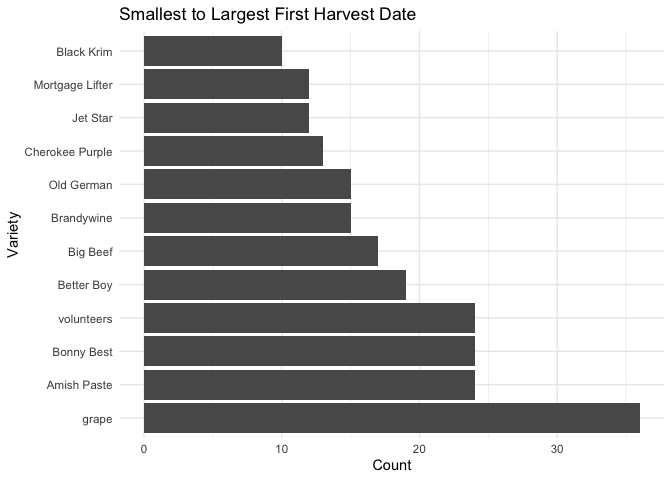<!-- -->
  


  5. In the `garden_harvest` data, create two new variables: one that makes the varieties lowercase and another that finds the length of the variety name. Arrange the data by vegetable and length of variety name (smallest to largest), with one row for each vegetable variety. HINT: use `str_to_lower()`, `str_length()`, and `distinct()`.

```r
garden_harvest %>%
  mutate(variety_lower = str_to_lower(variety)) %>%
  mutate(variety_length = str_length(variety)) %>%
  mutate(variety2 = fct_infreq(variety)) %>%
  distinct(vegetable, variety, .keep_all = TRUE) %>%
  arrange(vegetable, variety_length)
```

<div data-pagedtable="false">
  <script data-pagedtable-source type="application/json">
{"columns":[{"label":["vegetable"],"name":[1],"type":["chr"],"align":["left"]},{"label":["variety"],"name":[2],"type":["chr"],"align":["left"]},{"label":["date"],"name":[3],"type":["date"],"align":["right"]},{"label":["weight"],"name":[4],"type":["dbl"],"align":["right"]},{"label":["units"],"name":[5],"type":["chr"],"align":["left"]},{"label":["variety_lower"],"name":[6],"type":["chr"],"align":["left"]},{"label":["variety_length"],"name":[7],"type":["int"],"align":["right"]},{"label":["variety2"],"name":[8],"type":["fctr"],"align":["left"]}],"data":[{"1":"asparagus","2":"asparagus","3":"2020-06-20","4":"20","5":"grams","6":"asparagus","7":"9","8":"asparagus"},{"1":"basil","2":"Isle of Naxos","3":"2020-06-23","4":"5","5":"grams","6":"isle of naxos","7":"13","8":"Isle of Naxos"},{"1":"beans","2":"Bush Bush Slender","3":"2020-07-06","4":"235","5":"grams","6":"bush bush slender","7":"17","8":"Bush Bush Slender"},{"1":"beans","2":"Chinese Red Noodle","3":"2020-08-08","4":"108","5":"grams","6":"chinese red noodle","7":"18","8":"Chinese Red Noodle"},{"1":"beans","2":"Classic Slenderette","3":"2020-08-05","4":"41","5":"grams","6":"classic slenderette","7":"19","8":"Classic Slenderette"},{"1":"beets","2":"leaves","3":"2020-06-11","4":"8","5":"grams","6":"leaves","7":"6","8":"leaves"},{"1":"beets","2":"Sweet Merlin","3":"2020-07-07","4":"10","5":"grams","6":"sweet merlin","7":"12","8":"Sweet Merlin"},{"1":"beets","2":"Gourmet Golden","3":"2020-07-07","4":"62","5":"grams","6":"gourmet golden","7":"14","8":"Gourmet Golden"},{"1":"broccoli","2":"Yod Fah","3":"2020-07-27","4":"372","5":"grams","6":"yod fah","7":"7","8":"Yod Fah"},{"1":"broccoli","2":"Main Crop Bravado","3":"2020-09-09","4":"102","5":"grams","6":"main crop bravado","7":"17","8":"Main Crop Bravado"},{"1":"carrots","2":"Dragon","3":"2020-07-24","4":"80","5":"grams","6":"dragon","7":"6","8":"Dragon"},{"1":"carrots","2":"Bolero","3":"2020-07-30","4":"116","5":"grams","6":"bolero","7":"6","8":"Bolero"},{"1":"carrots","2":"greens","3":"2020-08-29","4":"169","5":"grams","6":"greens","7":"6","8":"greens"},{"1":"carrots","2":"King Midas","3":"2020-07-23","4":"56","5":"grams","6":"king midas","7":"10","8":"King Midas"},{"1":"chives","2":"perrenial","3":"2020-06-17","4":"8","5":"grams","6":"perrenial","7":"9","8":"perrenial"},{"1":"cilantro","2":"cilantro","3":"2020-06-23","4":"2","5":"grams","6":"cilantro","7":"8","8":"cilantro"},{"1":"corn","2":"Dorinny Sweet","3":"2020-08-11","4":"330","5":"grams","6":"dorinny sweet","7":"13","8":"Dorinny Sweet"},{"1":"corn","2":"Golden Bantam","3":"2020-08-15","4":"383","5":"grams","6":"golden bantam","7":"13","8":"Golden Bantam"},{"1":"cucumbers","2":"pickling","3":"2020-07-08","4":"181","5":"grams","6":"pickling","7":"8","8":"pickling"},{"1":"edamame","2":"edamame","3":"2020-08-11","4":"109","5":"grams","6":"edamame","7":"7","8":"edamame"},{"1":"hot peppers","2":"thai","3":"2020-07-20","4":"12","5":"grams","6":"thai","7":"4","8":"thai"},{"1":"hot peppers","2":"variety","3":"2020-07-20","4":"559","5":"grams","6":"variety","7":"7","8":"variety"},{"1":"jalapeño","2":"giant","3":"2020-07-17","4":"20","5":"grams","6":"giant","7":"5","8":"giant"},{"1":"kale","2":"Heirloom Lacinto","3":"2020-06-13","4":"10","5":"grams","6":"heirloom lacinto","7":"16","8":"Heirloom Lacinto"},{"1":"kohlrabi","2":"Crispy Colors Duo","3":"2020-09-17","4":"191","5":"grams","6":"crispy colors duo","7":"17","8":"Crispy Colors Duo"},{"1":"lettuce","2":"reseed","3":"2020-06-06","4":"20","5":"grams","6":"reseed","7":"6","8":"reseed"},{"1":"lettuce","2":"Tatsoi","3":"2020-06-20","4":"18","5":"grams","6":"tatsoi","7":"6","8":"Tatsoi"},{"1":"lettuce","2":"mustard greens","3":"2020-06-29","4":"23","5":"grams","6":"mustard greens","7":"14","8":"mustard greens"},{"1":"lettuce","2":"Lettuce Mixture","3":"2020-07-22","4":"23","5":"grams","6":"lettuce mixture","7":"15","8":"Lettuce Mixture"},{"1":"lettuce","2":"Farmer's Market Blend","3":"2020-06-11","4":"12","5":"grams","6":"farmer's market blend","7":"21","8":"Farmer's Market Blend"},{"1":"onions","2":"Delicious Duo","3":"2020-07-16","4":"50","5":"grams","6":"delicious duo","7":"13","8":"Delicious Duo"},{"1":"onions","2":"Long Keeping Rainbow","3":"2020-07-20","4":"102","5":"grams","6":"long keeping rainbow","7":"20","8":"Long Keeping Rainbow"},{"1":"peas","2":"Magnolia Blossom","3":"2020-06-17","4":"8","5":"grams","6":"magnolia blossom","7":"16","8":"Magnolia Blossom"},{"1":"peas","2":"Super Sugar Snap","3":"2020-06-17","4":"121","5":"grams","6":"super sugar snap","7":"16","8":"Super Sugar Snap"},{"1":"peppers","2":"green","3":"2020-08-04","4":"81","5":"grams","6":"green","7":"5","8":"green"},{"1":"peppers","2":"variety","3":"2020-07-24","4":"68","5":"grams","6":"variety","7":"7","8":"variety"},{"1":"potatoes","2":"purple","3":"2020-08-06","4":"317","5":"grams","6":"purple","7":"6","8":"purple"},{"1":"potatoes","2":"yellow","3":"2020-08-06","4":"439","5":"grams","6":"yellow","7":"6","8":"yellow"},{"1":"potatoes","2":"Russet","3":"2020-09-16","4":"629","5":"grams","6":"russet","7":"6","8":"Russet"},{"1":"pumpkins","2":"saved","3":"2020-09-01","4":"4758","5":"grams","6":"saved","7":"5","8":"saved"},{"1":"pumpkins","2":"New England Sugar","3":"2020-09-19","4":"1109","5":"grams","6":"new england sugar","7":"17","8":"New England Sugar"},{"1":"pumpkins","2":"Cinderella's Carraige","3":"2020-09-01","4":"7350","5":"grams","6":"cinderella's carraige","7":"21","8":"Cinderella's Carraige"},{"1":"radish","2":"Garden Party Mix","3":"2020-06-06","4":"36","5":"grams","6":"garden party mix","7":"16","8":"Garden Party Mix"},{"1":"raspberries","2":"perrenial","3":"2020-06-29","4":"30","5":"grams","6":"perrenial","7":"9","8":"perrenial"},{"1":"spinach","2":"Catalina","3":"2020-06-11","4":"9","5":"grams","6":"catalina","7":"8","8":"Catalina"},{"1":"squash","2":"delicata","3":"2020-09-19","4":"307","5":"grams","6":"delicata","7":"8","8":"delicata"},{"1":"squash","2":"Red Kuri","3":"2020-09-19","4":"1178","5":"grams","6":"red kuri","7":"8","8":"Red Kuri"},{"1":"squash","2":"Blue (saved)","3":"2020-09-01","4":"3227","5":"grams","6":"blue (saved)","7":"12","8":"Blue (saved)"},{"1":"squash","2":"Waltham Butternut","3":"2020-09-19","4":"1834","5":"grams","6":"waltham butternut","7":"17","8":"Waltham Butternut"},{"1":"strawberries","2":"perrenial","3":"2020-06-18","4":"40","5":"grams","6":"perrenial","7":"9","8":"perrenial"},{"1":"Swiss chard","2":"Neon Glow","3":"2020-06-21","4":"19","5":"grams","6":"neon glow","7":"9","8":"Neon Glow"},{"1":"tomatoes","2":"grape","3":"2020-07-11","4":"24","5":"grams","6":"grape","7":"5","8":"grape"},{"1":"tomatoes","2":"Big Beef","3":"2020-07-21","4":"137","5":"grams","6":"big beef","7":"8","8":"Big Beef"},{"1":"tomatoes","2":"Jet Star","3":"2020-07-28","4":"315","5":"grams","6":"jet star","7":"8","8":"Jet Star"},{"1":"tomatoes","2":"Bonny Best","3":"2020-07-21","4":"339","5":"grams","6":"bonny best","7":"10","8":"Bonny Best"},{"1":"tomatoes","2":"Better Boy","3":"2020-07-24","4":"220","5":"grams","6":"better boy","7":"10","8":"Better Boy"},{"1":"tomatoes","2":"Old German","3":"2020-07-28","4":"611","5":"grams","6":"old german","7":"10","8":"Old German"},{"1":"tomatoes","2":"Brandywine","3":"2020-08-01","4":"320","5":"grams","6":"brandywine","7":"10","8":"Brandywine"},{"1":"tomatoes","2":"Black Krim","3":"2020-08-01","4":"436","5":"grams","6":"black krim","7":"10","8":"Black Krim"},{"1":"tomatoes","2":"volunteers","3":"2020-08-04","4":"73","5":"grams","6":"volunteers","7":"10","8":"volunteers"},{"1":"tomatoes","2":"Amish Paste","3":"2020-07-25","4":"463","5":"grams","6":"amish paste","7":"11","8":"Amish Paste"},{"1":"tomatoes","2":"Cherokee Purple","3":"2020-07-24","4":"247","5":"grams","6":"cherokee purple","7":"15","8":"Cherokee Purple"},{"1":"tomatoes","2":"Mortgage Lifter","3":"2020-07-27","4":"801","5":"grams","6":"mortgage lifter","7":"15","8":"Mortgage Lifter"},{"1":"zucchini","2":"Romanesco","3":"2020-07-06","4":"175","5":"grams","6":"romanesco","7":"9","8":"Romanesco"}],"options":{"columns":{"min":{},"max":[10]},"rows":{"min":[10],"max":[10]},"pages":{}}}
  </script>
</div>

  6. In the `garden_harvest` data, find all distinct vegetable varieties that have "er" or "ar" in their name. HINT: `str_detect()` with an "or" statement (use the | for "or") and `distinct()`.


```r
garden_harvest %>%
  mutate(has_ar_er = str_detect(variety, "er") | str_detect(variety, "ar")) %>%
  distinct(variety, has_ar_er)
```

<div data-pagedtable="false">
  <script data-pagedtable-source type="application/json">
{"columns":[{"label":["variety"],"name":[1],"type":["chr"],"align":["left"]},{"label":["has_ar_er"],"name":[2],"type":["lgl"],"align":["right"]}],"data":[{"1":"reseed","2":"FALSE"},{"1":"Garden Party Mix","2":"TRUE"},{"1":"Farmer's Market Blend","2":"TRUE"},{"1":"Catalina","2":"FALSE"},{"1":"leaves","2":"FALSE"},{"1":"Heirloom Lacinto","2":"FALSE"},{"1":"Magnolia Blossom","2":"FALSE"},{"1":"Super Sugar Snap","2":"TRUE"},{"1":"perrenial","2":"TRUE"},{"1":"Tatsoi","2":"FALSE"},{"1":"asparagus","2":"TRUE"},{"1":"Neon Glow","2":"FALSE"},{"1":"cilantro","2":"FALSE"},{"1":"Isle of Naxos","2":"FALSE"},{"1":"mustard greens","2":"TRUE"},{"1":"Romanesco","2":"FALSE"},{"1":"Bush Bush Slender","2":"TRUE"},{"1":"Gourmet Golden","2":"FALSE"},{"1":"Sweet Merlin","2":"TRUE"},{"1":"pickling","2":"FALSE"},{"1":"grape","2":"FALSE"},{"1":"Delicious Duo","2":"FALSE"},{"1":"giant","2":"FALSE"},{"1":"thai","2":"FALSE"},{"1":"variety","2":"TRUE"},{"1":"Long Keeping Rainbow","2":"FALSE"},{"1":"Big Beef","2":"FALSE"},{"1":"Bonny Best","2":"FALSE"},{"1":"Lettuce Mixture","2":"FALSE"},{"1":"King Midas","2":"FALSE"},{"1":"Cherokee Purple","2":"TRUE"},{"1":"Better Boy","2":"TRUE"},{"1":"Dragon","2":"FALSE"},{"1":"Amish Paste","2":"FALSE"},{"1":"Mortgage Lifter","2":"TRUE"},{"1":"Yod Fah","2":"FALSE"},{"1":"Old German","2":"TRUE"},{"1":"Jet Star","2":"TRUE"},{"1":"Bolero","2":"TRUE"},{"1":"Brandywine","2":"FALSE"},{"1":"Black Krim","2":"FALSE"},{"1":"volunteers","2":"TRUE"},{"1":"green","2":"FALSE"},{"1":"Classic Slenderette","2":"TRUE"},{"1":"purple","2":"FALSE"},{"1":"yellow","2":"FALSE"},{"1":"Chinese Red Noodle","2":"FALSE"},{"1":"edamame","2":"FALSE"},{"1":"Dorinny Sweet","2":"FALSE"},{"1":"Golden Bantam","2":"FALSE"},{"1":"greens","2":"FALSE"},{"1":"saved","2":"FALSE"},{"1":"Blue (saved)","2":"FALSE"},{"1":"Cinderella's Carraige","2":"TRUE"},{"1":"Main Crop Bravado","2":"FALSE"},{"1":"Russet","2":"FALSE"},{"1":"Crispy Colors Duo","2":"FALSE"},{"1":"delicata","2":"FALSE"},{"1":"Waltham Butternut","2":"TRUE"},{"1":"Red Kuri","2":"FALSE"},{"1":"New England Sugar","2":"TRUE"}],"options":{"columns":{"min":{},"max":[10]},"rows":{"min":[10],"max":[10]},"pages":{}}}
  </script>
</div>


## Bicycle-Use Patterns

In this activity, you'll examine some factors that may influence the use of bicycles in a bike-renting program.  The data come from Washington, DC and cover the last quarter of 2014.

<center>

{300px}


{300px}

</center>

Two data tables are available:

- `Trips` contains records of individual rentals
- `Stations` gives the locations of the bike rental stations

Here is the code to read in the data. We do this a little differently than usualy, which is why it is included here rather than at the top of this file. To avoid repeatedly re-reading the files, start the data import chunk with `{r cache = TRUE}` rather than the usual `{r}`.


```r
data_site <- 
  "https://www.macalester.edu/~dshuman1/data/112/2014-Q4-Trips-History-Data.rds" 
Trips <- readRDS(gzcon(url(data_site)))
Stations<-read_csv("http://www.macalester.edu/~dshuman1/data/112/DC-Stations.csv")
```

```
## Parsed with column specification:
## cols(
##   name = col_character(),
##   lat = col_double(),
##   long = col_double(),
##   nbBikes = col_double(),
##   nbEmptyDocks = col_double()
## )
```

**NOTE:** The `Trips` data table is a random subset of 10,000 trips from the full quarterly data. Start with this small data table to develop your analysis commands. **When you have this working well, you should access the full data set of more than 600,000 events by removing `-Small` from the name of the `data_site`.**

### Temporal patterns

It's natural to expect that bikes are rented more at some times of day, some days of the week, some months of the year than others. The variable `sdate` gives the time (including the date) that the rental started. Make the following plots and interpret them:

  7. A density plot, which is a smoothed out histogram, of the events versus `sdate`. Use `geom_density()`.
  

```r
Trips %>% 
  ggplot(aes(x=sdate)) +
  geom_density() +
  labs(x="Month", 
       y="Density",
       title="Bike Rental Use Over Time")
```

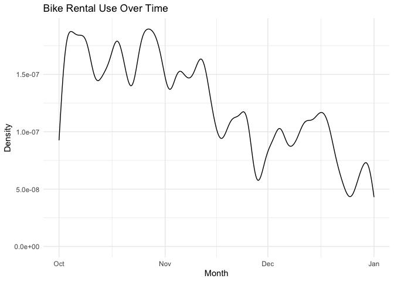<!-- -->

This density plot shows that the majority of tirps were taken in October and as the weather got colder the number of trips taken decreases, however it does not provide any further detail about time of day.   
  
  8. A density plot of the events versus time of day.  You can use `mutate()` with `lubridate`'s  `hour()` and `minute()` functions to extract the hour of the day and minute within the hour from `sdate`. Hint: A minute is 1/60 of an hour, so create a variable where 3:30 is 3.5 and 3:45 is 3.75.
  

```r
Trips %>%
  mutate(time_of_day = hour(sdate) + (minute(sdate)/60)) %>%
    ggplot(aes(x = time_of_day)) +
    geom_density() +
  labs(x="Time of Day", 
       y="Trips",
       title="Bike Rental Use Over Time")
```

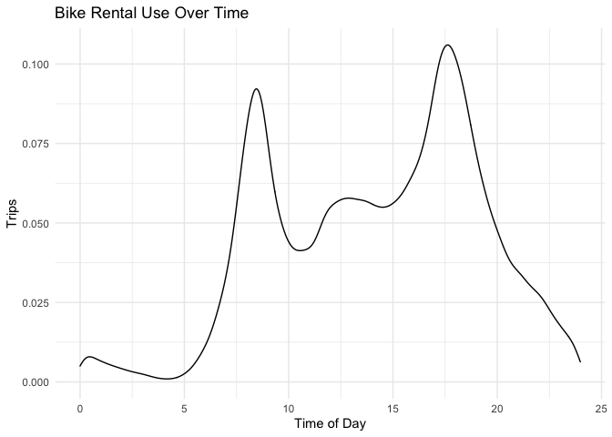<!-- -->
  
This graph shows that most trips are taken at the beginning and end of the work day (around 7am and 6pm). This is probably because people use the bikes to commute to and from work. 

  9. A bar graph of the events versus day of the week. Put day on the y-axis.
  

```r
Trips %>%
  mutate(day_week =  wday(sdate, label=TRUE)) %>%
  ggplot(aes(y=day_week)) +
  geom_bar() +
   labs(x="Trips", 
       y="Day of Week",
       title="Bike Rental Use Over Time by Day of Week")
```

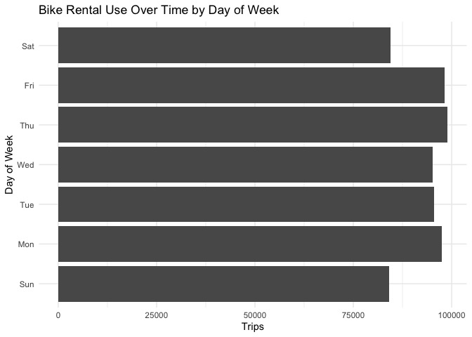<!-- -->

This graph shows that most trips are taken during the week. It is pretty consistant the amount of trips taken across the weekend and weekday.   
  
  
  10. Facet your graph from exercise 8. by day of the week. Is there a pattern?
  

```r
Trips %>%
  mutate(day_week =  wday(sdate, label=TRUE)) %>%
  mutate(time_of_day = hour(sdate) + (minute(sdate)/60)) %>%
    ggplot(aes(x = time_of_day)) +
    geom_density() +
  facet_wrap(~day_week)+ labs(x="Trips", 
       y="Time of Day",
       title="Bike Rental Use by Time of Day and by Day of Week")
```

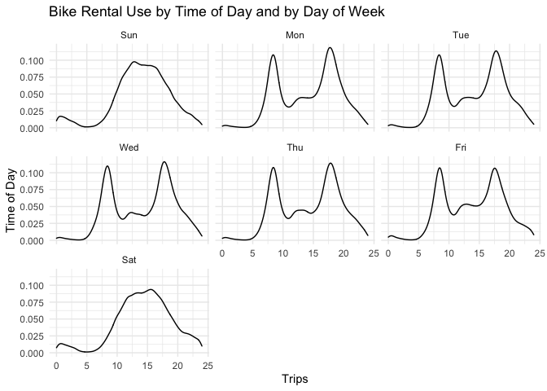<!-- -->
  
  
  
These graphs show an interesting pattern that helps us understand when trips are taken the most. For the weekdays most trips are taken around 7 am and 5 pm. This makes sense because during the work week people may be using the bikes to get to and from work every day. Similarly, on the weekends the bikes are used all day and there is not a specific peak like during the weekdays.   
  
The variable `client` describes whether the renter is a regular user (level `Registered`) or has not joined the bike-rental organization (`Causal`). The next set of exercises investigate whether these two different categories of users show different rental behavior and how `client` interacts with the patterns you found in the previous exercises. Repeat the graphic from Exercise \@ref(exr:exr-temp) (d) with the following changes:

  11. Change the graph from exercise 10 to set the `fill` aesthetic for `geom_density()` to the `client` variable. You should also set `alpha = .5` for transparency and `color=NA` to suppress the outline of the density function.
  

```r
Trips %>%
  mutate(time_of_day = hour(sdate) + (minute(sdate)/60)) %>%
  mutate(days_of_week = wday(sdate, label = TRUE)) %>%
    ggplot(aes(x = time_of_day, fill=client), color="NA", alpha = 0.5) +
    geom_density() +
    facet_wrap(~days_of_week) +
    labs(title = "Bike Rental Use by Time of Day and by Day of Week",
        x = "Time of The Day",
        y = "Density")
```

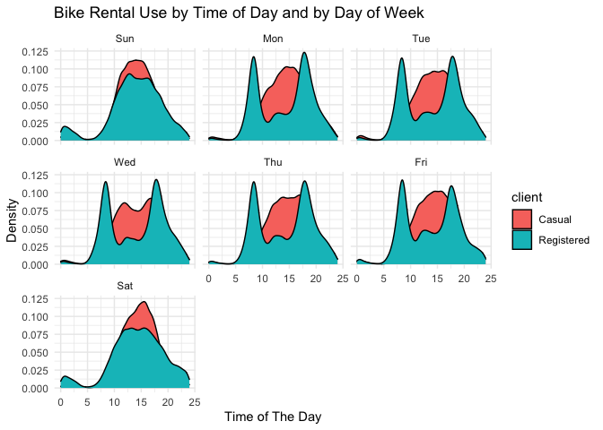<!-- -->

This graph shows that registered riders are more liklely to take out bikes at the beginning and end of the workday while casual riders are more likely to take out a bike throughout the whole date.

  12. Change the previous graph by adding the argument `position = position_stack()` to `geom_density()`. In your opinion, is this better or worse in terms of telling a story? What are the advantages/disadvantages of each?
  

```r
Trips %>%
  mutate(time_of_day = hour(sdate) + (minute(sdate)/60)) %>%
  mutate(days_of_week = wday(sdate, label = TRUE)) %>%
    ggplot(aes(x = time_of_day, fill=client), color="NA", alpha = 0.5) +
    geom_density(position = position_stack()) +
    facet_wrap(~days_of_week) +
    labs(title = "Bike Rental Use by Time of Day and by Day of Week",
        x = "Time of The Day",
        y = "Trips")
```

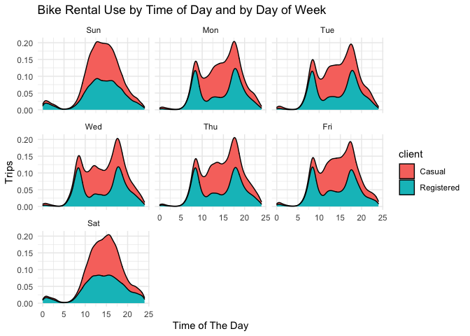<!-- -->
I prefer the geom_density over the position = position_stack() because these graphs are unable to determine when each client type are more likely to use the bikes independently from each other. The previous graphs show the distribution for registered and casual riders. These graphs show the proportion of the rentals depending on which type of client is riding. 
  
  
  13. Add a new variable to the dataset called `weekend` which will be "weekend" if the day is Saturday or Sunday and  "weekday" otherwise (HINT: use the `ifelse()` function and the `wday()` function from `lubridate`). Then, update the graph from the previous problem by faceting on the new `weekend` variable. 
  

```r
Trips %>%
  mutate(time_of_day = hour(sdate) + (minute(sdate)/60)) %>%
  mutate(days_of_week = wday(sdate, label = TRUE)) %>%
  mutate(weekend = ifelse(days_of_week %in% c("Sat", "Sun"), "Weekend", "Weekday")) %>%
  #mutate(weekday = ifelse(days_of_week != c("Sat", "Sun"), "Weekday", "Weekend")) %>%
    ggplot(aes(x = time_of_day, fill=client), color="NA", alpha = 0.5) +
    geom_density(position = position_stack()) +
    facet_wrap(~weekend) +
    labs(title = "Bike Rental Use by Time of Day and by Day of Week",
        x = "Time of The Day",
        y = "Trips")
```

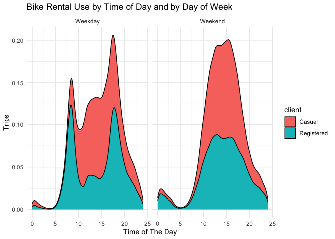<!-- -->
  
This graph further proves that more riders use the bikes to commute during the weekdays, however ride more consistantly throughout the day during the weekends. 
  
  14. Change the graph from the previous problem to facet on `client` and fill with `weekday`. What information does this graph tell you that the previous didn't? Is one graph better than the other?
  

```r
Trips %>%
  mutate(time_of_day = hour(sdate) + (minute(sdate)/60)) %>%
  mutate(days_of_week = wday(sdate, label = TRUE)) %>%
  mutate(weekend = ifelse(days_of_week %in% c("Sat", "Sun"), "Weekend", "Weekday")) %>%
  #mutate(weekday = ifelse(days_of_week != c("Sat", "Sun"), "Weekday", "Weekend")) %>%
    ggplot(aes(x = time_of_day, fill=days_of_week), color="NA", alpha = 0.5) +
    geom_density(position = position_stack()) +
    facet_wrap(~client) +
    labs(title = "Bike Rental Use by Time of Day and by Day of Week",
        x = "Time of The Day",
        y = "Trips")
```

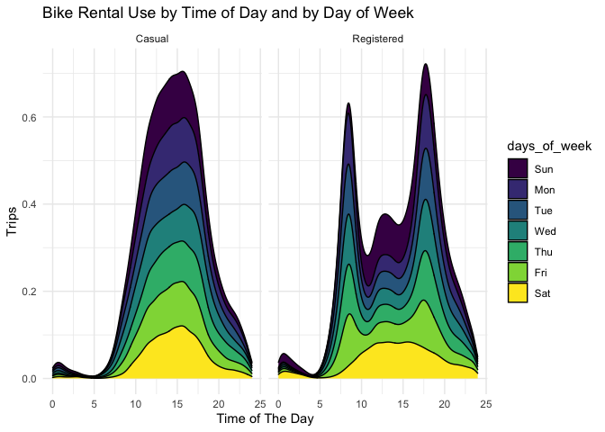<!-- -->
This graph gives us more specific information about individual days of the week. This allows us to determine which days have the most casual and registered users respectively. I believe both graphs give different information that is useful to the user and help answer different questions.    
  
### Spatial patterns

  15. Use the latitude and longitude variables in `Stations` to make a visualization of the total number of departures from each station in the `Trips` data. Use either color or size to show the variation in number of departures. We will improve this plot next week when we learn about maps!

```r
Stations %>%
  left_join(Trips,
            by = c("name" = "sstation")) %>%
  group_by(name) %>% 
  mutate(total_departures = n()) %>% 
  ggplot(aes(x = long, y = lat, color = total_departures)) +
  geom_jitter() +
  labs(title = "Total Departures from Each Rental Location", 
    x = "Longtitude", 
    y ="Latitude")
```

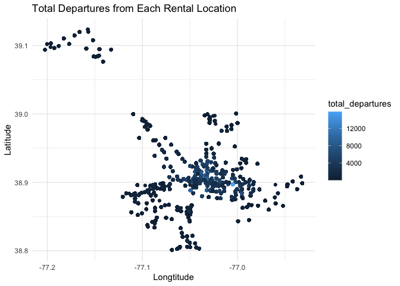<!-- -->

  
  16. Only 14.4% of the trips in our data are carried out by casual users. Create a plot that shows which area(s) have stations with a much higher percentage of departures by casual users. What patterns do you notice? (Again, we'll improve this next week when we learn about maps).
  

```r
Stations %>%
  left_join(Trips,
            by = c("name" = "sstation")) %>%
  group_by(client) %>% 
  mutate(percent_casual= mean(client == "Casual")) %>% 
  ggplot(aes(x = long, y = lat, color = percent_casual)) +
  geom_jitter() +
  labs(title = "Total Departures from Each Rental Location",
       x = "Longtitude",
       y ="Latitute")
```

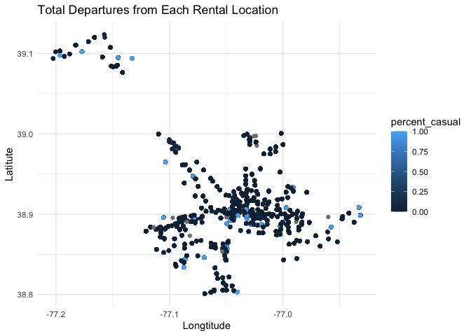<!-- -->
  
A lot of these stations are located in a large clump. This could be because it is located in a city and they need a lot of locations in a smaller area. There also seem to be a lot more registered riders than casual riders as the data suggests.   
  

  
### Spatiotemporal patterns

  17. Make a table with the ten station-date combinations (e.g., 14th & V St., 2014-10-14) with the highest number of departures, sorted from most departures to fewest. Save this to a new dataset and print out the dataset. Hint: `as_date(sdate)` converts `sdate` from date-time format to date format. 

```r
Top_Trips <- Trips %>%
  mutate(trip_date = as_date(sdate)) %>%
  group_by(sstation, trip_date) %>%
  count() %>%
  arrange(desc(n)) %>%
  head(10)

Top_Trips
```

<div data-pagedtable="false">
  <script data-pagedtable-source type="application/json">
{"columns":[{"label":["sstation"],"name":[1],"type":["chr"],"align":["left"]},{"label":["trip_date"],"name":[2],"type":["date"],"align":["right"]},{"label":["n"],"name":[3],"type":["int"],"align":["right"]}],"data":[{"1":"Lincoln Memorial","2":"2014-10-25","3":"386"},{"1":"Lincoln Memorial","2":"2014-10-18","3":"354"},{"1":"Lincoln Memorial","2":"2014-10-26","3":"349"},{"1":"Columbus Circle / Union Station","2":"2014-10-27","3":"345"},{"1":"Lincoln Memorial","2":"2014-10-04","3":"337"},{"1":"Columbus Circle / Union Station","2":"2014-10-02","3":"334"},{"1":"Columbus Circle / Union Station","2":"2014-10-28","3":"333"},{"1":"Lincoln Memorial","2":"2014-10-12","3":"328"},{"1":"Columbus Circle / Union Station","2":"2014-10-09","3":"327"},{"1":"Columbus Circle / Union Station","2":"2014-10-08","3":"322"}],"options":{"columns":{"min":{},"max":[10]},"rows":{"min":[10],"max":[10]},"pages":{}}}
  </script>
</div>
  
  
  18. Use a join operation to make a table with only those trips whose departures match those top ten station-date combinations from the previous part.
  

```r
Top_Trips%>%
  mutate(sdate = as_date(trip_date)) %>%
  left_join(Trips, 
            by = c("sdate"))
```

<div data-pagedtable="false">
  <script data-pagedtable-source type="application/json">
{"columns":[{"label":["sstation.x"],"name":[1],"type":["chr"],"align":["left"]},{"label":["trip_date"],"name":[2],"type":["date"],"align":["right"]},{"label":["n"],"name":[3],"type":["int"],"align":["right"]},{"label":["sdate"],"name":[4],"type":["S3: POSIXct"],"align":["right"]},{"label":["duration"],"name":[5],"type":["chr"],"align":["left"]},{"label":["sstation.y"],"name":[6],"type":["chr"],"align":["left"]},{"label":["edate"],"name":[7],"type":["S3: POSIXct"],"align":["right"]},{"label":["estation"],"name":[8],"type":["chr"],"align":["left"]},{"label":["bikeno"],"name":[9],"type":["chr"],"align":["left"]},{"label":["client"],"name":[10],"type":["chr"],"align":["left"]}],"data":[{"1":"Lincoln Memorial","2":"2014-10-25","3":"386","4":"2014-10-25","5":"0h 5m 31s","6":"10th & Florida Ave NW","7":"2014-10-25 00:06:00","8":"Georgia Ave and Fairmont St NW","9":"W21314","10":"Registered"},{"1":"Lincoln Memorial","2":"2014-10-25","3":"386","4":"2014-10-25","5":"0h 7m 40s","6":"3rd & H St NE","7":"2014-10-25 00:08:00","8":"Gallaudet / 8th St & Florida Ave NE","9":"W00982","10":"Registered"},{"1":"Lincoln Memorial","2":"2014-10-18","3":"354","4":"2014-10-18","5":"0h 4m 25s","6":"16th & Harvard St NW","7":"2014-10-18 00:04:00","8":"Park Rd & Holmead Pl NW","9":"W20793","10":"Registered"},{"1":"Lincoln Memorial","2":"2014-10-18","3":"354","4":"2014-10-18","5":"0h 11m 45s","6":"3000 Connecticut Ave NW / National Zoo","7":"2014-10-18 00:12:00","8":"Idaho Ave & Newark St NW [on 2nd District patio]","9":"W20247","10":"Registered"},{"1":"Lincoln Memorial","2":"2014-10-18","3":"354","4":"2014-10-18","5":"0h 19m 57s","6":"14th St & Spring Rd NW","7":"2014-10-18 00:20:00","8":"15th & P St NW","9":"W21208","10":"Registered"},{"1":"Lincoln Memorial","2":"2014-10-18","3":"354","4":"2014-10-18","5":"0h 27m 45s","6":"USDA / 12th & Independence Ave SW","7":"2014-10-18 00:28:00","8":"Massachusetts Ave & Dupont Circle NW","9":"W20331","10":"Casual"},{"1":"Lincoln Memorial","2":"2014-10-18","3":"354","4":"2014-10-18","5":"0h 8m 36s","6":"14th & R St NW","7":"2014-10-18 00:09:00","8":"New Jersey Ave & R St NW","9":"W20341","10":"Registered"},{"1":"Lincoln Memorial","2":"2014-10-18","3":"354","4":"2014-10-18","5":"0h 8m 32s","6":"14th & R St NW","7":"2014-10-18 00:09:00","8":"New Jersey Ave & R St NW","9":"W20278","10":"Registered"},{"1":"Lincoln Memorial","2":"2014-10-26","3":"349","4":"2014-10-26","5":"0h 11m 50s","6":"15th & P St NW","7":"2014-10-26 00:11:00","8":"14th & Harvard St NW","9":"W01331","10":"Registered"},{"1":"Lincoln Memorial","2":"2014-10-26","3":"349","4":"2014-10-26","5":"0h 21m 49s","6":"Court House Metro / 15th & N Uhle St","7":"2014-10-26 00:22:00","8":"S Arlington Mill Dr & Campbell Ave","9":"W00816","10":"Casual"},{"1":"Lincoln Memorial","2":"2014-10-26","3":"349","4":"2014-10-26","5":"0h 12m 38s","6":"5th & K St NW","7":"2014-10-26 00:12:00","8":"4th & E St SW","9":"W21628","10":"Registered"},{"1":"Lincoln Memorial","2":"2014-10-26","3":"349","4":"2014-10-26","5":"0h 6m 0s","6":"13th & D St NE","7":"2014-10-26 00:06:00","8":"19th & East Capitol St SE","9":"W00067","10":"Registered"},{"1":"Lincoln Memorial","2":"2014-10-26","3":"349","4":"2014-10-26","5":"0h 17m 41s","6":"21st & M St NW","7":"2014-10-26 00:18:00","8":"3rd & H St NE","9":"W00736","10":"Registered"},{"1":"Columbus Circle / Union Station","2":"2014-10-27","3":"345","4":"2014-10-27","5":"0h 21m 53s","6":"Thomas Circle","7":"2014-10-27 00:22:00","8":"5th & K St NW","9":"W20088","10":"Registered"},{"1":"Lincoln Memorial","2":"2014-10-04","3":"337","4":"2014-10-04","5":"0h 6m 29s","6":"1st & M St NE","7":"2014-10-04 00:06:00","8":"Florida Ave & R St NW","9":"W00484","10":"Registered"},{"1":"Lincoln Memorial","2":"2014-10-04","3":"337","4":"2014-10-04","5":"0h 8m 20s","6":"12th & U St NW","7":"2014-10-04 00:08:00","8":"1st & Rhode Island Ave NW","9":"W20663","10":"Registered"},{"1":"Columbus Circle / Union Station","2":"2014-10-02","3":"334","4":"2014-10-02","5":"0h 7m 24s","6":"14th & R St NW","7":"2014-10-02 00:07:00","8":"Convention Center / 7th & M St NW","9":"W20024","10":"Registered"},{"1":"Columbus Circle / Union Station","2":"2014-10-02","3":"334","4":"2014-10-02","5":"0h 4m 7s","6":"M St & Delaware Ave NE","7":"2014-10-02 00:04:00","8":"Eckington Pl & Q St NE","9":"W01186","10":"Registered"},{"1":"Columbus Circle / Union Station","2":"2014-10-02","3":"334","4":"2014-10-02","5":"0h 9m 14s","6":"14th & V St NW","7":"2014-10-02 00:09:00","8":"3rd & Elm St NW","9":"W20823","10":"Registered"},{"1":"Columbus Circle / Union Station","2":"2014-10-02","3":"334","4":"2014-10-02","5":"0h 9m 15s","6":"Ward Circle / American University","7":"2014-10-02 00:10:00","8":"Connecticut Ave & Tilden St NW","9":"W20228","10":"Registered"},{"1":"Columbus Circle / Union Station","2":"2014-10-28","3":"333","4":"2014-10-28","5":"0h 10m 8s","6":"M St & Pennsylvania Ave NW","7":"2014-10-28 00:10:00","8":"34th St & Wisconsin Ave NW","9":"W21146","10":"Registered"},{"1":"Columbus Circle / Union Station","2":"2014-10-28","3":"333","4":"2014-10-28","5":"0h 7m 47s","6":"Minnesota Ave Metro/DOES","7":"2014-10-28 00:08:00","8":"Nannie Helen Burroughs Ave & 49th St NE","9":"W20464","10":"Registered"},{"1":"Columbus Circle / Union Station","2":"2014-10-28","3":"333","4":"2014-10-28","5":"0h 14m 46s","6":"1st & M St NE","7":"2014-10-28 00:15:00","8":"19th & East Capitol St SE","9":"W01243","10":"Registered"},{"1":"Lincoln Memorial","2":"2014-10-12","3":"328","4":"2014-10-12","5":"0h 7m 7s","6":"Columbia Rd & Belmont St NW","7":"2014-10-12 00:07:00","8":"Massachusetts Ave & Dupont Circle NW","9":"W01387","10":"Registered"},{"1":"Lincoln Memorial","2":"2014-10-12","3":"328","4":"2014-10-12","5":"0h 8m 7s","6":"7th & F St NW / National Portrait Gallery","7":"2014-10-12 00:08:00","8":"3rd & H St NE","9":"W21103","10":"Registered"},{"1":"Lincoln Memorial","2":"2014-10-12","3":"328","4":"2014-10-12","5":"0h 18m 9s","6":"6th & H St NE","7":"2014-10-12 00:18:00","8":"Convention Center / 7th & M St NW","9":"W20678","10":"Registered"},{"1":"Lincoln Memorial","2":"2014-10-12","3":"328","4":"2014-10-12","5":"0h 10m 42s","6":"14th St & Spring Rd NW","7":"2014-10-12 00:11:00","8":"Massachusetts Ave & Dupont Circle NW","9":"W01275","10":"Registered"},{"1":"Columbus Circle / Union Station","2":"2014-10-09","3":"327","4":"2014-10-09","5":"NA","6":"NA","7":"<NA>","8":"NA","9":"NA","10":"NA"},{"1":"Columbus Circle / Union Station","2":"2014-10-08","3":"322","4":"2014-10-08","5":"0h 17m 33s","6":"7th & T St NW","7":"2014-10-08 00:17:00","8":"Neal St & Trinidad Ave NE","9":"W01467","10":"Registered"},{"1":"Columbus Circle / Union Station","2":"2014-10-08","3":"322","4":"2014-10-08","5":"0h 14m 34s","6":"Thomas Circle","7":"2014-10-08 00:15:00","8":"15th & P St NW","9":"W00251","10":"Registered"}],"options":{"columns":{"min":{},"max":[10]},"rows":{"min":[10],"max":[10]},"pages":{}}}
  </script>
</div>
  
  19. Build on the code from the previous problem (ie. copy that code below and then %>% into the next step.) and group the trips by client type and day of the week (use the name, not the number). Find the proportion of trips by day within each client type (ie. the proportions for all 7 days within each client type add up to 1). Display your results so day of week is a column and there is a column for each client type. Interpret your results.
  

```r
Trips %>%
  mutate(trip_date = as_date(sdate)) %>%
  inner_join(Top_Trips,
             by = c("sstation", "trip_date")) %>%
  mutate(days_of_week = wday(sdate, label = TRUE)) %>%
  group_by(client, days_of_week) %>%
  summarize(number_riders = n()) %>%
  mutate(total_prop = number_riders/sum(number_riders)) %>%
  pivot_wider(id_cols = days_of_week,
              names_from = client,
              values_from = total_prop)
```

```
## `summarise()` regrouping output by 'client' (override with `.groups` argument)
```

<div data-pagedtable="false">
  <script data-pagedtable-source type="application/json">
{"columns":[{"label":["days_of_week"],"name":[1],"type":["ord"],"align":["right"]},{"label":["Casual"],"name":[2],"type":["dbl"],"align":["right"]},{"label":["Registered"],"name":[3],"type":["dbl"],"align":["right"]}],"data":[{"1":"Sun","2":"0.36132316","3":"0.0591427"},{"1":"Mon","2":"0.02035623","3":"0.1698318"},{"1":"Tue","2":"0.01717557","3":"0.1660336"},{"1":"Wed","2":"0.01081425","3":"0.1654910"},{"1":"Thu","2":"0.02735369","3":"0.3353228"},{"1":"Sat","2":"0.56297710","3":"0.1041780"}],"options":{"columns":{"min":{},"max":[10]},"rows":{"min":[10],"max":[10]},"pages":{}}}
  </script>
</div>

This table shows the percentage that casual and registered riders take out a bike. As the previous questions have suggested, very few casual riders take out bikes during the week, while it is the opposite for registered riders. 


**DID YOU REMEMBER TO GO BACK AND CHANGE THIS SET OF EXERCISES TO THE LARGER DATASET? IF NOT, DO THAT NOW.**

## GitHub link

  20. Below, provide a link to your GitHub page with this set of Weekly Exercises. Specifically, if the name of the file is 03_exercises.Rmd, provide a link to the 03_exercises.md file, which is the one that will be most readable on GitHub.
  


## Challenge problem! 

This problem uses the data from the Tidy Tuesday competition this week, `kids`. If you need to refresh your memory on the data, read about it [here](https://github.com/rfordatascience/tidytuesday/blob/master/data/2020/2020-09-15/readme.md). 

  21. In this exercise, you are going to try to replicate the graph below, created by Georgios Karamanis. I'm sure you can find the exact code on GitHub somewhere, but **DON'T DO THAT!** You will only be graded for putting an effort into this problem. So, give it a try and see how far you can get without doing too much googling. HINT: use `facet_geo()`. The graphic won't load below since it came from a location on my computer. So, you'll have to reference the original html on the moodle page to see it.
  
  

```r
kids %>%
  filter(variable %in% "lib") %>%
  ggplot(aes(x = year, y = inf_adj_perchild)) +
  geom_line(color = "white", size =0.5) +
  theme(legend.position = "dodge") +
  theme_void() +
  theme(plot.background = element_rect(fill = "lightsteelblue4")) +
  facet_geo(vars(state), grid = "us_state_grid3", label = "name") +
  labs(title="Change in public spending on libraries",
       subtitle = "Dollars spent per child, adjusted for inflation")+
  theme(plot.title = element_text(hjust = 0.5, size =20, face = "bold"),
        plot.subtitle = element_text(hjust = 0.5, size = 15))
```

```
## Warning: Using `as.character()` on a quosure is deprecated as of rlang 0.3.0.
## Please use `as_label()` or `as_name()` instead.
## This warning is displayed once per session.
```

```
## Some values in the specified facet_geo column 'state' do not match the
##   'name' column of the specified grid and will be removed: District of
##   Columbia
```

<!-- -->
  


**DID YOU REMEMBER TO UNCOMMENT THE OPTIONS AT THE TOP?**
